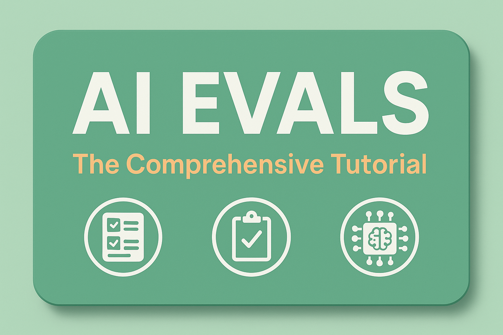

# 🚀 AI Evals: The Comprehensive Tutorial

<div align="center">



**Master the art and science of evaluating AI systems in production**

[](https://opensource.org/licenses/MIT)
[](CONTRIBUTING.md)

</div>

## 🎯 What You'll Learn

This comprehensive tutorial transforms you from someone who "vibes" with AI outputs to a practitioner who builds **data-driven evaluation systems that scale**. Whether you're an ML engineer shipping your first AI feature or a technical PM leading an AI product team, this tutorial provides the frameworks, tools, and real-world examples you need to evaluate AI systems with confidence.

### Learning Outcomes

By completing this tutorial, you will be able to:

- **Design evaluation systems** that catch failures before they reach users
- **Build automated evaluation pipelines** using LLM-as-a-Judge approaches you can actually trust
- **Conduct systematic error analysis** that reveals the highest-ROI improvements
- **Establish production monitoring** that alerts you to quality degradation in real-time
- **Optimize evaluation costs** while maintaining comprehensive coverage
- **Navigate the vendor landscape** with confidence and make informed tool choices

## 🎓 Who This Tutorial Is For

### Primary Audience
- **ML Engineers** building AI products who need to move beyond proof-of-concepts
- **Technical Product Managers** working with AI systems who need data-driven evaluation approaches
- **Engineering Teams** transitioning from manual testing to automated evaluation systems
- **Founders and Leaders** seeking to understand AI failure modes and resource allocation strategies

### Prerequisites
- Comfortable with Python programming (intermediate level)
- Basic understanding of machine learning concepts
- Experience with APIs and web services
- Familiarity with command-line tools

## 📚 Tutorial Structure

### 🏗️ Core Modules

| Module | Focus Area | Key Deliverables | Time Investment |
|--------|------------|-----------------|-----------------|
| [01 - Fundamentals](modules/01-fundamentals/) | Why evaluation matters & lifecycle approach | Evaluation strategy, instrumentation setup | 4-6 hours |
| [02 - Error Analysis](modules/02-error-analysis/) | Systematic error discovery & categorization | Error tracking system, synthetic data pipeline | 6-8 hours |
| [03 - Automated Evaluation](modules/03-automated-evaluation/) | LLM-as-a-Judge & automated pipelines | Automated evaluation framework | 8-10 hours |
| [04 - Collaborative Evaluation](modules/04-collaborative-evaluation/) | Team workflows & annotation strategies | Annotation interface, team processes | 4-6 hours |
| [05 - Architecture-Specific](modules/05-architecture-specific/) | RAG, agents, multi-modal evaluation | Architecture-specific test suites | 6-8 hours |
| [06 - Production Monitoring](modules/06-production-monitoring/) | Continuous evaluation & monitoring | Production monitoring dashboard | 6-8 hours |
| [07 - Human Review](modules/07-human-review/) | Efficient human-in-the-loop systems | Review interface, sampling strategies | 4-6 hours |
| [08 - Cost Optimization](modules/08-cost-optimization/) | Maximizing ROI in evaluation systems | Cost optimization framework | 4-6 hours |
| [09 - Advanced Topics](modules/09-advanced-topics/) | Future-facing evaluation strategies | Research insights, strategic planning | 3-4 hours |

## 🚀 Quick Start

### 1. Clone the Repository
```bash
git clone https://github.com/stretchcloud/ai-eval.git
cd ai-eval
```

### 2. Start with Module 1
```bash
cd modules/01-fundamentals
# Follow the README.md in each module
```

## 📂 Repository Structure

```
ai-evals-tutorial/
├── modules/                    # Core tutorial content
│   ├── 01-fundamentals/        # Module 1: Fundamentals of AI Evaluation
│   │   ├── README.md           # Module overview and navigation
│   │   ├── exercises/          # Hands-on exercises
│   │   ├── case-studies/       # Real-world implementations
│   │   └── templates/          # Ready-to-use frameworks
│   ├── 02-error-analysis/      # Module 2: Systematic Error Analysis
│   ├── 03-automated-evaluation/ # Module 3: Automated Evaluation Systems
│   ├── 04-collaborative-evaluation/ # Module 4: Team-based Evaluation
│   ├── 05-architecture-specific/ # Module 5: Architecture-Specific Strategies
│   ├── 06-production-monitoring/ # Module 6: Production Systems
│   ├── 07-human-review/        # Module 7: Human Review Systems
│   ├── 08-cost-optimization/   # Module 8: Cost Optimization
│   └── 09-advanced-topics/     # Module 9: Advanced Topics
├── assets/                      # Images, diagrams, and media
│   ├── diagrams/               # Technical diagrams and flowcharts
├── resources/                   # Additional learning materials
├── LICENSE                     # MIT License
└── README.md                   # This file
```

## 🛠️ Key Features

### Hands-On Learning
- **50+ Practical Exercises**: Build real evaluation systems step-by-step
- **15+ Case Studies**: Learn from actual production implementations
- **Ready-to-Use Templates**: Accelerate your implementation with proven frameworks

### Production-Ready Code
- **Working Examples**: Every concept includes runnable code
- **Best Practices**: Industry-standard approaches from leading AI teams
- **Tool Integrations**: Examples with popular evaluation platforms

### Visual Learning
- **System Diagrams**: Understand complex architectures at a glance
- **Process Flowcharts**: Follow evaluation workflows step-by-step
- **Dashboard Examples**: See what good monitoring looks like

## 🤝 Contributing

We welcome contributions! Please see our [Contributing Guide](CONTRIBUTING.md) for details on:
- Code of Conduct
- How to submit issues
- How to submit pull requests
- Style guidelines

## 📖 Additional Resources

## 📜 License

This project is licensed under the MIT License - see the [LICENSE](LICENSE) file for details.

## ⭐ Star History

[](https://star-history.com/#stretchcloud/ai-eval&Date)

---

<div align="center">

**Ready to master AI evaluation?**

[**Start with Module 1 →**](modules/01-fundamentals/)

*Building reliable AI systems, one evaluation at a time.*

</div>