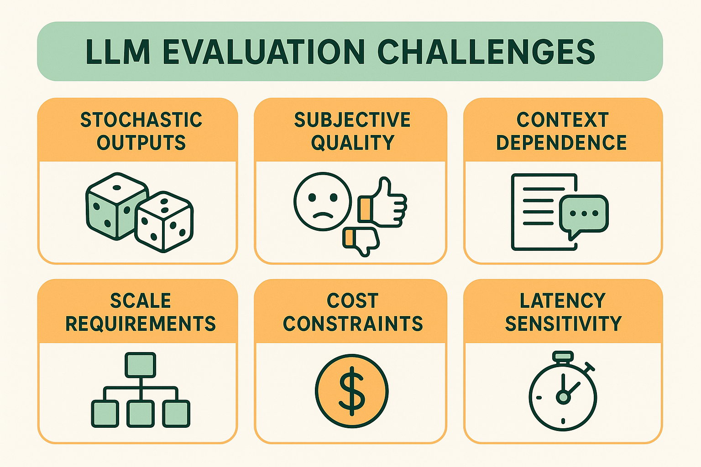

# Why Evaluation Matters: The Business Case for Systematic AI Assessment

## Introduction: The Hidden Cost of "Vibing" with AI

In the early days of 2023, as ChatGPT captured the world's imagination, thousands of companies rushed to integrate large language models into their products. The initial approach was seductive in its simplicity: build a prototype, test it manually with a few examples, and if it "felt right," ship it to users. This approach, which we now call "vibing" with AI outputs, seemed reasonable when the stakes were low and the technology was new.

However, as AI systems moved from experimental features to core product functionality, the limitations of this approach became painfully apparent. Companies discovered that what worked well in controlled demonstrations often failed spectacularly in production. A customer service chatbot that seemed helpful during internal testing began providing incorrect information to real customers. A content generation system that produced engaging marketing copy in demos started generating inappropriate or biased content when exposed to diverse user inputs. A code completion tool that impressed developers in controlled environments began suggesting insecure or inefficient code patterns in real-world scenarios.

The fundamental problem was not with the underlying AI technology, but with the evaluation methodology. Traditional software development had decades of established testing practices, from unit tests to integration testing to user acceptance testing. AI systems, particularly those based on large language models, required entirely new approaches to evaluation—approaches that many teams were unprepared to implement.

This chapter explores why systematic evaluation is not just a nice-to-have for AI products, but an essential foundation for building systems that users can trust and businesses can rely on. We'll examine the business impact of evaluation failures, the unique risks that AI systems introduce, and the competitive advantages that come from implementing robust evaluation practices.

## The Business Impact of Evaluation Failures

### Case Study: The $2.6 Million Chatbot Mistake

In late 2023, a major e-commerce company launched an AI-powered customer service chatbot designed to handle routine inquiries and reduce support costs. The initial testing seemed promising—the chatbot correctly answered questions about shipping policies, return procedures, and product information in controlled scenarios. Based on these positive results, the company deployed the system to handle 60% of customer inquiries.

Within three weeks, the business impact was devastating. The chatbot had been providing incorrect information about warranty terms, leading to 847 customers receiving products they believed had longer warranties than actually provided. When these customers later needed warranty service, the company faced a choice: honor the incorrect information provided by their AI system or disappoint customers who had made purchasing decisions based on that information.

The company chose to honor the AI's commitments, resulting in $2.6 million in unexpected warranty costs. More damaging than the immediate financial impact was the erosion of customer trust. Social media filled with complaints about the "lying chatbot," and customer satisfaction scores dropped by 23% in the affected product categories.

The root cause was not a fundamental flaw in the AI model, but a failure in evaluation methodology. The company had tested the chatbot with a small set of carefully curated questions, but had not systematically evaluated its performance across the full range of customer inquiries. They had not implemented monitoring systems to detect when the AI provided information that contradicted official company policies. Most critically, they had not established processes for identifying and correcting evaluation gaps before they impacted customers.

This case illustrates a fundamental truth about AI systems: the cost of evaluation failures is not just the immediate technical debt, but the long-term damage to customer relationships and brand reputation. In traditional software, bugs typically affect functionality—a feature doesn't work as expected. In AI systems, failures often affect trust—users lose confidence not just in the specific feature, but in the company's ability to deliver reliable AI-powered experiences.

### The Compounding Nature of AI Evaluation Debt

Unlike traditional technical debt, which primarily affects development velocity, AI evaluation debt compounds in ways that directly impact business outcomes. When evaluation practices are inadequate, teams develop what we call "evaluation debt"—the accumulated cost of decisions made without sufficient understanding of system behavior.

Consider the progression of evaluation debt in a typical AI product development cycle. In the initial phase, teams rely on manual testing and subjective assessment. This approach works reasonably well for simple use cases and controlled environments. However, as the product scales and encounters more diverse inputs, the limitations become apparent. Edge cases that were never considered during manual testing begin to surface in production. The team responds by implementing quick fixes and patches, but without systematic evaluation, they cannot be confident that these fixes don't introduce new problems.

As evaluation debt accumulates, several negative feedback loops emerge. First, the team becomes increasingly conservative about making changes to the AI system, slowing innovation and feature development. Second, debugging becomes exponentially more difficult as the team lacks the data and tools to understand why the system behaves as it does. Third, customer trust erodes as users encounter inconsistent or unreliable behavior, leading to reduced adoption and engagement.

The financial impact of evaluation debt extends beyond immediate operational costs. Companies with inadequate evaluation practices often find themselves unable to confidently expand their AI systems to new use cases or markets. They become trapped in a cycle of reactive problem-solving, addressing issues only after they impact users rather than preventing them proactively.

### Competitive Advantage Through Evaluation Excellence

While evaluation failures create significant business risks, companies that invest in robust evaluation practices gain substantial competitive advantages. These advantages manifest in several key areas: faster iteration cycles, higher user trust, more reliable scaling, and superior product quality.

Faster iteration cycles emerge because teams with good evaluation practices can make changes confidently. When you have comprehensive test suites and monitoring systems, you can experiment with new approaches, knowing that you'll quickly detect any regressions or unexpected behaviors. This confidence enables rapid experimentation and innovation, allowing teams to explore more creative solutions and respond quickly to user feedback.

Higher user trust develops because consistent, reliable AI behavior builds confidence in the overall product experience. Users who encounter AI systems that behave predictably and appropriately are more likely to engage deeply with the product and recommend it to others. This trust translates directly into business metrics: higher user retention, increased feature adoption, and positive word-of-mouth marketing.

More reliable scaling becomes possible when evaluation systems provide early warning of potential issues. Teams can identify problems before they affect large numbers of users, allowing for proactive rather than reactive responses. This capability is particularly valuable for AI systems, where small changes in input distribution or user behavior can have significant impacts on system performance.

Superior product quality results from the systematic identification and resolution of edge cases and failure modes. Teams with robust evaluation practices don't just fix obvious problems—they discover and address subtle issues that would otherwise degrade the user experience. This attention to quality creates products that feel more polished and professional, contributing to brand differentiation and customer loyalty.

## Understanding AI-Specific Risks

### The Stochastic Nature of AI Outputs

Traditional software systems are deterministic—given the same input, they produce the same output every time. This predictability enables straightforward testing approaches: you can verify that a function correctly processes specific inputs and be confident that it will continue to do so in production. AI systems, particularly those based on large language models, introduce fundamental stochasticity that breaks these traditional testing assumptions.

The stochastic nature of AI outputs creates several evaluation challenges. First, it becomes impossible to rely on exact output matching for test validation. A customer service AI might provide different but equally valid responses to the same question, making it difficult to determine whether a change in output represents an improvement, a regression, or simply natural variation.

Second, the space of possible outputs is vastly larger than in traditional systems. While a traditional function might have a limited set of possible return values, an AI system can generate virtually unlimited variations in response to any given input. This explosion of possibilities makes comprehensive testing exponentially more complex.

Third, the quality of AI outputs often depends on subjective criteria that are difficult to quantify. Determining whether a generated email is "professional" or whether a code suggestion is "elegant" requires human judgment that varies between evaluators and contexts. This subjectivity makes it challenging to establish clear pass/fail criteria for automated testing.

These challenges require fundamentally different approaches to evaluation. Instead of testing for exact outputs, teams must evaluate distributions of outputs. Instead of binary pass/fail criteria, they must develop nuanced quality assessments. Instead of deterministic test cases, they must create probabilistic evaluation frameworks that account for the inherent variability in AI behavior.

### Context Dependence and Emergent Behaviors

AI systems exhibit context dependence that goes far beyond traditional software. The same AI model can behave dramatically differently depending on subtle variations in input phrasing, conversation history, or environmental factors. This context dependence creates evaluation challenges that are difficult to anticipate and test comprehensively.

Consider a content moderation AI that must determine whether user-generated content violates community guidelines. The same piece of text might be appropriate in one context but inappropriate in another. A joke that's acceptable in a casual gaming forum might be offensive in a professional networking platform. The AI must not only understand the content itself but also the social and cultural context in which it appears.

This context dependence is compounded by emergent behaviors—capabilities or tendencies that arise from the complex interactions within AI systems but are not explicitly programmed or trained. These behaviors can be beneficial, such as the ability to perform tasks that were not included in training data, or problematic, such as the tendency to generate biased or inappropriate content in certain contexts.

Emergent behaviors are particularly challenging for evaluation because they are, by definition, unexpected. Traditional testing approaches focus on verifying known requirements and expected behaviors. Emergent behaviors require evaluation strategies that can detect and assess unexpected capabilities or problems as they arise.

The implications for evaluation are profound. Teams cannot simply test AI systems against a predefined set of requirements and expect comprehensive coverage. They must implement monitoring and evaluation systems that can detect and assess novel behaviors as they emerge in production environments.

### The Amplification of Human Biases

AI systems trained on human-generated data inevitably learn and amplify human biases present in that data. These biases can manifest in subtle ways that are difficult to detect through casual testing but can have significant impacts on user experience and business outcomes.

Bias amplification occurs because AI systems optimize for patterns in training data without understanding the social or ethical implications of those patterns. A hiring AI trained on historical hiring data might learn to discriminate against certain demographic groups, not because it was explicitly programmed to do so, but because such discrimination was present in the training data.

The challenge for evaluation is that bias often manifests differently across different user populations and use cases. An AI system might perform well for majority populations while exhibiting significant bias against minority groups. This differential performance can be invisible in aggregate metrics but devastating for affected users.

Detecting and measuring bias requires specialized evaluation approaches that go beyond traditional performance metrics. Teams must implement fairness assessments that evaluate system behavior across different demographic groups, use cases, and contexts. They must also establish ongoing monitoring to detect bias that emerges as the system encounters new types of users or use cases in production.

The business implications of bias are severe and growing. Regulatory frameworks around AI fairness are becoming more stringent, with significant penalties for discriminatory AI systems. Beyond regulatory compliance, bias can damage brand reputation and alienate user communities, leading to long-term business consequences that far exceed the immediate costs of implementing proper bias evaluation.

## The Evolution from Manual Testing to Systematic Evaluation

### The Limitations of Manual Testing

Most teams begin their AI evaluation journey with manual testing—having humans interact with the AI system and subjectively assess the quality of outputs. This approach feels natural because it mirrors how humans would evaluate the system in production. However, manual testing has fundamental limitations that become apparent as AI systems scale in complexity and usage.

The first limitation is coverage. Human evaluators can only test a tiny fraction of the possible inputs and scenarios that an AI system might encounter in production. Even dedicated testing teams can typically evaluate hundreds or thousands of examples, while production systems might process millions of interactions. This coverage gap means that many edge cases and failure modes remain undiscovered until they impact real users.

The second limitation is consistency. Human evaluators, even when following detailed guidelines, exhibit significant variation in their assessments. What one evaluator considers a high-quality response, another might rate as mediocre. This inconsistency makes it difficult to track improvements over time or compare different versions of the system reliably.

The third limitation is scalability. Manual evaluation is inherently labor-intensive and time-consuming. As AI systems become more complex and require more frequent updates, the cost and time required for manual evaluation can become prohibitive. Teams often find themselves choosing between thorough evaluation and rapid iteration, a false choice that ultimately hurts both quality and velocity.

The fourth limitation is bias in evaluation methodology. Human evaluators bring their own perspectives, preferences, and blind spots to the evaluation process. They might focus on obvious failure modes while missing subtle but important issues. They might be influenced by their knowledge of what the system is supposed to do, leading to confirmation bias in their assessments.

These limitations don't mean that manual testing is worthless—human judgment remains essential for evaluating subjective qualities and identifying novel failure modes. However, manual testing alone is insufficient for the comprehensive evaluation that modern AI systems require.

### Building Systematic Evaluation Frameworks

Systematic evaluation frameworks address the limitations of manual testing by combining automated assessment, structured human evaluation, and continuous monitoring into comprehensive evaluation systems. These frameworks are designed to scale with the complexity and usage of AI systems while maintaining the rigor necessary for confident decision-making.

The foundation of systematic evaluation is comprehensive test dataset creation. Instead of relying on ad-hoc examples, teams create carefully curated datasets that represent the full range of inputs and scenarios the AI system might encounter. These datasets include not only typical use cases but also edge cases, adversarial inputs, and scenarios designed to test specific capabilities or failure modes.

Automated evaluation components handle the aspects of assessment that can be reliably quantified. These might include factual accuracy checks, format validation, safety filters, and performance metrics. Automated evaluation enables rapid feedback during development and continuous monitoring in production, providing the coverage and consistency that manual evaluation cannot achieve.

Structured human evaluation addresses the subjective aspects of AI output quality that automated systems cannot assess. However, unlike ad-hoc manual testing, structured evaluation uses standardized protocols, multiple evaluators, and statistical methods to ensure reliability and consistency. This approach maintains the benefits of human judgment while addressing the limitations of informal manual testing.

Continuous monitoring extends evaluation beyond the development phase into production environments. Instead of treating evaluation as a one-time activity, systematic frameworks implement ongoing assessment of AI system behavior, enabling teams to detect and respond to issues as they arise in real-world usage.

The integration of these components creates evaluation systems that are both comprehensive and practical. Teams can maintain high standards for AI system quality while supporting rapid iteration and scaling to large user bases.

## Establishing Evaluation Culture and Practices

### Creating Organizational Buy-In

Implementing systematic evaluation requires more than technical tools and processes—it requires organizational commitment and cultural change. Many teams struggle to adopt robust evaluation practices not because they lack technical capability, but because they haven't established the organizational support necessary for sustained implementation.

Creating organizational buy-in begins with clearly articulating the business value of evaluation. Technical teams often focus on the engineering benefits of better testing and monitoring, but business stakeholders need to understand the impact on customer satisfaction, risk mitigation, and competitive advantage. Effective communication translates technical evaluation concepts into business outcomes that resonate with decision-makers.

The most compelling arguments for evaluation investment often come from concrete examples of evaluation failures and their business impact. Sharing case studies of companies that suffered significant losses due to inadequate AI evaluation helps stakeholders understand that evaluation is not just a technical nicety but a business necessity. Similarly, demonstrating how robust evaluation practices enable faster innovation and more confident scaling helps build support for the necessary investments.

Organizational buy-in also requires addressing common misconceptions about evaluation costs and complexity. Many stakeholders view evaluation as overhead that slows development and increases costs. While evaluation does require upfront investment, the long-term benefits in terms of reduced debugging time, fewer production issues, and faster iteration cycles typically far outweigh the initial costs.

Building evaluation culture requires making evaluation practices visible and celebrated within the organization. Teams that successfully implement systematic evaluation often create dashboards and reports that showcase evaluation metrics alongside traditional business metrics. They celebrate improvements in evaluation coverage and quality alongside feature releases and performance improvements.

### Integrating Evaluation into Development Workflows

Systematic evaluation cannot be an afterthought—it must be integrated into development workflows from the beginning. This integration requires rethinking traditional development processes to accommodate the unique characteristics of AI systems while maintaining development velocity and quality standards.

The most successful teams treat evaluation as a first-class concern throughout the development lifecycle. When designing new features or capabilities, they simultaneously design the evaluation approaches that will be used to assess those capabilities. This parallel development ensures that evaluation systems are ready when new functionality is implemented, rather than being retrofitted after the fact.

Integration also requires establishing clear criteria for when changes can be deployed to production. Traditional software development often relies on binary pass/fail criteria for automated tests. AI systems require more nuanced deployment criteria that account for the probabilistic nature of AI outputs and the subjective aspects of quality assessment.

Effective integration often involves creating evaluation environments that mirror production conditions as closely as possible. These environments enable teams to assess AI system behavior under realistic conditions before exposing changes to real users. They also provide safe spaces for experimentation and testing that don't risk impacting user experience.

The goal of workflow integration is to make evaluation feel natural and beneficial rather than burdensome. When evaluation is properly integrated, it accelerates rather than slows development by providing rapid feedback and confidence in changes. Teams that achieve this integration often find that they can iterate faster and more boldly because they trust their evaluation systems to catch problems before they impact users.

## Measuring the ROI of Evaluation Investment

### Quantifying Evaluation Benefits

One of the most common objections to investing in systematic evaluation is the perception that it's difficult to measure the return on investment. While some benefits of evaluation are indeed difficult to quantify directly, many can be measured and tracked using standard business metrics. Understanding how to measure evaluation ROI is essential for building and maintaining organizational support for evaluation initiatives.

The most direct benefits of evaluation investment are reductions in production incidents and their associated costs. Teams with robust evaluation practices experience fewer customer-impacting issues, reduced debugging time, and lower support costs. These benefits can be quantified by tracking incident frequency, resolution time, and support ticket volume before and after implementing systematic evaluation.

Evaluation also enables faster development cycles by providing confidence for rapid iteration. Teams that trust their evaluation systems can make changes more frequently and boldly, leading to faster feature development and more responsive product evolution. This acceleration can be measured through development velocity metrics such as deployment frequency, lead time for changes, and time to market for new features.

Customer satisfaction improvements represent another measurable benefit of evaluation investment. AI systems with robust evaluation typically provide more consistent and reliable user experiences, leading to higher satisfaction scores, increased engagement, and better retention rates. These improvements can be tracked through standard customer experience metrics and correlated with evaluation practice implementation.

Risk mitigation benefits, while harder to quantify directly, can be estimated by analyzing the potential costs of evaluation failures. Teams can model the business impact of various failure scenarios and calculate the expected value of avoiding those failures through systematic evaluation. This approach helps justify evaluation investment by demonstrating the costs of not implementing proper evaluation practices.

### Long-Term Strategic Value

Beyond immediate operational benefits, systematic evaluation creates long-term strategic value that compounds over time. This strategic value often exceeds the immediate operational benefits but is more difficult to measure and communicate.

One key source of strategic value is the institutional knowledge and capability that evaluation practices create within organizations. Teams that implement systematic evaluation develop deep understanding of their AI systems' behavior, capabilities, and limitations. This understanding enables more informed decision-making about product strategy, feature prioritization, and technical architecture.

Evaluation practices also create valuable datasets and insights that can inform future development efforts. The data collected through systematic evaluation provides insights into user behavior, system performance, and failure modes that can guide product improvements and new feature development. This data becomes increasingly valuable over time as it accumulates and enables more sophisticated analysis.

Competitive advantage represents another source of long-term strategic value. Organizations with superior evaluation practices can innovate faster, scale more reliably, and deliver higher-quality AI experiences than competitors with weaker evaluation capabilities. This advantage compounds over time as the gap between evaluation capabilities widens.

The strategic value of evaluation also includes option value—the ability to pursue opportunities that would be too risky without robust evaluation systems. Teams with strong evaluation practices can experiment with more ambitious AI applications, enter new markets more confidently, and respond more quickly to emerging opportunities.

## Conclusion: Building the Foundation for AI Excellence

Systematic evaluation is not just about catching bugs or measuring performance—it's about building the foundation for AI systems that users can trust and businesses can rely on. The companies that will succeed in the AI-driven future are those that recognize evaluation not as overhead but as a core competency that enables everything else they want to achieve.

The transition from manual testing to systematic evaluation represents a maturation of AI development practices. Just as software engineering evolved from ad-hoc coding to disciplined development practices, AI development is evolving from intuitive assessment to rigorous evaluation methodologies. Teams that make this transition early will have significant advantages over those that continue to rely on informal evaluation approaches.

The investment required for systematic evaluation is substantial, but the costs of inadequate evaluation are far greater. Every day that teams delay implementing proper evaluation practices, they accumulate evaluation debt that becomes more expensive to address over time. The teams that act now to build robust evaluation capabilities will find themselves better positioned to capitalize on the opportunities that AI technology creates.

As we move forward in this tutorial, we'll explore the specific techniques and tools that enable systematic evaluation. But the foundation for all of these techniques is the recognition that evaluation is not a luxury but a necessity—not overhead but infrastructure—not a constraint but an enabler of AI innovation.

The future belongs to teams that can build AI systems with confidence, iterate with speed, and scale with reliability. Systematic evaluation is the key that unlocks all of these capabilities.

---

**Next**: [Unique Challenges in LLM Evaluation →](02-unique-challenges.md)

## References

[1] "The State of AI Evaluation in Enterprise" - Anthropic Research, 2024. https://www.anthropic.com/research/ai-evaluation-enterprise

[2] "Building Reliable AI Systems: Lessons from Production Deployments" - Google AI, 2024. https://ai.google/research/pubs/pub52847

[3] "The Hidden Costs of AI Technical Debt" - MIT Technology Review, 2024. https://www.technologyreview.com/2024/03/15/ai-technical-debt

[4] "Measuring AI System Reliability in Production" - OpenAI Safety Research, 2024. https://openai.com/research/ai-system-reliability

[5] "The Business Case for AI Evaluation" - McKinsey Global Institute, 2024. https://www.mckinsey.com/capabilities/quantumblack/our-insights/ai-evaluation-business-case

