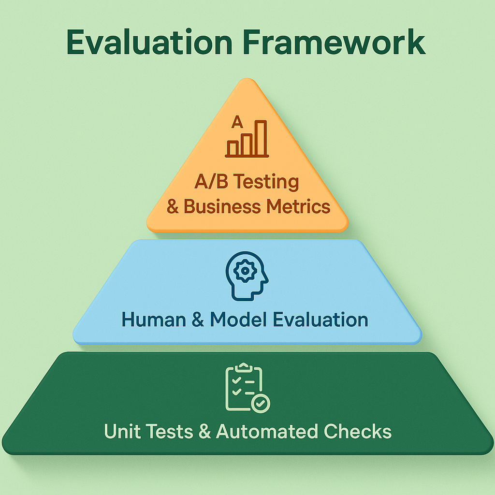

# Unique Challenges in LLM Evaluation: Beyond Traditional Software Testing

## Introduction: Why Traditional Testing Falls Short

When software engineers first encounter large language models, they naturally attempt to apply familiar testing methodologies. They write unit tests that check for specific outputs, create integration tests that verify end-to-end functionality, and implement regression tests that ensure new changes don't break existing behavior. However, these traditional approaches quickly reveal their limitations when applied to LLM-based systems.

The fundamental challenge is that LLMs operate in a fundamentally different paradigm than traditional software. While conventional programs follow deterministic logic paths that produce predictable outputs, LLMs generate responses through complex probabilistic processes that can produce different but equally valid outputs for identical inputs. This shift from deterministic to probabilistic behavior requires entirely new approaches to evaluation and quality assurance.

Consider a simple example: testing a function that calculates the square root of a number. In traditional software, you can verify that `sqrt(16)` returns `4.0` and be confident that this test will pass consistently. Now consider testing an LLM-powered customer service system that responds to the query "How do I return a product?" The system might respond with "You can return products within 30 days by visiting our returns page" on one invocation and "To return an item, please go to your account and select the return option within 30 days of purchase" on another. Both responses are correct, helpful, and appropriate, but they're different enough that traditional exact-match testing would fail.

This example illustrates the core challenge: LLM evaluation requires assessing the quality and appropriateness of responses rather than their exact content. This shift from content verification to quality assessment introduces complexity that traditional testing frameworks are not designed to handle.

## The Stochastic Output Challenge

### Understanding Non-Deterministic Behavior

The stochastic nature of LLM outputs represents perhaps the most fundamental departure from traditional software behavior. This non-determinism arises from several sources within the model architecture and inference process, each contributing to the variability that makes traditional testing approaches inadequate.

At the most basic level, LLMs use sampling techniques during text generation that introduce randomness into the output process. Even with identical inputs and model parameters, the sampling process can lead to different token selections, resulting in varied outputs. This variability is not a bug but a feature—it enables LLMs to generate diverse, creative responses rather than repetitive, mechanical outputs.

Temperature settings and other sampling parameters provide some control over this variability, but they cannot eliminate it entirely without severely constraining the model's capabilities. Lower temperature settings reduce randomness but can lead to repetitive or overly conservative outputs. Higher temperature settings increase creativity and diversity but also increase the likelihood of unexpected or inappropriate responses.

The implications for evaluation are profound. Traditional software testing relies on the assumption that identical inputs will produce identical outputs, enabling straightforward verification through exact matching. LLM evaluation must instead focus on assessing whether outputs fall within acceptable ranges of quality, appropriateness, and correctness, regardless of their specific content.

This shift requires developing new evaluation methodologies that can assess output quality across multiple dimensions simultaneously. Instead of asking "Is this output exactly what we expected?" evaluators must ask "Is this output helpful, accurate, appropriate, and aligned with our objectives?" This multidimensional assessment is inherently more complex and subjective than traditional binary pass/fail testing.

### Developing Robust Evaluation Strategies

Addressing stochastic outputs requires evaluation strategies that embrace rather than fight against the inherent variability in LLM behavior. The most effective approaches focus on statistical assessment of output distributions rather than individual output verification.

One successful strategy involves generating multiple outputs for each test input and assessing the distribution of responses. Instead of testing whether a single response meets quality criteria, this approach evaluates whether the majority of responses meet those criteria and whether the variation in responses falls within acceptable bounds. This statistical approach provides more robust assessment of system behavior while accounting for the natural variability in LLM outputs.

Another effective strategy involves developing evaluation criteria that focus on essential qualities rather than specific content. Instead of testing for exact phrases or structures, evaluators assess whether responses demonstrate key characteristics such as helpfulness, accuracy, appropriateness, and alignment with brand voice. These criteria can be applied consistently across varied outputs while accommodating the natural diversity in LLM responses.

Semantic similarity assessment represents another important tool for handling stochastic outputs. By using embedding models or other semantic comparison techniques, evaluators can determine whether different outputs convey similar meanings or serve similar purposes, even when their surface-level content differs significantly. This approach enables more nuanced assessment that captures the functional equivalence of varied responses.

The key insight is that stochastic outputs require probabilistic evaluation approaches. Just as LLMs generate responses through probabilistic processes, evaluation systems must assess those responses using statistical methods that account for inherent variability while maintaining rigorous quality standards.

## Context Dependence and Nuanced Understanding

### The Complexity of Contextual Appropriateness

LLM outputs are highly dependent on context in ways that go far beyond simple input-output relationships. The same query can require dramatically different responses depending on the user's background, the conversation history, the application domain, and countless other contextual factors. This context dependence creates evaluation challenges that are difficult to anticipate and systematically address.

Consider a content moderation system that must determine whether user-generated content is appropriate for a platform. The phrase "That's sick!" might be perfectly acceptable slang expressing enthusiasm in a gaming forum but inappropriate in a healthcare discussion platform. The same text requires different moderation decisions based on the social and cultural context in which it appears.

This contextual complexity extends beyond obvious examples to subtle variations that can significantly impact the appropriateness of responses. A customer service AI might need to adjust its tone and approach based on the customer's emotional state, the complexity of their issue, their relationship history with the company, and the urgency of their situation. These contextual factors are often implicit rather than explicit, requiring the AI system to infer appropriate responses from limited information.

The evaluation challenge is that context dependence makes it impossible to create comprehensive test suites that cover all possible scenarios. The number of potential contexts grows exponentially with the complexity of the application domain, making exhaustive testing impractical. Traditional testing approaches that rely on predefined test cases cannot adequately address this complexity.

### Developing Context-Aware Evaluation Frameworks

Addressing context dependence requires evaluation frameworks that can assess appropriateness across diverse contexts while remaining practical to implement and maintain. The most successful approaches combine systematic context modeling with adaptive evaluation criteria that can adjust to different scenarios.

Context modeling involves identifying and categorizing the key contextual factors that influence appropriate system behavior. This might include user demographics, conversation history, application domain, cultural context, and situational factors. By explicitly modeling these contexts, evaluation frameworks can systematically assess system behavior across different scenarios rather than relying on ad-hoc testing.

Adaptive evaluation criteria adjust assessment standards based on contextual factors. Instead of applying uniform standards across all scenarios, these frameworks recognize that different contexts may require different quality thresholds or evaluation dimensions. A customer service AI might be evaluated more strictly for accuracy when handling billing inquiries but more leniently for creativity when providing product recommendations.

Scenario-based testing represents another important approach to context-aware evaluation. Instead of testing individual inputs in isolation, this approach creates realistic scenarios that include relevant contextual information and assess system behavior within those scenarios. This approach provides more realistic evaluation while ensuring that important contextual factors are considered.

The goal is not to eliminate context dependence—which would severely limit the capabilities of LLM systems—but to develop evaluation approaches that can systematically assess contextual appropriateness while remaining practical to implement and maintain.

## Subjective Quality Assessment

### The Challenge of Quantifying Subjective Criteria

Many of the most important qualities of LLM outputs are inherently subjective and difficult to quantify using traditional metrics. Characteristics such as helpfulness, creativity, empathy, professionalism, and brand alignment cannot be measured through simple automated checks but require human judgment that varies between evaluators and contexts.

This subjectivity creates significant challenges for systematic evaluation. Traditional software testing relies heavily on objective, quantifiable criteria that can be automatically verified. LLM evaluation must incorporate subjective assessment while maintaining the rigor and consistency necessary for reliable quality assurance.

The subjectivity challenge is compounded by the fact that different stakeholders may have different perspectives on what constitutes quality. Engineers might prioritize technical accuracy and consistency, while product managers focus on user experience and business alignment. Customer service representatives might emphasize empathy and problem-solving effectiveness, while legal teams prioritize compliance and risk mitigation.

These different perspectives are not necessarily contradictory, but they highlight the multidimensional nature of LLM output quality. Effective evaluation frameworks must accommodate multiple quality dimensions while providing clear guidance for making trade-offs when different dimensions conflict.

### Structured Approaches to Subjective Evaluation

Addressing subjective quality assessment requires structured approaches that maintain the benefits of human judgment while improving consistency and reliability. The most effective strategies combine standardized evaluation protocols with statistical methods that account for inter-evaluator variability.

Rubric-based evaluation provides one successful approach to structuring subjective assessment. By developing detailed rubrics that define quality criteria and provide examples of different quality levels, evaluation frameworks can improve consistency between evaluators while maintaining the nuanced assessment that subjective criteria require. These rubrics serve as training tools for evaluators and reference guides for consistent assessment.

Multi-evaluator assessment addresses the variability inherent in subjective evaluation by having multiple evaluators assess the same outputs and using statistical methods to combine their assessments. This approach can identify cases where evaluators disagree significantly, highlighting outputs that may require additional review or clarification of evaluation criteria.

Calibration exercises help improve consistency between evaluators by having them assess the same set of outputs and discussing their reasoning. These exercises identify systematic differences in evaluation approaches and provide opportunities for training and alignment. Regular calibration helps maintain consistency as evaluation teams grow and evolve.

The key insight is that subjective evaluation can be made more reliable and consistent through structured approaches, even though it cannot be made completely objective. The goal is not to eliminate human judgment but to make it more systematic and reliable.

## Scale and Performance Considerations

### Evaluation at Production Scale

LLM systems in production often process millions of interactions daily, creating evaluation challenges that are fundamentally different from those encountered during development. The scale of production systems makes comprehensive manual evaluation impossible while introducing new failure modes and edge cases that may not have been apparent during smaller-scale testing.

The volume challenge is perhaps the most obvious: human evaluators cannot assess millions of outputs daily, making automated evaluation essential for production monitoring. However, automated evaluation systems must be carefully designed to capture the nuanced quality criteria that matter for user experience while operating at the speed and scale required for production systems.

Latency considerations add another layer of complexity to production evaluation. While development-time evaluation can afford to be thorough and time-consuming, production evaluation must provide rapid feedback to enable real-time monitoring and response. This constraint requires careful trade-offs between evaluation comprehensiveness and system performance.

The diversity of production inputs also creates evaluation challenges. While development testing typically focuses on anticipated use cases and carefully crafted test scenarios, production systems encounter the full range of human creativity and unpredictability. Users find ways to interact with systems that developers never anticipated, creating edge cases and failure modes that are difficult to predict and test for in advance.

### Designing Scalable Evaluation Architectures

Addressing scale and performance challenges requires evaluation architectures that can operate efficiently at production scale while maintaining the quality and comprehensiveness necessary for reliable assessment. The most successful approaches combine multiple evaluation strategies with different trade-offs between speed, coverage, and depth.

Real-time evaluation focuses on rapid assessment of critical quality dimensions that can be evaluated quickly and automatically. This might include safety filters, format validation, and basic coherence checks that can be applied to every output without significantly impacting system performance. Real-time evaluation provides immediate feedback and can prevent obviously problematic outputs from reaching users.

Sampling-based evaluation applies more comprehensive assessment to a representative subset of outputs, providing deeper insight into system behavior without the performance overhead of evaluating every output. Statistical sampling techniques ensure that the evaluated subset provides reliable insights into overall system performance while keeping evaluation costs manageable.

Batch evaluation processes outputs offline using more sophisticated and time-consuming evaluation methods. This approach enables comprehensive assessment using complex evaluation criteria that would be too slow for real-time application. Batch evaluation provides detailed insights into system behavior and can identify subtle issues that faster evaluation methods might miss.

The key is designing evaluation architectures that combine these approaches effectively, using real-time evaluation for immediate quality assurance, sampling-based evaluation for ongoing monitoring, and batch evaluation for comprehensive analysis and improvement.

## Emergent Behaviors and Unexpected Capabilities

### Understanding Emergent Phenomena in LLMs

Large language models exhibit emergent behaviors—capabilities and tendencies that arise from the complex interactions within the model but are not explicitly programmed or directly trained. These emergent behaviors can be beneficial, such as the ability to perform reasoning tasks or generate creative content, or problematic, such as the tendency to generate biased or inappropriate responses in certain contexts.

Emergent behaviors are particularly challenging for evaluation because they are, by definition, unexpected. Traditional testing approaches focus on verifying known requirements and expected behaviors. Emergent behaviors require evaluation strategies that can detect and assess novel capabilities or problems as they arise.

The unpredictability of emergent behaviors means that evaluation systems must be designed to discover rather than just verify. Instead of only checking whether the system performs as expected, evaluation frameworks must also monitor for unexpected behaviors and assess their implications for system safety and effectiveness.

This discovery-oriented approach requires evaluation systems that can adapt and evolve as new behaviors are identified. Static test suites and fixed evaluation criteria are insufficient for systems that may develop new capabilities or exhibit new failure modes over time.

### Developing Adaptive Evaluation Systems

Addressing emergent behaviors requires evaluation systems that can adapt to new phenomena while maintaining systematic assessment of known behaviors. The most effective approaches combine proactive monitoring with reactive assessment capabilities that can quickly evaluate newly discovered behaviors.

Anomaly detection represents one important tool for identifying emergent behaviors. By monitoring for outputs that differ significantly from expected patterns, evaluation systems can flag potentially novel behaviors for human review. This approach helps ensure that unexpected behaviors are identified quickly rather than going unnoticed until they impact users.

Exploratory evaluation involves systematically probing system behavior in novel ways to discover emergent capabilities or failure modes. This might include testing with unusual input patterns, exploring edge cases, or deliberately trying to elicit unexpected behaviors. Exploratory evaluation helps teams understand the full range of system capabilities and limitations.

Rapid response evaluation capabilities enable teams to quickly assess newly discovered behaviors and determine their implications. When emergent behaviors are identified, evaluation systems must be able to quickly develop assessment criteria and apply them to determine whether the behaviors are beneficial, neutral, or problematic.

The goal is creating evaluation systems that can evolve with the systems they evaluate, maintaining comprehensive assessment even as those systems develop new capabilities or exhibit new behaviors.

## Integration with Existing Development Workflows

### Adapting Traditional Development Practices

Integrating LLM evaluation into existing development workflows requires adapting traditional practices to accommodate the unique characteristics of AI systems while maintaining development velocity and quality standards. This adaptation involves rethinking familiar concepts such as unit testing, integration testing, and continuous integration in the context of probabilistic, context-dependent systems.

Unit testing for LLM systems cannot rely on exact output matching but must instead focus on essential behavioral characteristics. Instead of testing whether a function returns a specific value, LLM unit tests might verify that outputs meet quality criteria, contain required information, or avoid prohibited content. This shift requires developing new testing frameworks and methodologies that can assess behavioral characteristics rather than specific outputs.

Integration testing becomes more complex when dealing with systems that may behave differently in different contexts or with different input patterns. Traditional integration testing focuses on verifying that system components work together correctly, but LLM integration testing must also verify that the system behaves appropriately across diverse scenarios and contexts.

Continuous integration and deployment practices must be adapted to accommodate the time and complexity requirements of LLM evaluation. While traditional CI/CD pipelines can run quickly and provide immediate feedback, LLM evaluation may require more time for comprehensive assessment and may need to incorporate human evaluation components that cannot be fully automated.

### Building LLM-Aware Development Tools

Successful integration requires development tools that are specifically designed for LLM systems rather than adapted from traditional software development. These tools must accommodate the unique characteristics of LLM evaluation while providing the productivity and reliability benefits that developers expect from their tooling.

Evaluation frameworks specifically designed for LLMs provide the foundation for effective integration. These frameworks understand the probabilistic nature of LLM outputs and provide appropriate abstractions for defining and executing evaluation criteria. They support both automated and human evaluation components and can scale from development testing to production monitoring.

Version control and change management practices must be adapted to handle the complexity of LLM system changes. Unlike traditional software where changes can be precisely specified and their impacts predicted, LLM system changes may have subtle effects that are difficult to anticipate. Development tools must provide better visibility into the impacts of changes and support more sophisticated rollback and rollout strategies.

Monitoring and observability tools must be designed to handle the complexity and scale of LLM systems. Traditional monitoring focuses on performance metrics and error rates, but LLM monitoring must also track quality metrics, bias indicators, and user satisfaction measures. These tools must provide actionable insights that help teams understand and improve system behavior.

## Conclusion: Embracing the Complexity

The unique challenges of LLM evaluation cannot be solved by simply adapting traditional testing approaches. They require fundamentally new methodologies that embrace the probabilistic, context-dependent, and subjective nature of LLM systems while maintaining the rigor and reliability necessary for production deployment.

The key insight is that these challenges are not obstacles to overcome but characteristics to accommodate. The stochastic nature of LLM outputs is not a bug but a feature that enables creativity and diversity. The context dependence is not a limitation but a capability that enables appropriate responses across diverse scenarios. The subjective quality criteria are not imprecision but recognition of the human-centered nature of language and communication.

Successful LLM evaluation requires embracing this complexity while developing systematic approaches that can operate at scale. This means combining automated and human evaluation, using statistical rather than deterministic assessment criteria, and building adaptive systems that can evolve with the systems they evaluate.

The teams that master these evaluation challenges will have significant advantages in building reliable, trustworthy LLM systems. They will be able to iterate faster, scale more confidently, and deliver higher-quality experiences to their users. The investment in understanding and addressing these challenges is not just about better testing—it's about building the foundation for AI systems that can truly serve human needs.

As we continue through this tutorial, we'll explore specific techniques and tools for addressing each of these challenges. But the foundation for all of these techniques is the recognition that LLM evaluation is fundamentally different from traditional software testing and requires new approaches that are specifically designed for the unique characteristics of these systems.

---

**Next**: [The Evaluation Lifecycle →](03-evaluation-lifecycle.md)

## References

[1] "Challenges in Evaluating Large Language Models" - Stanford AI Lab, 2024. https://ai.stanford.edu/blog/llm-evaluation-challenges

[2] "Beyond Accuracy: Holistic Evaluation of Language Models" - Anthropic Research, 2024. https://www.anthropic.com/research/holistic-evaluation

[3] "The Stochastic Nature of AI Systems: Implications for Testing" - Google DeepMind, 2024. https://deepmind.google/research/publications/stochastic-ai-testing

[4] "Context-Aware Evaluation of Conversational AI" - Microsoft Research, 2024. https://www.microsoft.com/en-us/research/publication/context-aware-ai-evaluation

[5] "Emergent Behaviors in Large Language Models: Detection and Assessment" - OpenAI Research, 2024. https://openai.com/research/emergent-behaviors-llms

