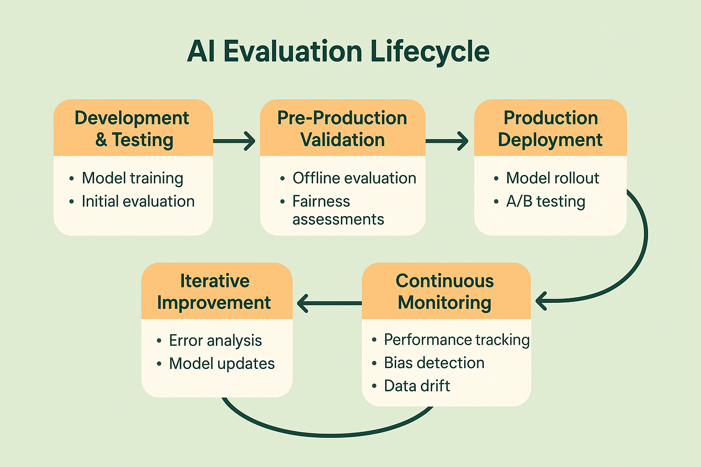

# The Evaluation Lifecycle: From Development to Production

## Introduction: Evaluation as a Continuous Process

Traditional software development treats testing as a discrete phase that occurs before deployment. Code is written, tests are run, bugs are fixed, and the software is released. Once deployed, monitoring focuses primarily on performance metrics and error rates. This linear approach works well for deterministic systems with predictable behavior patterns.

AI systems, particularly those based on large language models, require a fundamentally different approach. The probabilistic nature of AI outputs, the context dependence of appropriate responses, and the potential for emergent behaviors mean that evaluation cannot be confined to a pre-deployment phase. Instead, evaluation must be treated as a continuous process that spans the entire lifecycle of the AI system.

This continuous evaluation approach recognizes that AI systems evolve and adapt over time. User interactions provide new data that can reveal previously unknown edge cases. Changes in user behavior or domain context can affect system performance in unexpected ways. Model updates or infrastructure changes can introduce subtle behavioral shifts that only become apparent through ongoing monitoring.

The evaluation lifecycle framework provides a structured approach to implementing continuous evaluation while maintaining development velocity and system reliability. This framework divides evaluation activities into distinct phases, each with specific objectives, methodologies, and success criteria, while ensuring seamless transitions between phases.

## Phase 1: Development and Initial Testing

### Establishing Evaluation Foundations

The development phase sets the foundation for all subsequent evaluation activities. During this phase, teams establish evaluation criteria, create initial test datasets, and implement basic evaluation infrastructure. The decisions made during this phase have lasting impacts on the effectiveness of the entire evaluation lifecycle.

Evaluation criteria definition represents one of the most critical activities in the development phase. Teams must identify the key dimensions of quality that matter for their specific use case and translate these into measurable criteria. This process requires close collaboration between technical teams, product managers, domain experts, and other stakeholders to ensure that evaluation criteria align with business objectives and user needs.

The challenge in criteria definition is balancing comprehensiveness with practicality. Comprehensive criteria ensure that all important aspects of system behavior are evaluated, but overly complex criteria can become difficult to implement and maintain. The most successful teams start with a core set of essential criteria and expand over time as their evaluation capabilities mature.

Test dataset creation during the development phase focuses on establishing baseline coverage of expected use cases and known edge cases. These datasets serve multiple purposes: they provide immediate feedback during development, establish benchmarks for measuring improvement, and create the foundation for regression testing as the system evolves.

Development-phase datasets typically include carefully curated examples that represent the range of inputs the system is expected to handle. However, teams must resist the temptation to over-optimize for these specific examples. The goal is to create datasets that are representative of real-world usage while being practical to evaluate during rapid development cycles.

### Implementing Rapid Feedback Loops

Development-phase evaluation must provide rapid feedback to support iterative development while maintaining sufficient rigor to catch important issues. This requires implementing evaluation systems that can operate quickly enough to be integrated into development workflows without becoming bottlenecks.

Automated evaluation components provide the fastest feedback and should be implemented first. These might include format validation, safety filters, basic coherence checks, and factual accuracy verification for objective claims. Automated evaluation enables immediate feedback on code changes and can prevent obviously problematic outputs from progressing further in the development process.

Human evaluation during development typically focuses on qualitative assessment of system behavior rather than comprehensive coverage. Development teams might implement daily or weekly evaluation sessions where team members interact with the system and provide structured feedback on output quality, appropriateness, and alignment with objectives.

The key insight for development-phase evaluation is that perfect coverage is less important than rapid iteration. Teams should implement evaluation systems that provide sufficient confidence to make development decisions while being practical enough to use frequently. Comprehensive evaluation can be added in later phases as the system stabilizes.

### Building Evaluation Infrastructure

The development phase is also the optimal time to implement the infrastructure that will support evaluation throughout the system lifecycle. This infrastructure includes data collection systems, evaluation frameworks, and monitoring capabilities that will be essential for later phases.

Data collection infrastructure ensures that all necessary information is captured for evaluation purposes. This includes not just system outputs but also inputs, context information, user feedback, and system performance metrics. The data collection system must be designed to scale with the system while maintaining data quality and privacy protections.

Evaluation frameworks provide the tools and abstractions necessary for implementing and executing evaluation criteria. These frameworks should be designed to accommodate both automated and human evaluation while providing consistent interfaces for different types of assessment. The framework should also support the addition of new evaluation criteria as the system evolves.

Monitoring infrastructure provides the foundation for ongoing evaluation in production environments. While comprehensive monitoring may not be necessary during development, implementing basic monitoring capabilities early ensures that the transition to production evaluation is smooth and that important behavioral changes are detected quickly.

## Phase 2: Pre-Production Validation

### Comprehensive System Assessment

Pre-production validation represents the most comprehensive evaluation phase, where systems undergo thorough assessment before being exposed to real users. This phase combines extensive automated testing with structured human evaluation to identify potential issues and validate system readiness for production deployment.

The scope of pre-production evaluation extends beyond the core AI functionality to include integration testing, performance assessment, safety validation, and bias evaluation. This comprehensive approach ensures that the system will behave appropriately not just in ideal conditions but also under the stress and variability of real-world usage.

Integration testing during pre-production validation focuses on verifying that the AI system works correctly within the broader application ecosystem. This includes testing interactions with databases, APIs, user interfaces, and other system components. Integration testing for AI systems must account for the variability in AI outputs and ensure that downstream systems can handle this variability appropriately.

Performance assessment evaluates the system's ability to meet latency, throughput, and resource utilization requirements under realistic load conditions. AI systems often have different performance characteristics than traditional software, with performance varying based on input complexity, context length, and other factors that are difficult to predict in advance.

### Safety and Bias Validation

Pre-production validation provides the opportunity for comprehensive safety and bias assessment that may not be practical during rapid development cycles. This assessment is critical for identifying potential risks before they impact real users and for ensuring compliance with relevant regulations and ethical guidelines.

Safety validation involves systematic testing for harmful outputs, inappropriate content, and potential misuse scenarios. This testing often requires specialized datasets and evaluation criteria that focus on edge cases and adversarial inputs. Safety validation may also include red-team exercises where evaluators deliberately attempt to elicit problematic behaviors from the system.

Bias evaluation assesses whether the system exhibits unfair or discriminatory behavior toward different user groups or in different contexts. This evaluation requires testing with diverse user populations and scenarios to identify potential disparities in system performance or appropriateness. Bias evaluation is particularly important for systems that will be used by diverse user bases or in sensitive application domains.

The challenge in safety and bias validation is that these issues may be subtle and context-dependent. Comprehensive evaluation requires not just testing with diverse inputs but also analyzing system behavior across different user populations, use cases, and contexts. This analysis often requires specialized expertise and may benefit from external review or audit.

### Stakeholder Review and Approval

Pre-production validation typically includes formal review and approval processes that involve multiple stakeholders beyond the immediate development team. This review ensures that the system meets business requirements, regulatory obligations, and quality standards before deployment.

Technical review focuses on the evaluation results and their implications for system reliability and performance. Technical reviewers assess whether the evaluation methodology is appropriate, whether the results indicate readiness for production deployment, and whether any identified issues require resolution before launch.

Business review evaluates whether the system meets business objectives and user needs. Business reviewers consider factors such as user experience, competitive positioning, market readiness, and alignment with strategic objectives. This review may also include assessment of business risks and mitigation strategies.

Legal and compliance review ensures that the system meets relevant regulatory requirements and organizational policies. This review is particularly important for systems that handle sensitive data, operate in regulated industries, or have potential impacts on user rights or safety.

The approval process should be structured to provide clear criteria for deployment decisions while remaining practical enough to support reasonable development timelines. Teams should establish clear escalation procedures for cases where reviewers disagree or where evaluation results are ambiguous.

## Phase 3: Production Deployment and Monitoring

### Gradual Rollout Strategies

Production deployment of AI systems requires careful orchestration to minimize risk while enabling rapid detection and response to issues. Gradual rollout strategies provide a systematic approach to production deployment that balances the need for comprehensive real-world testing with the imperative to protect user experience.

Canary deployments represent one effective approach to gradual rollout. In canary deployments, the new system is initially exposed to a small percentage of users while the majority continue to use the previous system. This approach enables real-world testing with limited exposure while providing the ability to quickly rollback if issues are detected.

A/B testing provides another valuable approach for production deployment, particularly when the goal is to compare the performance of different system versions. A/B testing enables systematic comparison of user experience, business metrics, and system performance between different approaches while controlling for external factors.

Geographic or demographic rollouts can be effective when the system behavior may vary across different user populations or contexts. These approaches enable teams to validate system performance with specific user groups before broader deployment while providing opportunities to customize the system for different populations if necessary.

The key principle in gradual rollout is maintaining the ability to quickly detect and respond to issues. This requires robust monitoring systems that can identify problems quickly and rollback mechanisms that can be activated rapidly if necessary.

### Real-Time Monitoring and Alerting

Production monitoring for AI systems must go beyond traditional performance metrics to include quality assessment, bias detection, and user satisfaction measurement. This comprehensive monitoring enables teams to detect and respond to issues that may not be apparent through traditional system monitoring.

Quality monitoring involves ongoing assessment of output quality using both automated and human evaluation approaches. Automated quality monitoring might include safety filters, coherence checks, and factual accuracy verification that can be applied to all or a sample of outputs. Human quality monitoring typically involves regular review of system outputs by trained evaluators.

Bias monitoring tracks system performance across different user populations and contexts to detect potential disparities or discriminatory behavior. This monitoring is particularly important for systems that serve diverse user bases or operate in sensitive domains where bias could have significant impacts.

User satisfaction monitoring tracks user feedback, engagement metrics, and other indicators of user experience quality. This monitoring provides direct insight into how users perceive and interact with the AI system, complementing technical quality metrics with user-centered assessment.

Alerting systems must be designed to provide timely notification of issues while avoiding alert fatigue. This requires careful tuning of alert thresholds and clear escalation procedures that ensure appropriate response to different types of issues.

### Continuous Improvement Integration

Production monitoring should be tightly integrated with continuous improvement processes that enable teams to rapidly identify and address issues while systematically improving system performance over time. This integration ensures that monitoring data translates into actionable improvements rather than just passive observation.

Issue detection and triage processes provide systematic approaches to identifying, prioritizing, and addressing issues identified through production monitoring. These processes should include clear criteria for issue severity, escalation procedures, and resolution timelines that ensure appropriate response to different types of problems.

Feedback integration mechanisms enable user feedback and monitoring insights to inform system improvements. This might include processes for incorporating user feedback into training data, updating evaluation criteria based on real-world usage patterns, or adjusting system parameters based on performance monitoring.

Continuous evaluation ensures that system improvements are validated before deployment and that the impact of changes is measured and understood. This evaluation should include both regression testing to ensure that improvements don't introduce new problems and forward-looking assessment to validate that changes achieve their intended objectives.

## Phase 4: Long-Term Evolution and Adaptation

### Adapting to Changing Requirements

AI systems deployed in production environments must adapt to changing user needs, evolving business requirements, and shifting technological landscapes. The evaluation lifecycle must accommodate this evolution while maintaining system reliability and user trust.

Requirement evolution tracking involves monitoring changes in user behavior, business objectives, and external factors that may affect system requirements. This tracking enables teams to proactively adapt evaluation criteria and system behavior rather than reactively responding to problems after they impact users.

Evaluation criteria updates ensure that assessment approaches remain relevant as system requirements evolve. This might involve adding new quality dimensions, adjusting existing criteria, or retiring criteria that are no longer relevant. Criteria updates should be implemented systematically to maintain evaluation consistency while accommodating changing needs.

System adaptation processes provide structured approaches to implementing changes while maintaining evaluation rigor. These processes should include impact assessment, testing protocols, and rollback procedures that ensure changes improve rather than degrade system performance.

### Building Institutional Knowledge

Long-term success in AI evaluation requires building institutional knowledge and capabilities that persist beyond individual team members or projects. This knowledge includes understanding of system behavior patterns, evaluation methodologies, and improvement strategies that enable teams to operate more effectively over time.

Documentation and knowledge management systems capture insights from evaluation activities and make them accessible to current and future team members. This documentation should include not just evaluation results but also the reasoning behind evaluation decisions, lessons learned from past issues, and best practices for different types of evaluation challenges.

Training and capability development ensure that team members have the skills and knowledge necessary to implement effective evaluation practices. This training should cover both technical aspects of evaluation implementation and strategic aspects of evaluation planning and decision-making.

Community and collaboration building enable teams to learn from others facing similar challenges and contribute to the broader understanding of AI evaluation practices. This might involve participation in industry groups, academic collaborations, or open-source evaluation projects.

## Integration Across Lifecycle Phases

### Maintaining Consistency and Continuity

The evaluation lifecycle is most effective when the different phases are well-integrated and mutually reinforcing. This integration requires careful planning to ensure that evaluation approaches are consistent across phases while being appropriate for the specific objectives and constraints of each phase.

Evaluation criteria consistency ensures that the same fundamental quality dimensions are assessed throughout the lifecycle, even as the specific methods and thresholds may vary. This consistency enables meaningful comparison of results across phases and supports coherent decision-making about system readiness and performance.

Data and infrastructure continuity enable evaluation insights from one phase to inform activities in subsequent phases. This might involve using development-phase evaluation data to inform production monitoring strategies or incorporating production monitoring insights into future development cycles.

Process integration ensures that transitions between lifecycle phases are smooth and that important information is not lost during handoffs. This integration requires clear documentation of evaluation results, explicit criteria for phase transitions, and structured communication between teams responsible for different phases.

### Scaling Evaluation Practices

As AI systems grow in complexity and usage, evaluation practices must scale accordingly while maintaining effectiveness and efficiency. This scaling requires careful attention to automation, resource allocation, and organizational capabilities.

Automation scaling involves expanding automated evaluation capabilities to handle increased volume and complexity while maintaining assessment quality. This might involve implementing more sophisticated automated evaluation methods, improving the efficiency of existing approaches, or developing new automation capabilities for previously manual processes.

Resource scaling ensures that evaluation activities have adequate human and computational resources as systems grow. This scaling must balance the need for comprehensive evaluation with practical constraints on cost and complexity.

Organizational scaling involves developing the team structures, processes, and capabilities necessary to support evaluation at scale. This might involve specializing team roles, implementing more sophisticated project management approaches, or developing new training and development programs.

## Conclusion: Evaluation as Strategic Capability

The evaluation lifecycle framework provides a structured approach to implementing comprehensive evaluation while maintaining development velocity and system reliability. However, the framework is most valuable when it's viewed not as a compliance requirement but as a strategic capability that enables better decision-making and faster innovation.

Teams that master the evaluation lifecycle gain significant advantages in building reliable, trustworthy AI systems. They can iterate faster because they have confidence in their evaluation systems. They can scale more reliably because they have systematic approaches to detecting and addressing issues. They can innovate more boldly because they have the safety nets necessary to experiment with new approaches.

The investment required to implement comprehensive evaluation lifecycle practices is substantial, but the benefits compound over time. Teams that establish strong evaluation foundations early find that subsequent development becomes faster and more reliable. They build institutional knowledge and capabilities that enable them to tackle increasingly complex challenges with confidence.

As AI systems become more central to business operations and user experiences, the ability to evaluate and improve these systems systematically will become a core competitive advantage. The teams that develop this capability early will be best positioned to capitalize on the opportunities that AI technology creates.

---

**Next**: [Instrumentation Basics →](04-instrumentation-basics.md)

## References

[1] "Lifecycle Management for AI Systems" - Google AI, 2024. https://ai.google/research/pubs/pub52891

[2] "Continuous Evaluation in Production AI Systems" - Microsoft Research, 2024. https://www.microsoft.com/en-us/research/publication/continuous-ai-evaluation

[3] "From Development to Deployment: AI System Lifecycle Best Practices" - Anthropic, 2024. https://www.anthropic.com/research/ai-lifecycle-practices

[4] "Monitoring and Maintaining AI Systems in Production" - OpenAI, 2024. https://openai.com/research/production-ai-monitoring

[5] "Building Scalable AI Evaluation Infrastructure" - Meta AI Research, 2024. https://ai.meta.com/research/publications/scalable-ai-evaluation

