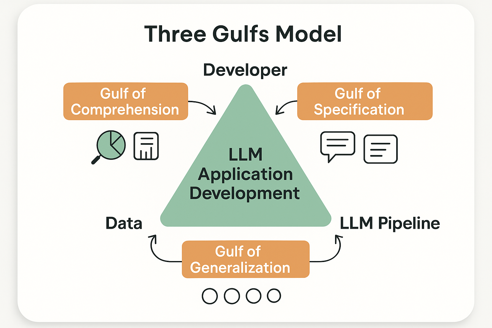

# The Three Gulfs Model: Understanding LLM Development Challenges



*Figure 6: The Three Gulfs Model - A comprehensive framework for understanding and addressing the fundamental challenges in LLM pipeline development, adapted from Shankar et al. (2025).*

## Introduction

The Three Gulfs Model provides a powerful framework for understanding the fundamental challenges that arise when developing LLM applications. Originally adapted from Norman's design principles and refined by Shankar et al. (2025), this model categorizes the major gaps that developers must bridge when building any LLM pipeline. Understanding these gulfs is essential for designing effective evaluation strategies that address the root causes of LLM application failures.

Unlike traditional software development where requirements are typically well-defined and outputs are deterministic, LLM applications introduce unique challenges that span three distinct domains: understanding your data and system behavior, translating intent into precise specifications, and ensuring consistent generalization across diverse inputs. Each gulf represents a different type of challenge that requires specific evaluation approaches and mitigation strategies.

The Three Gulfs Model is particularly valuable because it helps teams diagnose where their evaluation efforts should focus. Rather than applying generic evaluation approaches, teams can identify which gulf is causing their primary challenges and design targeted evaluation strategies that address the specific root causes of their system's failures.

## The Gulf of Comprehension: Developer ↔ Data

### Understanding the Challenge

The Gulf of Comprehension represents the gap between developers and their understanding of both the input data their system will encounter and the actual behavior of their LLM pipeline on that data. This gulf is often the most underestimated challenge in LLM development, yet it's frequently the root cause of evaluation failures.

At scale, it becomes practically impossible to manually review every input or output. Thousands of inputs might arrive daily with diverse formats, varying levels of clarity, and unexpected edge cases. Without systematic approaches to understanding this data landscape, developers operate with incomplete mental models of their system's actual behavior.

**Key Manifestations:**
- **Input Data Blindness**: Not understanding the true distribution and characteristics of production inputs
- **Output Behavior Gaps**: Lack of awareness of subtle failure modes and edge cases in system outputs
- **Scale Overwhelm**: Inability to comprehensively review system behavior at production scale
- **Pattern Invisibility**: Missing important patterns in failures or successes across the input space

### Practical Example: Email Processing Pipeline

Consider an email processing pipeline designed to extract sender names, summarize key requests, and categorize emails. The Gulf of Comprehension manifests in several ways:

**Input Data Challenges:**
- Email formats vary dramatically (plain text, HTML, mixed)
- Sender information appears in different locations and formats
- Cultural differences in communication styles affect request clarity
- Spam and promotional emails create noise in the dataset

**Output Behavior Challenges:**
- The model sometimes extracts public figures mentioned in email bodies as senders
- Summarization quality varies significantly based on email length and complexity
- Categorization becomes inconsistent for emails that span multiple topics
- Edge cases like forwarded emails or automated messages cause unexpected behaviors

### Evaluation Strategies for the Gulf of Comprehension

**Data Profiling and Analysis**
Systematic data profiling helps bridge the comprehension gap by providing quantitative insights into input data characteristics and system behavior patterns.

```python
import pandas as pd
import numpy as np
from typing import Dict, List, Any
from collections import defaultdict
import matplotlib.pyplot as plt
import seaborn as sns

class DataComprehensionAnalyzer:
    """
    Comprehensive framework for analyzing input data and system behavior
    to bridge the Gulf of Comprehension in LLM applications.
    """
    
    def __init__(self):
        self.input_profiles = {}
        self.output_patterns = {}
        self.failure_modes = defaultdict(list)
        
    def profile_input_data(self, data: List[Dict], data_type: str) -> Dict:
        """
        Profile input data to understand distribution characteristics.
        
        Args:
            data: List of input examples
            data_type: Type of data being profiled (e.g., 'emails', 'queries')
            
        Returns:
            Comprehensive data profile with statistics and patterns
        """
        profile = {
            'basic_stats': {},
            'content_analysis': {},
            'format_distribution': {},
            'quality_indicators': {},
            'edge_case_detection': {}
        }
        
        # Basic statistics
        profile['basic_stats'] = {
            'total_samples': len(data),
            'avg_length': np.mean([len(str(item.get('content', ''))) for item in data]),
            'length_distribution': self._analyze_length_distribution(data),
            'unique_patterns': self._identify_unique_patterns(data)
        }
        
        # Content analysis
        profile['content_analysis'] = {
            'language_distribution': self._analyze_languages(data),
            'topic_clusters': self._identify_topic_clusters(data),
            'complexity_scores': self._calculate_complexity_scores(data),
            'sentiment_distribution': self._analyze_sentiment_distribution(data)
        }
        
        # Format distribution
        profile['format_distribution'] = {
            'format_types': self._identify_format_types(data),
            'structure_patterns': self._analyze_structure_patterns(data),
            'encoding_issues': self._detect_encoding_issues(data)
        }
        
        # Quality indicators
        profile['quality_indicators'] = {
            'completeness_scores': self._assess_completeness(data),
            'clarity_scores': self._assess_clarity(data),
            'consistency_scores': self._assess_consistency(data)
        }
        
        # Edge case detection
        profile['edge_case_detection'] = {
            'outliers': self._detect_outliers(data),
            'anomalies': self._detect_anomalies(data),
            'rare_patterns': self._identify_rare_patterns(data)
        }
        
        self.input_profiles[data_type] = profile
        return profile
        
    def analyze_system_behavior(self, inputs: List[Dict], outputs: List[Dict], 
                              system_name: str) -> Dict:
        """
        Analyze system behavior patterns to understand output characteristics.
        
        Args:
            inputs: List of input examples
            outputs: List of corresponding system outputs
            system_name: Name of the system being analyzed
            
        Returns:
            Comprehensive behavior analysis
        """
        behavior_analysis = {
            'output_patterns': {},
            'consistency_analysis': {},
            'failure_detection': {},
            'performance_patterns': {},
            'correlation_analysis': {}
        }
        
        # Output patterns
        behavior_analysis['output_patterns'] = {
            'output_types': self._categorize_output_types(outputs),
            'length_patterns': self._analyze_output_lengths(outputs),
            'format_consistency': self._assess_format_consistency(outputs),
            'content_quality': self._assess_content_quality(outputs)
        }
        
        # Consistency analysis
        behavior_analysis['consistency_analysis'] = {
            'response_variability': self._measure_response_variability(inputs, outputs),
            'format_consistency': self._measure_format_consistency(outputs),
            'quality_consistency': self._measure_quality_consistency(outputs)
        }
        
        # Failure detection
        behavior_analysis['failure_detection'] = {
            'obvious_failures': self._detect_obvious_failures(outputs),
            'subtle_failures': self._detect_subtle_failures(inputs, outputs),
            'failure_patterns': self._identify_failure_patterns(inputs, outputs)
        }
        
        # Performance patterns
        behavior_analysis['performance_patterns'] = {
            'input_complexity_correlation': self._analyze_complexity_correlation(inputs, outputs),
            'performance_by_category': self._analyze_performance_by_category(inputs, outputs),
            'degradation_patterns': self._identify_degradation_patterns(inputs, outputs)
        }
        
        # Correlation analysis
        behavior_analysis['correlation_analysis'] = {
            'input_output_correlations': self._analyze_input_output_correlations(inputs, outputs),
            'success_factor_analysis': self._analyze_success_factors(inputs, outputs),
            'failure_factor_analysis': self._analyze_failure_factors(inputs, outputs)
        }
        
        self.output_patterns[system_name] = behavior_analysis
        return behavior_analysis
        
    def _analyze_length_distribution(self, data: List[Dict]) -> Dict:
        """Analyze the distribution of content lengths."""
        lengths = [len(str(item.get('content', ''))) for item in data]
        return {
            'min_length': min(lengths) if lengths else 0,
            'max_length': max(lengths) if lengths else 0,
            'median_length': np.median(lengths) if lengths else 0,
            'std_length': np.std(lengths) if lengths else 0,
            'percentiles': {
                '25th': np.percentile(lengths, 25) if lengths else 0,
                '75th': np.percentile(lengths, 75) if lengths else 0,
                '95th': np.percentile(lengths, 95) if lengths else 0
            }
        }
        
    def _identify_unique_patterns(self, data: List[Dict]) -> List[str]:
        """Identify unique patterns in the data."""
        patterns = []
        
        # Common patterns to look for
        pattern_checks = [
            ('email_addresses', r'\b[A-Za-z0-9._%+-]+@[A-Za-z0-9.-]+\.[A-Z|a-z]{2,}\b'),
            ('phone_numbers', r'\b\d{3}[-.]?\d{3}[-.]?\d{4}\b'),
            ('urls', r'http[s]?://(?:[a-zA-Z]|[0-9]|[$-_@.&+]|[!*\\(\\),]|(?:%[0-9a-fA-F][0-9a-fA-F]))+'),
            ('dates', r'\b\d{1,2}[/-]\d{1,2}[/-]\d{2,4}\b'),
            ('currency', r'\$\d+(?:,\d{3})*(?:\.\d{2})?')
        ]
        
        for pattern_name, pattern_regex in pattern_checks:
            import re
            matches = sum(1 for item in data if re.search(pattern_regex, str(item.get('content', ''))))
            if matches > 0:
                patterns.append(f"{pattern_name}: {matches} occurrences")
        
        return patterns
        
    def _analyze_languages(self, data: List[Dict]) -> Dict:
        """Analyze language distribution in the data."""
        # Simplified language detection (in practice, use langdetect or similar)
        languages = defaultdict(int)
        
        for item in data:
            content = str(item.get('content', ''))
            # Simple heuristic - in practice use proper language detection
            if any(ord(char) > 127 for char in content):
                languages['non_english'] += 1
            else:
                languages['english'] += 1
                
        return dict(languages)
        
    def _identify_topic_clusters(self, data: List[Dict]) -> List[str]:
        """Identify topic clusters in the data."""
        # Simplified topic identification (in practice, use topic modeling)
        topics = []
        
        # Common topic keywords
        topic_keywords = {
            'support': ['help', 'issue', 'problem', 'support', 'assistance'],
            'sales': ['buy', 'purchase', 'price', 'cost', 'quote'],
            'information': ['information', 'details', 'about', 'explain'],
            'complaint': ['complaint', 'dissatisfied', 'unhappy', 'wrong']
        }
        
        topic_counts = defaultdict(int)
        
        for item in data:
            content = str(item.get('content', '')).lower()
            for topic, keywords in topic_keywords.items():
                if any(keyword in content for keyword in keywords):
                    topic_counts[topic] += 1
        
        return [f"{topic}: {count} instances" for topic, count in topic_counts.items()]
        
    def _calculate_complexity_scores(self, data: List[Dict]) -> Dict:
        """Calculate complexity scores for data items."""
        complexity_scores = []
        
        for item in data:
            content = str(item.get('content', ''))
            
            # Simple complexity heuristics
            word_count = len(content.split())
            sentence_count = content.count('.') + content.count('!') + content.count('?')
            avg_word_length = np.mean([len(word) for word in content.split()]) if content.split() else 0
            
            # Complexity score based on multiple factors
            complexity = (
                (word_count / 100) * 0.4 +  # Length factor
                (sentence_count / 10) * 0.3 +  # Structure factor
                (avg_word_length / 10) * 0.3   # Vocabulary factor
            )
            
            complexity_scores.append(min(complexity, 1.0))  # Cap at 1.0
        
        return {
            'avg_complexity': np.mean(complexity_scores) if complexity_scores else 0,
            'complexity_distribution': {
                'low': sum(1 for score in complexity_scores if score < 0.3),
                'medium': sum(1 for score in complexity_scores if 0.3 <= score < 0.7),
                'high': sum(1 for score in complexity_scores if score >= 0.7)
            }
        }
        
    def _analyze_sentiment_distribution(self, data: List[Dict]) -> Dict:
        """Analyze sentiment distribution in the data."""
        # Simplified sentiment analysis (in practice, use proper sentiment analysis)
        sentiments = defaultdict(int)
        
        positive_words = ['good', 'great', 'excellent', 'happy', 'satisfied', 'love']
        negative_words = ['bad', 'terrible', 'awful', 'unhappy', 'dissatisfied', 'hate']
        
        for item in data:
            content = str(item.get('content', '')).lower()
            
            positive_count = sum(1 for word in positive_words if word in content)
            negative_count = sum(1 for word in negative_words if word in content)
            
            if positive_count > negative_count:
                sentiments['positive'] += 1
            elif negative_count > positive_count:
                sentiments['negative'] += 1
            else:
                sentiments['neutral'] += 1
        
        return dict(sentiments)
        
    def _identify_format_types(self, data: List[Dict]) -> Dict:
        """Identify different format types in the data."""
        format_types = defaultdict(int)
        
        for item in data:
            content = str(item.get('content', ''))
            
            # Simple format detection
            if '<html>' in content.lower() or '<div>' in content.lower():
                format_types['html'] += 1
            elif content.count('\n') > 5:
                format_types['multiline'] += 1
            elif len(content.split()) < 10:
                format_types['short_form'] += 1
            else:
                format_types['plain_text'] += 1
        
        return dict(format_types)
        
    def _analyze_structure_patterns(self, data: List[Dict]) -> List[str]:
        """Analyze structural patterns in the data."""
        patterns = []
        
        # Check for common structural elements
        structure_checks = [
            ('bullet_points', lambda x: '•' in x or '*' in x),
            ('numbered_lists', lambda x: any(f'{i}.' in x for i in range(1, 10))),
            ('headers', lambda x: x.count('#') > 0 or x.count('Subject:') > 0),
            ('signatures', lambda x: 'Best regards' in x or 'Sincerely' in x),
            ('quotes', lambda x: x.count('"') > 1 or x.count("'") > 1)
        ]
        
        for pattern_name, pattern_check in structure_checks:
            count = sum(1 for item in data if pattern_check(str(item.get('content', ''))))
            if count > 0:
                patterns.append(f"{pattern_name}: {count} instances")
        
        return patterns
        
    def _detect_encoding_issues(self, data: List[Dict]) -> Dict:
        """Detect potential encoding issues in the data."""
        encoding_issues = {
            'special_characters': 0,
            'unicode_errors': 0,
            'mixed_encoding': 0
        }
        
        for item in data:
            content = str(item.get('content', ''))
            
            # Check for special characters
            if any(ord(char) > 255 for char in content):
                encoding_issues['special_characters'] += 1
            
            # Check for common encoding error patterns
            if '�' in content or '\\x' in content:
                encoding_issues['unicode_errors'] += 1
            
            # Check for mixed encoding indicators
            if any(pattern in content for pattern in ['á', 'é', 'í', 'ó', 'ú']):
                encoding_issues['mixed_encoding'] += 1
        
        return encoding_issues
        
    def _assess_completeness(self, data: List[Dict]) -> Dict:
        """Assess data completeness."""
        completeness_scores = []
        
        for item in data:
            required_fields = ['content']  # Define required fields
            optional_fields = ['metadata', 'timestamp', 'source']  # Define optional fields
            
            required_score = sum(1 for field in required_fields if item.get(field))
            optional_score = sum(1 for field in optional_fields if item.get(field))
            
            completeness = (required_score / len(required_fields)) * 0.8 + (optional_score / len(optional_fields)) * 0.2
            completeness_scores.append(completeness)
        
        return {
            'avg_completeness': np.mean(completeness_scores) if completeness_scores else 0,
            'completeness_distribution': {
                'complete': sum(1 for score in completeness_scores if score >= 0.9),
                'mostly_complete': sum(1 for score in completeness_scores if 0.7 <= score < 0.9),
                'incomplete': sum(1 for score in completeness_scores if score < 0.7)
            }
        }
        
    def _assess_clarity(self, data: List[Dict]) -> Dict:
        """Assess data clarity."""
        clarity_scores = []
        
        for item in data:
            content = str(item.get('content', ''))
            
            # Simple clarity heuristics
            word_count = len(content.split())
            sentence_count = max(1, content.count('.') + content.count('!') + content.count('?'))
            avg_sentence_length = word_count / sentence_count
            
            # Clarity score (optimal sentence length is around 15-20 words)
            if 10 <= avg_sentence_length <= 25:
                clarity = 1.0
            elif 5 <= avg_sentence_length < 10 or 25 < avg_sentence_length <= 35:
                clarity = 0.7
            else:
                clarity = 0.4
            
            clarity_scores.append(clarity)
        
        return {
            'avg_clarity': np.mean(clarity_scores) if clarity_scores else 0,
            'clarity_distribution': {
                'clear': sum(1 for score in clarity_scores if score >= 0.8),
                'moderate': sum(1 for score in clarity_scores if 0.5 <= score < 0.8),
                'unclear': sum(1 for score in clarity_scores if score < 0.5)
            }
        }
        
    def _assess_consistency(self, data: List[Dict]) -> Dict:
        """Assess data consistency."""
        # Check for consistent formatting, structure, and style
        format_consistency = len(set(type(item.get('content', '')) for item in data)) == 1
        
        # Check for consistent field presence
        field_sets = [set(item.keys()) for item in data]
        field_consistency = len(set(frozenset(fields) for fields in field_sets)) == 1
        
        consistency_score = (format_consistency + field_consistency) / 2
        
        return {
            'overall_consistency': consistency_score,
            'format_consistency': format_consistency,
            'field_consistency': field_consistency
        }
        
    def _detect_outliers(self, data: List[Dict]) -> List[Dict]:
        """Detect outlier examples in the data."""
        outliers = []
        
        # Length-based outliers
        lengths = [len(str(item.get('content', ''))) for item in data]
        if lengths:
            q1, q3 = np.percentile(lengths, [25, 75])
            iqr = q3 - q1
            lower_bound = q1 - 1.5 * iqr
            upper_bound = q3 + 1.5 * iqr
            
            for i, item in enumerate(data):
                content_length = len(str(item.get('content', '')))
                if content_length < lower_bound or content_length > upper_bound:
                    outliers.append({
                        'index': i,
                        'type': 'length_outlier',
                        'value': content_length,
                        'bounds': [lower_bound, upper_bound]
                    })
        
        return outliers
        
    def _detect_anomalies(self, data: List[Dict]) -> List[Dict]:
        """Detect anomalous patterns in the data."""
        anomalies = []
        
        for i, item in enumerate(data):
            content = str(item.get('content', ''))
            
            # Check for various anomaly patterns
            anomaly_checks = [
                ('empty_content', len(content.strip()) == 0),
                ('excessive_repetition', self._has_excessive_repetition(content)),
                ('unusual_characters', self._has_unusual_characters(content)),
                ('malformed_structure', self._is_malformed_structure(content))
            ]
            
            for anomaly_type, is_anomaly in anomaly_checks:
                if is_anomaly:
                    anomalies.append({
                        'index': i,
                        'type': anomaly_type,
                        'content_preview': content[:100] + '...' if len(content) > 100 else content
                    })
        
        return anomalies
        
    def _has_excessive_repetition(self, content: str) -> bool:
        """Check if content has excessive repetition."""
        words = content.split()
        if len(words) < 10:
            return False
        
        # Check for repeated phrases
        for i in range(len(words) - 2):
            phrase = ' '.join(words[i:i+3])
            if content.count(phrase) > 3:
                return True
        
        return False
        
    def _has_unusual_characters(self, content: str) -> bool:
        """Check if content has unusual character patterns."""
        # Check for excessive special characters
        special_char_ratio = sum(1 for char in content if not char.isalnum() and char not in ' .,!?;:') / max(len(content), 1)
        return special_char_ratio > 0.3
        
    def _is_malformed_structure(self, content: str) -> bool:
        """Check if content has malformed structure."""
        # Simple checks for malformed structure
        return (
            content.count('(') != content.count(')') or
            content.count('[') != content.count(']') or
            content.count('{') != content.count('}') or
            content.count('"') % 2 != 0
        )
        
    def _identify_rare_patterns(self, data: List[Dict]) -> List[str]:
        """Identify rare patterns that might be important."""
        rare_patterns = []
        
        # Look for patterns that appear in less than 5% of data
        threshold = max(1, len(data) * 0.05)
        
        pattern_counts = defaultdict(int)
        
        for item in data:
            content = str(item.get('content', ''))
            
            # Check for various patterns
            if '@' in content and '.com' in content:
                pattern_counts['email_mentions'] += 1
            if any(word in content.lower() for word in ['urgent', 'asap', 'immediately']):
                pattern_counts['urgency_indicators'] += 1
            if any(word in content.lower() for word in ['confidential', 'private', 'secret']):
                pattern_counts['confidentiality_indicators'] += 1
            if content.count('$') > 0:
                pattern_counts['monetary_mentions'] += 1
        
        for pattern, count in pattern_counts.items():
            if count < threshold:
                rare_patterns.append(f"{pattern}: {count} occurrences (rare)")
        
        return rare_patterns

# Additional helper methods for output analysis would continue here...

def demonstrate_comprehension_analysis():
    """Demonstrate the data comprehension analysis framework."""
    
    # Sample email data for demonstration
    sample_emails = [
        {
            'content': 'Hi, I need help with my account. Can you please reset my password? Thanks, John',
            'metadata': {'source': 'support_email', 'timestamp': '2024-01-15'}
        },
        {
            'content': 'URGENT: Please process my refund request immediately. Order #12345. Very dissatisfied!',
            'metadata': {'source': 'complaint_email', 'timestamp': '2024-01-16'}
        },
        {
            'content': 'Hello, I would like to inquire about your premium pricing plans. Could you send me a detailed quote? Best regards, Sarah Johnson, CEO of TechCorp',
            'metadata': {'source': 'sales_inquiry', 'timestamp': '2024-01-17'}
        }
    ]
    
    analyzer = DataComprehensionAnalyzer()
    
    # Profile the input data
    input_profile = analyzer.profile_input_data(sample_emails, 'customer_emails')
    
    print("Data Comprehension Analysis Results:")
    print(f"Total samples: {input_profile['basic_stats']['total_samples']}")
    print(f"Average length: {input_profile['basic_stats']['avg_length']:.1f} characters")
    print(f"Language distribution: {input_profile['content_analysis']['language_distribution']}")
    print(f"Topic clusters: {input_profile['content_analysis']['topic_clusters']}")
    
    return analyzer, input_profile

if __name__ == "__main__":
    analyzer, profile = demonstrate_comprehension_analysis()
    print("Data comprehension analysis framework demonstrated successfully.")
```

**Systematic Sampling and Review**
To bridge the Gulf of Comprehension at scale, teams need systematic approaches to sampling and reviewing representative examples from their data and system outputs.

**Sampling Strategies:**
- **Stratified Sampling**: Sample across different input categories, time periods, and user segments
- **Error-Focused Sampling**: Oversample cases where the system is likely to fail
- **Edge Case Sampling**: Specifically sample unusual or boundary cases
- **Temporal Sampling**: Sample across different time periods to detect drift
- **Performance-Based Sampling**: Sample based on confidence scores or other performance indicators

### Bridging the Gulf of Comprehension

**Continuous Data Monitoring**
Implement systems that continuously monitor input data characteristics and system behavior to detect changes and emerging patterns.

**Collaborative Review Processes**
Establish regular review sessions where team members examine representative samples of inputs and outputs to build shared understanding.

**Documentation and Knowledge Sharing**
Create living documentation that captures insights about data characteristics, system behavior patterns, and common failure modes.

## The Gulf of Specification: Developer ↔ LLM Pipeline

### Understanding the Challenge

The Gulf of Specification represents the gap between what developers intend their LLM system to do and what they actually specify through prompts, instructions, and system design. This gulf is particularly challenging because natural language specifications are inherently ambiguous, and LLMs cannot infer unstated requirements.

Unlike traditional software where specifications can be precise and unambiguous, LLM applications require natural language instructions that must be both comprehensive and clear. The challenge is compounded by the fact that LLMs will make assumptions about unstated requirements, often in ways that seem reasonable but don't match the developer's intent.

**Key Manifestations:**
- **Underspecified Prompts**: Instructions that leave critical details unstated
- **Ambiguous Requirements**: Specifications that can be interpreted in multiple ways
- **Implicit Assumptions**: Unstated expectations about system behavior
- **Context Misalignment**: Prompts that don't account for the full range of input contexts
- **Output Format Inconsistency**: Unclear specifications about desired output structure and style

### Practical Example: Email Processing Specification

Consider this seemingly clear prompt for email processing:

```
Extract the sender's name and summarize the key requests in this email.
```

This prompt leaves many critical questions unanswered:

**Sender Name Extraction:**
- Should it be the display name, email address, or both?
- How should it handle emails with multiple senders?
- What about forwarded emails or automated messages?
- How should it handle names with special characters or non-Latin scripts?

**Request Summarization:**
- Should the summary be a paragraph or bulleted list?
- How long should the summary be?
- Should it include implicit requests or only explicit ones?
- How should it handle emails with no clear requests?
- Should it prioritize requests by importance?

**Output Format:**
- What structure should the output follow?
- How should it handle cases where extraction fails?
- Should it include confidence scores or metadata?

### Evaluation Strategies for the Gulf of Specification

**Prompt Engineering and Testing Framework**
Systematic approaches to developing and testing prompts help bridge the specification gap by making requirements explicit and testable.

```python
import json
from typing import Dict, List, Any, Optional, Tuple
from dataclasses import dataclass
from enum import Enum
import re

class SpecificationClarity(Enum):
    CLEAR = "clear"
    AMBIGUOUS = "ambiguous"
    UNDERSPECIFIED = "underspecified"
    CONFLICTING = "conflicting"

@dataclass
class PromptSpecification:
    """Represents a structured prompt specification."""
    task_description: str
    input_format: str
    output_format: str
    constraints: List[str]
    examples: List[Dict[str, str]]
    edge_case_handling: Dict[str, str]
    quality_criteria: List[str]

@dataclass
class SpecificationGap:
    """Represents an identified gap in prompt specification."""
    gap_type: str
    description: str
    impact: str
    suggested_fix: str
    examples: List[str]

class PromptSpecificationAnalyzer:
    """
    Framework for analyzing and improving prompt specifications
    to bridge the Gulf of Specification.
    """
    
    def __init__(self):
        self.specification_patterns = {}
        self.common_gaps = {}
        self.improvement_suggestions = {}
        
    def analyze_prompt_specification(self, prompt: str, task_context: Dict) -> Dict:
        """
        Analyze a prompt for specification gaps and clarity issues.
        
        Args:
            prompt: The prompt text to analyze
            task_context: Context about the intended task
            
        Returns:
            Analysis results with identified gaps and suggestions
        """
        analysis = {
            'clarity_assessment': {},
            'completeness_analysis': {},
            'ambiguity_detection': {},
            'specification_gaps': [],
            'improvement_suggestions': []
        }
        
        # Assess overall clarity
        analysis['clarity_assessment'] = self._assess_prompt_clarity(prompt)
        
        # Analyze completeness
        analysis['completeness_analysis'] = self._analyze_completeness(prompt, task_context)
        
        # Detect ambiguities
        analysis['ambiguity_detection'] = self._detect_ambiguities(prompt)
        
        # Identify specification gaps
        analysis['specification_gaps'] = self._identify_specification_gaps(prompt, task_context)
        
        # Generate improvement suggestions
        analysis['improvement_suggestions'] = self._generate_improvement_suggestions(
            prompt, analysis['specification_gaps']
        )
        
        return analysis
        
    def _assess_prompt_clarity(self, prompt: str) -> Dict:
        """Assess the overall clarity of a prompt."""
        clarity_metrics = {
            'length_appropriateness': self._assess_length_appropriateness(prompt),
            'language_clarity': self._assess_language_clarity(prompt),
            'structure_clarity': self._assess_structure_clarity(prompt),
            'instruction_specificity': self._assess_instruction_specificity(prompt)
        }
        
        # Calculate overall clarity score
        clarity_score = sum(clarity_metrics.values()) / len(clarity_metrics)
        
        return {
            'overall_score': clarity_score,
            'metrics': clarity_metrics,
            'clarity_level': self._categorize_clarity(clarity_score)
        }
        
    def _assess_length_appropriateness(self, prompt: str) -> float:
        """Assess if prompt length is appropriate for the task."""
        word_count = len(prompt.split())
        
        # Optimal range is typically 50-200 words for most tasks
        if 50 <= word_count <= 200:
            return 1.0
        elif 20 <= word_count < 50 or 200 < word_count <= 300:
            return 0.7
        elif 10 <= word_count < 20 or 300 < word_count <= 500:
            return 0.4
        else:
            return 0.2
            
    def _assess_language_clarity(self, prompt: str) -> float:
        """Assess the clarity of language used in the prompt."""
        clarity_indicators = {
            'uses_active_voice': self._uses_active_voice(prompt),
            'avoids_jargon': self._avoids_jargon(prompt),
            'clear_sentence_structure': self._has_clear_sentences(prompt),
            'specific_verbs': self._uses_specific_verbs(prompt)
        }
        
        return sum(clarity_indicators.values()) / len(clarity_indicators)
        
    def _uses_active_voice(self, prompt: str) -> float:
        """Check if prompt primarily uses active voice."""
        # Simple heuristic: look for passive voice indicators
        passive_indicators = ['is done', 'are done', 'was done', 'were done', 'be done', 'been done']
        passive_count = sum(1 for indicator in passive_indicators if indicator in prompt.lower())
        sentence_count = max(1, prompt.count('.') + prompt.count('!') + prompt.count('?'))
        
        passive_ratio = passive_count / sentence_count
        return max(0, 1 - passive_ratio * 2)  # Penalize high passive voice usage
        
    def _avoids_jargon(self, prompt: str) -> float:
        """Check if prompt avoids unnecessary jargon."""
        # Common jargon terms that might confuse LLMs
        jargon_terms = ['utilize', 'leverage', 'synergize', 'optimize', 'streamline']
        jargon_count = sum(1 for term in jargon_terms if term.lower() in prompt.lower())
        word_count = len(prompt.split())
        
        jargon_ratio = jargon_count / max(word_count, 1)
        return max(0, 1 - jargon_ratio * 10)  # Penalize jargon usage
        
    def _has_clear_sentences(self, prompt: str) -> float:
        """Check if prompt has clear sentence structure."""
        sentences = re.split(r'[.!?]+', prompt)
        clear_sentences = 0
        
        for sentence in sentences:
            words = sentence.strip().split()
            # Clear sentences are typically 10-25 words
            if 5 <= len(words) <= 30:
                clear_sentences += 1
        
        return clear_sentences / max(len(sentences), 1)
        
    def _uses_specific_verbs(self, prompt: str) -> float:
        """Check if prompt uses specific, actionable verbs."""
        specific_verbs = ['extract', 'identify', 'classify', 'summarize', 'generate', 'analyze', 'compare']
        vague_verbs = ['do', 'make', 'get', 'handle', 'process', 'deal with']
        
        specific_count = sum(1 for verb in specific_verbs if verb.lower() in prompt.lower())
        vague_count = sum(1 for verb in vague_verbs if verb.lower() in prompt.lower())
        
        total_verbs = specific_count + vague_count
        if total_verbs == 0:
            return 0.5  # Neutral if no verbs detected
        
        return specific_count / total_verbs
        
    def _assess_structure_clarity(self, prompt: str) -> float:
        """Assess the structural clarity of the prompt."""
        structure_elements = {
            'has_clear_task': self._has_clear_task_statement(prompt),
            'provides_context': self._provides_adequate_context(prompt),
            'specifies_format': self._specifies_output_format(prompt),
            'includes_examples': self._includes_examples(prompt)
        }
        
        return sum(structure_elements.values()) / len(structure_elements)
        
    def _has_clear_task_statement(self, prompt: str) -> float:
        """Check if prompt has a clear task statement."""
        task_indicators = ['extract', 'summarize', 'classify', 'generate', 'analyze', 'identify']
        return 1.0 if any(indicator in prompt.lower() for indicator in task_indicators) else 0.0
        
    def _provides_adequate_context(self, prompt: str) -> float:
        """Check if prompt provides adequate context."""
        context_indicators = ['given', 'provided', 'following', 'below', 'above', 'context']
        return 1.0 if any(indicator in prompt.lower() for indicator in context_indicators) else 0.0
        
    def _specifies_output_format(self, prompt: str) -> float:
        """Check if prompt specifies output format."""
        format_indicators = ['format', 'structure', 'json', 'list', 'paragraph', 'bullet']
        return 1.0 if any(indicator in prompt.lower() for indicator in format_indicators) else 0.0
        
    def _includes_examples(self, prompt: str) -> float:
        """Check if prompt includes examples."""
        example_indicators = ['example', 'for instance', 'such as', 'like this']
        return 1.0 if any(indicator in prompt.lower() for indicator in example_indicators) else 0.0
        
    def _assess_instruction_specificity(self, prompt: str) -> float:
        """Assess how specific the instructions are."""
        specificity_indicators = {
            'quantified_requirements': self._has_quantified_requirements(prompt),
            'clear_constraints': self._has_clear_constraints(prompt),
            'defined_edge_cases': self._addresses_edge_cases(prompt),
            'quality_criteria': self._specifies_quality_criteria(prompt)
        }
        
        return sum(specificity_indicators.values()) / len(specificity_indicators)
        
    def _has_quantified_requirements(self, prompt: str) -> float:
        """Check if prompt has quantified requirements."""
        # Look for numbers, ranges, or quantified specifications
        import re
        number_pattern = r'\b\d+\b'
        range_pattern = r'\b\d+\s*-\s*\d+\b'
        quantifier_words = ['maximum', 'minimum', 'at least', 'no more than', 'exactly']
        
        has_numbers = bool(re.search(number_pattern, prompt))
        has_ranges = bool(re.search(range_pattern, prompt))
        has_quantifiers = any(word in prompt.lower() for word in quantifier_words)
        
        return 1.0 if (has_numbers or has_ranges or has_quantifiers) else 0.0
        
    def _has_clear_constraints(self, prompt: str) -> float:
        """Check if prompt has clear constraints."""
        constraint_indicators = ['must', 'should', 'cannot', 'avoid', 'exclude', 'only', 'never']
        return 1.0 if any(indicator in prompt.lower() for indicator in constraint_indicators) else 0.0
        
    def _addresses_edge_cases(self, prompt: str) -> float:
        """Check if prompt addresses edge cases."""
        edge_case_indicators = ['if', 'when', 'unless', 'except', 'edge case', 'special case']
        return 1.0 if any(indicator in prompt.lower() for indicator in edge_case_indicators) else 0.0
        
    def _specifies_quality_criteria(self, prompt: str) -> float:
        """Check if prompt specifies quality criteria."""
        quality_indicators = ['accurate', 'complete', 'concise', 'relevant', 'quality', 'good']
        return 1.0 if any(indicator in prompt.lower() for indicator in quality_indicators) else 0.0
        
    def _categorize_clarity(self, clarity_score: float) -> SpecificationClarity:
        """Categorize the clarity level based on score."""
        if clarity_score >= 0.8:
            return SpecificationClarity.CLEAR
        elif clarity_score >= 0.6:
            return SpecificationClarity.AMBIGUOUS
        elif clarity_score >= 0.4:
            return SpecificationClarity.UNDERSPECIFIED
        else:
            return SpecificationClarity.CONFLICTING
            
    def _analyze_completeness(self, prompt: str, task_context: Dict) -> Dict:
        """Analyze the completeness of the prompt specification."""
        required_elements = {
            'task_definition': self._has_clear_task_statement(prompt),
            'input_specification': self._specifies_input_format(prompt),
            'output_specification': self._specifies_output_format(prompt),
            'constraint_definition': self._has_clear_constraints(prompt),
            'quality_criteria': self._specifies_quality_criteria(prompt)
        }
        
        completeness_score = sum(required_elements.values()) / len(required_elements)
        
        missing_elements = [element for element, present in required_elements.items() if not present]
        
        return {
            'completeness_score': completeness_score,
            'required_elements': required_elements,
            'missing_elements': missing_elements,
            'completeness_level': self._categorize_completeness(completeness_score)
        }
        
    def _specifies_input_format(self, prompt: str) -> float:
        """Check if prompt specifies input format."""
        input_indicators = ['input', 'given', 'provided', 'text', 'data', 'document']
        return 1.0 if any(indicator in prompt.lower() for indicator in input_indicators) else 0.0
        
    def _categorize_completeness(self, completeness_score: float) -> str:
        """Categorize completeness level."""
        if completeness_score >= 0.8:
            return "complete"
        elif completeness_score >= 0.6:
            return "mostly_complete"
        elif completeness_score >= 0.4:
            return "partially_complete"
        else:
            return "incomplete"
            
    def _detect_ambiguities(self, prompt: str) -> Dict:
        """Detect potential ambiguities in the prompt."""
        ambiguities = {
            'ambiguous_pronouns': self._detect_ambiguous_pronouns(prompt),
            'vague_quantifiers': self._detect_vague_quantifiers(prompt),
            'unclear_references': self._detect_unclear_references(prompt),
            'multiple_interpretations': self._detect_multiple_interpretations(prompt)
        }
        
        ambiguity_count = sum(len(ambiguity_list) for ambiguity_list in ambiguities.values())
        
        return {
            'ambiguity_types': ambiguities,
            'total_ambiguities': ambiguity_count,
            'ambiguity_level': self._categorize_ambiguity_level(ambiguity_count)
        }
        
    def _detect_ambiguous_pronouns(self, prompt: str) -> List[str]:
        """Detect ambiguous pronoun usage."""
        ambiguous_pronouns = ['it', 'this', 'that', 'they', 'them']
        found_ambiguities = []
        
        words = prompt.lower().split()
        for i, word in enumerate(words):
            if word in ambiguous_pronouns:
                # Check if the referent is clear from context
                context = ' '.join(words[max(0, i-3):i+4])
                found_ambiguities.append(f"Ambiguous '{word}' in: '{context}'")
        
        return found_ambiguities
        
    def _detect_vague_quantifiers(self, prompt: str) -> List[str]:
        """Detect vague quantifiers that could be interpreted differently."""
        vague_quantifiers = ['some', 'many', 'few', 'several', 'most', 'often', 'sometimes']
        found_vague = []
        
        for quantifier in vague_quantifiers:
            if quantifier in prompt.lower():
                found_vague.append(f"Vague quantifier: '{quantifier}'")
        
        return found_vague
        
    def _detect_unclear_references(self, prompt: str) -> List[str]:
        """Detect unclear references in the prompt."""
        unclear_phrases = ['the above', 'the following', 'as mentioned', 'previously stated']
        found_unclear = []
        
        for phrase in unclear_phrases:
            if phrase in prompt.lower():
                found_unclear.append(f"Unclear reference: '{phrase}'")
        
        return found_unclear
        
    def _detect_multiple_interpretations(self, prompt: str) -> List[str]:
        """Detect phrases that could have multiple interpretations."""
        ambiguous_phrases = [
            ('key requests', 'Could mean important requests or main requests'),
            ('summarize', 'Could mean brief overview or detailed summary'),
            ('extract', 'Could mean copy exactly or paraphrase'),
            ('relevant', 'Subjective term without clear criteria')
        ]
        
        found_interpretations = []
        for phrase, interpretation in ambiguous_phrases:
            if phrase in prompt.lower():
                found_interpretations.append(f"'{phrase}': {interpretation}")
        
        return found_interpretations
        
    def _categorize_ambiguity_level(self, ambiguity_count: int) -> str:
        """Categorize the level of ambiguity."""
        if ambiguity_count == 0:
            return "clear"
        elif ambiguity_count <= 2:
            return "minor_ambiguities"
        elif ambiguity_count <= 5:
            return "moderate_ambiguities"
        else:
            return "highly_ambiguous"
            
    def _identify_specification_gaps(self, prompt: str, task_context: Dict) -> List[SpecificationGap]:
        """Identify specific gaps in the prompt specification."""
        gaps = []
        
        # Check for common specification gaps
        gap_checks = [
            self._check_output_format_gap,
            self._check_edge_case_gap,
            self._check_quality_criteria_gap,
            self._check_constraint_gap,
            self._check_example_gap
        ]
        
        for check_function in gap_checks:
            gap = check_function(prompt, task_context)
            if gap:
                gaps.append(gap)
        
        return gaps
        
    def _check_output_format_gap(self, prompt: str, task_context: Dict) -> Optional[SpecificationGap]:
        """Check for output format specification gaps."""
        if not self._specifies_output_format(prompt):
            return SpecificationGap(
                gap_type="output_format",
                description="Output format not clearly specified",
                impact="System may produce inconsistent output formats",
                suggested_fix="Add explicit output format specification (e.g., JSON, bullet points, paragraph)",
                examples=["Specify: 'Return results as a JSON object with fields: sender_name, summary'"]
            )
        return None
        
    def _check_edge_case_gap(self, prompt: str, task_context: Dict) -> Optional[SpecificationGap]:
        """Check for edge case handling gaps."""
        if not self._addresses_edge_cases(prompt):
            return SpecificationGap(
                gap_type="edge_cases",
                description="Edge case handling not specified",
                impact="System behavior unpredictable for unusual inputs",
                suggested_fix="Add instructions for handling edge cases",
                examples=["Add: 'If no sender is found, return \"Unknown Sender\"'"]
            )
        return None
        
    def _check_quality_criteria_gap(self, prompt: str, task_context: Dict) -> Optional[SpecificationGap]:
        """Check for quality criteria gaps."""
        if not self._specifies_quality_criteria(prompt):
            return SpecificationGap(
                gap_type="quality_criteria",
                description="Quality criteria not defined",
                impact="Unclear what constitutes good vs. poor output",
                suggested_fix="Define specific quality criteria and success metrics",
                examples=["Add: 'Summary should be concise (2-3 sentences) and capture all explicit requests'"]
            )
        return None
        
    def _check_constraint_gap(self, prompt: str, task_context: Dict) -> Optional[SpecificationGap]:
        """Check for constraint specification gaps."""
        if not self._has_clear_constraints(prompt):
            return SpecificationGap(
                gap_type="constraints",
                description="Constraints and limitations not specified",
                impact="System may violate implicit assumptions or requirements",
                suggested_fix="Add explicit constraints and limitations",
                examples=["Add: 'Do not include personal information in summaries'"]
            )
        return None
        
    def _check_example_gap(self, prompt: str, task_context: Dict) -> Optional[SpecificationGap]:
        """Check for example specification gaps."""
        if not self._includes_examples(prompt):
            return SpecificationGap(
                gap_type="examples",
                description="No examples provided to clarify expectations",
                impact="System may misinterpret requirements without concrete examples",
                suggested_fix="Include 1-3 examples showing desired input-output pairs",
                examples=["Add example: 'Input: [sample email] Output: {\"sender\": \"John Doe\", \"summary\": \"Password reset request\"}'"]
            )
        return None
        
    def _generate_improvement_suggestions(self, prompt: str, gaps: List[SpecificationGap]) -> List[str]:
        """Generate specific improvement suggestions based on identified gaps."""
        suggestions = []
        
        # Add suggestions based on identified gaps
        for gap in gaps:
            suggestions.append(f"{gap.gap_type.title()}: {gap.suggested_fix}")
            if gap.examples:
                suggestions.extend([f"  Example: {example}" for example in gap.examples])
        
        # Add general improvement suggestions
        clarity_score = self._assess_prompt_clarity(prompt)['overall_score']
        if clarity_score < 0.7:
            suggestions.append("General: Simplify language and use more specific, actionable verbs")
        
        completeness_analysis = self._analyze_completeness(prompt, {})
        if completeness_analysis['completeness_score'] < 0.8:
            missing = completeness_analysis['missing_elements']
            suggestions.append(f"Completeness: Address missing elements: {', '.join(missing)}")
        
        return suggestions

def create_improved_prompt(original_prompt: str, analysis_results: Dict) -> str:
    """
    Create an improved version of the prompt based on analysis results.
    
    Args:
        original_prompt: The original prompt to improve
        analysis_results: Results from prompt specification analysis
        
    Returns:
        Improved prompt with addressed specification gaps
    """
    improved_sections = []
    
    # Start with clear task statement
    improved_sections.append("## Task")
    improved_sections.append("Extract the sender's name and create a concise summary of all explicit requests from the provided email.")
    
    # Add input specification
    improved_sections.append("\n## Input Format")
    improved_sections.append("You will receive an email in text format that may include headers, body content, and signatures.")
    
    # Add output specification
    improved_sections.append("\n## Output Format")
    improved_sections.append("Return results as a JSON object with the following structure:")
    improved_sections.append('```json')
    improved_sections.append('{')
    improved_sections.append('  "sender_name": "Full name of the email sender",')
    improved_sections.append('  "summary": "2-3 sentence summary of explicit requests"')
    improved_sections.append('}')
    improved_sections.append('```')
    
    # Add constraints
    improved_sections.append("\n## Constraints")
    improved_sections.append("- Extract sender name from email headers or signature, not from email body content")
    improved_sections.append("- Include only explicit requests in the summary, not implied or inferred needs")
    improved_sections.append("- Keep summary concise but complete (2-3 sentences maximum)")
    improved_sections.append("- If no clear sender is found, use 'Unknown Sender'")
    improved_sections.append("- If no requests are found, use 'No explicit requests identified'")
    
    # Add quality criteria
    improved_sections.append("\n## Quality Criteria")
    improved_sections.append("- Accuracy: Correctly identify the actual sender")
    improved_sections.append("- Completeness: Include all explicit requests")
    improved_sections.append("- Conciseness: Avoid unnecessary details")
    improved_sections.append("- Clarity: Use clear, professional language")
    
    # Add examples
    improved_sections.append("\n## Examples")
    improved_sections.append("\n### Example 1:")
    improved_sections.append("**Input:** From: john.doe@company.com\\nSubject: Password Reset\\nHi, I need help resetting my password for my account. Can you please send me the reset link? Thanks, John")
    improved_sections.append("**Output:**")
    improved_sections.append('```json')
    improved_sections.append('{')
    improved_sections.append('  "sender_name": "John Doe",')
    improved_sections.append('  "summary": "Requesting password reset link for account access."')
    improved_sections.append('}')
    improved_sections.append('```')
    
    improved_sections.append("\n### Example 2:")
    improved_sections.append("**Input:** From: support@vendor.com\\nSubject: System Maintenance\\nWe will be performing system maintenance tonight. No action required.")
    improved_sections.append("**Output:**")
    improved_sections.append('```json')
    improved_sections.append('{')
    improved_sections.append('  "sender_name": "Support Team",')
    improved_sections.append('  "summary": "No explicit requests identified"')
    improved_sections.append('}')
    improved_sections.append('```')
    
    return '\n'.join(improved_sections)

def demonstrate_specification_analysis():
    """Demonstrate the prompt specification analysis framework."""
    
    # Original underspecified prompt
    original_prompt = "Extract the sender's name and summarize the key requests in this email."
    
    analyzer = PromptSpecificationAnalyzer()
    
    # Analyze the prompt
    analysis = analyzer.analyze_prompt_specification(
        original_prompt, 
        {'task_type': 'email_processing', 'domain': 'customer_support'}
    )
    
    print("Prompt Specification Analysis Results:")
    print(f"Clarity Score: {analysis['clarity_assessment']['overall_score']:.2f}")
    print(f"Clarity Level: {analysis['clarity_assessment']['clarity_level'].value}")
    print(f"Completeness Score: {analysis['completeness_analysis']['completeness_score']:.2f}")
    print(f"Total Ambiguities: {analysis['ambiguity_detection']['total_ambiguities']}")
    print(f"Specification Gaps: {len(analysis['specification_gaps'])}")
    
    print("\nIdentified Gaps:")
    for gap in analysis['specification_gaps']:
        print(f"- {gap.gap_type}: {gap.description}")
    
    print("\nImprovement Suggestions:")
    for suggestion in analysis['improvement_suggestions']:
        print(f"- {suggestion}")
    
    # Generate improved prompt
    improved_prompt = create_improved_prompt(original_prompt, analysis)
    print(f"\nImproved Prompt:\n{improved_prompt}")
    
    return analyzer, analysis, improved_prompt

if __name__ == "__main__":
    analyzer, analysis, improved_prompt = demonstrate_specification_analysis()
    print("Prompt specification analysis framework demonstrated successfully.")
```

### Bridging the Gulf of Specification

**Iterative Prompt Refinement**
Use systematic approaches to refine prompts based on observed system behavior and failure analysis.

**Specification Testing**
Test prompts against diverse inputs to identify specification gaps and ambiguities before deployment.

**Collaborative Specification Review**
Involve multiple team members in reviewing and refining prompt specifications to catch unstated assumptions.

## The Gulf of Generalization: Data ↔ LLM Pipeline

### Understanding the Challenge

The Gulf of Generalization represents the gap between the data used to develop and test an LLM system and the system's ability to generalize consistently across all possible inputs it will encounter in production. Even with perfect prompts and comprehensive data understanding, LLMs may still exhibit biases, inconsistencies, or unexpected behaviors when encountering new or unusual inputs.

This gulf is particularly challenging because it's impossible to test every possible input combination, and LLMs can fail in subtle ways that are difficult to predict. The challenge is compounded by the fact that LLM behavior can be influenced by factors like training data biases, prompt sensitivity, and emergent behaviors that only appear at scale.

**Key Manifestations:**
- **Inconsistent Performance**: Different outputs for similar inputs
- **Bias Amplification**: Systematic biases in outputs across certain input categories
- **Edge Case Failures**: Poor performance on unusual or boundary cases
- **Context Sensitivity**: Performance varies significantly based on input context
- **Emergent Behaviors**: Unexpected behaviors that only appear with certain input combinations

### Practical Example: Email Processing Generalization

In the email processing example, generalization failures might manifest as:

**Inconsistent Sender Extraction:**
- Correctly extracting "John Smith" from formal business emails
- Incorrectly extracting "Elon Musk" when mentioned in email body instead of actual sender
- Failing to extract names with non-Latin characters or unusual formatting

**Biased Summarization:**
- Providing more detailed summaries for emails from certain domains
- Inconsistent handling of requests based on perceived urgency or politeness
- Different summary styles for emails from different cultural contexts

**Context-Dependent Failures:**
- Good performance on short, simple emails but poor performance on long, complex ones
- Inconsistent handling of forwarded emails or email chains
- Different behavior for emails with attachments or special formatting

### Evaluation Strategies for the Gulf of Generalization

**Systematic Generalization Testing**
Comprehensive testing approaches that evaluate system performance across diverse input distributions and edge cases.

```python
import numpy as np
import pandas as pd
from typing import Dict, List, Any, Tuple, Optional
from dataclasses import dataclass
from enum import Enum
import itertools
from collections import defaultdict
import matplotlib.pyplot as plt

class GeneralizationDimension(Enum):
    INPUT_LENGTH = "input_length"
    COMPLEXITY = "complexity"
    DOMAIN = "domain"
    LANGUAGE = "language"
    FORMAT = "format"
    SENTIMENT = "sentiment"
    TEMPORAL = "temporal"

@dataclass
class GeneralizationTestCase:
    """Represents a test case for generalization evaluation."""
    test_id: str
    input_data: Dict[str, Any]
    expected_behavior: str
    test_dimensions: List[GeneralizationDimension]
    difficulty_level: str
    metadata: Dict[str, Any]

@dataclass
class GeneralizationFailure:
    """Represents a detected generalization failure."""
    failure_type: str
    description: str
    affected_dimensions: List[GeneralizationDimension]
    severity: str
    examples: List[Dict]
    suggested_mitigation: str

class GeneralizationEvaluator:
    """
    Comprehensive framework for evaluating LLM generalization capabilities
    across multiple dimensions and identifying systematic failures.
    """
    
    def __init__(self):
        self.test_cases = {}
        self.evaluation_results = {}
        self.generalization_patterns = {}
        self.failure_analysis = {}
        
    def create_generalization_test_suite(self, base_examples: List[Dict], 
                                       test_dimensions: List[GeneralizationDimension]) -> List[GeneralizationTestCase]:
        """
        Create a comprehensive test suite for evaluating generalization.
        
        Args:
            base_examples: Base examples to create variations from
            test_dimensions: Dimensions along which to test generalization
            
        Returns:
            Comprehensive test suite covering multiple generalization dimensions
        """
        test_cases = []
        
        for dimension in test_dimensions:
            dimension_tests = self._create_dimension_tests(base_examples, dimension)
            test_cases.extend(dimension_tests)
        
        # Create combination tests
        combination_tests = self._create_combination_tests(base_examples, test_dimensions)
        test_cases.extend(combination_tests)
        
        # Create edge case tests
        edge_case_tests = self._create_edge_case_tests(base_examples)
        test_cases.extend(edge_case_tests)
        
        return test_cases
        
    def _create_dimension_tests(self, base_examples: List[Dict], 
                              dimension: GeneralizationDimension) -> List[GeneralizationTestCase]:
        """Create test cases for a specific generalization dimension."""
        test_cases = []
        
        if dimension == GeneralizationDimension.INPUT_LENGTH:
            test_cases.extend(self._create_length_tests(base_examples))
        elif dimension == GeneralizationDimension.COMPLEXITY:
            test_cases.extend(self._create_complexity_tests(base_examples))
        elif dimension == GeneralizationDimension.DOMAIN:
            test_cases.extend(self._create_domain_tests(base_examples))
        elif dimension == GeneralizationDimension.LANGUAGE:
            test_cases.extend(self._create_language_tests(base_examples))
        elif dimension == GeneralizationDimension.FORMAT:
            test_cases.extend(self._create_format_tests(base_examples))
        elif dimension == GeneralizationDimension.SENTIMENT:
            test_cases.extend(self._create_sentiment_tests(base_examples))
        elif dimension == GeneralizationDimension.TEMPORAL:
            test_cases.extend(self._create_temporal_tests(base_examples))
        
        return test_cases
        
    def _create_length_tests(self, base_examples: List[Dict]) -> List[GeneralizationTestCase]:
        """Create test cases varying input length."""
        length_tests = []
        
        for i, example in enumerate(base_examples[:3]):  # Limit for demonstration
            content = example.get('content', '')
            
            # Create short version (truncated)
            short_content = ' '.join(content.split()[:20])
            length_tests.append(GeneralizationTestCase(
                test_id=f"length_short_{i}",
                input_data={'content': short_content, 'original_length': len(content.split())},
                expected_behavior="Should handle short inputs gracefully",
                test_dimensions=[GeneralizationDimension.INPUT_LENGTH],
                difficulty_level="easy",
                metadata={'variation_type': 'truncated', 'target_length': 'short'}
            ))
            
            # Create long version (extended)
            long_content = content + " " + " ".join(["Additional context and information."] * 10)
            length_tests.append(GeneralizationTestCase(
                test_id=f"length_long_{i}",
                input_data={'content': long_content, 'original_length': len(content.split())},
                expected_behavior="Should handle long inputs without degradation",
                test_dimensions=[GeneralizationDimension.INPUT_LENGTH],
                difficulty_level="medium",
                metadata={'variation_type': 'extended', 'target_length': 'long'}
            ))
        
        return length_tests
        
    def _create_complexity_tests(self, base_examples: List[Dict]) -> List[GeneralizationTestCase]:
        """Create test cases varying input complexity."""
        complexity_tests = []
        
        for i, example in enumerate(base_examples[:3]):
            content = example.get('content', '')
            
            # Create simple version
            simple_content = self._simplify_content(content)
            complexity_tests.append(GeneralizationTestCase(
                test_id=f"complexity_simple_{i}",
                input_data={'content': simple_content},
                expected_behavior="Should handle simple inputs accurately",
                test_dimensions=[GeneralizationDimension.COMPLEXITY],
                difficulty_level="easy",
                metadata={'variation_type': 'simplified'}
            ))
            
            # Create complex version
            complex_content = self._complexify_content(content)
            complexity_tests.append(GeneralizationTestCase(
                test_id=f"complexity_complex_{i}",
                input_data={'content': complex_content},
                expected_behavior="Should handle complex inputs without confusion",
                test_dimensions=[GeneralizationDimension.COMPLEXITY],
                difficulty_level="hard",
                metadata={'variation_type': 'complexified'}
            ))
        
        return complexity_tests
        
    def _simplify_content(self, content: str) -> str:
        """Simplify content by removing complex elements."""
        # Remove parenthetical statements
        import re
        simplified = re.sub(r'\([^)]*\)', '', content)
        
        # Replace complex words with simpler alternatives
        replacements = {
            'utilize': 'use',
            'facilitate': 'help',
            'demonstrate': 'show',
            'implement': 'do',
            'subsequently': 'then'
        }
        
        for complex_word, simple_word in replacements.items():
            simplified = simplified.replace(complex_word, simple_word)
        
        return simplified.strip()
        
    def _complexify_content(self, content: str) -> str:
        """Add complexity to content."""
        # Add parenthetical clarifications
        complex_content = content.replace('.', ' (as previously mentioned).')
        
        # Add technical terminology
        complex_content += " Furthermore, this requires comprehensive analysis and systematic evaluation of the aforementioned parameters."
        
        return complex_content
        
    def _create_domain_tests(self, base_examples: List[Dict]) -> List[GeneralizationTestCase]:
        """Create test cases across different domains."""
        domain_tests = []
        
        domains = ['technical', 'legal', 'medical', 'financial', 'casual']
        
        for i, example in enumerate(base_examples[:2]):
            for domain in domains:
                domain_content = self._adapt_to_domain(example.get('content', ''), domain)
                domain_tests.append(GeneralizationTestCase(
                    test_id=f"domain_{domain}_{i}",
                    input_data={'content': domain_content, 'domain': domain},
                    expected_behavior=f"Should handle {domain} domain appropriately",
                    test_dimensions=[GeneralizationDimension.DOMAIN],
                    difficulty_level="medium",
                    metadata={'target_domain': domain}
                ))
        
        return domain_tests
        
    def _adapt_to_domain(self, content: str, domain: str) -> str:
        """Adapt content to a specific domain."""
        domain_adaptations = {
            'technical': content + " Please ensure API compatibility and system integration.",
            'legal': content + " This request is subject to applicable terms and conditions.",
            'medical': content + " Please consider patient confidentiality and HIPAA compliance.",
            'financial': content + " This involves financial transactions and regulatory compliance.",
            'casual': content.replace('Please', 'Can you').replace('request', 'ask for')
        }
        
        return domain_adaptations.get(domain, content)
        
    def _create_language_tests(self, base_examples: List[Dict]) -> List[GeneralizationTestCase]:
        """Create test cases with different language characteristics."""
        language_tests = []
        
        for i, example in enumerate(base_examples[:2]):
            content = example.get('content', '')
            
            # Create formal version
            formal_content = self._make_formal(content)
            language_tests.append(GeneralizationTestCase(
                test_id=f"language_formal_{i}",
                input_data={'content': formal_content},
                expected_behavior="Should handle formal language appropriately",
                test_dimensions=[GeneralizationDimension.LANGUAGE],
                difficulty_level="easy",
                metadata={'language_style': 'formal'}
            ))
            
            # Create informal version
            informal_content = self._make_informal(content)
            language_tests.append(GeneralizationTestCase(
                test_id=f"language_informal_{i}",
                input_data={'content': informal_content},
                expected_behavior="Should handle informal language appropriately",
                test_dimensions=[GeneralizationDimension.LANGUAGE],
                difficulty_level="medium",
                metadata={'language_style': 'informal'}
            ))
        
        return language_tests
        
    def _make_formal(self, content: str) -> str:
        """Make content more formal."""
        formal_replacements = {
            "can't": "cannot",
            "won't": "will not",
            "don't": "do not",
            "I'd": "I would",
            "you're": "you are"
        }
        
        formal_content = content
        for informal, formal in formal_replacements.items():
            formal_content = formal_content.replace(informal, formal)
        
        return formal_content
        
    def _make_informal(self, content: str) -> str:
        """Make content more informal."""
        informal_content = content.lower()
        informal_content = informal_content.replace("please", "pls")
        informal_content = informal_content.replace("you", "u")
        informal_content = informal_content.replace("are", "r")
        
        return informal_content
        
    def _create_format_tests(self, base_examples: List[Dict]) -> List[GeneralizationTestCase]:
        """Create test cases with different formatting."""
        format_tests = []
        
        for i, example in enumerate(base_examples[:2]):
            content = example.get('content', '')
            
            # HTML format
            html_content = f"<html><body><p>{content}</p></body></html>"
            format_tests.append(GeneralizationTestCase(
                test_id=f"format_html_{i}",
                input_data={'content': html_content},
                expected_behavior="Should extract content from HTML format",
                test_dimensions=[GeneralizationDimension.FORMAT],
                difficulty_level="medium",
                metadata={'format_type': 'html'}
            ))
            
            # Markdown format
            markdown_content = f"# Email Content\n\n{content}\n\n**End of email**"
            format_tests.append(GeneralizationTestCase(
                test_id=f"format_markdown_{i}",
                input_data={'content': markdown_content},
                expected_behavior="Should handle markdown formatting",
                test_dimensions=[GeneralizationDimension.FORMAT],
                difficulty_level="easy",
                metadata={'format_type': 'markdown'}
            ))
        
        return format_tests
        
    def _create_sentiment_tests(self, base_examples: List[Dict]) -> List[GeneralizationTestCase]:
        """Create test cases with different sentiments."""
        sentiment_tests = []
        
        for i, example in enumerate(base_examples[:2]):
            content = example.get('content', '')
            
            # Positive sentiment
            positive_content = content + " Thank you so much for your excellent service!"
            sentiment_tests.append(GeneralizationTestCase(
                test_id=f"sentiment_positive_{i}",
                input_data={'content': positive_content},
                expected_behavior="Should handle positive sentiment appropriately",
                test_dimensions=[GeneralizationDimension.SENTIMENT],
                difficulty_level="easy",
                metadata={'sentiment': 'positive'}
            ))
            
            # Negative sentiment
            negative_content = content + " I am very frustrated with this situation!"
            sentiment_tests.append(GeneralizationTestCase(
                test_id=f"sentiment_negative_{i}",
                input_data={'content': negative_content},
                expected_behavior="Should handle negative sentiment without bias",
                test_dimensions=[GeneralizationDimension.SENTIMENT],
                difficulty_level="medium",
                metadata={'sentiment': 'negative'}
            ))
        
        return sentiment_tests
        
    def _create_temporal_tests(self, base_examples: List[Dict]) -> List[GeneralizationTestCase]:
        """Create test cases with temporal variations."""
        temporal_tests = []
        
        for i, example in enumerate(base_examples[:2]):
            content = example.get('content', '')
            
            # Urgent timing
            urgent_content = content + " This is urgent and needs immediate attention!"
            temporal_tests.append(GeneralizationTestCase(
                test_id=f"temporal_urgent_{i}",
                input_data={'content': urgent_content},
                expected_behavior="Should recognize urgency without changing core extraction",
                test_dimensions=[GeneralizationDimension.TEMPORAL],
                difficulty_level="medium",
                metadata={'urgency': 'high'}
            ))
        
        return temporal_tests
        
    def _create_combination_tests(self, base_examples: List[Dict], 
                                dimensions: List[GeneralizationDimension]) -> List[GeneralizationTestCase]:
        """Create test cases that combine multiple dimensions."""
        combination_tests = []
        
        # Test combinations of 2 dimensions
        for dim1, dim2 in itertools.combinations(dimensions[:3], 2):  # Limit for demonstration
            for i, example in enumerate(base_examples[:1]):
                content = example.get('content', '')
                
                # Apply both transformations
                modified_content = self._apply_dimension_transformation(content, dim1)
                modified_content = self._apply_dimension_transformation(modified_content, dim2)
                
                combination_tests.append(GeneralizationTestCase(
                    test_id=f"combination_{dim1.value}_{dim2.value}_{i}",
                    input_data={'content': modified_content},
                    expected_behavior=f"Should handle combination of {dim1.value} and {dim2.value}",
                    test_dimensions=[dim1, dim2],
                    difficulty_level="hard",
                    metadata={'combination_type': f"{dim1.value}+{dim2.value}"}
                ))
        
        return combination_tests
        
    def _apply_dimension_transformation(self, content: str, dimension: GeneralizationDimension) -> str:
        """Apply a transformation for a specific dimension."""
        if dimension == GeneralizationDimension.INPUT_LENGTH:
            return content + " Additional context information."
        elif dimension == GeneralizationDimension.COMPLEXITY:
            return self._complexify_content(content)
        elif dimension == GeneralizationDimension.DOMAIN:
            return self._adapt_to_domain(content, 'technical')
        elif dimension == GeneralizationDimension.LANGUAGE:
            return self._make_formal(content)
        elif dimension == GeneralizationDimension.FORMAT:
            return f"<p>{content}</p>"
        elif dimension == GeneralizationDimension.SENTIMENT:
            return content + " This is very important!"
        else:
            return content
            
    def _create_edge_case_tests(self, base_examples: List[Dict]) -> List[GeneralizationTestCase]:
        """Create edge case test scenarios."""
        edge_cases = []
        
        # Empty input
        edge_cases.append(GeneralizationTestCase(
            test_id="edge_empty",
            input_data={'content': ''},
            expected_behavior="Should handle empty input gracefully",
            test_dimensions=[],
            difficulty_level="hard",
            metadata={'edge_case_type': 'empty_input'}
        ))
        
        # Very long input
        long_content = "This is a test. " * 1000
        edge_cases.append(GeneralizationTestCase(
            test_id="edge_very_long",
            input_data={'content': long_content},
            expected_behavior="Should handle very long input without failure",
            test_dimensions=[GeneralizationDimension.INPUT_LENGTH],
            difficulty_level="hard",
            metadata={'edge_case_type': 'very_long_input'}
        ))
        
        # Special characters
        special_content = "Test with special chars: @#$%^&*()[]{}|\\:;\"'<>?,./"
        edge_cases.append(GeneralizationTestCase(
            test_id="edge_special_chars",
            input_data={'content': special_content},
            expected_behavior="Should handle special characters appropriately",
            test_dimensions=[GeneralizationDimension.FORMAT],
            difficulty_level="medium",
            metadata={'edge_case_type': 'special_characters'}
        ))
        
        return edge_cases
        
    def evaluate_generalization(self, test_cases: List[GeneralizationTestCase], 
                              system_function: callable) -> Dict:
        """
        Evaluate system generalization across test cases.
        
        Args:
            test_cases: List of test cases to evaluate
            system_function: Function that takes input and returns system output
            
        Returns:
            Comprehensive generalization evaluation results
        """
        evaluation_results = {
            'overall_performance': {},
            'dimension_performance': {},
            'failure_analysis': {},
            'generalization_patterns': {},
            'recommendations': []
        }
        
        # Run all test cases
        test_results = []
        for test_case in test_cases:
            try:
                output = system_function(test_case.input_data)
                success = self._evaluate_test_case_success(test_case, output)
                
                test_results.append({
                    'test_case': test_case,
                    'output': output,
                    'success': success,
                    'error': None
                })
            except Exception as e:
                test_results.append({
                    'test_case': test_case,
                    'output': None,
                    'success': False,
                    'error': str(e)
                })
        
        # Analyze overall performance
        evaluation_results['overall_performance'] = self._analyze_overall_performance(test_results)
        
        # Analyze performance by dimension
        evaluation_results['dimension_performance'] = self._analyze_dimension_performance(test_results)
        
        # Analyze failures
        evaluation_results['failure_analysis'] = self._analyze_failures(test_results)
        
        # Identify generalization patterns
        evaluation_results['generalization_patterns'] = self._identify_generalization_patterns(test_results)
        
        # Generate recommendations
        evaluation_results['recommendations'] = self._generate_generalization_recommendations(evaluation_results)
        
        return evaluation_results
        
    def _evaluate_test_case_success(self, test_case: GeneralizationTestCase, output: Any) -> bool:
        """Evaluate if a test case was successful."""
        # Simple success criteria - in practice, this would be more sophisticated
        if output is None:
            return False
        
        # Check if output has expected structure
        if isinstance(output, dict):
            required_fields = ['sender_name', 'summary']  # Example for email processing
            return all(field in output for field in required_fields)
        
        return True
        
    def _analyze_overall_performance(self, test_results: List[Dict]) -> Dict:
        """Analyze overall performance across all test cases."""
        total_tests = len(test_results)
        successful_tests = sum(1 for result in test_results if result['success'])
        
        return {
            'total_tests': total_tests,
            'successful_tests': successful_tests,
            'success_rate': successful_tests / total_tests if total_tests > 0 else 0,
            'error_rate': (total_tests - successful_tests) / total_tests if total_tests > 0 else 0
        }
        
    def _analyze_dimension_performance(self, test_results: List[Dict]) -> Dict:
        """Analyze performance by generalization dimension."""
        dimension_performance = {}
        
        # Group results by dimension
        dimension_results = defaultdict(list)
        for result in test_results:
            for dimension in result['test_case'].test_dimensions:
                dimension_results[dimension].append(result)
        
        # Calculate performance for each dimension
        for dimension, results in dimension_results.items():
            successful = sum(1 for result in results if result['success'])
            total = len(results)
            
            dimension_performance[dimension.value] = {
                'total_tests': total,
                'successful_tests': successful,
                'success_rate': successful / total if total > 0 else 0,
                'difficulty_breakdown': self._analyze_difficulty_breakdown(results)
            }
        
        return dimension_performance
        
    def _analyze_difficulty_breakdown(self, results: List[Dict]) -> Dict:
        """Analyze performance breakdown by difficulty level."""
        difficulty_breakdown = defaultdict(lambda: {'total': 0, 'successful': 0})
        
        for result in results:
            difficulty = result['test_case'].difficulty_level
            difficulty_breakdown[difficulty]['total'] += 1
            if result['success']:
                difficulty_breakdown[difficulty]['successful'] += 1
        
        # Calculate success rates
        for difficulty, stats in difficulty_breakdown.items():
            stats['success_rate'] = stats['successful'] / stats['total'] if stats['total'] > 0 else 0
        
        return dict(difficulty_breakdown)
        
    def _analyze_failures(self, test_results: List[Dict]) -> Dict:
        """Analyze failure patterns and types."""
        failures = [result for result in test_results if not result['success']]
        
        failure_analysis = {
            'total_failures': len(failures),
            'failure_by_dimension': defaultdict(int),
            'failure_by_difficulty': defaultdict(int),
            'common_failure_patterns': [],
            'critical_failures': []
        }
        
        for failure in failures:
            test_case = failure['test_case']
            
            # Count failures by dimension
            for dimension in test_case.test_dimensions:
                failure_analysis['failure_by_dimension'][dimension.value] += 1
            
            # Count failures by difficulty
            failure_analysis['failure_by_difficulty'][test_case.difficulty_level] += 1
            
            # Identify critical failures (hard difficulty or edge cases)
            if test_case.difficulty_level == 'hard' or 'edge' in test_case.test_id:
                failure_analysis['critical_failures'].append({
                    'test_id': test_case.test_id,
                    'description': test_case.expected_behavior,
                    'error': failure.get('error', 'Unknown error')
                })
        
        return failure_analysis
        
    def _identify_generalization_patterns(self, test_results: List[Dict]) -> Dict:
        """Identify patterns in generalization performance."""
        patterns = {
            'consistent_strengths': [],
            'consistent_weaknesses': [],
            'dimension_interactions': {},
            'performance_trends': {}
        }
        
        # Analyze dimension performance
        dimension_success_rates = {}
        for result in test_results:
            for dimension in result['test_case'].test_dimensions:
                if dimension not in dimension_success_rates:
                    dimension_success_rates[dimension] = []
                dimension_success_rates[dimension].append(result['success'])
        
        # Identify strengths and weaknesses
        for dimension, successes in dimension_success_rates.items():
            success_rate = sum(successes) / len(successes) if successes else 0
            
            if success_rate >= 0.8:
                patterns['consistent_strengths'].append(dimension.value)
            elif success_rate <= 0.5:
                patterns['consistent_weaknesses'].append(dimension.value)
        
        return patterns
        
    def _generate_generalization_recommendations(self, evaluation_results: Dict) -> List[str]:
        """Generate recommendations based on generalization evaluation."""
        recommendations = []
        
        overall_performance = evaluation_results['overall_performance']
        dimension_performance = evaluation_results['dimension_performance']
        failure_analysis = evaluation_results['failure_analysis']
        
        # Overall performance recommendations
        if overall_performance['success_rate'] < 0.7:
            recommendations.append("Overall generalization performance is below acceptable threshold (70%). Consider comprehensive prompt refinement and additional training data.")
        
        # Dimension-specific recommendations
        for dimension, performance in dimension_performance.items():
            if performance['success_rate'] < 0.6:
                recommendations.append(f"Poor performance on {dimension} dimension ({performance['success_rate']:.1%} success rate). Focus on improving {dimension}-specific handling.")
        
        # Failure pattern recommendations
        if failure_analysis['total_failures'] > 0:
            top_failure_dimensions = sorted(
                failure_analysis['failure_by_dimension'].items(),
                key=lambda x: x[1],
                reverse=True
            )[:3]
            
            for dimension, count in top_failure_dimensions:
                recommendations.append(f"High failure rate in {dimension} dimension ({count} failures). Implement specific handling for {dimension} variations.")
        
        # Critical failure recommendations
        if failure_analysis['critical_failures']:
            recommendations.append(f"Address {len(failure_analysis['critical_failures'])} critical failures in edge cases and high-difficulty scenarios.")
        
        return recommendations

def demonstrate_generalization_evaluation():
    """Demonstrate the generalization evaluation framework."""
    
    # Sample base examples
    base_examples = [
        {'content': 'Hi, I need help with my account password reset. Thanks, John'},
        {'content': 'Please process my refund for order #12345. Best regards, Sarah'}
    ]
    
    # Mock system function for demonstration
    def mock_email_processor(input_data):
        content = input_data.get('content', '')
        
        # Simple mock processing
        if 'password' in content.lower():
            return {'sender_name': 'John', 'summary': 'Password reset request'}
        elif 'refund' in content.lower():
            return {'sender_name': 'Sarah', 'summary': 'Refund processing request'}
        else:
            return {'sender_name': 'Unknown', 'summary': 'General inquiry'}
    
    evaluator = GeneralizationEvaluator()
    
    # Create test suite
    test_dimensions = [
        GeneralizationDimension.INPUT_LENGTH,
        GeneralizationDimension.COMPLEXITY,
        GeneralizationDimension.SENTIMENT
    ]
    
    test_cases = evaluator.create_generalization_test_suite(base_examples, test_dimensions)
    
    print(f"Created {len(test_cases)} generalization test cases")
    
    # Evaluate generalization
    results = evaluator.evaluate_generalization(test_cases, mock_email_processor)
    
    print(f"Overall Success Rate: {results['overall_performance']['success_rate']:.1%}")
    print(f"Total Failures: {results['failure_analysis']['total_failures']}")
    
    print("\nDimension Performance:")
    for dimension, performance in results['dimension_performance'].items():
        print(f"  {dimension}: {performance['success_rate']:.1%} success rate")
    
    print("\nRecommendations:")
    for recommendation in results['recommendations']:
        print(f"  - {recommendation}")
    
    return evaluator, test_cases, results

if __name__ == "__main__":
    evaluator, test_cases, results = demonstrate_generalization_evaluation()
    print("Generalization evaluation framework demonstrated successfully.")
```

### Bridging the Gulf of Generalization

**Comprehensive Testing Strategy**
Implement systematic testing across multiple dimensions to identify generalization failures before deployment.

**Bias Detection and Mitigation**
Use specialized techniques to detect and mitigate systematic biases in system outputs.

**Continuous Monitoring**
Monitor system performance in production to detect generalization failures and drift over time.

**Adaptive Improvement**
Use feedback from generalization failures to continuously improve system robustness and consistency.

## Conclusion

The Three Gulfs Model provides a powerful framework for understanding and addressing the fundamental challenges in LLM application development. By recognizing these distinct types of challenges—Comprehension, Specification, and Generalization—teams can design more effective evaluation strategies that address the root causes of system failures.

Each gulf requires different evaluation approaches and mitigation strategies:

- **Gulf of Comprehension** requires systematic data analysis and behavior monitoring
- **Gulf of Specification** requires careful prompt engineering and specification testing  
- **Gulf of Generalization** requires comprehensive testing and continuous monitoring

Understanding these gulfs helps teams move beyond generic evaluation approaches to develop targeted strategies that address their specific challenges. The frameworks and tools presented in this section provide practical approaches for bridging each gulf and building more reliable LLM applications.

The next section will explore the Analyze-Measure-Improve lifecycle, which provides a systematic approach to using evaluation to bridge these gulfs and build better LLM systems over time.

