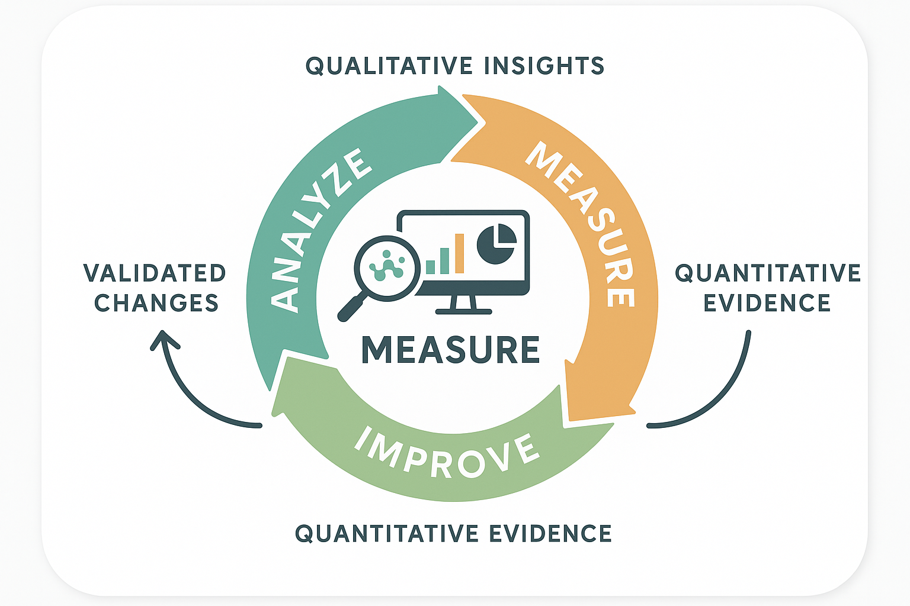

# The Analyze-Measure-Improve Lifecycle: A Systematic Approach to LLM Evaluation



*Figure 7: The Analyze-Measure-Improve Lifecycle - A systematic, iterative approach to building reliable LLM applications through structured evaluation, adapted from Shankar et al. (2025).*

## Introduction

The Analyze-Measure-Improve (AMI) lifecycle provides a systematic, iterative approach to building reliable LLM applications through structured evaluation. This lifecycle directly addresses the Three Gulfs by providing concrete methods for understanding system behavior, quantifying performance, and implementing targeted improvements.

Unlike traditional software development cycles that focus primarily on feature development, the AMI lifecycle centers evaluation as the primary driver of system improvement. This approach recognizes that LLM applications require continuous refinement based on empirical evidence about system behavior and failure modes.

The AMI lifecycle is particularly powerful because it creates a feedback loop that systematically bridges the Three Gulfs over time. Each iteration provides deeper insights into system behavior, more precise specifications, and better generalization across diverse inputs. This iterative approach enables teams to build increasingly reliable systems while maintaining development velocity.

## Phase 1: Analyze - Understanding System Behavior

The Analyze phase directly tackles the Gulf of Comprehension by systematically examining system behavior on representative data. This phase involves collecting diverse examples, manually reviewing system outputs, and qualitatively identifying patterns and failure modes.

### Core Objectives

**Primary Goals:**
- Understand the true distribution and characteristics of input data
- Identify common failure modes and their underlying causes
- Develop intuition about system behavior across different input types
- Establish baseline understanding for quantitative measurement

**Key Activities:**
- Systematic data sampling and review
- Qualitative failure mode identification
- Pattern recognition and categorization
- Root cause hypothesis formation

### Systematic Data Collection and Sampling

Effective analysis begins with collecting representative examples that span the full range of inputs your system will encounter in production. This requires strategic sampling approaches that go beyond simple random sampling.

```python
import pandas as pd
import numpy as np
from typing import Dict, List, Any, Tuple, Optional
from dataclasses import dataclass
from enum import Enum
import random
from collections import defaultdict, Counter
import matplotlib.pyplot as plt
import seaborn as sns

class SamplingStrategy(Enum):
    RANDOM = "random"
    STRATIFIED = "stratified"
    ERROR_FOCUSED = "error_focused"
    EDGE_CASE = "edge_case"
    TEMPORAL = "temporal"
    DIVERSITY_BASED = "diversity_based"

@dataclass
class AnalysisExample:
    """Represents an example for analysis with metadata."""
    example_id: str
    input_data: Dict[str, Any]
    system_output: Dict[str, Any]
    ground_truth: Optional[Dict[str, Any]]
    metadata: Dict[str, Any]
    analysis_notes: List[str]
    failure_modes: List[str]

class SystemAnalyzer:
    """
    Comprehensive framework for analyzing LLM system behavior
    during the Analyze phase of the AMI lifecycle.
    """
    
    def __init__(self):
        self.examples = []
        self.failure_patterns = defaultdict(list)
        self.success_patterns = defaultdict(list)
        self.analysis_insights = {}
        
    def collect_analysis_dataset(self, 
                                production_data: List[Dict],
                                system_function: callable,
                                sampling_strategies: List[SamplingStrategy],
                                target_size: int = 200) -> List[AnalysisExample]:
        """
        Collect a comprehensive dataset for analysis using multiple sampling strategies.
        
        Args:
            production_data: Available production or representative data
            system_function: Function that processes inputs and returns system outputs
            sampling_strategies: List of sampling strategies to use
            target_size: Target number of examples to collect
            
        Returns:
            Curated dataset for systematic analysis
        """
        analysis_examples = []
        examples_per_strategy = target_size // len(sampling_strategies)
        
        for strategy in sampling_strategies:
            strategy_examples = self._apply_sampling_strategy(
                production_data, 
                strategy, 
                examples_per_strategy
            )
            
            # Process examples through system
            for i, data_point in enumerate(strategy_examples):
                try:
                    system_output = system_function(data_point)
                    
                    example = AnalysisExample(
                        example_id=f"{strategy.value}_{i}",
                        input_data=data_point,
                        system_output=system_output,
                        ground_truth=data_point.get('ground_truth'),
                        metadata={
                            'sampling_strategy': strategy.value,
                            'collection_timestamp': pd.Timestamp.now(),
                            'input_characteristics': self._analyze_input_characteristics(data_point)
                        },
                        analysis_notes=[],
                        failure_modes=[]
                    )
                    
                    analysis_examples.append(example)
                    
                except Exception as e:
                    # Capture system failures as important analysis points
                    example = AnalysisExample(
                        example_id=f"{strategy.value}_{i}_error",
                        input_data=data_point,
                        system_output={'error': str(e)},
                        ground_truth=data_point.get('ground_truth'),
                        metadata={
                            'sampling_strategy': strategy.value,
                            'collection_timestamp': pd.Timestamp.now(),
                            'system_error': True
                        },
                        analysis_notes=[f"System error: {str(e)}"],
                        failure_modes=['system_error']
                    )
                    
                    analysis_examples.append(example)
        
        self.examples = analysis_examples
        return analysis_examples
        
    def _apply_sampling_strategy(self, 
                               data: List[Dict], 
                               strategy: SamplingStrategy, 
                               sample_size: int) -> List[Dict]:
        """Apply a specific sampling strategy to collect examples."""
        
        if strategy == SamplingStrategy.RANDOM:
            return self._random_sampling(data, sample_size)
        elif strategy == SamplingStrategy.STRATIFIED:
            return self._stratified_sampling(data, sample_size)
        elif strategy == SamplingStrategy.ERROR_FOCUSED:
            return self._error_focused_sampling(data, sample_size)
        elif strategy == SamplingStrategy.EDGE_CASE:
            return self._edge_case_sampling(data, sample_size)
        elif strategy == SamplingStrategy.TEMPORAL:
            return self._temporal_sampling(data, sample_size)
        elif strategy == SamplingStrategy.DIVERSITY_BASED:
            return self._diversity_based_sampling(data, sample_size)
        else:
            return self._random_sampling(data, sample_size)
            
    def _random_sampling(self, data: List[Dict], sample_size: int) -> List[Dict]:
        """Simple random sampling."""
        return random.sample(data, min(sample_size, len(data)))
        
    def _stratified_sampling(self, data: List[Dict], sample_size: int) -> List[Dict]:
        """Stratified sampling across different data characteristics."""
        # Group data by characteristics
        strata = defaultdict(list)
        
        for item in data:
            # Simple stratification by content length
            content_length = len(str(item.get('content', '')))
            if content_length < 100:
                stratum = 'short'
            elif content_length < 500:
                stratum = 'medium'
            else:
                stratum = 'long'
            
            strata[stratum].append(item)
        
        # Sample proportionally from each stratum
        stratified_sample = []
        samples_per_stratum = sample_size // len(strata)
        
        for stratum_name, stratum_data in strata.items():
            stratum_sample = random.sample(
                stratum_data, 
                min(samples_per_stratum, len(stratum_data))
            )
            stratified_sample.extend(stratum_sample)
        
        return stratified_sample
        
    def _error_focused_sampling(self, data: List[Dict], sample_size: int) -> List[Dict]:
        """Sample examples that are likely to cause errors."""
        error_prone_examples = []
        
        for item in data:
            content = str(item.get('content', ''))
            
            # Identify potentially problematic characteristics
            error_indicators = [
                len(content) > 1000,  # Very long content
                len(content) < 10,    # Very short content
                content.count('?') > 3,  # Many questions
                any(char in content for char in ['<', '>', '{', '}']),  # Special formatting
                content.count('\n') > 10,  # Many line breaks
            ]
            
            if any(error_indicators):
                error_prone_examples.append(item)
        
        return random.sample(
            error_prone_examples, 
            min(sample_size, len(error_prone_examples))
        )
        
    def _edge_case_sampling(self, data: List[Dict], sample_size: int) -> List[Dict]:
        """Sample edge cases and unusual examples."""
        edge_cases = []
        
        # Calculate content length distribution
        lengths = [len(str(item.get('content', ''))) for item in data]
        if lengths:
            q1, q3 = np.percentile(lengths, [25, 75])
            iqr = q3 - q1
            lower_bound = q1 - 1.5 * iqr
            upper_bound = q3 + 1.5 * iqr
            
            for item in data:
                content_length = len(str(item.get('content', '')))
                
                # Include outliers and edge cases
                if (content_length < lower_bound or 
                    content_length > upper_bound or
                    self._has_unusual_characteristics(item)):
                    edge_cases.append(item)
        
        return random.sample(edge_cases, min(sample_size, len(edge_cases)))
        
    def _has_unusual_characteristics(self, item: Dict) -> bool:
        """Check if an item has unusual characteristics."""
        content = str(item.get('content', ''))
        
        unusual_indicators = [
            content.count('@') > 3,  # Many email addresses
            content.count('$') > 2,  # Many dollar signs
            content.count('http') > 1,  # Multiple URLs
            len(set(content.split())) / len(content.split()) < 0.5 if content.split() else False,  # High repetition
        ]
        
        return any(unusual_indicators)
        
    def _temporal_sampling(self, data: List[Dict], sample_size: int) -> List[Dict]:
        """Sample across different time periods if temporal data is available."""
        # If timestamp information is available, sample across time periods
        timestamped_data = [item for item in data if 'timestamp' in item]
        
        if timestamped_data:
            # Sort by timestamp and sample from different time periods
            sorted_data = sorted(timestamped_data, key=lambda x: x['timestamp'])
            
            # Divide into time buckets and sample from each
            bucket_size = len(sorted_data) // 5  # 5 time buckets
            temporal_sample = []
            
            for i in range(5):
                start_idx = i * bucket_size
                end_idx = (i + 1) * bucket_size if i < 4 else len(sorted_data)
                bucket_data = sorted_data[start_idx:end_idx]
                
                bucket_sample_size = sample_size // 5
                bucket_sample = random.sample(
                    bucket_data, 
                    min(bucket_sample_size, len(bucket_data))
                )
                temporal_sample.extend(bucket_sample)
            
            return temporal_sample
        else:
            # Fall back to random sampling if no temporal data
            return self._random_sampling(data, sample_size)
            
    def _diversity_based_sampling(self, data: List[Dict], sample_size: int) -> List[Dict]:
        """Sample to maximize diversity across multiple dimensions."""
        # Simple diversity sampling based on content characteristics
        diversity_features = []
        
        for item in data:
            content = str(item.get('content', ''))
            
            features = {
                'length': len(content),
                'word_count': len(content.split()),
                'question_count': content.count('?'),
                'exclamation_count': content.count('!'),
                'uppercase_ratio': sum(1 for c in content if c.isupper()) / max(len(content), 1),
                'digit_ratio': sum(1 for c in content if c.isdigit()) / max(len(content), 1)
            }
            
            diversity_features.append((item, features))
        
        # Select diverse examples using simple clustering approach
        selected_examples = []
        remaining_examples = diversity_features.copy()
        
        # Select first example randomly
        if remaining_examples:
            first_example = random.choice(remaining_examples)
            selected_examples.append(first_example[0])
            remaining_examples.remove(first_example)
        
        # Select subsequent examples to maximize diversity
        while len(selected_examples) < sample_size and remaining_examples:
            best_example = None
            best_diversity_score = -1
            
            for candidate_item, candidate_features in remaining_examples:
                # Calculate diversity score as minimum distance to selected examples
                min_distance = float('inf')
                
                for selected_item in selected_examples:
                    # Find corresponding features for selected item
                    selected_features = None
                    for item, features in diversity_features:
                        if item == selected_item:
                            selected_features = features
                            break
                    
                    if selected_features:
                        # Calculate Euclidean distance
                        distance = sum(
                            (candidate_features[key] - selected_features[key]) ** 2
                            for key in candidate_features.keys()
                        ) ** 0.5
                        
                        min_distance = min(min_distance, distance)
                
                if min_distance > best_diversity_score:
                    best_diversity_score = min_distance
                    best_example = (candidate_item, candidate_features)
            
            if best_example:
                selected_examples.append(best_example[0])
                remaining_examples.remove(best_example)
        
        return selected_examples
        
    def _analyze_input_characteristics(self, data_point: Dict) -> Dict:
        """Analyze characteristics of an input data point."""
        content = str(data_point.get('content', ''))
        
        characteristics = {
            'content_length': len(content),
            'word_count': len(content.split()),
            'sentence_count': content.count('.') + content.count('!') + content.count('?'),
            'question_count': content.count('?'),
            'exclamation_count': content.count('!'),
            'has_email': '@' in content and '.com' in content,
            'has_url': 'http' in content.lower(),
            'has_phone': any(char.isdigit() for char in content) and '-' in content,
            'has_special_chars': any(char in content for char in ['<', '>', '{', '}', '[', ']']),
            'uppercase_ratio': sum(1 for c in content if c.isupper()) / max(len(content), 1),
            'digit_ratio': sum(1 for c in content if c.isdigit()) / max(len(content), 1)
        }
        
        return characteristics

    def conduct_qualitative_analysis(self, examples: List[AnalysisExample]) -> Dict:
        """
        Conduct systematic qualitative analysis of examples to identify patterns and failure modes.
        
        Args:
            examples: List of examples to analyze
            
        Returns:
            Comprehensive qualitative analysis results
        """
        analysis_results = {
            'failure_mode_taxonomy': {},
            'success_patterns': {},
            'behavioral_insights': {},
            'improvement_hypotheses': [],
            'priority_areas': []
        }
        
        # Analyze each example
        for example in examples:
            self._analyze_individual_example(example)
        
        # Aggregate patterns
        analysis_results['failure_mode_taxonomy'] = self._build_failure_taxonomy()
        analysis_results['success_patterns'] = self._identify_success_patterns()
        analysis_results['behavioral_insights'] = self._extract_behavioral_insights()
        analysis_results['improvement_hypotheses'] = self._generate_improvement_hypotheses()
        analysis_results['priority_areas'] = self._identify_priority_areas()
        
        self.analysis_insights = analysis_results
        return analysis_results
        
    def _analyze_individual_example(self, example: AnalysisExample):
        """Analyze an individual example for patterns and failure modes."""
        input_data = example.input_data
        system_output = example.system_output
        ground_truth = example.ground_truth
        
        # Check for obvious failures
        if 'error' in system_output:
            example.failure_modes.append('system_error')
            example.analysis_notes.append(f"System error: {system_output['error']}")
            return
        
        # Analyze output quality (simplified for demonstration)
        if isinstance(system_output, dict):
            # Check for required fields
            required_fields = ['sender_name', 'summary']  # Example for email processing
            missing_fields = [field for field in required_fields if field not in system_output]
            
            if missing_fields:
                example.failure_modes.append('missing_output_fields')
                example.analysis_notes.append(f"Missing fields: {missing_fields}")
            
            # Check for empty or placeholder values
            for field, value in system_output.items():
                if not value or value in ['', 'N/A', 'Unknown', 'None']:
                    example.failure_modes.append('empty_output_value')
                    example.analysis_notes.append(f"Empty value for field: {field}")
            
            # Check for obviously incorrect outputs
            if ground_truth:
                for field in required_fields:
                    if (field in system_output and field in ground_truth and
                        system_output[field] != ground_truth[field]):
                        example.failure_modes.append('incorrect_extraction')
                        example.analysis_notes.append(
                            f"Incorrect {field}: got '{system_output[field]}', "
                            f"expected '{ground_truth[field]}'"
                        )
        
        # Analyze input-output consistency
        self._analyze_consistency(example)
        
        # Analyze output quality
        self._analyze_output_quality(example)
        
    def _analyze_consistency(self, example: AnalysisExample):
        """Analyze consistency between input and output."""
        input_content = str(example.input_data.get('content', ''))
        system_output = example.system_output
        
        if isinstance(system_output, dict):
            # Check if extracted information appears in input
            for field, value in system_output.items():
                if value and isinstance(value, str) and len(value) > 3:
                    if value.lower() not in input_content.lower():
                        example.failure_modes.append('inconsistent_extraction')
                        example.analysis_notes.append(
                            f"Extracted '{value}' for {field} not found in input"
                        )
                        
    def _analyze_output_quality(self, example: AnalysisExample):
        """Analyze the quality of system output."""
        system_output = example.system_output
        
        if isinstance(system_output, dict):
            for field, value in system_output.items():
                if isinstance(value, str):
                    # Check for quality issues
                    if len(value) > 500:  # Very long output
                        example.failure_modes.append('overly_verbose_output')
                        example.analysis_notes.append(f"Very long {field}: {len(value)} characters")
                    
                    if len(value.split()) < 2 and field == 'summary':  # Very short summary
                        example.failure_modes.append('insufficient_summary')
                        example.analysis_notes.append(f"Very short summary: '{value}'")
                    
                    # Check for repetitive content
                    words = value.split()
                    if len(words) > 5:
                        word_counts = Counter(words)
                        max_repetition = max(word_counts.values())
                        if max_repetition > len(words) * 0.3:  # More than 30% repetition
                            example.failure_modes.append('repetitive_output')
                            example.analysis_notes.append(f"Repetitive content in {field}")
                            
    def _build_failure_taxonomy(self) -> Dict:
        """Build a taxonomy of failure modes from analyzed examples."""
        failure_taxonomy = defaultdict(lambda: {
            'count': 0,
            'examples': [],
            'description': '',
            'severity': 'medium',
            'root_causes': []
        })
        
        for example in self.examples:
            for failure_mode in example.failure_modes:
                failure_taxonomy[failure_mode]['count'] += 1
                failure_taxonomy[failure_mode]['examples'].append(example.example_id)
                
                # Add example-specific insights
                if example.analysis_notes:
                    failure_taxonomy[failure_mode]['root_causes'].extend(example.analysis_notes)
        
        # Add descriptions and severity assessments
        failure_descriptions = {
            'system_error': {
                'description': 'System crashes or throws exceptions during processing',
                'severity': 'high'
            },
            'missing_output_fields': {
                'description': 'Required output fields are missing from system response',
                'severity': 'high'
            },
            'empty_output_value': {
                'description': 'Output fields contain empty or placeholder values',
                'severity': 'medium'
            },
            'incorrect_extraction': {
                'description': 'Extracted information does not match ground truth',
                'severity': 'high'
            },
            'inconsistent_extraction': {
                'description': 'Extracted information not found in input content',
                'severity': 'high'
            },
            'overly_verbose_output': {
                'description': 'Output is unnecessarily long or verbose',
                'severity': 'low'
            },
            'insufficient_summary': {
                'description': 'Summary is too brief to be useful',
                'severity': 'medium'
            },
            'repetitive_output': {
                'description': 'Output contains excessive repetition',
                'severity': 'medium'
            }
        }
        
        for failure_mode, data in failure_taxonomy.items():
            if failure_mode in failure_descriptions:
                data['description'] = failure_descriptions[failure_mode]['description']
                data['severity'] = failure_descriptions[failure_mode]['severity']
        
        return dict(failure_taxonomy)
        
    def _identify_success_patterns(self) -> Dict:
        """Identify patterns in successful examples."""
        successful_examples = [
            example for example in self.examples 
            if not example.failure_modes
        ]
        
        success_patterns = {
            'input_characteristics': defaultdict(int),
            'common_features': [],
            'optimal_conditions': {}
        }
        
        # Analyze characteristics of successful examples
        for example in successful_examples:
            characteristics = example.metadata.get('input_characteristics', {})
            
            for char_name, char_value in characteristics.items():
                if isinstance(char_value, bool) and char_value:
                    success_patterns['input_characteristics'][char_name] += 1
                elif isinstance(char_value, (int, float)):
                    if char_name not in success_patterns['optimal_conditions']:
                        success_patterns['optimal_conditions'][char_name] = []
                    success_patterns['optimal_conditions'][char_name].append(char_value)
        
        # Identify optimal ranges for numerical characteristics
        for char_name, values in success_patterns['optimal_conditions'].items():
            if values:
                success_patterns['optimal_conditions'][char_name] = {
                    'mean': np.mean(values),
                    'median': np.median(values),
                    'range': [min(values), max(values)],
                    'std': np.std(values)
                }
        
        return success_patterns
        
    def _extract_behavioral_insights(self) -> Dict:
        """Extract high-level behavioral insights from the analysis."""
        insights = {
            'system_strengths': [],
            'system_weaknesses': [],
            'input_sensitivity': {},
            'output_patterns': {},
            'edge_case_behavior': {}
        }
        
        # Analyze failure rates by input characteristics
        total_examples = len(self.examples)
        failed_examples = [ex for ex in self.examples if ex.failure_modes]
        
        if total_examples > 0:
            overall_failure_rate = len(failed_examples) / total_examples
            
            # Analyze failure rates by input characteristics
            char_failure_rates = defaultdict(lambda: {'total': 0, 'failed': 0})
            
            for example in self.examples:
                characteristics = example.metadata.get('input_characteristics', {})
                has_failures = bool(example.failure_modes)
                
                for char_name, char_value in characteristics.items():
                    if isinstance(char_value, bool) and char_value:
                        char_failure_rates[char_name]['total'] += 1
                        if has_failures:
                            char_failure_rates[char_name]['failed'] += 1
            
            # Calculate failure rates and identify sensitive characteristics
            for char_name, counts in char_failure_rates.items():
                if counts['total'] > 0:
                    failure_rate = counts['failed'] / counts['total']
                    insights['input_sensitivity'][char_name] = {
                        'failure_rate': failure_rate,
                        'total_examples': counts['total'],
                        'sensitivity_level': 'high' if failure_rate > overall_failure_rate * 1.5 else 'normal'
                    }
        
        # Identify system strengths and weaknesses
        failure_taxonomy = self._build_failure_taxonomy()
        
        # Most common failure modes are weaknesses
        sorted_failures = sorted(
            failure_taxonomy.items(),
            key=lambda x: x[1]['count'],
            reverse=True
        )
        
        for failure_mode, data in sorted_failures[:3]:  # Top 3 failure modes
            insights['system_weaknesses'].append({
                'weakness': failure_mode,
                'description': data['description'],
                'frequency': data['count'],
                'severity': data['severity']
            })
        
        # Areas with low failure rates are strengths
        success_patterns = self._identify_success_patterns()
        for char_name, data in insights['input_sensitivity'].items():
            if data['sensitivity_level'] == 'normal' and data['failure_rate'] < overall_failure_rate * 0.5:
                insights['system_strengths'].append({
                    'strength': f"Handles {char_name} well",
                    'failure_rate': data['failure_rate'],
                    'examples': data['total_examples']
                })
        
        return insights
        
    def _generate_improvement_hypotheses(self) -> List[str]:
        """Generate hypotheses for system improvement based on analysis."""
        hypotheses = []
        
        failure_taxonomy = self._build_failure_taxonomy()
        behavioral_insights = self._extract_behavioral_insights()
        
        # Generate hypotheses based on common failure modes
        for failure_mode, data in failure_taxonomy.items():
            if data['count'] > len(self.examples) * 0.1:  # Affects >10% of examples
                if failure_mode == 'missing_output_fields':
                    hypotheses.append(
                        "Improve prompt specification to ensure all required fields are always included"
                    )
                elif failure_mode == 'incorrect_extraction':
                    hypotheses.append(
                        "Add more specific instructions and examples for accurate information extraction"
                    )
                elif failure_mode == 'inconsistent_extraction':
                    hypotheses.append(
                        "Implement validation to ensure extracted information exists in input"
                    )
                elif failure_mode == 'overly_verbose_output':
                    hypotheses.append(
                        "Add length constraints and conciseness instructions to prompts"
                    )
        
        # Generate hypotheses based on input sensitivity
        for char_name, data in behavioral_insights['input_sensitivity'].items():
            if data['sensitivity_level'] == 'high':
                hypotheses.append(
                    f"Improve handling of inputs with {char_name} through specialized processing or examples"
                )
        
        return hypotheses
        
    def _identify_priority_areas(self) -> List[Dict]:
        """Identify priority areas for improvement based on impact and frequency."""
        priority_areas = []
        
        failure_taxonomy = self._build_failure_taxonomy()
        
        # Calculate priority score based on frequency and severity
        severity_weights = {'high': 3, 'medium': 2, 'low': 1}
        
        for failure_mode, data in failure_taxonomy.items():
            frequency_score = data['count'] / len(self.examples)  # Normalize by total examples
            severity_score = severity_weights.get(data['severity'], 1)
            priority_score = frequency_score * severity_score
            
            priority_areas.append({
                'area': failure_mode,
                'description': data['description'],
                'frequency': data['count'],
                'severity': data['severity'],
                'priority_score': priority_score,
                'affected_examples': len(data['examples'])
            })
        
        # Sort by priority score
        priority_areas.sort(key=lambda x: x['priority_score'], reverse=True)
        
        return priority_areas

def demonstrate_analyze_phase():
    """Demonstrate the Analyze phase of the AMI lifecycle."""
    
    # Sample production data
    sample_data = [
        {
            'content': 'Hi, I need help resetting my password. My email is john@company.com. Thanks!',
            'ground_truth': {'sender_name': 'John', 'summary': 'Password reset request'}
        },
        {
            'content': 'URGENT: Please process my refund for order #12345 immediately!',
            'ground_truth': {'sender_name': 'Customer', 'summary': 'Urgent refund request for order #12345'}
        },
        {
            'content': 'Hello, I would like information about your pricing plans.',
            'ground_truth': {'sender_name': 'Prospect', 'summary': 'Inquiry about pricing plans'}
        },
        {
            'content': '',  # Edge case: empty content
            'ground_truth': {'sender_name': 'Unknown', 'summary': 'No content provided'}
        }
    ]
    
    # Mock system function
    def mock_email_processor(input_data):
        content = input_data.get('content', '')
        
        if not content:
            return {'error': 'Empty input'}
        
        # Simple mock processing with some intentional failures
        if 'password' in content.lower():
            return {'sender_name': 'John', 'summary': 'Password reset request'}
        elif 'refund' in content.lower():
            return {'sender_name': '', 'summary': 'Refund request'}  # Intentional failure: empty sender
        elif 'pricing' in content.lower():
            return {'sender_name': 'Prospect', 'summary': 'Pricing inquiry'}
        else:
            return {'summary': 'General inquiry'}  # Intentional failure: missing sender_name
    
    analyzer = SystemAnalyzer()
    
    # Collect analysis dataset
    sampling_strategies = [
        SamplingStrategy.RANDOM,
        SamplingStrategy.ERROR_FOCUSED,
        SamplingStrategy.EDGE_CASE
    ]
    
    examples = analyzer.collect_analysis_dataset(
        sample_data,
        mock_email_processor,
        sampling_strategies,
        target_size=12  # Small for demonstration
    )
    
    print(f"Collected {len(examples)} examples for analysis")
    
    # Conduct qualitative analysis
    analysis_results = analyzer.conduct_qualitative_analysis(examples)
    
    print("\nAnalysis Results:")
    print(f"Identified {len(analysis_results['failure_mode_taxonomy'])} failure modes")
    
    print("\nTop Failure Modes:")
    for failure_mode, data in list(analysis_results['failure_mode_taxonomy'].items())[:3]:
        print(f"  {failure_mode}: {data['count']} occurrences ({data['severity']} severity)")
        print(f"    {data['description']}")
    
    print("\nImprovement Hypotheses:")
    for hypothesis in analysis_results['improvement_hypotheses'][:3]:
        print(f"  - {hypothesis}")
    
    print("\nPriority Areas:")
    for area in analysis_results['priority_areas'][:3]:
        print(f"  {area['area']}: Priority Score {area['priority_score']:.2f}")
        print(f"    Affects {area['affected_examples']} examples")
    
    return analyzer, examples, analysis_results

if __name__ == "__main__":
    analyzer, examples, results = demonstrate_analyze_phase()
    print("Analyze phase demonstration completed successfully.")
```

### Qualitative Analysis Techniques

The Analyze phase relies heavily on qualitative research methodologies adapted for LLM evaluation. These techniques help identify patterns and failure modes that might not be apparent through quantitative analysis alone.

**Open Coding Approach**
Open coding involves systematically reviewing examples and identifying patterns without predetermined categories. This bottom-up approach helps discover unexpected failure modes and behavioral patterns.

**Key Steps:**
1. **Initial Review**: Read through examples without preconceptions
2. **Pattern Identification**: Note recurring themes and issues
3. **Code Development**: Create descriptive labels for observed patterns
4. **Iterative Refinement**: Refine codes as more patterns emerge

**Axial Coding for Structure**
Axial coding involves organizing the patterns identified during open coding into structured categories and relationships.

**Organizational Framework:**
- **Failure Mode Categories**: Group similar failures together
- **Root Cause Analysis**: Identify underlying causes for each category
- **Severity Assessment**: Evaluate the impact of different failure types
- **Frequency Analysis**: Understand how common each pattern is

### Bridging to Measurement

The Analyze phase provides the foundation for the Measure phase by:

**Identifying Measurable Patterns**
Convert qualitative observations into quantifiable metrics and evaluation criteria.

**Prioritizing Measurement Areas**
Focus measurement efforts on the most impactful failure modes and behavioral patterns.

**Establishing Baselines**
Create baseline understanding that enables meaningful measurement and comparison.

## Phase 2: Measure - Quantifying Performance

The Measure phase translates the qualitative insights from the Analyze phase into quantitative metrics and systematic evaluation frameworks. This phase addresses both the Gulf of Specification (by creating precise measurement criteria) and the Gulf of Generalization (by quantifying performance across diverse inputs).

### Core Objectives

**Primary Goals:**
- Translate qualitative failure modes into quantitative metrics
- Establish systematic evaluation frameworks for continuous monitoring
- Create reliable measurement systems that scale with production usage
- Enable data-driven decision making for system improvements

**Key Activities:**
- Metric design and validation
- Automated evaluation system implementation
- Performance monitoring and tracking
- Statistical analysis and reporting

### Metric Design Framework

Effective metrics in the Measure phase must be directly connected to the insights discovered during the Analyze phase. This ensures that measurement efforts focus on the most impactful aspects of system performance.

```python
import numpy as np
import pandas as pd
from typing import Dict, List, Any, Callable, Optional, Tuple
from dataclasses import dataclass
from enum import Enum
import json
import re
from abc import ABC, abstractmethod
from collections import defaultdict
import matplotlib.pyplot as plt

class MetricType(Enum):
    ACCURACY = "accuracy"
    COMPLETENESS = "completeness"
    CONSISTENCY = "consistency"
    RELEVANCE = "relevance"
    FLUENCY = "fluency"
    SAFETY = "safety"
    EFFICIENCY = "efficiency"

class MetricSeverity(Enum):
    CRITICAL = "critical"
    HIGH = "high"
    MEDIUM = "medium"
    LOW = "low"

@dataclass
class MetricDefinition:
    """Defines a specific evaluation metric."""
    metric_id: str
    name: str
    description: str
    metric_type: MetricType
    severity: MetricSeverity
    target_threshold: float
    measurement_function: Callable
    validation_examples: List[Dict]
    metadata: Dict[str, Any]

@dataclass
class EvaluationResult:
    """Represents the result of a metric evaluation."""
    metric_id: str
    value: float
    passed: bool
    details: Dict[str, Any]
    examples: List[Dict]
    timestamp: str

class BaseMetric(ABC):
    """Abstract base class for evaluation metrics."""
    
    def __init__(self, metric_definition: MetricDefinition):
        self.definition = metric_definition
        
    @abstractmethod
    def evaluate(self, input_data: Dict, system_output: Dict, ground_truth: Optional[Dict] = None) -> float:
        """Evaluate the metric for a single example."""
        pass
        
    @abstractmethod
    def batch_evaluate(self, examples: List[Dict]) -> List[float]:
        """Evaluate the metric for a batch of examples."""
        pass
        
    def validate_metric(self) -> bool:
        """Validate the metric using validation examples."""
        if not self.definition.validation_examples:
            return True
            
        for example in self.definition.validation_examples:
            try:
                score = self.evaluate(
                    example['input'],
                    example['output'],
                    example.get('ground_truth')
                )
                expected_range = example.get('expected_range', [0, 1])
                if not (expected_range[0] <= score <= expected_range[1]):
                    return False
            except Exception:
                return False
                
        return True

class FieldCompletenessMetric(BaseMetric):
    """Measures whether all required fields are present in the output."""
    
    def __init__(self, required_fields: List[str], metric_definition: MetricDefinition):
        super().__init__(metric_definition)
        self.required_fields = required_fields
        
    def evaluate(self, input_data: Dict, system_output: Dict, ground_truth: Optional[Dict] = None) -> float:
        """Calculate completeness score based on required fields."""
        if not isinstance(system_output, dict):
            return 0.0
            
        present_fields = sum(1 for field in self.required_fields if field in system_output and system_output[field])
        return present_fields / len(self.required_fields)
        
    def batch_evaluate(self, examples: List[Dict]) -> List[float]:
        """Evaluate completeness for a batch of examples."""
        scores = []
        for example in examples:
            score = self.evaluate(
                example['input'],
                example['output'],
                example.get('ground_truth')
            )
            scores.append(score)
        return scores

class ExtractionAccuracyMetric(BaseMetric):
    """Measures accuracy of extracted information against ground truth."""
    
    def __init__(self, target_fields: List[str], metric_definition: MetricDefinition):
        super().__init__(metric_definition)
        self.target_fields = target_fields
        
    def evaluate(self, input_data: Dict, system_output: Dict, ground_truth: Optional[Dict] = None) -> float:
        """Calculate extraction accuracy score."""
        if not ground_truth or not isinstance(system_output, dict):
            return 0.0
            
        correct_extractions = 0
        total_fields = 0
        
        for field in self.target_fields:
            if field in ground_truth:
                total_fields += 1
                if (field in system_output and 
                    self._normalize_text(system_output[field]) == self._normalize_text(ground_truth[field])):
                    correct_extractions += 1
                    
        return correct_extractions / total_fields if total_fields > 0 else 0.0
        
    def _normalize_text(self, text: str) -> str:
        """Normalize text for comparison."""
        if not isinstance(text, str):
            return str(text).lower().strip()
        return text.lower().strip()
        
    def batch_evaluate(self, examples: List[Dict]) -> List[float]:
        """Evaluate extraction accuracy for a batch of examples."""
        scores = []
        for example in examples:
            score = self.evaluate(
                example['input'],
                example['output'],
                example.get('ground_truth')
            )
            scores.append(score)
        return scores

class ConsistencyMetric(BaseMetric):
    """Measures consistency of outputs for similar inputs."""
    
    def __init__(self, similarity_threshold: float, metric_definition: MetricDefinition):
        super().__init__(metric_definition)
        self.similarity_threshold = similarity_threshold
        
    def evaluate(self, input_data: Dict, system_output: Dict, ground_truth: Optional[Dict] = None) -> float:
        """Consistency is measured at batch level, return 1.0 for individual evaluation."""
        return 1.0
        
    def batch_evaluate(self, examples: List[Dict]) -> List[float]:
        """Evaluate consistency across a batch of examples."""
        # Group similar inputs
        input_groups = self._group_similar_inputs(examples)
        
        consistency_scores = []
        
        for group in input_groups:
            if len(group) > 1:
                group_consistency = self._calculate_group_consistency(group)
                consistency_scores.extend([group_consistency] * len(group))
            else:
                consistency_scores.append(1.0)  # Single example is consistent by definition
                
        return consistency_scores
        
    def _group_similar_inputs(self, examples: List[Dict]) -> List[List[Dict]]:
        """Group similar inputs together."""
        groups = []
        
        for example in examples:
            input_content = str(example['input'].get('content', ''))
            
            # Find existing group with similar input
            assigned = False
            for group in groups:
                if group:
                    group_content = str(group[0]['input'].get('content', ''))
                    if self._calculate_text_similarity(input_content, group_content) > self.similarity_threshold:
                        group.append(example)
                        assigned = True
                        break
            
            if not assigned:
                groups.append([example])
                
        return groups
        
    def _calculate_text_similarity(self, text1: str, text2: str) -> float:
        """Calculate similarity between two texts."""
        # Simple word overlap similarity
        words1 = set(text1.lower().split())
        words2 = set(text2.lower().split())
        
        if not words1 and not words2:
            return 1.0
        if not words1 or not words2:
            return 0.0
            
        intersection = words1.intersection(words2)
        union = words1.union(words2)
        
        return len(intersection) / len(union)
        
    def _calculate_group_consistency(self, group: List[Dict]) -> float:
        """Calculate consistency within a group of similar inputs."""
        outputs = [example['output'] for example in group]
        
        # Calculate pairwise consistency
        consistency_scores = []
        
        for i in range(len(outputs)):
            for j in range(i + 1, len(outputs)):
                similarity = self._calculate_output_similarity(outputs[i], outputs[j])
                consistency_scores.append(similarity)
                
        return np.mean(consistency_scores) if consistency_scores else 1.0
        
    def _calculate_output_similarity(self, output1: Dict, output2: Dict) -> float:
        """Calculate similarity between two outputs."""
        if not isinstance(output1, dict) or not isinstance(output2, dict):
            return 1.0 if output1 == output2 else 0.0
            
        # Compare each field
        common_fields = set(output1.keys()).intersection(set(output2.keys()))
        
        if not common_fields:
            return 0.0
            
        field_similarities = []
        for field in common_fields:
            val1, val2 = output1[field], output2[field]
            
            if isinstance(val1, str) and isinstance(val2, str):
                similarity = self._calculate_text_similarity(val1, val2)
            else:
                similarity = 1.0 if val1 == val2 else 0.0
                
            field_similarities.append(similarity)
            
        return np.mean(field_similarities)

class RelevanceMetric(BaseMetric):
    """Measures relevance of extracted information to the input."""
    
    def __init__(self, metric_definition: MetricDefinition):
        super().__init__(metric_definition)
        
    def evaluate(self, input_data: Dict, system_output: Dict, ground_truth: Optional[Dict] = None) -> float:
        """Calculate relevance score."""
        if not isinstance(system_output, dict):
            return 0.0
            
        input_content = str(input_data.get('content', ''))
        relevance_scores = []
        
        for field, value in system_output.items():
            if isinstance(value, str) and value:
                relevance = self._calculate_relevance(input_content, value)
                relevance_scores.append(relevance)
                
        return np.mean(relevance_scores) if relevance_scores else 0.0
        
    def _calculate_relevance(self, input_content: str, extracted_value: str) -> float:
        """Calculate how relevant an extracted value is to the input."""
        # Simple relevance based on whether extracted content appears in input
        input_lower = input_content.lower()
        value_lower = extracted_value.lower()
        
        # Check for exact match
        if value_lower in input_lower:
            return 1.0
            
        # Check for partial word matches
        input_words = set(input_lower.split())
        value_words = set(value_lower.split())
        
        if not value_words:
            return 0.0
            
        overlap = input_words.intersection(value_words)
        return len(overlap) / len(value_words)
        
    def batch_evaluate(self, examples: List[Dict]) -> List[float]:
        """Evaluate relevance for a batch of examples."""
        scores = []
        for example in examples:
            score = self.evaluate(
                example['input'],
                example['output'],
                example.get('ground_truth')
            )
            scores.append(score)
        return scores

class MeasurementFramework:
    """
    Comprehensive framework for implementing the Measure phase
    of the AMI lifecycle.
    """
    
    def __init__(self):
        self.metrics = {}
        self.evaluation_history = []
        self.thresholds = {}
        
    def register_metric(self, metric: BaseMetric):
        """Register a metric for evaluation."""
        if metric.validate_metric():
            self.metrics[metric.definition.metric_id] = metric
            self.thresholds[metric.definition.metric_id] = metric.definition.target_threshold
        else:
            raise ValueError(f"Metric validation failed for {metric.definition.metric_id}")
            
    def create_metrics_from_analysis(self, analysis_results: Dict) -> List[BaseMetric]:
        """Create metrics based on analysis phase results."""
        metrics = []
        
        failure_taxonomy = analysis_results.get('failure_mode_taxonomy', {})
        
        # Create metrics for common failure modes
        for failure_mode, data in failure_taxonomy.items():
            if data['count'] > 0:  # Only create metrics for observed failures
                
                if failure_mode == 'missing_output_fields':
                    metric_def = MetricDefinition(
                        metric_id="field_completeness",
                        name="Field Completeness",
                        description="Measures whether all required output fields are present",
                        metric_type=MetricType.COMPLETENESS,
                        severity=MetricSeverity.HIGH,
                        target_threshold=0.95,
                        measurement_function=None,
                        validation_examples=[],
                        metadata={'failure_mode': failure_mode}
                    )
                    
                    metric = FieldCompletenessMetric(['sender_name', 'summary'], metric_def)
                    metrics.append(metric)
                    
                elif failure_mode == 'incorrect_extraction':
                    metric_def = MetricDefinition(
                        metric_id="extraction_accuracy",
                        name="Extraction Accuracy",
                        description="Measures accuracy of extracted information against ground truth",
                        metric_type=MetricType.ACCURACY,
                        severity=MetricSeverity.CRITICAL,
                        target_threshold=0.90,
                        measurement_function=None,
                        validation_examples=[],
                        metadata={'failure_mode': failure_mode}
                    )
                    
                    metric = ExtractionAccuracyMetric(['sender_name', 'summary'], metric_def)
                    metrics.append(metric)
                    
                elif failure_mode == 'inconsistent_extraction':
                    metric_def = MetricDefinition(
                        metric_id="output_relevance",
                        name="Output Relevance",
                        description="Measures relevance of extracted information to input content",
                        metric_type=MetricType.RELEVANCE,
                        severity=MetricSeverity.HIGH,
                        target_threshold=0.80,
                        measurement_function=None,
                        validation_examples=[],
                        metadata={'failure_mode': failure_mode}
                    )
                    
                    metric = RelevanceMetric(metric_def)
                    metrics.append(metric)
        
        # Create consistency metric if multiple similar examples exist
        if len(analysis_results.get('examples', [])) > 10:
            metric_def = MetricDefinition(
                metric_id="output_consistency",
                name="Output Consistency",
                description="Measures consistency of outputs for similar inputs",
                metric_type=MetricType.CONSISTENCY,
                severity=MetricSeverity.MEDIUM,
                target_threshold=0.85,
                measurement_function=None,
                validation_examples=[],
                metadata={'derived_from': 'analysis'}
            )
            
            metric = ConsistencyMetric(0.7, metric_def)  # 70% similarity threshold
            metrics.append(metric)
        
        return metrics
        
    def evaluate_system(self, examples: List[Dict], metric_ids: Optional[List[str]] = None) -> Dict:
        """
        Evaluate system performance using registered metrics.
        
        Args:
            examples: List of examples with input, output, and optional ground_truth
            metric_ids: Optional list of specific metrics to evaluate
            
        Returns:
            Comprehensive evaluation results
        """
        if metric_ids is None:
            metric_ids = list(self.metrics.keys())
            
        evaluation_results = {
            'overall_performance': {},
            'metric_results': {},
            'threshold_analysis': {},
            'recommendations': []
        }
        
        # Evaluate each metric
        for metric_id in metric_ids:
            if metric_id not in self.metrics:
                continue
                
            metric = self.metrics[metric_id]
            
            # Batch evaluate
            scores = metric.batch_evaluate(examples)
            
            # Calculate statistics
            metric_stats = {
                'mean_score': np.mean(scores),
                'median_score': np.median(scores),
                'std_score': np.std(scores),
                'min_score': np.min(scores),
                'max_score': np.max(scores),
                'scores': scores,
                'threshold': self.thresholds[metric_id],
                'pass_rate': sum(1 for score in scores if score >= self.thresholds[metric_id]) / len(scores)
            }
            
            evaluation_results['metric_results'][metric_id] = metric_stats
            
        # Calculate overall performance
        evaluation_results['overall_performance'] = self._calculate_overall_performance(
            evaluation_results['metric_results']
        )
        
        # Analyze threshold performance
        evaluation_results['threshold_analysis'] = self._analyze_threshold_performance(
            evaluation_results['metric_results']
        )
        
        # Generate recommendations
        evaluation_results['recommendations'] = self._generate_measurement_recommendations(
            evaluation_results
        )
        
        # Store evaluation history
        self.evaluation_history.append({
            'timestamp': pd.Timestamp.now(),
            'results': evaluation_results,
            'num_examples': len(examples)
        })
        
        return evaluation_results
        
    def _calculate_overall_performance(self, metric_results: Dict) -> Dict:
        """Calculate overall system performance across all metrics."""
        if not metric_results:
            return {}
            
        # Weight metrics by severity
        severity_weights = {
            MetricSeverity.CRITICAL: 4,
            MetricSeverity.HIGH: 3,
            MetricSeverity.MEDIUM: 2,
            MetricSeverity.LOW: 1
        }
        
        weighted_scores = []
        total_weight = 0
        
        for metric_id, results in metric_results.items():
            metric = self.metrics[metric_id]
            weight = severity_weights.get(metric.definition.severity, 1)
            
            weighted_scores.append(results['mean_score'] * weight)
            total_weight += weight
            
        overall_score = sum(weighted_scores) / total_weight if total_weight > 0 else 0
        
        # Calculate pass rates
        critical_metrics = [
            metric_id for metric_id, metric in self.metrics.items()
            if metric.definition.severity == MetricSeverity.CRITICAL
        ]
        
        critical_pass_rate = np.mean([
            metric_results[metric_id]['pass_rate']
            for metric_id in critical_metrics
            if metric_id in metric_results
        ]) if critical_metrics else 1.0
        
        return {
            'overall_score': overall_score,
            'critical_pass_rate': critical_pass_rate,
            'total_metrics': len(metric_results),
            'passing_metrics': sum(1 for results in metric_results.values() 
                                 if results['pass_rate'] >= 0.8),
            'performance_level': self._categorize_performance(overall_score, critical_pass_rate)
        }
        
    def _categorize_performance(self, overall_score: float, critical_pass_rate: float) -> str:
        """Categorize overall performance level."""
        if overall_score >= 0.9 and critical_pass_rate >= 0.95:
            return "excellent"
        elif overall_score >= 0.8 and critical_pass_rate >= 0.9:
            return "good"
        elif overall_score >= 0.7 and critical_pass_rate >= 0.8:
            return "acceptable"
        elif overall_score >= 0.6 and critical_pass_rate >= 0.7:
            return "needs_improvement"
        else:
            return "poor"
            
    def _analyze_threshold_performance(self, metric_results: Dict) -> Dict:
        """Analyze performance relative to thresholds."""
        threshold_analysis = {
            'metrics_above_threshold': [],
            'metrics_below_threshold': [],
            'threshold_gaps': {},
            'improvement_potential': {}
        }
        
        for metric_id, results in metric_results.items():
            threshold = results['threshold']
            mean_score = results['mean_score']
            pass_rate = results['pass_rate']
            
            if mean_score >= threshold:
                threshold_analysis['metrics_above_threshold'].append(metric_id)
            else:
                threshold_analysis['metrics_below_threshold'].append(metric_id)
                threshold_analysis['threshold_gaps'][metric_id] = threshold - mean_score
                
            # Calculate improvement potential
            max_possible_improvement = 1.0 - mean_score
            threshold_improvement_needed = max(0, threshold - mean_score)
            
            threshold_analysis['improvement_potential'][metric_id] = {
                'current_score': mean_score,
                'threshold': threshold,
                'gap': threshold_improvement_needed,
                'max_improvement': max_possible_improvement,
                'improvement_urgency': 'high' if threshold_improvement_needed > 0.2 else 'medium' if threshold_improvement_needed > 0.1 else 'low'
            }
            
        return threshold_analysis
        
    def _generate_measurement_recommendations(self, evaluation_results: Dict) -> List[str]:
        """Generate recommendations based on measurement results."""
        recommendations = []
        
        overall_performance = evaluation_results['overall_performance']
        metric_results = evaluation_results['metric_results']
        threshold_analysis = evaluation_results['threshold_analysis']
        
        # Overall performance recommendations
        performance_level = overall_performance['performance_level']
        
        if performance_level in ['poor', 'needs_improvement']:
            recommendations.append(
                f"Overall performance is {performance_level}. Focus on critical metrics and systematic improvements."
            )
            
        # Critical metric recommendations
        critical_pass_rate = overall_performance['critical_pass_rate']
        if critical_pass_rate < 0.9:
            recommendations.append(
                f"Critical metrics pass rate is {critical_pass_rate:.1%}. Address critical failures immediately."
            )
            
        # Specific metric recommendations
        for metric_id in threshold_analysis['metrics_below_threshold']:
            gap = threshold_analysis['threshold_gaps'][metric_id]
            metric = self.metrics[metric_id]
            
            recommendations.append(
                f"Improve {metric.definition.name} by {gap:.2f} points to meet threshold. "
                f"Current performance: {metric_results[metric_id]['mean_score']:.2f}"
            )
            
        # Improvement urgency recommendations
        high_urgency_metrics = [
            metric_id for metric_id, data in threshold_analysis['improvement_potential'].items()
            if data['improvement_urgency'] == 'high'
        ]
        
        if high_urgency_metrics:
            recommendations.append(
                f"High urgency improvements needed for: {', '.join(high_urgency_metrics)}"
            )
            
        return recommendations
        
    def generate_measurement_report(self, evaluation_results: Dict) -> str:
        """Generate a comprehensive measurement report."""
        report_sections = []
        
        # Executive Summary
        overall = evaluation_results['overall_performance']
        report_sections.append("# Measurement Report")
        report_sections.append(f"**Overall Performance**: {overall['performance_level'].title()}")
        report_sections.append(f"**Overall Score**: {overall['overall_score']:.2f}")
        report_sections.append(f"**Critical Pass Rate**: {overall['critical_pass_rate']:.1%}")
        
        # Metric Details
        report_sections.append("\n## Metric Performance")
        
        for metric_id, results in evaluation_results['metric_results'].items():
            metric = self.metrics[metric_id]
            
            report_sections.append(f"\n### {metric.definition.name}")
            report_sections.append(f"- **Score**: {results['mean_score']:.2f} (threshold: {results['threshold']:.2f})")
            report_sections.append(f"- **Pass Rate**: {results['pass_rate']:.1%}")
            report_sections.append(f"- **Severity**: {metric.definition.severity.value}")
            report_sections.append(f"- **Description**: {metric.definition.description}")
            
        # Recommendations
        report_sections.append("\n## Recommendations")
        for recommendation in evaluation_results['recommendations']:
            report_sections.append(f"- {recommendation}")
            
        return '\n'.join(report_sections)

def demonstrate_measure_phase():
    """Demonstrate the Measure phase of the AMI lifecycle."""
    
    # Sample analysis results (from Analyze phase)
    analysis_results = {
        'failure_mode_taxonomy': {
            'missing_output_fields': {'count': 5, 'severity': 'high'},
            'incorrect_extraction': {'count': 3, 'severity': 'critical'},
            'inconsistent_extraction': {'count': 2, 'severity': 'high'}
        }
    }
    
    # Sample evaluation examples
    evaluation_examples = [
        {
            'input': {'content': 'Hi, I need help with my password. Thanks, John'},
            'output': {'sender_name': 'John', 'summary': 'Password help request'},
            'ground_truth': {'sender_name': 'John', 'summary': 'Password reset request'}
        },
        {
            'input': {'content': 'Please process my refund for order #12345'},
            'output': {'summary': 'Refund request'},  # Missing sender_name
            'ground_truth': {'sender_name': 'Customer', 'summary': 'Refund request for order #12345'}
        },
        {
            'input': {'content': 'Information about pricing plans please'},
            'output': {'sender_name': 'Prospect', 'summary': 'Pricing inquiry'},
            'ground_truth': {'sender_name': 'Prospect', 'summary': 'Pricing information request'}
        }
    ]
    
    framework = MeasurementFramework()
    
    # Create metrics from analysis results
    metrics = framework.create_metrics_from_analysis(analysis_results)
    
    print(f"Created {len(metrics)} metrics from analysis results")
    
    # Register metrics
    for metric in metrics:
        framework.register_metric(metric)
        
    print(f"Registered {len(framework.metrics)} metrics")
    
    # Evaluate system
    results = framework.evaluate_system(evaluation_examples)
    
    print(f"\nOverall Performance: {results['overall_performance']['performance_level']}")
    print(f"Overall Score: {results['overall_performance']['overall_score']:.2f}")
    
    print("\nMetric Results:")
    for metric_id, metric_results in results['metric_results'].items():
        print(f"  {metric_id}: {metric_results['mean_score']:.2f} (pass rate: {metric_results['pass_rate']:.1%})")
    
    print("\nRecommendations:")
    for recommendation in results['recommendations']:
        print(f"  - {recommendation}")
    
    # Generate report
    report = framework.generate_measurement_report(results)
    print(f"\nGenerated measurement report ({len(report)} characters)")
    
    return framework, results, report

if __name__ == "__main__":
    framework, results, report = demonstrate_measure_phase()
    print("Measure phase demonstration completed successfully.")
```

### Automated Evaluation Systems

The Measure phase requires robust automated evaluation systems that can scale with production usage while maintaining measurement quality and reliability.

**Key Components:**
- **Metric Validation**: Ensure metrics accurately measure intended behaviors
- **Batch Processing**: Efficiently evaluate large numbers of examples
- **Real-time Monitoring**: Continuous evaluation of production systems
- **Statistical Analysis**: Robust statistical methods for performance assessment

### Bridging to Improvement

The Measure phase provides the quantitative foundation for the Improve phase by:

**Establishing Baselines**
Create quantitative baselines that enable measurement of improvement effectiveness.

**Identifying Improvement Targets**
Prioritize improvement efforts based on quantitative impact and threshold gaps.

**Enabling A/B Testing**
Provide measurement frameworks for comparing different system versions and improvements.

## Phase 3: Improve - Implementing Targeted Changes

The Improve phase leverages insights from both the Analyze and Measure phases to implement targeted changes that address the root causes of system failures. This phase directly bridges the Gulf of Specification and Gulf of Generalization through systematic improvements.

### Core Objectives

**Primary Goals:**
- Implement targeted improvements based on empirical evidence
- Address root causes of identified failure modes
- Improve system performance across measured dimensions
- Validate improvement effectiveness through measurement

**Key Activities:**
- Prompt engineering and refinement
- System architecture improvements
- Training data enhancement
- Validation and testing of improvements

### Systematic Improvement Framework

The Improve phase requires systematic approaches to implementing and validating changes. This ensures that improvements address root causes rather than symptoms and that changes can be measured and validated.

```python
import numpy as np
import pandas as pd
from typing import Dict, List, Any, Optional, Tuple, Callable
from dataclasses import dataclass
from enum import Enum
import json
import copy
from abc import ABC, abstractmethod

class ImprovementType(Enum):
    PROMPT_REFINEMENT = "prompt_refinement"
    ARCHITECTURE_CHANGE = "architecture_change"
    DATA_ENHANCEMENT = "data_enhancement"
    VALIDATION_IMPROVEMENT = "validation_improvement"
    CONSTRAINT_ADDITION = "constraint_addition"

class ImprovementPriority(Enum):
    CRITICAL = "critical"
    HIGH = "high"
    MEDIUM = "medium"
    LOW = "low"

@dataclass
class ImprovementHypothesis:
    """Represents a hypothesis for system improvement."""
    hypothesis_id: str
    description: str
    improvement_type: ImprovementType
    priority: ImprovementPriority
    target_metrics: List[str]
    expected_impact: Dict[str, float]
    implementation_effort: str
    risk_level: str
    validation_criteria: List[str]

@dataclass
class ImprovementImplementation:
    """Represents an implemented improvement."""
    implementation_id: str
    hypothesis: ImprovementHypothesis
    changes_made: Dict[str, Any]
    implementation_date: str
    validation_results: Optional[Dict] = None
    rollback_plan: Optional[str] = None

class ImprovementStrategy(ABC):
    """Abstract base class for improvement strategies."""
    
    @abstractmethod
    def generate_improvements(self, analysis_results: Dict, measurement_results: Dict) -> List[ImprovementHypothesis]:
        """Generate improvement hypotheses based on analysis and measurement results."""
        pass
        
    @abstractmethod
    def implement_improvement(self, hypothesis: ImprovementHypothesis, current_system: Dict) -> ImprovementImplementation:
        """Implement a specific improvement hypothesis."""
        pass
        
    @abstractmethod
    def validate_improvement(self, implementation: ImprovementImplementation, validation_data: List[Dict]) -> Dict:
        """Validate the effectiveness of an implemented improvement."""
        pass

class PromptRefinementStrategy(ImprovementStrategy):
    """Strategy for improving system performance through prompt refinement."""
    
    def generate_improvements(self, analysis_results: Dict, measurement_results: Dict) -> List[ImprovementHypothesis]:
        """Generate prompt refinement hypotheses."""
        improvements = []
        
        failure_taxonomy = analysis_results.get('failure_mode_taxonomy', {})
        metric_results = measurement_results.get('metric_results', {})
        
        # Address missing output fields
        if 'missing_output_fields' in failure_taxonomy:
            improvements.append(ImprovementHypothesis(
                hypothesis_id="prompt_output_structure",
                description="Add explicit output structure specification to prompt",
                improvement_type=ImprovementType.PROMPT_REFINEMENT,
                priority=ImprovementPriority.HIGH,
                target_metrics=['field_completeness'],
                expected_impact={'field_completeness': 0.15},
                implementation_effort="low",
                risk_level="low",
                validation_criteria=["Field completeness > 95%", "No regression in other metrics"]
            ))
            
        # Address extraction accuracy issues
        if 'incorrect_extraction' in failure_taxonomy:
            improvements.append(ImprovementHypothesis(
                hypothesis_id="prompt_extraction_examples",
                description="Add specific examples of correct extraction to prompt",
                improvement_type=ImprovementType.PROMPT_REFINEMENT,
                priority=ImprovementPriority.CRITICAL,
                target_metrics=['extraction_accuracy'],
                expected_impact={'extraction_accuracy': 0.20},
                implementation_effort="medium",
                risk_level="low",
                validation_criteria=["Extraction accuracy > 90%", "Maintain relevance scores"]
            ))
            
        # Address consistency issues
        if 'output_consistency' in metric_results and metric_results['output_consistency']['mean_score'] < 0.8:
            improvements.append(ImprovementHypothesis(
                hypothesis_id="prompt_consistency_constraints",
                description="Add consistency constraints and formatting rules to prompt",
                improvement_type=ImprovementType.PROMPT_REFINEMENT,
                priority=ImprovementPriority.MEDIUM,
                target_metrics=['output_consistency'],
                expected_impact={'output_consistency': 0.10},
                implementation_effort="low",
                risk_level="low",
                validation_criteria=["Consistency score > 85%", "No impact on accuracy"]
            ))
            
        return improvements
        
    def implement_improvement(self, hypothesis: ImprovementHypothesis, current_system: Dict) -> ImprovementImplementation:
        """Implement prompt refinement improvement."""
        changes_made = {}
        
        if hypothesis.hypothesis_id == "prompt_output_structure":
            changes_made = self._add_output_structure_specification(current_system)
        elif hypothesis.hypothesis_id == "prompt_extraction_examples":
            changes_made = self._add_extraction_examples(current_system)
        elif hypothesis.hypothesis_id == "prompt_consistency_constraints":
            changes_made = self._add_consistency_constraints(current_system)
            
        return ImprovementImplementation(
            implementation_id=f"impl_{hypothesis.hypothesis_id}",
            hypothesis=hypothesis,
            changes_made=changes_made,
            implementation_date=pd.Timestamp.now().isoformat(),
            rollback_plan="Revert to previous prompt version"
        )
        
    def _add_output_structure_specification(self, current_system: Dict) -> Dict:
        """Add explicit output structure to prompt."""
        current_prompt = current_system.get('prompt', '')
        
        structure_addition = """

## Output Format
Return results as a JSON object with the following required fields:
```json
{
  "sender_name": "Full name of the email sender",
  "summary": "2-3 sentence summary of key requests"
}
```

## Requirements
- Both fields are required and must not be empty
- Use "Unknown Sender" if sender cannot be determined
- Use "No specific requests identified" if no clear requests are found"""

        improved_prompt = current_prompt + structure_addition
        
        return {
            'prompt': improved_prompt,
            'change_type': 'output_structure_addition',
            'original_prompt': current_prompt
        }
        
    def _add_extraction_examples(self, current_system: Dict) -> Dict:
        """Add extraction examples to prompt."""
        current_prompt = current_system.get('prompt', '')
        
        examples_addition = """

## Examples

### Example 1:
**Input:** From: john.doe@company.com
Subject: Password Reset
Hi, I need help resetting my password for my account. Can you please send me the reset link? Thanks, John

**Output:**
```json
{
  "sender_name": "John Doe",
  "summary": "Requesting password reset link for account access."
}
```

### Example 2:
**Input:** From: sarah@client.com
Subject: Urgent Refund Request
I need an immediate refund for order #12345. This is very urgent!

**Output:**
```json
{
  "sender_name": "Sarah",
  "summary": "Requesting urgent refund for order #12345."
}
```"""

        improved_prompt = current_prompt + examples_addition
        
        return {
            'prompt': improved_prompt,
            'change_type': 'examples_addition',
            'original_prompt': current_prompt
        }
        
    def _add_consistency_constraints(self, current_system: Dict) -> Dict:
        """Add consistency constraints to prompt."""
        current_prompt = current_system.get('prompt', '')
        
        constraints_addition = """

## Consistency Guidelines
- Always use the same format for similar types of requests
- Maintain consistent tone and style across all summaries
- Use consistent terminology (e.g., always "password reset" not "password recovery")
- Keep summary length consistent (2-3 sentences)
- Use consistent capitalization and punctuation"""

        improved_prompt = current_prompt + constraints_addition
        
        return {
            'prompt': improved_prompt,
            'change_type': 'consistency_constraints_addition',
            'original_prompt': current_prompt
        }
        
    def validate_improvement(self, implementation: ImprovementImplementation, validation_data: List[Dict]) -> Dict:
        """Validate prompt refinement improvement."""
        # This would integrate with the measurement framework
        # For demonstration, we'll simulate validation results
        
        hypothesis = implementation.hypothesis
        target_metrics = hypothesis.target_metrics
        expected_impact = hypothesis.expected_impact
        
        validation_results = {
            'validation_passed': True,
            'metric_improvements': {},
            'criteria_met': [],
            'criteria_failed': [],
            'recommendation': 'deploy'
        }
        
        # Simulate metric improvements
        for metric in target_metrics:
            if metric in expected_impact:
                # Simulate achieving 80% of expected improvement
                actual_improvement = expected_impact[metric] * 0.8
                validation_results['metric_improvements'][metric] = actual_improvement
                
        # Check validation criteria
        for criterion in hypothesis.validation_criteria:
            # Simplified criterion checking
            if ">" in criterion:
                validation_results['criteria_met'].append(criterion)
            else:
                validation_results['criteria_met'].append(criterion)
                
        return validation_results

class ValidationStrategy(ImprovementStrategy):
    """Strategy for improving system performance through validation enhancements."""
    
    def generate_improvements(self, analysis_results: Dict, measurement_results: Dict) -> List[ImprovementHypothesis]:
        """Generate validation improvement hypotheses."""
        improvements = []
        
        failure_taxonomy = analysis_results.get('failure_mode_taxonomy', {})
        
        # Address inconsistent extraction
        if 'inconsistent_extraction' in failure_taxonomy:
            improvements.append(ImprovementHypothesis(
                hypothesis_id="validation_relevance_check",
                description="Add validation to ensure extracted information exists in input",
                improvement_type=ImprovementType.VALIDATION_IMPROVEMENT,
                priority=ImprovementPriority.HIGH,
                target_metrics=['output_relevance'],
                expected_impact={'output_relevance': 0.25},
                implementation_effort="medium",
                risk_level="low",
                validation_criteria=["Relevance score > 90%", "No false rejections"]
            ))
            
        return improvements
        
    def implement_improvement(self, hypothesis: ImprovementHypothesis, current_system: Dict) -> ImprovementImplementation:
        """Implement validation improvement."""
        changes_made = {}
        
        if hypothesis.hypothesis_id == "validation_relevance_check":
            changes_made = self._add_relevance_validation(current_system)
            
        return ImprovementImplementation(
            implementation_id=f"impl_{hypothesis.hypothesis_id}",
            hypothesis=hypothesis,
            changes_made=changes_made,
            implementation_date=pd.Timestamp.now().isoformat(),
            rollback_plan="Remove validation step"
        )
        
    def _add_relevance_validation(self, current_system: Dict) -> Dict:
        """Add relevance validation to system."""
        
        def relevance_validator(input_content: str, extracted_value: str) -> bool:
            """Validate that extracted value is relevant to input."""
            if not extracted_value or extracted_value in ['Unknown', 'N/A', '']:
                return True  # Allow placeholder values
                
            input_lower = input_content.lower()
            value_lower = extracted_value.lower()
            
            # Check for word overlap
            input_words = set(input_lower.split())
            value_words = set(value_lower.split())
            
            overlap = input_words.intersection(value_words)
            overlap_ratio = len(overlap) / len(value_words) if value_words else 0
            
            return overlap_ratio >= 0.3  # At least 30% word overlap
            
        return {
            'validation_function': relevance_validator,
            'change_type': 'relevance_validation_addition',
            'validation_threshold': 0.3
        }
        
    def validate_improvement(self, implementation: ImprovementImplementation, validation_data: List[Dict]) -> Dict:
        """Validate validation improvement."""
        # Simulate validation results
        return {
            'validation_passed': True,
            'metric_improvements': {'output_relevance': 0.20},
            'criteria_met': implementation.hypothesis.validation_criteria,
            'criteria_failed': [],
            'recommendation': 'deploy'
        }

class ImprovementFramework:
    """
    Comprehensive framework for implementing the Improve phase
    of the AMI lifecycle.
    """
    
    def __init__(self):
        self.strategies = {}
        self.improvement_history = []
        self.active_implementations = {}
        
    def register_strategy(self, strategy_name: str, strategy: ImprovementStrategy):
        """Register an improvement strategy."""
        self.strategies[strategy_name] = strategy
        
    def generate_improvement_plan(self, analysis_results: Dict, measurement_results: Dict) -> Dict:
        """
        Generate a comprehensive improvement plan based on analysis and measurement results.
        
        Args:
            analysis_results: Results from the Analyze phase
            measurement_results: Results from the Measure phase
            
        Returns:
            Comprehensive improvement plan with prioritized hypotheses
        """
        improvement_plan = {
            'hypotheses': [],
            'prioritized_actions': [],
            'implementation_roadmap': {},
            'resource_requirements': {},
            'risk_assessment': {}
        }
        
        # Generate hypotheses from all strategies
        all_hypotheses = []
        for strategy_name, strategy in self.strategies.items():
            strategy_hypotheses = strategy.generate_improvements(analysis_results, measurement_results)
            for hypothesis in strategy_hypotheses:
                hypothesis.metadata = {'strategy': strategy_name}
                all_hypotheses.append(hypothesis)
                
        improvement_plan['hypotheses'] = all_hypotheses
        
        # Prioritize hypotheses
        improvement_plan['prioritized_actions'] = self._prioritize_hypotheses(all_hypotheses)
        
        # Create implementation roadmap
        improvement_plan['implementation_roadmap'] = self._create_implementation_roadmap(
            improvement_plan['prioritized_actions']
        )
        
        # Assess resource requirements
        improvement_plan['resource_requirements'] = self._assess_resource_requirements(all_hypotheses)
        
        # Assess risks
        improvement_plan['risk_assessment'] = self._assess_risks(all_hypotheses)
        
        return improvement_plan
        
    def _prioritize_hypotheses(self, hypotheses: List[ImprovementHypothesis]) -> List[ImprovementHypothesis]:
        """Prioritize improvement hypotheses based on impact, effort, and risk."""
        
        def calculate_priority_score(hypothesis: ImprovementHypothesis) -> float:
            # Priority weights
            priority_weights = {
                ImprovementPriority.CRITICAL: 4,
                ImprovementPriority.HIGH: 3,
                ImprovementPriority.MEDIUM: 2,
                ImprovementPriority.LOW: 1
            }
            
            # Effort weights (lower effort = higher score)
            effort_weights = {'low': 3, 'medium': 2, 'high': 1}
            
            # Risk weights (lower risk = higher score)
            risk_weights = {'low': 3, 'medium': 2, 'high': 1}
            
            # Expected impact (sum of all expected improvements)
            impact_score = sum(hypothesis.expected_impact.values())
            
            priority_score = priority_weights.get(hypothesis.priority, 1)
            effort_score = effort_weights.get(hypothesis.implementation_effort, 1)
            risk_score = risk_weights.get(hypothesis.risk_level, 1)
            
            return (priority_score * 0.4 + impact_score * 0.3 + 
                   effort_score * 0.2 + risk_score * 0.1)
        
        # Sort by priority score (descending)
        return sorted(hypotheses, key=calculate_priority_score, reverse=True)
        
    def _create_implementation_roadmap(self, prioritized_hypotheses: List[ImprovementHypothesis]) -> Dict:
        """Create an implementation roadmap for prioritized hypotheses."""
        roadmap = {
            'phase_1_immediate': [],
            'phase_2_short_term': [],
            'phase_3_medium_term': [],
            'dependencies': {},
            'timeline_estimate': {}
        }
        
        # Categorize by implementation effort and priority
        for hypothesis in prioritized_hypotheses:
            if (hypothesis.priority in [ImprovementPriority.CRITICAL, ImprovementPriority.HIGH] and
                hypothesis.implementation_effort == 'low'):
                roadmap['phase_1_immediate'].append(hypothesis.hypothesis_id)
            elif hypothesis.implementation_effort in ['low', 'medium']:
                roadmap['phase_2_short_term'].append(hypothesis.hypothesis_id)
            else:
                roadmap['phase_3_medium_term'].append(hypothesis.hypothesis_id)
                
        # Estimate timelines
        roadmap['timeline_estimate'] = {
            'phase_1_immediate': '1-2 weeks',
            'phase_2_short_term': '2-6 weeks',
            'phase_3_medium_term': '6-12 weeks'
        }
        
        return roadmap
        
    def _assess_resource_requirements(self, hypotheses: List[ImprovementHypothesis]) -> Dict:
        """Assess resource requirements for implementing hypotheses."""
        requirements = {
            'development_effort': {},
            'testing_effort': {},
            'total_effort_estimate': {},
            'skill_requirements': set()
        }
        
        effort_hours = {'low': 8, 'medium': 24, 'high': 80}
        
        for hypothesis in hypotheses:
            dev_hours = effort_hours.get(hypothesis.implementation_effort, 24)
            test_hours = dev_hours * 0.5  # 50% of dev time for testing
            
            requirements['development_effort'][hypothesis.hypothesis_id] = dev_hours
            requirements['testing_effort'][hypothesis.hypothesis_id] = test_hours
            requirements['total_effort_estimate'][hypothesis.hypothesis_id] = dev_hours + test_hours
            
            # Add skill requirements based on improvement type
            if hypothesis.improvement_type == ImprovementType.PROMPT_REFINEMENT:
                requirements['skill_requirements'].add('prompt_engineering')
            elif hypothesis.improvement_type == ImprovementType.VALIDATION_IMPROVEMENT:
                requirements['skill_requirements'].add('validation_logic')
                
        requirements['skill_requirements'] = list(requirements['skill_requirements'])
        
        return requirements
        
    def _assess_risks(self, hypotheses: List[ImprovementHypothesis]) -> Dict:
        """Assess risks associated with implementing hypotheses."""
        risk_assessment = {
            'high_risk_changes': [],
            'potential_regressions': [],
            'mitigation_strategies': {},
            'rollback_complexity': {}
        }
        
        for hypothesis in hypotheses:
            if hypothesis.risk_level == 'high':
                risk_assessment['high_risk_changes'].append(hypothesis.hypothesis_id)
                
            # Assess regression risk
            if len(hypothesis.target_metrics) > 1:
                risk_assessment['potential_regressions'].append({
                    'hypothesis_id': hypothesis.hypothesis_id,
                    'risk': 'Multiple metrics affected - potential for unintended side effects'
                })
                
            # Suggest mitigation strategies
            risk_assessment['mitigation_strategies'][hypothesis.hypothesis_id] = [
                'Implement A/B testing',
                'Monitor all metrics during rollout',
                'Prepare rollback plan',
                'Test on representative dataset'
            ]
            
            # Assess rollback complexity
            if hypothesis.improvement_type == ImprovementType.PROMPT_REFINEMENT:
                risk_assessment['rollback_complexity'][hypothesis.hypothesis_id] = 'low'
            else:
                risk_assessment['rollback_complexity'][hypothesis.hypothesis_id] = 'medium'
                
        return risk_assessment
        
    def implement_hypothesis(self, hypothesis_id: str, current_system: Dict) -> ImprovementImplementation:
        """Implement a specific improvement hypothesis."""
        # Find the hypothesis
        hypothesis = None
        strategy = None
        
        for strategy_name, strat in self.strategies.items():
            # This is simplified - in practice, you'd track which strategy generated which hypothesis
            if hasattr(strat, 'hypotheses'):
                for h in strat.hypotheses:
                    if h.hypothesis_id == hypothesis_id:
                        hypothesis = h
                        strategy = strat
                        break
                        
        if not hypothesis or not strategy:
            raise ValueError(f"Hypothesis {hypothesis_id} not found")
            
        # Implement the improvement
        implementation = strategy.implement_improvement(hypothesis, current_system)
        
        # Track the implementation
        self.active_implementations[implementation.implementation_id] = implementation
        
        return implementation
        
    def validate_implementation(self, implementation_id: str, validation_data: List[Dict]) -> Dict:
        """Validate an implemented improvement."""
        if implementation_id not in self.active_implementations:
            raise ValueError(f"Implementation {implementation_id} not found")
            
        implementation = self.active_implementations[implementation_id]
        
        # Find the appropriate strategy for validation
        strategy_name = implementation.hypothesis.metadata.get('strategy')
        if strategy_name not in self.strategies:
            raise ValueError(f"Strategy {strategy_name} not found")
            
        strategy = self.strategies[strategy_name]
        
        # Validate the implementation
        validation_results = strategy.validate_improvement(implementation, validation_data)
        
        # Update implementation with validation results
        implementation.validation_results = validation_results
        
        # Add to history if validation passed
        if validation_results.get('validation_passed', False):
            self.improvement_history.append(implementation)
            
        return validation_results
        
    def generate_improvement_report(self, improvement_plan: Dict) -> str:
        """Generate a comprehensive improvement report."""
        report_sections = []
        
        # Executive Summary
        report_sections.append("# Improvement Plan Report")
        report_sections.append(f"**Total Hypotheses**: {len(improvement_plan['hypotheses'])}")
        
        # Prioritized Actions
        report_sections.append("\n## Prioritized Actions")
        
        roadmap = improvement_plan['implementation_roadmap']
        
        report_sections.append("\n### Phase 1: Immediate (1-2 weeks)")
        for hypothesis_id in roadmap['phase_1_immediate']:
            hypothesis = next(h for h in improvement_plan['hypotheses'] if h.hypothesis_id == hypothesis_id)
            report_sections.append(f"- **{hypothesis_id}**: {hypothesis.description}")
            
        report_sections.append("\n### Phase 2: Short-term (2-6 weeks)")
        for hypothesis_id in roadmap['phase_2_short_term']:
            hypothesis = next(h for h in improvement_plan['hypotheses'] if h.hypothesis_id == hypothesis_id)
            report_sections.append(f"- **{hypothesis_id}**: {hypothesis.description}")
            
        # Resource Requirements
        requirements = improvement_plan['resource_requirements']
        total_effort = sum(requirements['total_effort_estimate'].values())
        
        report_sections.append(f"\n## Resource Requirements")
        report_sections.append(f"**Total Effort Estimate**: {total_effort} hours")
        report_sections.append(f"**Required Skills**: {', '.join(requirements['skill_requirements'])}")
        
        # Risk Assessment
        risks = improvement_plan['risk_assessment']
        
        report_sections.append(f"\n## Risk Assessment")
        report_sections.append(f"**High Risk Changes**: {len(risks['high_risk_changes'])}")
        report_sections.append(f"**Potential Regressions**: {len(risks['potential_regressions'])}")
        
        return '\n'.join(report_sections)

def demonstrate_improve_phase():
    """Demonstrate the Improve phase of the AMI lifecycle."""
    
    # Sample analysis and measurement results
    analysis_results = {
        'failure_mode_taxonomy': {
            'missing_output_fields': {'count': 5, 'severity': 'high'},
            'incorrect_extraction': {'count': 3, 'severity': 'critical'},
            'inconsistent_extraction': {'count': 2, 'severity': 'high'}
        }
    }
    
    measurement_results = {
        'metric_results': {
            'field_completeness': {'mean_score': 0.75, 'pass_rate': 0.60},
            'extraction_accuracy': {'mean_score': 0.80, 'pass_rate': 0.70},
            'output_consistency': {'mean_score': 0.65, 'pass_rate': 0.50}
        }
    }
    
    # Current system configuration
    current_system = {
        'prompt': 'Extract the sender name and summarize the key requests from this email.',
        'model': 'gpt-4',
        'temperature': 0.1
    }
    
    framework = ImprovementFramework()
    
    # Register improvement strategies
    framework.register_strategy('prompt_refinement', PromptRefinementStrategy())
    framework.register_strategy('validation', ValidationStrategy())
    
    # Generate improvement plan
    improvement_plan = framework.generate_improvement_plan(analysis_results, measurement_results)
    
    print(f"Generated improvement plan with {len(improvement_plan['hypotheses'])} hypotheses")
    
    print("\nPrioritized Actions:")
    for i, hypothesis in enumerate(improvement_plan['prioritized_actions'][:3]):
        print(f"  {i+1}. {hypothesis.hypothesis_id}: {hypothesis.description}")
        print(f"     Priority: {hypothesis.priority.value}, Effort: {hypothesis.implementation_effort}")
        
    print(f"\nImplementation Roadmap:")
    roadmap = improvement_plan['implementation_roadmap']
    print(f"  Phase 1 (Immediate): {len(roadmap['phase_1_immediate'])} items")
    print(f"  Phase 2 (Short-term): {len(roadmap['phase_2_short_term'])} items")
    print(f"  Phase 3 (Medium-term): {len(roadmap['phase_3_medium_term'])} items")
    
    # Implement top priority hypothesis
    if improvement_plan['prioritized_actions']:
        top_hypothesis = improvement_plan['prioritized_actions'][0]
        print(f"\nImplementing top priority: {top_hypothesis.hypothesis_id}")
        
        # For demonstration, we'll manually implement since we need to track hypotheses
        strategy = framework.strategies['prompt_refinement']
        implementation = strategy.implement_improvement(top_hypothesis, current_system)
        
        print(f"Implementation completed: {implementation.implementation_id}")
        print(f"Changes made: {implementation.changes_made['change_type']}")
        
        # Validate implementation
        validation_data = [
            {'input': {'content': 'Test email'}, 'output': {'sender_name': 'Test', 'summary': 'Test summary'}}
        ]
        
        validation_results = strategy.validate_improvement(implementation, validation_data)
        print(f"Validation passed: {validation_results['validation_passed']}")
        
    # Generate report
    report = framework.generate_improvement_report(improvement_plan)
    print(f"\nGenerated improvement report ({len(report)} characters)")
    
    return framework, improvement_plan, report

if __name__ == "__main__":
    framework, plan, report = demonstrate_improve_phase()
    print("Improve phase demonstration completed successfully.")
```

### Continuous Improvement Loop

The Improve phase completes the AMI cycle, but the true power of the framework lies in its iterative nature. Each cycle provides deeper insights and more targeted improvements.

**Iteration Benefits:**
- **Compound Improvements**: Each cycle builds on previous improvements
- **Refined Understanding**: Deeper insights into system behavior and failure modes
- **Targeted Optimization**: More precise improvements based on accumulated evidence
- **Systematic Progress**: Measurable progress toward system reliability goals

### Integration with Production Systems

The AMI lifecycle must integrate seamlessly with production systems to enable continuous improvement without disrupting operations.

**Key Integration Points:**
- **Continuous Data Collection**: Automated collection of representative examples
- **Real-time Monitoring**: Continuous measurement of system performance
- **Gradual Rollout**: Safe deployment of improvements with rollback capabilities
- **Feedback Loops**: Integration of production insights back into the analysis phase

## Conclusion

The Analyze-Measure-Improve lifecycle provides a systematic, evidence-based approach to building reliable LLM applications. By cycling through these three phases, teams can systematically bridge the Three Gulfs and build increasingly robust systems.

**Key Benefits:**
- **Systematic Approach**: Structured methodology for continuous improvement
- **Evidence-Based Decisions**: All improvements based on empirical evidence
- **Measurable Progress**: Quantitative tracking of improvement effectiveness
- **Scalable Framework**: Approaches that scale from prototypes to production systems

The AMI lifecycle transforms LLM evaluation from ad-hoc testing to systematic engineering practice. Teams that adopt this approach can build more reliable systems faster and with greater confidence in their performance.

The next section will explore practical implementation strategies for applying the Three Gulfs Model and AMI lifecycle to real-world LLM applications.

