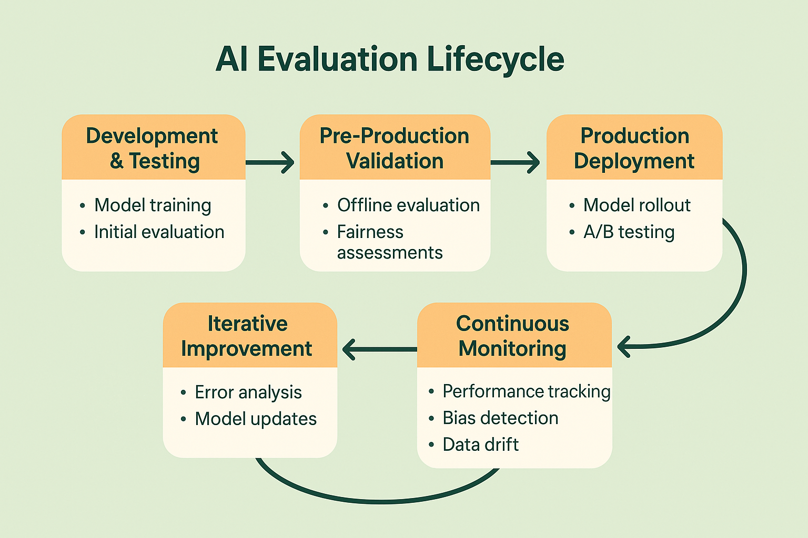

# Module 1: Fundamentals of AI Evaluation

## 🎯 Learning Objectives

By the end of this module, you will be able to:

- **Articulate the business case** for systematic AI evaluation and its impact on product success
- **Identify unique challenges** in evaluating LLM outputs compared to traditional software testing
- **Design an evaluation strategy** that spans the entire AI product lifecycle
- **Implement basic instrumentation** for tracking AI system behavior and performance
- **Conduct systematic error analysis** to identify the highest-impact improvements
- **Establish evaluation practices** that scale with your team and product complexity

## 📚 Module Contents

### Core Concepts
1. **[Why Evaluation Matters](01-why-evaluation-matters.md)** - Business impact and risk mitigation
2. **[Unique Challenges](02-unique-challenges.md)** - LLM-specific evaluation challenges  
3. **[Evaluation Lifecycle](03-evaluation-lifecycle.md)** - Development to production lifecycle
4. **[Instrumentation Basics](04-instrumentation-basics.md)** - Basic observability and tracking
5. **[Error Analysis Introduction](05-error-analysis-introduction.md)** - Introduction to systematic error analysis
6. **[The Three Gulfs Model](06-three-gulfs-model.md)** - Framework for understanding LLM development challenges
7. **[Analyze-Measure-Improve Lifecycle](07-analyze-measure-improve-lifecycle.md)** - Systematic approach to LLM evaluation

### Practical Components
- **[Exercises](exercises/)** - Hands-on exercises with step-by-step implementations
- **[Case Studies](case-studies/)** - Real-world implementation examples and outcomes
- **[Templates](templates/)** - Ready-to-use frameworks and assessment tools

## 🔧 Key Frameworks Introduced

### The Three Gulfs Model
A conceptual framework that categorizes the primary challenges in LLM development:
- **Gulf of Comprehension**: The gap between developers and their understanding of data
- **Gulf of Specification**: The gap between developers and LLM pipeline behavior  
- **Gulf of Generalization**: The gap between training data and real-world performance

### The Analyze-Measure-Improve (AMI) Lifecycle
A practical methodology for systematic LLM evaluation:
- **Analyze**: Qualitative understanding of system behavior and failure modes
- **Measure**: Quantitative assessment through systematic metrics and evaluation
- **Improve**: Targeted improvements based on empirical evidence

## ⏱️ Time Investment

**Total Module Time**: 4-6 hours
- Reading and comprehension: 2-3 hours
- Hands-on exercises: 1-2 hours  
- Case study analysis: 1 hour

## 🎯 Target Audience

This module is designed for:
- **ML Engineers** new to systematic AI evaluation
- **Technical PMs** needing to understand evaluation fundamentals
- **Team Leaders** establishing evaluation practices
- **Anyone** transitioning from ad-hoc testing to systematic evaluation

## 📋 Prerequisites

- Basic understanding of machine learning concepts
- Familiarity with software development practices
- Experience with APIs and web services (helpful but not required)

## 🚀 Getting Started

1. **Start with the fundamentals**: Begin with [Why Evaluation Matters](01-why-evaluation-matters.md)
2. **Follow the sequence**: Each section builds on the previous one
3. **Complete exercises**: Hands-on practice reinforces concepts
4. **Apply to your context**: Use templates to adapt concepts to your specific use case

## 🔗 Module Navigation

**Previous**: [Tutorial Overview](../../README.md)  
**Next**: [Module 2 - Systematic Error Analysis](../02-error-analysis/README.md)

## 💡 Key Takeaways Preview

After completing this module, you'll understand that effective AI evaluation is not about finding the perfect metric, but about building systems that help you make better decisions faster. You'll have a framework for thinking about evaluation that scales from your first prototype to production systems serving millions of users.

The most successful AI teams don't just build great models—they build great evaluation systems that enable rapid iteration and confident deployment. This module gives you the foundation to build those systems.

---

**Ready to dive in?** Start with [Why Evaluation Matters →](01-why-evaluation-matters.md)

