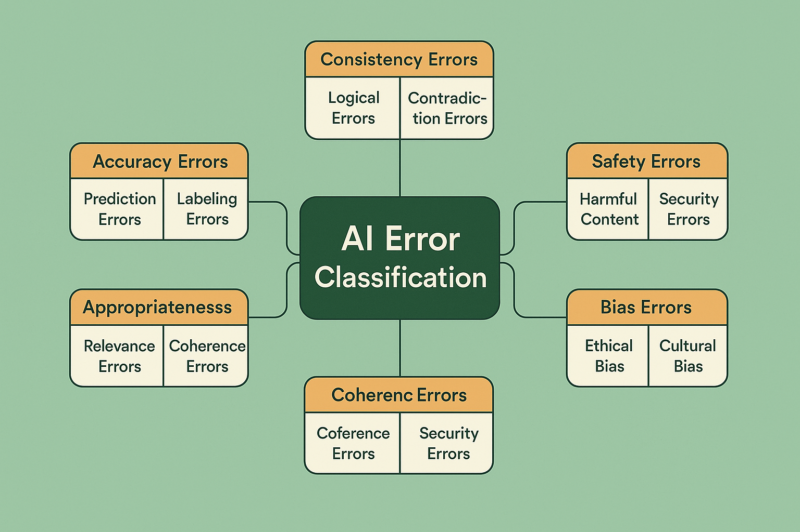

# Error Classification and Taxonomy: Building Systematic Understanding



## Introduction: The Foundation of Systematic Analysis

Error classification represents the fundamental building block of systematic AI evaluation. Without a clear, comprehensive taxonomy for understanding different types of failures, teams struggle to prioritize improvements, track progress, and build institutional knowledge about system reliability. The framework presented in this section provides the structured approach needed to transform chaotic debugging into systematic quality improvement.

The challenge of AI error classification extends far beyond traditional software debugging. While conventional software errors typically have clear symptoms and deterministic causes, AI system failures often emerge from complex interactions between data, models, and context that require sophisticated analytical frameworks to understand and address effectively.

Modern AI systems exhibit failure modes that span multiple dimensions simultaneously. A single user interaction might involve accuracy issues, appropriateness concerns, and consistency problems all at once. This complexity demands classification systems that can capture nuanced relationships between different error types while remaining practical for day-to-day use by engineering teams.

The classification framework developed in this section draws from extensive analysis of production AI systems across multiple industries, incorporating lessons learned from organizations that have successfully scaled AI evaluation processes. The taxonomy balances theoretical completeness with practical utility, providing clear guidance for teams building their own error analysis capabilities.

## The Multi-Dimensional Nature of AI Errors

### Primary Error Categories

The foundation of effective error classification begins with understanding the five primary categories that encompass the vast majority of AI system failures. Each category represents a distinct type of system breakdown that requires different analytical approaches and remediation strategies.

**Accuracy Errors** represent failures in the fundamental correctness of AI system outputs. These errors occur when the system provides information that is objectively incorrect, incomplete, or misleading. Accuracy errors are often the most visible to users and can have immediate impact on user trust and system utility.

The complexity of accuracy errors in AI systems stems from the probabilistic nature of modern machine learning models. Unlike traditional software, where correctness is typically binary, AI systems operate in domains where "correct" answers may be subjective, context-dependent, or impossible to verify automatically. This ambiguity makes accuracy error detection and classification particularly challenging.

Accuracy errors manifest in various forms depending on the AI system's domain and function. In natural language processing systems, accuracy errors might include factual inaccuracies, logical inconsistencies, or misrepresentation of source information. In computer vision systems, accuracy errors could involve misclassification of objects, incorrect spatial relationships, or failure to detect relevant features.

The business impact of accuracy errors varies significantly based on the application domain and user expectations. In high-stakes applications such as medical diagnosis or financial analysis, accuracy errors can have severe consequences that extend far beyond user dissatisfaction. In more casual applications, users may be more tolerant of occasional inaccuracies, particularly if the system provides value in other dimensions.

**Appropriateness Errors** occur when AI systems provide responses that are technically accurate but inappropriate for the specific context, user, or situation. These errors highlight the challenge of encoding social norms, cultural sensitivity, and contextual awareness into automated systems.

The detection and classification of appropriateness errors requires understanding not just what the system said, but whether it was suitable for the particular circumstances. This evaluation often involves subjective judgments about tone, timing, cultural sensitivity, and social appropriateness that can vary significantly across different user populations and contexts.

Appropriateness errors are particularly challenging because they often involve implicit social contracts and expectations that are difficult to encode explicitly in system design. Users may have unstated assumptions about how AI systems should behave in different situations, and violations of these assumptions can lead to negative experiences even when the system's output is factually correct.

The cultural and contextual nature of appropriateness makes these errors especially complex to address systematically. What is appropriate in one cultural context may be inappropriate in another, and social norms evolve over time, requiring AI systems to adapt their behavior accordingly.

**Consistency Errors** represent failures in the reliability and predictability of AI system behavior. These errors occur when systems provide different responses to similar inputs or when their behavior varies unpredictably across similar contexts. Consistency errors undermine user trust by making it difficult for users to develop reliable mental models of system behavior.

The challenge of consistency in AI systems stems from the inherent stochasticity of many machine learning approaches. While some degree of output variation can be beneficial for generating diverse and creative responses, excessive inconsistency can make systems feel unreliable and unprofessional.

Consistency errors can manifest at multiple levels of system behavior. At the output level, consistency errors involve variations in response quality, style, or content for similar inputs. At the behavioral level, consistency errors might involve changes in system personality, tone, or approach across different interactions or time periods.

The evaluation of consistency errors requires careful consideration of what types of variation are desirable versus problematic. Systems that are too consistent may feel robotic and inflexible, while systems that are too variable may feel unreliable and unpredictable. Finding the right balance requires understanding user expectations and the specific requirements of the application domain.

**Safety Errors** encompass the most serious category of AI system failures, involving outputs that could cause harm to users or society. These errors include generation of harmful content, amplification of dangerous misinformation, and facilitation of illegal or unethical activities.

The identification and prevention of safety errors requires understanding not just the immediate content of system outputs but also their potential downstream effects and societal implications. Safety errors can have cascading effects that extend far beyond the immediate user interaction, making their prevention a critical priority for responsible AI development.

Safety errors often involve complex trade-offs between system utility and risk mitigation. Overly restrictive safety measures can significantly limit system functionality and user satisfaction, while insufficient safety measures can lead to serious harm. Balancing these considerations requires sophisticated understanding of risk assessment and mitigation strategies.

The evolving nature of safety threats means that safety error classification must be continuously updated to address new types of harmful content and emerging risk patterns. What constitutes a safety error may change over time as society's understanding of AI risks evolves and new threat vectors emerge.

**Bias Errors** involve systematic unfairness or discrimination in AI system behavior, often reflecting biases present in training data or model architecture. These errors can perpetuate or amplify existing social inequalities and may violate legal or ethical standards for fair treatment.

The detection of bias errors requires sophisticated analytical techniques that can identify subtle patterns of differential treatment across different user populations. Unlike other error types that may be immediately apparent from individual interactions, bias errors often only become visible through statistical analysis of system behavior across large numbers of interactions.

Bias errors can manifest in various forms, including disparate impact on different demographic groups, stereotypical assumptions about user characteristics, and systematic exclusion of certain perspectives or experiences. The complexity of bias detection stems from the need to understand not just what the system does, but how its behavior affects different user populations differently.

The remediation of bias errors often requires fundamental changes to training data, model architecture, or system design rather than simple output filtering or post-processing. This makes bias errors particularly challenging to address and highlights the importance of proactive bias prevention during system development.

### Secondary Classification Dimensions

Beyond the primary error categories, effective classification systems must capture additional dimensions that provide crucial context for understanding and addressing AI system failures. These secondary dimensions help teams prioritize remediation efforts and track improvement progress over time.

**Severity Classification** provides essential context for prioritizing error remediation efforts. The severity of an error depends not just on its type but also on its potential impact on users, business objectives, and system reliability. A comprehensive severity classification system enables teams to focus their limited resources on the most critical issues while ensuring that less severe problems are not ignored entirely.

Critical severity errors represent failures that pose immediate risks to user safety, system security, or business operations. These errors require immediate attention and may justify emergency system updates or temporary service restrictions. Critical errors often involve safety violations, security vulnerabilities, or complete system failures that prevent normal operation.

Major severity errors significantly impact user experience or system functionality but do not pose immediate safety or security risks. These errors may affect large numbers of users or important system features, requiring prompt attention but not necessarily emergency response. Major errors often involve accuracy problems, significant appropriateness violations, or consistency issues that undermine user trust.

Minor severity errors have limited impact on user experience and system functionality but still represent opportunities for improvement. These errors may affect small numbers of users or edge cases that occur infrequently. While minor errors may not require immediate attention, they should be tracked and addressed as part of ongoing system improvement efforts.

**Frequency Classification** captures how often different types of errors occur, providing crucial information for prioritizing improvement efforts and understanding system reliability patterns. High-frequency errors may have greater cumulative impact than more severe but less common issues, making frequency analysis essential for effective resource allocation.

The frequency classification must account for both absolute occurrence rates and relative frequency within different user populations or use cases. An error that occurs rarely overall but frequently for a specific user segment may require targeted attention even if it does not appear significant in aggregate statistics.

Frequency patterns can also reveal important insights about error causation and system behavior. Errors that occur in clusters or show temporal patterns may indicate underlying system issues that affect multiple error types simultaneously. Understanding these patterns can help teams identify root causes that address multiple error categories at once.

**User Impact Classification** evaluates how different errors affect user experience, task completion, and overall satisfaction with the AI system. This classification dimension helps teams understand the real-world consequences of different error types and prioritize improvements based on user needs rather than purely technical considerations.

High user impact errors significantly interfere with user goals and may lead to task abandonment, user frustration, or loss of trust in the system. These errors often involve core system functionality or occur at critical points in user workflows where failure has cascading effects on user success.

Medium user impact errors create noticeable problems for users but do not prevent task completion or cause severe frustration. These errors may require users to work around system limitations or accept suboptimal results, but they do not fundamentally undermine the system's utility.

Low user impact errors are noticed by users but have minimal effect on their ability to accomplish their goals or their overall satisfaction with the system. These errors may be perceived as minor annoyances or quirks rather than serious problems, but they still represent opportunities for system improvement.

## Practical Classification Implementation

### Building Classification Systems

The implementation of effective error classification systems requires careful consideration of organizational needs, technical constraints, and operational requirements. A well-designed classification system balances comprehensiveness with usability, providing sufficient detail for meaningful analysis while remaining practical for day-to-day use by engineering teams.

The foundation of any classification system is a clear, unambiguous taxonomy that can be consistently applied by different team members across different contexts. This taxonomy must be documented thoroughly, with clear definitions, examples, and decision criteria for each classification category. The documentation should include edge cases and boundary conditions that help classifiers make consistent decisions when errors span multiple categories.

Training and calibration processes are essential for ensuring consistent application of classification criteria across team members and over time. Regular calibration exercises, where team members classify the same set of errors and compare results, help identify areas where the taxonomy needs clarification or where additional training is needed.

The classification system must be integrated into existing development and operations workflows to ensure consistent use and minimize overhead. This integration often involves building classification interfaces into error tracking systems, monitoring dashboards, and incident response processes. The goal is to make classification a natural part of error handling rather than an additional burden on engineering teams.

```python
from enum import Enum
from dataclasses import dataclass
from typing import Dict, List, Optional, Any
import json
from datetime import datetime

class ErrorCategory(Enum):
    ACCURACY = "accuracy"
    APPROPRIATENESS = "appropriateness"
    CONSISTENCY = "consistency"
    SAFETY = "safety"
    BIAS = "bias"

class ErrorSeverity(Enum):
    CRITICAL = "critical"
    MAJOR = "major"
    MINOR = "minor"

class ErrorFrequency(Enum):
    HIGH = "high"        # > 1% of interactions
    MEDIUM = "medium"    # 0.1% - 1% of interactions
    LOW = "low"          # < 0.1% of interactions

class UserImpact(Enum):
    HIGH = "high"        # Prevents task completion
    MEDIUM = "medium"    # Degrades experience
    LOW = "low"          # Minor annoyance

@dataclass
class ErrorClassification:
    """Comprehensive error classification structure"""
    error_id: str
    timestamp: datetime
    primary_category: ErrorCategory
    secondary_categories: List[ErrorCategory]
    severity: ErrorSeverity
    frequency: ErrorFrequency
    user_impact: UserImpact
    description: str
    context: Dict[str, Any]
    classifier_id: str
    confidence: float
    
    def to_dict(self) -> Dict[str, Any]:
        """Convert classification to dictionary for storage"""
        return {
            'error_id': self.error_id,
            'timestamp': self.timestamp.isoformat(),
            'primary_category': self.primary_category.value,
            'secondary_categories': [cat.value for cat in self.secondary_categories],
            'severity': self.severity.value,
            'frequency': self.frequency.value,
            'user_impact': self.user_impact.value,
            'description': self.description,
            'context': self.context,
            'classifier_id': self.classifier_id,
            'confidence': self.confidence
        }
    
    @classmethod
    def from_dict(cls, data: Dict[str, Any]) -> 'ErrorClassification':
        """Create classification from dictionary"""
        return cls(
            error_id=data['error_id'],
            timestamp=datetime.fromisoformat(data['timestamp']),
            primary_category=ErrorCategory(data['primary_category']),
            secondary_categories=[ErrorCategory(cat) for cat in data['secondary_categories']],
            severity=ErrorSeverity(data['severity']),
            frequency=ErrorFrequency(data['frequency']),
            user_impact=UserImpact(data['user_impact']),
            description=data['description'],
            context=data['context'],
            classifier_id=data['classifier_id'],
            confidence=data['confidence']
        )

class ErrorClassifier:
    """System for classifying AI errors systematically"""
    
    def __init__(self):
        self.classification_history: List[ErrorClassification] = []
        self.classification_rules: Dict[str, Any] = {}
        self.load_classification_rules()
    
    def load_classification_rules(self):
        """Load classification rules and guidelines"""
        self.classification_rules = {
            'accuracy_keywords': [
                'incorrect', 'wrong', 'false', 'inaccurate', 'misleading',
                'factual error', 'misinformation', 'outdated'
            ],
            'appropriateness_keywords': [
                'inappropriate', 'offensive', 'insensitive', 'unprofessional',
                'tone', 'context', 'cultural', 'social'
            ],
            'consistency_keywords': [
                'inconsistent', 'contradictory', 'variable', 'unpredictable',
                'different response', 'conflicting'
            ],
            'safety_keywords': [
                'harmful', 'dangerous', 'violence', 'illegal', 'unethical',
                'self-harm', 'abuse', 'threat'
            ],
            'bias_keywords': [
                'biased', 'discriminatory', 'unfair', 'stereotypical',
                'prejudiced', 'exclusionary'
            ]
        }
    
    def classify_error(self, error_description: str, context: Dict[str, Any],
                      classifier_id: str) -> ErrorClassification:
        """Classify an error based on description and context"""
        
        # Determine primary category
        primary_category = self._determine_primary_category(error_description, context)
        
        # Identify secondary categories
        secondary_categories = self._identify_secondary_categories(
            error_description, context, primary_category
        )
        
        # Assess severity
        severity = self._assess_severity(error_description, context, primary_category)
        
        # Estimate frequency
        frequency = self._estimate_frequency(context)
        
        # Evaluate user impact
        user_impact = self._evaluate_user_impact(error_description, context)
        
        # Calculate confidence
        confidence = self._calculate_confidence(error_description, context)
        
        classification = ErrorClassification(
            error_id=context.get('error_id', f"err_{datetime.now().timestamp()}"),
            timestamp=datetime.now(),
            primary_category=primary_category,
            secondary_categories=secondary_categories,
            severity=severity,
            frequency=frequency,
            user_impact=user_impact,
            description=error_description,
            context=context,
            classifier_id=classifier_id,
            confidence=confidence
        )
        
        self.classification_history.append(classification)
        return classification
    
    def _determine_primary_category(self, description: str, context: Dict[str, Any]) -> ErrorCategory:
        """Determine the primary error category"""
        description_lower = description.lower()
        
        # Check for safety indicators first (highest priority)
        if any(keyword in description_lower for keyword in self.classification_rules['safety_keywords']):
            return ErrorCategory.SAFETY
        
        # Check for bias indicators
        if any(keyword in description_lower for keyword in self.classification_rules['bias_keywords']):
            return ErrorCategory.BIAS
        
        # Check for accuracy indicators
        if any(keyword in description_lower for keyword in self.classification_rules['accuracy_keywords']):
            return ErrorCategory.ACCURACY
        
        # Check for appropriateness indicators
        if any(keyword in description_lower for keyword in self.classification_rules['appropriateness_keywords']):
            return ErrorCategory.APPROPRIATENESS
        
        # Check for consistency indicators
        if any(keyword in description_lower for keyword in self.classification_rules['consistency_keywords']):
            return ErrorCategory.CONSISTENCY
        
        # Default to accuracy if no clear indicators
        return ErrorCategory.ACCURACY
    
    def _identify_secondary_categories(self, description: str, context: Dict[str, Any],
                                     primary: ErrorCategory) -> List[ErrorCategory]:
        """Identify secondary error categories"""
        secondary = []
        description_lower = description.lower()
        
        for category in ErrorCategory:
            if category == primary:
                continue
            
            category_keywords = self.classification_rules.get(f'{category.value}_keywords', [])
            if any(keyword in description_lower for keyword in category_keywords):
                secondary.append(category)
        
        return secondary
    
    def _assess_severity(self, description: str, context: Dict[str, Any],
                        primary_category: ErrorCategory) -> ErrorSeverity:
        """Assess error severity based on category and context"""
        
        # Safety and bias errors are typically high severity
        if primary_category in [ErrorCategory.SAFETY, ErrorCategory.BIAS]:
            return ErrorSeverity.CRITICAL
        
        # Check for severity indicators in description
        description_lower = description.lower()
        critical_indicators = ['system crash', 'complete failure', 'security breach', 'data loss']
        major_indicators = ['significant impact', 'user frustration', 'task failure']
        
        if any(indicator in description_lower for indicator in critical_indicators):
            return ErrorSeverity.CRITICAL
        elif any(indicator in description_lower for indicator in major_indicators):
            return ErrorSeverity.MAJOR
        else:
            return ErrorSeverity.MINOR
    
    def _estimate_frequency(self, context: Dict[str, Any]) -> ErrorFrequency:
        """Estimate error frequency based on context"""
        
        # Use context clues to estimate frequency
        if 'frequency_rate' in context:
            rate = context['frequency_rate']
            if rate > 0.01:  # > 1%
                return ErrorFrequency.HIGH
            elif rate > 0.001:  # > 0.1%
                return ErrorFrequency.MEDIUM
            else:
                return ErrorFrequency.LOW
        
        # Default estimation based on error patterns
        if 'user_reports' in context and context['user_reports'] > 10:
            return ErrorFrequency.HIGH
        elif 'user_reports' in context and context['user_reports'] > 2:
            return ErrorFrequency.MEDIUM
        else:
            return ErrorFrequency.LOW
    
    def _evaluate_user_impact(self, description: str, context: Dict[str, Any]) -> UserImpact:
        """Evaluate user impact based on description and context"""
        
        description_lower = description.lower()
        high_impact_indicators = ['cannot complete', 'task failed', 'unusable', 'blocking']
        medium_impact_indicators = ['frustrating', 'confusing', 'suboptimal', 'workaround needed']
        
        if any(indicator in description_lower for indicator in high_impact_indicators):
            return UserImpact.HIGH
        elif any(indicator in description_lower for indicator in medium_impact_indicators):
            return UserImpact.MEDIUM
        else:
            return UserImpact.LOW
    
    def _calculate_confidence(self, description: str, context: Dict[str, Any]) -> float:
        """Calculate confidence in classification"""
        
        confidence = 0.5  # Base confidence
        
        # Increase confidence based on clear indicators
        description_lower = description.lower()
        total_keywords = sum(len(keywords) for keywords in self.classification_rules.values())
        matching_keywords = sum(
            1 for keywords in self.classification_rules.values()
            for keyword in keywords
            if keyword in description_lower
        )
        
        keyword_confidence = matching_keywords / max(total_keywords, 1)
        confidence += keyword_confidence * 0.3
        
        # Increase confidence based on context richness
        context_richness = len(context) / 10  # Normalize by expected context size
        confidence += min(context_richness, 0.2)
        
        return min(confidence, 1.0)
    
    def get_classification_statistics(self) -> Dict[str, Any]:
        """Get statistics on classification history"""
        if not self.classification_history:
            return {}
        
        total_classifications = len(self.classification_history)
        
        # Category distribution
        category_counts = {}
        for classification in self.classification_history:
            category = classification.primary_category.value
            category_counts[category] = category_counts.get(category, 0) + 1
        
        # Severity distribution
        severity_counts = {}
        for classification in self.classification_history:
            severity = classification.severity.value
            severity_counts[severity] = severity_counts.get(severity, 0) + 1
        
        # Average confidence
        avg_confidence = sum(c.confidence for c in self.classification_history) / total_classifications
        
        return {
            'total_classifications': total_classifications,
            'category_distribution': category_counts,
            'severity_distribution': severity_counts,
            'average_confidence': avg_confidence,
            'classification_rate': total_classifications / max(1, len(set(c.classifier_id for c in self.classification_history)))
        }
    
    def export_classifications(self, filepath: str):
        """Export classifications to JSON file"""
        data = [classification.to_dict() for classification in self.classification_history]
        with open(filepath, 'w') as f:
            json.dump(data, f, indent=2)
    
    def import_classifications(self, filepath: str):
        """Import classifications from JSON file"""
        with open(filepath, 'r') as f:
            data = json.load(f)
        
        for item in data:
            classification = ErrorClassification.from_dict(item)
            self.classification_history.append(classification)

# Usage example
classifier = ErrorClassifier()

# Example error classifications
sample_errors = [
    {
        'description': "System provided incorrect information about the capital of France, stating it was Berlin instead of Paris",
        'context': {
            'error_id': 'err_001',
            'user_reports': 5,
            'frequency_rate': 0.002,
            'domain': 'geography',
            'user_type': 'general'
        }
    },
    {
        'description': "AI assistant made inappropriate jokes during a conversation about mental health support",
        'context': {
            'error_id': 'err_002',
            'user_reports': 12,
            'frequency_rate': 0.015,
            'domain': 'healthcare',
            'user_type': 'vulnerable'
        }
    },
    {
        'description': "System provided contradictory advice in the same conversation, first recommending action A then action B",
        'context': {
            'error_id': 'err_003',
            'user_reports': 3,
            'frequency_rate': 0.0008,
            'domain': 'advice',
            'user_type': 'professional'
        }
    }
]

# Classify sample errors
for error_data in sample_errors:
    classification = classifier.classify_error(
        error_data['description'],
        error_data['context'],
        'human_classifier_001'
    )
    
    print(f"Error ID: {classification.error_id}")
    print(f"Primary Category: {classification.primary_category.value}")
    print(f"Severity: {classification.severity.value}")
    print(f"User Impact: {classification.user_impact.value}")
    print(f"Confidence: {classification.confidence:.2f}")
    print("---")

# Get classification statistics
stats = classifier.get_classification_statistics()
print("\nClassification Statistics:")
print(f"Total Classifications: {stats['total_classifications']}")
print(f"Category Distribution: {stats['category_distribution']}")
print(f"Severity Distribution: {stats['severity_distribution']}")
print(f"Average Confidence: {stats['average_confidence']:.2f}")
```

### Automated Classification Approaches

While human classification provides the gold standard for accuracy and nuance, the scale of modern AI systems often requires automated classification approaches to handle the volume of errors that occur in production environments. Automated classification systems can provide rapid initial categorization, flag high-priority issues for human review, and maintain consistent classification standards across large datasets.

The development of effective automated classification systems requires careful balance between accuracy and speed. Simple rule-based approaches can provide fast classification for clear-cut cases but may struggle with nuanced or ambiguous errors. Machine learning approaches can handle more complex classification tasks but require substantial training data and ongoing maintenance to remain accurate.

Hybrid approaches that combine automated classification with human oversight often provide the best balance of efficiency and accuracy. These systems use automated methods to provide initial classifications and confidence scores, then route low-confidence or high-impact cases to human reviewers for final determination.

The key to successful automated classification is building systems that know their limitations and can gracefully handle uncertainty. Rather than forcing definitive classifications for ambiguous cases, effective systems provide confidence scores and multiple possible classifications, allowing human reviewers to make informed final decisions.

```python
import numpy as np
from sklearn.feature_extraction.text import TfidfVectorizer
from sklearn.ensemble import RandomForestClassifier
from sklearn.model_selection import train_test_split
from sklearn.metrics import classification_report, confusion_matrix
import pickle
from typing import Tuple, List

class AutomatedErrorClassifier:
    """Machine learning-based automated error classification"""
    
    def __init__(self):
        self.vectorizer = TfidfVectorizer(
            max_features=1000,
            stop_words='english',
            ngram_range=(1, 2)
        )
        self.classifier = RandomForestClassifier(
            n_estimators=100,
            random_state=42,
            class_weight='balanced'
        )
        self.is_trained = False
        self.category_mapping = {
            'accuracy': 0,
            'appropriateness': 1,
            'consistency': 2,
            'safety': 3,
            'bias': 4
        }
        self.reverse_mapping = {v: k for k, v in self.category_mapping.items()}
    
    def prepare_features(self, error_descriptions: List[str], 
                        contexts: List[Dict[str, Any]]) -> np.ndarray:
        """Prepare features for classification"""
        
        # Text features from error descriptions
        text_features = self.vectorizer.fit_transform(error_descriptions)
        
        # Context features
        context_features = []
        for context in contexts:
            features = [
                context.get('user_reports', 0),
                context.get('frequency_rate', 0),
                1 if context.get('domain') == 'healthcare' else 0,
                1 if context.get('domain') == 'finance' else 0,
                1 if context.get('user_type') == 'vulnerable' else 0,
                len(context.get('description', '')),
                context.get('confidence', 0.5)
            ]
            context_features.append(features)
        
        context_features = np.array(context_features)
        
        # Combine text and context features
        combined_features = np.hstack([text_features.toarray(), context_features])
        return combined_features
    
    def train(self, error_descriptions: List[str], 
              contexts: List[Dict[str, Any]], 
              labels: List[str]) -> Dict[str, Any]:
        """Train the automated classifier"""
        
        # Prepare features
        features = self.prepare_features(error_descriptions, contexts)
        
        # Convert labels to numeric
        numeric_labels = [self.category_mapping[label] for label in labels]
        
        # Split data
        X_train, X_test, y_train, y_test = train_test_split(
            features, numeric_labels, test_size=0.2, random_state=42, stratify=numeric_labels
        )
        
        # Train classifier
        self.classifier.fit(X_train, y_train)
        self.is_trained = True
        
        # Evaluate performance
        y_pred = self.classifier.predict(X_test)
        
        # Generate classification report
        target_names = list(self.category_mapping.keys())
        report = classification_report(y_test, y_pred, target_names=target_names, output_dict=True)
        
        # Calculate feature importance
        feature_importance = self.classifier.feature_importances_
        
        return {
            'accuracy': report['accuracy'],
            'classification_report': report,
            'confusion_matrix': confusion_matrix(y_test, y_pred).tolist(),
            'feature_importance': feature_importance.tolist()
        }
    
    def classify(self, error_description: str, 
                context: Dict[str, Any]) -> Tuple[str, float, Dict[str, float]]:
        """Classify a single error"""
        
        if not self.is_trained:
            raise ValueError("Classifier must be trained before use")
        
        # Prepare features
        features = self.prepare_features([error_description], [context])
        
        # Get prediction and probabilities
        prediction = self.classifier.predict(features)[0]
        probabilities = self.classifier.predict_proba(features)[0]
        
        # Convert to category name
        predicted_category = self.reverse_mapping[prediction]
        confidence = probabilities[prediction]
        
        # Get all category probabilities
        all_probabilities = {
            self.reverse_mapping[i]: prob 
            for i, prob in enumerate(probabilities)
        }
        
        return predicted_category, confidence, all_probabilities
    
    def batch_classify(self, error_descriptions: List[str], 
                      contexts: List[Dict[str, Any]]) -> List[Tuple[str, float, Dict[str, float]]]:
        """Classify multiple errors efficiently"""
        
        if not self.is_trained:
            raise ValueError("Classifier must be trained before use")
        
        # Prepare features
        features = self.prepare_features(error_descriptions, contexts)
        
        # Get predictions and probabilities
        predictions = self.classifier.predict(features)
        probabilities = self.classifier.predict_proba(features)
        
        results = []
        for i, (pred, probs) in enumerate(zip(predictions, probabilities)):
            predicted_category = self.reverse_mapping[pred]
            confidence = probs[pred]
            all_probabilities = {
                self.reverse_mapping[j]: prob 
                for j, prob in enumerate(probs)
            }
            results.append((predicted_category, confidence, all_probabilities))
        
        return results
    
    def save_model(self, filepath: str):
        """Save trained model to file"""
        if not self.is_trained:
            raise ValueError("Cannot save untrained model")
        
        model_data = {
            'vectorizer': self.vectorizer,
            'classifier': self.classifier,
            'category_mapping': self.category_mapping,
            'reverse_mapping': self.reverse_mapping
        }
        
        with open(filepath, 'wb') as f:
            pickle.dump(model_data, f)
    
    def load_model(self, filepath: str):
        """Load trained model from file"""
        with open(filepath, 'rb') as f:
            model_data = pickle.load(f)
        
        self.vectorizer = model_data['vectorizer']
        self.classifier = model_data['classifier']
        self.category_mapping = model_data['category_mapping']
        self.reverse_mapping = model_data['reverse_mapping']
        self.is_trained = True

# Example usage with training data
training_data = [
    ("System provided incorrect date for historical event", 
     {'user_reports': 3, 'frequency_rate': 0.001, 'domain': 'education'}, 
     'accuracy'),
    ("AI made insensitive comments about user's personal situation", 
     {'user_reports': 8, 'frequency_rate': 0.005, 'domain': 'personal'}, 
     'appropriateness'),
    ("System gave different answers to the same question in one session", 
     {'user_reports': 2, 'frequency_rate': 0.0008, 'domain': 'general'}, 
     'consistency'),
    ("AI provided instructions for dangerous activity", 
     {'user_reports': 15, 'frequency_rate': 0.02, 'domain': 'safety'}, 
     'safety'),
    ("System showed clear preference for one demographic group", 
     {'user_reports': 12, 'frequency_rate': 0.008, 'domain': 'hiring'}, 
     'bias')
]

# Prepare training data
descriptions = [item[0] for item in training_data]
contexts = [item[1] for item in training_data]
labels = [item[2] for item in training_data]

# Train automated classifier
auto_classifier = AutomatedErrorClassifier()
training_results = auto_classifier.train(descriptions, contexts, labels)

print("Training Results:")
print(f"Accuracy: {training_results['accuracy']:.3f}")
print("\nClassification Report:")
for category, metrics in training_results['classification_report'].items():
    if isinstance(metrics, dict):
        print(f"{category}: Precision={metrics['precision']:.3f}, Recall={metrics['recall']:.3f}")

# Test classification
test_description = "AI assistant provided outdated medical advice that contradicts current guidelines"
test_context = {'user_reports': 6, 'frequency_rate': 0.003, 'domain': 'healthcare'}

predicted_category, confidence, all_probs = auto_classifier.classify(test_description, test_context)

print(f"\nTest Classification:")
print(f"Predicted Category: {predicted_category}")
print(f"Confidence: {confidence:.3f}")
print("All Probabilities:")
for category, prob in sorted(all_probs.items(), key=lambda x: x[1], reverse=True):
    print(f"  {category}: {prob:.3f}")
```

## Advanced Classification Techniques

### Multi-Label Classification

Real-world AI errors often span multiple categories simultaneously, requiring classification systems that can handle multi-label scenarios effectively. A single error might involve both accuracy and appropriateness issues, or combine consistency problems with bias concerns. Multi-label classification approaches enable more nuanced understanding of complex error patterns.

The challenge of multi-label classification lies in capturing the relationships between different error categories and understanding how they interact in specific contexts. Some category combinations are more common than others, and certain combinations may indicate specific types of underlying system problems that require targeted solutions.

Multi-label classification also requires different evaluation metrics and validation approaches compared to single-label classification. Traditional accuracy metrics may not adequately capture the performance of multi-label systems, requiring more sophisticated evaluation frameworks that consider partial matches and category relationships.

The practical implementation of multi-label classification must balance comprehensiveness with usability. While it may be theoretically possible for an error to belong to all five primary categories simultaneously, such classifications may not provide actionable insights for improvement efforts. Effective multi-label systems focus on the most significant category combinations while avoiding over-classification that dilutes analytical focus.

### Hierarchical Classification

Complex AI systems often benefit from hierarchical classification approaches that capture both broad error categories and specific subcategories within each major type. Hierarchical classification enables teams to track high-level trends while maintaining detailed visibility into specific error patterns that may require targeted interventions.

The design of effective hierarchical classification systems requires careful consideration of the relationships between different levels of the hierarchy. Higher levels should capture fundamental distinctions that affect remediation strategies, while lower levels should provide specific details that guide implementation decisions.

Hierarchical classification also enables more sophisticated analysis of error patterns and trends. Teams can analyze error distributions at different levels of granularity, identifying both broad systemic issues and specific technical problems that may be affecting system performance.

The implementation of hierarchical classification must consider the cognitive load on human classifiers and the complexity of automated classification systems. Deep hierarchies may provide detailed categorization but can be difficult to use consistently and may require extensive training for effective application.

### Contextual Classification

The same error may have different implications and require different responses depending on the context in which it occurs. Contextual classification approaches incorporate information about user characteristics, use cases, system state, and environmental factors to provide more nuanced understanding of error significance and appropriate responses.

User context plays a crucial role in error classification, as the same system behavior may be appropriate for some users but problematic for others. Professional users may have different tolerance levels and expectations compared to casual users, and vulnerable populations may require special consideration for certain types of errors.

System context includes information about the AI system's current state, recent changes, load conditions, and operational environment. Errors that occur during system updates or high-load conditions may have different causes and require different responses compared to errors that occur during normal operation.

Temporal context captures how error patterns change over time and how individual errors relate to broader trends in system behavior. Errors that represent new patterns may require immediate attention, while errors that are part of established trends may be addressed through ongoing improvement processes.

The implementation of contextual classification requires sophisticated data collection and analysis capabilities that can capture and process relevant contextual information in real-time. This complexity must be balanced against the practical constraints of production systems and the need for timely error response.

## Building Organizational Classification Capabilities

### Training and Calibration

The success of any error classification system depends heavily on the quality and consistency of human classifiers who apply the taxonomy in practice. Building organizational capabilities for effective error classification requires systematic training programs, ongoing calibration exercises, and continuous improvement of classification processes.

Initial training programs should provide comprehensive coverage of the classification taxonomy, including detailed explanations of each category, boundary conditions, and decision criteria. Training should include extensive practice with real examples and feedback on classification decisions to help classifiers develop accurate mental models of the taxonomy.

Calibration exercises involve having multiple classifiers independently classify the same set of errors and then comparing results to identify areas of disagreement or confusion. These exercises help identify ambiguous cases that may require clarification of the taxonomy or additional training for specific classifiers.

Ongoing training and calibration are essential for maintaining classification quality over time. As AI systems evolve and new types of errors emerge, classification systems must be updated and classifiers must be retrained to handle new scenarios effectively.

The training and calibration process should also include feedback mechanisms that allow classifiers to suggest improvements to the taxonomy based on their practical experience. This feedback helps ensure that the classification system remains relevant and useful as organizational needs and system capabilities evolve.

### Quality Assurance and Validation

Maintaining high-quality error classification requires systematic quality assurance processes that monitor classification accuracy, identify potential issues, and ensure consistent application of classification criteria across different classifiers and contexts.

Inter-rater reliability measures provide quantitative assessment of classification consistency across different human classifiers. High inter-rater reliability indicates that the taxonomy is clear and well-understood, while low reliability may indicate areas where additional training or taxonomy refinement is needed.

Validation against ground truth data, where available, helps assess the accuracy of classification decisions and identify systematic biases or errors in the classification process. This validation may involve expert review of classification decisions or comparison against external standards and benchmarks.

Automated quality checks can identify potential classification errors or inconsistencies that warrant human review. These checks might flag classifications with unusually low confidence scores, identify patterns of disagreement between classifiers, or detect classifications that seem inconsistent with historical patterns.

The quality assurance process should also include regular review and updating of the classification taxonomy based on practical experience and changing organizational needs. This review process helps ensure that the taxonomy remains relevant and useful as AI systems and error patterns evolve over time.

### Integration with Development Workflows

Effective error classification systems must be seamlessly integrated into existing development and operations workflows to ensure consistent use and minimize overhead for engineering teams. This integration requires careful consideration of when and how classification occurs, who is responsible for classification decisions, and how classification results are used to drive improvement efforts.

Classification timing can occur at different points in the error handling process, from initial detection through final resolution. Early classification helps prioritize response efforts, while post-resolution classification provides valuable data for trend analysis and system improvement.

Role definition clarifies who is responsible for different aspects of the classification process, from initial categorization through quality review and taxonomy maintenance. Clear role definitions help ensure accountability and consistency while avoiding duplication of effort or gaps in coverage.

Tool integration involves building classification capabilities into existing error tracking systems, monitoring dashboards, and incident response processes. Effective integration makes classification a natural part of error handling rather than an additional burden on engineering teams.

Feedback loops ensure that classification results are used effectively to drive system improvements and inform development decisions. These loops might include regular reports on error trends, automated alerts for concerning patterns, and integration with planning and prioritization processes.

## Conclusion: Building Systematic Understanding

Error classification and taxonomy represent the foundation of systematic AI evaluation, providing the structured framework needed to transform chaotic debugging into organized quality improvement. The comprehensive approach presented in this section enables teams to build deep understanding of their AI systems' failure modes while maintaining practical focus on actionable improvements.

The multi-dimensional classification framework captures the complexity of AI system errors while remaining practical for day-to-day use by engineering teams. By combining primary categories with secondary dimensions such as severity, frequency, and user impact, teams can develop nuanced understanding of error patterns that guides effective prioritization and resource allocation.

The implementation approaches, from manual classification systems through automated machine learning approaches, provide flexibility for organizations with different scales, resources, and requirements. The key is choosing approaches that match organizational capabilities while providing sufficient detail and accuracy for meaningful analysis and improvement.

The organizational capabilities required for effective error classification extend beyond technical implementation to include training, quality assurance, and workflow integration. Building these capabilities requires sustained investment and commitment, but the resulting improvements in system reliability and user experience justify the effort required.

As AI systems continue to evolve and become more central to business operations, the ability to classify and understand errors systematically will become increasingly important for maintaining competitive advantage and user trust. The framework and techniques presented in this section provide the foundation for building world-class error analysis capabilities that scale with organizational growth and system complexity.

---

**Next**: [Section 2: Detection and Monitoring Systems ](02-detection-monitoring-systems.md)

## References

[1] "Error Taxonomy for AI Systems" - Google AI Research, 2024. https://ai.google/research/pubs/pub52847

[2] "Systematic Classification of Machine Learning Failures" - Microsoft Research, 2024. https://www.microsoft.com/en-us/research/publication/ml-failure-classification

[3] "Building Robust Error Analysis Frameworks" - Stanford AI Lab, 2024. https://ai.stanford.edu/blog/error-analysis-frameworks

[4] "Multi-Label Classification for AI Error Analysis" - MIT CSAIL, 2024. https://www.csail.mit.edu/research/multi-label-ai-errors

[5] "Automated Error Classification in Production AI Systems" - OpenAI Research, 2024. https://openai.com/research/automated-error-classification

