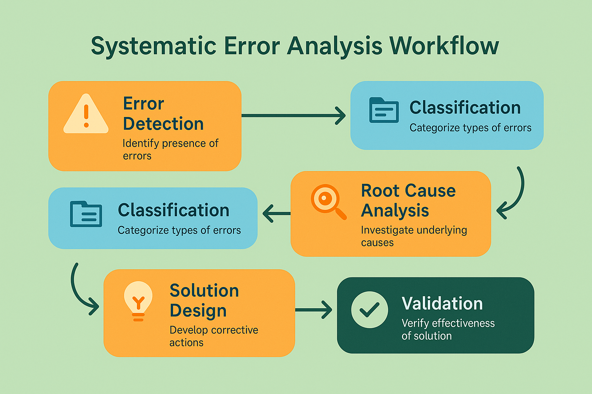

# Detection and Monitoring Systems: Building Proactive Error Intelligence


## Introduction: From Reactive to Proactive Error Management

The evolution from reactive debugging to proactive error detection represents one of the most significant advances in AI system reliability engineering. Traditional approaches wait for users to report problems or for systems to fail catastrophically before initiating response efforts. Modern detection and monitoring systems identify potential issues before they impact users, enabling teams to maintain high system reliability while minimizing user disruption.

The challenge of AI system monitoring extends far beyond traditional software monitoring approaches. While conventional systems typically have well-defined success and failure states, AI systems operate in probabilistic domains where the boundary between acceptable and unacceptable behavior is often subtle and context-dependent. This complexity requires sophisticated monitoring approaches that can detect degradation in system quality before it becomes obvious to users.

Effective AI monitoring systems must balance sensitivity with specificity, detecting real problems while avoiding false alarms that can overwhelm engineering teams and reduce confidence in the monitoring system. This balance requires careful tuning of detection thresholds, sophisticated analysis of error patterns, and deep understanding of the specific characteristics of the AI system being monitored.

The business impact of proactive error detection extends far beyond technical system reliability. Organizations that can identify and address AI system issues before they affect users maintain higher customer satisfaction, reduce support costs, and build stronger competitive positions. The investment in comprehensive monitoring systems pays dividends through improved user experience and reduced operational overhead.

## Comprehensive Monitoring Architecture

### Multi-Layer Detection Framework



Effective AI system monitoring requires a multi-layered approach that captures different types of errors at various stages of the system pipeline. Each layer provides unique insights into system behavior and contributes to a comprehensive understanding of system health and performance.

**Input Layer Monitoring** focuses on detecting problems with the data and requests entering the AI system. This layer identifies issues such as malformed inputs, out-of-distribution data, adversarial inputs, and unusual request patterns that might indicate system abuse or emerging failure modes.

Input monitoring requires sophisticated understanding of the expected characteristics of legitimate system inputs. This understanding must be continuously updated as user behavior evolves and new use cases emerge. The monitoring system must distinguish between legitimate edge cases that the system should handle gracefully and problematic inputs that indicate potential security or reliability issues.

The implementation of input layer monitoring often involves statistical analysis of input distributions, anomaly detection algorithms, and pattern recognition systems that can identify unusual or potentially problematic requests. These systems must operate in real-time to provide timely alerts while maintaining low latency for normal system operation.

Input layer monitoring also provides valuable insights into user behavior and system usage patterns that can inform system design and improvement efforts. Understanding how users interact with AI systems helps teams optimize system performance and identify opportunities for enhanced functionality.

**Processing Layer Monitoring** tracks the internal behavior of AI models and processing pipelines, detecting issues such as model degradation, processing errors, and performance anomalies. This layer provides visibility into the core AI functionality that drives system behavior.

Processing layer monitoring requires deep integration with AI model infrastructure and sophisticated understanding of model behavior patterns. The monitoring system must track metrics such as model confidence scores, processing latencies, resource utilization, and intermediate processing results that indicate model health.

The challenge of processing layer monitoring lies in distinguishing between normal variation in model behavior and problematic degradation that requires intervention. AI models naturally exhibit some degree of variability in their outputs, and the monitoring system must understand which variations are acceptable and which indicate potential problems.

Processing layer monitoring also enables teams to track the effectiveness of model updates and system changes, providing rapid feedback on the impact of improvements and helping identify unintended consequences of system modifications.

**Output Layer Monitoring** analyzes the final outputs produced by AI systems, detecting issues such as quality degradation, inappropriate content, consistency problems, and user satisfaction issues. This layer provides the most direct assessment of user-facing system behavior.

Output layer monitoring requires sophisticated analysis techniques that can evaluate the quality and appropriateness of AI-generated content across multiple dimensions. This analysis often involves automated quality assessment tools, user feedback analysis, and comparison against established quality benchmarks.

The implementation of output layer monitoring must account for the subjective nature of many AI outputs and the context-dependent nature of quality assessment. What constitutes a high-quality output may vary significantly across different users, use cases, and contexts, requiring flexible monitoring approaches that can adapt to different evaluation criteria.

Output layer monitoring provides the most direct connection to user experience and business impact, making it essential for understanding the real-world effectiveness of AI systems and identifying opportunities for improvement.

**Feedback Layer Monitoring** captures and analyzes user feedback, support requests, and other indicators of user satisfaction and system effectiveness. This layer provides crucial insights into how AI system behavior affects real users in real-world contexts.

Feedback layer monitoring requires integration with customer support systems, user feedback collection mechanisms, and business metrics tracking systems. The monitoring system must correlate technical system behavior with user-reported issues and business outcomes to provide comprehensive understanding of system impact.

The analysis of user feedback requires sophisticated natural language processing and sentiment analysis capabilities that can extract meaningful insights from unstructured feedback data. The monitoring system must identify patterns in user complaints, track satisfaction trends, and correlate feedback with technical system metrics.

Feedback layer monitoring also provides validation for other monitoring layers, helping teams understand whether technical metrics accurately reflect user experience and business impact. This validation is essential for maintaining confidence in the monitoring system and ensuring that technical improvements translate into real-world benefits.

### Real-Time Detection Systems

```python
import asyncio
import logging
import time
from typing import Dict, List, Any, Optional, Callable
from dataclasses import dataclass, field
from enum import Enum
import numpy as np
from collections import deque, defaultdict
import json
import sqlite3
from datetime import datetime, timedelta

class AlertSeverity(Enum):
    LOW = "low"
    MEDIUM = "medium"
    HIGH = "high"
    CRITICAL = "critical"

class MonitoringMetric(Enum):
    ERROR_RATE = "error_rate"
    RESPONSE_TIME = "response_time"
    QUALITY_SCORE = "quality_score"
    USER_SATISFACTION = "user_satisfaction"
    THROUGHPUT = "throughput"
    RESOURCE_USAGE = "resource_usage"

@dataclass
class Alert:
    """Represents a monitoring alert"""
    alert_id: str
    timestamp: datetime
    severity: AlertSeverity
    metric: MonitoringMetric
    message: str
    current_value: float
    threshold_value: float
    context: Dict[str, Any] = field(default_factory=dict)
    acknowledged: bool = False
    resolved: bool = False

@dataclass
class MetricThreshold:
    """Defines thresholds for monitoring metrics"""
    metric: MonitoringMetric
    warning_threshold: float
    critical_threshold: float
    comparison_operator: str  # 'gt', 'lt', 'eq'
    time_window_seconds: int = 300  # 5 minutes default
    min_samples: int = 10

class RealTimeMonitor:
    """Real-time monitoring system for AI applications"""
    
    def __init__(self, db_path: str = "monitoring.db"):
        self.db_path = db_path
        self.metrics_buffer: Dict[MonitoringMetric, deque] = {
            metric: deque(maxlen=1000) for metric in MonitoringMetric
        }
        self.thresholds: Dict[MonitoringMetric, MetricThreshold] = {}
        self.alert_handlers: List[Callable[[Alert], None]] = []
        self.active_alerts: Dict[str, Alert] = {}
        self.is_running = False
        
        # Initialize database
        self._init_database()
        
        # Set up logging
        logging.basicConfig(level=logging.INFO)
        self.logger = logging.getLogger(__name__)
    
    def _init_database(self):
        """Initialize SQLite database for storing metrics and alerts"""
        conn = sqlite3.connect(self.db_path)
        cursor = conn.cursor()
        
        # Create metrics table
        cursor.execute('''
            CREATE TABLE IF NOT EXISTS metrics (
                id INTEGER PRIMARY KEY AUTOINCREMENT,
                timestamp REAL,
                metric_type TEXT,
                value REAL,
                context TEXT
            )
        ''')
        
        # Create alerts table
        cursor.execute('''
            CREATE TABLE IF NOT EXISTS alerts (
                id INTEGER PRIMARY KEY AUTOINCREMENT,
                alert_id TEXT UNIQUE,
                timestamp REAL,
                severity TEXT,
                metric_type TEXT,
                message TEXT,
                current_value REAL,
                threshold_value REAL,
                context TEXT,
                acknowledged INTEGER DEFAULT 0,
                resolved INTEGER DEFAULT 0
            )
        ''')
        
        conn.commit()
        conn.close()
    
    def set_threshold(self, threshold: MetricThreshold):
        """Set monitoring threshold for a metric"""
        self.thresholds[threshold.metric] = threshold
        self.logger.info(f"Set threshold for {threshold.metric.value}: "
                        f"warning={threshold.warning_threshold}, "
                        f"critical={threshold.critical_threshold}")
    
    def add_alert_handler(self, handler: Callable[[Alert], None]):
        """Add alert handler function"""
        self.alert_handlers.append(handler)
    
    def record_metric(self, metric: MonitoringMetric, value: float, 
                     context: Dict[str, Any] = None):
        """Record a metric value"""
        timestamp = time.time()
        
        # Add to buffer
        self.metrics_buffer[metric].append({
            'timestamp': timestamp,
            'value': value,
            'context': context or {}
        })
        
        # Store in database
        self._store_metric(timestamp, metric, value, context)
        
        # Check thresholds
        if metric in self.thresholds:
            self._check_threshold(metric, value, context)
    
    def _store_metric(self, timestamp: float, metric: MonitoringMetric, 
                     value: float, context: Dict[str, Any]):
        """Store metric in database"""
        conn = sqlite3.connect(self.db_path)
        cursor = conn.cursor()
        
        cursor.execute('''
            INSERT INTO metrics (timestamp, metric_type, value, context)
            VALUES (?, ?, ?, ?)
        ''', (timestamp, metric.value, value, json.dumps(context or {})))
        
        conn.commit()
        conn.close()
    
    def _check_threshold(self, metric: MonitoringMetric, current_value: float,
                        context: Dict[str, Any]):
        """Check if metric value exceeds thresholds"""
        threshold = self.thresholds[metric]
        
        # Get recent values for time window analysis
        recent_values = self._get_recent_values(metric, threshold.time_window_seconds)
        
        if len(recent_values) < threshold.min_samples:
            return  # Not enough samples
        
        # Calculate aggregate value (mean for time window)
        aggregate_value = np.mean([v['value'] for v in recent_values])
        
        # Check thresholds
        severity = None
        threshold_value = None
        
        if threshold.comparison_operator == 'gt':
            if aggregate_value > threshold.critical_threshold:
                severity = AlertSeverity.CRITICAL
                threshold_value = threshold.critical_threshold
            elif aggregate_value > threshold.warning_threshold:
                severity = AlertSeverity.HIGH
                threshold_value = threshold.warning_threshold
        elif threshold.comparison_operator == 'lt':
            if aggregate_value < threshold.critical_threshold:
                severity = AlertSeverity.CRITICAL
                threshold_value = threshold.critical_threshold
            elif aggregate_value < threshold.warning_threshold:
                severity = AlertSeverity.HIGH
                threshold_value = threshold.warning_threshold
        
        if severity:
            self._create_alert(metric, severity, aggregate_value, threshold_value, context)
    
    def _get_recent_values(self, metric: MonitoringMetric, 
                          time_window_seconds: int) -> List[Dict[str, Any]]:
        """Get recent metric values within time window"""
        current_time = time.time()
        cutoff_time = current_time - time_window_seconds
        
        recent_values = []
        for value_data in self.metrics_buffer[metric]:
            if value_data['timestamp'] >= cutoff_time:
                recent_values.append(value_data)
        
        return recent_values
    
    def _create_alert(self, metric: MonitoringMetric, severity: AlertSeverity,
                     current_value: float, threshold_value: float,
                     context: Dict[str, Any]):
        """Create and process alert"""
        alert_id = f"{metric.value}_{severity.value}_{int(time.time())}"
        
        # Check if similar alert already exists
        existing_alert_key = f"{metric.value}_{severity.value}"
        if existing_alert_key in self.active_alerts:
            return  # Don't create duplicate alerts
        
        alert = Alert(
            alert_id=alert_id,
            timestamp=datetime.now(),
            severity=severity,
            metric=metric,
            message=f"{metric.value} {severity.value}: {current_value:.3f} "
                   f"(threshold: {threshold_value:.3f})",
            current_value=current_value,
            threshold_value=threshold_value,
            context=context
        )
        
        self.active_alerts[existing_alert_key] = alert
        
        # Store alert in database
        self._store_alert(alert)
        
        # Notify handlers
        for handler in self.alert_handlers:
            try:
                handler(alert)
            except Exception as e:
                self.logger.error(f"Error in alert handler: {e}")
        
        self.logger.warning(f"Alert created: {alert.message}")
    
    def _store_alert(self, alert: Alert):
        """Store alert in database"""
        conn = sqlite3.connect(self.db_path)
        cursor = conn.cursor()
        
        cursor.execute('''
            INSERT OR REPLACE INTO alerts 
            (alert_id, timestamp, severity, metric_type, message, 
             current_value, threshold_value, context)
            VALUES (?, ?, ?, ?, ?, ?, ?, ?)
        ''', (
            alert.alert_id,
            alert.timestamp.timestamp(),
            alert.severity.value,
            alert.metric.value,
            alert.message,
            alert.current_value,
            alert.threshold_value,
            json.dumps(alert.context)
        ))
        
        conn.commit()
        conn.close()
    
    def acknowledge_alert(self, alert_id: str, user_id: str):
        """Acknowledge an alert"""
        conn = sqlite3.connect(self.db_path)
        cursor = conn.cursor()
        
        cursor.execute('''
            UPDATE alerts SET acknowledged = 1 
            WHERE alert_id = ?
        ''', (alert_id,))
        
        conn.commit()
        conn.close()
        
        # Update active alerts
        for key, alert in self.active_alerts.items():
            if alert.alert_id == alert_id:
                alert.acknowledged = True
                break
        
        self.logger.info(f"Alert {alert_id} acknowledged by {user_id}")
    
    def resolve_alert(self, alert_id: str, user_id: str):
        """Resolve an alert"""
        conn = sqlite3.connect(self.db_path)
        cursor = conn.cursor()
        
        cursor.execute('''
            UPDATE alerts SET resolved = 1 
            WHERE alert_id = ?
        ''', (alert_id,))
        
        conn.commit()
        conn.close()
        
        # Remove from active alerts
        for key, alert in list(self.active_alerts.items()):
            if alert.alert_id == alert_id:
                alert.resolved = True
                del self.active_alerts[key]
                break
        
        self.logger.info(f"Alert {alert_id} resolved by {user_id}")
    
    def get_metrics_summary(self, time_window_hours: int = 24) -> Dict[str, Any]:
        """Get summary of metrics over time window"""
        conn = sqlite3.connect(self.db_path)
        cursor = conn.cursor()
        
        cutoff_time = time.time() - (time_window_hours * 3600)
        
        cursor.execute('''
            SELECT metric_type, COUNT(*), AVG(value), MIN(value), MAX(value)
            FROM metrics 
            WHERE timestamp > ?
            GROUP BY metric_type
        ''', (cutoff_time,))
        
        results = cursor.fetchall()
        conn.close()
        
        summary = {}
        for metric_type, count, avg_val, min_val, max_val in results:
            summary[metric_type] = {
                'count': count,
                'average': avg_val,
                'minimum': min_val,
                'maximum': max_val
            }
        
        return summary
    
    def get_active_alerts(self) -> List[Alert]:
        """Get list of active alerts"""
        return list(self.active_alerts.values())
    
    async def start_monitoring(self):
        """Start the monitoring system"""
        self.is_running = True
        self.logger.info("Monitoring system started")
        
        while self.is_running:
            # Perform periodic maintenance tasks
            await self._cleanup_old_data()
            await self._check_alert_escalation()
            
            # Wait before next cycle
            await asyncio.sleep(60)  # Check every minute
    
    def stop_monitoring(self):
        """Stop the monitoring system"""
        self.is_running = False
        self.logger.info("Monitoring system stopped")
    
    async def _cleanup_old_data(self):
        """Clean up old metrics data"""
        conn = sqlite3.connect(self.db_path)
        cursor = conn.cursor()
        
        # Keep only last 30 days of metrics
        cutoff_time = time.time() - (30 * 24 * 3600)
        
        cursor.execute('DELETE FROM metrics WHERE timestamp < ?', (cutoff_time,))
        conn.commit()
        conn.close()
    
    async def _check_alert_escalation(self):
        """Check for alerts that need escalation"""
        current_time = datetime.now()
        
        for alert in self.active_alerts.values():
            if not alert.acknowledged:
                time_since_alert = current_time - alert.timestamp
                
                # Escalate critical alerts after 15 minutes
                if (alert.severity == AlertSeverity.CRITICAL and 
                    time_since_alert > timedelta(minutes=15)):
                    self._escalate_alert(alert)
                
                # Escalate high alerts after 1 hour
                elif (alert.severity == AlertSeverity.HIGH and 
                      time_since_alert > timedelta(hours=1)):
                    self._escalate_alert(alert)
    
    def _escalate_alert(self, alert: Alert):
        """Escalate an unacknowledged alert"""
        escalated_alert = Alert(
            alert_id=f"{alert.alert_id}_escalated",
            timestamp=datetime.now(),
            severity=AlertSeverity.CRITICAL,
            metric=alert.metric,
            message=f"ESCALATED: {alert.message}",
            current_value=alert.current_value,
            threshold_value=alert.threshold_value,
            context=alert.context
        )
        
        for handler in self.alert_handlers:
            try:
                handler(escalated_alert)
            except Exception as e:
                self.logger.error(f"Error in escalation handler: {e}")
        
        self.logger.critical(f"Alert escalated: {escalated_alert.message}")

# Example alert handlers
def email_alert_handler(alert: Alert):
    """Example email alert handler"""
    print(f"EMAIL ALERT: {alert.severity.value.upper()} - {alert.message}")
    # In real implementation, would send actual email

def slack_alert_handler(alert: Alert):
    """Example Slack alert handler"""
    print(f"SLACK ALERT: {alert.severity.value.upper()} - {alert.message}")
    # In real implementation, would send to Slack

def pagerduty_alert_handler(alert: Alert):
    """Example PagerDuty alert handler"""
    if alert.severity in [AlertSeverity.CRITICAL, AlertSeverity.HIGH]:
        print(f"PAGERDUTY ALERT: {alert.severity.value.upper()} - {alert.message}")
        # In real implementation, would trigger PagerDuty incident

# Usage example
async def monitoring_example():
    # Create monitoring system
    monitor = RealTimeMonitor()
    
    # Set up thresholds
    monitor.set_threshold(MetricThreshold(
        metric=MonitoringMetric.ERROR_RATE,
        warning_threshold=0.05,  # 5%
        critical_threshold=0.10,  # 10%
        comparison_operator='gt',
        time_window_seconds=300,
        min_samples=10
    ))
    
    monitor.set_threshold(MetricThreshold(
        metric=MonitoringMetric.RESPONSE_TIME,
        warning_threshold=2.0,  # 2 seconds
        critical_threshold=5.0,  # 5 seconds
        comparison_operator='gt',
        time_window_seconds=300,
        min_samples=10
    ))
    
    monitor.set_threshold(MetricThreshold(
        metric=MonitoringMetric.QUALITY_SCORE,
        warning_threshold=0.8,  # 80%
        critical_threshold=0.7,  # 70%
        comparison_operator='lt',
        time_window_seconds=600,
        min_samples=20
    ))
    
    # Add alert handlers
    monitor.add_alert_handler(email_alert_handler)
    monitor.add_alert_handler(slack_alert_handler)
    monitor.add_alert_handler(pagerduty_alert_handler)
    
    # Start monitoring in background
    monitoring_task = asyncio.create_task(monitor.start_monitoring())
    
    # Simulate some metrics
    for i in range(50):
        # Simulate normal operation
        monitor.record_metric(MonitoringMetric.ERROR_RATE, 0.02 + np.random.normal(0, 0.01))
        monitor.record_metric(MonitoringMetric.RESPONSE_TIME, 1.5 + np.random.normal(0, 0.3))
        monitor.record_metric(MonitoringMetric.QUALITY_SCORE, 0.85 + np.random.normal(0, 0.05))
        
        # Simulate occasional problems
        if i == 30:
            # Simulate error rate spike
            for j in range(15):
                monitor.record_metric(MonitoringMetric.ERROR_RATE, 0.12 + np.random.normal(0, 0.02))
                await asyncio.sleep(0.1)
        
        if i == 40:
            # Simulate quality degradation
            for j in range(25):
                monitor.record_metric(MonitoringMetric.QUALITY_SCORE, 0.65 + np.random.normal(0, 0.05))
                await asyncio.sleep(0.1)
        
        await asyncio.sleep(0.5)
    
    # Get metrics summary
    summary = monitor.get_metrics_summary(time_window_hours=1)
    print("\nMetrics Summary:")
    for metric, stats in summary.items():
        print(f"{metric}: avg={stats['average']:.3f}, "
              f"min={stats['minimum']:.3f}, max={stats['maximum']:.3f}")
    
    # Get active alerts
    active_alerts = monitor.get_active_alerts()
    print(f"\nActive Alerts: {len(active_alerts)}")
    for alert in active_alerts:
        print(f"  {alert.severity.value}: {alert.message}")
    
    # Stop monitoring
    monitor.stop_monitoring()
    monitoring_task.cancel()

# Run the example
if __name__ == "__main__":
    asyncio.run(monitoring_example())
```

### Anomaly Detection Systems

Anomaly detection represents a crucial component of AI system monitoring, enabling teams to identify unusual patterns and behaviors that may indicate emerging problems or system degradation. Unlike threshold-based monitoring that relies on predefined limits, anomaly detection systems learn normal system behavior patterns and flag deviations that warrant investigation.

The challenge of anomaly detection in AI systems lies in distinguishing between beneficial variation that represents normal system adaptation and problematic variation that indicates potential issues. AI systems naturally exhibit some degree of behavioral variation as they encounter new inputs and contexts, making it essential to understand which variations are expected and which require attention.

Effective anomaly detection systems must operate across multiple dimensions of system behavior, from low-level technical metrics such as response times and resource utilization to high-level quality metrics such as user satisfaction and output appropriateness. Each dimension requires different analytical approaches and detection algorithms optimized for the specific characteristics of the data being monitored.

The implementation of anomaly detection systems requires careful consideration of false positive rates and detection sensitivity. Systems that are too sensitive may generate excessive alerts that overwhelm engineering teams, while systems that are not sensitive enough may miss important issues until they become severe problems.

```python
import numpy as np
import pandas as pd
from sklearn.ensemble import IsolationForest
from sklearn.preprocessing import StandardScaler
from sklearn.decomposition import PCA
import matplotlib.pyplot as plt
import seaborn as sns
from typing import Dict, List, Tuple, Any
from dataclasses import dataclass
from datetime import datetime, timedelta
import warnings
warnings.filterwarnings('ignore')

@dataclass
class AnomalyResult:
    """Result of anomaly detection analysis"""
    timestamp: datetime
    is_anomaly: bool
    anomaly_score: float
    feature_contributions: Dict[str, float]
    context: Dict[str, Any]

class MultiDimensionalAnomalyDetector:
    """Advanced anomaly detection for AI system monitoring"""
    
    def __init__(self, contamination: float = 0.1, n_components: int = 5):
        self.contamination = contamination
        self.n_components = n_components
        
        # Models for different types of anomaly detection
        self.isolation_forest = IsolationForest(
            contamination=contamination,
            random_state=42,
            n_estimators=100
        )
        
        self.scaler = StandardScaler()
        self.pca = PCA(n_components=n_components)
        
        # Training data and fitted status
        self.is_fitted = False
        self.feature_names = []
        self.baseline_stats = {}
        self.training_data = None
    
    def prepare_features(self, data: pd.DataFrame) -> np.ndarray:
        """Prepare features for anomaly detection"""
        
        # Select numeric columns
        numeric_columns = data.select_dtypes(include=[np.number]).columns
        features = data[numeric_columns].fillna(0)
        
        # Add derived features
        if 'error_rate' in features.columns and 'response_time' in features.columns:
            features['error_response_ratio'] = features['error_rate'] / (features['response_time'] + 1e-6)
        
        if 'quality_score' in features.columns and 'user_satisfaction' in features.columns:
            features['quality_satisfaction_diff'] = features['quality_score'] - features['user_satisfaction']
        
        # Add time-based features if timestamp is available
        if 'timestamp' in data.columns:
            timestamps = pd.to_datetime(data['timestamp'])
            features['hour_of_day'] = timestamps.dt.hour
            features['day_of_week'] = timestamps.dt.dayofweek
            features['is_weekend'] = (timestamps.dt.dayofweek >= 5).astype(int)
        
        return features
    
    def fit(self, data: pd.DataFrame):
        """Train the anomaly detection model"""
        
        # Prepare features
        features = self.prepare_features(data)
        self.feature_names = features.columns.tolist()
        
        # Store baseline statistics
        self.baseline_stats = {
            'mean': features.mean().to_dict(),
            'std': features.std().to_dict(),
            'min': features.min().to_dict(),
            'max': features.max().to_dict()
        }
        
        # Scale features
        scaled_features = self.scaler.fit_transform(features)
        
        # Apply PCA for dimensionality reduction
        pca_features = self.pca.fit_transform(scaled_features)
        
        # Train isolation forest
        self.isolation_forest.fit(pca_features)
        
        # Store training data for reference
        self.training_data = features.copy()
        self.is_fitted = True
        
        print(f"Anomaly detector trained on {len(data)} samples")
        print(f"Features: {self.feature_names}")
        print(f"PCA explained variance ratio: {self.pca.explained_variance_ratio_}")
    
    def detect_anomalies(self, data: pd.DataFrame) -> List[AnomalyResult]:
        """Detect anomalies in new data"""
        
        if not self.is_fitted:
            raise ValueError("Model must be fitted before detecting anomalies")
        
        # Prepare features
        features = self.prepare_features(data)
        
        # Ensure all training features are present
        for feature in self.feature_names:
            if feature not in features.columns:
                features[feature] = 0
        
        features = features[self.feature_names]
        
        # Scale features
        scaled_features = self.scaler.transform(features)
        
        # Apply PCA
        pca_features = self.pca.transform(scaled_features)
        
        # Detect anomalies
        anomaly_predictions = self.isolation_forest.predict(pca_features)
        anomaly_scores = self.isolation_forest.score_samples(pca_features)
        
        # Calculate feature contributions
        results = []
        for i, (pred, score) in enumerate(zip(anomaly_predictions, anomaly_scores)):
            is_anomaly = pred == -1
            
            # Calculate feature contributions to anomaly score
            feature_contributions = self._calculate_feature_contributions(
                features.iloc[i], scaled_features[i]
            )
            
            result = AnomalyResult(
                timestamp=datetime.now() if 'timestamp' not in data.columns 
                         else pd.to_datetime(data.iloc[i]['timestamp']),
                is_anomaly=is_anomaly,
                anomaly_score=score,
                feature_contributions=feature_contributions,
                context={'row_index': i}
            )
            
            results.append(result)
        
        return results
    
    def _calculate_feature_contributions(self, original_features: pd.Series, 
                                       scaled_features: np.ndarray) -> Dict[str, float]:
        """Calculate how much each feature contributes to anomaly score"""
        
        contributions = {}
        
        for i, feature_name in enumerate(self.feature_names):
            # Calculate deviation from baseline
            baseline_mean = self.baseline_stats['mean'][feature_name]
            baseline_std = self.baseline_stats['std'][feature_name]
            
            if baseline_std > 0:
                deviation = abs(original_features[feature_name] - baseline_mean) / baseline_std
            else:
                deviation = 0
            
            contributions[feature_name] = deviation
        
        return contributions
    
    def analyze_anomaly_patterns(self, results: List[AnomalyResult]) -> Dict[str, Any]:
        """Analyze patterns in detected anomalies"""
        
        anomalies = [r for r in results if r.is_anomaly]
        
        if not anomalies:
            return {'total_anomalies': 0}
        
        # Time distribution of anomalies
        timestamps = [a.timestamp for a in anomalies]
        time_analysis = {
            'total_anomalies': len(anomalies),
            'anomaly_rate': len(anomalies) / len(results),
            'first_anomaly': min(timestamps),
            'last_anomaly': max(timestamps),
            'time_span_hours': (max(timestamps) - min(timestamps)).total_seconds() / 3600
        }
        
        # Feature contribution analysis
        all_contributions = defaultdict(list)
        for anomaly in anomalies:
            for feature, contribution in anomaly.feature_contributions.items():
                all_contributions[feature].append(contribution)
        
        feature_analysis = {}
        for feature, contributions in all_contributions.items():
            feature_analysis[feature] = {
                'mean_contribution': np.mean(contributions),
                'max_contribution': np.max(contributions),
                'frequency': len([c for c in contributions if c > 1.0])  # Significant deviations
            }
        
        # Anomaly score distribution
        scores = [a.anomaly_score for a in anomalies]
        score_analysis = {
            'mean_score': np.mean(scores),
            'min_score': np.min(scores),
            'max_score': np.max(scores),
            'score_std': np.std(scores)
        }
        
        return {
            'time_analysis': time_analysis,
            'feature_analysis': feature_analysis,
            'score_analysis': score_analysis
        }
    
    def visualize_anomalies(self, data: pd.DataFrame, results: List[AnomalyResult]):
        """Create visualizations of anomaly detection results"""
        
        # Prepare data for visualization
        viz_data = data.copy()
        viz_data['is_anomaly'] = [r.is_anomaly for r in results]
        viz_data['anomaly_score'] = [r.anomaly_score for r in results]
        
        # Create subplots
        fig, axes = plt.subplots(2, 2, figsize=(15, 12))
        fig.suptitle('Anomaly Detection Analysis', fontsize=16)
        
        # 1. Anomaly score distribution
        axes[0, 0].hist(viz_data['anomaly_score'], bins=30, alpha=0.7, color='blue', label='Normal')
        anomaly_scores = viz_data[viz_data['is_anomaly']]['anomaly_score']
        if len(anomaly_scores) > 0:
            axes[0, 0].hist(anomaly_scores, bins=30, alpha=0.7, color='red', label='Anomaly')
        axes[0, 0].set_xlabel('Anomaly Score')
        axes[0, 0].set_ylabel('Frequency')
        axes[0, 0].set_title('Anomaly Score Distribution')
        axes[0, 0].legend()
        
        # 2. Time series of anomalies
        if 'timestamp' in data.columns:
            timestamps = pd.to_datetime(data['timestamp'])
            axes[0, 1].scatter(timestamps[~viz_data['is_anomaly']], 
                             viz_data[~viz_data['is_anomaly']]['anomaly_score'], 
                             alpha=0.6, color='blue', label='Normal', s=20)
            if len(anomaly_scores) > 0:
                axes[0, 1].scatter(timestamps[viz_data['is_anomaly']], 
                                 anomaly_scores, 
                                 alpha=0.8, color='red', label='Anomaly', s=50)
            axes[0, 1].set_xlabel('Time')
            axes[0, 1].set_ylabel('Anomaly Score')
            axes[0, 1].set_title('Anomalies Over Time')
            axes[0, 1].legend()
        
        # 3. Feature correlation with anomalies
        numeric_features = viz_data.select_dtypes(include=[np.number]).columns
        if len(numeric_features) > 1:
            correlation_data = viz_data[numeric_features].corr()['is_anomaly'].abs().sort_values(ascending=False)
            correlation_data = correlation_data.drop('is_anomaly')[:10]  # Top 10 correlations
            
            axes[1, 0].barh(range(len(correlation_data)), correlation_data.values)
            axes[1, 0].set_yticks(range(len(correlation_data)))
            axes[1, 0].set_yticklabels(correlation_data.index)
            axes[1, 0].set_xlabel('Correlation with Anomaly')
            axes[1, 0].set_title('Feature Correlation with Anomalies')
        
        # 4. PCA visualization (if 2D projection available)
        if self.is_fitted and len(self.feature_names) >= 2:
            features = self.prepare_features(data)[self.feature_names]
            scaled_features = self.scaler.transform(features)
            pca_2d = PCA(n_components=2)
            pca_features = pca_2d.fit_transform(scaled_features)
            
            axes[1, 1].scatter(pca_features[~viz_data['is_anomaly'], 0], 
                             pca_features[~viz_data['is_anomaly'], 1], 
                             alpha=0.6, color='blue', label='Normal', s=20)
            if len(anomaly_scores) > 0:
                axes[1, 1].scatter(pca_features[viz_data['is_anomaly'], 0], 
                                 pca_features[viz_data['is_anomaly'], 1], 
                                 alpha=0.8, color='red', label='Anomaly', s=50)
            axes[1, 1].set_xlabel('First Principal Component')
            axes[1, 1].set_ylabel('Second Principal Component')
            axes[1, 1].set_title('PCA Visualization')
            axes[1, 1].legend()
        
        plt.tight_layout()
        plt.show()
    
    def generate_anomaly_report(self, data: pd.DataFrame, 
                              results: List[AnomalyResult]) -> str:
        """Generate comprehensive anomaly detection report"""
        
        analysis = self.analyze_anomaly_patterns(results)
        
        if analysis['total_anomalies'] == 0:
            return "No anomalies detected in the analyzed data."
        
        report = f"""
# Anomaly Detection Report

## Summary
- **Total Data Points**: {len(results)}
- **Anomalies Detected**: {analysis['total_anomalies']}
- **Anomaly Rate**: {analysis['anomaly_rate']:.2%}

## Time Analysis
- **First Anomaly**: {analysis['time_analysis']['first_anomaly']}
- **Last Anomaly**: {analysis['time_analysis']['last_anomaly']}
- **Time Span**: {analysis['time_analysis']['time_span_hours']:.1f} hours

## Feature Analysis
Top contributing features to anomalies:
"""
        
        # Sort features by mean contribution
        feature_analysis = analysis['feature_analysis']
        sorted_features = sorted(feature_analysis.items(), 
                               key=lambda x: x[1]['mean_contribution'], 
                               reverse=True)
        
        for feature, stats in sorted_features[:5]:
            report += f"""
- **{feature}**: 
  - Mean contribution: {stats['mean_contribution']:.2f}
  - Max contribution: {stats['max_contribution']:.2f}
  - Significant deviations: {stats['frequency']}
"""
        
        report += f"""
## Anomaly Scores
- **Mean Score**: {analysis['score_analysis']['mean_score']:.3f}
- **Score Range**: {analysis['score_analysis']['min_score']:.3f} to {analysis['score_analysis']['max_score']:.3f}
- **Standard Deviation**: {analysis['score_analysis']['score_std']:.3f}

## Recommendations
"""
        
        # Generate recommendations based on analysis
        if analysis['anomaly_rate'] > 0.1:
            report += "- High anomaly rate detected. Consider reviewing system configuration or model parameters.\n"
        
        top_feature = sorted_features[0][0] if sorted_features else None
        if top_feature:
            report += f"- Focus investigation on '{top_feature}' as it shows the highest contribution to anomalies.\n"
        
        if analysis['time_analysis']['time_span_hours'] < 1:
            report += "- Anomalies clustered in short time period. Investigate potential system events or changes.\n"
        
        return report.strip()

# Example usage
def generate_sample_data(n_samples: int = 1000) -> pd.DataFrame:
    """Generate sample monitoring data for demonstration"""
    
    np.random.seed(42)
    
    # Generate timestamps
    start_time = datetime.now() - timedelta(hours=24)
    timestamps = [start_time + timedelta(minutes=i) for i in range(n_samples)]
    
    # Generate normal data
    data = {
        'timestamp': timestamps,
        'error_rate': np.random.normal(0.02, 0.005, n_samples),
        'response_time': np.random.normal(1.5, 0.3, n_samples),
        'quality_score': np.random.normal(0.85, 0.05, n_samples),
        'user_satisfaction': np.random.normal(0.8, 0.1, n_samples),
        'throughput': np.random.normal(100, 15, n_samples),
        'cpu_usage': np.random.normal(0.6, 0.1, n_samples),
        'memory_usage': np.random.normal(0.7, 0.15, n_samples)
    }
    
    # Inject some anomalies
    anomaly_indices = np.random.choice(n_samples, size=50, replace=False)
    
    for idx in anomaly_indices:
        # Random type of anomaly
        anomaly_type = np.random.choice(['error_spike', 'quality_drop', 'performance_issue'])
        
        if anomaly_type == 'error_spike':
            data['error_rate'][idx] = np.random.normal(0.15, 0.03)
        elif anomaly_type == 'quality_drop':
            data['quality_score'][idx] = np.random.normal(0.4, 0.1)
            data['user_satisfaction'][idx] = np.random.normal(0.3, 0.1)
        elif anomaly_type == 'performance_issue':
            data['response_time'][idx] = np.random.normal(5.0, 1.0)
            data['cpu_usage'][idx] = np.random.normal(0.95, 0.02)
    
    # Ensure values are within reasonable bounds
    data['error_rate'] = np.clip(data['error_rate'], 0, 1)
    data['quality_score'] = np.clip(data['quality_score'], 0, 1)
    data['user_satisfaction'] = np.clip(data['user_satisfaction'], 0, 1)
    data['cpu_usage'] = np.clip(data['cpu_usage'], 0, 1)
    data['memory_usage'] = np.clip(data['memory_usage'], 0, 1)
    data['response_time'] = np.clip(data['response_time'], 0.1, 10)
    data['throughput'] = np.clip(data['throughput'], 10, 200)
    
    return pd.DataFrame(data)

# Demonstration
if __name__ == "__main__":
    # Generate sample data
    print("Generating sample monitoring data...")
    sample_data = generate_sample_data(1000)
    
    # Split into training and test data
    train_data = sample_data[:800]
    test_data = sample_data[800:]
    
    # Create and train anomaly detector
    print("Training anomaly detector...")
    detector = MultiDimensionalAnomalyDetector(contamination=0.05)
    detector.fit(train_data)
    
    # Detect anomalies in test data
    print("Detecting anomalies...")
    results = detector.detect_anomalies(test_data)
    
    # Analyze results
    print("Analyzing anomaly patterns...")
    analysis = detector.analyze_anomaly_patterns(results)
    
    # Generate report
    report = detector.generate_anomaly_report(test_data, results)
    print("\n" + "="*50)
    print(report)
    print("="*50)
    
    # Create visualizations
    print("\nGenerating visualizations...")
    detector.visualize_anomalies(test_data, results)
```

## Conclusion: Building Comprehensive Detection Capabilities

Detection and monitoring systems represent the nervous system of reliable AI applications, providing the real-time intelligence needed to maintain high system performance and user satisfaction. The comprehensive approach presented in this section enables teams to build sophisticated monitoring capabilities that scale with system complexity while remaining practical for day-to-day operations.

The multi-layer detection framework captures different types of issues at various stages of the AI pipeline, from input validation through output quality assessment. This comprehensive coverage ensures that problems are identified quickly, regardless of where they originate in the system architecture.

The real-time monitoring and anomaly detection systems provide the automated intelligence needed to handle the scale and complexity of modern AI deployments. These systems enable teams to identify issues before they impact users while maintaining the sensitivity needed to catch subtle degradation patterns that might otherwise go unnoticed.

The integration of monitoring systems with existing development and operations workflows ensures that detection capabilities enhance rather than burden engineering teams. Effective monitoring systems provide actionable insights that guide improvement efforts while minimizing false alarms and operational overhead.

As AI systems continue to evolve and become more central to business operations, the ability to monitor and detect issues systematically will become increasingly important for maintaining competitive advantage and user trust. The frameworks and techniques presented in this section provide the foundation for building world-class monitoring capabilities that grow with organizational needs and system complexity.

---

**Next**: [Section 3: Root Cause Analysis Methodologies →](03-root-cause-analysis.md)

