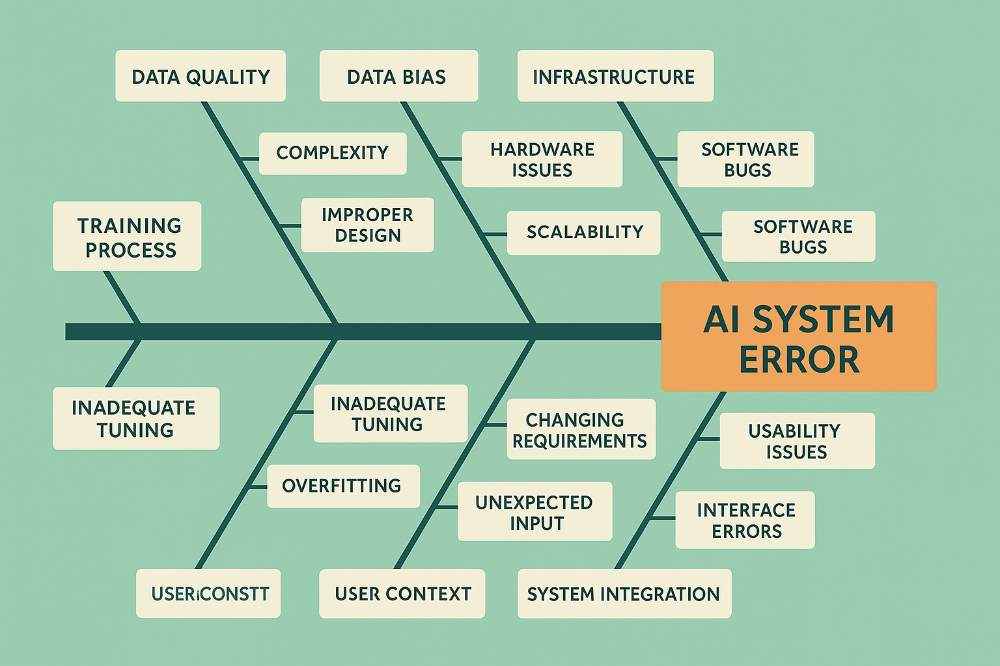

# Root Cause Analysis Methodologies: Uncovering the Why Behind AI Failures



## Introduction: Beyond Surface-Level Symptoms

Root cause analysis represents the investigative discipline that transforms reactive debugging into systematic understanding of AI system failures. While symptom-focused approaches address immediate problems, root cause analysis uncovers the underlying factors that make errors possible, enabling teams to implement solutions that prevent entire classes of problems rather than just fixing individual instances.

The complexity of modern AI systems makes root cause analysis both more challenging and more critical than in traditional software development. AI systems involve intricate interactions between data, models, infrastructure, and user context that can produce failure modes far removed from their underlying causes. A user-facing error might stem from training data quality issues, model architecture limitations, infrastructure problems, or subtle interactions between multiple system components.

Effective root cause analysis in AI systems requires systematic methodologies that can navigate this complexity while maintaining focus on actionable insights. The approaches presented in this section provide structured frameworks for investigating AI system failures, from initial symptom identification through final solution validation.

The business impact of thorough root cause analysis extends far beyond individual error resolution. Organizations that consistently identify and address root causes build more reliable systems, reduce operational costs, and develop institutional knowledge that prevents future problems. The investment in systematic root cause analysis capabilities pays dividends through improved system reliability and reduced time-to-resolution for future issues.

## Systematic Investigation Frameworks

### The Five Whys for AI Systems

The Five Whys methodology, adapted for AI system analysis, provides a structured approach to drilling down from surface symptoms to underlying root causes. This technique is particularly valuable for AI systems because it helps investigators navigate the multiple layers of abstraction between user-visible problems and their technical origins.

The application of Five Whys to AI systems requires careful consideration of the unique characteristics of machine learning systems, including their probabilistic nature, data dependencies, and complex training processes. Each "why" question must be formulated to explore different potential causal pathways while maintaining focus on actionable insights.

**Example Five Whys Analysis: AI Chatbot Providing Incorrect Information**

*Problem Statement*: Users report that the AI chatbot is providing incorrect answers about company policies.

*Why 1*: Why is the chatbot providing incorrect policy information?
*Answer*: The model is generating responses that contradict the official policy documentation.

*Why 2*: Why is the model contradicting official documentation?
*Answer*: The model's training data includes outdated policy information that conflicts with current guidelines.

*Why 3*: Why does the training data include outdated information?
*Answer*: The data pipeline automatically ingests historical documents without filtering for currency or relevance.

*Why 4*: Why doesn't the data pipeline filter for document currency?
*Answer*: The original system design assumed all company documents would remain current, and no versioning or expiration mechanism was implemented.

*Why 5*: Why was document versioning not considered in the original design?
*Answer*: The initial requirements gathering process focused on technical functionality without considering the operational lifecycle of company documentation.

*Root Cause*: Inadequate requirements analysis that failed to account for the dynamic nature of company documentation and the need for data currency validation in AI training pipelines.

*Solution*: Implement comprehensive document lifecycle management with automated currency validation, version control, and regular training data auditing processes.

The Five Whys methodology becomes particularly powerful when combined with systematic documentation and cross-functional collaboration. Each iteration should involve relevant stakeholders who can provide insights into different aspects of the system, from data engineering through user experience design.

### Fishbone Analysis for Complex AI Systems

The fishbone diagram (Ishikawa diagram) provides a visual framework for systematically exploring all potential contributing factors to AI system failures. This methodology is especially valuable for complex problems that may have multiple contributing causes across different system components.

The adaptation of fishbone analysis to AI systems requires careful consideration of the major categories of potential failure causes. The traditional categories of People, Process, Materials, Methods, Machines, and Environment must be reinterpreted for AI system contexts while maintaining comprehensive coverage of potential root causes.

**AI-Specific Fishbone Categories:**

**Data Quality**: Issues related to training data, input data, data processing, and data validation that can affect model performance and system reliability.

**Model Architecture**: Problems with model design, hyperparameter selection, training methodology, and model validation that impact system behavior.

**Infrastructure**: Technical issues with computing resources, deployment environments, scaling mechanisms, and system integration that affect system performance.

**Process and Workflow**: Problems with development processes, deployment procedures, monitoring practices, and operational workflows that contribute to system failures.

**Human Factors**: Issues related to user behavior, operator error, training gaps, and organizational factors that influence system effectiveness.

**External Environment**: Factors outside direct system control, including user context changes, external data sources, regulatory requirements, and competitive pressures.

The systematic exploration of each category helps ensure comprehensive investigation while preventing the tunnel vision that can occur when teams focus too narrowly on their area of expertise. The visual nature of the fishbone diagram facilitates collaborative analysis and helps teams identify potential interactions between different contributing factors.

```python
import matplotlib.pyplot as plt
import matplotlib.patches as patches
from typing import Dict, List, Tuple
import numpy as np

class AIFishboneAnalyzer:
    """Tool for creating and analyzing fishbone diagrams for AI system failures"""
    
    def __init__(self, problem_statement: str):
        self.problem_statement = problem_statement
        self.categories = {
            'Data Quality': [],
            'Model Architecture': [],
            'Infrastructure': [],
            'Process & Workflow': [],
            'Human Factors': [],
            'External Environment': []
        }
        self.analysis_notes = {}
    
    def add_cause(self, category: str, cause: str, subcauses: List[str] = None):
        """Add a potential cause to a category"""
        if category not in self.categories:
            raise ValueError(f"Category {category} not recognized")
        
        cause_entry = {
            'cause': cause,
            'subcauses': subcauses or [],
            'priority': None,
            'evidence': [],
            'likelihood': None
        }
        
        self.categories[category].append(cause_entry)
    
    def set_cause_priority(self, category: str, cause: str, priority: int):
        """Set priority for a specific cause (1=highest, 5=lowest)"""
        for cause_entry in self.categories[category]:
            if cause_entry['cause'] == cause:
                cause_entry['priority'] = priority
                break
    
    def add_evidence(self, category: str, cause: str, evidence: str):
        """Add evidence supporting a potential cause"""
        for cause_entry in self.categories[category]:
            if cause_entry['cause'] == cause:
                cause_entry['evidence'].append(evidence)
                break
    
    def set_likelihood(self, category: str, cause: str, likelihood: float):
        """Set likelihood score for a cause (0.0 to 1.0)"""
        for cause_entry in self.categories[category]:
            if cause_entry['cause'] == cause:
                cause_entry['likelihood'] = likelihood
                break
    
    def visualize_fishbone(self, figsize: Tuple[int, int] = (16, 10)):
        """Create visual fishbone diagram"""
        fig, ax = plt.subplots(figsize=figsize)
        
        # Main spine
        spine_start = (0.1, 0.5)
        spine_end = (0.8, 0.5)
        ax.plot([spine_start[0], spine_end[0]], [spine_start[1], spine_end[1]], 
                'k-', linewidth=3)
        
        # Problem box
        problem_box = patches.Rectangle((0.82, 0.45), 0.15, 0.1, 
                                      linewidth=2, edgecolor='red', 
                                      facecolor='lightcoral', alpha=0.7)
        ax.add_patch(problem_box)
        ax.text(0.895, 0.5, 'PROBLEM', ha='center', va='center', 
                fontweight='bold', fontsize=10)
        
        # Category positions (alternating above and below spine)
        category_positions = [
            (0.2, 0.75, 'Data Quality'),
            (0.2, 0.25, 'Model Architecture'),
            (0.4, 0.75, 'Infrastructure'),
            (0.4, 0.25, 'Process & Workflow'),
            (0.6, 0.75, 'Human Factors'),
            (0.6, 0.25, 'External Environment')
        ]
        
        colors = ['blue', 'green', 'orange', 'purple', 'brown', 'pink']
        
        for i, (x, y, category) in enumerate(category_positions):
            # Category branch
            if y > 0.5:  # Above spine
                ax.plot([x, x], [0.5, y-0.05], colors[i], linewidth=2)
                ax.plot([x-0.05, x+0.05], [y-0.05, y-0.05], colors[i], linewidth=2)
                text_y = y + 0.02
            else:  # Below spine
                ax.plot([x, x], [0.5, y+0.05], colors[i], linewidth=2)
                ax.plot([x-0.05, x+0.05], [y+0.05, y+0.05], colors[i], linewidth=2)
                text_y = y - 0.02
            
            # Category label
            ax.text(x, text_y, category, ha='center', va='center' if y > 0.5 else 'center',
                   fontweight='bold', fontsize=9, color=colors[i])
            
            # Add causes for this category
            causes = self.categories[category]
            for j, cause_entry in enumerate(causes[:3]):  # Limit to 3 causes per category
                cause_x = x + (j - 1) * 0.08
                if y > 0.5:
                    cause_y = y - 0.08 - j * 0.03
                    ax.plot([x, cause_x], [y-0.05, cause_y], colors[i], linewidth=1, alpha=0.7)
                else:
                    cause_y = y + 0.08 + j * 0.03
                    ax.plot([x, cause_x], [y+0.05, cause_y], colors[i], linewidth=1, alpha=0.7)
                
                # Cause text (truncated if too long)
                cause_text = cause_entry['cause']
                if len(cause_text) > 15:
                    cause_text = cause_text[:12] + "..."
                
                ax.text(cause_x, cause_y, cause_text, ha='center', va='center',
                       fontsize=7, color=colors[i], alpha=0.8)
        
        # Title
        ax.text(0.5, 0.95, f"Root Cause Analysis: {self.problem_statement}", 
                ha='center', va='center', fontweight='bold', fontsize=14)
        
        ax.set_xlim(0, 1)
        ax.set_ylim(0, 1)
        ax.axis('off')
        
        plt.tight_layout()
        plt.show()
    
    def generate_priority_matrix(self) -> Dict[str, List[Dict]]:
        """Generate priority matrix based on likelihood and impact"""
        priority_matrix = {
            'high_priority': [],
            'medium_priority': [],
            'low_priority': []
        }
        
        for category, causes in self.categories.items():
            for cause_entry in causes:
                if cause_entry['likelihood'] is not None and cause_entry['priority'] is not None:
                    # Calculate combined score
                    likelihood = cause_entry['likelihood']
                    priority_score = (6 - cause_entry['priority']) / 5  # Convert 1-5 to 1-0
                    combined_score = likelihood * priority_score
                    
                    cause_info = {
                        'category': category,
                        'cause': cause_entry['cause'],
                        'likelihood': likelihood,
                        'priority': cause_entry['priority'],
                        'combined_score': combined_score,
                        'evidence_count': len(cause_entry['evidence'])
                    }
                    
                    if combined_score >= 0.7:
                        priority_matrix['high_priority'].append(cause_info)
                    elif combined_score >= 0.4:
                        priority_matrix['medium_priority'].append(cause_info)
                    else:
                        priority_matrix['low_priority'].append(cause_info)
        
        # Sort each priority level by combined score
        for priority_level in priority_matrix:
            priority_matrix[priority_level].sort(key=lambda x: x['combined_score'], reverse=True)
        
        return priority_matrix
    
    def generate_investigation_plan(self) -> str:
        """Generate systematic investigation plan based on analysis"""
        priority_matrix = self.generate_priority_matrix()
        
        plan = f"""
# Root Cause Investigation Plan

## Problem Statement
{self.problem_statement}

## Investigation Priorities

### High Priority Causes (Immediate Investigation)
"""
        
        for i, cause in enumerate(priority_matrix['high_priority'], 1):
            plan += f"""
{i}. **{cause['cause']}** (Category: {cause['category']})
   - Likelihood: {cause['likelihood']:.2f}
   - Priority Score: {cause['priority']}/5
   - Evidence Items: {cause['evidence_count']}
   - Investigation Steps:
     * Gather additional evidence
     * Validate hypothesis through testing
     * Assess impact and feasibility of solutions
"""
        
        plan += "\n### Medium Priority Causes (Secondary Investigation)\n"
        
        for i, cause in enumerate(priority_matrix['medium_priority'], 1):
            plan += f"""
{i}. **{cause['cause']}** (Category: {cause['category']})
   - Combined Score: {cause['combined_score']:.2f}
   - Investigate after high-priority items
"""
        
        plan += f"""
## Investigation Methodology

### Phase 1: Evidence Gathering (Days 1-2)
- Collect logs, metrics, and system data
- Interview stakeholders and users
- Document current system behavior

### Phase 2: Hypothesis Testing (Days 3-5)
- Design experiments to test high-priority causes
- Implement monitoring for suspected issues
- Validate assumptions with data

### Phase 3: Solution Design (Days 6-7)
- Develop solutions for confirmed root causes
- Assess implementation complexity and risk
- Create rollback plans

### Phase 4: Validation (Days 8-10)
- Implement solutions in test environment
- Validate effectiveness through metrics
- Plan production deployment

## Success Criteria
- Reduction in error rate by >50%
- Improved user satisfaction scores
- Decreased time-to-resolution for similar issues
- Enhanced system monitoring and alerting
"""
        
        return plan.strip()
    
    def export_analysis(self, filepath: str):
        """Export complete analysis to file"""
        analysis_data = {
            'problem_statement': self.problem_statement,
            'categories': self.categories,
            'analysis_notes': self.analysis_notes,
            'priority_matrix': self.generate_priority_matrix()
        }
        
        import json
        with open(filepath, 'w') as f:
            json.dump(analysis_data, f, indent=2, default=str)

# Example usage
def demonstrate_fishbone_analysis():
    """Demonstrate fishbone analysis for AI system failure"""
    
    # Create analyzer for a specific problem
    analyzer = AIFishboneAnalyzer(
        "AI recommendation system showing 40% decrease in click-through rates"
    )
    
    # Add causes for each category
    
    # Data Quality causes
    analyzer.add_cause('Data Quality', 'Training data staleness', 
                      ['Last update 6 months ago', 'User preferences changed', 'Seasonal patterns not captured'])
    analyzer.add_cause('Data Quality', 'Biased training samples',
                      ['Overrepresentation of power users', 'Geographic bias', 'Demographic skew'])
    analyzer.add_cause('Data Quality', 'Feature drift',
                      ['User behavior patterns changed', 'New product categories', 'External market shifts'])
    
    # Model Architecture causes
    analyzer.add_cause('Model Architecture', 'Model complexity insufficient',
                      ['Simple collaborative filtering', 'No deep learning', 'Limited feature engineering'])
    analyzer.add_cause('Model Architecture', 'Hyperparameter tuning outdated',
                      ['Parameters set 1 year ago', 'No recent optimization', 'Different data distribution'])
    
    # Infrastructure causes
    analyzer.add_cause('Infrastructure', 'Latency issues affecting relevance',
                      ['Slow model inference', 'Network delays', 'Database query performance'])
    analyzer.add_cause('Infrastructure', 'Scaling problems',
                      ['Increased user load', 'Resource constraints', 'Memory limitations'])
    
    # Process & Workflow causes
    analyzer.add_cause('Process & Workflow', 'Insufficient A/B testing',
                      ['No gradual rollout', 'Limited test coverage', 'Poor experiment design'])
    analyzer.add_cause('Process & Workflow', 'Lack of monitoring',
                      ['No real-time metrics', 'Delayed alerting', 'Missing business KPIs'])
    
    # Human Factors causes
    analyzer.add_cause('Human Factors', 'User interface changes',
                      ['New UI confusing users', 'Recommendation placement changed', 'User workflow disrupted'])
    analyzer.add_cause('Human Factors', 'Team knowledge gaps',
                      ['New team members', 'Insufficient ML expertise', 'Domain knowledge loss'])
    
    # External Environment causes
    analyzer.add_cause('External Environment', 'Market competition',
                      ['Competitor launched better features', 'User expectations increased', 'Industry standards changed'])
    analyzer.add_cause('External Environment', 'Seasonal effects',
                      ['Holiday shopping patterns', 'Back-to-school trends', 'Economic factors'])
    
    # Set priorities and likelihoods based on investigation
    analyzer.set_cause_priority('Data Quality', 'Training data staleness', 1)
    analyzer.set_likelihood('Data Quality', 'Training data staleness', 0.9)
    analyzer.add_evidence('Data Quality', 'Training data staleness', 
                         'Last model retrain was 6 months ago')
    analyzer.add_evidence('Data Quality', 'Training data staleness',
                         'User survey shows preference changes')
    
    analyzer.set_cause_priority('Model Architecture', 'Hyperparameter tuning outdated', 2)
    analyzer.set_likelihood('Model Architecture', 'Hyperparameter tuning outdated', 0.7)
    
    analyzer.set_cause_priority('Process & Workflow', 'Insufficient A/B testing', 2)
    analyzer.set_likelihood('Process & Workflow', 'Insufficient A/B testing', 0.8)
    
    analyzer.set_cause_priority('Human Factors', 'User interface changes', 3)
    analyzer.set_likelihood('Human Factors', 'User interface changes', 0.6)
    
    # Generate visualizations and analysis
    print("Creating fishbone diagram...")
    analyzer.visualize_fishbone()
    
    print("\nGenerating investigation plan...")
    plan = analyzer.generate_investigation_plan()
    print(plan)
    
    # Export analysis
    analyzer.export_analysis('fishbone_analysis.json')
    print("\nAnalysis exported to fishbone_analysis.json")
    
    return analyzer

# Run demonstration
if __name__ == "__main__":
    analyzer = demonstrate_fishbone_analysis()
```

### Fault Tree Analysis for AI Systems

Fault Tree Analysis (FTA) provides a top-down approach to root cause investigation that starts with a specific failure and systematically explores all possible contributing factors. This methodology is particularly valuable for complex AI systems where multiple failure modes can contribute to a single observable problem.

The application of FTA to AI systems requires careful consideration of the probabilistic nature of machine learning models and the complex dependencies between different system components. Unlike traditional systems where failures are typically deterministic, AI systems may exhibit gradual degradation or context-dependent failures that require sophisticated analytical approaches.

The construction of fault trees for AI systems involves identifying all possible pathways that could lead to the observed failure, from immediate technical causes through underlying systemic issues. Each branch of the tree represents a potential causal pathway that can be investigated independently while maintaining awareness of potential interactions between different failure modes.

The quantitative aspects of FTA become particularly valuable when dealing with AI systems that have measurable performance metrics and well-understood failure rates. By assigning probabilities to different failure modes, teams can prioritize investigation efforts based on the likelihood and impact of different potential causes.

### Timeline Analysis and Event Correlation

Timeline analysis provides a chronological framework for understanding how AI system failures develop over time, helping investigators identify trigger events, progression patterns, and potential intervention points. This methodology is especially valuable for intermittent or gradually developing problems that may not be immediately apparent from snapshot analysis.

The construction of detailed timelines requires systematic collection of data from multiple sources, including system logs, performance metrics, user feedback, and external events that might influence system behavior. The challenge lies in correlating events across different time scales and identifying meaningful patterns among the noise of normal system operation.

Effective timeline analysis for AI systems must account for the delayed effects that are common in machine learning systems. Changes to training data, model updates, or infrastructure modifications may not manifest as user-visible problems until hours or days later, requiring investigators to look beyond immediate temporal correlations.

The integration of automated event correlation tools can significantly enhance timeline analysis by identifying patterns that might not be apparent through manual investigation. These tools can process large volumes of log data and system metrics to identify potential correlations between different types of events and system performance changes.

```python
import pandas as pd
import matplotlib.pyplot as plt
import seaborn as sns
from datetime import datetime, timedelta
import numpy as np
from typing import Dict, List, Any, Tuple
from dataclasses import dataclass
import plotly.graph_objects as go
from plotly.subplots import make_subplots

@dataclass
class SystemEvent:
    """Represents a system event for timeline analysis"""
    timestamp: datetime
    event_type: str
    description: str
    severity: str
    component: str
    metadata: Dict[str, Any]

class TimelineAnalyzer:
    """Tool for analyzing AI system failures through timeline correlation"""
    
    def __init__(self):
        self.events: List[SystemEvent] = []
        self.metrics_data: pd.DataFrame = None
        self.correlation_threshold = 0.7
    
    def add_event(self, event: SystemEvent):
        """Add a system event to the timeline"""
        self.events.append(event)
    
    def load_metrics_data(self, data: pd.DataFrame):
        """Load system metrics data for correlation analysis"""
        if 'timestamp' not in data.columns:
            raise ValueError("Metrics data must include 'timestamp' column")
        
        data['timestamp'] = pd.to_datetime(data['timestamp'])
        self.metrics_data = data.sort_values('timestamp')
    
    def create_timeline_visualization(self, time_window_hours: int = 24):
        """Create interactive timeline visualization"""
        
        if not self.events:
            print("No events to visualize")
            return
        
        # Filter events to time window
        end_time = max(event.timestamp for event in self.events)
        start_time = end_time - timedelta(hours=time_window_hours)
        
        filtered_events = [e for e in self.events if start_time <= e.timestamp <= end_time]
        
        # Create subplot with secondary y-axis for metrics
        fig = make_subplots(
            rows=2, cols=1,
            subplot_titles=('System Events', 'Performance Metrics'),
            vertical_spacing=0.1,
            row_heights=[0.3, 0.7]
        )
        
        # Plot events
        event_types = list(set(e.event_type for e in filtered_events))
        colors = ['red', 'orange', 'blue', 'green', 'purple', 'brown']
        
        for i, event_type in enumerate(event_types):
            type_events = [e for e in filtered_events if e.event_type == event_type]
            timestamps = [e.timestamp for e in type_events]
            y_positions = [i] * len(timestamps)
            descriptions = [e.description for e in type_events]
            
            fig.add_trace(
                go.Scatter(
                    x=timestamps,
                    y=y_positions,
                    mode='markers',
                    name=event_type,
                    marker=dict(size=10, color=colors[i % len(colors)]),
                    text=descriptions,
                    hovertemplate='<b>%{fullData.name}</b><br>%{text}<br>%{x}<extra></extra>'
                ),
                row=1, col=1
            )
        
        # Plot metrics if available
        if self.metrics_data is not None:
            metrics_in_window = self.metrics_data[
                (self.metrics_data['timestamp'] >= start_time) &
                (self.metrics_data['timestamp'] <= end_time)
            ]
            
            numeric_columns = metrics_in_window.select_dtypes(include=[np.number]).columns
            for i, column in enumerate(numeric_columns[:4]):  # Limit to 4 metrics
                fig.add_trace(
                    go.Scatter(
                        x=metrics_in_window['timestamp'],
                        y=metrics_in_window[column],
                        mode='lines',
                        name=column,
                        line=dict(color=colors[i % len(colors)])
                    ),
                    row=2, col=1
                )
        
        # Update layout
        fig.update_layout(
            title=f'System Timeline Analysis - Last {time_window_hours} Hours',
            height=800,
            showlegend=True
        )
        
        fig.update_xaxes(title_text="Time", row=2, col=1)
        fig.update_yaxes(title_text="Event Type", row=1, col=1)
        fig.update_yaxes(title_text="Metric Value", row=2, col=1)
        
        fig.show()
    
    def analyze_event_correlations(self, time_window_minutes: int = 30) -> Dict[str, Any]:
        """Analyze correlations between events and metrics changes"""
        
        if self.metrics_data is None:
            return {"error": "No metrics data available for correlation analysis"}
        
        correlations = []
        
        for event in self.events:
            # Get metrics before and after event
            before_start = event.timestamp - timedelta(minutes=time_window_minutes)
            before_end = event.timestamp
            after_start = event.timestamp
            after_end = event.timestamp + timedelta(minutes=time_window_minutes)
            
            before_data = self.metrics_data[
                (self.metrics_data['timestamp'] >= before_start) &
                (self.metrics_data['timestamp'] < before_end)
            ]
            
            after_data = self.metrics_data[
                (self.metrics_data['timestamp'] >= after_start) &
                (self.metrics_data['timestamp'] <= after_end)
            ]
            
            if len(before_data) > 0 and len(after_data) > 0:
                # Calculate metric changes
                numeric_columns = before_data.select_dtypes(include=[np.number]).columns
                
                for column in numeric_columns:
                    before_mean = before_data[column].mean()
                    after_mean = after_data[column].mean()
                    
                    if before_mean != 0:
                        percent_change = ((after_mean - before_mean) / before_mean) * 100
                    else:
                        percent_change = 0
                    
                    correlation = {
                        'event_timestamp': event.timestamp,
                        'event_type': event.event_type,
                        'event_description': event.description,
                        'metric': column,
                        'before_value': before_mean,
                        'after_value': after_mean,
                        'percent_change': percent_change,
                        'absolute_change': after_mean - before_mean
                    }
                    
                    correlations.append(correlation)
        
        # Convert to DataFrame for analysis
        corr_df = pd.DataFrame(correlations)
        
        if len(corr_df) == 0:
            return {"error": "No correlations found"}
        
        # Find significant correlations
        significant_correlations = corr_df[
            abs(corr_df['percent_change']) > 10  # More than 10% change
        ].sort_values('percent_change', key=abs, ascending=False)
        
        # Group by event type
        event_impact = corr_df.groupby('event_type').agg({
            'percent_change': ['mean', 'std', 'count'],
            'absolute_change': ['mean', 'std']
        }).round(3)
        
        return {
            'total_correlations': len(corr_df),
            'significant_correlations': len(significant_correlations),
            'top_correlations': significant_correlations.head(10).to_dict('records'),
            'event_impact_summary': event_impact.to_dict(),
            'correlation_data': corr_df
        }
    
    def identify_failure_patterns(self) -> Dict[str, Any]:
        """Identify patterns in failure events"""
        
        if not self.events:
            return {"error": "No events available for pattern analysis"}
        
        # Convert events to DataFrame
        event_data = []
        for event in self.events:
            event_data.append({
                'timestamp': event.timestamp,
                'event_type': event.event_type,
                'severity': event.severity,
                'component': event.component,
                'hour': event.timestamp.hour,
                'day_of_week': event.timestamp.weekday(),
                'description': event.description
            })
        
        df = pd.DataFrame(event_data)
        
        # Temporal patterns
        hourly_distribution = df['hour'].value_counts().sort_index()
        daily_distribution = df['day_of_week'].value_counts().sort_index()
        
        # Event type patterns
        event_type_counts = df['event_type'].value_counts()
        severity_distribution = df['severity'].value_counts()
        component_distribution = df['component'].value_counts()
        
        # Event clustering (events occurring close together)
        df_sorted = df.sort_values('timestamp')
        df_sorted['time_diff'] = df_sorted['timestamp'].diff().dt.total_seconds() / 60  # minutes
        
        # Find event clusters (events within 10 minutes of each other)
        clusters = []
        current_cluster = []
        
        for i, row in df_sorted.iterrows():
            if row['time_diff'] <= 10 or pd.isna(row['time_diff']):
                current_cluster.append(row)
            else:
                if len(current_cluster) > 1:
                    clusters.append(current_cluster)
                current_cluster = [row]
        
        if len(current_cluster) > 1:
            clusters.append(current_cluster)
        
        # Analyze clusters
        cluster_analysis = []
        for i, cluster in enumerate(clusters):
            cluster_df = pd.DataFrame(cluster)
            cluster_info = {
                'cluster_id': i,
                'event_count': len(cluster),
                'time_span_minutes': (cluster_df['timestamp'].max() - cluster_df['timestamp'].min()).total_seconds() / 60,
                'event_types': cluster_df['event_type'].unique().tolist(),
                'components': cluster_df['component'].unique().tolist(),
                'start_time': cluster_df['timestamp'].min(),
                'end_time': cluster_df['timestamp'].max()
            }
            cluster_analysis.append(cluster_info)
        
        return {
            'total_events': len(df),
            'temporal_patterns': {
                'hourly_distribution': hourly_distribution.to_dict(),
                'daily_distribution': daily_distribution.to_dict(),
                'peak_hour': hourly_distribution.idxmax(),
                'peak_day': daily_distribution.idxmax()
            },
            'event_patterns': {
                'event_type_distribution': event_type_counts.to_dict(),
                'severity_distribution': severity_distribution.to_dict(),
                'component_distribution': component_distribution.to_dict()
            },
            'clustering_analysis': {
                'total_clusters': len(clusters),
                'cluster_details': cluster_analysis
            }
        }
    
    def generate_root_cause_report(self) -> str:
        """Generate comprehensive root cause analysis report"""
        
        # Analyze patterns and correlations
        patterns = self.identify_failure_patterns()
        correlations = self.analyze_event_correlations()
        
        report = f"""
# Root Cause Analysis Report

## Executive Summary
This report analyzes {patterns.get('total_events', 0)} system events to identify patterns and potential root causes.

## Event Pattern Analysis

### Temporal Distribution
- **Peak Hour**: {patterns.get('temporal_patterns', {}).get('peak_hour', 'N/A')}:00
- **Peak Day**: {['Monday', 'Tuesday', 'Wednesday', 'Thursday', 'Friday', 'Saturday', 'Sunday'][patterns.get('temporal_patterns', {}).get('peak_day', 0)]}
- **Event Clusters**: {patterns.get('clustering_analysis', {}).get('total_clusters', 0)} clusters identified

### Event Type Distribution
"""
        
        if 'event_patterns' in patterns:
            for event_type, count in patterns['event_patterns']['event_type_distribution'].items():
                percentage = (count / patterns['total_events']) * 100
                report += f"- **{event_type}**: {count} events ({percentage:.1f}%)\n"
        
        report += "\n### Component Impact Analysis\n"
        
        if 'event_patterns' in patterns:
            for component, count in patterns['event_patterns']['component_distribution'].items():
                percentage = (count / patterns['total_events']) * 100
                report += f"- **{component}**: {count} events ({percentage:.1f}%)\n"
        
        if 'correlation_data' in correlations:
            report += f"""
## Event-Metric Correlations

### Summary
- **Total Correlations Analyzed**: {correlations.get('total_correlations', 0)}
- **Significant Correlations**: {correlations.get('significant_correlations', 0)}

### Top Correlations
"""
            
            for i, corr in enumerate(correlations.get('top_correlations', [])[:5], 1):
                report += f"""
{i}. **{corr['event_type']}** → **{corr['metric']}**
   - Change: {corr['percent_change']:.1f}%
   - Before: {corr['before_value']:.3f}
   - After: {corr['after_value']:.3f}
   - Event: {corr['event_description']}
"""
        
        # Add clustering insights
        if patterns.get('clustering_analysis', {}).get('total_clusters', 0) > 0:
            report += "\n## Event Clustering Insights\n"
            
            for cluster in patterns['clustering_analysis']['cluster_details'][:3]:
                report += f"""
### Cluster {cluster['cluster_id'] + 1}
- **Events**: {cluster['event_count']}
- **Duration**: {cluster['time_span_minutes']:.1f} minutes
- **Types**: {', '.join(cluster['event_types'])}
- **Components**: {', '.join(cluster['components'])}
- **Time**: {cluster['start_time']} to {cluster['end_time']}
"""
        
        report += """
## Recommendations

### Immediate Actions
1. **Focus on Peak Times**: Implement additional monitoring during peak hours
2. **Component Analysis**: Investigate most frequently affected components
3. **Cluster Investigation**: Analyze event clusters for cascading failures

### Long-term Improvements
1. **Predictive Monitoring**: Implement early warning systems for identified patterns
2. **Automated Response**: Develop automated responses for common event patterns
3. **Capacity Planning**: Adjust resources based on temporal patterns

### Investigation Priorities
1. **High-Impact Correlations**: Focus on events with >20% metric changes
2. **Frequent Event Types**: Address most common event categories first
3. **Component Reliability**: Improve reliability of most affected components
"""
        
        return report.strip()

# Example usage and demonstration
def demonstrate_timeline_analysis():
    """Demonstrate timeline analysis capabilities"""
    
    analyzer = TimelineAnalyzer()
    
    # Generate sample events
    base_time = datetime.now() - timedelta(hours=24)
    
    sample_events = [
        SystemEvent(base_time + timedelta(hours=2), "deployment", "Model v2.1 deployed", "info", "ml_service", {}),
        SystemEvent(base_time + timedelta(hours=2, minutes=15), "error", "Increased error rate detected", "warning", "ml_service", {}),
        SystemEvent(base_time + timedelta(hours=3), "performance", "Response time degradation", "warning", "api_gateway", {}),
        SystemEvent(base_time + timedelta(hours=4), "infrastructure", "Database connection pool exhausted", "critical", "database", {}),
        SystemEvent(base_time + timedelta(hours=4, minutes=5), "error", "Service unavailable errors", "critical", "ml_service", {}),
        SystemEvent(base_time + timedelta(hours=6), "recovery", "Service restored", "info", "ml_service", {}),
        SystemEvent(base_time + timedelta(hours=8), "monitoring", "Alert threshold adjusted", "info", "monitoring", {}),
        SystemEvent(base_time + timedelta(hours=12), "deployment", "Hotfix deployed", "info", "ml_service", {}),
        SystemEvent(base_time + timedelta(hours=18), "performance", "Memory usage spike", "warning", "ml_service", {}),
        SystemEvent(base_time + timedelta(hours=20), "error", "Model prediction errors", "warning", "ml_service", {})
    ]
    
    for event in sample_events:
        analyzer.add_event(event)
    
    # Generate sample metrics data
    timestamps = [base_time + timedelta(minutes=i*5) for i in range(288)]  # 24 hours, 5-minute intervals
    
    metrics_data = pd.DataFrame({
        'timestamp': timestamps,
        'error_rate': np.random.normal(0.02, 0.01, len(timestamps)),
        'response_time': np.random.normal(150, 30, len(timestamps)),
        'cpu_usage': np.random.normal(0.6, 0.1, len(timestamps)),
        'memory_usage': np.random.normal(0.7, 0.15, len(timestamps))
    })
    
    # Simulate impact of events on metrics
    for event in sample_events:
        event_index = min(range(len(timestamps)), key=lambda i: abs((timestamps[i] - event.timestamp).total_seconds()))
        
        if event.event_type == "error":
            # Increase error rate
            for i in range(max(0, event_index-2), min(len(timestamps), event_index+10)):
                metrics_data.loc[i, 'error_rate'] += 0.05
        elif event.event_type == "performance":
            # Increase response time
            for i in range(max(0, event_index-1), min(len(timestamps), event_index+8)):
                metrics_data.loc[i, 'response_time'] += 100
        elif event.event_type == "infrastructure":
            # Spike CPU and memory
            for i in range(max(0, event_index-1), min(len(timestamps), event_index+5)):
                metrics_data.loc[i, 'cpu_usage'] += 0.3
                metrics_data.loc[i, 'memory_usage'] += 0.2
    
    # Ensure values stay within reasonable bounds
    metrics_data['error_rate'] = np.clip(metrics_data['error_rate'], 0, 1)
    metrics_data['cpu_usage'] = np.clip(metrics_data['cpu_usage'], 0, 1)
    metrics_data['memory_usage'] = np.clip(metrics_data['memory_usage'], 0, 1)
    
    analyzer.load_metrics_data(metrics_data)
    
    # Perform analysis
    print("Analyzing event patterns...")
    patterns = analyzer.identify_failure_patterns()
    
    print("Analyzing event-metric correlations...")
    correlations = analyzer.analyze_event_correlations()
    
    print("Generating root cause report...")
    report = analyzer.generate_root_cause_report()
    
    print("\n" + "="*60)
    print(report)
    print("="*60)
    
    # Create timeline visualization
    print("\nCreating timeline visualization...")
    analyzer.create_timeline_visualization()
    
    return analyzer, patterns, correlations

# Run demonstration
if __name__ == "__main__":
    analyzer, patterns, correlations = demonstrate_timeline_analysis()
```

## Advanced Root Cause Techniques

### Statistical Root Cause Analysis

Statistical approaches to root cause analysis leverage quantitative methods to identify relationships between potential causes and observed effects. These techniques are particularly valuable for AI systems where large amounts of operational data are available and where subtle correlations might not be apparent through qualitative analysis alone.

The application of statistical methods requires careful consideration of the data quality, sample sizes, and potential confounding variables that are common in AI system environments. Statistical significance must be balanced with practical significance, ensuring that identified correlations represent actionable insights rather than statistical artifacts.

Regression analysis, correlation studies, and time series analysis provide powerful tools for identifying relationships between system variables and failure modes. These techniques can reveal non-obvious causal relationships and help prioritize investigation efforts based on quantitative evidence rather than intuition alone.

The interpretation of statistical results requires domain expertise to distinguish between correlation and causation, particularly in complex systems where multiple variables may be correlated without direct causal relationships. Statistical analysis should complement rather than replace other root cause analysis techniques.

### Machine Learning for Root Cause Detection

Machine learning approaches can automate and enhance root cause analysis by identifying patterns in large datasets that would be difficult or impossible to detect through manual analysis. These techniques are particularly valuable for systems that generate large volumes of operational data and where failure patterns may be subtle or complex.

Anomaly detection algorithms can identify unusual patterns in system behavior that may indicate emerging problems or root causes. Classification models can automatically categorize different types of failures and suggest likely root causes based on historical patterns. Clustering techniques can group similar failures to identify common underlying causes.

The development of effective ML-based root cause analysis requires careful feature engineering, model selection, and validation to ensure that the models provide reliable and actionable insights. The models must be interpretable enough to provide meaningful guidance to human investigators while being robust enough to handle the complexity and variability of real-world AI systems.

The integration of ML-based root cause analysis with human expertise creates powerful hybrid approaches that combine the pattern recognition capabilities of machine learning with the domain knowledge and contextual understanding of human investigators.

### Cross-System Root Cause Analysis

Modern AI systems often involve complex interactions between multiple components, services, and external dependencies. Root cause analysis must account for these interactions and consider how problems in one system component might manifest as failures in another.

Cross-system analysis requires comprehensive observability and monitoring that can track interactions and dependencies across different system components. This visibility enables investigators to trace failure propagation paths and identify root causes that may be far removed from the observable symptoms.

The challenge of cross-system analysis lies in correlating events and metrics across different systems that may have different logging formats, time synchronization issues, and varying levels of observability. Standardized logging and monitoring practices become essential for effective cross-system root cause analysis.

Dependency mapping and service mesh technologies provide valuable tools for understanding system interactions and tracing failure propagation paths. These tools help investigators understand how problems in one component can cascade through the system and manifest as failures in seemingly unrelated areas.

## Conclusion: Building Systematic Investigation Capabilities

Root cause analysis represents the investigative discipline that transforms reactive problem-solving into systematic understanding of AI system failures. The methodologies presented in this section provide structured approaches for navigating the complexity of modern AI systems while maintaining focus on actionable insights that prevent future problems.

The combination of traditional techniques like Five Whys and Fishbone Analysis with modern approaches like statistical analysis and machine learning creates comprehensive investigation capabilities that can handle the full spectrum of AI system failures. Each technique provides unique insights while complementing the others to create a complete analytical framework.

The emphasis on systematic documentation, cross-functional collaboration, and quantitative validation ensures that root cause analysis produces reliable insights that can guide effective solution development. The investment in building these capabilities pays dividends through reduced time-to-resolution, improved system reliability, and enhanced institutional knowledge.

As AI systems continue to evolve and become more complex, the ability to conduct thorough root cause analysis will become increasingly important for maintaining system reliability and user trust. The frameworks and techniques presented in this section provide the foundation for building world-class investigation capabilities that scale with organizational growth and system complexity.

---

**Next**: [Section 4: Statistical Analysis Techniques →](04-statistical-analysis-techniques.md)

