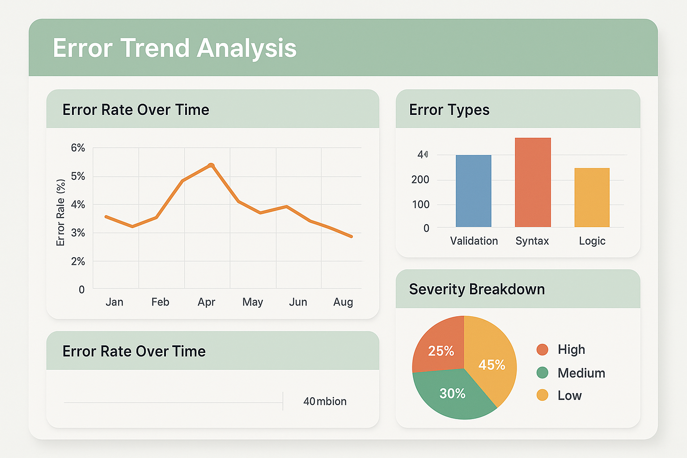

# Statistical Analysis Techniques: Quantifying Error Patterns and Trends



## Introduction: From Intuition to Evidence-Based Analysis

Statistical analysis transforms subjective impressions about AI system performance into objective, quantifiable insights that can guide systematic improvement efforts. While qualitative analysis provides valuable context and understanding, statistical techniques enable teams to identify subtle patterns, validate hypotheses, and measure the effectiveness of interventions with mathematical precision.

The application of statistical methods to AI error analysis requires careful consideration of the unique characteristics of machine learning systems, including their probabilistic nature, complex dependencies, and evolving behavior patterns. Traditional statistical approaches must be adapted to handle the high-dimensional data, non-linear relationships, and temporal dynamics that characterize modern AI systems.

Effective statistical analysis in AI evaluation serves multiple purposes: identifying significant trends in error patterns, validating the effectiveness of improvement interventions, detecting subtle degradation before it becomes user-visible, and providing quantitative evidence for resource allocation and prioritization decisions. The techniques presented in this section provide the analytical foundation for data-driven quality improvement.

The business impact of rigorous statistical analysis extends beyond technical system improvement to include enhanced credibility with stakeholders, improved resource allocation decisions, and stronger competitive positioning through systematic quality advantages. Organizations that can quantify and predict their AI system performance gain significant advantages in planning, optimization, and risk management.

## Descriptive Statistics for Error Analysis

### Error Rate Analysis and Trending

Error rate analysis forms the foundation of quantitative AI system evaluation, providing essential metrics for understanding system reliability and tracking improvement efforts over time. Effective error rate analysis requires careful consideration of measurement methodology, statistical significance, and the temporal dynamics that characterize AI system behavior.

The calculation of meaningful error rates requires clear definitions of what constitutes an error, appropriate sampling methodologies, and statistical techniques that account for the variability inherent in AI system outputs. Simple percentage calculations may be misleading when dealing with systems that exhibit significant temporal variation or when comparing performance across different user populations or use cases.

**Basic Error Rate Metrics:**

The foundation of error rate analysis begins with establishing clear, measurable definitions of different types of errors and implementing consistent measurement methodologies across different system components and time periods.

*Overall Error Rate* represents the fundamental reliability metric for AI systems, calculated as the ratio of erroneous outputs to total outputs over a specified time period. However, this simple metric must be interpreted carefully, considering factors such as error severity, user impact, and temporal distribution.

*Categorical Error Rates* provide more granular insights by breaking down overall error rates into specific categories such as accuracy errors, appropriateness errors, and consistency errors. This categorization enables teams to identify which types of problems are most prevalent and track the effectiveness of targeted improvement efforts.

*Conditional Error Rates* examine error patterns within specific contexts, user populations, or use cases. These metrics help identify whether certain conditions or user characteristics are associated with higher error rates, enabling targeted optimization efforts.

*Time-Windowed Error Rates* track error patterns across different temporal scales, from minute-by-minute monitoring for real-time alerting to monthly trends for strategic planning. The choice of time window significantly affects the interpretation of error rate metrics and must be aligned with business objectives and system characteristics.

```python
import pandas as pd
import numpy as np
import matplotlib.pyplot as plt
import seaborn as sns
from scipy import stats
from sklearn.metrics import confusion_matrix, classification_report
import plotly.graph_objects as go
from plotly.subplots import make_subplots
from typing import Dict, List, Tuple, Any
from datetime import datetime, timedelta
import warnings
warnings.filterwarnings('ignore')

class ErrorRateAnalyzer:
    """Comprehensive error rate analysis for AI systems"""
    
    def __init__(self):
        self.data = None
        self.error_definitions = {}
        self.baseline_metrics = {}
    
    def load_data(self, data: pd.DataFrame):
        """Load error data for analysis"""
        required_columns = ['timestamp', 'is_error', 'error_type', 'user_id', 'session_id']
        
        for col in required_columns:
            if col not in data.columns:
                raise ValueError(f"Required column '{col}' not found in data")
        
        self.data = data.copy()
        self.data['timestamp'] = pd.to_datetime(self.data['timestamp'])
        self.data = self.data.sort_values('timestamp')
        
        print(f"Loaded {len(self.data)} records from {self.data['timestamp'].min()} to {self.data['timestamp'].max()}")
    
    def calculate_basic_error_rates(self, time_window: str = 'H') -> pd.DataFrame:
        """Calculate basic error rates over time windows"""
        
        if self.data is None:
            raise ValueError("No data loaded. Call load_data() first.")
        
        # Group by time window
        grouped = self.data.groupby(pd.Grouper(key='timestamp', freq=time_window))
        
        error_rates = []
        for timestamp, group in grouped:
            if len(group) > 0:
                total_requests = len(group)
                total_errors = group['is_error'].sum()
                error_rate = total_errors / total_requests if total_requests > 0 else 0
                
                # Calculate error rates by type
                error_type_rates = {}
                for error_type in group['error_type'].unique():
                    if pd.notna(error_type):
                        type_errors = len(group[group['error_type'] == error_type])
                        error_type_rates[f'{error_type}_rate'] = type_errors / total_requests
                
                result = {
                    'timestamp': timestamp,
                    'total_requests': total_requests,
                    'total_errors': total_errors,
                    'error_rate': error_rate,
                    'error_rate_percent': error_rate * 100,
                    **error_type_rates
                }
                
                error_rates.append(result)
        
        return pd.DataFrame(error_rates)
    
    def calculate_conditional_error_rates(self, condition_column: str) -> pd.DataFrame:
        """Calculate error rates conditional on specific factors"""
        
        if condition_column not in self.data.columns:
            raise ValueError(f"Column '{condition_column}' not found in data")
        
        conditional_rates = []
        
        for condition_value in self.data[condition_column].unique():
            if pd.notna(condition_value):
                subset = self.data[self.data[condition_column] == condition_value]
                
                total_requests = len(subset)
                total_errors = subset['is_error'].sum()
                error_rate = total_errors / total_requests if total_requests > 0 else 0
                
                # Calculate confidence interval
                if total_requests > 0:
                    confidence_interval = stats.binom.interval(
                        0.95, total_requests, error_rate
                    )
                    ci_lower = confidence_interval[0] / total_requests
                    ci_upper = confidence_interval[1] / total_requests
                else:
                    ci_lower = ci_upper = 0
                
                conditional_rates.append({
                    'condition': condition_column,
                    'condition_value': condition_value,
                    'total_requests': total_requests,
                    'total_errors': total_errors,
                    'error_rate': error_rate,
                    'error_rate_percent': error_rate * 100,
                    'ci_lower': ci_lower,
                    'ci_upper': ci_upper,
                    'sample_size': total_requests
                })
        
        return pd.DataFrame(conditional_rates).sort_values('error_rate', ascending=False)
    
    def detect_error_rate_anomalies(self, window_size: int = 24, 
                                   threshold_std: float = 2.0) -> pd.DataFrame:
        """Detect anomalous error rates using statistical methods"""
        
        hourly_rates = self.calculate_basic_error_rates('H')
        
        if len(hourly_rates) < window_size:
            print(f"Insufficient data for anomaly detection. Need at least {window_size} hours.")
            return pd.DataFrame()
        
        # Calculate rolling statistics
        hourly_rates['rolling_mean'] = hourly_rates['error_rate'].rolling(
            window=window_size, min_periods=window_size//2
        ).mean()
        
        hourly_rates['rolling_std'] = hourly_rates['error_rate'].rolling(
            window=window_size, min_periods=window_size//2
        ).std()
        
        # Identify anomalies
        hourly_rates['upper_threshold'] = (
            hourly_rates['rolling_mean'] + threshold_std * hourly_rates['rolling_std']
        )
        hourly_rates['lower_threshold'] = (
            hourly_rates['rolling_mean'] - threshold_std * hourly_rates['rolling_std']
        )
        
        hourly_rates['is_anomaly'] = (
            (hourly_rates['error_rate'] > hourly_rates['upper_threshold']) |
            (hourly_rates['error_rate'] < hourly_rates['lower_threshold'])
        )
        
        # Calculate anomaly severity
        hourly_rates['anomaly_severity'] = np.where(
            hourly_rates['is_anomaly'],
            np.abs(hourly_rates['error_rate'] - hourly_rates['rolling_mean']) / 
            (hourly_rates['rolling_std'] + 1e-8),
            0
        )
        
        return hourly_rates
    
    def analyze_error_trends(self, trend_window_days: int = 7) -> Dict[str, Any]:
        """Analyze trends in error rates over time"""
        
        daily_rates = self.calculate_basic_error_rates('D')
        
        if len(daily_rates) < trend_window_days:
            return {"error": f"Insufficient data for trend analysis. Need at least {trend_window_days} days."}
        
        # Calculate trend statistics
        recent_data = daily_rates.tail(trend_window_days)
        historical_data = daily_rates.head(-trend_window_days) if len(daily_rates) > trend_window_days else daily_rates
        
        recent_mean = recent_data['error_rate'].mean()
        historical_mean = historical_data['error_rate'].mean() if len(historical_data) > 0 else recent_mean
        
        # Trend direction and magnitude
        if len(daily_rates) >= 2:
            # Linear regression for trend
            x = np.arange(len(daily_rates))
            y = daily_rates['error_rate'].values
            slope, intercept, r_value, p_value, std_err = stats.linregress(x, y)
            
            trend_direction = "increasing" if slope > 0 else "decreasing" if slope < 0 else "stable"
            trend_strength = abs(r_value)
        else:
            slope = intercept = r_value = p_value = std_err = 0
            trend_direction = "insufficient_data"
            trend_strength = 0
        
        # Statistical significance of change
        if len(historical_data) > 0 and len(recent_data) > 0:
            t_stat, t_p_value = stats.ttest_ind(
                historical_data['error_rate'], 
                recent_data['error_rate']
            )
        else:
            t_stat = t_p_value = None
        
        # Volatility analysis
        volatility = daily_rates['error_rate'].std()
        coefficient_of_variation = volatility / daily_rates['error_rate'].mean() if daily_rates['error_rate'].mean() > 0 else 0
        
        return {
            'trend_analysis': {
                'direction': trend_direction,
                'slope': slope,
                'r_squared': r_value**2,
                'p_value': p_value,
                'strength': trend_strength
            },
            'recent_vs_historical': {
                'recent_mean': recent_mean,
                'historical_mean': historical_mean,
                'percent_change': ((recent_mean - historical_mean) / historical_mean * 100) if historical_mean > 0 else 0,
                't_statistic': t_stat,
                't_p_value': t_p_value,
                'significant_change': t_p_value < 0.05 if t_p_value is not None else False
            },
            'volatility_metrics': {
                'standard_deviation': volatility,
                'coefficient_of_variation': coefficient_of_variation,
                'min_error_rate': daily_rates['error_rate'].min(),
                'max_error_rate': daily_rates['error_rate'].max(),
                'range': daily_rates['error_rate'].max() - daily_rates['error_rate'].min()
            }
        }
    
    def create_error_rate_dashboard(self):
        """Create comprehensive error rate visualization dashboard"""
        
        # Calculate different time window rates
        hourly_rates = self.calculate_basic_error_rates('H')
        daily_rates = self.calculate_basic_error_rates('D')
        anomalies = self.detect_error_rate_anomalies()
        
        # Create subplots
        fig = make_subplots(
            rows=2, cols=2,
            subplot_titles=(
                'Hourly Error Rates with Anomalies',
                'Daily Error Rate Trend',
                'Error Rate Distribution',
                'Error Type Breakdown'
            ),
            specs=[[{"secondary_y": True}, {"secondary_y": False}],
                   [{"secondary_y": False}, {"secondary_y": False}]]
        )
        
        # 1. Hourly rates with anomaly detection
        fig.add_trace(
            go.Scatter(
                x=hourly_rates['timestamp'],
                y=hourly_rates['error_rate_percent'],
                mode='lines',
                name='Error Rate',
                line=dict(color='blue')
            ),
            row=1, col=1
        )
        
        if len(anomalies) > 0:
            anomaly_data = anomalies[anomalies['is_anomaly']]
            if len(anomaly_data) > 0:
                fig.add_trace(
                    go.Scatter(
                        x=anomaly_data['timestamp'],
                        y=anomaly_data['error_rate_percent'],
                        mode='markers',
                        name='Anomalies',
                        marker=dict(color='red', size=8)
                    ),
                    row=1, col=1
                )
        
        # 2. Daily trend
        fig.add_trace(
            go.Scatter(
                x=daily_rates['timestamp'],
                y=daily_rates['error_rate_percent'],
                mode='lines+markers',
                name='Daily Error Rate',
                line=dict(color='green')
            ),
            row=1, col=2
        )
        
        # 3. Error rate distribution
        fig.add_trace(
            go.Histogram(
                x=hourly_rates['error_rate_percent'],
                nbinsx=20,
                name='Distribution',
                marker=dict(color='orange', opacity=0.7)
            ),
            row=2, col=1
        )
        
        # 4. Error type breakdown
        error_type_counts = self.data[self.data['is_error']]['error_type'].value_counts()
        fig.add_trace(
            go.Bar(
                x=error_type_counts.index,
                y=error_type_counts.values,
                name='Error Types',
                marker=dict(color='purple')
            ),
            row=2, col=2
        )
        
        # Update layout
        fig.update_layout(
            title='Error Rate Analysis Dashboard',
            height=800,
            showlegend=True
        )
        
        fig.update_xaxes(title_text="Time", row=1, col=1)
        fig.update_xaxes(title_text="Time", row=1, col=2)
        fig.update_xaxes(title_text="Error Rate (%)", row=2, col=1)
        fig.update_xaxes(title_text="Error Type", row=2, col=2)
        
        fig.update_yaxes(title_text="Error Rate (%)", row=1, col=1)
        fig.update_yaxes(title_text="Error Rate (%)", row=1, col=2)
        fig.update_yaxes(title_text="Frequency", row=2, col=1)
        fig.update_yaxes(title_text="Count", row=2, col=2)
        
        fig.show()
    
    def generate_statistical_report(self) -> str:
        """Generate comprehensive statistical analysis report"""
        
        # Calculate various metrics
        basic_stats = self.data.describe()
        trend_analysis = self.analyze_error_trends()
        conditional_rates = self.calculate_conditional_error_rates('error_type')
        
        overall_error_rate = self.data['is_error'].mean()
        total_requests = len(self.data)
        total_errors = self.data['is_error'].sum()
        
        report = f"""
# Statistical Error Analysis Report

## Executive Summary
- **Total Requests Analyzed**: {total_requests:,}
- **Total Errors**: {total_errors:,}
- **Overall Error Rate**: {overall_error_rate:.4f} ({overall_error_rate*100:.2f}%)

## Trend Analysis
"""
        
        if 'trend_analysis' in trend_analysis:
            trend = trend_analysis['trend_analysis']
            report += f"""
- **Trend Direction**: {trend['direction']}
- **Trend Strength**: {trend['strength']:.3f} (R²: {trend['r_squared']:.3f})
- **Statistical Significance**: {'Yes' if trend['p_value'] < 0.05 else 'No'} (p={trend['p_value']:.4f})
"""
        
        if 'recent_vs_historical' in trend_analysis:
            comparison = trend_analysis['recent_vs_historical']
            report += f"""
## Recent vs Historical Performance
- **Recent Error Rate**: {comparison['recent_mean']:.4f} ({comparison['recent_mean']*100:.2f}%)
- **Historical Error Rate**: {comparison['historical_mean']:.4f} ({comparison['historical_mean']*100:.2f}%)
- **Change**: {comparison['percent_change']:.1f}%
- **Statistically Significant**: {'Yes' if comparison['significant_change'] else 'No'}
"""
        
        if 'volatility_metrics' in trend_analysis:
            volatility = trend_analysis['volatility_metrics']
            report += f"""
## Volatility Analysis
- **Standard Deviation**: {volatility['standard_deviation']:.4f}
- **Coefficient of Variation**: {volatility['coefficient_of_variation']:.3f}
- **Error Rate Range**: {volatility['min_error_rate']:.4f} - {volatility['max_error_rate']:.4f}
"""
        
        report += "\n## Error Type Analysis\n"
        
        for _, row in conditional_rates.head(5).iterrows():
            report += f"""
- **{row['condition_value']}**: {row['error_rate_percent']:.2f}% 
  (95% CI: {row['ci_lower']*100:.2f}% - {row['ci_upper']*100:.2f}%)
  Sample size: {row['sample_size']:,}
"""
        
        report += """
## Recommendations

### Immediate Actions
1. **Focus on High-Rate Error Types**: Address error types with rates >5%
2. **Investigate Anomalies**: Review periods with unusual error rate spikes
3. **Monitor Trends**: Set up alerts for significant trend changes

### Long-term Improvements
1. **Reduce Volatility**: Implement measures to stabilize error rates
2. **Targeted Optimization**: Focus on conditions with highest error rates
3. **Predictive Monitoring**: Develop models to predict error rate increases
"""
        
        return report.strip()

# Example usage and demonstration
def generate_sample_error_data(n_samples: int = 10000) -> pd.DataFrame:
    """Generate realistic sample error data for demonstration"""
    
    np.random.seed(42)
    
    # Generate timestamps over 30 days
    start_time = datetime.now() - timedelta(days=30)
    timestamps = [start_time + timedelta(minutes=i*5) for i in range(n_samples)]
    
    # Generate base error rate with daily and hourly patterns
    base_error_rate = 0.02  # 2% base error rate
    
    error_rates = []
    for i, timestamp in enumerate(timestamps):
        # Daily pattern (higher errors during peak hours)
        hour_factor = 1 + 0.5 * np.sin(2 * np.pi * timestamp.hour / 24)
        
        # Weekly pattern (higher errors on weekends)
        day_factor = 1.2 if timestamp.weekday() >= 5 else 1.0
        
        # Add some random noise and occasional spikes
        noise_factor = np.random.normal(1, 0.1)
        spike_factor = 3 if np.random.random() < 0.01 else 1  # 1% chance of spike
        
        current_rate = base_error_rate * hour_factor * day_factor * noise_factor * spike_factor
        current_rate = max(0, min(1, current_rate))  # Clamp between 0 and 1
        
        error_rates.append(current_rate)
    
    # Generate individual request data
    data = []
    for i, (timestamp, error_rate) in enumerate(zip(timestamps, error_rates)):
        # Number of requests in this time window (5 minutes)
        n_requests = np.random.poisson(50)  # Average 50 requests per 5 minutes
        
        for j in range(n_requests):
            is_error = np.random.random() < error_rate
            
            # Assign error types
            if is_error:
                error_type = np.random.choice([
                    'accuracy_error', 'appropriateness_error', 'consistency_error',
                    'safety_error', 'bias_error'
                ], p=[0.4, 0.25, 0.2, 0.1, 0.05])
            else:
                error_type = None
            
            data.append({
                'timestamp': timestamp + timedelta(seconds=np.random.randint(0, 300)),
                'is_error': is_error,
                'error_type': error_type,
                'user_id': f'user_{np.random.randint(1, 1000)}',
                'session_id': f'session_{i}_{j}',
                'request_id': f'req_{i}_{j}'
            })
    
    return pd.DataFrame(data)

# Demonstration
if __name__ == "__main__":
    print("Generating sample error data...")
    sample_data = generate_sample_error_data(8640)  # 30 days of 5-minute intervals
    
    print("Initializing error rate analyzer...")
    analyzer = ErrorRateAnalyzer()
    analyzer.load_data(sample_data)
    
    print("Calculating basic error rates...")
    hourly_rates = analyzer.calculate_basic_error_rates('H')
    print(f"Calculated error rates for {len(hourly_rates)} hours")
    
    print("Analyzing conditional error rates...")
    conditional_rates = analyzer.calculate_conditional_error_rates('error_type')
    print(f"Analyzed {len(conditional_rates)} error type conditions")
    
    print("Detecting anomalies...")
    anomalies = analyzer.detect_error_rate_anomalies()
    anomaly_count = anomalies['is_anomaly'].sum() if len(anomalies) > 0 else 0
    print(f"Detected {anomaly_count} anomalous time periods")
    
    print("Analyzing trends...")
    trends = analyzer.analyze_error_trends()
    
    print("Generating statistical report...")
    report = analyzer.generate_statistical_report()
    
    print("\n" + "="*60)
    print(report)
    print("="*60)
    
    print("\nCreating dashboard...")
    analyzer.create_error_rate_dashboard()
```

### Distribution Analysis and Pattern Recognition

Understanding the statistical distributions that characterize AI system errors provides crucial insights into system behavior patterns and helps identify when systems are operating outside normal parameters. Distribution analysis enables teams to distinguish between random variation and systematic problems that require intervention.

The analysis of error distributions requires careful consideration of the underlying data generating processes and the assumptions that different statistical distributions make about system behavior. AI systems often exhibit complex, multi-modal distributions that may not conform to simple statistical models, requiring sophisticated analytical approaches.

**Key Distribution Characteristics:**

*Central Tendency Measures* provide basic insights into typical system behavior, but must be interpreted carefully in the context of AI systems that may exhibit significant skewness or multi-modal behavior patterns.

*Variability Measures* capture the consistency of system performance and help identify periods of unusual instability that may indicate underlying problems or system changes.

*Shape Characteristics* including skewness and kurtosis reveal important information about the nature of error patterns and can help identify whether errors follow predictable patterns or exhibit more chaotic behavior.

*Temporal Distribution Patterns* examine how error characteristics change over different time scales, from minute-to-minute variation through seasonal patterns that may affect system performance.

### Hypothesis Testing for Error Analysis

Hypothesis testing provides rigorous statistical frameworks for validating assumptions about AI system behavior and measuring the effectiveness of improvement interventions. These techniques enable teams to distinguish between statistically significant changes and random variation, providing confidence in decision-making processes.

The application of hypothesis testing to AI systems requires careful consideration of multiple testing problems, effect size interpretation, and the practical significance of statistical results. Statistical significance must be balanced with practical significance to ensure that testing results guide meaningful improvement efforts.

**Common Hypothesis Testing Scenarios:**

*Before/After Comparisons* evaluate the effectiveness of system changes, model updates, or process improvements by comparing error rates before and after interventions.

*A/B Testing for Error Rates* compares different system configurations, algorithms, or approaches to identify which performs better under controlled conditions.

*Trend Significance Testing* determines whether observed trends in error rates represent genuine changes in system behavior or random fluctuations.

*Comparative Analysis* evaluates differences in error rates across different user populations, use cases, or system configurations to identify optimization opportunities.

```python
from scipy import stats
import numpy as np
import pandas as pd
from typing import Tuple, Dict, Any
import matplotlib.pyplot as plt
import seaborn as sns

class HypothesisTestingFramework:
    """Framework for statistical hypothesis testing in AI error analysis"""
    
    def __init__(self, alpha: float = 0.05):
        self.alpha = alpha  # Significance level
        self.test_results = []
    
    def before_after_test(self, before_data: np.ndarray, after_data: np.ndarray,
                         test_type: str = 'auto') -> Dict[str, Any]:
        """Test for significant difference between before and after periods"""
        
        # Basic statistics
        before_mean = np.mean(before_data)
        after_mean = np.mean(after_data)
        before_std = np.std(before_data, ddof=1)
        after_std = np.std(after_data, ddof=1)
        
        # Effect size (Cohen's d)
        pooled_std = np.sqrt(((len(before_data) - 1) * before_std**2 + 
                             (len(after_data) - 1) * after_std**2) / 
                            (len(before_data) + len(after_data) - 2))
        cohens_d = (after_mean - before_mean) / pooled_std if pooled_std > 0 else 0
        
        # Choose appropriate test
        if test_type == 'auto':
            # Check normality
            before_normal = stats.shapiro(before_data)[1] > 0.05 if len(before_data) <= 5000 else True
            after_normal = stats.shapiro(after_data)[1] > 0.05 if len(after_data) <= 5000 else True
            
            # Check equal variances
            equal_var = stats.levene(before_data, after_data)[1] > 0.05
            
            if before_normal and after_normal:
                if equal_var:
                    test_type = 'ttest_ind'
                else:
                    test_type = 'welch_ttest'
            else:
                test_type = 'mannwhitney'
        
        # Perform test
        if test_type == 'ttest_ind':
            statistic, p_value = stats.ttest_ind(before_data, after_data, equal_var=True)
            test_name = "Independent t-test"
        elif test_type == 'welch_ttest':
            statistic, p_value = stats.ttest_ind(before_data, after_data, equal_var=False)
            test_name = "Welch's t-test"
        elif test_type == 'mannwhitney':
            statistic, p_value = stats.mannwhitneyu(before_data, after_data, alternative='two-sided')
            test_name = "Mann-Whitney U test"
        else:
            raise ValueError(f"Unknown test type: {test_type}")
        
        # Confidence interval for difference in means
        if test_type in ['ttest_ind', 'welch_ttest']:
            se_diff = np.sqrt(before_std**2/len(before_data) + after_std**2/len(after_data))
            df = len(before_data) + len(after_data) - 2
            t_critical = stats.t.ppf(1 - self.alpha/2, df)
            ci_lower = (after_mean - before_mean) - t_critical * se_diff
            ci_upper = (after_mean - before_mean) + t_critical * se_diff
        else:
            ci_lower = ci_upper = None
        
        result = {
            'test_name': test_name,
            'statistic': statistic,
            'p_value': p_value,
            'significant': p_value < self.alpha,
            'before_mean': before_mean,
            'after_mean': after_mean,
            'difference': after_mean - before_mean,
            'percent_change': ((after_mean - before_mean) / before_mean * 100) if before_mean != 0 else 0,
            'effect_size_cohens_d': cohens_d,
            'confidence_interval': (ci_lower, ci_upper) if ci_lower is not None else None,
            'sample_sizes': (len(before_data), len(after_data))
        }
        
        self.test_results.append(result)
        return result
    
    def ab_test_analysis(self, group_a: np.ndarray, group_b: np.ndarray,
                        metric_name: str = "error_rate") -> Dict[str, Any]:
        """Analyze A/B test results for error rates"""
        
        # Convert to success/failure counts if dealing with proportions
        if np.all((group_a >= 0) & (group_a <= 1)) and np.all((group_b >= 0) & (group_b <= 1)):
            # Assume these are error rates, convert to counts
            n_a = len(group_a)
            n_b = len(group_b)
            successes_a = int(np.sum(group_a))
            successes_b = int(np.sum(group_b))
            
            # Proportion test
            count = np.array([successes_a, successes_b])
            nobs = np.array([n_a, n_b])
            
            from statsmodels.stats.proportion import proportions_ztest
            statistic, p_value = proportions_ztest(count, nobs)
            
            prop_a = successes_a / n_a
            prop_b = successes_b / n_b
            
            # Confidence interval for difference in proportions
            se_diff = np.sqrt(prop_a * (1 - prop_a) / n_a + prop_b * (1 - prop_b) / n_b)
            z_critical = stats.norm.ppf(1 - self.alpha/2)
            diff = prop_b - prop_a
            ci_lower = diff - z_critical * se_diff
            ci_upper = diff + z_critical * se_diff
            
            # Relative risk and odds ratio
            relative_risk = prop_b / prop_a if prop_a > 0 else float('inf')
            odds_a = prop_a / (1 - prop_a) if prop_a < 1 else float('inf')
            odds_b = prop_b / (1 - prop_b) if prop_b < 1 else float('inf')
            odds_ratio = odds_b / odds_a if odds_a > 0 else float('inf')
            
            result = {
                'test_name': 'Proportion Z-test',
                'statistic': statistic,
                'p_value': p_value,
                'significant': p_value < self.alpha,
                'group_a_rate': prop_a,
                'group_b_rate': prop_b,
                'difference': diff,
                'percent_change': (diff / prop_a * 100) if prop_a > 0 else 0,
                'relative_risk': relative_risk,
                'odds_ratio': odds_ratio,
                'confidence_interval': (ci_lower, ci_upper),
                'sample_sizes': (n_a, n_b)
            }
        else:
            # Use regular t-test for continuous metrics
            result = self.before_after_test(group_a, group_b)
            result['test_name'] = 'A/B Test (t-test)'
        
        return result
    
    def trend_significance_test(self, time_series: np.ndarray, 
                               timestamps: np.ndarray = None) -> Dict[str, Any]:
        """Test for significant trend in time series data"""
        
        if timestamps is None:
            timestamps = np.arange(len(time_series))
        
        # Mann-Kendall trend test
        def mann_kendall_test(data):
            n = len(data)
            s = 0
            
            for i in range(n - 1):
                for j in range(i + 1, n):
                    if data[j] > data[i]:
                        s += 1
                    elif data[j] < data[i]:
                        s -= 1
            
            # Variance calculation
            var_s = n * (n - 1) * (2 * n + 5) / 18
            
            # Z-score calculation
            if s > 0:
                z = (s - 1) / np.sqrt(var_s)
            elif s < 0:
                z = (s + 1) / np.sqrt(var_s)
            else:
                z = 0
            
            # Two-tailed p-value
            p_value = 2 * (1 - stats.norm.cdf(abs(z)))
            
            return s, z, p_value
        
        # Perform Mann-Kendall test
        mk_s, mk_z, mk_p = mann_kendall_test(time_series)
        
        # Linear regression for trend slope
        slope, intercept, r_value, p_value_reg, std_err = stats.linregress(timestamps, time_series)
        
        # Seasonal decomposition if enough data
        seasonal_trend = None
        if len(time_series) >= 24:  # At least 24 points for seasonal analysis
            try:
                from statsmodels.tsa.seasonal import seasonal_decompose
                # Assume hourly data for seasonal decomposition
                ts_df = pd.DataFrame({'value': time_series}, 
                                   index=pd.date_range(start='2024-01-01', periods=len(time_series), freq='H'))
                decomposition = seasonal_decompose(ts_df['value'], model='additive', period=24)
                seasonal_trend = {
                    'trend_component': decomposition.trend.dropna().values,
                    'seasonal_component': decomposition.seasonal.values,
                    'residual_component': decomposition.resid.dropna().values
                }
            except:
                seasonal_trend = None
        
        result = {
            'mann_kendall': {
                'statistic': mk_s,
                'z_score': mk_z,
                'p_value': mk_p,
                'significant': mk_p < self.alpha,
                'trend_direction': 'increasing' if mk_s > 0 else 'decreasing' if mk_s < 0 else 'no trend'
            },
            'linear_regression': {
                'slope': slope,
                'intercept': intercept,
                'r_squared': r_value**2,
                'p_value': p_value_reg,
                'significant': p_value_reg < self.alpha,
                'standard_error': std_err
            },
            'seasonal_decomposition': seasonal_trend
        }
        
        return result
    
    def multiple_comparison_correction(self, p_values: List[float], 
                                     method: str = 'bonferroni') -> Dict[str, Any]:
        """Apply multiple comparison correction to p-values"""
        
        p_values = np.array(p_values)
        
        if method == 'bonferroni':
            corrected_alpha = self.alpha / len(p_values)
            corrected_p_values = p_values * len(p_values)
            corrected_p_values = np.minimum(corrected_p_values, 1.0)
        elif method == 'holm':
            # Holm-Bonferroni method
            sorted_indices = np.argsort(p_values)
            corrected_p_values = np.zeros_like(p_values)
            
            for i, idx in enumerate(sorted_indices):
                correction_factor = len(p_values) - i
                corrected_p_values[idx] = min(1.0, p_values[idx] * correction_factor)
                
                # Ensure monotonicity
                if i > 0:
                    prev_idx = sorted_indices[i-1]
                    corrected_p_values[idx] = max(corrected_p_values[idx], 
                                                corrected_p_values[prev_idx])
            
            corrected_alpha = self.alpha
        elif method == 'fdr_bh':
            # Benjamini-Hochberg FDR control
            sorted_indices = np.argsort(p_values)
            corrected_p_values = np.zeros_like(p_values)
            
            for i in range(len(p_values) - 1, -1, -1):
                idx = sorted_indices[i]
                rank = i + 1
                corrected_p_values[idx] = min(1.0, p_values[idx] * len(p_values) / rank)
                
                # Ensure monotonicity
                if i < len(p_values) - 1:
                    next_idx = sorted_indices[i + 1]
                    corrected_p_values[idx] = min(corrected_p_values[idx], 
                                                corrected_p_values[next_idx])
            
            corrected_alpha = self.alpha
        else:
            raise ValueError(f"Unknown correction method: {method}")
        
        significant = corrected_p_values < corrected_alpha
        
        return {
            'method': method,
            'original_p_values': p_values.tolist(),
            'corrected_p_values': corrected_p_values.tolist(),
            'corrected_alpha': corrected_alpha,
            'significant': significant.tolist(),
            'num_significant': np.sum(significant)
        }
    
    def power_analysis(self, effect_size: float, sample_size: int = None,
                      power: float = None, alpha: float = None) -> Dict[str, Any]:
        """Perform statistical power analysis"""
        
        if alpha is None:
            alpha = self.alpha
        
        # Calculate missing parameter
        if sample_size is None and power is not None:
            # Calculate required sample size
            from statsmodels.stats.power import ttest_power
            sample_size = int(np.ceil(ttest_power(effect_size, power, alpha, alternative='two-sided')))
        elif power is None and sample_size is not None:
            # Calculate achieved power
            from statsmodels.stats.power import ttest_power
            power = ttest_power(effect_size, sample_size, alpha, alternative='two-sided')
        else:
            raise ValueError("Must specify either sample_size or power (but not both)")
        
        # Minimum detectable effect for given sample size and power
        if sample_size is not None and power is not None:
            from statsmodels.stats.power import tt_solve_power
            min_effect = tt_solve_power(effect_size=None, nobs=sample_size, 
                                      alpha=alpha, power=power, alternative='two-sided')
        else:
            min_effect = None
        
        return {
            'effect_size': effect_size,
            'sample_size': sample_size,
            'power': power,
            'alpha': alpha,
            'minimum_detectable_effect': min_effect
        }

# Example usage and demonstration
def demonstrate_hypothesis_testing():
    """Demonstrate hypothesis testing framework"""
    
    np.random.seed(42)
    
    # Create hypothesis testing framework
    tester = HypothesisTestingFramework(alpha=0.05)
    
    # Generate sample data for before/after comparison
    print("=== Before/After Analysis ===")
    before_errors = np.random.binomial(1, 0.05, 1000)  # 5% error rate before
    after_errors = np.random.binomial(1, 0.03, 1000)   # 3% error rate after
    
    before_after_result = tester.before_after_test(before_errors, after_errors)
    
    print(f"Test: {before_after_result['test_name']}")
    print(f"Before error rate: {before_after_result['before_mean']:.4f}")
    print(f"After error rate: {before_after_result['after_mean']:.4f}")
    print(f"Difference: {before_after_result['difference']:.4f}")
    print(f"Percent change: {before_after_result['percent_change']:.1f}%")
    print(f"P-value: {before_after_result['p_value']:.6f}")
    print(f"Significant: {before_after_result['significant']}")
    print(f"Effect size (Cohen's d): {before_after_result['effect_size_cohens_d']:.3f}")
    
    # A/B test analysis
    print("\n=== A/B Test Analysis ===")
    group_a_errors = np.random.binomial(1, 0.04, 800)  # 4% error rate
    group_b_errors = np.random.binomial(1, 0.035, 850) # 3.5% error rate
    
    ab_result = tester.ab_test_analysis(group_a_errors, group_b_errors)
    
    print(f"Group A error rate: {ab_result['group_a_rate']:.4f}")
    print(f"Group B error rate: {ab_result['group_b_rate']:.4f}")
    print(f"Relative risk: {ab_result['relative_risk']:.3f}")
    print(f"P-value: {ab_result['p_value']:.6f}")
    print(f"Significant: {ab_result['significant']}")
    
    # Trend analysis
    print("\n=== Trend Analysis ===")
    # Generate time series with slight upward trend
    time_points = np.arange(100)
    trend_data = 0.02 + 0.0001 * time_points + np.random.normal(0, 0.005, 100)
    
    trend_result = tester.trend_significance_test(trend_data, time_points)
    
    print(f"Mann-Kendall trend test:")
    print(f"  Z-score: {trend_result['mann_kendall']['z_score']:.3f}")
    print(f"  P-value: {trend_result['mann_kendall']['p_value']:.6f}")
    print(f"  Trend direction: {trend_result['mann_kendall']['trend_direction']}")
    print(f"  Significant: {trend_result['mann_kendall']['significant']}")
    
    print(f"Linear regression:")
    print(f"  Slope: {trend_result['linear_regression']['slope']:.6f}")
    print(f"  R-squared: {trend_result['linear_regression']['r_squared']:.3f}")
    print(f"  P-value: {trend_result['linear_regression']['p_value']:.6f}")
    
    # Multiple comparison correction
    print("\n=== Multiple Comparison Correction ===")
    p_values = [0.01, 0.03, 0.08, 0.12, 0.45]
    
    bonferroni_result = tester.multiple_comparison_correction(p_values, 'bonferroni')
    fdr_result = tester.multiple_comparison_correction(p_values, 'fdr_bh')
    
    print("Original p-values:", p_values)
    print(f"Bonferroni corrected: {bonferroni_result['corrected_p_values']}")
    print(f"Bonferroni significant: {bonferroni_result['significant']}")
    print(f"FDR corrected: {fdr_result['corrected_p_values']}")
    print(f"FDR significant: {fdr_result['significant']}")
    
    # Power analysis
    print("\n=== Power Analysis ===")
    power_result = tester.power_analysis(effect_size=0.3, power=0.8)
    print(f"Required sample size for effect size 0.3 and power 0.8: {power_result['sample_size']}")
    
    achieved_power = tester.power_analysis(effect_size=0.3, sample_size=100)
    print(f"Achieved power with sample size 100: {achieved_power['power']:.3f}")

if __name__ == "__main__":
    demonstrate_hypothesis_testing()
```

## Conclusion: Building Evidence-Based Evaluation Capabilities

Statistical analysis techniques provide the quantitative foundation for evidence-based AI system improvement, transforming subjective impressions into objective insights that can guide systematic optimization efforts. The comprehensive approach presented in this section enables teams to identify subtle patterns, validate improvement hypotheses, and measure progress with mathematical precision.

The combination of descriptive statistics, distribution analysis, and hypothesis testing creates a complete analytical framework that can handle the full spectrum of AI system evaluation challenges. From basic error rate monitoring through sophisticated trend analysis, these techniques provide the tools needed to understand system behavior at multiple levels of detail.

The emphasis on proper statistical methodology, including multiple comparison corrections and power analysis, ensures that analytical results provide reliable guidance for decision-making. The investment in rigorous statistical analysis capabilities pays dividends through improved resource allocation, enhanced credibility with stakeholders, and stronger competitive positioning.

As AI systems continue to evolve and become more central to business operations, the ability to analyze system performance statistically will become increasingly important for maintaining competitive advantage and user trust. The frameworks and techniques presented in this section provide the foundation for building world-class analytical capabilities that scale with organizational growth and system complexity.

---

**Next**: [Section 5: Continuous Improvement Frameworks →](05-continuous-improvement-frameworks.md)

