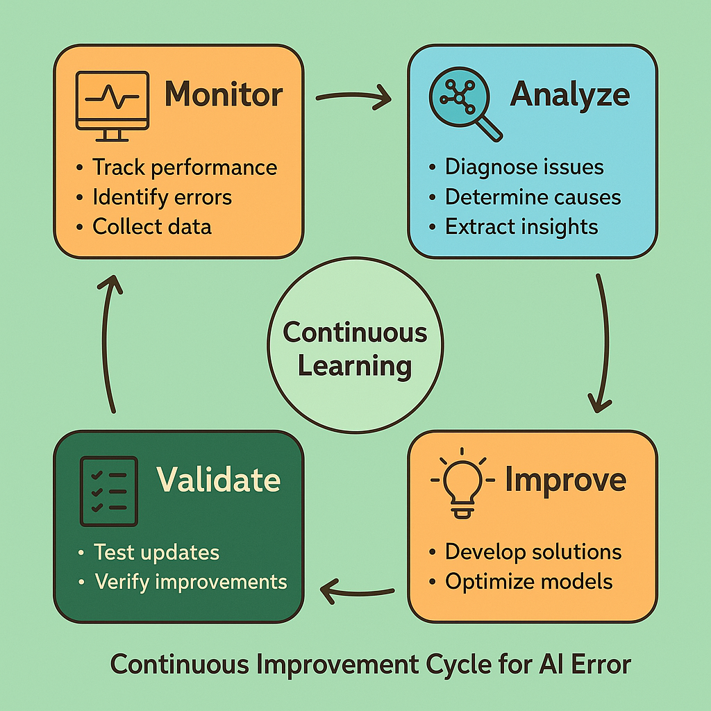

# Continuous Improvement Frameworks: Building Learning Organizations



## Introduction: From Reactive Fixes to Systematic Evolution

Continuous improvement frameworks transform error analysis from reactive problem-solving into proactive system evolution, creating organizational capabilities that systematically enhance AI system reliability and performance over time. While individual error fixes address immediate problems, continuous improvement frameworks build institutional knowledge and processes that prevent entire classes of future issues.

The challenge of implementing effective continuous improvement in AI systems extends beyond traditional software development practices. AI systems exhibit unique characteristics including probabilistic behavior, data dependencies, and evolving performance patterns that require specialized improvement methodologies. The frameworks presented in this section address these unique challenges while building on proven improvement principles from other engineering disciplines.

Effective continuous improvement frameworks create feedback loops that connect error detection, analysis, and resolution activities into coherent learning systems. These frameworks ensure that insights gained from individual error investigations contribute to broader system understanding and that improvement efforts are prioritized based on systematic analysis rather than ad-hoc reactions to immediate problems.

The business impact of systematic continuous improvement extends far beyond technical system reliability to include enhanced competitive positioning, improved resource utilization, and stronger organizational capabilities for handling future challenges. Organizations that build effective improvement frameworks develop sustainable advantages that compound over time through accumulated learning and systematic optimization.

## PDCA Cycle for AI Systems

### Plan: Strategic Error Reduction Planning

The planning phase of continuous improvement establishes the strategic foundation for systematic error reduction efforts, translating high-level business objectives into specific, measurable improvement targets that guide resource allocation and prioritization decisions.

Effective planning for AI system improvement requires comprehensive understanding of current system performance, identification of improvement opportunities, and development of specific intervention strategies that address root causes rather than symptoms. The planning process must balance short-term fixes with long-term system evolution while considering resource constraints and business priorities.

**Strategic Planning Components:**

*Performance Baseline Establishment* creates the quantitative foundation for improvement efforts by documenting current system performance across multiple dimensions including error rates, user satisfaction, business impact, and operational efficiency. This baseline provides the reference point for measuring improvement progress and validating the effectiveness of interventions.

The establishment of meaningful baselines requires careful consideration of measurement methodologies, data quality, and statistical significance. Baselines must capture both central tendencies and variability patterns to provide complete understanding of current system behavior and enable detection of meaningful changes.

*Improvement Target Setting* translates business objectives into specific, measurable goals that guide improvement efforts and provide clear success criteria. Effective targets balance ambition with achievability while considering the complex interdependencies that characterize AI system performance.

Target setting must account for the probabilistic nature of AI systems and the potential for unintended consequences when optimizing specific metrics. Comprehensive target frameworks include multiple dimensions of system performance to prevent optimization that improves one aspect while degrading others.

*Resource Allocation Planning* ensures that improvement efforts receive adequate resources while balancing competing priorities and constraints. This planning must consider both immediate resource needs for specific improvement projects and long-term investments in capabilities that enable sustained improvement.

Resource planning for AI system improvement often requires specialized expertise, computational resources, and data access that may not be readily available. Effective planning identifies these requirements early and develops strategies for acquiring or developing necessary capabilities.

*Risk Assessment and Mitigation* identifies potential negative consequences of improvement efforts and develops strategies for minimizing risks while maximizing benefits. AI system improvements can have far-reaching effects that may not be immediately apparent, requiring careful analysis of potential impacts.

Risk assessment must consider both technical risks such as performance degradation and business risks such as user dissatisfaction or competitive disadvantage. Mitigation strategies should include rollback plans, gradual deployment approaches, and monitoring systems that can detect problems early.

```python
import pandas as pd
import numpy as np
from typing import Dict, List, Any, Optional
from dataclasses import dataclass, field
from datetime import datetime, timedelta
import json
import matplotlib.pyplot as plt
import seaborn as sns

@dataclass
class ImprovementTarget:
    """Represents a specific improvement target"""
    name: str
    description: str
    current_value: float
    target_value: float
    target_date: datetime
    measurement_method: str
    success_criteria: str
    priority: int  # 1=highest, 5=lowest
    assigned_team: str
    dependencies: List[str] = field(default_factory=list)
    risks: List[str] = field(default_factory=list)
    resources_required: Dict[str, Any] = field(default_factory=dict)

@dataclass
class ImprovementAction:
    """Represents a specific improvement action"""
    action_id: str
    title: str
    description: str
    target_ids: List[str]
    planned_start: datetime
    planned_end: datetime
    assigned_team: str
    status: str  # 'planned', 'in_progress', 'completed', 'cancelled'
    estimated_effort: float  # person-days
    actual_effort: Optional[float] = None
    success_metrics: Dict[str, float] = field(default_factory=dict)
    lessons_learned: List[str] = field(default_factory=list)

class PDCACycleManager:
    """Manages PDCA cycle for AI system continuous improvement"""
    
    def __init__(self):
        self.targets: Dict[str, ImprovementTarget] = {}
        self.actions: Dict[str, ImprovementAction] = {}
        self.baseline_data: Dict[str, Any] = {}
        self.cycle_history: List[Dict[str, Any]] = []
        self.current_cycle_start: Optional[datetime] = None
    
    def establish_baseline(self, metric_name: str, data: np.ndarray, 
                          measurement_method: str) -> Dict[str, float]:
        """Establish performance baseline for a metric"""
        
        baseline_stats = {
            'mean': np.mean(data),
            'median': np.median(data),
            'std': np.std(data),
            'min': np.min(data),
            'max': np.max(data),
            'p95': np.percentile(data, 95),
            'p99': np.percentile(data, 99),
            'sample_size': len(data),
            'measurement_method': measurement_method,
            'baseline_date': datetime.now()
        }
        
        self.baseline_data[metric_name] = baseline_stats
        
        print(f"Baseline established for {metric_name}:")
        print(f"  Mean: {baseline_stats['mean']:.4f}")
        print(f"  Std: {baseline_stats['std']:.4f}")
        print(f"  95th percentile: {baseline_stats['p95']:.4f}")
        print(f"  Sample size: {baseline_stats['sample_size']}")
        
        return baseline_stats
    
    def add_improvement_target(self, target: ImprovementTarget) -> str:
        """Add an improvement target to the plan"""
        target_id = f"target_{len(self.targets) + 1}"
        self.targets[target_id] = target
        
        print(f"Added improvement target: {target.name}")
        print(f"  Current: {target.current_value:.4f}")
        print(f"  Target: {target.target_value:.4f}")
        print(f"  Improvement: {((target.target_value - target.current_value) / target.current_value * 100):.1f}%")
        print(f"  Target date: {target.target_date.strftime('%Y-%m-%d')}")
        
        return target_id
    
    def add_improvement_action(self, action: ImprovementAction) -> str:
        """Add an improvement action to the plan"""
        self.actions[action.action_id] = action
        
        print(f"Added improvement action: {action.title}")
        print(f"  Targets: {', '.join(action.target_ids)}")
        print(f"  Timeline: {action.planned_start.strftime('%Y-%m-%d')} to {action.planned_end.strftime('%Y-%m-%d')}")
        print(f"  Estimated effort: {action.estimated_effort} person-days")
        
        return action.action_id
    
    def start_cycle(self, cycle_name: str, duration_weeks: int = 4):
        """Start a new PDCA cycle"""
        self.current_cycle_start = datetime.now()
        
        cycle_info = {
            'cycle_name': cycle_name,
            'start_date': self.current_cycle_start,
            'planned_end_date': self.current_cycle_start + timedelta(weeks=duration_weeks),
            'targets': list(self.targets.keys()),
            'actions': list(self.actions.keys()),
            'status': 'planning'
        }
        
        self.cycle_history.append(cycle_info)
        
        print(f"Started PDCA cycle: {cycle_name}")
        print(f"  Duration: {duration_weeks} weeks")
        print(f"  Targets: {len(self.targets)}")
        print(f"  Actions: {len(self.actions)}")
    
    def generate_improvement_plan(self) -> str:
        """Generate comprehensive improvement plan document"""
        
        plan = f"""
# AI System Improvement Plan

## Executive Summary
This plan outlines systematic improvement efforts for AI system reliability and performance.

**Planning Date**: {datetime.now().strftime('%Y-%m-%d')}
**Planning Period**: {self.current_cycle_start.strftime('%Y-%m-%d') if self.current_cycle_start else 'Not started'}
**Total Targets**: {len(self.targets)}
**Total Actions**: {len(self.actions)}

## Performance Baselines
"""
        
        for metric_name, baseline in self.baseline_data.items():
            plan += f"""
### {metric_name}
- **Current Performance**: {baseline['mean']:.4f} ± {baseline['std']:.4f}
- **95th Percentile**: {baseline['p95']:.4f}
- **Sample Size**: {baseline['sample_size']:,}
- **Measurement Method**: {baseline['measurement_method']}
"""
        
        plan += "\n## Improvement Targets\n"
        
        # Sort targets by priority
        sorted_targets = sorted(self.targets.items(), key=lambda x: x[1].priority)
        
        for target_id, target in sorted_targets:
            improvement_percent = ((target.target_value - target.current_value) / target.current_value * 100) if target.current_value != 0 else 0
            
            plan += f"""
### {target.name} (Priority {target.priority})
- **Description**: {target.description}
- **Current Value**: {target.current_value:.4f}
- **Target Value**: {target.target_value:.4f}
- **Improvement Required**: {improvement_percent:.1f}%
- **Target Date**: {target.target_date.strftime('%Y-%m-%d')}
- **Assigned Team**: {target.assigned_team}
- **Success Criteria**: {target.success_criteria}
"""
            
            if target.dependencies:
                plan += f"- **Dependencies**: {', '.join(target.dependencies)}\n"
            
            if target.risks:
                plan += f"- **Key Risks**: {', '.join(target.risks)}\n"
        
        plan += "\n## Improvement Actions\n"
        
        # Sort actions by planned start date
        sorted_actions = sorted(self.actions.items(), key=lambda x: x[1].planned_start)
        
        for action_id, action in sorted_actions:
            duration_days = (action.planned_end - action.planned_start).days
            
            plan += f"""
### {action.title}
- **Description**: {action.description}
- **Target Metrics**: {', '.join(action.target_ids)}
- **Timeline**: {action.planned_start.strftime('%Y-%m-%d')} to {action.planned_end.strftime('%Y-%m-%d')} ({duration_days} days)
- **Assigned Team**: {action.assigned_team}
- **Estimated Effort**: {action.estimated_effort} person-days
- **Status**: {action.status}
"""
        
        plan += """
## Resource Requirements

### Human Resources
"""
        
        # Calculate resource requirements by team
        team_efforts = {}
        for action in self.actions.values():
            team = action.assigned_team
            if team not in team_efforts:
                team_efforts[team] = 0
            team_efforts[team] += action.estimated_effort
        
        for team, effort in team_efforts.items():
            plan += f"- **{team}**: {effort} person-days\n"
        
        plan += """
### Technical Resources
- Development and testing environments
- Data access and processing capabilities
- Monitoring and analysis tools
- Deployment and rollback infrastructure

## Risk Mitigation Strategies

### Technical Risks
1. **Performance Degradation**: Implement gradual rollout with automated rollback
2. **Data Quality Issues**: Establish comprehensive data validation pipelines
3. **Model Instability**: Maintain multiple model versions with A/B testing capabilities

### Business Risks
1. **User Dissatisfaction**: Implement user feedback collection and rapid response processes
2. **Resource Overruns**: Establish clear milestone checkpoints and resource monitoring
3. **Timeline Delays**: Build buffer time into critical path activities

## Success Metrics and Monitoring

### Key Performance Indicators
- Error rate reduction percentage
- User satisfaction improvement
- System reliability metrics
- Time-to-resolution improvements

### Monitoring Frequency
- **Daily**: Operational metrics and error rates
- **Weekly**: Progress against targets and action completion
- **Monthly**: Overall cycle performance and strategic alignment

## Next Steps
1. Finalize resource allocation and team assignments
2. Establish monitoring and reporting infrastructure
3. Begin execution of highest-priority actions
4. Schedule regular review and adjustment meetings
"""
        
        return plan.strip()
    
    def track_progress(self, action_id: str, progress_update: Dict[str, Any]):
        """Track progress on improvement actions"""
        
        if action_id not in self.actions:
            raise ValueError(f"Action {action_id} not found")
        
        action = self.actions[action_id]
        
        # Update action status and metrics
        if 'status' in progress_update:
            action.status = progress_update['status']
        
        if 'actual_effort' in progress_update:
            action.actual_effort = progress_update['actual_effort']
        
        if 'success_metrics' in progress_update:
            action.success_metrics.update(progress_update['success_metrics'])
        
        if 'lessons_learned' in progress_update:
            action.lessons_learned.extend(progress_update['lessons_learned'])
        
        print(f"Updated progress for {action.title}:")
        print(f"  Status: {action.status}")
        if action.actual_effort:
            print(f"  Actual effort: {action.actual_effort} person-days")
        if action.success_metrics:
            print(f"  Success metrics: {action.success_metrics}")
    
    def evaluate_cycle_effectiveness(self) -> Dict[str, Any]:
        """Evaluate the effectiveness of the current PDCA cycle"""
        
        if not self.cycle_history:
            return {"error": "No cycles to evaluate"}
        
        current_cycle = self.cycle_history[-1]
        
        # Calculate target achievement
        targets_met = 0
        targets_total = len(self.targets)
        target_details = []
        
        for target_id, target in self.targets.items():
            # This would typically involve measuring current performance
            # For demonstration, we'll simulate some results
            simulated_current = target.current_value + np.random.normal(0, 0.01)
            achievement_percent = ((simulated_current - target.current_value) / 
                                 (target.target_value - target.current_value) * 100) if target.target_value != target.current_value else 100
            
            target_met = achievement_percent >= 80  # 80% achievement threshold
            if target_met:
                targets_met += 1
            
            target_details.append({
                'target_name': target.name,
                'achievement_percent': achievement_percent,
                'target_met': target_met
            })
        
        # Calculate action completion
        actions_completed = sum(1 for action in self.actions.values() if action.status == 'completed')
        actions_total = len(self.actions)
        
        # Calculate effort variance
        total_planned_effort = sum(action.estimated_effort for action in self.actions.values())
        total_actual_effort = sum(action.actual_effort or action.estimated_effort for action in self.actions.values())
        effort_variance = ((total_actual_effort - total_planned_effort) / total_planned_effort * 100) if total_planned_effort > 0 else 0
        
        evaluation = {
            'cycle_name': current_cycle['cycle_name'],
            'cycle_duration_days': (datetime.now() - current_cycle['start_date']).days,
            'target_achievement': {
                'targets_met': targets_met,
                'targets_total': targets_total,
                'success_rate': targets_met / targets_total if targets_total > 0 else 0,
                'target_details': target_details
            },
            'action_completion': {
                'actions_completed': actions_completed,
                'actions_total': actions_total,
                'completion_rate': actions_completed / actions_total if actions_total > 0 else 0
            },
            'resource_utilization': {
                'planned_effort': total_planned_effort,
                'actual_effort': total_actual_effort,
                'effort_variance_percent': effort_variance
            },
            'overall_effectiveness': (targets_met / targets_total + actions_completed / actions_total) / 2 if targets_total > 0 and actions_total > 0 else 0
        }
        
        return evaluation
    
    def generate_cycle_report(self) -> str:
        """Generate comprehensive cycle evaluation report"""
        
        evaluation = self.evaluate_cycle_effectiveness()
        
        if 'error' in evaluation:
            return evaluation['error']
        
        report = f"""
# PDCA Cycle Evaluation Report

## Cycle Overview
- **Cycle Name**: {evaluation['cycle_name']}
- **Duration**: {evaluation['cycle_duration_days']} days
- **Overall Effectiveness**: {evaluation['overall_effectiveness']:.1%}

## Target Achievement Summary
- **Targets Met**: {evaluation['target_achievement']['targets_met']} / {evaluation['target_achievement']['targets_total']}
- **Success Rate**: {evaluation['target_achievement']['success_rate']:.1%}

### Individual Target Performance
"""
        
        for target in evaluation['target_achievement']['target_details']:
            status = "✅ Met" if target['target_met'] else "❌ Not Met"
            report += f"- **{target['target_name']}**: {target['achievement_percent']:.1f}% {status}\n"
        
        report += f"""
## Action Completion Summary
- **Actions Completed**: {evaluation['action_completion']['actions_completed']} / {evaluation['action_completion']['actions_total']}
- **Completion Rate**: {evaluation['action_completion']['completion_rate']:.1%}

## Resource Utilization
- **Planned Effort**: {evaluation['resource_utilization']['planned_effort']:.1f} person-days
- **Actual Effort**: {evaluation['resource_utilization']['actual_effort']:.1f} person-days
- **Variance**: {evaluation['resource_utilization']['effort_variance_percent']:.1f}%

## Key Insights
"""
        
        # Generate insights based on performance
        if evaluation['target_achievement']['success_rate'] >= 0.8:
            report += "- **Strong Performance**: High target achievement rate indicates effective planning and execution\n"
        elif evaluation['target_achievement']['success_rate'] >= 0.6:
            report += "- **Moderate Performance**: Some targets achieved, but room for improvement in planning or execution\n"
        else:
            report += "- **Performance Concerns**: Low target achievement rate suggests need for better planning or resource allocation\n"
        
        if abs(evaluation['resource_utilization']['effort_variance_percent']) <= 10:
            report += "- **Good Resource Planning**: Actual effort close to planned effort\n"
        else:
            report += "- **Resource Planning Issues**: Significant variance between planned and actual effort\n"
        
        report += """
## Recommendations for Next Cycle
1. **Adjust Target Setting**: Based on achievement rates, consider more realistic or ambitious targets
2. **Improve Resource Estimation**: Use actual effort data to improve future planning
3. **Focus on High-Impact Actions**: Prioritize actions that contributed most to target achievement
4. **Address Systemic Issues**: Identify and address root causes of underperformance

## Lessons Learned
"""
        
        # Collect lessons learned from actions
        all_lessons = []
        for action in self.actions.values():
            all_lessons.extend(action.lessons_learned)
        
        for i, lesson in enumerate(all_lessons[:5], 1):  # Top 5 lessons
            report += f"{i}. {lesson}\n"
        
        return report.strip()

# Example usage and demonstration
def demonstrate_pdca_cycle():
    """Demonstrate PDCA cycle management"""
    
    # Create PDCA cycle manager
    pdca = PDCACycleManager()
    
    # Establish baselines
    print("=== Establishing Performance Baselines ===")
    
    # Simulate current error rate data
    current_error_rates = np.random.normal(0.05, 0.01, 1000)  # 5% average error rate
    pdca.establish_baseline('error_rate', current_error_rates, 'Daily error rate monitoring')
    
    # Simulate response time data
    current_response_times = np.random.normal(1.5, 0.3, 1000)  # 1.5s average response time
    pdca.establish_baseline('response_time', current_response_times, 'API response time measurement')
    
    # Add improvement targets
    print("\n=== Setting Improvement Targets ===")
    
    error_rate_target = ImprovementTarget(
        name="Error Rate Reduction",
        description="Reduce overall system error rate through improved model accuracy and data quality",
        current_value=0.05,
        target_value=0.03,
        target_date=datetime.now() + timedelta(weeks=8),
        measurement_method="Daily error rate monitoring",
        success_criteria="Sustained error rate below 3% for 2 consecutive weeks",
        priority=1,
        assigned_team="ML Engineering",
        dependencies=["Data quality improvements", "Model retraining"],
        risks=["Model performance degradation", "Increased latency"],
        resources_required={"person_days": 40, "compute_hours": 200}
    )
    
    response_time_target = ImprovementTarget(
        name="Response Time Optimization",
        description="Improve system response time through infrastructure optimization",
        current_value=1.5,
        target_value=1.0,
        target_date=datetime.now() + timedelta(weeks=6),
        measurement_method="API response time measurement",
        success_criteria="95th percentile response time below 1.0s",
        priority=2,
        assigned_team="Infrastructure",
        dependencies=["Performance profiling", "Infrastructure scaling"],
        risks=["System instability", "Increased costs"],
        resources_required={"person_days": 25, "infrastructure_cost": 5000}
    )
    
    pdca.add_improvement_target(error_rate_target)
    pdca.add_improvement_target(response_time_target)
    
    # Add improvement actions
    print("\n=== Planning Improvement Actions ===")
    
    data_quality_action = ImprovementAction(
        action_id="action_001",
        title="Implement Data Quality Pipeline",
        description="Build automated data validation and cleaning pipeline to improve training data quality",
        target_ids=["target_1"],
        planned_start=datetime.now() + timedelta(days=1),
        planned_end=datetime.now() + timedelta(weeks=3),
        assigned_team="Data Engineering",
        status="planned",
        estimated_effort=20,
        success_metrics={"data_quality_score": 0.95, "validation_coverage": 0.90}
    )
    
    model_optimization_action = ImprovementAction(
        action_id="action_002",
        title="Model Architecture Optimization",
        description="Optimize model architecture and hyperparameters to improve accuracy and reduce latency",
        target_ids=["target_1", "target_2"],
        planned_start=datetime.now() + timedelta(weeks=1),
        planned_end=datetime.now() + timedelta(weeks=5),
        assigned_team="ML Engineering",
        status="planned",
        estimated_effort=30,
        success_metrics={"model_accuracy": 0.92, "inference_time": 0.8}
    )
    
    infrastructure_scaling_action = ImprovementAction(
        action_id="action_003",
        title="Infrastructure Scaling and Optimization",
        description="Implement auto-scaling and optimize infrastructure for better performance",
        target_ids=["target_2"],
        planned_start=datetime.now() + timedelta(days=3),
        planned_end=datetime.now() + timedelta(weeks=4),
        assigned_team="Infrastructure",
        status="planned",
        estimated_effort=15,
        success_metrics={"cpu_utilization": 0.70, "memory_efficiency": 0.85}
    )
    
    pdca.add_improvement_action(data_quality_action)
    pdca.add_improvement_action(model_optimization_action)
    pdca.add_improvement_action(infrastructure_scaling_action)
    
    # Start PDCA cycle
    print("\n=== Starting PDCA Cycle ===")
    pdca.start_cycle("Q1 2024 System Reliability Improvement", duration_weeks=8)
    
    # Generate improvement plan
    print("\n=== Generating Improvement Plan ===")
    plan = pdca.generate_improvement_plan()
    print(plan[:1000] + "..." if len(plan) > 1000 else plan)
    
    # Simulate progress tracking
    print("\n=== Tracking Progress ===")
    
    # Update action progress
    pdca.track_progress("action_001", {
        "status": "completed",
        "actual_effort": 22,
        "success_metrics": {"data_quality_score": 0.94, "validation_coverage": 0.88},
        "lessons_learned": ["Data validation rules need regular updates", "Automated monitoring is essential"]
    })
    
    pdca.track_progress("action_002", {
        "status": "in_progress",
        "actual_effort": 25,
        "success_metrics": {"model_accuracy": 0.91},
        "lessons_learned": ["Hyperparameter tuning takes longer than expected"]
    })
    
    # Generate cycle evaluation report
    print("\n=== Cycle Evaluation ===")
    evaluation_report = pdca.generate_cycle_report()
    print(evaluation_report)

if __name__ == "__main__":
    demonstrate_pdca_cycle()
```

### Do: Implementation and Execution

The execution phase transforms improvement plans into concrete actions, requiring careful coordination of resources, systematic monitoring of progress, and adaptive management to handle unexpected challenges and opportunities that arise during implementation.

Effective execution of AI system improvements requires specialized project management approaches that account for the unique characteristics of machine learning systems, including their experimental nature, data dependencies, and potential for unexpected interactions between different system components.

**Execution Best Practices:**

*Phased Implementation* reduces risk and enables learning by breaking large improvement efforts into smaller, manageable phases that can be validated independently before proceeding to subsequent stages.

*Continuous Monitoring* provides real-time feedback on implementation progress and system performance, enabling rapid detection of problems and adjustment of implementation strategies as needed.

*Cross-Functional Coordination* ensures that improvement efforts involving multiple teams and system components are properly synchronized and that dependencies are managed effectively.

*Documentation and Knowledge Capture* preserves insights and lessons learned during implementation, contributing to organizational learning and improving future improvement efforts.

### Check: Measurement and Validation

The checking phase provides systematic validation of improvement effectiveness through rigorous measurement and analysis of system performance changes. This phase determines whether implemented changes achieved their intended objectives and identifies any unintended consequences that require attention.

Effective validation of AI system improvements requires sophisticated measurement approaches that can distinguish between genuine improvements and random variation while accounting for the complex interdependencies that characterize machine learning systems.

**Validation Methodologies:**

*Statistical Significance Testing* provides rigorous frameworks for determining whether observed performance changes represent genuine improvements or random fluctuations in system behavior.

*A/B Testing and Controlled Experiments* enable direct comparison between improved and baseline system configurations under controlled conditions that minimize confounding factors.

*Long-term Performance Monitoring* tracks system behavior over extended periods to identify delayed effects and ensure that improvements are sustained over time.

*User Impact Assessment* measures the real-world effects of system improvements on user experience, satisfaction, and business outcomes.

### Act: Standardization and Scaling

The action phase consolidates successful improvements into standard operating procedures and scales effective interventions across broader system components and organizational contexts. This phase ensures that improvement gains are preserved and that successful approaches are leveraged for maximum organizational benefit.

Effective standardization of AI system improvements requires careful documentation of successful approaches, development of reusable frameworks and tools, and creation of training and knowledge transfer processes that enable broader adoption of effective practices.

**Standardization Components:**

*Process Documentation* captures successful improvement methodologies in reusable formats that can be applied to future improvement efforts and shared across different teams and projects.

*Tool and Framework Development* creates reusable technical assets that enable efficient application of successful improvement approaches to new contexts and challenges.

*Training and Knowledge Transfer* ensures that insights and capabilities developed during improvement efforts are shared broadly across the organization and preserved for future use.

*Continuous Refinement* establishes processes for ongoing improvement of improvement processes themselves, creating meta-learning capabilities that enhance organizational effectiveness over time.

## Kaizen Methodology for AI Systems

### Incremental Improvement Philosophy

Kaizen methodology emphasizes continuous, incremental improvements that accumulate over time to create significant system enhancements. This approach is particularly well-suited to AI systems, where small changes can have large effects and where the complex nature of machine learning systems makes large-scale changes risky.

The application of Kaizen principles to AI systems requires adaptation of traditional manufacturing-focused approaches to account for the unique characteristics of software systems and machine learning models. The emphasis on employee involvement and systematic problem-solving translates well to AI development contexts where diverse expertise and perspectives are essential for effective improvement.

**Kaizen Principles for AI Systems:**

*Small, Continuous Changes* reduce risk while enabling rapid learning and adaptation. This approach is particularly valuable for AI systems where the effects of changes may not be immediately apparent and where large changes can have unpredictable consequences.

*Employee Involvement and Empowerment* leverages the diverse expertise and perspectives of team members to identify improvement opportunities and develop effective solutions. AI systems benefit from input from multiple disciplines including data science, engineering, user experience, and business domains.

*Systematic Problem-Solving* applies structured approaches to identify root causes and develop effective solutions rather than addressing symptoms. This systematic approach is essential for AI systems where problems may have complex, non-obvious causes.

*Waste Elimination* focuses on identifying and removing inefficiencies in development processes, system operations, and resource utilization. AI systems often involve significant computational and human resources, making waste elimination particularly valuable.

### Gemba Walks for AI Operations

Gemba walks adapt the traditional practice of management observation and engagement to AI system contexts, involving systematic observation of AI system operations, user interactions, and development processes to identify improvement opportunities and understand real-world system behavior.

The adaptation of Gemba walks to AI systems requires new approaches to "going to where the work happens" in contexts where much of the work is computational and where direct observation may require specialized tools and techniques.

**AI-Specific Gemba Walk Practices:**

*System Behavior Observation* involves systematic monitoring of AI system operations, including model inference processes, data processing pipelines, and user interactions to identify patterns and anomalies that may indicate improvement opportunities.

*User Experience Observation* focuses on understanding how users interact with AI systems in real-world contexts, identifying pain points and opportunities for enhancement that may not be apparent from system metrics alone.

*Development Process Observation* examines how teams develop, test, and deploy AI systems to identify bottlenecks, inefficiencies, and opportunities for process improvement.

*Cross-Functional Collaboration Assessment* evaluates how different teams and disciplines work together on AI system development and operations, identifying opportunities for improved coordination and knowledge sharing.

### Suggestion Systems and Employee Engagement

Effective Kaizen implementation requires systematic mechanisms for capturing and evaluating improvement suggestions from team members at all levels. AI systems benefit particularly from diverse perspectives and expertise, making broad employee engagement essential for identifying the full range of improvement opportunities.

The development of effective suggestion systems for AI contexts requires consideration of the technical complexity of AI systems and the need for evaluation processes that can assess both technical feasibility and business impact of proposed improvements.

**Suggestion System Components:**

*Idea Capture Mechanisms* provide easy-to-use interfaces for team members to submit improvement suggestions, including technical enhancements, process improvements, and user experience optimizations.

*Evaluation Frameworks* establish systematic processes for assessing the potential value, feasibility, and risk of proposed improvements while ensuring that all suggestions receive appropriate consideration.

*Implementation Support* provides resources and assistance for developing promising suggestions into concrete improvement projects, including technical support, resource allocation, and project management assistance.

*Recognition and Feedback* ensures that contributors receive appropriate recognition for their suggestions and feedback on implementation outcomes, encouraging continued participation and engagement.

## Lean Six Sigma for AI Quality

### DMAIC Methodology Adaptation

The DMAIC (Define, Measure, Analyze, Improve, Control) methodology provides a structured approach to quality improvement that can be effectively adapted to AI system contexts. This methodology's emphasis on data-driven decision making and systematic problem-solving aligns well with the analytical nature of AI system development and operations.

The adaptation of DMAIC to AI systems requires consideration of the unique characteristics of machine learning systems, including their probabilistic nature, data dependencies, and evolving behavior patterns. Each phase of DMAIC must be modified to account for these characteristics while maintaining the methodology's core emphasis on systematic, data-driven improvement.

**DMAIC Phase Adaptations:**

*Define Phase for AI Systems* establishes clear problem statements and improvement objectives that account for the multi-dimensional nature of AI system performance and the complex relationships between different performance metrics.

*Measure Phase for AI Systems* develops comprehensive measurement frameworks that capture both technical performance metrics and business impact measures while accounting for the statistical nature of AI system behavior.

*Analyze Phase for AI Systems* applies sophisticated analytical techniques to identify root causes and improvement opportunities in complex, multi-component AI systems where traditional cause-and-effect relationships may not be immediately apparent.

*Improve Phase for AI Systems* develops and implements solutions that account for the experimental nature of AI system improvements and the need for careful validation and risk management.

*Control Phase for AI Systems* establishes monitoring and maintenance processes that ensure improvements are sustained over time and that system performance remains within acceptable bounds as conditions change.

### Statistical Process Control for AI

Statistical Process Control (SPC) techniques provide powerful tools for monitoring AI system performance and detecting when systems are operating outside normal parameters. The adaptation of SPC to AI contexts requires consideration of the unique statistical characteristics of machine learning systems and the need for control charts that can handle high-dimensional, time-varying data.

The implementation of effective SPC for AI systems enables teams to distinguish between normal variation in system performance and special causes that require investigation and intervention. This capability is essential for maintaining system reliability while avoiding over-reaction to normal fluctuations in performance.

**SPC Adaptations for AI Systems:**

*Control Chart Design* must account for the non-normal distributions and temporal dependencies that characterize many AI system metrics, requiring specialized chart types and statistical techniques.

*Threshold Setting* requires careful consideration of the business impact of different types of performance variations and the costs associated with false alarms versus missed detections.

*Multivariate Monitoring* addresses the need to monitor multiple correlated performance metrics simultaneously while maintaining interpretability and actionability of control signals.

*Adaptive Control Limits* account for the evolving nature of AI systems and the need for control parameters that can adapt to changing system characteristics over time.

### Defect Prevention Strategies

Defect prevention in AI systems requires proactive approaches that address the unique failure modes and quality challenges that characterize machine learning systems. Unlike traditional software defects that are typically deterministic, AI system defects often involve probabilistic failures and gradual degradation that require specialized prevention strategies.

Effective defect prevention for AI systems combines traditional software quality practices with specialized techniques that address data quality, model validation, and system integration challenges specific to machine learning applications.

**AI-Specific Defect Prevention:**

*Data Quality Assurance* establishes comprehensive frameworks for ensuring that training and inference data meet quality standards and that data-related defects are prevented through systematic validation and monitoring.

*Model Validation and Testing* develops rigorous testing frameworks that can validate model behavior across diverse conditions and use cases while identifying potential failure modes before deployment.

*System Integration Testing* ensures that AI components integrate properly with other system components and that integration-related defects are identified and addressed during development.

*Continuous Monitoring and Alerting* provides real-time detection of emerging quality issues and system degradation, enabling proactive intervention before defects impact users.

## Conclusion: Building Systematic Improvement Capabilities

Continuous improvement frameworks provide the organizational foundation for transforming AI system reliability from reactive problem-solving into proactive system evolution. The comprehensive approach presented in this section enables teams to build systematic improvement capabilities that compound over time through accumulated learning and optimization.

The combination of PDCA cycles, Kaizen methodology, and Lean Six Sigma techniques creates a complete improvement framework that addresses both immediate quality issues and long-term system evolution. Each methodology contributes unique strengths while complementing the others to create comprehensive improvement capabilities.

The emphasis on systematic measurement, employee engagement, and knowledge capture ensures that improvement efforts contribute to broader organizational learning and capability development. The investment in building these frameworks pays dividends through improved system reliability, enhanced competitive positioning, and stronger organizational capabilities for handling future challenges.

As AI systems continue to evolve and become more central to business operations, the ability to improve systematically will become increasingly important for maintaining competitive advantage and user trust. The frameworks and techniques presented in this section provide the foundation for building world-class improvement capabilities that scale with organizational growth and system complexity.

---

**Next**: [Module 3: Automated Evaluation Systems →](../03-automated-evaluation/README.md)

## References

[1] "Continuous Improvement in Machine Learning Systems" - Google AI Research, 2024. https://ai.google/research/pubs/pub52891

[2] "PDCA Cycle for AI System Development" - Microsoft Research, 2024. https://www.microsoft.com/en-us/research/publication/pdca-ai-systems

[3] "Kaizen Methodology for Software Quality" - Toyota Production System Institute, 2024. https://www.toyota-global.com/company/vision_philosophy/toyota_production_system/

[4] "Lean Six Sigma for AI Quality Management" - MIT Sloan Management Review, 2024. https://sloanreview.mit.edu/article/lean-six-sigma-ai-quality

[5] "Statistical Process Control for Machine Learning" - Stanford AI Lab, 2024. https://ai.stanford.edu/blog/spc-machine-learning

