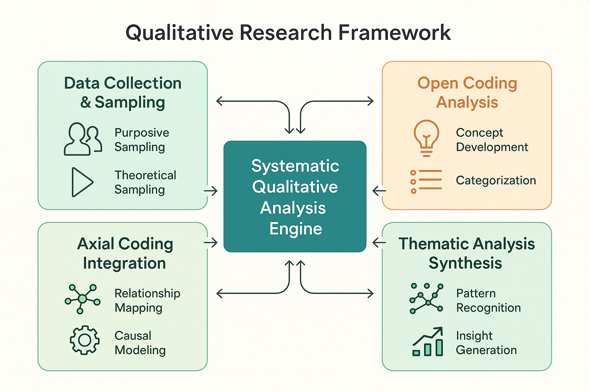

# Qualitative Research Methodologies for Error Analysis



*Figure 6: Comprehensive framework for applying qualitative research methods to AI error analysis, showing the systematic progression from data collection through insight generation*

## Introduction

While quantitative analysis provides measurable insights into AI system performance, qualitative research methodologies offer deep understanding of error patterns, user experiences, and system behaviors that numbers alone cannot capture. This section introduces systematic qualitative approaches specifically adapted for AI error analysis, drawing from established social science research methods.

Qualitative research in AI evaluation bridges the gap between statistical patterns and human understanding, enabling teams to uncover the "why" behind error patterns and develop more effective solutions. These methodologies are particularly powerful when combined with the Three Gulfs Model and AMI Lifecycle from Module 1.

## Core Qualitative Research Principles

### Systematic Data Collection

Qualitative research in AI error analysis requires systematic approaches to data collection that ensure representative and comprehensive coverage of error phenomena:

```python
import pandas as pd
import numpy as np
from typing import Dict, List, Any, Tuple
from collections import defaultdict
import json
from datetime import datetime, timedelta

class QualitativeDataCollector:
    """
    Systematic collection of qualitative data for AI error analysis.
    Implements multiple sampling strategies to ensure comprehensive coverage.
    """
    
    def __init__(self):
        self.collection_strategies = {}
        self.data_sources = {}
        self.sampling_criteria = {}
        
    def implement_purposive_sampling(self, error_data: List[Dict], 
                                   criteria: Dict[str, Any]) -> List[Dict]:
        """
        Implement purposive sampling to select information-rich cases.
        
        Args:
            error_data: Complete dataset of error instances
            criteria: Sampling criteria for case selection
            
        Returns:
            Strategically selected subset for qualitative analysis
        """
        selected_cases = []
        
        # Maximum variation sampling - select diverse cases
        if criteria.get('maximum_variation', False):
            selected_cases.extend(
                self._select_maximum_variation_cases(error_data, criteria)
            )
        
        # Critical case sampling - select cases that test theories
        if criteria.get('critical_cases', False):
            selected_cases.extend(
                self._select_critical_cases(error_data, criteria)
            )
        
        # Extreme case sampling - select unusual or outlier cases
        if criteria.get('extreme_cases', False):
            selected_cases.extend(
                self._select_extreme_cases(error_data, criteria)
            )
        
        # Typical case sampling - select representative cases
        if criteria.get('typical_cases', False):
            selected_cases.extend(
                self._select_typical_cases(error_data, criteria)
            )
        
        return self._remove_duplicates(selected_cases)
    
    def _select_maximum_variation_cases(self, data: List[Dict], 
                                      criteria: Dict) -> List[Dict]:
        """Select cases that maximize variation across key dimensions."""
        variation_dimensions = criteria.get('variation_dimensions', [])
        cases_per_dimension = criteria.get('cases_per_dimension', 5)
        
        selected = []
        for dimension in variation_dimensions:
            # Get unique values for this dimension
            unique_values = list(set(item.get(dimension) for item in data))
            
            # Select cases representing each unique value
            for value in unique_values[:cases_per_dimension]:
                matching_cases = [
                    item for item in data 
                    if item.get(dimension) == value
                ]
                if matching_cases:
                    selected.append(matching_cases[0])
        
        return selected
    
    def _select_critical_cases(self, data: List[Dict], 
                             criteria: Dict) -> List[Dict]:
        """Select cases that are critical for testing hypotheses."""
        critical_criteria = criteria.get('critical_criteria', {})
        
        critical_cases = []
        for item in data:
            is_critical = True
            for criterion, value in critical_criteria.items():
                if item.get(criterion) != value:
                    is_critical = False
                    break
            
            if is_critical:
                critical_cases.append(item)
        
        return critical_cases[:criteria.get('max_critical_cases', 10)]
    
    def collect_contextual_information(self, error_cases: List[Dict]) -> Dict:
        """
        Collect rich contextual information for selected error cases.
        
        Args:
            error_cases: Selected cases for detailed analysis
            
        Returns:
            Comprehensive contextual data for each case
        """
        contextual_data = {}
        
        for case in error_cases:
            case_id = case.get('id')
            contextual_data[case_id] = {
                'system_context': self._gather_system_context(case),
                'user_context': self._gather_user_context(case),
                'temporal_context': self._gather_temporal_context(case),
                'environmental_context': self._gather_environmental_context(case),
                'interaction_history': self._gather_interaction_history(case)
            }
        
        return contextual_data
    
    def _gather_system_context(self, case: Dict) -> Dict:
        """Gather system-level context for error case."""
        return {
            'model_version': case.get('model_version'),
            'system_load': case.get('system_load'),
            'configuration': case.get('configuration', {}),
            'dependencies': case.get('dependencies', []),
            'resource_utilization': case.get('resource_utilization', {})
        }
    
    def _gather_user_context(self, case: Dict) -> Dict:
        """Gather user-level context for error case."""
        return {
            'user_type': case.get('user_type'),
            'experience_level': case.get('experience_level'),
            'usage_patterns': case.get('usage_patterns', []),
            'previous_interactions': case.get('previous_interactions', []),
            'user_goals': case.get('user_goals', [])
        }

# Example usage
collector = QualitativeDataCollector()

# Define sampling criteria for comprehensive analysis
sampling_criteria = {
    'maximum_variation': True,
    'variation_dimensions': ['error_type', 'user_type', 'system_component'],
    'critical_cases': True,
    'critical_criteria': {'severity': 'high', 'frequency': 'recurring'},
    'extreme_cases': True,
    'typical_cases': True,
    'cases_per_dimension': 3,
    'max_critical_cases': 5
}

# Collect representative sample for qualitative analysis
sample_data = [
    {'id': 'err_001', 'error_type': 'hallucination', 'severity': 'high', 
     'user_type': 'expert', 'system_component': 'generation'},
    {'id': 'err_002', 'error_type': 'refusal', 'severity': 'medium', 
     'user_type': 'novice', 'system_component': 'safety'},
    # Additional error cases...
]

selected_cases = collector.implement_purposive_sampling(sample_data, sampling_criteria)
contextual_data = collector.collect_contextual_information(selected_cases)
```

### Theoretical Sensitivity

Theoretical sensitivity involves the ability to recognize important patterns and relationships in qualitative data while remaining open to unexpected insights:

```python
class TheoreticalSensitivityFramework:
    """
    Framework for developing and applying theoretical sensitivity 
    in AI error analysis.
    """
    
    def __init__(self):
        self.theoretical_frameworks = {}
        self.sensitivity_indicators = {}
        self.pattern_recognition_rules = {}
        
    def develop_theoretical_sensitivity(self, domain_knowledge: Dict,
                                      existing_theories: List[str],
                                      preliminary_observations: List[Dict]) -> Dict:
        """
        Develop theoretical sensitivity for AI error analysis.
        
        Args:
            domain_knowledge: Relevant domain expertise and knowledge
            existing_theories: Applicable theories from literature
            preliminary_observations: Initial observations from data
            
        Returns:
            Framework for theoretically sensitive analysis
        """
        sensitivity_framework = {
            'conceptual_lenses': self._identify_conceptual_lenses(
                domain_knowledge, existing_theories
            ),
            'pattern_indicators': self._define_pattern_indicators(
                preliminary_observations
            ),
            'theoretical_questions': self._generate_theoretical_questions(
                domain_knowledge, existing_theories
            ),
            'sensitivity_checks': self._create_sensitivity_checks()
        }
        
        return sensitivity_framework
    
    def _identify_conceptual_lenses(self, domain_knowledge: Dict,
                                  theories: List[str]) -> List[Dict]:
        """Identify conceptual lenses for analyzing error patterns."""
        lenses = []
        
        # Technical system lenses
        lenses.append({
            'name': 'system_architecture_lens',
            'focus': 'How system architecture influences error patterns',
            'key_concepts': ['modularity', 'coupling', 'complexity'],
            'guiding_questions': [
                'How does system architecture contribute to this error?',
                'What architectural patterns are associated with this error type?'
            ]
        })
        
        # User interaction lenses
        lenses.append({
            'name': 'user_interaction_lens',
            'focus': 'How user behavior and expectations relate to errors',
            'key_concepts': ['mental_models', 'expectations', 'workflows'],
            'guiding_questions': [
                'How do user mental models contribute to this error?',
                'What user expectations are violated by this error?'
            ]
        })
        
        # Sociotechnical lenses
        lenses.append({
            'name': 'sociotechnical_lens',
            'focus': 'How social and technical factors interact to produce errors',
            'key_concepts': ['human_ai_collaboration', 'trust', 'agency'],
            'guiding_questions': [
                'How do social factors influence this technical error?',
                'What role does human-AI interaction play in this error?'
            ]
        })
        
        return lenses
    
    def apply_theoretical_sensitivity(self, error_case: Dict,
                                    sensitivity_framework: Dict) -> Dict:
        """
        Apply theoretical sensitivity to analyze specific error case.
        
        Args:
            error_case: Detailed error case data
            sensitivity_framework: Framework for sensitive analysis
            
        Returns:
            Theoretically informed analysis of error case
        """
        analysis = {
            'case_id': error_case.get('id'),
            'lens_analyses': {},
            'theoretical_insights': [],
            'pattern_connections': [],
            'emergent_concepts': []
        }
        
        # Apply each conceptual lens
        for lens in sensitivity_framework['conceptual_lenses']:
            lens_analysis = self._analyze_through_lens(error_case, lens)
            analysis['lens_analyses'][lens['name']] = lens_analysis
        
        # Identify theoretical insights
        analysis['theoretical_insights'] = self._extract_theoretical_insights(
            analysis['lens_analyses'], sensitivity_framework
        )
        
        # Connect to broader patterns
        analysis['pattern_connections'] = self._identify_pattern_connections(
            error_case, sensitivity_framework['pattern_indicators']
        )
        
        return analysis
```

## Open Coding Methodology

Open coding is the foundational analytical process of breaking down qualitative data into discrete concepts and categories. In AI error analysis, open coding helps identify patterns and themes that might not be apparent through quantitative analysis alone.

### Systematic Open Coding Process

```python
class OpenCodingAnalyzer:
    """
    Systematic implementation of open coding for AI error analysis.
    Breaks down error data into concepts, categories, and properties.
    """
    
    def __init__(self):
        self.codes = {}
        self.concepts = {}
        self.categories = {}
        self.coding_rules = {}
        
    def perform_open_coding(self, error_narratives: List[Dict]) -> Dict:
        """
        Perform systematic open coding on error narratives and descriptions.
        
        Args:
            error_narratives: Rich descriptions of error cases and contexts
            
        Returns:
            Comprehensive coding results with concepts and categories
        """
        coding_results = {
            'initial_codes': {},
            'refined_codes': {},
            'concepts': {},
            'categories': {},
            'coding_statistics': {}
        }
        
        # Phase 1: Initial line-by-line coding
        initial_codes = self._perform_initial_coding(error_narratives)
        coding_results['initial_codes'] = initial_codes
        
        # Phase 2: Focused coding - refine and consolidate codes
        refined_codes = self._perform_focused_coding(initial_codes)
        coding_results['refined_codes'] = refined_codes
        
        # Phase 3: Concept development
        concepts = self._develop_concepts(refined_codes)
        coding_results['concepts'] = concepts
        
        # Phase 4: Category construction
        categories = self._construct_categories(concepts)
        coding_results['categories'] = categories
        
        # Generate coding statistics
        coding_results['coding_statistics'] = self._generate_coding_statistics(
            coding_results
        )
        
        return coding_results
    
    def _perform_initial_coding(self, narratives: List[Dict]) -> Dict:
        """Perform initial line-by-line coding of error narratives."""
        initial_codes = defaultdict(list)
        
        for narrative in narratives:
            narrative_id = narrative.get('id')
            text = narrative.get('description', '')
            
            # Break text into meaningful segments
            segments = self._segment_text(text)
            
            for segment_idx, segment in enumerate(segments):
                # Generate codes for this segment
                segment_codes = self._code_segment(segment, narrative_id, segment_idx)
                
                for code in segment_codes:
                    initial_codes[code['code']].append({
                        'narrative_id': narrative_id,
                        'segment_idx': segment_idx,
                        'segment_text': segment,
                        'code_rationale': code['rationale'],
                        'properties': code.get('properties', {})
                    })
        
        return dict(initial_codes)
    
    def _segment_text(self, text: str) -> List[str]:
        """Break text into meaningful segments for coding."""
        # Simple sentence-based segmentation (can be enhanced)
        import re
        sentences = re.split(r'[.!?]+', text)
        return [s.strip() for s in sentences if s.strip()]
    
    def _code_segment(self, segment: str, narrative_id: str, 
                     segment_idx: int) -> List[Dict]:
        """Generate codes for a text segment."""
        codes = []
        
        # Technical error indicators
        if any(term in segment.lower() for term in 
               ['failed', 'error', 'exception', 'timeout', 'crash']):
            codes.append({
                'code': 'technical_failure',
                'rationale': 'Segment indicates technical system failure',
                'properties': {'failure_type': self._identify_failure_type(segment)}
            })
        
        # User experience indicators
        if any(term in segment.lower() for term in 
               ['confused', 'unexpected', 'wrong', 'unclear']):
            codes.append({
                'code': 'user_experience_issue',
                'rationale': 'Segment indicates user experience problem',
                'properties': {'ux_aspect': self._identify_ux_aspect(segment)}
            })
        
        # System behavior indicators
        if any(term in segment.lower() for term in 
               ['generated', 'produced', 'output', 'response']):
            codes.append({
                'code': 'system_behavior',
                'rationale': 'Segment describes system behavior',
                'properties': {'behavior_type': self._identify_behavior_type(segment)}
            })
        
        # Context indicators
        if any(term in segment.lower() for term in 
               ['when', 'during', 'after', 'before', 'while']):
            codes.append({
                'code': 'contextual_factor',
                'rationale': 'Segment provides contextual information',
                'properties': {'context_type': self._identify_context_type(segment)}
            })
        
        return codes
    
    def _perform_focused_coding(self, initial_codes: Dict) -> Dict:
        """Refine and consolidate initial codes through focused coding."""
        refined_codes = {}
        
        # Analyze code frequency and relationships
        code_analysis = self._analyze_code_patterns(initial_codes)
        
        # Consolidate related codes
        for code, instances in initial_codes.items():
            if len(instances) >= 3:  # Keep codes with sufficient evidence
                refined_codes[code] = {
                    'instances': instances,
                    'frequency': len(instances),
                    'properties': self._consolidate_properties(instances),
                    'relationships': code_analysis['relationships'].get(code, [])
                }
        
        # Merge similar codes
        merged_codes = self._merge_similar_codes(refined_codes)
        
        return merged_codes
    
    def _develop_concepts(self, refined_codes: Dict) -> Dict:
        """Develop higher-level concepts from refined codes."""
        concepts = {}
        
        # Group related codes into concepts
        code_groups = self._group_related_codes(refined_codes)
        
        for group_name, codes in code_groups.items():
            concept = {
                'name': group_name,
                'definition': self._generate_concept_definition(codes),
                'properties': self._identify_concept_properties(codes),
                'dimensions': self._identify_concept_dimensions(codes),
                'constituent_codes': list(codes.keys()),
                'evidence_strength': self._assess_evidence_strength(codes)
            }
            concepts[group_name] = concept
        
        return concepts
    
    def _construct_categories(self, concepts: Dict) -> Dict:
        """Construct higher-level categories from concepts."""
        categories = {}
        
        # Identify category themes
        category_themes = self._identify_category_themes(concepts)
        
        for theme, related_concepts in category_themes.items():
            category = {
                'name': theme,
                'description': self._generate_category_description(related_concepts),
                'constituent_concepts': list(related_concepts.keys()),
                'core_properties': self._identify_core_properties(related_concepts),
                'theoretical_significance': self._assess_theoretical_significance(
                    related_concepts
                )
            }
            categories[theme] = category
        
        return categories

# Example usage for AI error analysis
analyzer = OpenCodingAnalyzer()

# Sample error narratives for coding
error_narratives = [
    {
        'id': 'narrative_001',
        'description': 'The system generated a response that was factually incorrect. The user was asking about recent events, but the AI provided outdated information. This caused confusion and the user lost trust in the system.',
        'context': 'Customer support chatbot interaction',
        'severity': 'high'
    },
    {
        'id': 'narrative_002', 
        'description': 'During peak usage hours, the system failed to respond within the expected timeframe. Users experienced long delays and some requests timed out completely.',
        'context': 'High-traffic period',
        'severity': 'medium'
    }
    # Additional narratives...
]

# Perform open coding analysis
coding_results = analyzer.perform_open_coding(error_narratives)

# Display results
print("Identified Categories:")
for category_name, category_data in coding_results['categories'].items():
    print(f"- {category_name}: {category_data['description']}")
```

### Code Development and Refinement

The open coding process involves iterative refinement of codes to ensure they accurately capture the phenomena being studied:

```python
class CodeRefinementEngine:
    """
    Engine for iteratively refining codes to improve accuracy and consistency.
    """
    
    def __init__(self):
        self.refinement_history = []
        self.inter_coder_reliability = {}
        
    def refine_codes_iteratively(self, initial_codes: Dict, 
                                refinement_criteria: Dict) -> Dict:
        """
        Iteratively refine codes based on multiple criteria.
        
        Args:
            initial_codes: Initial coding results
            refinement_criteria: Criteria for code refinement
            
        Returns:
            Refined and validated codes
        """
        current_codes = initial_codes.copy()
        iteration = 0
        
        while iteration < refinement_criteria.get('max_iterations', 5):
            iteration += 1
            
            # Apply refinement techniques
            refined_codes = self._apply_refinement_techniques(
                current_codes, refinement_criteria
            )
            
            # Check convergence
            if self._check_convergence(current_codes, refined_codes):
                break
                
            current_codes = refined_codes
            
            # Record refinement history
            self.refinement_history.append({
                'iteration': iteration,
                'codes_count': len(refined_codes),
                'changes_made': self._calculate_changes(current_codes, refined_codes)
            })
        
        return current_codes
    
    def _apply_refinement_techniques(self, codes: Dict, 
                                   criteria: Dict) -> Dict:
        """Apply various refinement techniques to improve codes."""
        refined = codes.copy()
        
        # Technique 1: Merge overly similar codes
        if criteria.get('merge_similar', True):
            refined = self._merge_similar_codes(refined, 
                                              criteria.get('similarity_threshold', 0.8))
        
        # Technique 2: Split overly broad codes
        if criteria.get('split_broad', True):
            refined = self._split_broad_codes(refined,
                                            criteria.get('breadth_threshold', 10))
        
        # Technique 3: Remove low-frequency codes
        if criteria.get('remove_infrequent', True):
            refined = self._remove_infrequent_codes(refined,
                                                  criteria.get('frequency_threshold', 2))
        
        # Technique 4: Standardize code names
        if criteria.get('standardize_names', True):
            refined = self._standardize_code_names(refined)
        
        return refined
    
    def validate_coding_consistency(self, codes: Dict, 
                                  validation_data: List[Dict]) -> Dict:
        """
        Validate coding consistency using independent validation data.
        
        Args:
            codes: Developed codes to validate
            validation_data: Independent data for validation
            
        Returns:
            Consistency validation results
        """
        validation_results = {
            'consistency_score': 0.0,
            'problematic_codes': [],
            'recommendations': []
        }
        
        # Apply codes to validation data
        validation_coding = self._apply_codes_to_data(codes, validation_data)
        
        # Calculate consistency metrics
        consistency_metrics = self._calculate_consistency_metrics(validation_coding)
        validation_results['consistency_score'] = consistency_metrics['overall_score']
        
        # Identify problematic codes
        validation_results['problematic_codes'] = [
            code for code, score in consistency_metrics['code_scores'].items()
            if score < 0.7
        ]
        
        # Generate recommendations
        validation_results['recommendations'] = self._generate_consistency_recommendations(
            consistency_metrics
        )
        
        return validation_results
```

## Axial Coding Methodology

Axial coding builds on open coding by systematically relating categories and concepts to each other, developing a more sophisticated understanding of the relationships between different aspects of AI system errors.

### Systematic Relationship Analysis

```python
class AxialCodingAnalyzer:
    """
    Implementation of axial coding for AI error analysis.
    Focuses on identifying relationships between categories and concepts.
    """
    
    def __init__(self):
        self.relationship_types = {}
        self.causal_models = {}
        self.conditional_matrices = {}
        
    def perform_axial_coding(self, open_coding_results: Dict) -> Dict:
        """
        Perform axial coding to identify relationships between categories.
        
        Args:
            open_coding_results: Results from open coding analysis
            
        Returns:
            Axial coding results with relationship models
        """
        axial_results = {
            'relationship_analysis': {},
            'causal_models': {},
            'conditional_matrices': {},
            'paradigm_models': {},
            'theoretical_framework': {}
        }
        
        categories = open_coding_results['categories']
        concepts = open_coding_results['concepts']
        
        # Analyze relationships between categories
        axial_results['relationship_analysis'] = self._analyze_category_relationships(
            categories, concepts
        )
        
        # Develop causal models
        axial_results['causal_models'] = self._develop_causal_models(
            categories, axial_results['relationship_analysis']
        )
        
        # Create conditional matrices
        axial_results['conditional_matrices'] = self._create_conditional_matrices(
            categories, concepts
        )
        
        # Build paradigm models
        axial_results['paradigm_models'] = self._build_paradigm_models(
            axial_results['causal_models']
        )
        
        # Synthesize theoretical framework
        axial_results['theoretical_framework'] = self._synthesize_theoretical_framework(
            axial_results
        )
        
        return axial_results
    
    def _analyze_category_relationships(self, categories: Dict, 
                                      concepts: Dict) -> Dict:
        """Analyze relationships between categories and concepts."""
        relationships = {
            'causal_relationships': [],
            'associative_relationships': [],
            'hierarchical_relationships': [],
            'temporal_relationships': [],
            'conditional_relationships': []
        }
        
        # Identify causal relationships
        for cat1_name, cat1_data in categories.items():
            for cat2_name, cat2_data in categories.items():
                if cat1_name != cat2_name:
                    causal_strength = self._assess_causal_relationship(
                        cat1_data, cat2_data, concepts
                    )
                    if causal_strength > 0.6:
                        relationships['causal_relationships'].append({
                            'cause': cat1_name,
                            'effect': cat2_name,
                            'strength': causal_strength,
                            'evidence': self._gather_causal_evidence(
                                cat1_data, cat2_data, concepts
                            )
                        })
        
        # Identify associative relationships
        relationships['associative_relationships'] = self._identify_associations(
            categories, concepts
        )
        
        # Identify hierarchical relationships
        relationships['hierarchical_relationships'] = self._identify_hierarchies(
            categories, concepts
        )
        
        # Identify temporal relationships
        relationships['temporal_relationships'] = self._identify_temporal_patterns(
            categories, concepts
        )
        
        # Identify conditional relationships
        relationships['conditional_relationships'] = self._identify_conditions(
            categories, concepts
        )
        
        return relationships
    
    def _develop_causal_models(self, categories: Dict, 
                             relationships: Dict) -> Dict:
        """Develop causal models from relationship analysis."""
        causal_models = {}
        
        # Build directed acyclic graphs for causal relationships
        for category_name in categories.keys():
            model = self._build_causal_model_for_category(
                category_name, relationships['causal_relationships']
            )
            causal_models[category_name] = model
        
        return causal_models
    
    def _create_conditional_matrices(self, categories: Dict, 
                                   concepts: Dict) -> Dict:
        """Create conditional matrices showing when relationships hold."""
        matrices = {}
        
        for cat_name, cat_data in categories.items():
            matrix = self._build_conditional_matrix(cat_name, cat_data, concepts)
            matrices[cat_name] = matrix
        
        return matrices
    
    def _build_paradigm_models(self, causal_models: Dict) -> Dict:
        """Build paradigm models using the coding paradigm framework."""
        paradigm_models = {}
        
        for category_name, causal_model in causal_models.items():
            paradigm = {
                'phenomenon': category_name,
                'causal_conditions': self._identify_causal_conditions(causal_model),
                'context': self._identify_context_factors(causal_model),
                'intervening_conditions': self._identify_intervening_conditions(causal_model),
                'action_strategies': self._identify_action_strategies(causal_model),
                'consequences': self._identify_consequences(causal_model)
            }
            paradigm_models[category_name] = paradigm
        
        return paradigm_models

# Example usage
axial_analyzer = AxialCodingAnalyzer()

# Sample open coding results (would come from previous analysis)
open_coding_results = {
    'categories': {
        'technical_failures': {
            'description': 'System-level technical failures and malfunctions',
            'constituent_concepts': ['timeout_errors', 'memory_issues', 'api_failures']
        },
        'user_experience_issues': {
            'description': 'Problems affecting user experience and satisfaction',
            'constituent_concepts': ['confusion', 'unexpected_behavior', 'trust_loss']
        },
        'content_quality_problems': {
            'description': 'Issues with AI-generated content quality',
            'constituent_concepts': ['factual_errors', 'irrelevant_responses', 'bias']
        }
    },
    'concepts': {
        'timeout_errors': {'properties': {'frequency': 'high', 'impact': 'medium'}},
        'confusion': {'properties': {'frequency': 'medium', 'impact': 'high'}},
        'factual_errors': {'properties': {'frequency': 'medium', 'impact': 'high'}}
    }
}

# Perform axial coding
axial_results = axial_analyzer.perform_axial_coding(open_coding_results)

# Display paradigm model for technical failures
tech_paradigm = axial_results['paradigm_models']['technical_failures']
print("Technical Failures Paradigm Model:")
print(f"Phenomenon: {tech_paradigm['phenomenon']}")
print(f"Causal Conditions: {tech_paradigm['causal_conditions']}")
print(f"Consequences: {tech_paradigm['consequences']}")
```

### Relationship Mapping and Validation

Understanding the relationships between different error categories enables more effective intervention strategies:

```python
class RelationshipMapper:
    """
    Maps and validates relationships between error categories and concepts.
    """
    
    def __init__(self):
        self.relationship_network = {}
        self.validation_metrics = {}
        
    def create_relationship_network(self, axial_results: Dict) -> Dict:
        """
        Create a comprehensive network of relationships between categories.
        
        Args:
            axial_results: Results from axial coding analysis
            
        Returns:
            Network representation of category relationships
        """
        network = {
            'nodes': {},
            'edges': {},
            'clusters': {},
            'pathways': {}
        }
        
        # Create nodes for each category
        for category in axial_results['paradigm_models'].keys():
            network['nodes'][category] = {
                'type': 'category',
                'properties': self._extract_node_properties(category, axial_results),
                'centrality_measures': {}
            }
        
        # Create edges for relationships
        relationships = axial_results['relationship_analysis']
        edge_id = 0
        
        for rel_type, rel_list in relationships.items():
            for relationship in rel_list:
                edge_id += 1
                network['edges'][f'edge_{edge_id}'] = {
                    'source': relationship.get('cause', relationship.get('source')),
                    'target': relationship.get('effect', relationship.get('target')),
                    'type': rel_type,
                    'strength': relationship.get('strength', 0.5),
                    'evidence': relationship.get('evidence', [])
                }
        
        # Identify clusters of related categories
        network['clusters'] = self._identify_category_clusters(network)
        
        # Map critical pathways
        network['pathways'] = self._map_critical_pathways(network)
        
        return network
    
    def validate_relationships(self, network: Dict, 
                             validation_data: List[Dict]) -> Dict:
        """
        Validate identified relationships using independent data.
        
        Args:
            network: Relationship network to validate
            validation_data: Independent data for validation
            
        Returns:
            Validation results for relationships
        """
        validation_results = {
            'relationship_validity': {},
            'network_stability': {},
            'predictive_accuracy': {}
        }
        
        # Validate individual relationships
        for edge_id, edge_data in network['edges'].items():
            validity_score = self._validate_single_relationship(
                edge_data, validation_data
            )
            validation_results['relationship_validity'][edge_id] = validity_score
        
        # Assess network stability
        validation_results['network_stability'] = self._assess_network_stability(
            network, validation_data
        )
        
        # Test predictive accuracy
        validation_results['predictive_accuracy'] = self._test_predictive_accuracy(
            network, validation_data
        )
        
        return validation_results
    
    def generate_intervention_strategies(self, network: Dict) -> Dict:
        """
        Generate intervention strategies based on relationship network.
        
        Args:
            network: Validated relationship network
            
        Returns:
            Targeted intervention strategies
        """
        strategies = {
            'high_impact_interventions': [],
            'preventive_strategies': [],
            'reactive_strategies': [],
            'systemic_improvements': []
        }
        
        # Identify high-impact intervention points
        centrality_scores = self._calculate_centrality_measures(network)
        high_impact_nodes = [
            node for node, score in centrality_scores.items()
            if score > 0.7
        ]
        
        for node in high_impact_nodes:
            intervention = self._design_node_intervention(node, network)
            strategies['high_impact_interventions'].append(intervention)
        
        # Design preventive strategies based on causal pathways
        for pathway in network['pathways']:
            if pathway['type'] == 'causal_chain':
                preventive_strategy = self._design_preventive_strategy(pathway, network)
                strategies['preventive_strategies'].append(preventive_strategy)
        
        # Design reactive strategies for error clusters
        for cluster_id, cluster_data in network['clusters'].items():
            reactive_strategy = self._design_reactive_strategy(cluster_data, network)
            strategies['reactive_strategies'].append(reactive_strategy)
        
        return strategies
```

## Advanced Pattern Recognition

Qualitative research methodologies enable sophisticated pattern recognition that goes beyond simple statistical correlations to uncover meaningful relationships and insights.

### Thematic Analysis Framework

```python
class ThematicAnalysisEngine:
    """
    Advanced thematic analysis for identifying patterns in AI error data.
    """
    
    def __init__(self):
        self.themes = {}
        self.pattern_library = {}
        self.analysis_framework = {}
        
    def conduct_thematic_analysis(self, coded_data: Dict, 
                                 analysis_objectives: Dict) -> Dict:
        """
        Conduct comprehensive thematic analysis of coded error data.
        
        Args:
            coded_data: Results from open and axial coding
            analysis_objectives: Specific objectives for thematic analysis
            
        Returns:
            Comprehensive thematic analysis results
        """
        thematic_results = {
            'initial_themes': {},
            'refined_themes': {},
            'theme_relationships': {},
            'thematic_framework': {},
            'actionable_insights': {}
        }
        
        # Phase 1: Initial theme identification
        thematic_results['initial_themes'] = self._identify_initial_themes(
            coded_data, analysis_objectives
        )
        
        # Phase 2: Theme refinement and validation
        thematic_results['refined_themes'] = self._refine_themes(
            thematic_results['initial_themes'], coded_data
        )
        
        # Phase 3: Analyze theme relationships
        thematic_results['theme_relationships'] = self._analyze_theme_relationships(
            thematic_results['refined_themes']
        )
        
        # Phase 4: Build thematic framework
        thematic_results['thematic_framework'] = self._build_thematic_framework(
            thematic_results['refined_themes'],
            thematic_results['theme_relationships']
        )
        
        # Phase 5: Generate actionable insights
        thematic_results['actionable_insights'] = self._generate_actionable_insights(
            thematic_results['thematic_framework']
        )
        
        return thematic_results
    
    def _identify_initial_themes(self, coded_data: Dict, 
                               objectives: Dict) -> Dict:
        """Identify initial themes from coded data."""
        themes = {}
        
        # Analyze category patterns
        categories = coded_data.get('categories', {})
        for cat_name, cat_data in categories.items():
            theme_candidates = self._extract_theme_candidates(cat_data)
            for candidate in theme_candidates:
                theme_name = candidate['name']
                if theme_name not in themes:
                    themes[theme_name] = {
                        'description': candidate['description'],
                        'supporting_evidence': [],
                        'frequency': 0,
                        'scope': []
                    }
                
                themes[theme_name]['supporting_evidence'].extend(
                    candidate['evidence']
                )
                themes[theme_name]['frequency'] += candidate['frequency']
                themes[theme_name]['scope'].append(cat_name)
        
        # Apply objective-specific filters
        filtered_themes = self._apply_objective_filters(themes, objectives)
        
        return filtered_themes
    
    def _refine_themes(self, initial_themes: Dict, coded_data: Dict) -> Dict:
        """Refine themes through iterative analysis."""
        refined_themes = {}
        
        for theme_name, theme_data in initial_themes.items():
            # Check theme coherence
            coherence_score = self._assess_theme_coherence(theme_data, coded_data)
            
            if coherence_score > 0.6:
                # Refine theme definition
                refined_definition = self._refine_theme_definition(
                    theme_data, coded_data
                )
                
                # Identify theme dimensions
                dimensions = self._identify_theme_dimensions(theme_data, coded_data)
                
                refined_themes[theme_name] = {
                    'definition': refined_definition,
                    'dimensions': dimensions,
                    'coherence_score': coherence_score,
                    'supporting_evidence': theme_data['supporting_evidence'],
                    'scope': theme_data['scope']
                }
        
        return refined_themes
    
    def _generate_actionable_insights(self, thematic_framework: Dict) -> Dict:
        """Generate actionable insights from thematic analysis."""
        insights = {
            'strategic_insights': [],
            'tactical_recommendations': [],
            'system_improvements': [],
            'process_enhancements': []
        }
        
        for theme_name, theme_data in thematic_framework.items():
            # Generate strategic insights
            strategic_insight = self._extract_strategic_insight(theme_data)
            if strategic_insight:
                insights['strategic_insights'].append(strategic_insight)
            
            # Generate tactical recommendations
            tactical_recs = self._extract_tactical_recommendations(theme_data)
            insights['tactical_recommendations'].extend(tactical_recs)
            
            # Identify system improvements
            system_improvements = self._identify_system_improvements(theme_data)
            insights['system_improvements'].extend(system_improvements)
            
            # Suggest process enhancements
            process_enhancements = self._suggest_process_enhancements(theme_data)
            insights['process_enhancements'].extend(process_enhancements)
        
        return insights

# Example usage
thematic_engine = ThematicAnalysisEngine()

# Sample coded data (would come from previous coding analysis)
coded_data = {
    'categories': {
        'user_trust_erosion': {
            'description': 'Patterns leading to loss of user trust',
            'constituent_concepts': ['inconsistent_responses', 'factual_errors', 'system_opacity']
        },
        'system_reliability_issues': {
            'description': 'Technical reliability and performance problems',
            'constituent_concepts': ['timeout_errors', 'service_unavailability', 'data_corruption']
        }
    }
}

# Define analysis objectives
analysis_objectives = {
    'focus_areas': ['user_experience', 'system_reliability', 'business_impact'],
    'depth_level': 'comprehensive',
    'actionability_priority': 'high'
}

# Conduct thematic analysis
thematic_results = thematic_engine.conduct_thematic_analysis(
    coded_data, analysis_objectives
)

# Display actionable insights
print("Strategic Insights:")
for insight in thematic_results['actionable_insights']['strategic_insights']:
    print(f"- {insight['title']}: {insight['description']}")
```

## Integration with Quantitative Methods

Qualitative research methodologies are most powerful when integrated with quantitative analysis, creating a comprehensive understanding of AI system errors.

### Mixed-Methods Integration Framework

```python
class MixedMethodsIntegrator:
    """
    Integrates qualitative and quantitative methods for comprehensive error analysis.
    """
    
    def __init__(self):
        self.integration_strategies = {}
        self.validation_frameworks = {}
        
    def integrate_qualitative_quantitative(self, qualitative_results: Dict,
                                         quantitative_results: Dict,
                                         integration_strategy: str) -> Dict:
        """
        Integrate qualitative and quantitative analysis results.
        
        Args:
            qualitative_results: Results from qualitative analysis
            quantitative_results: Results from quantitative analysis
            integration_strategy: Strategy for integration
            
        Returns:
            Integrated analysis results
        """
        integrated_results = {
            'convergent_findings': {},
            'divergent_findings': {},
            'complementary_insights': {},
            'validated_patterns': {},
            'comprehensive_framework': {}
        }
        
        if integration_strategy == 'triangulation':
            integrated_results = self._triangulation_integration(
                qualitative_results, quantitative_results
            )
        elif integration_strategy == 'sequential_explanatory':
            integrated_results = self._sequential_explanatory_integration(
                qualitative_results, quantitative_results
            )
        elif integration_strategy == 'concurrent_embedded':
            integrated_results = self._concurrent_embedded_integration(
                qualitative_results, quantitative_results
            )
        
        return integrated_results
    
    def _triangulation_integration(self, qual_results: Dict, 
                                 quant_results: Dict) -> Dict:
        """Integrate using triangulation strategy."""
        integration = {
            'convergent_findings': {},
            'divergent_findings': {},
            'confidence_levels': {}
        }
        
        # Find convergent findings
        qual_themes = qual_results.get('thematic_framework', {})
        quant_patterns = quant_results.get('statistical_patterns', {})
        
        for theme_name, theme_data in qual_themes.items():
            # Look for corresponding quantitative evidence
            corresponding_quant = self._find_corresponding_quantitative(
                theme_data, quant_patterns
            )
            
            if corresponding_quant:
                convergence_strength = self._assess_convergence_strength(
                    theme_data, corresponding_quant
                )
                
                if convergence_strength > 0.7:
                    integration['convergent_findings'][theme_name] = {
                        'qualitative_evidence': theme_data,
                        'quantitative_evidence': corresponding_quant,
                        'convergence_strength': convergence_strength
                    }
                else:
                    integration['divergent_findings'][theme_name] = {
                        'qualitative_evidence': theme_data,
                        'quantitative_evidence': corresponding_quant,
                        'divergence_analysis': self._analyze_divergence(
                            theme_data, corresponding_quant
                        )
                    }
        
        return integration
    
    def generate_comprehensive_insights(self, integrated_results: Dict) -> Dict:
        """
        Generate comprehensive insights from integrated analysis.
        
        Args:
            integrated_results: Results from mixed-methods integration
            
        Returns:
            Comprehensive insights and recommendations
        """
        insights = {
            'high_confidence_findings': [],
            'areas_for_investigation': [],
            'actionable_recommendations': [],
            'strategic_implications': []
        }
        
        # Extract high-confidence findings
        convergent_findings = integrated_results.get('convergent_findings', {})
        for finding_name, finding_data in convergent_findings.items():
            if finding_data['convergence_strength'] > 0.8:
                insights['high_confidence_findings'].append({
                    'finding': finding_name,
                    'confidence': finding_data['convergence_strength'],
                    'evidence_types': ['qualitative', 'quantitative'],
                    'implications': self._extract_implications(finding_data)
                })
        
        # Identify areas needing further investigation
        divergent_findings = integrated_results.get('divergent_findings', {})
        for finding_name, finding_data in divergent_findings.items():
            insights['areas_for_investigation'].append({
                'area': finding_name,
                'divergence_reason': finding_data['divergence_analysis'],
                'investigation_priority': self._assess_investigation_priority(finding_data)
            })
        
        # Generate actionable recommendations
        insights['actionable_recommendations'] = self._generate_mixed_methods_recommendations(
            integrated_results
        )
        
        # Extract strategic implications
        insights['strategic_implications'] = self._extract_strategic_implications(
            integrated_results
        )
        
        return insights

# Example usage
integrator = MixedMethodsIntegrator()

# Sample qualitative and quantitative results
qualitative_results = {
    'thematic_framework': {
        'user_confusion_patterns': {
            'description': 'Users consistently confused by inconsistent AI responses',
            'evidence_strength': 'high',
            'scope': ['customer_support', 'content_generation']
        }
    }
}

quantitative_results = {
    'statistical_patterns': {
        'response_inconsistency': {
            'correlation_coefficient': 0.85,
            'significance_level': 0.001,
            'effect_size': 'large'
        }
    }
}

# Integrate using triangulation strategy
integrated_results = integrator.integrate_qualitative_quantitative(
    qualitative_results, quantitative_results, 'triangulation'
)

# Generate comprehensive insights
comprehensive_insights = integrator.generate_comprehensive_insights(integrated_results)

print("High-Confidence Findings:")
for finding in comprehensive_insights['high_confidence_findings']:
    print(f"- {finding['finding']} (Confidence: {finding['confidence']:.2f})")
```

## Practical Implementation Guidelines

### Setting Up Qualitative Research Infrastructure

```python
class QualitativeResearchInfrastructure:
    """
    Infrastructure for conducting systematic qualitative research in AI evaluation.
    """
    
    def __init__(self):
        self.data_management_system = {}
        self.analysis_workflows = {}
        self.quality_assurance_protocols = {}
        
    def setup_research_infrastructure(self, project_requirements: Dict) -> Dict:
        """
        Set up comprehensive infrastructure for qualitative research.
        
        Args:
            project_requirements: Specific requirements for the research project
            
        Returns:
            Configured research infrastructure
        """
        infrastructure = {
            'data_collection_system': self._setup_data_collection(project_requirements),
            'analysis_platform': self._setup_analysis_platform(project_requirements),
            'quality_assurance': self._setup_quality_assurance(project_requirements),
            'collaboration_tools': self._setup_collaboration_tools(project_requirements),
            'documentation_system': self._setup_documentation_system(project_requirements)
        }
        
        return infrastructure
    
    def _setup_data_collection(self, requirements: Dict) -> Dict:
        """Set up systematic data collection infrastructure."""
        return {
            'sampling_framework': {
                'strategies': ['purposive', 'theoretical', 'maximum_variation'],
                'sample_size_guidelines': self._calculate_sample_size(requirements),
                'inclusion_criteria': requirements.get('inclusion_criteria', {}),
                'exclusion_criteria': requirements.get('exclusion_criteria', {})
            },
            'data_sources': {
                'error_logs': {'format': 'structured', 'frequency': 'continuous'},
                'user_feedback': {'format': 'unstructured', 'frequency': 'periodic'},
                'system_observations': {'format': 'mixed', 'frequency': 'continuous'},
                'stakeholder_interviews': {'format': 'transcripts', 'frequency': 'as_needed'}
            },
            'collection_protocols': {
                'data_quality_checks': True,
                'anonymization_procedures': True,
                'consent_management': True,
                'version_control': True
            }
        }
    
    def implement_quality_assurance(self, research_process: Dict) -> Dict:
        """
        Implement comprehensive quality assurance for qualitative research.
        
        Args:
            research_process: Research process to quality assure
            
        Returns:
            Quality assurance results and recommendations
        """
        qa_results = {
            'credibility_assessment': {},
            'transferability_evaluation': {},
            'dependability_audit': {},
            'confirmability_check': {}
        }
        
        # Assess credibility through multiple techniques
        qa_results['credibility_assessment'] = {
            'triangulation_score': self._assess_triangulation(research_process),
            'member_checking_results': self._conduct_member_checking(research_process),
            'peer_debriefing_outcomes': self._perform_peer_debriefing(research_process),
            'negative_case_analysis': self._analyze_negative_cases(research_process)
        }
        
        # Evaluate transferability
        qa_results['transferability_evaluation'] = {
            'thick_description_quality': self._assess_description_quality(research_process),
            'context_documentation': self._evaluate_context_documentation(research_process),
            'boundary_conditions': self._identify_boundary_conditions(research_process)
        }
        
        # Audit dependability
        qa_results['dependability_audit'] = {
            'process_documentation': self._audit_process_documentation(research_process),
            'decision_trail': self._evaluate_decision_trail(research_process),
            'consistency_checks': self._perform_consistency_checks(research_process)
        }
        
        # Check confirmability
        qa_results['confirmability_check'] = {
            'audit_trail_quality': self._assess_audit_trail(research_process),
            'reflexivity_documentation': self._evaluate_reflexivity(research_process),
            'bias_mitigation': self._assess_bias_mitigation(research_process)
        }
        
        return qa_results

# Example implementation
infrastructure = QualitativeResearchInfrastructure()

# Define project requirements
project_requirements = {
    'research_scope': 'comprehensive_error_analysis',
    'timeline': '6_months',
    'team_size': 3,
    'data_volume': 'large',
    'analysis_depth': 'deep',
    'stakeholder_involvement': 'high'
}

# Set up research infrastructure
research_infrastructure = infrastructure.setup_research_infrastructure(project_requirements)

# Implement quality assurance
qa_results = infrastructure.implement_quality_assurance(research_infrastructure)

print("Research Infrastructure Setup Complete")
print(f"Data Collection Strategies: {research_infrastructure['data_collection_system']['sampling_framework']['strategies']}")
print(f"Quality Assurance Score: {qa_results['credibility_assessment']['triangulation_score']:.2f}")
```

This comprehensive section on qualitative research methodologies provides AI evaluation teams with systematic approaches to understanding error patterns beyond what quantitative analysis alone can reveal. The integration of open coding, axial coding, and thematic analysis creates a robust framework for developing deep insights into AI system behavior and user experiences.

The methodologies presented here are specifically adapted for AI evaluation contexts while maintaining the rigor and systematic approach of established qualitative research traditions. When combined with the quantitative techniques in other sections of this module, these approaches enable comprehensive understanding of AI system errors and effective strategies for improvement.

## Summary and Integration

Qualitative research methodologies provide essential depth and context to AI error analysis that complements quantitative approaches. The systematic application of open coding, axial coding, and thematic analysis enables teams to:

- **Uncover hidden patterns** in error data that statistical analysis might miss
- **Understand user experiences** and contextual factors contributing to errors
- **Develop theoretical frameworks** for understanding AI system behavior
- **Generate actionable insights** for system improvement
- **Build comprehensive understanding** through mixed-methods integration

These methodologies are particularly powerful when integrated with the Three Gulfs Model and AMI Lifecycle from Module 1, providing structured approaches to understanding and addressing the fundamental challenges in AI system development and deployment.

The next section will build on these qualitative foundations by exploring advanced LLM-as-Judge frameworks that can automate many aspects of the evaluation process while maintaining the depth of insight that qualitative methods provide.

