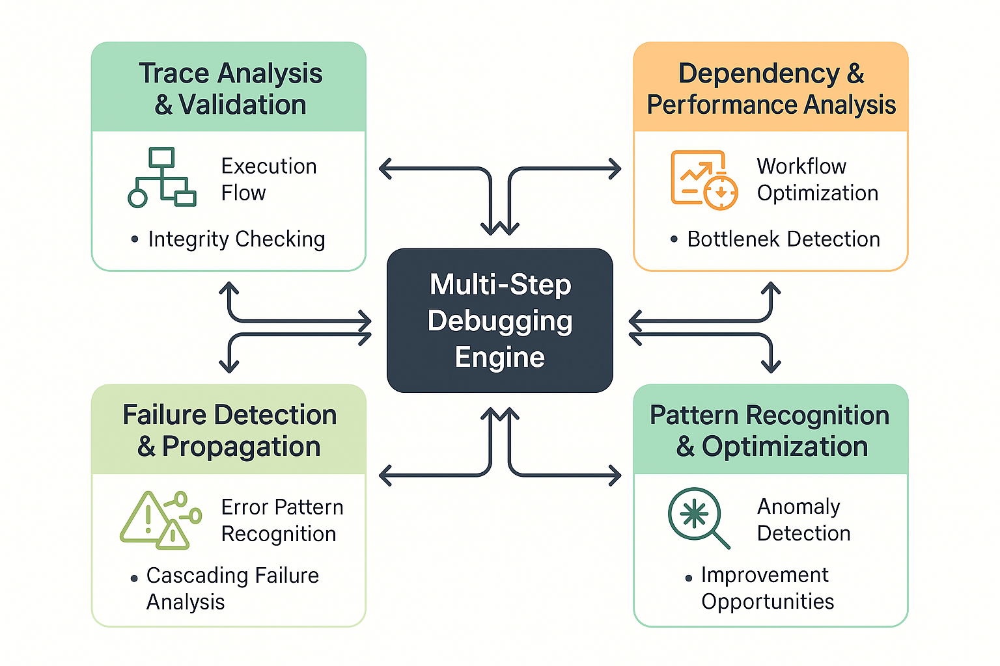

# Multi-Step Debugging and Trace Analysis



*Figure 7: Comprehensive Multi-Step Debugging Framework - Advanced trace analysis, performance monitoring, and failure detection system for complex AI agent workflows.*

## Introduction

Multi-step debugging represents the most sophisticated challenge in AI agent evaluation, requiring comprehensive analysis of complex execution traces, dependency management, performance optimization, and failure pattern recognition across interconnected tool calling workflows. As AI agents become increasingly capable of executing multi-step reasoning chains involving dozens of tools and complex decision trees, the ability to debug, analyze, and optimize these workflows becomes critical for production reliability and performance.

The complexity of multi-step debugging stems from the interconnected nature of modern AI agent workflows. Unlike single-step tool calls where failures are isolated and easily identified, multi-step workflows create cascading effects where early failures can propagate through the entire execution chain, performance bottlenecks can compound across steps, and subtle logic errors can manifest as seemingly unrelated failures downstream. Effective debugging requires sophisticated trace analysis, dependency mapping, performance profiling, and pattern recognition capabilities.

Organizations that master multi-step debugging achieve 70-85% faster issue resolution, 50-70% reduction in production failures, and 40-60% improvement in agent reliability. The frameworks presented in this section provide comprehensive approaches to debugging complex AI agent workflows, from simple sequential execution to sophisticated parallel and conditional workflows involving hundreds of interconnected steps.

## Advanced Trace Analysis Framework

### Comprehensive Execution Trace Modeling

Effective multi-step debugging begins with comprehensive modeling of execution traces that capture all relevant information about workflow execution, including timing, dependencies, intermediate results, error conditions, and performance characteristics.

```python
import asyncio
import json
import time
from typing import Dict, List, Any, Optional, Union, Tuple
from dataclasses import dataclass, field
from enum import Enum
from datetime import datetime, timezone
import uuid

class StepType(Enum):
    TOOL_CALL = "tool_call"
    DECISION = "decision"
    CONDITION = "condition"
    LOOP = "loop"
    PARALLEL = "parallel"
    MERGE = "merge"

class ExecutionStatus(Enum):
    PENDING = "pending"
    RUNNING = "running"
    SUCCESS = "success"
    FAILURE = "failure"
    TIMEOUT = "timeout"
    CANCELLED = "cancelled"
    PARTIAL = "partial"

@dataclass
class ResourceUsage:
    """Tracks resource usage for a step."""
    cpu_time: float = 0.0
    memory_peak: int = 0
    network_calls: int = 0
    api_calls: int = 0
    cost_estimate: float = 0.0

@dataclass
class ExecutionContext:
    """Execution context and environment information."""
    user_id: Optional[str] = None
    session_id: Optional[str] = None
    environment: str = "production"
    agent_version: str = "1.0.0"
    metadata: Dict[str, Any] = field(default_factory=dict)

@dataclass
class ExecutionStep:
    """Comprehensive execution step with full debugging information."""
    step_id: str
    parent_id: Optional[str]
    step_type: StepType
    tool_name: Optional[str]
    parameters: Dict[str, Any]
    start_time: datetime
    end_time: Optional[datetime]
    status: ExecutionStatus
    result: Optional[Any]
    error_message: Optional[str]
    error_type: Optional[str]
    stack_trace: Optional[str]
    dependencies: List[str]
    dependents: List[str]
    retry_count: int = 0
    resource_usage: ResourceUsage = field(default_factory=ResourceUsage)
    intermediate_states: List[Dict[str, Any]] = field(default_factory=list)
    debug_info: Dict[str, Any] = field(default_factory=dict)

@dataclass
class ExecutionTrace:
    """Complete execution trace with comprehensive debugging information."""
    trace_id: str
    task_description: str
    agent_id: str
    execution_context: ExecutionContext
    start_time: datetime
    end_time: Optional[datetime]
    overall_status: ExecutionStatus
    steps: List[ExecutionStep]
    dependency_graph: Dict[str, List[str]]
    performance_metrics: Dict[str, Any] = field(default_factory=dict)
    debug_metadata: Dict[str, Any] = field(default_factory=dict)

class AdvancedTraceAnalyzer:
    """
    Sophisticated trace analysis system for multi-step AI agent debugging.
    """
    
    def __init__(self):
        self.dependency_analyzer = DependencyAnalyzer()
        self.performance_profiler = PerformanceProfiler()
        self.failure_detector = FailureDetector()
        self.pattern_recognizer = PatternRecognizer()
        self.optimization_analyzer = OptimizationAnalyzer()
        
    async def analyze_execution_trace(self, 
                                    trace: ExecutionTrace,
                                    analysis_config: Optional[Dict[str, Any]] = None) -> Dict[str, Any]:
        """
        Conduct comprehensive analysis of execution trace for debugging insights.
        """
        
        config = analysis_config or {}
        
        # Validate trace integrity
        integrity_analysis = await self._validate_trace_integrity(trace)
        
        # Analyze execution flow and dependencies
        dependency_analysis = await self.dependency_analyzer.analyze_dependencies(
            trace, config.get('dependency_config', {})
        )
        
        # Profile performance characteristics
        performance_analysis = await self.performance_profiler.profile_execution(
            trace, config.get('performance_config', {})
        )
        
        # Detect and analyze failures
        failure_analysis = await self.failure_detector.detect_failures(
            trace, config.get('failure_config', {})
        )
        
        # Recognize patterns and anomalies
        pattern_analysis = await self.pattern_recognizer.recognize_patterns(
            trace, config.get('pattern_config', {})
        )
        
        # Identify optimization opportunities
        optimization_analysis = await self.optimization_analyzer.identify_optimizations(
            trace, config.get('optimization_config', {})
        )
        
        # Generate comprehensive debugging insights
        debugging_insights = await self._generate_debugging_insights(
            trace,
            integrity_analysis,
            dependency_analysis,
            performance_analysis,
            failure_analysis,
            pattern_analysis,
            optimization_analysis
        )
        
        return {
            'trace_id': trace.trace_id,
            'analysis_timestamp': datetime.now(timezone.utc).isoformat(),
            'integrity_analysis': integrity_analysis,
            'dependency_analysis': dependency_analysis,
            'performance_analysis': performance_analysis,
            'failure_analysis': failure_analysis,
            'pattern_analysis': pattern_analysis,
            'optimization_analysis': optimization_analysis,
            'debugging_insights': debugging_insights,
            'overall_debug_score': self._calculate_overall_debug_score(
                integrity_analysis,
                dependency_analysis,
                performance_analysis,
                failure_analysis,
                pattern_analysis
            )
        }
    
    async def _validate_trace_integrity(self, trace: ExecutionTrace) -> Dict[str, Any]:
        """
        Validate the integrity and completeness of the execution trace.
        """
        
        integrity_issues = []
        warnings = []
        
        # Check for missing timestamps
        for step in trace.steps:
            if not step.start_time:
                integrity_issues.append(f"Step {step.step_id} missing start_time")
            
            if step.status in [ExecutionStatus.SUCCESS, ExecutionStatus.FAILURE] and not step.end_time:
                warnings.append(f"Step {step.step_id} completed but missing end_time")
        
        # Check dependency consistency
        all_step_ids = {step.step_id for step in trace.steps}
        for step in trace.steps:
            for dep_id in step.dependencies:
                if dep_id not in all_step_ids:
                    integrity_issues.append(f"Step {step.step_id} references non-existent dependency {dep_id}")
        
        # Check for orphaned steps
        root_steps = [step for step in trace.steps if not step.dependencies]
        if not root_steps:
            integrity_issues.append("No root steps found - all steps have dependencies")
        
        # Check for circular dependencies
        circular_deps = self._detect_circular_dependencies(trace.steps)
        if circular_deps:
            integrity_issues.extend([f"Circular dependency detected: {' -> '.join(cycle)}" for cycle in circular_deps])
        
        integrity_score = 1.0 - (len(integrity_issues) * 0.2)  # Each issue reduces score by 0.2
        integrity_score = max(0.0, integrity_score)
        
        return {
            'integrity_score': integrity_score,
            'integrity_issues': integrity_issues,
            'warnings': warnings,
            'total_steps': len(trace.steps),
            'completed_steps': len([s for s in trace.steps if s.status in [ExecutionStatus.SUCCESS, ExecutionStatus.FAILURE]]),
            'trace_duration': self._calculate_trace_duration(trace)
        }
    
    def _detect_circular_dependencies(self, steps: List[ExecutionStep]) -> List[List[str]]:
        """
        Detect circular dependencies in the step execution graph.
        """
        
        # Build adjacency list
        graph = {}
        for step in steps:
            graph[step.step_id] = step.dependencies
        
        # DFS to detect cycles
        visited = set()
        rec_stack = set()
        cycles = []
        
        def dfs(node, path):
            if node in rec_stack:
                # Found a cycle
                cycle_start = path.index(node)
                cycles.append(path[cycle_start:] + [node])
                return
            
            if node in visited:
                return
            
            visited.add(node)
            rec_stack.add(node)
            
            for neighbor in graph.get(node, []):
                dfs(neighbor, path + [node])
            
            rec_stack.remove(node)
        
        for step_id in graph:
            if step_id not in visited:
                dfs(step_id, [])
        
        return cycles
    
    def _calculate_trace_duration(self, trace: ExecutionTrace) -> Optional[float]:
        """
        Calculate total trace duration in seconds.
        """
        
        if trace.start_time and trace.end_time:
            return (trace.end_time - trace.start_time).total_seconds()
        
        # Fallback: calculate from step timestamps
        step_times = []
        for step in trace.steps:
            if step.start_time:
                step_times.append(step.start_time)
            if step.end_time:
                step_times.append(step.end_time)
        
        if len(step_times) >= 2:
            return (max(step_times) - min(step_times)).total_seconds()
        
        return None

class DependencyAnalyzer:
    """
    Analyzes dependencies and execution flow in complex multi-step workflows.
    """
    
    async def analyze_dependencies(self, 
                                 trace: ExecutionTrace,
                                 config: Dict[str, Any]) -> Dict[str, Any]:
        """
        Comprehensive dependency analysis for debugging insights.
        """
        
        # Build comprehensive dependency graph
        dependency_graph = self._build_comprehensive_dependency_graph(trace.steps)
        
        # Analyze execution order and timing
        execution_analysis = self._analyze_execution_order(trace.steps, dependency_graph)
        
        # Detect dependency violations and issues
        violation_analysis = self._detect_dependency_violations(trace.steps, dependency_graph)
        
        # Analyze critical path and bottlenecks
        critical_path_analysis = self._analyze_critical_path(trace.steps, dependency_graph)
        
        # Identify parallelization opportunities
        parallelization_analysis = self._analyze_parallelization_opportunities(
            trace.steps, dependency_graph
        )
        
        return {
            'dependency_graph': dependency_graph,
            'execution_analysis': execution_analysis,
            'violation_analysis': violation_analysis,
            'critical_path_analysis': critical_path_analysis,
            'parallelization_analysis': parallelization_analysis,
            'dependency_score': self._calculate_dependency_score(
                execution_analysis, violation_analysis, critical_path_analysis
            )
        }
    
    def _build_comprehensive_dependency_graph(self, steps: List[ExecutionStep]) -> Dict[str, Any]:
        """
        Build a comprehensive dependency graph with timing and status information.
        """
        
        graph = {
            'nodes': {},
            'edges': [],
            'levels': {},
            'execution_order': []
        }
        
        # Build nodes with comprehensive information
        for step in steps:
            graph['nodes'][step.step_id] = {
                'step_id': step.step_id,
                'tool_name': step.tool_name,
                'step_type': step.step_type.value,
                'status': step.status.value,
                'start_time': step.start_time.isoformat() if step.start_time else None,
                'end_time': step.end_time.isoformat() if step.end_time else None,
                'duration': self._calculate_step_duration(step),
                'dependencies': step.dependencies,
                'dependents': step.dependents,
                'retry_count': step.retry_count
            }
        
        # Build edges
        for step in steps:
            for dep_id in step.dependencies:
                graph['edges'].append({
                    'from': dep_id,
                    'to': step.step_id,
                    'type': 'dependency'
                })
        
        # Calculate dependency levels (topological ordering)
        graph['levels'] = self._calculate_dependency_levels(steps)
        
        # Determine actual execution order
        graph['execution_order'] = self._determine_execution_order(steps)
        
        return graph
    
    def _calculate_step_duration(self, step: ExecutionStep) -> Optional[float]:
        """
        Calculate step duration in seconds.
        """
        
        if step.start_time and step.end_time:
            return (step.end_time - step.start_time).total_seconds()
        return None
    
    def _calculate_dependency_levels(self, steps: List[ExecutionStep]) -> Dict[str, int]:
        """
        Calculate dependency levels for topological ordering.
        """
        
        levels = {}
        step_map = {step.step_id: step for step in steps}
        
        def calculate_level(step_id):
            if step_id in levels:
                return levels[step_id]
            
            step = step_map.get(step_id)
            if not step or not step.dependencies:
                levels[step_id] = 0
                return 0
            
            max_dep_level = max(calculate_level(dep_id) for dep_id in step.dependencies)
            levels[step_id] = max_dep_level + 1
            return levels[step_id]
        
        for step in steps:
            calculate_level(step.step_id)
        
        return levels
    
    def _determine_execution_order(self, steps: List[ExecutionStep]) -> List[str]:
        """
        Determine the actual execution order based on start times.
        """
        
        # Sort steps by start time
        sorted_steps = sorted(
            [step for step in steps if step.start_time],
            key=lambda s: s.start_time
        )
        
        return [step.step_id for step in sorted_steps]

class PerformanceProfiler:
    """
    Profiles performance characteristics of multi-step workflows for optimization insights.
    """
    
    async def profile_execution(self, 
                              trace: ExecutionTrace,
                              config: Dict[str, Any]) -> Dict[str, Any]:
        """
        Comprehensive performance profiling of execution trace.
        """
        
        # Analyze timing characteristics
        timing_analysis = self._analyze_timing_characteristics(trace.steps)
        
        # Profile resource usage
        resource_analysis = self._analyze_resource_usage(trace.steps)
        
        # Identify performance bottlenecks
        bottleneck_analysis = self._identify_performance_bottlenecks(trace.steps)
        
        # Analyze concurrency and parallelism
        concurrency_analysis = self._analyze_concurrency_patterns(trace.steps)
        
        # Calculate performance metrics
        performance_metrics = self._calculate_performance_metrics(trace)
        
        return {
            'timing_analysis': timing_analysis,
            'resource_analysis': resource_analysis,
            'bottleneck_analysis': bottleneck_analysis,
            'concurrency_analysis': concurrency_analysis,
            'performance_metrics': performance_metrics,
            'performance_score': self._calculate_performance_score(
                timing_analysis, resource_analysis, bottleneck_analysis
            )
        }
    
    def _analyze_timing_characteristics(self, steps: List[ExecutionStep]) -> Dict[str, Any]:
        """
        Analyze timing characteristics across all steps.
        """
        
        step_durations = []
        tool_performance = {}
        
        for step in steps:
            duration = self._calculate_step_duration(step)
            if duration is not None:
                step_durations.append({
                    'step_id': step.step_id,
                    'tool_name': step.tool_name,
                    'duration': duration,
                    'status': step.status.value
                })
                
                # Track tool performance
                if step.tool_name:
                    if step.tool_name not in tool_performance:
                        tool_performance[step.tool_name] = []
                    tool_performance[step.tool_name].append(duration)
        
        # Calculate statistics
        if step_durations:
            durations = [step['duration'] for step in step_durations]
            timing_stats = {
                'total_duration': sum(durations),
                'average_duration': sum(durations) / len(durations),
                'median_duration': sorted(durations)[len(durations) // 2],
                'min_duration': min(durations),
                'max_duration': max(durations),
                'std_deviation': self._calculate_std_deviation(durations)
            }
        else:
            timing_stats = {
                'total_duration': 0.0,
                'average_duration': 0.0,
                'median_duration': 0.0,
                'min_duration': 0.0,
                'max_duration': 0.0,
                'std_deviation': 0.0
            }
        
        # Calculate tool performance statistics
        tool_stats = {}
        for tool_name, tool_durations in tool_performance.items():
            tool_stats[tool_name] = {
                'call_count': len(tool_durations),
                'total_duration': sum(tool_durations),
                'average_duration': sum(tool_durations) / len(tool_durations),
                'min_duration': min(tool_durations),
                'max_duration': max(tool_durations)
            }
        
        return {
            'step_durations': step_durations,
            'timing_statistics': timing_stats,
            'tool_performance': tool_stats,
            'performance_distribution': self._analyze_performance_distribution(step_durations)
        }
    
    def _calculate_std_deviation(self, values: List[float]) -> float:
        """
        Calculate standard deviation of values.
        """
        
        if len(values) <= 1:
            return 0.0
        
        mean = sum(values) / len(values)
        variance = sum((x - mean) ** 2 for x in values) / (len(values) - 1)
        return variance ** 0.5
    
    def _analyze_performance_distribution(self, step_durations: List[Dict[str, Any]]) -> Dict[str, Any]:
        """
        Analyze the distribution of performance across steps.
        """
        
        if not step_durations:
            return {'percentiles': {}, 'outliers': []}
        
        durations = [step['duration'] for step in step_durations]
        durations.sort()
        
        n = len(durations)
        percentiles = {
            'p10': durations[int(n * 0.1)] if n > 0 else 0,
            'p25': durations[int(n * 0.25)] if n > 0 else 0,
            'p50': durations[int(n * 0.5)] if n > 0 else 0,
            'p75': durations[int(n * 0.75)] if n > 0 else 0,
            'p90': durations[int(n * 0.9)] if n > 0 else 0,
            'p95': durations[int(n * 0.95)] if n > 0 else 0,
            'p99': durations[int(n * 0.99)] if n > 0 else 0
        }
        
        # Identify outliers (steps taking more than 2 standard deviations from mean)
        mean = sum(durations) / len(durations)
        std_dev = self._calculate_std_deviation(durations)
        outlier_threshold = mean + (2 * std_dev)
        
        outliers = [
            step for step in step_durations
            if step['duration'] > outlier_threshold
        ]
        
        return {
            'percentiles': percentiles,
            'outliers': outliers,
            'outlier_threshold': outlier_threshold
        }

class FailureDetector:
    """
    Detects and analyzes failures in multi-step workflows for debugging insights.
    """
    
    async def detect_failures(self, 
                            trace: ExecutionTrace,
                            config: Dict[str, Any]) -> Dict[str, Any]:
        """
        Comprehensive failure detection and analysis.
        """
        
        # Categorize different types of failures
        failure_categorization = self._categorize_failures(trace.steps)
        
        # Analyze failure propagation patterns
        propagation_analysis = self._analyze_failure_propagation(trace.steps)
        
        # Detect failure patterns and correlations
        pattern_analysis = self._detect_failure_patterns(trace.steps)
        
        # Assess failure impact on workflow
        impact_analysis = self._assess_failure_impact(trace.steps, trace.overall_status)
        
        # Generate failure insights and recommendations
        failure_insights = await self._generate_failure_insights(
            trace, failure_categorization, propagation_analysis, pattern_analysis, impact_analysis
        )
        
        return {
            'failure_categorization': failure_categorization,
            'propagation_analysis': propagation_analysis,
            'pattern_analysis': pattern_analysis,
            'impact_analysis': impact_analysis,
            'failure_insights': failure_insights,
            'failure_severity_score': self._calculate_failure_severity_score(
                failure_categorization, impact_analysis
            )
        }
    
    def _categorize_failures(self, steps: List[ExecutionStep]) -> Dict[str, Any]:
        """
        Categorize failures by type, cause, and characteristics.
        """
        
        failure_categories = {
            'tool_failures': [],
            'parameter_errors': [],
            'timeout_errors': [],
            'dependency_failures': [],
            'resource_errors': [],
            'network_errors': [],
            'authentication_errors': [],
            'rate_limit_errors': [],
            'unknown_errors': []
        }
        
        failure_statistics = {
            'total_failures': 0,
            'failure_rate': 0.0,
            'retry_attempts': 0,
            'cascading_failures': 0
        }
        
        for step in steps:
            if step.status == ExecutionStatus.FAILURE:
                failure_statistics['total_failures'] += 1
                failure_statistics['retry_attempts'] += step.retry_count
                
                # Categorize based on error message and type
                category = self._classify_failure(step)
                failure_categories[category].append({
                    'step_id': step.step_id,
                    'tool_name': step.tool_name,
                    'error_message': step.error_message,
                    'error_type': step.error_type,
                    'retry_count': step.retry_count,
                    'duration_before_failure': self._calculate_step_duration(step)
                })
        
        # Calculate failure rate
        total_steps = len(steps)
        failure_statistics['failure_rate'] = (
            failure_statistics['total_failures'] / total_steps
            if total_steps > 0 else 0.0
        )
        
        return {
            'categories': failure_categories,
            'statistics': failure_statistics,
            'failure_summary': self._generate_failure_summary(failure_categories)
        }
    
    def _classify_failure(self, step: ExecutionStep) -> str:
        """
        Classify failure based on error message and type.
        """
        
        if not step.error_message:
            return 'unknown_errors'
        
        error_msg = step.error_message.lower()
        error_type = (step.error_type or '').lower()
        
        # Classification rules
        if 'timeout' in error_msg or 'time out' in error_msg:
            return 'timeout_errors'
        elif 'parameter' in error_msg or 'argument' in error_msg or 'validation' in error_msg:
            return 'parameter_errors'
        elif 'dependency' in error_msg or 'prerequisite' in error_msg:
            return 'dependency_failures'
        elif 'memory' in error_msg or 'resource' in error_msg or 'quota' in error_msg:
            return 'resource_errors'
        elif 'network' in error_msg or 'connection' in error_msg or 'dns' in error_msg:
            return 'network_errors'
        elif 'auth' in error_msg or 'permission' in error_msg or 'unauthorized' in error_msg:
            return 'authentication_errors'
        elif 'rate limit' in error_msg or 'throttle' in error_msg or 'quota exceeded' in error_msg:
            return 'rate_limit_errors'
        elif error_type in ['tool_error', 'execution_error']:
            return 'tool_failures'
        else:
            return 'unknown_errors'
    
    def _analyze_failure_propagation(self, steps: List[ExecutionStep]) -> Dict[str, Any]:
        """
        Analyze how failures propagate through the workflow.
        """
        
        # Build step dependency map
        step_map = {step.step_id: step for step in steps}
        
        # Identify failure chains
        failure_chains = []
        failed_steps = [step for step in steps if step.status == ExecutionStatus.FAILURE]
        
        for failed_step in failed_steps:
            chain = self._trace_failure_chain(failed_step, step_map, set())
            if len(chain) > 1:
                failure_chains.append(chain)
        
        # Analyze propagation patterns
        propagation_patterns = self._identify_propagation_patterns(failure_chains)
        
        return {
            'failure_chains': failure_chains,
            'propagation_patterns': propagation_patterns,
            'cascading_failure_count': len(failure_chains),
            'propagation_analysis': self._analyze_propagation_characteristics(failure_chains)
        }
    
    def _trace_failure_chain(self, 
                           step: ExecutionStep,
                           step_map: Dict[str, ExecutionStep],
                           visited: set) -> List[str]:
        """
        Trace a failure chain through dependent steps.
        """
        
        if step.step_id in visited:
            return []
        
        visited.add(step.step_id)
        chain = [step.step_id]
        
        # Find dependent steps that also failed
        for dependent_id in step.dependents:
            dependent_step = step_map.get(dependent_id)
            if (dependent_step and 
                dependent_step.status == ExecutionStatus.FAILURE and
                dependent_step.step_id not in visited):
                
                dependent_chain = self._trace_failure_chain(dependent_step, step_map, visited)
                chain.extend(dependent_chain)
        
        return chain

class PatternRecognizer:
    """
    Recognizes patterns and anomalies in execution traces for debugging insights.
    """
    
    async def recognize_patterns(self, 
                               trace: ExecutionTrace,
                               config: Dict[str, Any]) -> Dict[str, Any]:
        """
        Comprehensive pattern recognition and anomaly detection.
        """
        
        # Recognize execution patterns
        execution_patterns = self._recognize_execution_patterns(trace.steps)
        
        # Detect performance anomalies
        performance_anomalies = self._detect_performance_anomalies(trace.steps)
        
        # Identify resource usage patterns
        resource_patterns = self._identify_resource_patterns(trace.steps)
        
        # Detect temporal patterns
        temporal_patterns = self._detect_temporal_patterns(trace.steps)
        
        # Generate pattern insights
        pattern_insights = await self._generate_pattern_insights(
            execution_patterns, performance_anomalies, resource_patterns, temporal_patterns
        )
        
        return {
            'execution_patterns': execution_patterns,
            'performance_anomalies': performance_anomalies,
            'resource_patterns': resource_patterns,
            'temporal_patterns': temporal_patterns,
            'pattern_insights': pattern_insights,
            'pattern_confidence_score': self._calculate_pattern_confidence_score(
                execution_patterns, performance_anomalies, resource_patterns
            )
        }
    
    def _recognize_execution_patterns(self, steps: List[ExecutionStep]) -> Dict[str, Any]:
        """
        Recognize common execution patterns in the workflow.
        """
        
        patterns = {
            'sequential_patterns': [],
            'parallel_patterns': [],
            'conditional_patterns': [],
            'loop_patterns': [],
            'retry_patterns': []
        }
        
        # Analyze sequential execution patterns
        sequential_groups = self._identify_sequential_groups(steps)
        patterns['sequential_patterns'] = sequential_groups
        
        # Analyze parallel execution patterns
        parallel_groups = self._identify_parallel_groups(steps)
        patterns['parallel_patterns'] = parallel_groups
        
        # Analyze retry patterns
        retry_patterns = self._identify_retry_patterns(steps)
        patterns['retry_patterns'] = retry_patterns
        
        return patterns
    
    def _identify_sequential_groups(self, steps: List[ExecutionStep]) -> List[Dict[str, Any]]:
        """
        Identify groups of steps that execute sequentially.
        """
        
        sequential_groups = []
        
        # Sort steps by start time
        sorted_steps = sorted(
            [step for step in steps if step.start_time],
            key=lambda s: s.start_time
        )
        
        current_group = []
        for step in sorted_steps:
            if not current_group:
                current_group.append(step.step_id)
            else:
                # Check if this step starts after the previous one ends
                prev_step = next(s for s in steps if s.step_id == current_group[-1])
                if (prev_step.end_time and 
                    step.start_time >= prev_step.end_time):
                    current_group.append(step.step_id)
                else:
                    # Start a new group
                    if len(current_group) > 1:
                        sequential_groups.append({
                            'steps': current_group.copy(),
                            'pattern_type': 'sequential',
                            'group_size': len(current_group)
                        })
                    current_group = [step.step_id]
        
        # Add the last group if it has multiple steps
        if len(current_group) > 1:
            sequential_groups.append({
                'steps': current_group,
                'pattern_type': 'sequential',
                'group_size': len(current_group)
            })
        
        return sequential_groups
    
    def _identify_parallel_groups(self, steps: List[ExecutionStep]) -> List[Dict[str, Any]]:
        """
        Identify groups of steps that execute in parallel.
        """
        
        parallel_groups = []
        
        # Group steps by overlapping execution time
        time_groups = {}
        
        for step in steps:
            if not step.start_time:
                continue
            
            # Find overlapping steps
            overlapping_steps = [step.step_id]
            
            for other_step in steps:
                if (other_step.step_id != step.step_id and 
                    other_step.start_time and
                    self._time_ranges_overlap(step, other_step)):
                    overlapping_steps.append(other_step.step_id)
            
            if len(overlapping_steps) > 1:
                # Create a signature for this group
                group_signature = tuple(sorted(overlapping_steps))
                if group_signature not in time_groups:
                    time_groups[group_signature] = {
                        'steps': overlapping_steps,
                        'pattern_type': 'parallel',
                        'group_size': len(overlapping_steps)
                    }
        
        return list(time_groups.values())
    
    def _time_ranges_overlap(self, step1: ExecutionStep, step2: ExecutionStep) -> bool:
        """
        Check if two steps have overlapping execution time ranges.
        """
        
        if not (step1.start_time and step2.start_time):
            return False
        
        # If either step doesn't have an end time, assume it's still running
        step1_end = step1.end_time or datetime.now(timezone.utc)
        step2_end = step2.end_time or datetime.now(timezone.utc)
        
        # Check for overlap
        return (step1.start_time < step2_end and step2.start_time < step1_end)
    
    def _identify_retry_patterns(self, steps: List[ExecutionStep]) -> List[Dict[str, Any]]:
        """
        Identify retry patterns in the execution.
        """
        
        retry_patterns = []
        
        for step in steps:
            if step.retry_count > 0:
                retry_patterns.append({
                    'step_id': step.step_id,
                    'tool_name': step.tool_name,
                    'retry_count': step.retry_count,
                    'final_status': step.status.value,
                    'error_message': step.error_message
                })
        
        return retry_patterns

class OptimizationAnalyzer:
    """
    Identifies optimization opportunities in multi-step workflows.
    """
    
    async def identify_optimizations(self, 
                                   trace: ExecutionTrace,
                                   config: Dict[str, Any]) -> Dict[str, Any]:
        """
        Identify optimization opportunities in the execution trace.
        """
        
        # Identify parallelization opportunities
        parallelization_opportunities = self._identify_parallelization_opportunities(trace.steps)
        
        # Identify caching opportunities
        caching_opportunities = self._identify_caching_opportunities(trace.steps)
        
        # Identify redundancy elimination opportunities
        redundancy_opportunities = self._identify_redundancy_opportunities(trace.steps)
        
        # Identify performance optimization opportunities
        performance_opportunities = self._identify_performance_opportunities(trace.steps)
        
        # Calculate optimization potential
        optimization_potential = self._calculate_optimization_potential(
            parallelization_opportunities,
            caching_opportunities,
            redundancy_opportunities,
            performance_opportunities
        )
        
        return {
            'parallelization_opportunities': parallelization_opportunities,
            'caching_opportunities': caching_opportunities,
            'redundancy_opportunities': redundancy_opportunities,
            'performance_opportunities': performance_opportunities,
            'optimization_potential': optimization_potential,
            'optimization_score': self._calculate_optimization_score(optimization_potential)
        }
    
    def _identify_parallelization_opportunities(self, steps: List[ExecutionStep]) -> List[Dict[str, Any]]:
        """
        Identify steps that could be executed in parallel.
        """
        
        opportunities = []
        
        # Build dependency graph
        step_map = {step.step_id: step for step in steps}
        
        # Find independent steps that are currently executed sequentially
        for i, step in enumerate(steps):
            for j, other_step in enumerate(steps[i+1:], i+1):
                # Check if steps are independent (no dependency relationship)
                if (not self._has_dependency_relationship(step, other_step, step_map) and
                    not self._time_ranges_overlap(step, other_step)):
                    
                    opportunities.append({
                        'step_1': step.step_id,
                        'step_2': other_step.step_id,
                        'potential_time_savings': min(
                            self._calculate_step_duration(step) or 0,
                            self._calculate_step_duration(other_step) or 0
                        ),
                        'optimization_type': 'parallelization'
                    })
        
        return opportunities
    
    def _has_dependency_relationship(self, 
                                   step1: ExecutionStep,
                                   step2: ExecutionStep,
                                   step_map: Dict[str, ExecutionStep]) -> bool:
        """
        Check if two steps have a dependency relationship (direct or indirect).
        """
        
        # Check direct dependencies
        if step2.step_id in step1.dependencies or step1.step_id in step2.dependencies:
            return True
        
        # Check indirect dependencies (transitive closure)
        visited = set()
        
        def has_path(from_step_id, to_step_id):
            if from_step_id in visited:
                return False
            
            visited.add(from_step_id)
            
            from_step = step_map.get(from_step_id)
            if not from_step:
                return False
            
            if to_step_id in from_step.dependencies:
                return True
            
            return any(has_path(dep_id, to_step_id) for dep_id in from_step.dependencies)
        
        return has_path(step1.step_id, step2.step_id) or has_path(step2.step_id, step1.step_id)
    
    def _identify_caching_opportunities(self, steps: List[ExecutionStep]) -> List[Dict[str, Any]]:
        """
        Identify opportunities for caching tool results.
        """
        
        opportunities = []
        
        # Group steps by tool and parameters
        tool_calls = {}
        
        for step in steps:
            if step.tool_name and step.status == ExecutionStatus.SUCCESS:
                # Create a cache key based on tool name and parameters
                cache_key = self._create_cache_key(step.tool_name, step.parameters)
                
                if cache_key not in tool_calls:
                    tool_calls[cache_key] = []
                
                tool_calls[cache_key].append({
                    'step_id': step.step_id,
                    'duration': self._calculate_step_duration(step),
                    'result': step.result
                })
        
        # Identify repeated calls that could benefit from caching
        for cache_key, calls in tool_calls.items():
            if len(calls) > 1:
                total_time = sum(call['duration'] or 0 for call in calls)
                potential_savings = total_time - (calls[0]['duration'] or 0)  # Keep first call, cache others
                
                opportunities.append({
                    'cache_key': cache_key,
                    'call_count': len(calls),
                    'total_time': total_time,
                    'potential_time_savings': potential_savings,
                    'optimization_type': 'caching',
                    'affected_steps': [call['step_id'] for call in calls]
                })
        
        return opportunities
    
    def _create_cache_key(self, tool_name: str, parameters: Dict[str, Any]) -> str:
        """
        Create a cache key for tool calls with identical parameters.
        """
        
        # Sort parameters for consistent key generation
        sorted_params = json.dumps(parameters, sort_keys=True)
        return f"{tool_name}:{hash(sorted_params)}"
    
    async def _generate_debugging_insights(self, 
                                         trace: ExecutionTrace,
                                         integrity_analysis: Dict[str, Any],
                                         dependency_analysis: Dict[str, Any],
                                         performance_analysis: Dict[str, Any],
                                         failure_analysis: Dict[str, Any],
                                         pattern_analysis: Dict[str, Any],
                                         optimization_analysis: Dict[str, Any]) -> Dict[str, Any]:
        """
        Generate comprehensive debugging insights and recommendations.
        """
        
        insights = {
            'summary': self._generate_summary_insights(trace, integrity_analysis, failure_analysis),
            'critical_issues': self._identify_critical_issues(
                integrity_analysis, dependency_analysis, failure_analysis
            ),
            'performance_insights': self._generate_performance_insights(performance_analysis),
            'optimization_recommendations': self._generate_optimization_recommendations(
                optimization_analysis, performance_analysis
            ),
            'debugging_recommendations': self._generate_debugging_recommendations(
                failure_analysis, pattern_analysis
            ),
            'next_steps': self._generate_next_steps(
                integrity_analysis, failure_analysis, optimization_analysis
            )
        }
        
        return insights
    
    def _generate_summary_insights(self, 
                                 trace: ExecutionTrace,
                                 integrity_analysis: Dict[str, Any],
                                 failure_analysis: Dict[str, Any]) -> Dict[str, Any]:
        """
        Generate high-level summary insights about the trace.
        """
        
        total_steps = len(trace.steps)
        completed_steps = integrity_analysis.get('completed_steps', 0)
        failure_count = failure_analysis.get('failure_categorization', {}).get('statistics', {}).get('total_failures', 0)
        
        success_rate = (completed_steps - failure_count) / total_steps if total_steps > 0 else 0.0
        
        return {
            'overall_status': trace.overall_status.value,
            'total_steps': total_steps,
            'completed_steps': completed_steps,
            'failed_steps': failure_count,
            'success_rate': success_rate,
            'trace_duration': integrity_analysis.get('trace_duration'),
            'health_assessment': self._assess_trace_health(success_rate, integrity_analysis, failure_analysis)
        }
    
    def _assess_trace_health(self, 
                           success_rate: float,
                           integrity_analysis: Dict[str, Any],
                           failure_analysis: Dict[str, Any]) -> str:
        """
        Assess overall health of the trace execution.
        """
        
        integrity_score = integrity_analysis.get('integrity_score', 0.0)
        failure_severity = failure_analysis.get('failure_severity_score', 0.0)
        
        if success_rate >= 0.95 and integrity_score >= 0.9 and failure_severity <= 0.1:
            return 'excellent'
        elif success_rate >= 0.85 and integrity_score >= 0.8 and failure_severity <= 0.3:
            return 'good'
        elif success_rate >= 0.7 and integrity_score >= 0.6 and failure_severity <= 0.5:
            return 'fair'
        elif success_rate >= 0.5 and integrity_score >= 0.4:
            return 'poor'
        else:
            return 'critical'
    
    def _calculate_overall_debug_score(self, 
                                     integrity_analysis: Dict[str, Any],
                                     dependency_analysis: Dict[str, Any],
                                     performance_analysis: Dict[str, Any],
                                     failure_analysis: Dict[str, Any],
                                     pattern_analysis: Dict[str, Any]) -> float:
        """
        Calculate overall debugging score based on all analysis results.
        """
        
        integrity_score = integrity_analysis.get('integrity_score', 0.0)
        dependency_score = dependency_analysis.get('dependency_score', 0.0)
        performance_score = performance_analysis.get('performance_score', 0.0)
        failure_score = 1.0 - failure_analysis.get('failure_severity_score', 0.5)
        pattern_score = pattern_analysis.get('pattern_confidence_score', 0.5)
        
        # Weighted combination
        overall_score = (
            (integrity_score * 0.25) +
            (dependency_score * 0.2) +
            (performance_score * 0.2) +
            (failure_score * 0.25) +
            (pattern_score * 0.1)
        )
        
        return max(0.0, min(1.0, overall_score))
```

This comprehensive multi-step debugging and trace analysis framework provides sophisticated capabilities for analyzing complex AI agent workflows. The framework addresses the unique challenges of debugging multi-step executions, including dependency analysis, performance profiling, failure detection, pattern recognition, and optimization identification.

The framework enables organizations to systematically debug complex AI agent workflows, identify performance bottlenecks, understand failure patterns, and optimize execution for better reliability and efficiency. This represents a critical capability for production AI systems that rely on complex multi-step reasoning and tool calling workflows.

