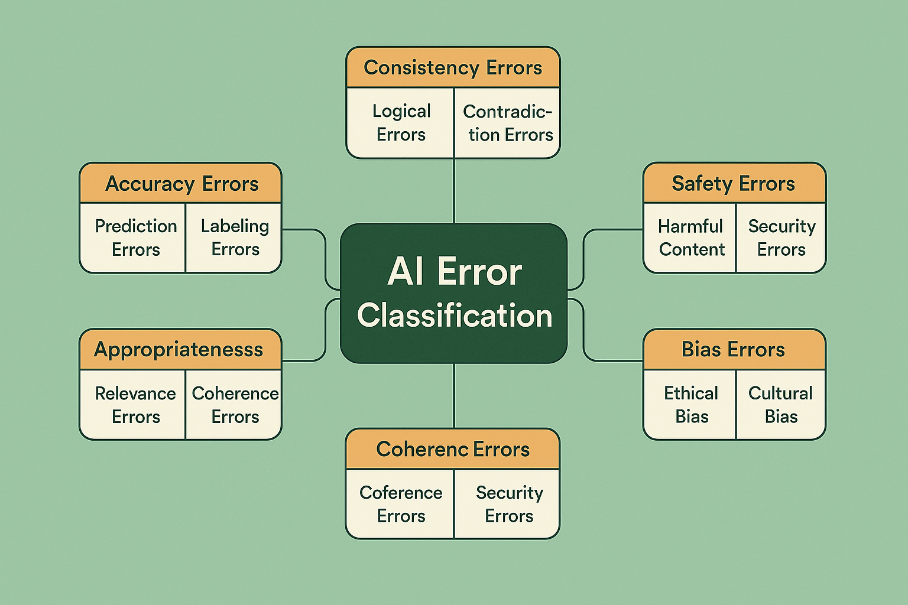
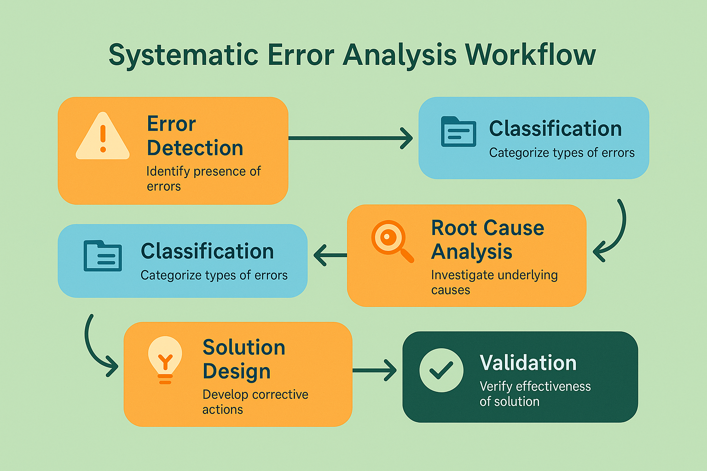

# Module 2: Systematic Error Analysis

## Overview

Systematic error analysis represents the cornerstone of building reliable AI systems. While Module 1 introduced the fundamental concepts of AI evaluation, this module dives deep into the methodologies, frameworks, and practical techniques for identifying, categorizing, and addressing errors in AI systems at scale.

The transition from ad-hoc debugging to systematic error analysis marks a critical evolution in AI system development. Organizations that master these techniques build more reliable systems, reduce operational costs, and deliver superior user experiences. This module provides the comprehensive framework and practical tools needed to implement world-class error analysis processes.

## Learning Objectives

By completing this module, you will:

- **Master Error Classification**: Understand the comprehensive taxonomy of AI system errors and how to categorize them systematically
- **Implement Analysis Workflows**: Build robust processes for detecting, analyzing, and resolving errors at scale
- **Apply Root Cause Analysis**: Use proven methodologies to identify underlying causes of AI system failures
- **Design Monitoring Systems**: Create automated systems for continuous error detection and analysis
- **Build Improvement Cycles**: Establish feedback loops that turn error analysis into systematic improvements

## Module Structure

### Core Concepts
1. **[Error Classification and Taxonomy](01-error-classification-taxonomy.md)** - Comprehensive framework for categorizing AI system errors
2. **[Detection and Monitoring Systems](02-detection-monitoring-systems.md)** - Automated systems for continuous error detection
3. **[Root Cause Analysis Methodologies](03-root-cause-analysis.md)** - Systematic approaches to identifying underlying causes
4. **[Statistical Analysis Techniques](04-statistical-analysis-techniques.md)** - Quantitative methods for error pattern analysis
5. **[Continuous Improvement Frameworks](05-continuous-improvement-frameworks.md)** - Systematic processes for ongoing enhancement
6. **[Qualitative Research Methodologies](06-qualitative-research-methodologies.md)** - Open coding, axial coding, and thematic analysis for deep insights
7. **[Multi-Step Debugging](07-multi-step-debugging.md)** - Systematic approaches to debugging complex AI systems

### Practical Components
- **[Exercises](exercises/)** - Hands-on implementation of error analysis techniques
- **[Case Studies](case-studies/)** - Real-world applications and outcomes
- **[Templates](templates/)** - Ready-to-use frameworks and assessment tools

## Visual Learning Framework

This module integrates comprehensive visual elements to enhance understanding:

- **Process Diagrams**: Clear workflows showing step-by-step analysis procedures
- **Classification Frameworks**: Visual taxonomies for organizing and understanding error types
- **Statistical Visualizations**: Charts and graphs demonstrating analysis techniques
- **Case Study Illustrations**: Real-world examples with visual breakdowns
- **Tool Interfaces**: Screenshots and mockups of analysis dashboards and systems

## Prerequisites

- Completion of Module 1: Fundamentals of AI Evaluation
- Basic understanding of statistical concepts
- Familiarity with Python programming
- Experience with AI/ML system development

## Tools and Technologies

This module includes hands-on experience with:

- **Error Analysis Frameworks**: Custom Python libraries for systematic analysis
- **Statistical Analysis Tools**: Pandas, NumPy, SciPy for quantitative analysis
- **Visualization Libraries**: Matplotlib, Seaborn, Plotly for data visualization
- **Monitoring Systems**: Prometheus, Grafana for real-time error tracking
- **Database Systems**: SQLite, PostgreSQL for error data storage

## Real-World Applications

The techniques in this module apply directly to:

- **Production AI Systems**: Large-scale deployment error analysis
- **Quality Assurance**: Systematic testing and validation processes
- **Incident Response**: Rapid diagnosis and resolution of AI system failures
- **Performance Optimization**: Data-driven improvement of AI system reliability
- **Risk Management**: Proactive identification and mitigation of potential failures

## Success Metrics

Your mastery of this module will be demonstrated through:

- **Classification Accuracy**: Ability to correctly categorize different types of AI errors
- **Analysis Speed**: Efficiency in diagnosing and understanding error patterns
- **Solution Effectiveness**: Success in implementing fixes that address root causes
- **System Reliability**: Measurable improvements in AI system performance and stability
- **Process Maturity**: Development of repeatable, scalable error analysis workflows

## Getting Started

Begin with Section 1 to establish a solid foundation in error classification, then progress through each section sequentially. Each section builds on previous concepts while introducing new analytical techniques and tools.

The module emphasizes hands-on learning with practical exercises, real-world case studies, and working code examples that you can adapt to your specific AI systems and organizational needs.

---

**Ready to begin?** → [Section 1: Error Classification and Taxonomy](01-error-classification-taxonomy.md)

