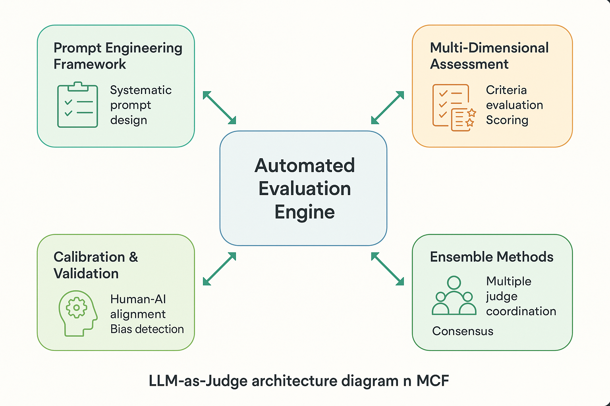

# LLM-as-Judge Implementation: Advanced Frameworks and Techniques



*Figure 7: Comprehensive LLM-as-Judge architecture showing the systematic approach to automated evaluation with validation, calibration, and continuous improvement mechanisms*

## Introduction

LLM-as-Judge represents one of the most powerful and scalable approaches to AI evaluation, enabling automated assessment of AI system outputs at unprecedented scale and sophistication. This section provides comprehensive implementation guidance for building robust, reliable, and effective LLM-as-Judge systems that can serve as the backbone of systematic error analysis.

The evolution from manual evaluation to LLM-as-Judge systems marks a critical advancement in AI evaluation capabilities. When properly implemented, these systems can provide consistent, scalable, and nuanced evaluation that rivals human judgment while enabling continuous monitoring and improvement of AI systems.

## Core LLM-as-Judge Principles

### Systematic Prompt Engineering for Evaluation

The foundation of effective LLM-as-Judge systems lies in sophisticated prompt engineering that ensures consistent, accurate, and reliable evaluation:

```python
import json
import asyncio
from typing import Dict, List, Any, Optional, Tuple
from dataclasses import dataclass
from enum import Enum
import openai
from datetime import datetime
import numpy as np

class EvaluationDimension(Enum):
    """Standardized evaluation dimensions for LLM-as-Judge systems."""
    ACCURACY = "accuracy"
    RELEVANCE = "relevance"
    COHERENCE = "coherence"
    COMPLETENESS = "completeness"
    SAFETY = "safety"
    BIAS = "bias"
    HELPFULNESS = "helpfulness"
    CLARITY = "clarity"

@dataclass
class EvaluationCriteria:
    """Structured evaluation criteria for LLM-as-Judge systems."""
    dimension: EvaluationDimension
    description: str
    scale: Tuple[int, int]
    rubric: Dict[int, str]
    examples: List[Dict[str, Any]]
    weight: float = 1.0

class AdvancedPromptEngineer:
    """
    Advanced prompt engineering for LLM-as-Judge systems.
    Implements systematic approaches to prompt design and optimization.
    """
    
    def __init__(self):
        self.prompt_templates = {}
        self.evaluation_frameworks = {}
        self.calibration_data = {}
        
    def design_evaluation_prompt(self, criteria: List[EvaluationCriteria],
                                task_context: Dict[str, Any],
                                output_format: str = "structured") -> str:
        """
        Design comprehensive evaluation prompt for LLM-as-Judge.
        
        Args:
            criteria: List of evaluation criteria to assess
            task_context: Context about the task being evaluated
            output_format: Format for evaluation output
            
        Returns:
            Optimized evaluation prompt
        """
        prompt_components = {
            'role_definition': self._create_role_definition(task_context),
            'task_description': self._create_task_description(task_context),
            'evaluation_criteria': self._format_evaluation_criteria(criteria),
            'examples': self._select_calibration_examples(criteria, task_context),
            'output_format': self._define_output_format(output_format, criteria),
            'quality_guidelines': self._create_quality_guidelines(criteria)
        }
        
        prompt = self._assemble_prompt(prompt_components)
        return prompt
    
    def _create_role_definition(self, context: Dict[str, Any]) -> str:
        """Create clear role definition for the LLM judge."""
        domain = context.get('domain', 'general')
        expertise_level = context.get('expertise_level', 'expert')
        
        role_definition = f"""You are an expert {domain} evaluator with {expertise_level}-level knowledge and experience. Your role is to provide objective, consistent, and detailed evaluations of AI system outputs based on specific criteria.

Your evaluation approach should be:
- Systematic and methodical
- Based on evidence from the content
- Consistent across similar cases
- Detailed in reasoning and justification
- Aligned with established quality standards

You have extensive experience in:
- {domain} domain knowledge and best practices
- Quality assessment and evaluation methodologies
- Identifying subtle issues and nuanced problems
- Providing constructive and actionable feedback"""
        
        return role_definition
    
    def _format_evaluation_criteria(self, criteria: List[EvaluationCriteria]) -> str:
        """Format evaluation criteria into clear, actionable guidelines."""
        criteria_text = "## Evaluation Criteria\n\n"
        
        for criterion in criteria:
            criteria_text += f"### {criterion.dimension.value.title()}\n"
            criteria_text += f"**Description**: {criterion.description}\n"
            criteria_text += f"**Scale**: {criterion.scale[0]} to {criterion.scale[1]}\n"
            criteria_text += f"**Weight**: {criterion.weight}\n\n"
            
            # Add rubric details
            criteria_text += "**Scoring Rubric**:\n"
            for score, description in criterion.rubric.items():
                criteria_text += f"- **{score}**: {description}\n"
            
            # Add examples if available
            if criterion.examples:
                criteria_text += "\n**Examples**:\n"
                for example in criterion.examples[:2]:  # Limit to 2 examples
                    criteria_text += f"- {example.get('description', '')}\n"
            
            criteria_text += "\n"
        
        return criteria_text
    
    def _define_output_format(self, format_type: str, 
                            criteria: List[EvaluationCriteria]) -> str:
        """Define structured output format for evaluations."""
        if format_type == "structured":
            format_definition = """## Output Format

Provide your evaluation in the following JSON structure:

```json
{
    "overall_assessment": {
        "score": <weighted_average_score>,
        "summary": "<brief_overall_assessment>"
    },
    "dimension_scores": {"""
            
            for criterion in criteria:
                format_definition += f"""
        "{criterion.dimension.value}": {{
            "score": <score_on_scale>,
            "reasoning": "<detailed_reasoning>",
            "evidence": ["<specific_evidence_1>", "<specific_evidence_2>"],
            "suggestions": "<improvement_suggestions>"
        }},"""
            
            format_definition = format_definition.rstrip(',') + """
    },
    "confidence": <confidence_level_0_to_1>,
    "flags": ["<any_concerning_issues>"],
    "recommendations": ["<specific_improvement_recommendations>"]
}
```

**Important**: Ensure all scores are within the specified ranges and provide specific evidence for each assessment."""
        
        elif format_type == "narrative":
            format_definition = """## Output Format

Provide a comprehensive narrative evaluation that includes:

1. **Executive Summary** (2-3 sentences)
2. **Detailed Assessment** for each criterion
3. **Specific Evidence** supporting each assessment
4. **Improvement Recommendations**
5. **Overall Confidence Level**

Structure your response clearly with headers and bullet points for readability."""
        
        return format_definition
    
    def optimize_prompt_performance(self, base_prompt: str,
                                  validation_data: List[Dict],
                                  optimization_strategy: str = "iterative") -> str:
        """
        Optimize prompt performance through systematic testing and refinement.
        
        Args:
            base_prompt: Initial prompt to optimize
            validation_data: Data for testing prompt performance
            optimization_strategy: Strategy for optimization
            
        Returns:
            Optimized prompt with improved performance
        """
        if optimization_strategy == "iterative":
            return self._iterative_optimization(base_prompt, validation_data)
        elif optimization_strategy == "ablation":
            return self._ablation_optimization(base_prompt, validation_data)
        elif optimization_strategy == "genetic":
            return self._genetic_optimization(base_prompt, validation_data)
        
        return base_prompt
    
    def _iterative_optimization(self, prompt: str, 
                              validation_data: List[Dict]) -> str:
        """Optimize prompt through iterative refinement."""
        current_prompt = prompt
        best_performance = 0.0
        
        optimization_techniques = [
            self._add_chain_of_thought,
            self._enhance_examples,
            self._refine_criteria_descriptions,
            self._improve_output_format,
            self._add_calibration_instructions
        ]
        
        for technique in optimization_techniques:
            candidate_prompt = technique(current_prompt)
            performance = self._evaluate_prompt_performance(
                candidate_prompt, validation_data
            )
            
            if performance > best_performance:
                current_prompt = candidate_prompt
                best_performance = performance
        
        return current_prompt
    
    def _evaluate_prompt_performance(self, prompt: str, 
                                   validation_data: List[Dict]) -> float:
        """Evaluate prompt performance on validation data."""
        # This would integrate with actual LLM evaluation
        # For now, return a placeholder score
        return np.random.random()  # Replace with actual evaluation

# Example usage
engineer = AdvancedPromptEngineer()

# Define evaluation criteria
criteria = [
    EvaluationCriteria(
        dimension=EvaluationDimension.ACCURACY,
        description="Factual correctness and truthfulness of the response",
        scale=(1, 5),
        rubric={
            1: "Contains significant factual errors",
            2: "Contains minor factual errors",
            3: "Mostly accurate with some ambiguity",
            4: "Accurate with minor imprecisions",
            5: "Completely accurate and precise"
        },
        examples=[
            {"description": "Response correctly cites recent scientific findings"},
            {"description": "Response provides accurate historical dates and facts"}
        ],
        weight=1.5
    ),
    EvaluationCriteria(
        dimension=EvaluationDimension.RELEVANCE,
        description="How well the response addresses the user's question",
        scale=(1, 5),
        rubric={
            1: "Completely off-topic or irrelevant",
            2: "Partially relevant but misses key points",
            3: "Generally relevant with some tangential content",
            4: "Highly relevant with minor tangents",
            5: "Perfectly relevant and on-topic"
        },
        examples=[
            {"description": "Response directly answers the specific question asked"},
            {"description": "Response addresses all parts of a multi-part question"}
        ],
        weight=1.0
    )
]

# Define task context
task_context = {
    'domain': 'customer_support',
    'expertise_level': 'expert',
    'task_type': 'question_answering',
    'complexity': 'medium'
}

# Design evaluation prompt
evaluation_prompt = engineer.design_evaluation_prompt(
    criteria, task_context, "structured"
)

print("Generated Evaluation Prompt:")
print(evaluation_prompt[:500] + "...")
```

### Multi-Dimensional Evaluation Framework

Effective LLM-as-Judge systems evaluate multiple dimensions simultaneously while maintaining consistency and reliability:

```python
class MultiDimensionalEvaluator:
    """
    Comprehensive multi-dimensional evaluation system for LLM-as-Judge.
    Handles complex evaluation scenarios with multiple criteria and perspectives.
    """
    
    def __init__(self, model_config: Dict[str, Any]):
        self.model_config = model_config
        self.evaluation_history = []
        self.calibration_data = {}
        self.consistency_tracker = {}
        
    async def evaluate_multi_dimensional(self, 
                                       content: str,
                                       reference: Optional[str],
                                       criteria: List[EvaluationCriteria],
                                       context: Dict[str, Any]) -> Dict[str, Any]:
        """
        Perform comprehensive multi-dimensional evaluation.
        
        Args:
            content: Content to evaluate
            reference: Reference content for comparison (if applicable)
            criteria: List of evaluation criteria
            context: Additional context for evaluation
            
        Returns:
            Comprehensive evaluation results
        """
        evaluation_result = {
            'content_id': context.get('content_id', 'unknown'),
            'timestamp': datetime.now().isoformat(),
            'evaluation_metadata': {
                'model': self.model_config.get('model_name'),
                'criteria_count': len(criteria),
                'evaluation_type': 'multi_dimensional'
            },
            'dimension_evaluations': {},
            'overall_assessment': {},
            'quality_indicators': {},
            'recommendations': []
        }
        
        # Evaluate each dimension
        for criterion in criteria:
            dimension_result = await self._evaluate_single_dimension(
                content, reference, criterion, context
            )
            evaluation_result['dimension_evaluations'][criterion.dimension.value] = dimension_result
        
        # Compute overall assessment
        evaluation_result['overall_assessment'] = self._compute_overall_assessment(
            evaluation_result['dimension_evaluations'], criteria
        )
        
        # Generate quality indicators
        evaluation_result['quality_indicators'] = self._generate_quality_indicators(
            evaluation_result['dimension_evaluations']
        )
        
        # Generate recommendations
        evaluation_result['recommendations'] = self._generate_recommendations(
            evaluation_result['dimension_evaluations'], criteria
        )
        
        # Track for consistency analysis
        self._track_evaluation_consistency(evaluation_result)
        
        return evaluation_result
    
    async def _evaluate_single_dimension(self, content: str,
                                       reference: Optional[str],
                                       criterion: EvaluationCriteria,
                                       context: Dict[str, Any]) -> Dict[str, Any]:
        """Evaluate content on a single dimension."""
        
        # Create dimension-specific prompt
        dimension_prompt = self._create_dimension_prompt(
            content, reference, criterion, context
        )
        
        # Get LLM evaluation
        llm_response = await self._get_llm_evaluation(dimension_prompt)
        
        # Parse and validate response
        parsed_result = self._parse_evaluation_response(llm_response, criterion)
        
        # Apply consistency checks
        consistency_score = self._check_dimension_consistency(
            parsed_result, criterion, context
        )
        
        dimension_result = {
            'score': parsed_result.get('score'),
            'reasoning': parsed_result.get('reasoning'),
            'evidence': parsed_result.get('evidence', []),
            'confidence': parsed_result.get('confidence', 0.5),
            'consistency_score': consistency_score,
            'raw_response': llm_response
        }
        
        return dimension_result
    
    def _compute_overall_assessment(self, dimension_evaluations: Dict,
                                  criteria: List[EvaluationCriteria]) -> Dict[str, Any]:
        """Compute weighted overall assessment from dimension evaluations."""
        
        total_weighted_score = 0.0
        total_weight = 0.0
        confidence_scores = []
        
        for criterion in criteria:
            dimension_key = criterion.dimension.value
            if dimension_key in dimension_evaluations:
                evaluation = dimension_evaluations[dimension_key]
                score = evaluation.get('score', 0)
                confidence = evaluation.get('confidence', 0.5)
                
                total_weighted_score += score * criterion.weight
                total_weight += criterion.weight
                confidence_scores.append(confidence)
        
        overall_score = total_weighted_score / total_weight if total_weight > 0 else 0
        overall_confidence = np.mean(confidence_scores) if confidence_scores else 0
        
        # Determine overall quality level
        quality_level = self._determine_quality_level(overall_score, criteria)
        
        return {
            'overall_score': overall_score,
            'overall_confidence': overall_confidence,
            'quality_level': quality_level,
            'score_distribution': self._analyze_score_distribution(dimension_evaluations),
            'consistency_indicators': self._analyze_consistency_indicators(dimension_evaluations)
        }
    
    def _generate_quality_indicators(self, dimension_evaluations: Dict) -> Dict[str, Any]:
        """Generate quality indicators from dimension evaluations."""
        
        scores = [eval_data.get('score', 0) for eval_data in dimension_evaluations.values()]
        confidences = [eval_data.get('confidence', 0.5) for eval_data in dimension_evaluations.values()]
        
        quality_indicators = {
            'score_variance': np.var(scores) if scores else 0,
            'confidence_variance': np.var(confidences) if confidences else 0,
            'min_score': min(scores) if scores else 0,
            'max_score': max(scores) if scores else 0,
            'problematic_dimensions': [
                dim for dim, eval_data in dimension_evaluations.items()
                if eval_data.get('score', 0) < 3 or eval_data.get('confidence', 0) < 0.6
            ],
            'strong_dimensions': [
                dim for dim, eval_data in dimension_evaluations.items()
                if eval_data.get('score', 0) >= 4 and eval_data.get('confidence', 0) >= 0.8
            ]
        }
        
        return quality_indicators
    
    async def _get_llm_evaluation(self, prompt: str) -> str:
        """Get evaluation from LLM using configured model."""
        try:
            response = await openai.ChatCompletion.acreate(
                model=self.model_config.get('model_name', 'gpt-4'),
                messages=[
                    {"role": "system", "content": "You are an expert evaluator."},
                    {"role": "user", "content": prompt}
                ],
                temperature=self.model_config.get('temperature', 0.1),
                max_tokens=self.model_config.get('max_tokens', 1000)
            )
            return response.choices[0].message.content
        except Exception as e:
            return f"Error in LLM evaluation: {str(e)}"

# Example usage
evaluator = MultiDimensionalEvaluator({
    'model_name': 'gpt-4',
    'temperature': 0.1,
    'max_tokens': 1000
})

# Sample evaluation
content_to_evaluate = "The capital of France is Paris, which is located in the northern part of the country."
context = {
    'content_id': 'sample_001',
    'task_type': 'factual_question',
    'domain': 'geography'
}

# This would be run in an async context
# evaluation_result = await evaluator.evaluate_multi_dimensional(
#     content_to_evaluate, None, criteria, context
# )
```

## Advanced Calibration and Validation

### Human-AI Agreement Calibration

Ensuring LLM-as-Judge systems align with human judgment requires systematic calibration:

```python
class CalibrationFramework:
    """
    Framework for calibrating LLM-as-Judge systems with human evaluations.
    Ensures alignment between automated and human judgment.
    """
    
    def __init__(self):
        self.calibration_data = {}
        self.agreement_metrics = {}
        self.bias_detection = {}
        
    def calibrate_with_human_evaluations(self, 
                                       llm_evaluations: List[Dict],
                                       human_evaluations: List[Dict],
                                       calibration_strategy: str = "comprehensive") -> Dict:
        """
        Calibrate LLM evaluations with human evaluations.
        
        Args:
            llm_evaluations: LLM evaluation results
            human_evaluations: Corresponding human evaluation results
            calibration_strategy: Strategy for calibration
            
        Returns:
            Calibration results and adjustment parameters
        """
        calibration_results = {
            'agreement_analysis': {},
            'bias_detection': {},
            'calibration_adjustments': {},
            'validation_metrics': {}
        }
        
        # Analyze agreement between LLM and human evaluations
        calibration_results['agreement_analysis'] = self._analyze_agreement(
            llm_evaluations, human_evaluations
        )
        
        # Detect systematic biases
        calibration_results['bias_detection'] = self._detect_systematic_biases(
            llm_evaluations, human_evaluations
        )
        
        # Generate calibration adjustments
        calibration_results['calibration_adjustments'] = self._generate_calibration_adjustments(
            calibration_results['agreement_analysis'],
            calibration_results['bias_detection']
        )
        
        # Validate calibration effectiveness
        calibration_results['validation_metrics'] = self._validate_calibration(
            llm_evaluations, human_evaluations, 
            calibration_results['calibration_adjustments']
        )
        
        return calibration_results
    
    def _analyze_agreement(self, llm_evals: List[Dict], 
                         human_evals: List[Dict]) -> Dict:
        """Analyze agreement between LLM and human evaluations."""
        
        agreement_metrics = {}
        
        # Ensure evaluations are aligned
        aligned_pairs = self._align_evaluations(llm_evals, human_evals)
        
        # Calculate correlation coefficients
        for dimension in self._get_common_dimensions(aligned_pairs):
            llm_scores = [pair['llm'][dimension] for pair in aligned_pairs]
            human_scores = [pair['human'][dimension] for pair in aligned_pairs]
            
            agreement_metrics[dimension] = {
                'pearson_correlation': np.corrcoef(llm_scores, human_scores)[0, 1],
                'spearman_correlation': self._calculate_spearman(llm_scores, human_scores),
                'mean_absolute_error': np.mean(np.abs(np.array(llm_scores) - np.array(human_scores))),
                'agreement_rate': self._calculate_agreement_rate(llm_scores, human_scores),
                'kappa_score': self._calculate_kappa(llm_scores, human_scores)
            }
        
        # Overall agreement metrics
        agreement_metrics['overall'] = self._calculate_overall_agreement(agreement_metrics)
        
        return agreement_metrics
    
    def _detect_systematic_biases(self, llm_evals: List[Dict],
                                human_evals: List[Dict]) -> Dict:
        """Detect systematic biases in LLM evaluations."""
        
        bias_analysis = {
            'severity_bias': {},
            'dimension_bias': {},
            'content_type_bias': {},
            'consistency_bias': {}
        }
        
        aligned_pairs = self._align_evaluations(llm_evals, human_evals)
        
        # Analyze severity bias (tendency to be too harsh or lenient)
        for dimension in self._get_common_dimensions(aligned_pairs):
            llm_scores = [pair['llm'][dimension] for pair in aligned_pairs]
            human_scores = [pair['human'][dimension] for pair in aligned_pairs]
            
            mean_difference = np.mean(np.array(llm_scores) - np.array(human_scores))
            bias_analysis['severity_bias'][dimension] = {
                'mean_difference': mean_difference,
                'bias_direction': 'lenient' if mean_difference > 0 else 'harsh',
                'bias_magnitude': abs(mean_difference)
            }
        
        # Analyze dimension-specific biases
        bias_analysis['dimension_bias'] = self._analyze_dimension_biases(aligned_pairs)
        
        # Analyze content-type biases
        bias_analysis['content_type_bias'] = self._analyze_content_type_biases(aligned_pairs)
        
        # Analyze consistency biases
        bias_analysis['consistency_bias'] = self._analyze_consistency_biases(aligned_pairs)
        
        return bias_analysis
    
    def _generate_calibration_adjustments(self, agreement_analysis: Dict,
                                        bias_detection: Dict) -> Dict:
        """Generate calibration adjustments based on analysis results."""
        
        adjustments = {
            'score_adjustments': {},
            'confidence_adjustments': {},
            'threshold_adjustments': {},
            'weighting_adjustments': {}
        }
        
        # Generate score adjustments for systematic biases
        for dimension, bias_info in bias_detection['severity_bias'].items():
            if bias_info['bias_magnitude'] > 0.3:  # Significant bias threshold
                adjustments['score_adjustments'][dimension] = {
                    'adjustment_factor': -bias_info['mean_difference'],
                    'adjustment_type': 'additive'
                }
        
        # Generate confidence adjustments based on agreement
        for dimension, agreement_info in agreement_analysis.items():
            if dimension != 'overall':
                correlation = agreement_info.get('pearson_correlation', 0)
                if correlation < 0.7:  # Low agreement threshold
                    adjustments['confidence_adjustments'][dimension] = {
                        'confidence_multiplier': correlation,
                        'uncertainty_increase': 1 - correlation
                    }
        
        return adjustments
    
    def apply_calibration_adjustments(self, evaluation_result: Dict,
                                    adjustments: Dict) -> Dict:
        """Apply calibration adjustments to evaluation results."""
        
        adjusted_result = evaluation_result.copy()
        
        # Apply score adjustments
        score_adjustments = adjustments.get('score_adjustments', {})
        for dimension, adjustment in score_adjustments.items():
            if dimension in adjusted_result['dimension_evaluations']:
                current_score = adjusted_result['dimension_evaluations'][dimension]['score']
                adjustment_factor = adjustment['adjustment_factor']
                
                if adjustment['adjustment_type'] == 'additive':
                    new_score = current_score + adjustment_factor
                elif adjustment['adjustment_type'] == 'multiplicative':
                    new_score = current_score * adjustment_factor
                
                # Ensure score stays within valid range
                adjusted_result['dimension_evaluations'][dimension]['score'] = max(1, min(5, new_score))
        
        # Apply confidence adjustments
        confidence_adjustments = adjustments.get('confidence_adjustments', {})
        for dimension, adjustment in confidence_adjustments.items():
            if dimension in adjusted_result['dimension_evaluations']:
                current_confidence = adjusted_result['dimension_evaluations'][dimension]['confidence']
                multiplier = adjustment['confidence_multiplier']
                
                new_confidence = current_confidence * multiplier
                adjusted_result['dimension_evaluations'][dimension]['confidence'] = max(0, min(1, new_confidence))
        
        # Recalculate overall assessment with adjustments
        adjusted_result['overall_assessment'] = self._recalculate_overall_assessment(
            adjusted_result['dimension_evaluations']
        )
        
        return adjusted_result

# Example usage
calibrator = CalibrationFramework()

# Sample data for calibration
llm_evaluations = [
    {'content_id': '001', 'accuracy': 4.2, 'relevance': 3.8, 'clarity': 4.0},
    {'content_id': '002', 'accuracy': 3.5, 'relevance': 4.1, 'clarity': 3.7}
]

human_evaluations = [
    {'content_id': '001', 'accuracy': 3.8, 'relevance': 3.9, 'clarity': 4.2},
    {'content_id': '002', 'accuracy': 3.2, 'relevance': 4.0, 'clarity': 3.5}
]

# Perform calibration
calibration_results = calibrator.calibrate_with_human_evaluations(
    llm_evaluations, human_evaluations
)

print("Calibration Results:")
print(f"Overall Agreement: {calibration_results['agreement_analysis']['overall']}")
print(f"Detected Biases: {list(calibration_results['bias_detection']['severity_bias'].keys())}")
```

### Ensemble Evaluation Methods

Using multiple LLM judges can improve evaluation reliability and reduce individual model biases:

```python
class EnsembleEvaluator:
    """
    Ensemble evaluation system using multiple LLM judges.
    Combines multiple perspectives for more robust evaluation.
    """
    
    def __init__(self, judge_configs: List[Dict]):
        self.judges = []
        self.ensemble_strategies = {}
        self.disagreement_analysis = {}
        
        for config in judge_configs:
            judge = MultiDimensionalEvaluator(config)
            self.judges.append(judge)
    
    async def evaluate_with_ensemble(self, content: str,
                                   reference: Optional[str],
                                   criteria: List[EvaluationCriteria],
                                   context: Dict[str, Any],
                                   ensemble_strategy: str = "weighted_average") -> Dict:
        """
        Evaluate content using ensemble of LLM judges.
        
        Args:
            content: Content to evaluate
            reference: Reference content
            criteria: Evaluation criteria
            context: Evaluation context
            ensemble_strategy: Strategy for combining judge evaluations
            
        Returns:
            Ensemble evaluation results
        """
        ensemble_result = {
            'individual_evaluations': [],
            'ensemble_assessment': {},
            'disagreement_analysis': {},
            'confidence_metrics': {},
            'consensus_indicators': {}
        }
        
        # Get evaluations from all judges
        individual_evaluations = []
        for i, judge in enumerate(self.judges):
            judge_result = await judge.evaluate_multi_dimensional(
                content, reference, criteria, context
            )
            judge_result['judge_id'] = f"judge_{i}"
            individual_evaluations.append(judge_result)
        
        ensemble_result['individual_evaluations'] = individual_evaluations
        
        # Combine evaluations using specified strategy
        if ensemble_strategy == "weighted_average":
            ensemble_result['ensemble_assessment'] = self._weighted_average_combination(
                individual_evaluations, criteria
            )
        elif ensemble_strategy == "majority_vote":
            ensemble_result['ensemble_assessment'] = self._majority_vote_combination(
                individual_evaluations, criteria
            )
        elif ensemble_strategy == "confidence_weighted":
            ensemble_result['ensemble_assessment'] = self._confidence_weighted_combination(
                individual_evaluations, criteria
            )
        
        # Analyze disagreements between judges
        ensemble_result['disagreement_analysis'] = self._analyze_judge_disagreements(
            individual_evaluations, criteria
        )
        
        # Calculate confidence metrics
        ensemble_result['confidence_metrics'] = self._calculate_ensemble_confidence(
            individual_evaluations, ensemble_result['disagreement_analysis']
        )
        
        # Generate consensus indicators
        ensemble_result['consensus_indicators'] = self._generate_consensus_indicators(
            individual_evaluations, ensemble_result['disagreement_analysis']
        )
        
        return ensemble_result
    
    def _weighted_average_combination(self, evaluations: List[Dict],
                                    criteria: List[EvaluationCriteria]) -> Dict:
        """Combine evaluations using weighted average."""
        
        combined_assessment = {
            'dimension_scores': {},
            'overall_score': 0.0,
            'overall_confidence': 0.0
        }
        
        # Calculate judge weights based on historical performance
        judge_weights = self._calculate_judge_weights(evaluations)
        
        for criterion in criteria:
            dimension = criterion.dimension.value
            weighted_scores = []
            weighted_confidences = []
            
            for i, evaluation in enumerate(evaluations):
                if dimension in evaluation['dimension_evaluations']:
                    score = evaluation['dimension_evaluations'][dimension]['score']
                    confidence = evaluation['dimension_evaluations'][dimension]['confidence']
                    weight = judge_weights[i]
                    
                    weighted_scores.append(score * weight)
                    weighted_confidences.append(confidence * weight)
            
            if weighted_scores:
                combined_assessment['dimension_scores'][dimension] = {
                    'score': sum(weighted_scores) / sum(judge_weights),
                    'confidence': sum(weighted_confidences) / sum(judge_weights),
                    'agreement_level': self._calculate_agreement_level(
                        [eval['dimension_evaluations'][dimension]['score'] 
                         for eval in evaluations if dimension in eval['dimension_evaluations']]
                    )
                }
        
        # Calculate overall metrics
        dimension_scores = [data['score'] for data in combined_assessment['dimension_scores'].values()]
        dimension_confidences = [data['confidence'] for data in combined_assessment['dimension_scores'].values()]
        
        combined_assessment['overall_score'] = np.mean(dimension_scores) if dimension_scores else 0
        combined_assessment['overall_confidence'] = np.mean(dimension_confidences) if dimension_confidences else 0
        
        return combined_assessment
    
    def _analyze_judge_disagreements(self, evaluations: List[Dict],
                                   criteria: List[EvaluationCriteria]) -> Dict:
        """Analyze disagreements between judges."""
        
        disagreement_analysis = {
            'dimension_disagreements': {},
            'overall_disagreement': 0.0,
            'problematic_dimensions': [],
            'consensus_dimensions': []
        }
        
        for criterion in criteria:
            dimension = criterion.dimension.value
            scores = []
            
            for evaluation in evaluations:
                if dimension in evaluation['dimension_evaluations']:
                    scores.append(evaluation['dimension_evaluations'][dimension]['score'])
            
            if len(scores) > 1:
                disagreement_metrics = {
                    'score_variance': np.var(scores),
                    'score_range': max(scores) - min(scores),
                    'coefficient_of_variation': np.std(scores) / np.mean(scores) if np.mean(scores) > 0 else 0,
                    'agreement_threshold': 0.5  # Scores within 0.5 points considered agreement
                }
                
                # Determine if dimension has high disagreement
                if disagreement_metrics['score_variance'] > 1.0:
                    disagreement_analysis['problematic_dimensions'].append(dimension)
                elif disagreement_metrics['score_variance'] < 0.25:
                    disagreement_analysis['consensus_dimensions'].append(dimension)
                
                disagreement_analysis['dimension_disagreements'][dimension] = disagreement_metrics
        
        # Calculate overall disagreement
        variances = [metrics['score_variance'] 
                    for metrics in disagreement_analysis['dimension_disagreements'].values()]
        disagreement_analysis['overall_disagreement'] = np.mean(variances) if variances else 0
        
        return disagreement_analysis
    
    def _calculate_ensemble_confidence(self, evaluations: List[Dict],
                                     disagreement_analysis: Dict) -> Dict:
        """Calculate confidence metrics for ensemble evaluation."""
        
        confidence_metrics = {
            'base_confidence': 0.0,
            'agreement_adjusted_confidence': 0.0,
            'uncertainty_indicators': {},
            'reliability_score': 0.0
        }
        
        # Calculate base confidence from individual judge confidences
        all_confidences = []
        for evaluation in evaluations:
            for dimension_eval in evaluation['dimension_evaluations'].values():
                all_confidences.append(dimension_eval['confidence'])
        
        confidence_metrics['base_confidence'] = np.mean(all_confidences) if all_confidences else 0
        
        # Adjust confidence based on agreement
        overall_disagreement = disagreement_analysis['overall_disagreement']
        agreement_factor = max(0, 1 - overall_disagreement)
        
        confidence_metrics['agreement_adjusted_confidence'] = (
            confidence_metrics['base_confidence'] * agreement_factor
        )
        
        # Calculate uncertainty indicators
        confidence_metrics['uncertainty_indicators'] = {
            'high_disagreement_dimensions': disagreement_analysis['problematic_dimensions'],
            'low_confidence_dimensions': [
                dim for dim, metrics in disagreement_analysis['dimension_disagreements'].items()
                if metrics['score_variance'] > 1.5
            ],
            'uncertainty_score': overall_disagreement
        }
        
        # Calculate overall reliability score
        consensus_ratio = len(disagreement_analysis['consensus_dimensions']) / max(1, len(disagreement_analysis['dimension_disagreements']))
        confidence_metrics['reliability_score'] = (
            confidence_metrics['agreement_adjusted_confidence'] * consensus_ratio
        )
        
        return confidence_metrics

# Example usage
judge_configs = [
    {'model_name': 'gpt-4', 'temperature': 0.1},
    {'model_name': 'gpt-3.5-turbo', 'temperature': 0.1},
    {'model_name': 'claude-3', 'temperature': 0.1}
]

ensemble_evaluator = EnsembleEvaluator(judge_configs)

# This would be run in an async context
# ensemble_result = await ensemble_evaluator.evaluate_with_ensemble(
#     content_to_evaluate, None, criteria, context, "weighted_average"
# )
```

This comprehensive section on LLM-as-Judge implementation provides the detailed technical guidance needed to build robust, reliable automated evaluation systems. The frameworks presented here address the key challenges of prompt engineering, multi-dimensional evaluation, calibration with human judgment, and ensemble methods for improved reliability.

The implementation approaches shown here can be adapted to specific domains and use cases while maintaining the systematic rigor needed for production-quality evaluation systems. When combined with the qualitative research methodologies from the previous section, these LLM-as-Judge frameworks enable comprehensive, scalable, and reliable AI evaluation capabilities.

## Summary and Integration

LLM-as-Judge implementation represents a critical capability for scaling AI evaluation while maintaining quality and consistency. The frameworks presented in this section provide:

- **Systematic prompt engineering** for reliable and consistent evaluation
- **Multi-dimensional evaluation** capabilities for comprehensive assessment
- **Calibration and validation** methods for ensuring alignment with human judgment
- **Ensemble approaches** for improved reliability and bias reduction
- **Quality assurance** mechanisms for maintaining evaluation standards

These implementations work synergistically with the qualitative research methodologies to create a comprehensive evaluation ecosystem that combines the depth of human insight with the scale and consistency of automated assessment.

The next section will explore tool calling evaluation and multi-step reasoning assessment, building on these LLM-as-Judge foundations to address the unique challenges of evaluating complex AI system behaviors.

