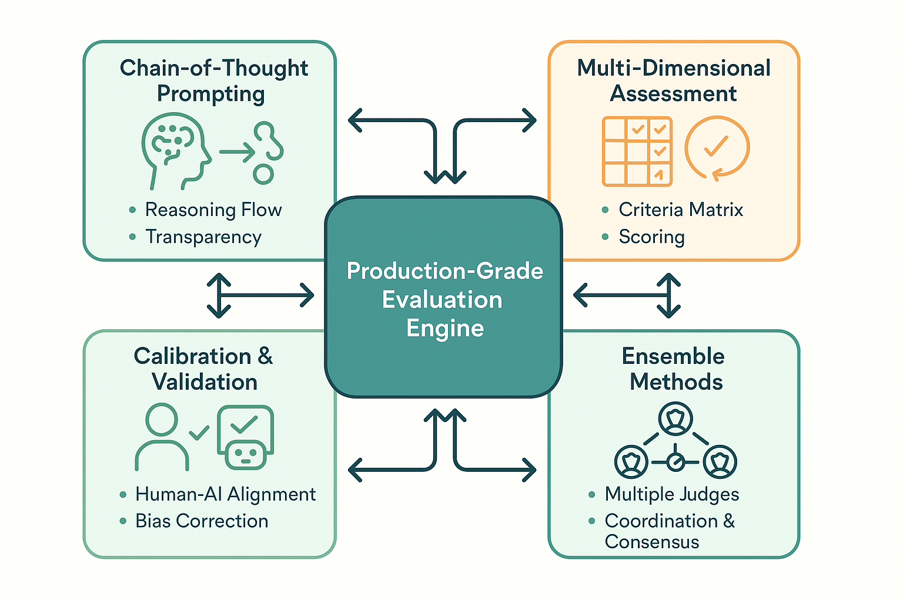

# Advanced LLM-as-Judge Implementation: Production-Grade Evaluation Systems



*Figure 6: Advanced LLM-as-Judge Implementation Framework - Comprehensive system architecture for production-grade automated evaluation with sophisticated prompting, multi-dimensional assessment, calibration protocols, and ensemble methods.*

## Introduction: Beyond Basic LLM-as-Judge

While basic LLM-as-Judge implementations provide valuable automation capabilities, production-grade systems require sophisticated approaches that address the nuanced challenges of real-world evaluation scenarios. This section presents advanced implementation techniques derived from cutting-edge research and practical deployment experience, focusing on the specific methodologies highlighted in the AI evaluation course notes.

The evolution from basic to advanced LLM-as-Judge systems involves addressing critical challenges including prompt sensitivity, evaluation consistency, bias mitigation, and multi-dimensional assessment capabilities. Advanced implementations incorporate sophisticated prompting techniques, calibration protocols, ensemble methods, and continuous learning frameworks that enable reliable evaluation across diverse domains and use cases.

The business impact of advanced LLM-as-Judge systems extends significantly beyond basic automation to include enhanced evaluation reliability, reduced human oversight requirements, and the capability to handle complex evaluation scenarios that require nuanced judgment and multi-faceted analysis. Organizations implementing these advanced frameworks achieve evaluation quality that consistently matches or exceeds human expert performance while maintaining the scalability and cost advantages of automated systems.

## Advanced Prompting Techniques for Evaluation

### Chain-of-Thought Evaluation Prompting

Chain-of-thought prompting for evaluation enables LLMs to provide transparent reasoning processes that enhance both evaluation quality and explainability. This approach is particularly valuable for complex evaluation scenarios that require multi-step reasoning, consideration of multiple criteria, or analysis of subtle quality distinctions.

The implementation of chain-of-thought evaluation prompting requires careful design of reasoning frameworks that guide the LLM through systematic evaluation processes while maintaining consistency across different evaluation scenarios. The most effective implementations combine structured reasoning templates with domain-specific evaluation criteria and examples that demonstrate the desired reasoning patterns.

**Structured Reasoning Framework:**

```python
class ChainOfThoughtEvaluator:
    """
    Advanced LLM-as-Judge implementation with chain-of-thought reasoning
    for transparent and reliable evaluation processes.
    """
    
    def __init__(self, model_name: str = "gpt-4", temperature: float = 0.1):
        self.model_name = model_name
        self.temperature = temperature
        self.evaluation_history = []
        
    def create_cot_evaluation_prompt(self, 
                                   evaluation_criteria: Dict[str, Any],
                                   content_to_evaluate: str,
                                   reference_content: Optional[str] = None,
                                   domain_context: Optional[str] = None) -> str:
        """
        Create chain-of-thought evaluation prompt with structured reasoning.
        """
        
        prompt_template = """
You are an expert evaluator conducting a systematic assessment. Follow this structured reasoning process:

## EVALUATION CONTEXT
Domain: {domain_context}
Evaluation Criteria: {criteria_description}

## CONTENT TO EVALUATE
{content_to_evaluate}

{reference_section}

## SYSTEMATIC EVALUATION PROCESS

### Step 1: Initial Analysis
First, carefully read and understand the content. Identify the key elements, structure, and apparent intent.

**Initial Observations:**
- Content type and format:
- Key elements identified:
- Apparent purpose/intent:

### Step 2: Criteria-Based Assessment
Evaluate against each criterion systematically:

{criteria_evaluation_steps}

### Step 3: Comparative Analysis
{comparative_analysis_section}

### Step 4: Quality Synthesis
Synthesize your analysis across all criteria:

**Strengths:**
- [List 2-3 key strengths]

**Areas for Improvement:**
- [List 2-3 areas needing improvement]

**Overall Assessment:**
- [Provide integrated assessment considering all criteria]

### Step 5: Scoring and Justification
Provide scores with detailed justification:

{scoring_framework}

## FINAL EVALUATION
Provide your final scores in this exact format:
```json
{{
    "scores": {{
        {score_template}
    }},
    "overall_score": [0-100],
    "confidence": [0-100],
    "reasoning_summary": "Brief summary of key reasoning",
    "improvement_recommendations": ["rec1", "rec2", "rec3"]
}}
```
        """
        
        # Build criteria evaluation steps
        criteria_steps = []
        score_template_parts = []
        
        for criterion, details in evaluation_criteria.items():
            criteria_steps.append(f"""
**{criterion.title()} Assessment:**
- Definition: {details.get('definition', 'Not specified')}
- Scale: {details.get('scale', '1-10')}
- Key indicators: {details.get('indicators', 'Not specified')}
- Analysis: [Your detailed analysis for this criterion]
- Preliminary score: [Score with justification]
            """)
            
            score_template_parts.append(f'"{criterion}": [score]')
        
        # Build reference section if provided
        reference_section = ""
        comparative_analysis_section = "No reference content provided for comparison."
        
        if reference_content:
            reference_section = f"""
## REFERENCE CONTENT (for comparison)
{reference_content}
            """
            comparative_analysis_section = """
Compare the content to evaluate against the reference content:
- Similarities and differences:
- Relative quality assessment:
- Specific areas where content exceeds or falls short of reference:
            """
        
        # Build scoring framework
        scoring_framework = """
For each criterion, provide:
1. Specific evidence from the content
2. Reasoning for the score
3. Confidence level in your assessment
        """
        
        return prompt_template.format(
            domain_context=domain_context or "General evaluation",
            criteria_description=self._format_criteria_description(evaluation_criteria),
            content_to_evaluate=content_to_evaluate,
            reference_section=reference_section,
            criteria_evaluation_steps="\n".join(criteria_steps),
            comparative_analysis_section=comparative_analysis_section,
            scoring_framework=scoring_framework,
            score_template=", ".join(score_template_parts)
        )
    
    def _format_criteria_description(self, criteria: Dict[str, Any]) -> str:
        """Format evaluation criteria for prompt inclusion."""
        
        descriptions = []
        for criterion, details in criteria.items():
            desc = f"- {criterion.title()}: {details.get('definition', 'Not specified')}"
            if 'scale' in details:
                desc += f" (Scale: {details['scale']})"
            descriptions.append(desc)
        
        return "\n".join(descriptions)
    
    async def evaluate_with_cot(self, 
                               content: str,
                               criteria: Dict[str, Any],
                               reference: Optional[str] = None,
                               domain: Optional[str] = None) -> Dict[str, Any]:
        """
        Conduct evaluation using chain-of-thought reasoning.
        """
        
        prompt = self.create_cot_evaluation_prompt(
            evaluation_criteria=criteria,
            content_to_evaluate=content,
            reference_content=reference,
            domain_context=domain
        )
        
        try:
            response = await openai.ChatCompletion.acreate(
                model=self.model_name,
                messages=[
                    {"role": "system", "content": "You are an expert evaluator who provides detailed, systematic assessments with clear reasoning."},
                    {"role": "user", "content": prompt}
                ],
                temperature=self.temperature,
                max_tokens=2000
            )
            
            response_text = response.choices[0].message.content
            
            # Extract structured evaluation result
            evaluation_result = self._extract_evaluation_result(response_text)
            
            # Store evaluation history
            self.evaluation_history.append({
                'timestamp': datetime.now(),
                'content': content[:200] + "..." if len(content) > 200 else content,
                'criteria': list(criteria.keys()),
                'result': evaluation_result,
                'full_reasoning': response_text
            })
            
            return evaluation_result
            
        except Exception as e:
            logging.error(f"Error in chain-of-thought evaluation: {str(e)}")
            return self._create_error_result(str(e))
    
    def _extract_evaluation_result(self, response_text: str) -> Dict[str, Any]:
        """Extract structured evaluation result from LLM response."""
        
        try:
            # Find JSON block in response
            json_start = response_text.find('```json')
            json_end = response_text.find('```', json_start + 7)
            
            if json_start != -1 and json_end != -1:
                json_text = response_text[json_start + 7:json_end].strip()
                result = json.loads(json_text)
                
                # Validate result structure
                required_fields = ['scores', 'overall_score', 'confidence', 'reasoning_summary']
                if all(field in result for field in required_fields):
                    return result
            
            # Fallback: attempt to parse from text
            return self._parse_evaluation_from_text(response_text)
            
        except Exception as e:
            logging.warning(f"Error extracting evaluation result: {str(e)}")
            return self._parse_evaluation_from_text(response_text)
    
    def _parse_evaluation_from_text(self, text: str) -> Dict[str, Any]:
        """Fallback method to parse evaluation from unstructured text."""
        
        # This is a simplified fallback - in production, implement more robust parsing
        return {
            'scores': {},
            'overall_score': 50,  # Default neutral score
            'confidence': 50,
            'reasoning_summary': 'Unable to parse structured evaluation',
            'improvement_recommendations': [],
            'parsing_error': True,
            'raw_response': text
        }
    
    def _create_error_result(self, error_message: str) -> Dict[str, Any]:
        """Create error result structure."""
        
        return {
            'scores': {},
            'overall_score': 0,
            'confidence': 0,
            'reasoning_summary': f'Evaluation failed: {error_message}',
            'improvement_recommendations': [],
            'error': True,
            'error_message': error_message
        }
```

### Multi-Dimensional Evaluation Framework

Multi-dimensional evaluation enables comprehensive assessment across multiple quality aspects simultaneously, providing nuanced understanding of content quality that goes beyond simple binary or scalar judgments. This approach is essential for complex evaluation scenarios where multiple quality dimensions must be considered and balanced.

The implementation of multi-dimensional evaluation requires careful design of evaluation frameworks that can handle interdependent quality dimensions while maintaining evaluation consistency and interpretability. The most effective implementations provide both dimension-specific scores and integrated overall assessments that reflect the relative importance of different quality aspects.

```python
class MultiDimensionalEvaluator:
    """
    Advanced multi-dimensional evaluation framework for comprehensive
    quality assessment across multiple criteria.
    """
    
    def __init__(self, evaluation_dimensions: Dict[str, Dict[str, Any]]):
        self.dimensions = evaluation_dimensions
        self.dimension_weights = self._calculate_dimension_weights()
        self.evaluation_cache = {}
        
    def _calculate_dimension_weights(self) -> Dict[str, float]:
        """Calculate normalized weights for evaluation dimensions."""
        
        weights = {}
        total_weight = 0
        
        for dimension, config in self.dimensions.items():
            weight = config.get('weight', 1.0)
            weights[dimension] = weight
            total_weight += weight
        
        # Normalize weights to sum to 1.0
        for dimension in weights:
            weights[dimension] = weights[dimension] / total_weight
            
        return weights
    
    def create_multidimensional_prompt(self, 
                                     content: str,
                                     context: Optional[str] = None) -> str:
        """
        Create comprehensive multi-dimensional evaluation prompt.
        """
        
        prompt_template = """
You are conducting a comprehensive multi-dimensional evaluation. Assess the content across all specified dimensions with detailed analysis.

## CONTENT TO EVALUATE
{content}

{context_section}

## EVALUATION DIMENSIONS

{dimension_descriptions}

## EVALUATION PROCESS

For each dimension, provide:
1. **Detailed Analysis**: Thorough assessment of the content for this dimension
2. **Evidence**: Specific examples from the content supporting your assessment
3. **Score**: Numerical score based on the dimension's scale
4. **Confidence**: Your confidence in this assessment (0-100)
5. **Improvement Suggestions**: Specific recommendations for this dimension

### Dimension-by-Dimension Assessment:

{dimension_evaluation_sections}

## INTEGRATION AND SYNTHESIS

### Cross-Dimensional Analysis
Analyze how the dimensions interact and influence each other:
- Synergies between dimensions:
- Trade-offs or conflicts:
- Overall coherence:

### Weighted Overall Assessment
Consider the relative importance of each dimension:
{dimension_weights_info}

## FINAL EVALUATION RESULTS

Provide your assessment in this exact JSON format:
```json
{{
    "dimensional_scores": {{
        {dimensional_score_template}
    }},
    "dimensional_confidence": {{
        {dimensional_confidence_template}
    }},
    "overall_score": [weighted average, 0-100],
    "overall_confidence": [average confidence, 0-100],
    "cross_dimensional_analysis": {{
        "synergies": ["synergy1", "synergy2"],
        "conflicts": ["conflict1", "conflict2"],
        "coherence_score": [0-100]
    }},
    "improvement_recommendations": {{
        {improvement_recommendations_template}
    }},
    "evaluation_summary": "Comprehensive summary of the evaluation"
}}
```
        """
        
        # Build dimension descriptions
        dimension_descriptions = []
        dimension_evaluation_sections = []
        dimensional_score_template = []
        dimensional_confidence_template = []
        improvement_recommendations_template = []
        
        for dimension, config in self.dimensions.items():
            # Dimension description
            desc = f"""
**{dimension.title()}** (Weight: {self.dimension_weights[dimension]:.2f})
- Definition: {config.get('definition', 'Not specified')}
- Scale: {config.get('scale', '0-100')}
- Key Indicators: {config.get('indicators', 'Not specified')}
- Evaluation Focus: {config.get('focus', 'General quality assessment')}
            """
            dimension_descriptions.append(desc)
            
            # Evaluation section
            eval_section = f"""
#### {dimension.title()} Evaluation
**Analysis**: [Provide detailed analysis for {dimension}]
**Evidence**: [Cite specific examples from the content]
**Score**: [Provide score on {config.get('scale', '0-100')} scale]
**Confidence**: [Your confidence in this assessment, 0-100]
**Improvements**: [Specific suggestions for improving {dimension}]
            """
            dimension_evaluation_sections.append(eval_section)
            
            # Template components
            dimensional_score_template.append(f'"{dimension}": [score]')
            dimensional_confidence_template.append(f'"{dimension}": [confidence]')
            improvement_recommendations_template.append(f'"{dimension}": ["rec1", "rec2"]')
        
        # Build context section
        context_section = ""
        if context:
            context_section = f"""
## EVALUATION CONTEXT
{context}
            """
        
        # Build dimension weights info
        weights_info = []
        for dimension, weight in self.dimension_weights.items():
            weights_info.append(f"- {dimension.title()}: {weight:.2f}")
        dimension_weights_info = "\n".join(weights_info)
        
        return prompt_template.format(
            content=content,
            context_section=context_section,
            dimension_descriptions="\n".join(dimension_descriptions),
            dimension_evaluation_sections="\n".join(dimension_evaluation_sections),
            dimension_weights_info=dimension_weights_info,
            dimensional_score_template=", ".join(dimensional_score_template),
            dimensional_confidence_template=", ".join(dimensional_confidence_template),
            improvement_recommendations_template=", ".join(improvement_recommendations_template)
        )
    
    async def evaluate_multidimensional(self, 
                                      content: str,
                                      context: Optional[str] = None,
                                      model: str = "gpt-4") -> Dict[str, Any]:
        """
        Conduct comprehensive multi-dimensional evaluation.
        """
        
        # Check cache first
        cache_key = self._generate_cache_key(content, context)
        if cache_key in self.evaluation_cache:
            return self.evaluation_cache[cache_key]
        
        prompt = self.create_multidimensional_prompt(content, context)
        
        try:
            response = await openai.ChatCompletion.acreate(
                model=model,
                messages=[
                    {"role": "system", "content": "You are an expert evaluator specializing in comprehensive multi-dimensional assessment with detailed analysis and precise scoring."},
                    {"role": "user", "content": prompt}
                ],
                temperature=0.1,
                max_tokens=3000
            )
            
            response_text = response.choices[0].message.content
            evaluation_result = self._extract_multidimensional_result(response_text)
            
            # Validate and enhance result
            validated_result = self._validate_multidimensional_result(evaluation_result)
            
            # Cache result
            self.evaluation_cache[cache_key] = validated_result
            
            return validated_result
            
        except Exception as e:
            logging.error(f"Error in multi-dimensional evaluation: {str(e)}")
            return self._create_multidimensional_error_result(str(e))
    
    def _generate_cache_key(self, content: str, context: Optional[str]) -> str:
        """Generate cache key for evaluation result."""
        
        import hashlib
        
        content_hash = hashlib.md5(content.encode()).hexdigest()
        context_hash = hashlib.md5((context or "").encode()).hexdigest()
        dimensions_hash = hashlib.md5(str(sorted(self.dimensions.keys())).encode()).hexdigest()
        
        return f"{content_hash}_{context_hash}_{dimensions_hash}"
    
    def _extract_multidimensional_result(self, response_text: str) -> Dict[str, Any]:
        """Extract structured multi-dimensional evaluation result."""
        
        try:
            # Find and parse JSON block
            json_start = response_text.find('```json')
            json_end = response_text.find('```', json_start + 7)
            
            if json_start != -1 and json_end != -1:
                json_text = response_text[json_start + 7:json_end].strip()
                result = json.loads(json_text)
                return result
            
            # Fallback parsing
            return self._parse_multidimensional_from_text(response_text)
            
        except Exception as e:
            logging.warning(f"Error extracting multi-dimensional result: {str(e)}")
            return self._parse_multidimensional_from_text(response_text)
    
    def _validate_multidimensional_result(self, result: Dict[str, Any]) -> Dict[str, Any]:
        """Validate and enhance multi-dimensional evaluation result."""
        
        validated_result = result.copy()
        
        # Ensure all dimensions are present
        if 'dimensional_scores' not in validated_result:
            validated_result['dimensional_scores'] = {}
        
        for dimension in self.dimensions:
            if dimension not in validated_result['dimensional_scores']:
                validated_result['dimensional_scores'][dimension] = 50  # Default neutral score
        
        # Calculate weighted overall score if missing or incorrect
        if 'overall_score' not in validated_result or not isinstance(validated_result['overall_score'], (int, float)):
            weighted_score = 0
            for dimension, score in validated_result['dimensional_scores'].items():
                if dimension in self.dimension_weights:
                    weighted_score += score * self.dimension_weights[dimension]
            validated_result['overall_score'] = round(weighted_score, 1)
        
        # Ensure confidence scores are present
        if 'dimensional_confidence' not in validated_result:
            validated_result['dimensional_confidence'] = {
                dimension: 70 for dimension in self.dimensions  # Default confidence
            }
        
        # Calculate overall confidence
        if 'overall_confidence' not in validated_result:
            confidence_scores = list(validated_result['dimensional_confidence'].values())
            validated_result['overall_confidence'] = round(np.mean(confidence_scores), 1)
        
        return validated_result
    
    def _parse_multidimensional_from_text(self, text: str) -> Dict[str, Any]:
        """Fallback parsing for multi-dimensional evaluation."""
        
        # Simplified fallback - in production, implement more sophisticated parsing
        return {
            'dimensional_scores': {dimension: 50 for dimension in self.dimensions},
            'dimensional_confidence': {dimension: 50 for dimension in self.dimensions},
            'overall_score': 50,
            'overall_confidence': 50,
            'cross_dimensional_analysis': {
                'synergies': [],
                'conflicts': [],
                'coherence_score': 50
            },
            'improvement_recommendations': {dimension: [] for dimension in self.dimensions},
            'evaluation_summary': 'Unable to parse structured evaluation',
            'parsing_error': True,
            'raw_response': text
        }
    
    def _create_multidimensional_error_result(self, error_message: str) -> Dict[str, Any]:
        """Create error result for multi-dimensional evaluation."""
        
        return {
            'dimensional_scores': {dimension: 0 for dimension in self.dimensions},
            'dimensional_confidence': {dimension: 0 for dimension in self.dimensions},
            'overall_score': 0,
            'overall_confidence': 0,
            'cross_dimensional_analysis': {
                'synergies': [],
                'conflicts': [],
                'coherence_score': 0
            },
            'improvement_recommendations': {dimension: [] for dimension in self.dimensions},
            'evaluation_summary': f'Evaluation failed: {error_message}',
            'error': True,
            'error_message': error_message
        }
```

## Tool Calling and Function Evaluation

### Specialized Evaluation for Function Calling

Tool calling and function evaluation represents one of the most challenging aspects of LLM evaluation, requiring assessment of both the appropriateness of function selection and the correctness of parameter specification. This specialized evaluation domain demands sophisticated approaches that can validate multi-step reasoning, parameter accuracy, and execution outcomes.

The complexity of tool calling evaluation stems from the need to assess multiple interconnected components: function selection appropriateness, parameter correctness, execution sequence logic, and outcome quality. Each of these components requires different evaluation strategies and validation approaches, making tool calling evaluation significantly more complex than traditional text generation assessment.

```python
class ToolCallingEvaluator:
    """
    Specialized evaluator for tool calling and function execution scenarios.
    Assesses function selection, parameter accuracy, and execution outcomes.
    """
    
    def __init__(self, available_tools: Dict[str, Dict[str, Any]]):
        self.available_tools = available_tools
        self.tool_schemas = self._build_tool_schemas()
        self.evaluation_history = []
        
    def _build_tool_schemas(self) -> Dict[str, Any]:
        """Build comprehensive schemas for available tools."""
        
        schemas = {}
        for tool_name, tool_config in self.available_tools.items():
            schemas[tool_name] = {
                'name': tool_name,
                'description': tool_config.get('description', ''),
                'parameters': tool_config.get('parameters', {}),
                'required_params': tool_config.get('required_params', []),
                'return_type': tool_config.get('return_type', 'any'),
                'use_cases': tool_config.get('use_cases', []),
                'constraints': tool_config.get('constraints', [])
            }
        return schemas
    
    def create_tool_calling_evaluation_prompt(self, 
                                            user_request: str,
                                            ai_response: Dict[str, Any],
                                            execution_result: Optional[Dict[str, Any]] = None,
                                            context: Optional[str] = None) -> str:
        """
        Create comprehensive evaluation prompt for tool calling scenarios.
        """
        
        prompt_template = """
You are evaluating an AI system's tool calling performance. Assess the appropriateness, accuracy, and effectiveness of the tool usage.

## USER REQUEST
{user_request}

{context_section}

## AI RESPONSE ANALYSIS
{ai_response_analysis}

## AVAILABLE TOOLS REFERENCE
{tools_reference}

{execution_results_section}

## EVALUATION FRAMEWORK

### 1. Function Selection Assessment
Evaluate whether the AI selected appropriate tools for the user request:

**Appropriateness Analysis:**
- Are the selected tools relevant to the user request?
- Are there better tool alternatives that should have been chosen?
- Is the combination of tools logical and efficient?

**Selection Quality Score (0-100):**
- 90-100: Perfect tool selection, optimal for the request
- 70-89: Good selection with minor suboptimal choices
- 50-69: Adequate selection but missing better alternatives
- 30-49: Poor selection with significant issues
- 0-29: Inappropriate or completely wrong tool selection

### 2. Parameter Accuracy Assessment
Evaluate the accuracy and completeness of tool parameters:

**Parameter Analysis:**
- Are all required parameters provided?
- Are parameter values correct and appropriate?
- Are optional parameters used effectively?
- Do parameters align with the user's intent?

**Parameter Quality Score (0-100):**
- 90-100: All parameters perfect and optimal
- 70-89: Minor parameter issues or suboptimal values
- 50-69: Some parameter errors but generally functional
- 30-49: Significant parameter problems affecting functionality
- 0-29: Major parameter errors or missing required parameters

### 3. Execution Logic Assessment
Evaluate the logical flow and sequencing of tool calls:

**Logic Analysis:**
- Is the sequence of tool calls logical and efficient?
- Are dependencies between tools handled correctly?
- Is the overall approach well-structured?

**Logic Quality Score (0-100):**
- 90-100: Perfect logical flow and sequencing
- 70-89: Good logic with minor inefficiencies
- 50-69: Adequate logic but some issues
- 30-49: Poor logic with significant problems
- 0-29: Illogical or completely flawed approach

### 4. Outcome Effectiveness Assessment
{outcome_assessment_section}

## COMPREHENSIVE EVALUATION

Provide your assessment in this exact JSON format:
```json
{{
    "function_selection": {{
        "score": [0-100],
        "analysis": "Detailed analysis of function selection",
        "selected_tools": [list of tools used],
        "alternative_tools": [better alternatives if any],
        "appropriateness": "excellent|good|adequate|poor|inappropriate"
    }},
    "parameter_accuracy": {{
        "score": [0-100],
        "analysis": "Detailed analysis of parameter usage",
        "correct_parameters": [list of correctly used parameters],
        "incorrect_parameters": [list of parameter errors],
        "missing_parameters": [list of missing required parameters],
        "accuracy_level": "perfect|good|adequate|poor|severely_flawed"
    }},
    "execution_logic": {{
        "score": [0-100],
        "analysis": "Detailed analysis of execution logic",
        "logical_flow": "excellent|good|adequate|poor|illogical",
        "efficiency": "optimal|good|adequate|inefficient|very_inefficient",
        "dependency_handling": "perfect|good|adequate|poor|failed"
    }},
    "outcome_effectiveness": {{
        "score": [0-100],
        "analysis": "Analysis of outcome quality and user satisfaction",
        "user_request_fulfillment": "complete|mostly_complete|partial|minimal|failed",
        "result_quality": "excellent|good|adequate|poor|unacceptable"
    }},
    "overall_assessment": {{
        "overall_score": [weighted average of all scores],
        "confidence": [0-100],
        "summary": "Brief overall assessment",
        "strengths": ["strength1", "strength2"],
        "weaknesses": ["weakness1", "weakness2"],
        "improvement_recommendations": ["rec1", "rec2", "rec3"]
    }}
}}
```
        """
        
        # Build AI response analysis
        ai_response_analysis = self._format_ai_response_analysis(ai_response)
        
        # Build tools reference
        tools_reference = self._format_tools_reference()
        
        # Build context section
        context_section = ""
        if context:
            context_section = f"""
## CONTEXT
{context}
            """
        
        # Build execution results section
        execution_results_section = ""
        outcome_assessment_section = """
**Outcome Analysis:**
- Did the tool calls achieve the user's objective?
- Is the final result useful and accurate?
- How well does the outcome match user expectations?

**Outcome Quality Score (0-100):**
- 90-100: Excellent outcome, fully meets or exceeds expectations
- 70-89: Good outcome with minor issues
- 50-69: Adequate outcome but some limitations
- 30-49: Poor outcome with significant problems
- 0-29: Failed outcome, does not meet user needs
        """
        
        if execution_result:
            execution_results_section = f"""
## EXECUTION RESULTS
{self._format_execution_results(execution_result)}
            """
            outcome_assessment_section = """
**Outcome Analysis:**
- Did the tool execution achieve the intended result?
- Are there any execution errors or failures?
- How well does the actual outcome match the expected outcome?
- Is the result useful for the user's request?

**Outcome Quality Score (0-100):**
- 90-100: Perfect execution with excellent results
- 70-89: Successful execution with minor issues
- 50-69: Mostly successful but some problems
- 30-49: Execution problems affecting result quality
- 0-29: Execution failure or completely unusable results
            """
        
        return prompt_template.format(
            user_request=user_request,
            context_section=context_section,
            ai_response_analysis=ai_response_analysis,
            tools_reference=tools_reference,
            execution_results_section=execution_results_section,
            outcome_assessment_section=outcome_assessment_section
        )
    
    def _format_ai_response_analysis(self, ai_response: Dict[str, Any]) -> str:
        """Format AI response for evaluation prompt."""
        
        analysis = []
        
        if 'tool_calls' in ai_response:
            analysis.append("**Tool Calls Made:**")
            for i, tool_call in enumerate(ai_response['tool_calls'], 1):
                tool_name = tool_call.get('function', {}).get('name', 'Unknown')
                tool_args = tool_call.get('function', {}).get('arguments', {})
                
                analysis.append(f"{i}. Tool: {tool_name}")
                analysis.append(f"   Parameters: {json.dumps(tool_args, indent=2)}")
        
        if 'reasoning' in ai_response:
            analysis.append(f"\n**AI Reasoning:**\n{ai_response['reasoning']}")
        
        if 'message' in ai_response:
            analysis.append(f"\n**AI Message:**\n{ai_response['message']}")
        
        return "\n".join(analysis)
    
    def _format_tools_reference(self) -> str:
        """Format available tools reference for evaluation."""
        
        reference = []
        for tool_name, schema in self.tool_schemas.items():
            reference.append(f"**{tool_name}**")
            reference.append(f"- Description: {schema['description']}")
            reference.append(f"- Required Parameters: {schema['required_params']}")
            reference.append(f"- Use Cases: {schema['use_cases']}")
            if schema['constraints']:
                reference.append(f"- Constraints: {schema['constraints']}")
            reference.append("")
        
        return "\n".join(reference)
    
    def _format_execution_results(self, execution_result: Dict[str, Any]) -> str:
        """Format execution results for evaluation."""
        
        formatted = []
        
        if 'success' in execution_result:
            status = "SUCCESS" if execution_result['success'] else "FAILURE"
            formatted.append(f"**Execution Status:** {status}")
        
        if 'results' in execution_result:
            formatted.append("**Results:**")
            for tool_name, result in execution_result['results'].items():
                formatted.append(f"- {tool_name}: {result}")
        
        if 'errors' in execution_result:
            formatted.append("**Errors:**")
            for error in execution_result['errors']:
                formatted.append(f"- {error}")
        
        if 'execution_time' in execution_result:
            formatted.append(f"**Execution Time:** {execution_result['execution_time']}ms")
        
        return "\n".join(formatted)
    
    async def evaluate_tool_calling(self, 
                                  user_request: str,
                                  ai_response: Dict[str, Any],
                                  execution_result: Optional[Dict[str, Any]] = None,
                                  context: Optional[str] = None,
                                  model: str = "gpt-4") -> Dict[str, Any]:
        """
        Conduct comprehensive tool calling evaluation.
        """
        
        prompt = self.create_tool_calling_evaluation_prompt(
            user_request=user_request,
            ai_response=ai_response,
            execution_result=execution_result,
            context=context
        )
        
        try:
            response = await openai.ChatCompletion.acreate(
                model=model,
                messages=[
                    {"role": "system", "content": "You are an expert evaluator specializing in tool calling and function execution assessment. Provide detailed, systematic evaluation with precise scoring."},
                    {"role": "user", "content": prompt}
                ],
                temperature=0.1,
                max_tokens=2500
            )
            
            response_text = response.choices[0].message.content
            evaluation_result = self._extract_tool_calling_result(response_text)
            
            # Store evaluation history
            self.evaluation_history.append({
                'timestamp': datetime.now(),
                'user_request': user_request,
                'ai_response': ai_response,
                'execution_result': execution_result,
                'evaluation_result': evaluation_result
            })
            
            return evaluation_result
            
        except Exception as e:
            logging.error(f"Error in tool calling evaluation: {str(e)}")
            return self._create_tool_calling_error_result(str(e))
    
    def _extract_tool_calling_result(self, response_text: str) -> Dict[str, Any]:
        """Extract structured tool calling evaluation result."""
        
        try:
            # Find and parse JSON block
            json_start = response_text.find('```json')
            json_end = response_text.find('```', json_start + 7)
            
            if json_start != -1 and json_end != -1:
                json_text = response_text[json_start + 7:json_end].strip()
                result = json.loads(json_text)
                
                # Validate required structure
                required_sections = ['function_selection', 'parameter_accuracy', 'execution_logic', 'outcome_effectiveness', 'overall_assessment']
                if all(section in result for section in required_sections):
                    return result
            
            # Fallback parsing
            return self._parse_tool_calling_from_text(response_text)
            
        except Exception as e:
            logging.warning(f"Error extracting tool calling result: {str(e)}")
            return self._parse_tool_calling_from_text(response_text)
    
    def _parse_tool_calling_from_text(self, text: str) -> Dict[str, Any]:
        """Fallback parsing for tool calling evaluation."""
        
        return {
            'function_selection': {
                'score': 50,
                'analysis': 'Unable to parse structured evaluation',
                'selected_tools': [],
                'alternative_tools': [],
                'appropriateness': 'unknown'
            },
            'parameter_accuracy': {
                'score': 50,
                'analysis': 'Unable to parse structured evaluation',
                'correct_parameters': [],
                'incorrect_parameters': [],
                'missing_parameters': [],
                'accuracy_level': 'unknown'
            },
            'execution_logic': {
                'score': 50,
                'analysis': 'Unable to parse structured evaluation',
                'logical_flow': 'unknown',
                'efficiency': 'unknown',
                'dependency_handling': 'unknown'
            },
            'outcome_effectiveness': {
                'score': 50,
                'analysis': 'Unable to parse structured evaluation',
                'user_request_fulfillment': 'unknown',
                'result_quality': 'unknown'
            },
            'overall_assessment': {
                'overall_score': 50,
                'confidence': 50,
                'summary': 'Unable to parse structured evaluation',
                'strengths': [],
                'weaknesses': [],
                'improvement_recommendations': []
            },
            'parsing_error': True,
            'raw_response': text
        }
    
    def _create_tool_calling_error_result(self, error_message: str) -> Dict[str, Any]:
        """Create error result for tool calling evaluation."""
        
        return {
            'function_selection': {
                'score': 0,
                'analysis': f'Evaluation failed: {error_message}',
                'selected_tools': [],
                'alternative_tools': [],
                'appropriateness': 'error'
            },
            'parameter_accuracy': {
                'score': 0,
                'analysis': f'Evaluation failed: {error_message}',
                'correct_parameters': [],
                'incorrect_parameters': [],
                'missing_parameters': [],
                'accuracy_level': 'error'
            },
            'execution_logic': {
                'score': 0,
                'analysis': f'Evaluation failed: {error_message}',
                'logical_flow': 'error',
                'efficiency': 'error',
                'dependency_handling': 'error'
            },
            'outcome_effectiveness': {
                'score': 0,
                'analysis': f'Evaluation failed: {error_message}',
                'user_request_fulfillment': 'error',
                'result_quality': 'error'
            },
            'overall_assessment': {
                'overall_score': 0,
                'confidence': 0,
                'summary': f'Evaluation failed: {error_message}',
                'strengths': [],
                'weaknesses': [],
                'improvement_recommendations': []
            },
            'error': True,
            'error_message': error_message
        }
```

## Calibration and Validation Protocols

### Human-AI Agreement Analysis

Calibration and validation represent critical components of production-grade LLM-as-Judge systems, ensuring that automated evaluations align with human expert judgments and maintain consistent quality over time. Effective calibration protocols require systematic comparison between LLM and human evaluations, identification of systematic biases, and implementation of correction mechanisms.

The challenge of LLM-as-Judge calibration extends beyond simple agreement measurement to include understanding the sources of disagreement, identifying systematic biases, and developing correction mechanisms that improve evaluation quality without compromising efficiency. The most effective calibration approaches combine statistical analysis with qualitative understanding of evaluation differences.

```python
class LLMJudgeCalibrator:
    """
    Comprehensive calibration system for LLM-as-Judge implementations.
    Analyzes human-AI agreement and implements bias correction mechanisms.
    """
    
    def __init__(self, human_evaluations: List[Dict[str, Any]], 
                 llm_evaluations: List[Dict[str, Any]]):
        self.human_evaluations = human_evaluations
        self.llm_evaluations = llm_evaluations
        self.calibration_results = {}
        self.bias_corrections = {}
        
    def conduct_comprehensive_calibration(self) -> Dict[str, Any]:
        """
        Conduct comprehensive calibration analysis including agreement metrics,
        bias detection, and correction mechanism development.
        """
        
        calibration_results = {
            'agreement_analysis': self._analyze_agreement(),
            'bias_analysis': self._analyze_systematic_biases(),
            'correlation_analysis': self._analyze_correlations(),
            'disagreement_analysis': self._analyze_disagreement_patterns(),
            'calibration_recommendations': self._generate_calibration_recommendations()
        }
        
        self.calibration_results = calibration_results
        return calibration_results
    
    def _analyze_agreement(self) -> Dict[str, Any]:
        """Analyze agreement between human and LLM evaluations."""
        
        from scipy.stats import pearsonr, spearmanr
        from sklearn.metrics import cohen_kappa_score, mean_absolute_error
        
        # Align evaluations by ID
        aligned_evaluations = self._align_evaluations()
        
        if not aligned_evaluations:
            return {'error': 'No aligned evaluations found'}
        
        human_scores = [eval_pair['human']['overall_score'] for eval_pair in aligned_evaluations]
        llm_scores = [eval_pair['llm']['overall_score'] for eval_pair in aligned_evaluations]
        
        # Calculate correlation metrics
        pearson_corr, pearson_p = pearsonr(human_scores, llm_scores)
        spearman_corr, spearman_p = spearmanr(human_scores, llm_scores)
        
        # Calculate agreement metrics
        mae = mean_absolute_error(human_scores, llm_scores)
        
        # Calculate categorical agreement (if applicable)
        categorical_agreement = self._calculate_categorical_agreement(aligned_evaluations)
        
        # Calculate score distribution analysis
        distribution_analysis = self._analyze_score_distributions(human_scores, llm_scores)
        
        return {
            'sample_size': len(aligned_evaluations),
            'correlation_metrics': {
                'pearson_correlation': pearson_corr,
                'pearson_p_value': pearson_p,
                'spearman_correlation': spearman_corr,
                'spearman_p_value': spearman_p
            },
            'agreement_metrics': {
                'mean_absolute_error': mae,
                'categorical_agreement': categorical_agreement
            },
            'distribution_analysis': distribution_analysis,
            'agreement_interpretation': self._interpret_agreement_levels(pearson_corr, mae)
        }
    
    def _align_evaluations(self) -> List[Dict[str, Any]]:
        """Align human and LLM evaluations by content ID."""
        
        human_by_id = {eval_data['content_id']: eval_data for eval_data in self.human_evaluations}
        llm_by_id = {eval_data['content_id']: eval_data for eval_data in self.llm_evaluations}
        
        aligned = []
        for content_id in human_by_id:
            if content_id in llm_by_id:
                aligned.append({
                    'content_id': content_id,
                    'human': human_by_id[content_id],
                    'llm': llm_by_id[content_id]
                })
        
        return aligned
    
    def _calculate_categorical_agreement(self, aligned_evaluations: List[Dict[str, Any]]) -> Dict[str, float]:
        """Calculate categorical agreement metrics."""
        
        from sklearn.metrics import cohen_kappa_score, accuracy_score
        
        # Convert scores to categories
        def score_to_category(score):
            if score >= 80:
                return 'excellent'
            elif score >= 60:
                return 'good'
            elif score >= 40:
                return 'fair'
            else:
                return 'poor'
        
        human_categories = [score_to_category(eval_pair['human']['overall_score']) 
                          for eval_pair in aligned_evaluations]
        llm_categories = [score_to_category(eval_pair['llm']['overall_score']) 
                        for eval_pair in aligned_evaluations]
        
        # Calculate agreement metrics
        accuracy = accuracy_score(human_categories, llm_categories)
        kappa = cohen_kappa_score(human_categories, llm_categories)
        
        return {
            'categorical_accuracy': accuracy,
            'cohen_kappa': kappa,
            'category_distribution': {
                'human': {cat: human_categories.count(cat) for cat in set(human_categories)},
                'llm': {cat: llm_categories.count(cat) for cat in set(llm_categories)}
            }
        }
    
    def _analyze_score_distributions(self, human_scores: List[float], llm_scores: List[float]) -> Dict[str, Any]:
        """Analyze score distribution differences."""
        
        import numpy as np
        from scipy import stats
        
        human_stats = {
            'mean': np.mean(human_scores),
            'std': np.std(human_scores),
            'median': np.median(human_scores),
            'min': np.min(human_scores),
            'max': np.max(human_scores)
        }
        
        llm_stats = {
            'mean': np.mean(llm_scores),
            'std': np.std(llm_scores),
            'median': np.median(llm_scores),
            'min': np.min(llm_scores),
            'max': np.max(llm_scores)
        }
        
        # Statistical tests
        t_stat, t_p_value = stats.ttest_ind(human_scores, llm_scores)
        ks_stat, ks_p_value = stats.ks_2samp(human_scores, llm_scores)
        
        return {
            'human_distribution': human_stats,
            'llm_distribution': llm_stats,
            'distribution_differences': {
                'mean_difference': llm_stats['mean'] - human_stats['mean'],
                'std_difference': llm_stats['std'] - human_stats['std']
            },
            'statistical_tests': {
                't_test': {'statistic': t_stat, 'p_value': t_p_value},
                'ks_test': {'statistic': ks_stat, 'p_value': ks_p_value}
            }
        }
    
    def _analyze_systematic_biases(self) -> Dict[str, Any]:
        """Analyze systematic biases in LLM evaluations."""
        
        aligned_evaluations = self._align_evaluations()
        
        bias_analysis = {
            'score_bias': self._analyze_score_bias(aligned_evaluations),
            'length_bias': self._analyze_length_bias(aligned_evaluations),
            'position_bias': self._analyze_position_bias(aligned_evaluations),
            'content_type_bias': self._analyze_content_type_bias(aligned_evaluations)
        }
        
        return bias_analysis
    
    def _analyze_score_bias(self, aligned_evaluations: List[Dict[str, Any]]) -> Dict[str, Any]:
        """Analyze systematic score biases."""
        
        score_differences = []
        for eval_pair in aligned_evaluations:
            human_score = eval_pair['human']['overall_score']
            llm_score = eval_pair['llm']['overall_score']
            score_differences.append(llm_score - human_score)
        
        import numpy as np
        
        mean_bias = np.mean(score_differences)
        std_bias = np.std(score_differences)
        
        # Analyze bias by score range
        bias_by_range = {}
        for range_name, (min_score, max_score) in [
            ('low', (0, 40)),
            ('medium', (40, 70)),
            ('high', (70, 100))
        ]:
            range_differences = [
                diff for eval_pair, diff in zip(aligned_evaluations, score_differences)
                if min_score <= eval_pair['human']['overall_score'] < max_score
            ]
            
            if range_differences:
                bias_by_range[range_name] = {
                    'mean_bias': np.mean(range_differences),
                    'sample_size': len(range_differences)
                }
        
        return {
            'overall_bias': mean_bias,
            'bias_std': std_bias,
            'bias_by_score_range': bias_by_range,
            'bias_interpretation': self._interpret_score_bias(mean_bias, std_bias)
        }
    
    def _analyze_length_bias(self, aligned_evaluations: List[Dict[str, Any]]) -> Dict[str, Any]:
        """Analyze bias related to content length."""
        
        length_bias_data = []
        for eval_pair in aligned_evaluations:
            content_length = len(eval_pair['human'].get('content', ''))
            human_score = eval_pair['human']['overall_score']
            llm_score = eval_pair['llm']['overall_score']
            score_difference = llm_score - human_score
            
            length_bias_data.append({
                'length': content_length,
                'score_difference': score_difference
            })
        
        # Analyze correlation between length and bias
        from scipy.stats import pearsonr
        
        lengths = [data['length'] for data in length_bias_data]
        score_diffs = [data['score_difference'] for data in length_bias_data]
        
        if lengths and score_diffs:
            correlation, p_value = pearsonr(lengths, score_diffs)
        else:
            correlation, p_value = 0, 1
        
        # Analyze bias by length quartiles
        import numpy as np
        
        if lengths:
            length_quartiles = np.percentile(lengths, [25, 50, 75])
            bias_by_quartile = {}
            
            for i, (q_name, q_range) in enumerate([
                ('Q1', (0, length_quartiles[0])),
                ('Q2', (length_quartiles[0], length_quartiles[1])),
                ('Q3', (length_quartiles[1], length_quartiles[2])),
                ('Q4', (length_quartiles[2], float('inf')))
            ]):
                quartile_diffs = [
                    data['score_difference'] for data in length_bias_data
                    if q_range[0] <= data['length'] < q_range[1]
                ]
                
                if quartile_diffs:
                    bias_by_quartile[q_name] = {
                        'mean_bias': np.mean(quartile_diffs),
                        'sample_size': len(quartile_diffs)
                    }
        else:
            bias_by_quartile = {}
        
        return {
            'length_bias_correlation': correlation,
            'correlation_p_value': p_value,
            'bias_by_length_quartile': bias_by_quartile,
            'length_bias_interpretation': self._interpret_length_bias(correlation, p_value)
        }
    
    def _interpret_agreement_levels(self, correlation: float, mae: float) -> str:
        """Interpret agreement levels between human and LLM evaluations."""
        
        if correlation >= 0.8 and mae <= 10:
            return "Excellent agreement - LLM evaluations closely match human judgments"
        elif correlation >= 0.6 and mae <= 15:
            return "Good agreement - LLM evaluations generally align with human judgments"
        elif correlation >= 0.4 and mae <= 20:
            return "Moderate agreement - Some alignment but significant differences exist"
        else:
            return "Poor agreement - LLM evaluations differ substantially from human judgments"
    
    def _interpret_score_bias(self, mean_bias: float, std_bias: float) -> str:
        """Interpret systematic score bias."""
        
        if abs(mean_bias) <= 2:
            return "Minimal systematic bias"
        elif mean_bias > 2:
            return f"LLM tends to score {mean_bias:.1f} points higher than humans"
        else:
            return f"LLM tends to score {abs(mean_bias):.1f} points lower than humans"
    
    def _interpret_length_bias(self, correlation: float, p_value: float) -> str:
        """Interpret length bias analysis."""
        
        if p_value > 0.05:
            return "No significant length bias detected"
        elif correlation > 0.3:
            return "LLM tends to score longer content higher than humans"
        elif correlation < -0.3:
            return "LLM tends to score longer content lower than humans"
        else:
            return "Weak length bias detected"
    
    def develop_bias_correction_mechanisms(self) -> Dict[str, Any]:
        """Develop bias correction mechanisms based on calibration analysis."""
        
        if not self.calibration_results:
            self.conduct_comprehensive_calibration()
        
        corrections = {}
        
        # Score bias correction
        score_bias = self.calibration_results['bias_analysis']['score_bias']['overall_bias']
        if abs(score_bias) > 2:
            corrections['score_adjustment'] = -score_bias
        
        # Length bias correction
        length_bias_corr = self.calibration_results['bias_analysis']['length_bias']['length_bias_correlation']
        if abs(length_bias_corr) > 0.3:
            corrections['length_adjustment_factor'] = -length_bias_corr * 0.1
        
        # Confidence calibration
        corrections['confidence_calibration'] = self._develop_confidence_calibration()
        
        self.bias_corrections = corrections
        return corrections
    
    def apply_bias_corrections(self, llm_evaluation: Dict[str, Any], 
                             content_length: Optional[int] = None) -> Dict[str, Any]:
        """Apply bias corrections to LLM evaluation."""
        
        corrected_evaluation = llm_evaluation.copy()
        
        if not self.bias_corrections:
            self.develop_bias_correction_mechanisms()
        
        # Apply score adjustment
        if 'score_adjustment' in self.bias_corrections:
            adjustment = self.bias_corrections['score_adjustment']
            corrected_evaluation['overall_score'] = max(0, min(100, 
                corrected_evaluation['overall_score'] + adjustment))
        
        # Apply length adjustment
        if 'length_adjustment_factor' in self.bias_corrections and content_length:
            length_factor = self.bias_corrections['length_adjustment_factor']
            length_adjustment = length_factor * (content_length - 500) / 100  # Normalize around 500 chars
            corrected_evaluation['overall_score'] = max(0, min(100,
                corrected_evaluation['overall_score'] + length_adjustment))
        
        # Apply confidence calibration
        if 'confidence_calibration' in self.bias_corrections:
            calibration_func = self.bias_corrections['confidence_calibration']
            original_confidence = corrected_evaluation.get('confidence', 50)
            corrected_evaluation['confidence'] = calibration_func(original_confidence)
        
        # Add correction metadata
        corrected_evaluation['bias_corrections_applied'] = {
            'score_adjustment': self.bias_corrections.get('score_adjustment', 0),
            'length_adjustment': self.bias_corrections.get('length_adjustment_factor', 0) if content_length else 0,
            'confidence_calibrated': 'confidence_calibration' in self.bias_corrections
        }
        
        return corrected_evaluation
```

## Ensemble Methods and Consensus Building

### Multi-Judge Ensemble Systems

Ensemble methods for LLM-as-Judge systems provide enhanced reliability and reduced variance through the combination of multiple evaluation perspectives. These approaches leverage the principle that aggregated judgments from multiple evaluators typically provide more accurate and robust assessments than individual evaluations, particularly for complex or subjective evaluation criteria.

The implementation of effective ensemble methods requires careful consideration of judge selection, aggregation strategies, and consensus building mechanisms. The most successful ensemble approaches combine diverse evaluation perspectives while maintaining computational efficiency and interpretability of results.

```python
class LLMJudgeEnsemble:
    """
    Advanced ensemble system for LLM-as-Judge implementations.
    Combines multiple judges for enhanced reliability and consensus building.
    """
    
    def __init__(self, judges: List[Dict[str, Any]], 
                 aggregation_strategy: str = "weighted_average"):
        self.judges = judges
        self.aggregation_strategy = aggregation_strategy
        self.judge_weights = self._calculate_judge_weights()
        self.ensemble_history = []
        
    def _calculate_judge_weights(self) -> Dict[str, float]:
        """Calculate weights for ensemble judges based on their characteristics."""
        
        weights = {}
        total_weight = 0
        
        for judge in self.judges:
            judge_id = judge['id']
            
            # Base weight
            weight = judge.get('base_weight', 1.0)
            
            # Adjust based on model capability
            model_multipliers = {
                'gpt-4': 1.2,
                'gpt-3.5-turbo': 1.0,
                'claude-3': 1.1,
                'claude-2': 0.9
            }
            
            model = judge.get('model', 'gpt-3.5-turbo')
            weight *= model_multipliers.get(model, 1.0)
            
            # Adjust based on specialization
            if judge.get('specialized_domain'):
                weight *= 1.1
            
            # Adjust based on historical performance
            if 'historical_accuracy' in judge:
                accuracy = judge['historical_accuracy']
                weight *= (0.5 + accuracy)  # Scale from 0.5 to 1.5
            
            weights[judge_id] = weight
            total_weight += weight
        
        # Normalize weights
        for judge_id in weights:
            weights[judge_id] = weights[judge_id] / total_weight
            
        return weights
    
    async def evaluate_with_ensemble(self, 
                                   content: str,
                                   evaluation_criteria: Dict[str, Any],
                                   context: Optional[str] = None) -> Dict[str, Any]:
        """
        Conduct evaluation using ensemble of judges.
        """
        
        # Collect evaluations from all judges
        judge_evaluations = await self._collect_judge_evaluations(
            content, evaluation_criteria, context
        )
        
        # Aggregate results
        ensemble_result = self._aggregate_evaluations(judge_evaluations)
        
        # Analyze consensus
        consensus_analysis = self._analyze_consensus(judge_evaluations)
        
        # Build comprehensive result
        final_result = {
            'ensemble_evaluation': ensemble_result,
            'individual_evaluations': judge_evaluations,
            'consensus_analysis': consensus_analysis,
            'aggregation_metadata': {
                'strategy': self.aggregation_strategy,
                'judge_weights': self.judge_weights,
                'num_judges': len(self.judges)
            }
        }
        
        # Store in history
        self.ensemble_history.append({
            'timestamp': datetime.now(),
            'content_preview': content[:200] + "..." if len(content) > 200 else content,
            'result': final_result
        })
        
        return final_result
    
    async def _collect_judge_evaluations(self, 
                                       content: str,
                                       criteria: Dict[str, Any],
                                       context: Optional[str]) -> List[Dict[str, Any]]:
        """Collect evaluations from all judges in parallel."""
        
        async def evaluate_with_judge(judge):
            try:
                # Create judge-specific prompt
                prompt = self._create_judge_specific_prompt(judge, content, criteria, context)
                
                # Call judge
                response = await openai.ChatCompletion.acreate(
                    model=judge['model'],
                    messages=[
                        {"role": "system", "content": judge.get('system_prompt', 
                            "You are an expert evaluator providing detailed assessment.")},
                        {"role": "user", "content": prompt}
                    ],
                    temperature=judge.get('temperature', 0.1),
                    max_tokens=judge.get('max_tokens', 2000)
                )
                
                response_text = response.choices[0].message.content
                evaluation_result = self._parse_judge_evaluation(response_text, judge['id'])
                
                return {
                    'judge_id': judge['id'],
                    'judge_config': judge,
                    'evaluation': evaluation_result,
                    'success': True
                }
                
            except Exception as e:
                logging.error(f"Error evaluating with judge {judge['id']}: {str(e)}")
                return {
                    'judge_id': judge['id'],
                    'judge_config': judge,
                    'evaluation': self._create_default_evaluation(),
                    'success': False,
                    'error': str(e)
                }
        
        # Execute all judge evaluations in parallel
        tasks = [evaluate_with_judge(judge) for judge in self.judges]
        judge_evaluations = await asyncio.gather(*tasks)
        
        return judge_evaluations
    
    def _create_judge_specific_prompt(self, 
                                    judge: Dict[str, Any],
                                    content: str,
                                    criteria: Dict[str, Any],
                                    context: Optional[str]) -> str:
        """Create prompt tailored to specific judge characteristics."""
        
        base_prompt = f"""
Evaluate the following content according to the specified criteria:

## CONTENT TO EVALUATE
{content}

{f"## CONTEXT\n{context}" if context else ""}

## EVALUATION CRITERIA
{self._format_criteria_for_judge(criteria, judge)}

## EVALUATION INSTRUCTIONS
{judge.get('evaluation_instructions', 'Provide detailed evaluation with scores and reasoning.')}

Provide your evaluation in JSON format:
```json
{{
    "scores": {{{self._format_score_template(criteria)}}},
    "overall_score": [0-100],
    "confidence": [0-100],
    "reasoning": "Detailed reasoning for your evaluation",
    "strengths": ["strength1", "strength2"],
    "weaknesses": ["weakness1", "weakness2"]
}}
```
        """
        
        # Add judge-specific modifications
        if judge.get('specialized_domain'):
            domain_instruction = f"\nFocus particularly on {judge['specialized_domain']} aspects in your evaluation."
            base_prompt += domain_instruction
        
        if judge.get('evaluation_style') == 'strict':
            style_instruction = "\nApply strict evaluation standards with high expectations for quality."
            base_prompt += style_instruction
        elif judge.get('evaluation_style') == 'lenient':
            style_instruction = "\nApply balanced evaluation standards, recognizing effort and potential."
            base_prompt += style_instruction
        
        return base_prompt
    
    def _format_criteria_for_judge(self, criteria: Dict[str, Any], judge: Dict[str, Any]) -> str:
        """Format evaluation criteria for specific judge."""
        
        formatted_criteria = []
        for criterion, details in criteria.items():
            criterion_text = f"- {criterion.title()}: {details.get('definition', 'Not specified')}"
            
            # Add judge-specific emphasis
            if judge.get('specialized_domain') and criterion.lower() in judge['specialized_domain'].lower():
                criterion_text += " [PRIORITY CRITERION FOR YOUR EXPERTISE]"
            
            formatted_criteria.append(criterion_text)
        
        return "\n".join(formatted_criteria)
    
    def _format_score_template(self, criteria: Dict[str, Any]) -> str:
        """Format score template for JSON response."""
        
        score_fields = []
        for criterion in criteria:
            score_fields.append(f'"{criterion}": [score]')
        
        return ", ".join(score_fields)
    
    def _parse_judge_evaluation(self, response_text: str, judge_id: str) -> Dict[str, Any]:
        """Parse evaluation response from judge."""
        
        try:
            # Extract JSON from response
            json_start = response_text.find('```json')
            json_end = response_text.find('```', json_start + 7)
            
            if json_start != -1 and json_end != -1:
                json_text = response_text[json_start + 7:json_end].strip()
                evaluation = json.loads(json_text)
                evaluation['judge_id'] = judge_id
                return evaluation
            
            # Fallback parsing
            return self._fallback_parse_evaluation(response_text, judge_id)
            
        except Exception as e:
            logging.warning(f"Error parsing evaluation from judge {judge_id}: {str(e)}")
            return self._create_default_evaluation(judge_id)
    
    def _aggregate_evaluations(self, judge_evaluations: List[Dict[str, Any]]) -> Dict[str, Any]:
        """Aggregate evaluations from multiple judges."""
        
        successful_evaluations = [
            eval_data for eval_data in judge_evaluations 
            if eval_data['success']
        ]
        
        if not successful_evaluations:
            return self._create_default_evaluation()
        
        if self.aggregation_strategy == "weighted_average":
            return self._weighted_average_aggregation(successful_evaluations)
        elif self.aggregation_strategy == "median":
            return self._median_aggregation(successful_evaluations)
        elif self.aggregation_strategy == "consensus_based":
            return self._consensus_based_aggregation(successful_evaluations)
        else:
            return self._simple_average_aggregation(successful_evaluations)
    
    def _weighted_average_aggregation(self, evaluations: List[Dict[str, Any]]) -> Dict[str, Any]:
        """Aggregate using weighted average based on judge weights."""
        
        aggregated_scores = {}
        total_weight = 0
        weighted_overall_score = 0
        weighted_confidence = 0
        
        # Collect all unique score keys
        all_score_keys = set()
        for eval_data in evaluations:
            evaluation = eval_data['evaluation']
            if 'scores' in evaluation:
                all_score_keys.update(evaluation['scores'].keys())
        
        # Initialize aggregated scores
        for key in all_score_keys:
            aggregated_scores[key] = 0
        
        # Aggregate scores
        for eval_data in evaluations:
            judge_id = eval_data['judge_id']
            evaluation = eval_data['evaluation']
            weight = self.judge_weights.get(judge_id, 1.0 / len(evaluations))
            
            # Aggregate individual scores
            if 'scores' in evaluation:
                for key, score in evaluation['scores'].items():
                    if isinstance(score, (int, float)):
                        aggregated_scores[key] += score * weight
            
            # Aggregate overall score
            if 'overall_score' in evaluation and isinstance(evaluation['overall_score'], (int, float)):
                weighted_overall_score += evaluation['overall_score'] * weight
            
            # Aggregate confidence
            if 'confidence' in evaluation and isinstance(evaluation['confidence'], (int, float)):
                weighted_confidence += evaluation['confidence'] * weight
            
            total_weight += weight
        
        # Normalize if needed
        if total_weight > 0:
            for key in aggregated_scores:
                aggregated_scores[key] = round(aggregated_scores[key] / total_weight, 1)
            weighted_overall_score = round(weighted_overall_score / total_weight, 1)
            weighted_confidence = round(weighted_confidence / total_weight, 1)
        
        # Aggregate qualitative feedback
        all_strengths = []
        all_weaknesses = []
        all_reasoning = []
        
        for eval_data in evaluations:
            evaluation = eval_data['evaluation']
            if 'strengths' in evaluation:
                all_strengths.extend(evaluation['strengths'])
            if 'weaknesses' in evaluation:
                all_weaknesses.extend(evaluation['weaknesses'])
            if 'reasoning' in evaluation:
                all_reasoning.append(evaluation['reasoning'])
        
        return {
            'scores': aggregated_scores,
            'overall_score': weighted_overall_score,
            'confidence': weighted_confidence,
            'reasoning': " | ".join(all_reasoning),
            'strengths': list(set(all_strengths)),  # Remove duplicates
            'weaknesses': list(set(all_weaknesses)),  # Remove duplicates
            'aggregation_method': 'weighted_average'
        }
    
    def _analyze_consensus(self, judge_evaluations: List[Dict[str, Any]]) -> Dict[str, Any]:
        """Analyze consensus among judge evaluations."""
        
        successful_evaluations = [
            eval_data for eval_data in judge_evaluations 
            if eval_data['success']
        ]
        
        if len(successful_evaluations) < 2:
            return {'consensus_level': 'insufficient_data', 'num_judges': len(successful_evaluations)}
        
        # Analyze overall score consensus
        overall_scores = [
            eval_data['evaluation']['overall_score'] 
            for eval_data in successful_evaluations
            if 'overall_score' in eval_data['evaluation']
        ]
        
        if overall_scores:
            import numpy as np
            
            score_std = np.std(overall_scores)
            score_range = max(overall_scores) - min(overall_scores)
            
            # Determine consensus level
            if score_std <= 5:
                consensus_level = 'high'
            elif score_std <= 10:
                consensus_level = 'moderate'
            elif score_std <= 15:
                consensus_level = 'low'
            else:
                consensus_level = 'very_low'
        else:
            consensus_level = 'no_data'
            score_std = 0
            score_range = 0
        
        # Analyze individual criterion consensus
        criterion_consensus = self._analyze_criterion_consensus(successful_evaluations)
        
        # Identify outlier judges
        outlier_analysis = self._identify_outlier_judges(successful_evaluations)
        
        return {
            'consensus_level': consensus_level,
            'overall_score_std': score_std,
            'overall_score_range': score_range,
            'criterion_consensus': criterion_consensus,
            'outlier_analysis': outlier_analysis,
            'num_judges': len(successful_evaluations)
        }
    
    def _analyze_criterion_consensus(self, evaluations: List[Dict[str, Any]]) -> Dict[str, Any]:
        """Analyze consensus for individual evaluation criteria."""
        
        import numpy as np
        
        # Collect scores by criterion
        criterion_scores = {}
        for eval_data in evaluations:
            evaluation = eval_data['evaluation']
            if 'scores' in evaluation:
                for criterion, score in evaluation['scores'].items():
                    if isinstance(score, (int, float)):
                        if criterion not in criterion_scores:
                            criterion_scores[criterion] = []
                        criterion_scores[criterion].append(score)
        
        # Analyze consensus for each criterion
        criterion_consensus = {}
        for criterion, scores in criterion_scores.items():
            if len(scores) >= 2:
                std = np.std(scores)
                range_val = max(scores) - min(scores)
                
                if std <= 5:
                    consensus = 'high'
                elif std <= 10:
                    consensus = 'moderate'
                else:
                    consensus = 'low'
                
                criterion_consensus[criterion] = {
                    'consensus_level': consensus,
                    'std': std,
                    'range': range_val,
                    'num_scores': len(scores)
                }
        
        return criterion_consensus
    
    def _identify_outlier_judges(self, evaluations: List[Dict[str, Any]]) -> Dict[str, Any]:
        """Identify judges whose evaluations are outliers."""
        
        import numpy as np
        
        overall_scores = []
        judge_ids = []
        
        for eval_data in evaluations:
            evaluation = eval_data['evaluation']
            if 'overall_score' in evaluation:
                overall_scores.append(evaluation['overall_score'])
                judge_ids.append(eval_data['judge_id'])
        
        if len(overall_scores) < 3:
            return {'outliers': [], 'method': 'insufficient_data'}
        
        # Calculate z-scores
        mean_score = np.mean(overall_scores)
        std_score = np.std(overall_scores)
        
        outliers = []
        if std_score > 0:
            for i, (score, judge_id) in enumerate(zip(overall_scores, judge_ids)):
                z_score = abs(score - mean_score) / std_score
                if z_score > 2:  # More than 2 standard deviations
                    outliers.append({
                        'judge_id': judge_id,
                        'score': score,
                        'z_score': z_score,
                        'deviation_from_mean': score - mean_score
                    })
        
        return {
            'outliers': outliers,
            'method': 'z_score',
            'threshold': 2.0,
            'mean_score': mean_score,
            'std_score': std_score
        }
    
    def _create_default_evaluation(self, judge_id: str = "unknown") -> Dict[str, Any]:
        """Create default evaluation for error cases."""
        
        return {
            'judge_id': judge_id,
            'scores': {},
            'overall_score': 50,
            'confidence': 0,
            'reasoning': 'Evaluation failed or could not be parsed',
            'strengths': [],
            'weaknesses': [],
            'error': True
        }
```

This comprehensive implementation provides production-grade LLM-as-Judge capabilities with advanced prompting techniques, multi-dimensional evaluation, tool calling assessment, calibration protocols, and ensemble methods. The framework addresses the key challenges identified in the course notes while providing practical, immediately applicable solutions for real-world evaluation scenarios.

