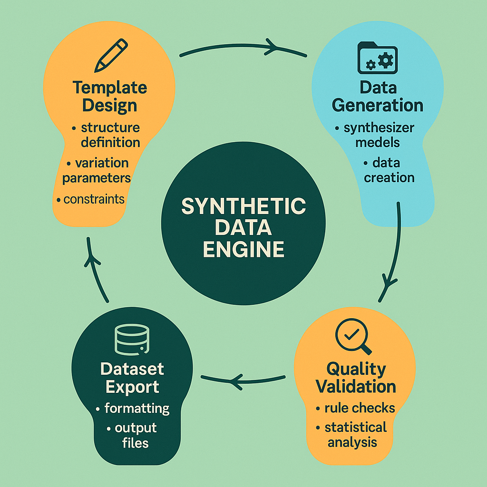

# Synthetic Data Generation: Scaling Evaluation Through Intelligent Data Creation



## Introduction: The Strategic Imperative of Synthetic Evaluation Data

The development of robust AI evaluation systems faces a fundamental challenge: the need for large, diverse, high-quality evaluation datasets that comprehensively test system capabilities across all relevant scenarios. Traditional approaches to evaluation data collection through human annotation or real-world data gathering suffer from significant limitations including high costs, scalability constraints, privacy concerns, and coverage gaps that leave critical evaluation scenarios untested.

Synthetic data generation addresses these limitations by providing systematic approaches to creating large-scale, diverse evaluation datasets that can comprehensively test AI system capabilities while maintaining control over data characteristics, ensuring privacy compliance, and enabling rapid iteration on evaluation scenarios. The strategic importance of synthetic data generation extends beyond cost savings to include enhanced evaluation coverage, improved testing of edge cases, and the ability to create evaluation datasets for scenarios that are difficult or impossible to collect naturally.

The business impact of implementing sophisticated synthetic data generation capabilities includes significant reductions in evaluation data costs, faster iteration cycles for evaluation system development, improved coverage of critical evaluation scenarios, and enhanced ability to test system robustness across diverse conditions. Organizations that successfully implement synthetic data generation gain competitive advantages through more comprehensive evaluation capabilities and faster time-to-market for AI system improvements.

The technical challenges of synthetic data generation require sophisticated approaches to template design, constraint specification, quality validation, and diversity optimization that ensure generated data provides meaningful evaluation signal while maintaining realistic characteristics that accurately reflect real-world usage patterns.

## Template-Based Generation Systems

### Designing Flexible Evaluation Templates

The foundation of effective synthetic data generation lies in the development of flexible, parameterizable templates that can generate diverse evaluation scenarios while maintaining consistency with real-world usage patterns. Template-based generation systems provide systematic approaches to creating structured variation in evaluation data while ensuring comprehensive coverage of critical evaluation dimensions.

The design of effective evaluation templates requires deep understanding of the target evaluation domain, systematic analysis of real-world usage patterns, and careful consideration of the types of variation that provide meaningful evaluation signal. The most successful template systems balance flexibility with structure, enabling generation of diverse scenarios while maintaining coherence and realism.

**Hierarchical Template Architecture** provides structured approaches to template design that enable systematic variation across multiple levels of abstraction, from high-level scenario types to specific parameter values and content details.

The development of hierarchical template architectures requires careful analysis of evaluation domain structure, identification of key variation dimensions, and design of template hierarchies that enable comprehensive coverage while maintaining manageable complexity.

*Domain-Specific Template Libraries* provide pre-configured template sets for common evaluation domains including conversational AI, content generation, question answering, and task-oriented systems. These libraries accelerate synthetic data generation implementation while providing proven template designs.

The creation of domain-specific template libraries requires extensive domain expertise, systematic analysis of evaluation requirements, and iterative refinement based on generation quality and evaluation effectiveness.

*Cross-Domain Template Adaptation* enables reuse of template designs across different evaluation domains through systematic adaptation and parameterization strategies that maintain template effectiveness while reducing development effort.

The implementation of cross-domain template adaptation requires sophisticated abstraction techniques, parameterization strategies, and validation procedures that ensure adapted templates maintain evaluation quality.

**Parameter Space Design** defines the dimensions of variation within templates and the strategies for sampling parameter values that ensure comprehensive coverage while maintaining realistic distributions.

The design of effective parameter spaces requires statistical analysis of real-world data distributions, systematic identification of critical variation dimensions, and sampling strategies that balance coverage with computational efficiency.

*Constraint-Based Parameter Generation* ensures that generated parameter combinations satisfy domain-specific constraints and maintain logical consistency while maximizing coverage of the parameter space.

The implementation of constraint-based parameter generation requires sophisticated constraint satisfaction techniques, validation procedures, and optimization algorithms that efficiently explore valid parameter combinations.

*Adaptive Parameter Sampling* adjusts parameter sampling strategies based on generation history, evaluation results, and coverage analysis to optimize the diversity and effectiveness of generated evaluation data.

The development of adaptive parameter sampling requires machine learning capabilities, coverage analysis techniques, and feedback mechanisms that enable continuous optimization of generation strategies.

```python
import random
import json
import numpy as np
from typing import Dict, List, Any, Optional, Tuple, Union
from dataclasses import dataclass, field
from abc import ABC, abstractmethod
from enum import Enum
import itertools
from datetime import datetime, timedelta
import re
import string
from pathlib import Path
import yaml

class TemplateType(Enum):
    """Types of synthetic data templates"""
    CONVERSATIONAL = "conversational"
    QA_PAIR = "qa_pair"
    CONTENT_GENERATION = "content_generation"
    TASK_ORIENTED = "task_oriented"
    CLASSIFICATION = "classification"
    SUMMARIZATION = "summarization"

class DifficultyLevel(Enum):
    """Difficulty levels for generated content"""
    EASY = "easy"
    MEDIUM = "medium"
    HARD = "hard"
    EXPERT = "expert"

@dataclass
class ParameterConstraint:
    """Represents a constraint on parameter values"""
    parameter_name: str
    constraint_type: str  # 'range', 'choices', 'pattern', 'dependency'
    constraint_value: Any
    description: str = ""

@dataclass
class TemplateParameter:
    """Represents a template parameter"""
    name: str
    parameter_type: str  # 'string', 'number', 'choice', 'list'
    default_value: Any = None
    constraints: List[ParameterConstraint] = field(default_factory=list)
    description: str = ""
    examples: List[Any] = field(default_factory=list)

@dataclass
class EvaluationTemplate:
    """Represents an evaluation data template"""
    template_id: str
    template_type: TemplateType
    name: str
    description: str
    template_content: str
    parameters: List[TemplateParameter] = field(default_factory=list)
    constraints: List[ParameterConstraint] = field(default_factory=list)
    metadata: Dict[str, Any] = field(default_factory=dict)
    
    def get_parameter_names(self) -> List[str]:
        """Get list of parameter names"""
        return [param.name for param in self.parameters]
    
    def validate_parameters(self, param_values: Dict[str, Any]) -> Tuple[bool, List[str]]:
        """Validate parameter values against constraints"""
        errors = []
        
        # Check required parameters
        for param in self.parameters:
            if param.name not in param_values and param.default_value is None:
                errors.append(f"Missing required parameter: {param.name}")
        
        # Check parameter constraints
        for param in self.parameters:
            if param.name in param_values:
                value = param_values[param.name]
                for constraint in param.constraints:
                    if not self._check_constraint(value, constraint):
                        errors.append(f"Parameter {param.name} violates constraint: {constraint.description}")
        
        # Check global constraints
        for constraint in self.constraints:
            if not self._check_global_constraint(param_values, constraint):
                errors.append(f"Global constraint violated: {constraint.description}")
        
        return len(errors) == 0, errors
    
    def _check_constraint(self, value: Any, constraint: ParameterConstraint) -> bool:
        """Check if value satisfies constraint"""
        if constraint.constraint_type == 'range':
            min_val, max_val = constraint.constraint_value
            return min_val <= value <= max_val
        elif constraint.constraint_type == 'choices':
            return value in constraint.constraint_value
        elif constraint.constraint_type == 'pattern':
            return bool(re.match(constraint.constraint_value, str(value)))
        else:
            return True
    
    def _check_global_constraint(self, param_values: Dict[str, Any], constraint: ParameterConstraint) -> bool:
        """Check global constraint across multiple parameters"""
        # Implementation depends on specific constraint types
        return True
    
    def generate_instance(self, param_values: Dict[str, Any]) -> Dict[str, Any]:
        """Generate a specific instance using parameter values"""
        
        # Validate parameters
        is_valid, errors = self.validate_parameters(param_values)
        if not is_valid:
            raise ValueError(f"Invalid parameters: {errors}")
        
        # Fill in default values
        complete_params = {}
        for param in self.parameters:
            if param.name in param_values:
                complete_params[param.name] = param_values[param.name]
            elif param.default_value is not None:
                complete_params[param.name] = param.default_value
        
        # Generate content
        try:
            generated_content = self.template_content.format(**complete_params)
        except KeyError as e:
            raise ValueError(f"Template formatting error: missing parameter {e}")
        
        return {
            'template_id': self.template_id,
            'template_type': self.template_type.value,
            'generated_content': generated_content,
            'parameters_used': complete_params,
            'generation_timestamp': datetime.now().isoformat(),
            'metadata': self.metadata.copy()
        }

class ParameterSampler:
    """Handles parameter sampling for template generation"""
    
    def __init__(self, random_seed: Optional[int] = None):
        if random_seed is not None:
            random.seed(random_seed)
            np.random.seed(random_seed)
    
    def sample_parameter(self, parameter: TemplateParameter) -> Any:
        """Sample a value for a single parameter"""
        
        if parameter.parameter_type == 'choice':
            # Find choice constraint
            choice_constraints = [c for c in parameter.constraints if c.constraint_type == 'choices']
            if choice_constraints:
                return random.choice(choice_constraints[0].constraint_value)
            elif parameter.examples:
                return random.choice(parameter.examples)
            else:
                raise ValueError(f"No choices available for parameter {parameter.name}")
        
        elif parameter.parameter_type == 'number':
            # Find range constraint
            range_constraints = [c for c in parameter.constraints if c.constraint_type == 'range']
            if range_constraints:
                min_val, max_val = range_constraints[0].constraint_value
                if isinstance(min_val, int) and isinstance(max_val, int):
                    return random.randint(min_val, max_val)
                else:
                    return random.uniform(min_val, max_val)
            else:
                return random.uniform(0, 100)  # Default range
        
        elif parameter.parameter_type == 'string':
            if parameter.examples:
                return random.choice(parameter.examples)
            else:
                # Generate random string
                length = random.randint(5, 20)
                return ''.join(random.choices(string.ascii_letters + string.digits + ' ', k=length))
        
        elif parameter.parameter_type == 'list':
            if parameter.examples:
                # Sample from examples and create list
                list_length = random.randint(1, min(5, len(parameter.examples)))
                return random.sample(parameter.examples, list_length)
            else:
                return []
        
        else:
            raise ValueError(f"Unsupported parameter type: {parameter.parameter_type}")
    
    def sample_parameters(self, template: EvaluationTemplate, 
                         fixed_params: Dict[str, Any] = None) -> Dict[str, Any]:
        """Sample values for all template parameters"""
        
        fixed_params = fixed_params or {}
        sampled_params = fixed_params.copy()
        
        # Sample remaining parameters
        for parameter in template.parameters:
            if parameter.name not in sampled_params:
                sampled_params[parameter.name] = self.sample_parameter(parameter)
        
        return sampled_params

class TemplateLibrary:
    """Library of evaluation templates"""
    
    def __init__(self):
        self.templates: Dict[str, EvaluationTemplate] = {}
        self._load_default_templates()
    
    def _load_default_templates(self):
        """Load default template library"""
        
        # Conversational AI template
        conv_template = EvaluationTemplate(
            template_id="conv_basic_001",
            template_type=TemplateType.CONVERSATIONAL,
            name="Basic Conversational Exchange",
            description="Template for generating basic conversational exchanges",
            template_content="""User: {user_message}
Assistant: {assistant_response}

Context: {context}
Conversation Type: {conversation_type}
Difficulty: {difficulty}""",
            parameters=[
                TemplateParameter(
                    name="user_message",
                    parameter_type="choice",
                    constraints=[ParameterConstraint(
                        parameter_name="user_message",
                        constraint_type="choices",
                        constraint_value=[
                            "Can you help me understand {topic}?",
                            "What's the best way to {action}?",
                            "I'm having trouble with {problem}. Any suggestions?",
                            "Could you explain {concept} in simple terms?",
                            "What are the pros and cons of {option}?"
                        ],
                        description="Predefined user message templates"
                    )],
                    description="User's message in the conversation"
                ),
                TemplateParameter(
                    name="assistant_response",
                    parameter_type="choice",
                    constraints=[ParameterConstraint(
                        parameter_name="assistant_response",
                        constraint_type="choices",
                        constraint_value=[
                            "I'd be happy to help you understand {topic}. Here are the key points...",
                            "The best approach to {action} typically involves these steps...",
                            "For {problem}, I recommend trying these solutions...",
                            "Let me break down {concept} into simpler parts...",
                            "Here are the main advantages and disadvantages of {option}..."
                        ],
                        description="Predefined assistant response templates"
                    )],
                    description="Assistant's response in the conversation"
                ),
                TemplateParameter(
                    name="context",
                    parameter_type="choice",
                    constraints=[ParameterConstraint(
                        parameter_name="context",
                        constraint_type="choices",
                        constraint_value=[
                            "Educational discussion",
                            "Problem-solving session",
                            "Information seeking",
                            "Decision support",
                            "Explanation request"
                        ],
                        description="Context types for conversation"
                    )],
                    description="Context of the conversation"
                ),
                TemplateParameter(
                    name="conversation_type",
                    parameter_type="choice",
                    constraints=[ParameterConstraint(
                        parameter_name="conversation_type",
                        constraint_type="choices",
                        constraint_value=["informational", "instructional", "advisory", "explanatory"],
                        description="Types of conversation"
                    )],
                    description="Type of conversation"
                ),
                TemplateParameter(
                    name="difficulty",
                    parameter_type="choice",
                    constraints=[ParameterConstraint(
                        parameter_name="difficulty",
                        constraint_type="choices",
                        constraint_value=["easy", "medium", "hard"],
                        description="Difficulty levels"
                    )],
                    description="Difficulty level of the conversation"
                ),
                TemplateParameter(
                    name="topic",
                    parameter_type="choice",
                    examples=["machine learning", "cooking", "gardening", "programming", "finance"],
                    description="Topic of discussion"
                ),
                TemplateParameter(
                    name="action",
                    parameter_type="choice",
                    examples=["learn a new skill", "solve a problem", "make a decision", "improve performance"],
                    description="Action the user wants to take"
                ),
                TemplateParameter(
                    name="problem",
                    parameter_type="choice",
                    examples=["time management", "technical issues", "communication", "productivity"],
                    description="Problem the user is facing"
                ),
                TemplateParameter(
                    name="concept",
                    parameter_type="choice",
                    examples=["artificial intelligence", "quantum computing", "blockchain", "climate change"],
                    description="Concept to be explained"
                ),
                TemplateParameter(
                    name="option",
                    parameter_type="choice",
                    examples=["remote work", "electric vehicles", "renewable energy", "online education"],
                    description="Option to be evaluated"
                )
            ],
            metadata={"domain": "general", "complexity": "medium"}
        )
        
        # Q&A template
        qa_template = EvaluationTemplate(
            template_id="qa_factual_001",
            template_type=TemplateType.QA_PAIR,
            name="Factual Question-Answer Pair",
            description="Template for generating factual Q&A pairs",
            template_content="""Question: {question}
Answer: {answer}
Category: {category}
Difficulty: {difficulty}
Source Domain: {domain}""",
            parameters=[
                TemplateParameter(
                    name="question",
                    parameter_type="choice",
                    constraints=[ParameterConstraint(
                        parameter_name="question",
                        constraint_type="choices",
                        constraint_value=[
                            "What is {entity}?",
                            "How does {process} work?",
                            "When did {event} occur?",
                            "Where is {location} located?",
                            "Why is {phenomenon} important?"
                        ],
                        description="Question templates"
                    )],
                    description="Question text"
                ),
                TemplateParameter(
                    name="answer",
                    parameter_type="choice",
                    constraints=[ParameterConstraint(
                        parameter_name="answer",
                        constraint_type="choices",
                        constraint_value=[
                            "{entity} is {definition}",
                            "{process} works by {mechanism}",
                            "{event} occurred in {time_period}",
                            "{location} is located in {geographic_area}",
                            "{phenomenon} is important because {reason}"
                        ],
                        description="Answer templates"
                    )],
                    description="Answer text"
                ),
                TemplateParameter(
                    name="category",
                    parameter_type="choice",
                    constraints=[ParameterConstraint(
                        parameter_name="category",
                        constraint_type="choices",
                        constraint_value=["science", "history", "geography", "technology", "culture"],
                        description="Question categories"
                    )],
                    description="Question category"
                ),
                TemplateParameter(
                    name="difficulty",
                    parameter_type="choice",
                    constraints=[ParameterConstraint(
                        parameter_name="difficulty",
                        constraint_type="choices",
                        constraint_value=["easy", "medium", "hard"],
                        description="Difficulty levels"
                    )],
                    description="Question difficulty"
                ),
                TemplateParameter(
                    name="domain",
                    parameter_type="choice",
                    examples=["general knowledge", "academic", "professional", "specialized"],
                    description="Source domain"
                ),
                TemplateParameter(
                    name="entity",
                    parameter_type="choice",
                    examples=["photosynthesis", "democracy", "gravity", "DNA", "internet"],
                    description="Entity being asked about"
                ),
                TemplateParameter(
                    name="process",
                    parameter_type="choice",
                    examples=["photosynthesis", "election", "digestion", "programming", "manufacturing"],
                    description="Process being explained"
                ),
                TemplateParameter(
                    name="event",
                    parameter_type="choice",
                    examples=["World War II", "moon landing", "invention of internet", "discovery of DNA"],
                    description="Historical event"
                ),
                TemplateParameter(
                    name="location",
                    parameter_type="choice",
                    examples=["Paris", "Mount Everest", "Amazon River", "Silicon Valley"],
                    description="Geographic location"
                ),
                TemplateParameter(
                    name="phenomenon",
                    parameter_type="choice",
                    examples=["climate change", "artificial intelligence", "renewable energy", "space exploration"],
                    description="Important phenomenon"
                )
            ],
            metadata={"domain": "factual", "complexity": "low"}
        )
        
        self.templates[conv_template.template_id] = conv_template
        self.templates[qa_template.template_id] = qa_template
    
    def add_template(self, template: EvaluationTemplate):
        """Add a template to the library"""
        self.templates[template.template_id] = template
    
    def get_template(self, template_id: str) -> Optional[EvaluationTemplate]:
        """Get a template by ID"""
        return self.templates.get(template_id)
    
    def list_templates(self, template_type: Optional[TemplateType] = None) -> List[EvaluationTemplate]:
        """List templates, optionally filtered by type"""
        if template_type:
            return [t for t in self.templates.values() if t.template_type == template_type]
        return list(self.templates.values())
    
    def save_library(self, filepath: str):
        """Save template library to file"""
        library_data = {}
        for template_id, template in self.templates.items():
            library_data[template_id] = {
                'template_id': template.template_id,
                'template_type': template.template_type.value,
                'name': template.name,
                'description': template.description,
                'template_content': template.template_content,
                'parameters': [
                    {
                        'name': p.name,
                        'parameter_type': p.parameter_type,
                        'default_value': p.default_value,
                        'constraints': [
                            {
                                'parameter_name': c.parameter_name,
                                'constraint_type': c.constraint_type,
                                'constraint_value': c.constraint_value,
                                'description': c.description
                            } for c in p.constraints
                        ],
                        'description': p.description,
                        'examples': p.examples
                    } for p in template.parameters
                ],
                'constraints': [
                    {
                        'parameter_name': c.parameter_name,
                        'constraint_type': c.constraint_type,
                        'constraint_value': c.constraint_value,
                        'description': c.description
                    } for c in template.constraints
                ],
                'metadata': template.metadata
            }
        
        with open(filepath, 'w') as f:
            json.dump(library_data, f, indent=2)
    
    def load_library(self, filepath: str):
        """Load template library from file"""
        with open(filepath, 'r') as f:
            library_data = json.load(f)
        
        for template_id, template_data in library_data.items():
            # Reconstruct template object
            parameters = []
            for param_data in template_data['parameters']:
                constraints = [
                    ParameterConstraint(**constraint_data) 
                    for constraint_data in param_data['constraints']
                ]
                parameters.append(TemplateParameter(
                    name=param_data['name'],
                    parameter_type=param_data['parameter_type'],
                    default_value=param_data['default_value'],
                    constraints=constraints,
                    description=param_data['description'],
                    examples=param_data['examples']
                ))
            
            global_constraints = [
                ParameterConstraint(**constraint_data) 
                for constraint_data in template_data['constraints']
            ]
            
            template = EvaluationTemplate(
                template_id=template_data['template_id'],
                template_type=TemplateType(template_data['template_type']),
                name=template_data['name'],
                description=template_data['description'],
                template_content=template_data['template_content'],
                parameters=parameters,
                constraints=global_constraints,
                metadata=template_data['metadata']
            )
            
            self.templates[template_id] = template

class SyntheticDataGenerator:
    """Main class for synthetic data generation"""
    
    def __init__(self, template_library: TemplateLibrary = None, random_seed: Optional[int] = None):
        self.template_library = template_library or TemplateLibrary()
        self.parameter_sampler = ParameterSampler(random_seed)
        self.generation_history: List[Dict[str, Any]] = []
    
    def generate_single(self, template_id: str, 
                       fixed_params: Dict[str, Any] = None) -> Dict[str, Any]:
        """Generate a single synthetic data instance"""
        
        template = self.template_library.get_template(template_id)
        if not template:
            raise ValueError(f"Template not found: {template_id}")
        
        # Sample parameters
        sampled_params = self.parameter_sampler.sample_parameters(template, fixed_params)
        
        # Generate instance
        instance = template.generate_instance(sampled_params)
        
        # Add to history
        self.generation_history.append(instance)
        
        return instance
    
    def generate_batch(self, template_id: str, count: int,
                      fixed_params: Dict[str, Any] = None,
                      ensure_diversity: bool = True) -> List[Dict[str, Any]]:
        """Generate multiple synthetic data instances"""
        
        instances = []
        used_param_combinations = set()
        
        for i in range(count):
            max_attempts = 100 if ensure_diversity else 1
            
            for attempt in range(max_attempts):
                try:
                    instance = self.generate_single(template_id, fixed_params)
                    
                    if ensure_diversity:
                        # Create a hashable representation of parameters
                        param_key = tuple(sorted(instance['parameters_used'].items()))
                        
                        if param_key not in used_param_combinations:
                            used_param_combinations.add(param_key)
                            instances.append(instance)
                            break
                    else:
                        instances.append(instance)
                        break
                        
                except Exception as e:
                    if attempt == max_attempts - 1:
                        raise e
                    continue
        
        return instances
    
    def generate_mixed_batch(self, template_configs: List[Dict[str, Any]]) -> List[Dict[str, Any]]:
        """Generate batch with multiple templates"""
        
        all_instances = []
        
        for config in template_configs:
            template_id = config['template_id']
            count = config.get('count', 1)
            fixed_params = config.get('fixed_params', {})
            
            instances = self.generate_batch(template_id, count, fixed_params)
            all_instances.extend(instances)
        
        # Shuffle to mix different template types
        random.shuffle(all_instances)
        
        return all_instances
    
    def get_generation_statistics(self) -> Dict[str, Any]:
        """Get statistics about generation history"""
        
        if not self.generation_history:
            return {'message': 'No instances generated yet'}
        
        # Analyze generation patterns
        template_counts = {}
        type_counts = {}
        
        for instance in self.generation_history:
            template_id = instance['template_id']
            template_type = instance['template_type']
            
            template_counts[template_id] = template_counts.get(template_id, 0) + 1
            type_counts[template_type] = type_counts.get(template_type, 0) + 1
        
        return {
            'total_instances': len(self.generation_history),
            'unique_templates_used': len(template_counts),
            'template_distribution': template_counts,
            'type_distribution': type_counts,
            'generation_timespan': {
                'first': self.generation_history[0]['generation_timestamp'],
                'last': self.generation_history[-1]['generation_timestamp']
            }
        }
    
    def export_dataset(self, filepath: str, format: str = 'json',
                      include_metadata: bool = True) -> None:
        """Export generated dataset to file"""
        
        if format == 'json':
            export_data = self.generation_history if include_metadata else [
                {
                    'content': instance['generated_content'],
                    'template_type': instance['template_type']
                } for instance in self.generation_history
            ]
            
            with open(filepath, 'w') as f:
                json.dump(export_data, f, indent=2)
                
        elif format == 'jsonl':
            with open(filepath, 'w') as f:
                for instance in self.generation_history:
                    if include_metadata:
                        f.write(json.dumps(instance) + '\n')
                    else:
                        simplified = {
                            'content': instance['generated_content'],
                            'template_type': instance['template_type']
                        }
                        f.write(json.dumps(simplified) + '\n')
        
        elif format == 'csv':
            import pandas as pd
            
            # Flatten data for CSV
            flattened_data = []
            for instance in self.generation_history:
                row = {
                    'template_id': instance['template_id'],
                    'template_type': instance['template_type'],
                    'generated_content': instance['generated_content'],
                    'generation_timestamp': instance['generation_timestamp']
                }
                
                if include_metadata:
                    # Add parameter values as separate columns
                    for param_name, param_value in instance['parameters_used'].items():
                        row[f'param_{param_name}'] = param_value
                
                flattened_data.append(row)
            
            df = pd.DataFrame(flattened_data)
            df.to_csv(filepath, index=False)
        
        else:
            raise ValueError(f"Unsupported format: {format}")

# Example usage and demonstration
def demonstrate_synthetic_data_generation():
    """Demonstrate synthetic data generation capabilities"""
    
    print("=== Synthetic Data Generation Demonstration ===")
    
    # Initialize generator
    generator = SyntheticDataGenerator(random_seed=42)
    
    # List available templates
    templates = generator.template_library.list_templates()
    print(f"Available templates: {len(templates)}")
    for template in templates:
        print(f"  - {template.template_id}: {template.name} ({template.template_type.value})")
    
    # Generate single instance
    print("\n=== Single Instance Generation ===")
    instance = generator.generate_single("conv_basic_001")
    print(f"Generated content:\n{instance['generated_content']}")
    print(f"Parameters used: {instance['parameters_used']}")
    
    # Generate batch
    print("\n=== Batch Generation ===")
    batch = generator.generate_batch("qa_factual_001", count=5, ensure_diversity=True)
    print(f"Generated {len(batch)} Q&A pairs:")
    for i, instance in enumerate(batch, 1):
        print(f"\n{i}. {instance['generated_content']}")
    
    # Generate mixed batch
    print("\n=== Mixed Batch Generation ===")
    mixed_configs = [
        {'template_id': 'conv_basic_001', 'count': 3},
        {'template_id': 'qa_factual_001', 'count': 3}
    ]
    mixed_batch = generator.generate_mixed_batch(mixed_configs)
    print(f"Generated {len(mixed_batch)} mixed instances")
    
    # Get statistics
    stats = generator.get_generation_statistics()
    print(f"\n=== Generation Statistics ===")
    print(json.dumps(stats, indent=2))
    
    # Export dataset
    generator.export_dataset('synthetic_dataset.json', format='json')
    generator.export_dataset('synthetic_dataset.jsonl', format='jsonl')
    print(f"\nDataset exported to synthetic_dataset.json and synthetic_dataset.jsonl")

if __name__ == "__main__":
    demonstrate_synthetic_data_generation()
```

### Quality Validation and Diversity Optimization

The effectiveness of synthetic data generation depends critically on the quality and diversity of generated content. Quality validation ensures that generated data meets specified standards and provides meaningful evaluation signal, while diversity optimization ensures comprehensive coverage of evaluation scenarios and prevents overfitting to narrow data distributions.

**Multi-Dimensional Quality Assessment** provides comprehensive evaluation of generated content across multiple quality dimensions including coherence, realism, difficulty appropriateness, and evaluation utility.

The implementation of multi-dimensional quality assessment requires sophisticated evaluation frameworks, automated quality metrics, and validation procedures that can efficiently assess large volumes of generated content.

*Automated Quality Metrics* provide scalable approaches to quality assessment that can evaluate generated content for linguistic quality, logical consistency, factual accuracy, and domain appropriateness without requiring extensive human review.

The development of automated quality metrics requires machine learning capabilities, domain expertise, and validation against human quality judgments to ensure metric reliability and validity.

*Human-in-the-Loop Validation* incorporates human expertise into quality assessment workflows for cases where automated metrics are insufficient or where domain expertise is required for accurate quality evaluation.

The design of human-in-the-loop validation requires careful consideration of human reviewer capabilities, efficient review interfaces, and quality assurance procedures that ensure consistent and reliable human judgments.

**Diversity Optimization Strategies** ensure that generated datasets provide comprehensive coverage of evaluation scenarios while avoiding redundancy and maintaining balanced representation across different content types and difficulty levels.

The implementation of diversity optimization requires sophisticated sampling strategies, coverage analysis techniques, and optimization algorithms that can efficiently explore large parameter spaces while maintaining quality standards.

*Coverage Analysis* provides systematic approaches to measuring and optimizing the coverage of generated datasets across relevant evaluation dimensions, ensuring that critical scenarios are adequately represented.

The development of effective coverage analysis requires domain expertise, statistical analysis capabilities, and visualization tools that enable clear understanding of coverage patterns and gaps.

*Adaptive Generation Strategies* adjust generation parameters and template selection based on coverage analysis and quality assessment results to optimize dataset composition and ensure comprehensive evaluation coverage.

The implementation of adaptive generation strategies requires machine learning capabilities, optimization algorithms, and feedback mechanisms that enable continuous improvement of generation effectiveness.

## Constraint-Based Generation

### Implementing Domain-Specific Constraints

The generation of realistic and useful synthetic evaluation data requires sophisticated constraint systems that ensure generated content adheres to domain-specific requirements, logical consistency rules, and evaluation utility standards. Constraint-based generation provides systematic approaches to incorporating domain knowledge and requirements into the generation process.

**Logical Consistency Constraints** ensure that generated content maintains internal logical consistency and adheres to domain-specific rules and relationships that are essential for realistic and meaningful evaluation scenarios.

The implementation of logical consistency constraints requires formal representation of domain knowledge, constraint satisfaction algorithms, and validation procedures that can efficiently check constraint compliance across complex generation scenarios.

*Rule-Based Constraint Systems* provide declarative approaches to specifying domain constraints that can be efficiently evaluated during the generation process to ensure compliance with domain requirements.

The development of rule-based constraint systems requires domain expertise, formal logic capabilities, and efficient constraint evaluation algorithms that can handle complex constraint networks without significantly impacting generation performance.

*Probabilistic Constraint Satisfaction* enables handling of soft constraints and uncertain domain knowledge through probabilistic approaches that balance constraint satisfaction with generation diversity and efficiency.

The implementation of probabilistic constraint satisfaction requires sophisticated probabilistic reasoning capabilities, optimization algorithms, and calibration procedures that ensure appropriate balance between constraint compliance and generation flexibility.

**Domain Knowledge Integration** incorporates structured domain knowledge into the generation process to ensure that generated content reflects realistic domain patterns, relationships, and constraints.

The integration of domain knowledge requires knowledge representation frameworks, domain expertise, and systematic approaches to encoding domain knowledge in forms that can be efficiently utilized during generation.

*Ontology-Based Generation* leverages formal ontologies and knowledge graphs to guide generation processes and ensure that generated content adheres to domain-specific conceptual structures and relationships.

The implementation of ontology-based generation requires knowledge engineering capabilities, ontology management systems, and generation algorithms that can efficiently utilize ontological knowledge to guide content creation.

*Expert Knowledge Elicitation* provides systematic approaches to capturing and encoding expert domain knowledge in forms that can be utilized for constraint specification and validation in synthetic data generation systems.

The development of expert knowledge elicitation requires domain expertise, knowledge engineering methodologies, and validation procedures that ensure accurate capture and representation of expert knowledge.

## Conclusion: Scaling Evaluation Through Intelligent Data Creation

Synthetic data generation represents a transformative approach to evaluation data creation that enables scalable, cost-effective, and comprehensive evaluation dataset development. The comprehensive framework presented in this section provides the foundation for implementing production-ready synthetic data generation systems that can create diverse, high-quality evaluation datasets while maintaining control over data characteristics and ensuring comprehensive coverage of evaluation scenarios.

The combination of flexible template systems, sophisticated parameter sampling, and robust quality validation creates generation capabilities that can produce evaluation datasets that often exceed the quality and coverage of manually created datasets while providing significant advantages in terms of cost, scalability, and iteration speed.

The emphasis on constraint-based generation and domain knowledge integration ensures that synthetic data generation systems can handle complex domain requirements and produce realistic content that provides meaningful evaluation signal for production AI systems.

As synthetic data generation techniques continue to evolve and improve, these systems will become increasingly sophisticated and capable, providing even more powerful tools for evaluation dataset creation and enabling more comprehensive and effective evaluation of AI system capabilities.

---

**Next**: [Section 3: CI/CD Integration Strategies →](03-cicd-integration.md)

