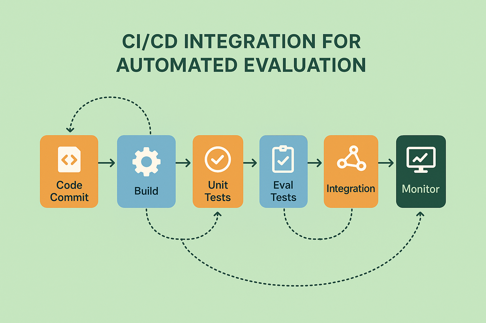

# CI/CD Integration Strategies: Embedding Evaluation in Development Workflows



## Introduction: The Strategic Imperative of Continuous Evaluation

The integration of automated evaluation into Continuous Integration and Continuous Deployment (CI/CD) pipelines represents a fundamental shift from reactive quality assurance to proactive, continuous quality monitoring that ensures AI system reliability throughout the development lifecycle. Traditional approaches to AI system evaluation often occur as isolated activities disconnected from development workflows, leading to delayed feedback, inconsistent quality standards, and increased risk of deploying problematic systems to production.

CI/CD integration addresses these limitations by embedding evaluation directly into development workflows, providing immediate feedback on system changes, ensuring consistent quality standards across all deployments, and enabling rapid iteration while maintaining high reliability standards. The strategic importance of CI/CD integration extends beyond automation to include enhanced development velocity, improved system reliability, and reduced risk of production failures.

The business impact of implementing comprehensive CI/CD evaluation integration includes significant reductions in time-to-market for AI improvements, enhanced system reliability through continuous quality monitoring, reduced costs associated with production failures, and improved developer productivity through immediate feedback on system changes. Organizations that successfully implement CI/CD evaluation integration gain competitive advantages through faster iteration cycles and more reliable AI systems.

The technical challenges of CI/CD integration require sophisticated approaches to pipeline design, test orchestration, performance optimization, and failure handling that ensure evaluation processes enhance rather than impede development velocity while maintaining comprehensive quality coverage.

## Pipeline Architecture Design

### Designing Scalable Evaluation Pipelines

The foundation of effective CI/CD evaluation integration lies in the design of scalable, efficient pipeline architectures that can handle diverse evaluation requirements while maintaining fast feedback cycles and reliable operation. Pipeline architecture design requires careful consideration of evaluation complexity, resource requirements, parallelization opportunities, and failure handling strategies.

The development of effective pipeline architectures requires understanding of both CI/CD best practices and evaluation-specific requirements, including the need for specialized compute resources, data management capabilities, and integration with external evaluation services. The most successful pipeline architectures balance comprehensiveness with efficiency, ensuring thorough evaluation coverage while maintaining acceptable pipeline execution times.

**Modular Pipeline Design** provides structured approaches to pipeline architecture that enable flexible composition of evaluation components, efficient resource utilization, and maintainable pipeline configurations that can evolve with changing evaluation requirements.

The implementation of modular pipeline design requires sophisticated orchestration capabilities, standardized component interfaces, and configuration management systems that enable efficient pipeline composition and maintenance.

*Component-Based Architecture* enables reusable evaluation components that can be efficiently combined to create comprehensive evaluation pipelines while minimizing duplication and maintenance overhead.

The development of component-based architectures requires careful interface design, dependency management, and versioning strategies that ensure component compatibility and enable efficient pipeline evolution.

*Parallel Execution Strategies* optimize pipeline performance through intelligent parallelization of evaluation tasks, resource allocation optimization, and efficient coordination of concurrent evaluation processes.

The implementation of parallel execution strategies requires sophisticated scheduling algorithms, resource management capabilities, and coordination mechanisms that ensure efficient resource utilization while maintaining evaluation reliability.

**Resource Management and Optimization** ensures efficient utilization of computational resources while maintaining evaluation quality and pipeline performance through intelligent resource allocation, caching strategies, and optimization techniques.

The design of effective resource management requires understanding of evaluation resource requirements, infrastructure capabilities, and optimization opportunities that can significantly improve pipeline efficiency.

*Dynamic Resource Allocation* provides adaptive resource management that adjusts computational resources based on evaluation requirements, pipeline load, and infrastructure availability to optimize performance and cost.

The implementation of dynamic resource allocation requires sophisticated monitoring capabilities, predictive algorithms, and infrastructure automation that can efficiently manage resources across diverse evaluation scenarios.

*Intelligent Caching Strategies* reduce evaluation overhead through strategic caching of evaluation results, intermediate computations, and shared resources that can be reused across multiple pipeline executions.

The development of intelligent caching strategies requires careful analysis of evaluation patterns, cache invalidation strategies, and storage optimization techniques that maximize cache effectiveness while ensuring result accuracy.

```python
import asyncio
import json
import yaml
import subprocess
import tempfile
import shutil
from typing import Dict, List, Any, Optional, Union, Callable
from dataclasses import dataclass, field
from abc import ABC, abstractmethod
from enum import Enum
from pathlib import Path
import logging
from datetime import datetime, timedelta
import hashlib
import os
import docker
import requests
from concurrent.futures import ThreadPoolExecutor, ProcessPoolExecutor
import time

# Configure logging
logging.basicConfig(level=logging.INFO)
logger = logging.getLogger(__name__)

class PipelineStage(Enum):
    """Pipeline execution stages"""
    SETUP = "setup"
    BUILD = "build"
    UNIT_TEST = "unit_test"
    EVALUATION = "evaluation"
    INTEGRATION_TEST = "integration_test"
    DEPLOYMENT = "deployment"
    MONITORING = "monitoring"

class ExecutionStatus(Enum):
    """Execution status values"""
    PENDING = "pending"
    RUNNING = "running"
    SUCCESS = "success"
    FAILURE = "failure"
    CANCELLED = "cancelled"
    TIMEOUT = "timeout"

@dataclass
class PipelineConfig:
    """Configuration for evaluation pipeline"""
    pipeline_id: str
    name: str
    description: str
    trigger_conditions: List[str]
    stages: List[Dict[str, Any]]
    environment: Dict[str, str] = field(default_factory=dict)
    timeout_minutes: int = 60
    retry_policy: Dict[str, Any] = field(default_factory=dict)
    notification_config: Dict[str, Any] = field(default_factory=dict)
    resource_requirements: Dict[str, Any] = field(default_factory=dict)

@dataclass
class ExecutionContext:
    """Context for pipeline execution"""
    execution_id: str
    pipeline_config: PipelineConfig
    trigger_event: Dict[str, Any]
    workspace_path: Path
    environment_vars: Dict[str, str] = field(default_factory=dict)
    artifacts: Dict[str, Any] = field(default_factory=dict)
    metadata: Dict[str, Any] = field(default_factory=dict)

@dataclass
class StageResult:
    """Result of stage execution"""
    stage_name: str
    status: ExecutionStatus
    start_time: datetime
    end_time: Optional[datetime] = None
    output: str = ""
    error_message: str = ""
    artifacts: Dict[str, Any] = field(default_factory=dict)
    metrics: Dict[str, float] = field(default_factory=dict)

class PipelineStageExecutor(ABC):
    """Abstract base class for pipeline stage executors"""
    
    @abstractmethod
    async def execute(self, context: ExecutionContext, stage_config: Dict[str, Any]) -> StageResult:
        """Execute a pipeline stage"""
        pass
    
    @abstractmethod
    def validate_config(self, stage_config: Dict[str, Any]) -> bool:
        """Validate stage configuration"""
        pass

class EvaluationStageExecutor(PipelineStageExecutor):
    """Executor for evaluation stages"""
    
    def __init__(self, evaluation_framework=None):
        self.evaluation_framework = evaluation_framework
    
    async def execute(self, context: ExecutionContext, stage_config: Dict[str, Any]) -> StageResult:
        """Execute evaluation stage"""
        
        stage_name = stage_config.get('name', 'evaluation')
        start_time = datetime.now()
        
        try:
            # Extract evaluation configuration
            eval_config = stage_config.get('evaluation_config', {})
            test_data_path = eval_config.get('test_data_path')
            evaluation_criteria = eval_config.get('criteria', [])
            output_path = eval_config.get('output_path', 'evaluation_results.json')
            
            # Load test data
            if test_data_path:
                test_data = self._load_test_data(context.workspace_path / test_data_path)
            else:
                test_data = eval_config.get('test_data', [])
            
            # Run evaluations
            results = await self._run_evaluations(test_data, evaluation_criteria, context)
            
            # Save results
            output_file = context.workspace_path / output_path
            with open(output_file, 'w') as f:
                json.dump(results, f, indent=2, default=str)
            
            # Calculate metrics
            metrics = self._calculate_metrics(results)
            
            # Check pass/fail criteria
            pass_criteria = eval_config.get('pass_criteria', {})
            status = self._check_pass_criteria(metrics, pass_criteria)
            
            return StageResult(
                stage_name=stage_name,
                status=status,
                start_time=start_time,
                end_time=datetime.now(),
                output=f"Evaluated {len(test_data)} test cases",
                artifacts={'results_file': str(output_file), 'results': results},
                metrics=metrics
            )
            
        except Exception as e:
            logger.error(f"Evaluation stage failed: {str(e)}")
            return StageResult(
                stage_name=stage_name,
                status=ExecutionStatus.FAILURE,
                start_time=start_time,
                end_time=datetime.now(),
                error_message=str(e)
            )
    
    def validate_config(self, stage_config: Dict[str, Any]) -> bool:
        """Validate evaluation stage configuration"""
        eval_config = stage_config.get('evaluation_config', {})
        
        # Check required fields
        if not eval_config.get('criteria'):
            return False
        
        # Validate criteria
        valid_criteria = ['accuracy', 'relevance', 'coherence', 'helpfulness', 'harmlessness']
        for criterion in eval_config['criteria']:
            if criterion not in valid_criteria:
                return False
        
        return True
    
    def _load_test_data(self, file_path: Path) -> List[Dict[str, Any]]:
        """Load test data from file"""
        if file_path.suffix == '.json':
            with open(file_path, 'r') as f:
                return json.load(f)
        elif file_path.suffix == '.jsonl':
            data = []
            with open(file_path, 'r') as f:
                for line in f:
                    data.append(json.loads(line.strip()))
            return data
        else:
            raise ValueError(f"Unsupported file format: {file_path.suffix}")
    
    async def _run_evaluations(self, test_data: List[Dict[str, Any]], 
                             criteria: List[str], context: ExecutionContext) -> List[Dict[str, Any]]:
        """Run evaluations on test data"""
        
        results = []
        
        for i, test_case in enumerate(test_data):
            test_result = {
                'test_case_id': test_case.get('id', f'test_{i}'),
                'input': test_case.get('input', ''),
                'expected_output': test_case.get('expected_output', ''),
                'actual_output': test_case.get('actual_output', ''),
                'evaluations': {}
            }
            
            # Run evaluation for each criterion
            for criterion in criteria:
                try:
                    if self.evaluation_framework:
                        # Use provided evaluation framework
                        eval_result = await self.evaluation_framework.evaluate_single(
                            input_text=test_case.get('input', ''),
                            criteria=criterion,
                            reference_text=test_case.get('expected_output', '')
                        )
                        score = eval_result['evaluation_result'].get('extracted_score', 0)
                    else:
                        # Simple mock evaluation
                        score = self._mock_evaluation(test_case, criterion)
                    
                    test_result['evaluations'][criterion] = {
                        'score': score,
                        'timestamp': datetime.now().isoformat()
                    }
                    
                except Exception as e:
                    logger.error(f"Evaluation failed for criterion {criterion}: {str(e)}")
                    test_result['evaluations'][criterion] = {
                        'score': 0,
                        'error': str(e),
                        'timestamp': datetime.now().isoformat()
                    }
            
            results.append(test_result)
        
        return results
    
    def _mock_evaluation(self, test_case: Dict[str, Any], criterion: str) -> float:
        """Mock evaluation for demonstration purposes"""
        # Simple heuristic-based evaluation
        input_text = test_case.get('input', '')
        actual_output = test_case.get('actual_output', '')
        expected_output = test_case.get('expected_output', '')
        
        if criterion == 'accuracy':
            # Simple string similarity
            if expected_output and actual_output:
                similarity = len(set(actual_output.lower().split()) & set(expected_output.lower().split())) / max(len(expected_output.split()), 1)
                return min(10, similarity * 10)
            return 5.0
        
        elif criterion == 'relevance':
            # Check if output relates to input
            if input_text and actual_output:
                common_words = len(set(input_text.lower().split()) & set(actual_output.lower().split()))
                return min(10, (common_words / max(len(input_text.split()), 1)) * 10)
            return 5.0
        
        elif criterion == 'coherence':
            # Simple length and structure check
            if actual_output:
                sentences = actual_output.split('.')
                if len(sentences) > 1 and len(actual_output) > 20:
                    return 8.0
                elif len(actual_output) > 10:
                    return 6.0
                else:
                    return 4.0
            return 2.0
        
        else:
            # Default score for other criteria
            return 7.0
    
    def _calculate_metrics(self, results: List[Dict[str, Any]]) -> Dict[str, float]:
        """Calculate aggregate metrics from evaluation results"""
        
        if not results:
            return {}
        
        metrics = {}
        criteria_scores = {}
        
        # Collect scores by criterion
        for result in results:
            for criterion, eval_data in result['evaluations'].items():
                if 'score' in eval_data and isinstance(eval_data['score'], (int, float)):
                    if criterion not in criteria_scores:
                        criteria_scores[criterion] = []
                    criteria_scores[criterion].append(eval_data['score'])
        
        # Calculate aggregate metrics
        for criterion, scores in criteria_scores.items():
            if scores:
                metrics[f'{criterion}_mean'] = sum(scores) / len(scores)
                metrics[f'{criterion}_min'] = min(scores)
                metrics[f'{criterion}_max'] = max(scores)
                metrics[f'{criterion}_count'] = len(scores)
        
        # Calculate overall metrics
        all_scores = [score for scores in criteria_scores.values() for score in scores]
        if all_scores:
            metrics['overall_mean'] = sum(all_scores) / len(all_scores)
            metrics['overall_min'] = min(all_scores)
            metrics['overall_max'] = max(all_scores)
            metrics['total_evaluations'] = len(all_scores)
        
        return metrics
    
    def _check_pass_criteria(self, metrics: Dict[str, float], 
                           pass_criteria: Dict[str, float]) -> ExecutionStatus:
        """Check if metrics meet pass criteria"""
        
        if not pass_criteria:
            return ExecutionStatus.SUCCESS
        
        for criterion, threshold in pass_criteria.items():
            if criterion in metrics:
                if metrics[criterion] < threshold:
                    return ExecutionStatus.FAILURE
            else:
                logger.warning(f"Pass criterion {criterion} not found in metrics")
        
        return ExecutionStatus.SUCCESS

class BuildStageExecutor(PipelineStageExecutor):
    """Executor for build stages"""
    
    async def execute(self, context: ExecutionContext, stage_config: Dict[str, Any]) -> StageResult:
        """Execute build stage"""
        
        stage_name = stage_config.get('name', 'build')
        start_time = datetime.now()
        
        try:
            # Extract build configuration
            build_config = stage_config.get('build_config', {})
            build_command = build_config.get('command', 'echo "No build command specified"')
            working_directory = build_config.get('working_directory', '.')
            
            # Execute build command
            full_command = f"cd {context.workspace_path / working_directory} && {build_command}"
            
            process = await asyncio.create_subprocess_shell(
                full_command,
                stdout=asyncio.subprocess.PIPE,
                stderr=asyncio.subprocess.STDOUT,
                env={**os.environ, **context.environment_vars}
            )
            
            stdout, _ = await process.communicate()
            output = stdout.decode('utf-8') if stdout else ""
            
            if process.returncode == 0:
                status = ExecutionStatus.SUCCESS
                error_message = ""
            else:
                status = ExecutionStatus.FAILURE
                error_message = f"Build failed with exit code {process.returncode}"
            
            return StageResult(
                stage_name=stage_name,
                status=status,
                start_time=start_time,
                end_time=datetime.now(),
                output=output,
                error_message=error_message
            )
            
        except Exception as e:
            logger.error(f"Build stage failed: {str(e)}")
            return StageResult(
                stage_name=stage_name,
                status=ExecutionStatus.FAILURE,
                start_time=start_time,
                end_time=datetime.now(),
                error_message=str(e)
            )
    
    def validate_config(self, stage_config: Dict[str, Any]) -> bool:
        """Validate build stage configuration"""
        build_config = stage_config.get('build_config', {})
        return 'command' in build_config

class TestStageExecutor(PipelineStageExecutor):
    """Executor for test stages"""
    
    async def execute(self, context: ExecutionContext, stage_config: Dict[str, Any]) -> StageResult:
        """Execute test stage"""
        
        stage_name = stage_config.get('name', 'test')
        start_time = datetime.now()
        
        try:
            # Extract test configuration
            test_config = stage_config.get('test_config', {})
            test_command = test_config.get('command', 'echo "No test command specified"')
            working_directory = test_config.get('working_directory', '.')
            
            # Execute test command
            full_command = f"cd {context.workspace_path / working_directory} && {test_command}"
            
            process = await asyncio.create_subprocess_shell(
                full_command,
                stdout=asyncio.subprocess.PIPE,
                stderr=asyncio.subprocess.STDOUT,
                env={**os.environ, **context.environment_vars}
            )
            
            stdout, _ = await process.communicate()
            output = stdout.decode('utf-8') if stdout else ""
            
            # Parse test results (simplified)
            metrics = self._parse_test_output(output)
            
            if process.returncode == 0:
                status = ExecutionStatus.SUCCESS
                error_message = ""
            else:
                status = ExecutionStatus.FAILURE
                error_message = f"Tests failed with exit code {process.returncode}"
            
            return StageResult(
                stage_name=stage_name,
                status=status,
                start_time=start_time,
                end_time=datetime.now(),
                output=output,
                error_message=error_message,
                metrics=metrics
            )
            
        except Exception as e:
            logger.error(f"Test stage failed: {str(e)}")
            return StageResult(
                stage_name=stage_name,
                status=ExecutionStatus.FAILURE,
                start_time=start_time,
                end_time=datetime.now(),
                error_message=str(e)
            )
    
    def validate_config(self, stage_config: Dict[str, Any]) -> bool:
        """Validate test stage configuration"""
        test_config = stage_config.get('test_config', {})
        return 'command' in test_config
    
    def _parse_test_output(self, output: str) -> Dict[str, float]:
        """Parse test output to extract metrics"""
        metrics = {}
        
        # Simple parsing for common test output patterns
        lines = output.split('\n')
        for line in lines:
            if 'tests passed' in line.lower():
                # Extract number of passed tests
                import re
                match = re.search(r'(\d+)\s+tests?\s+passed', line.lower())
                if match:
                    metrics['tests_passed'] = float(match.group(1))
            
            elif 'tests failed' in line.lower():
                # Extract number of failed tests
                import re
                match = re.search(r'(\d+)\s+tests?\s+failed', line.lower())
                if match:
                    metrics['tests_failed'] = float(match.group(1))
            
            elif 'coverage' in line.lower() and '%' in line:
                # Extract coverage percentage
                import re
                match = re.search(r'(\d+(?:\.\d+)?)%', line)
                if match:
                    metrics['coverage_percent'] = float(match.group(1))
        
        return metrics

class PipelineOrchestrator:
    """Main orchestrator for CI/CD evaluation pipelines"""
    
    def __init__(self):
        self.stage_executors = {
            'build': BuildStageExecutor(),
            'test': TestStageExecutor(),
            'evaluation': EvaluationStageExecutor()
        }
        self.execution_history: List[Dict[str, Any]] = []
        self.active_executions: Dict[str, Dict[str, Any]] = {}
    
    def register_executor(self, stage_type: str, executor: PipelineStageExecutor):
        """Register a custom stage executor"""
        self.stage_executors[stage_type] = executor
    
    async def execute_pipeline(self, pipeline_config: PipelineConfig, 
                             trigger_event: Dict[str, Any]) -> Dict[str, Any]:
        """Execute a complete pipeline"""
        
        execution_id = f"exec_{datetime.now().strftime('%Y%m%d_%H%M%S')}_{len(self.execution_history)}"
        
        # Create workspace
        workspace_path = Path(tempfile.mkdtemp(prefix=f"pipeline_{execution_id}_"))
        
        # Create execution context
        context = ExecutionContext(
            execution_id=execution_id,
            pipeline_config=pipeline_config,
            trigger_event=trigger_event,
            workspace_path=workspace_path,
            environment_vars=pipeline_config.environment.copy()
        )
        
        # Initialize execution record
        execution_record = {
            'execution_id': execution_id,
            'pipeline_id': pipeline_config.pipeline_id,
            'start_time': datetime.now(),
            'end_time': None,
            'status': ExecutionStatus.RUNNING,
            'trigger_event': trigger_event,
            'stage_results': [],
            'overall_metrics': {},
            'workspace_path': str(workspace_path)
        }
        
        self.active_executions[execution_id] = execution_record
        
        try:
            logger.info(f"Starting pipeline execution {execution_id}")
            
            # Execute stages sequentially
            for stage_config in pipeline_config.stages:
                stage_type = stage_config.get('type', 'unknown')
                stage_name = stage_config.get('name', stage_type)
                
                logger.info(f"Executing stage: {stage_name}")
                
                # Get appropriate executor
                executor = self.stage_executors.get(stage_type)
                if not executor:
                    raise ValueError(f"No executor found for stage type: {stage_type}")
                
                # Validate stage configuration
                if not executor.validate_config(stage_config):
                    raise ValueError(f"Invalid configuration for stage: {stage_name}")
                
                # Execute stage
                stage_result = await executor.execute(context, stage_config)
                execution_record['stage_results'].append(stage_result)
                
                # Check if stage failed
                if stage_result.status == ExecutionStatus.FAILURE:
                    execution_record['status'] = ExecutionStatus.FAILURE
                    logger.error(f"Stage {stage_name} failed: {stage_result.error_message}")
                    break
                
                # Update context with stage artifacts
                context.artifacts.update(stage_result.artifacts)
            
            # Calculate overall metrics
            overall_metrics = self._calculate_overall_metrics(execution_record['stage_results'])
            execution_record['overall_metrics'] = overall_metrics
            
            # Set final status if not already failed
            if execution_record['status'] != ExecutionStatus.FAILURE:
                execution_record['status'] = ExecutionStatus.SUCCESS
            
            execution_record['end_time'] = datetime.now()
            
            logger.info(f"Pipeline execution {execution_id} completed with status: {execution_record['status'].value}")
            
        except Exception as e:
            logger.error(f"Pipeline execution {execution_id} failed: {str(e)}")
            execution_record['status'] = ExecutionStatus.FAILURE
            execution_record['error_message'] = str(e)
            execution_record['end_time'] = datetime.now()
        
        finally:
            # Move from active to history
            if execution_id in self.active_executions:
                del self.active_executions[execution_id]
            self.execution_history.append(execution_record)
            
            # Cleanup workspace (optional)
            # shutil.rmtree(workspace_path, ignore_errors=True)
        
        return execution_record
    
    def _calculate_overall_metrics(self, stage_results: List[StageResult]) -> Dict[str, float]:
        """Calculate overall pipeline metrics"""
        
        overall_metrics = {}
        
        # Aggregate metrics from all stages
        all_metrics = {}
        for stage_result in stage_results:
            for metric_name, metric_value in stage_result.metrics.items():
                if metric_name not in all_metrics:
                    all_metrics[metric_name] = []
                all_metrics[metric_name].append(metric_value)
        
        # Calculate aggregates
        for metric_name, values in all_metrics.items():
            if values:
                overall_metrics[f'{metric_name}_mean'] = sum(values) / len(values)
                overall_metrics[f'{metric_name}_max'] = max(values)
                overall_metrics[f'{metric_name}_min'] = min(values)
        
        # Calculate execution time
        successful_stages = [r for r in stage_results if r.status == ExecutionStatus.SUCCESS]
        failed_stages = [r for r in stage_results if r.status == ExecutionStatus.FAILURE]
        
        overall_metrics['total_stages'] = len(stage_results)
        overall_metrics['successful_stages'] = len(successful_stages)
        overall_metrics['failed_stages'] = len(failed_stages)
        
        if stage_results:
            total_duration = sum([
                (r.end_time - r.start_time).total_seconds() 
                for r in stage_results 
                if r.end_time
            ])
            overall_metrics['total_duration_seconds'] = total_duration
        
        return overall_metrics
    
    def get_execution_status(self, execution_id: str) -> Optional[Dict[str, Any]]:
        """Get status of a specific execution"""
        
        # Check active executions
        if execution_id in self.active_executions:
            return self.active_executions[execution_id]
        
        # Check execution history
        for execution in self.execution_history:
            if execution['execution_id'] == execution_id:
                return execution
        
        return None
    
    def list_executions(self, pipeline_id: Optional[str] = None, 
                       status: Optional[ExecutionStatus] = None) -> List[Dict[str, Any]]:
        """List executions with optional filtering"""
        
        all_executions = list(self.active_executions.values()) + self.execution_history
        
        filtered_executions = all_executions
        
        if pipeline_id:
            filtered_executions = [e for e in filtered_executions if e['pipeline_id'] == pipeline_id]
        
        if status:
            filtered_executions = [e for e in filtered_executions if e['status'] == status]
        
        return sorted(filtered_executions, key=lambda x: x['start_time'], reverse=True)
    
    def get_pipeline_statistics(self, pipeline_id: str) -> Dict[str, Any]:
        """Get statistics for a specific pipeline"""
        
        pipeline_executions = self.list_executions(pipeline_id=pipeline_id)
        
        if not pipeline_executions:
            return {'message': f'No executions found for pipeline {pipeline_id}'}
        
        # Calculate statistics
        total_executions = len(pipeline_executions)
        successful_executions = len([e for e in pipeline_executions if e['status'] == ExecutionStatus.SUCCESS])
        failed_executions = len([e for e in pipeline_executions if e['status'] == ExecutionStatus.FAILURE])
        
        # Calculate average duration
        completed_executions = [e for e in pipeline_executions if e['end_time']]
        if completed_executions:
            durations = [
                (datetime.fromisoformat(e['end_time']) - datetime.fromisoformat(e['start_time'])).total_seconds()
                for e in completed_executions
            ]
            avg_duration = sum(durations) / len(durations)
        else:
            avg_duration = 0
        
        return {
            'pipeline_id': pipeline_id,
            'total_executions': total_executions,
            'successful_executions': successful_executions,
            'failed_executions': failed_executions,
            'success_rate': successful_executions / total_executions if total_executions > 0 else 0,
            'average_duration_seconds': avg_duration,
            'last_execution': pipeline_executions[0] if pipeline_executions else None
        }

# Example usage and demonstration
async def demonstrate_cicd_integration():
    """Demonstrate CI/CD integration capabilities"""
    
    print("=== CI/CD Integration Demonstration ===")
    
    # Create pipeline configuration
    pipeline_config = PipelineConfig(
        pipeline_id="ai_eval_pipeline_001",
        name="AI Evaluation Pipeline",
        description="Comprehensive AI system evaluation pipeline",
        trigger_conditions=["push", "pull_request"],
        stages=[
            {
                'name': 'build',
                'type': 'build',
                'build_config': {
                    'command': 'echo "Building AI system..." && sleep 2 && echo "Build completed successfully"',
                    'working_directory': '.'
                }
            },
            {
                'name': 'unit_tests',
                'type': 'test',
                'test_config': {
                    'command': 'echo "Running unit tests..." && sleep 1 && echo "15 tests passed, 0 failed, 85% coverage"',
                    'working_directory': '.'
                }
            },
            {
                'name': 'ai_evaluation',
                'type': 'evaluation',
                'evaluation_config': {
                    'criteria': ['accuracy', 'relevance', 'coherence'],
                    'test_data': [
                        {
                            'id': 'test_1',
                            'input': 'What is machine learning?',
                            'expected_output': 'Machine learning is a subset of AI that enables computers to learn from data.',
                            'actual_output': 'Machine learning is a method for computers to learn patterns from data without explicit programming.'
                        },
                        {
                            'id': 'test_2',
                            'input': 'Explain neural networks',
                            'expected_output': 'Neural networks are computing systems inspired by biological neural networks.',
                            'actual_output': 'Neural networks are computational models that mimic the structure of the human brain.'
                        }
                    ],
                    'pass_criteria': {
                        'accuracy_mean': 6.0,
                        'relevance_mean': 6.0,
                        'coherence_mean': 6.0
                    },
                    'output_path': 'evaluation_results.json'
                }
            }
        ],
        environment={'PYTHONPATH': '/app', 'ENV': 'test'},
        timeout_minutes=30
    )
    
    # Initialize orchestrator
    orchestrator = PipelineOrchestrator()
    
    # Simulate trigger event
    trigger_event = {
        'type': 'push',
        'branch': 'main',
        'commit_sha': 'abc123def456',
        'author': 'developer@example.com',
        'timestamp': datetime.now().isoformat()
    }
    
    print(f"Executing pipeline: {pipeline_config.name}")
    print(f"Trigger event: {trigger_event['type']} on {trigger_event['branch']}")
    
    # Execute pipeline
    execution_result = await orchestrator.execute_pipeline(pipeline_config, trigger_event)
    
    # Display results
    print(f"\n=== Execution Results ===")
    print(f"Execution ID: {execution_result['execution_id']}")
    print(f"Status: {execution_result['status'].value}")
    print(f"Duration: {(execution_result['end_time'] - execution_result['start_time']).total_seconds():.2f} seconds")
    
    print(f"\n=== Stage Results ===")
    for stage_result in execution_result['stage_results']:
        print(f"\nStage: {stage_result.stage_name}")
        print(f"  Status: {stage_result.status.value}")
        print(f"  Duration: {(stage_result.end_time - stage_result.start_time).total_seconds():.2f} seconds")
        if stage_result.metrics:
            print(f"  Metrics: {stage_result.metrics}")
        if stage_result.error_message:
            print(f"  Error: {stage_result.error_message}")
    
    print(f"\n=== Overall Metrics ===")
    print(json.dumps(execution_result['overall_metrics'], indent=2))
    
    # Get pipeline statistics
    stats = orchestrator.get_pipeline_statistics(pipeline_config.pipeline_id)
    print(f"\n=== Pipeline Statistics ===")
    print(json.dumps(stats, indent=2, default=str))

if __name__ == "__main__":
    asyncio.run(demonstrate_cicd_integration())
```

### Testing Strategy Integration

The integration of comprehensive testing strategies into CI/CD pipelines requires sophisticated approaches to test orchestration, coverage optimization, and quality assurance that ensure thorough evaluation while maintaining efficient pipeline execution. Testing strategy integration provides systematic frameworks for incorporating diverse evaluation approaches into automated workflows.

**Multi-Level Testing Architecture** provides structured approaches to organizing evaluation activities across different levels of system testing, from unit-level component testing to integration testing and end-to-end system evaluation.

The implementation of multi-level testing architecture requires careful coordination between different testing approaches, efficient resource allocation, and intelligent test selection strategies that optimize coverage while maintaining acceptable execution times.

*Unit-Level Evaluation Testing* focuses on testing individual AI components and modules to ensure correct behavior at the component level before integration into larger systems.

The development of unit-level evaluation testing requires sophisticated component isolation techniques, mock data generation capabilities, and automated test case generation that can comprehensively test component behavior.

*Integration Testing Strategies* ensure that AI system components work correctly together and that evaluation systems properly integrate with production AI systems and infrastructure.

The implementation of integration testing strategies requires sophisticated test environment management, data flow validation, and interface testing capabilities that can detect integration issues early in the development process.

*End-to-End System Testing* provides comprehensive evaluation of complete AI systems in realistic usage scenarios, ensuring that systems perform correctly under real-world conditions.

The design of end-to-end system testing requires realistic test environment creation, comprehensive scenario coverage, and performance testing capabilities that can validate system behavior under diverse conditions.

## Performance Optimization and Caching

### Intelligent Caching Strategies

The efficiency of CI/CD evaluation pipelines depends critically on intelligent caching strategies that can reduce redundant computation while ensuring evaluation accuracy and reliability. Performance optimization through caching requires sophisticated approaches to cache design, invalidation strategies, and consistency management.

**Hierarchical Caching Architecture** provides structured approaches to caching that optimize performance across different levels of the evaluation pipeline, from individual evaluation results to complete pipeline executions.

The implementation of hierarchical caching architecture requires sophisticated cache management systems, intelligent cache placement strategies, and efficient cache coordination mechanisms that maximize performance benefits while maintaining system reliability.

*Result-Level Caching* caches individual evaluation results to avoid redundant computation when the same evaluation scenarios are encountered across multiple pipeline executions.

The development of result-level caching requires sophisticated cache key generation, result validation, and cache invalidation strategies that ensure cached results remain accurate and relevant.

*Pipeline-Level Caching* caches complete pipeline execution results for scenarios where pipeline inputs and configurations remain unchanged, enabling rapid pipeline re-execution.

The implementation of pipeline-level caching requires comprehensive pipeline fingerprinting, dependency tracking, and cache validation mechanisms that ensure cached pipeline results remain valid.

**Cache Invalidation and Consistency** ensures that cached results remain accurate and up-to-date as evaluation systems, test data, and system configurations evolve over time.

The design of effective cache invalidation requires sophisticated dependency tracking, change detection algorithms, and validation procedures that can efficiently identify when cached results are no longer valid.

*Dependency-Based Invalidation* automatically invalidates cached results when dependencies such as evaluation models, test data, or system configurations change.

The implementation of dependency-based invalidation requires comprehensive dependency tracking, change detection capabilities, and efficient invalidation propagation mechanisms that ensure cache consistency.

*Time-Based Invalidation* provides temporal limits on cache validity to ensure that cached results do not become stale over time, even when explicit dependencies are not detected.

The development of time-based invalidation requires careful analysis of result validity periods, adaptive expiration strategies, and validation procedures that balance cache effectiveness with result accuracy.

## Failure Handling and Recovery

### Robust Error Management

The reliability of CI/CD evaluation pipelines requires sophisticated failure handling and recovery mechanisms that can gracefully handle errors, provide meaningful feedback, and enable rapid recovery from failures. Robust error management ensures that pipeline failures provide actionable information while minimizing disruption to development workflows.

**Graceful Degradation Strategies** enable pipelines to continue execution even when individual components or stages fail, providing partial results and maintaining development velocity while addressing failures.

The implementation of graceful degradation requires sophisticated error classification, fallback mechanisms, and partial result aggregation that can provide meaningful feedback even when complete evaluation is not possible.

*Component-Level Fallbacks* provide alternative evaluation approaches when primary evaluation methods fail, ensuring that some level of evaluation coverage is maintained even during system failures.

The development of component-level fallbacks requires multiple evaluation implementation strategies, automatic failover mechanisms, and quality assessment capabilities that can determine when fallback results are acceptable.

*Partial Result Aggregation* enables meaningful pipeline results even when some evaluation components fail, providing developers with available information while clearly indicating areas where evaluation was incomplete.

The implementation of partial result aggregation requires sophisticated result combination strategies, confidence assessment mechanisms, and clear reporting of evaluation coverage and limitations.

**Automated Recovery and Retry** provides intelligent retry mechanisms that can automatically recover from transient failures while avoiding infinite retry loops and resource exhaustion.

The design of automated recovery requires sophisticated failure classification, exponential backoff strategies, and circuit breaker patterns that can distinguish between transient and permanent failures.

*Intelligent Retry Policies* adapt retry behavior based on failure types, historical success rates, and resource availability to optimize recovery success while minimizing resource consumption.

The implementation of intelligent retry policies requires machine learning capabilities, failure pattern analysis, and adaptive algorithms that can optimize retry strategies based on historical performance data.

*Circuit Breaker Implementation* prevents cascade failures and resource exhaustion by temporarily disabling failing components while allowing other pipeline components to continue operation.

The development of circuit breaker implementation requires sophisticated failure detection, state management, and recovery validation that can efficiently manage component availability while maintaining overall pipeline reliability.

## Conclusion: Transforming Development Through Continuous Evaluation

CI/CD integration represents a transformative approach to AI system development that embeds evaluation directly into development workflows, providing continuous quality assurance and enabling rapid iteration while maintaining high reliability standards. The comprehensive framework presented in this section provides the foundation for implementing production-ready CI/CD evaluation integration that can handle diverse evaluation requirements while maintaining efficient development velocity.

The combination of modular pipeline architecture, intelligent caching, and robust failure handling creates CI/CD systems that enhance rather than impede development productivity while providing comprehensive quality assurance capabilities that ensure reliable AI system deployment.

The emphasis on performance optimization and scalability ensures that CI/CD evaluation integration can handle enterprise-scale development workflows while providing fast feedback cycles that enable rapid iteration and continuous improvement.

As CI/CD technologies continue to evolve and AI systems become more complex, CI/CD evaluation integration will become increasingly sophisticated, providing even more powerful tools for continuous quality assurance and enabling more reliable and efficient AI system development processes.

---

**Next**: [Section 4: Scalability and Performance →](04-scalability-performance.md)

