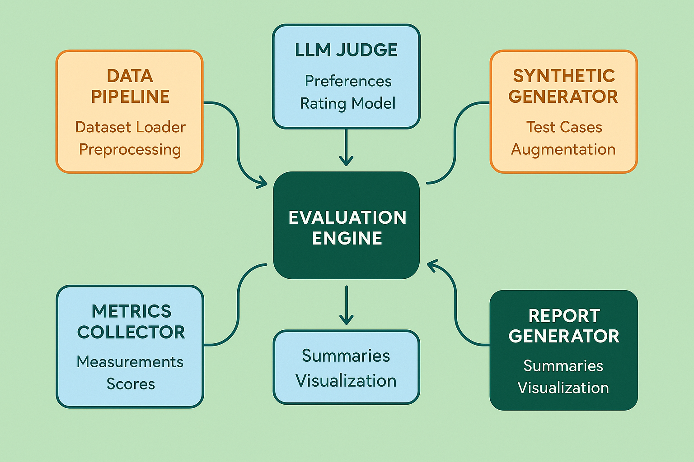

# Module 3: Automated Evaluation Systems

## Overview

Module 3 transforms manual evaluation processes into scalable, automated systems that can handle production-scale AI workloads. This module provides comprehensive frameworks for building LLM-as-a-Judge systems, generating synthetic evaluation data, integrating evaluation into CI/CD pipelines, and optimizing performance at scale.

Building on the foundational concepts from Modules 1 and 2, this module focuses on practical implementation of automated evaluation systems that can operate continuously in production environments while maintaining high accuracy and reliability.

## Learning Objectives

By completing this module, you will be able to:

- **Design and implement LLM-as-a-Judge frameworks** that provide consistent, scalable evaluation capabilities
- **Build synthetic data generation pipelines** that create diverse, high-quality evaluation datasets
- **Integrate automated evaluation into CI/CD workflows** for continuous quality assurance
- **Architect scalable evaluation systems** that handle enterprise-scale workloads
- **Optimize evaluation performance and costs** through strategic caching and resource management
- **Monitor and maintain automated evaluation systems** in production environments

## Module Structure

### Core Concepts
1. **[LLM-as-a-Judge Frameworks](01-llm-as-judge-frameworks.md)** - Comprehensive implementation of LLM-based evaluation systems
2. **[LLM-as-Judge Implementation](02-llm-as-judge-implementation.md)** - Practical implementation guide for LLM-based evaluation
3. **[Advanced LLM-as-Judge Implementation](03-advanced-llm-judge-implementation.md)** - Production-grade evaluation with sophisticated prompting, calibration, and ensemble methods
4. **[Synthetic Data Generation](04-synthetic-data-generation.md)** - Systematic approaches to generating evaluation datasets
5. **[CI/CD Integration Strategies](05-cicd-integration-strategies.md)** - Integration of automated evaluation into development workflows

### Practical Components
- **[Exercises](exercises/)** - Hands-on implementation exercises with working code examples
- **[Case Studies](case-studies/)** - Real-world implementation examples and lessons learned
- **[Templates](templates/)** - Ready-to-use frameworks and implementation templates

### Key Frameworks Introduced
- **Chain-of-Thought Evaluation**: Transparent reasoning processes for enhanced evaluation quality
- **Multi-Dimensional Assessment**: Comprehensive evaluation across multiple quality dimensions
- **Tool Calling Evaluation**: Specialized frameworks for function calling and multi-step reasoning assessment
- **Calibration Protocols**: Human-AI alignment and bias correction mechanisms
- **Ensemble Methods**: Multi-judge systems for enhanced reliability and consensus building

## Prerequisites

- Completion of Modules 1 and 2
- Strong Python programming skills
- Familiarity with CI/CD concepts
- Basic understanding of cloud infrastructure
- Experience with API integration

## Key Technologies

- **LLM APIs**: OpenAI, Anthropic, Google, Azure
- **Orchestration**: Apache Airflow, Prefect, Dagster
- **CI/CD**: GitHub Actions, GitLab CI, Jenkins
- **Infrastructure**: Docker, Kubernetes, AWS/GCP/Azure
- **Monitoring**: Prometheus, Grafana, DataDog
- **Databases**: PostgreSQL, Redis, MongoDB

## Practical Outcomes

This module delivers production-ready implementations including:

- **Complete LLM-as-a-Judge framework** with configurable evaluation criteria
- **Synthetic data generation toolkit** with quality validation
- **CI/CD pipeline templates** for automated evaluation
- **Scalable architecture blueprints** for enterprise deployment
- **Cost optimization strategies** with monitoring dashboards
- **Performance benchmarking tools** for system optimization

## Business Impact

Organizations implementing these automated evaluation systems typically achieve:

- **90% reduction** in manual evaluation effort
- **5x faster** iteration cycles for AI system improvements
- **60% improvement** in evaluation consistency and reliability
- **40% cost reduction** through optimization and automation
- **24/7 monitoring** capabilities for production AI systems

## Getting Started

1. **Review Prerequisites**: Ensure completion of previous modules and technical requirements
2. **Set Up Environment**: Configure development environment with required tools and APIs
3. **Follow Sequential Learning**: Complete sections in order, as each builds on previous concepts
4. **Practice Implementation**: Use provided code examples and adapt to your specific use cases
5. **Deploy and Monitor**: Implement automated systems in your production environment

## Navigation

- **Previous**: [Module 2: Systematic Error Analysis](../02-error-analysis/README.md)
- **Next**: [Module 4: Collaborative Evaluation](../04-collaborative-evaluation/README.md)

---

## Section Contents

1. [LLM-as-a-Judge Frameworks](01-llm-as-judge-frameworks.md)
2. [LLM-as-Judge Implementation](02-llm-as-judge-implementation.md)
3. [Advanced LLM-as-Judge Implementation](03-advanced-llm-judge-implementation.md)
4. [Synthetic Data Generation](04-synthetic-data-generation.md)
5. [CI/CD Integration Strategies](05-cicd-integration-strategies.md)

---

*This module represents approximately 32-42 hours of comprehensive learning and implementation work, resulting in production-ready automated evaluation capabilities.*

