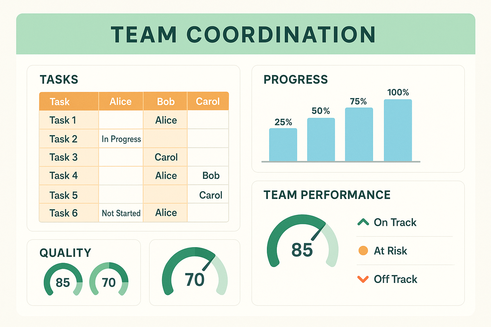
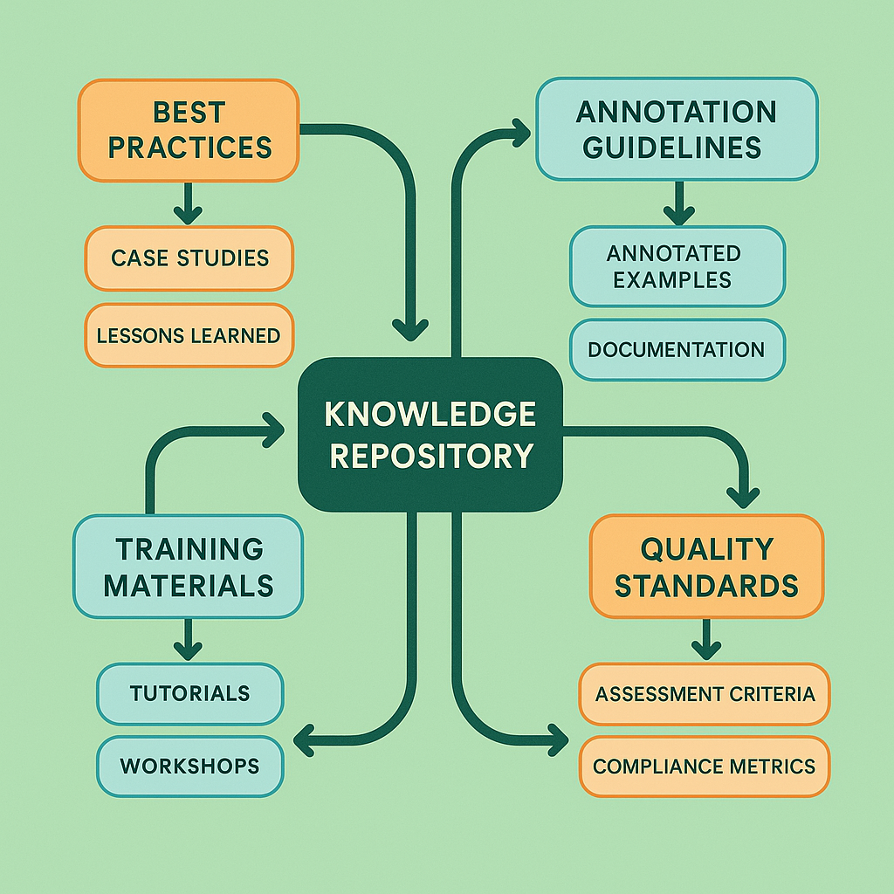

# Team Coordination and Knowledge Sharing: Scaling Collaborative Evaluation Excellence

## Introduction

Team coordination and knowledge sharing represent the organizational capabilities that transform individual evaluation expertise into scalable, sustainable competitive advantages. While technical evaluation skills and statistical methods provide the foundation for quality assessment, effective coordination and knowledge management enable organizations to leverage collective intelligence, maintain consistency across distributed teams, and continuously improve evaluation capabilities over time.

The challenge of scaling collaborative evaluation extends far beyond simply adding more evaluators. It requires sophisticated approaches to task coordination, expertise management, communication facilitation, and knowledge capture that maintain quality standards while accommodating growth, geographic distribution, and evolving requirements. Organizations that master these capabilities achieve evaluation outcomes that exceed the sum of individual contributions while building organizational knowledge assets that provide lasting competitive advantages.

Consider the transformation achieved by a global technology company that implemented comprehensive team coordination and knowledge sharing for AI system evaluation across 15 countries and 8 languages. Initially, evaluation teams operated independently with minimal coordination, resulting in inconsistent standards, duplicated efforts, and lost expertise when team members changed roles. Through systematic implementation of coordination frameworks and knowledge management systems, the company achieved 40% improvements in evaluation consistency, 60% reductions in onboarding time for new evaluators, and 25% increases in evaluation throughput while maintaining quality standards.

The business impact of effective team coordination extends across multiple dimensions. Organizations with sophisticated coordination capabilities report 35-50% reductions in evaluation project timelines, 45-65% improvements in cross-team knowledge transfer, and 30-40% increases in evaluation innovation through better collaboration and idea sharing. These improvements compound over time, creating sustainable competitive advantages through superior organizational evaluation capabilities.

## Organizational Frameworks for Evaluation Teams

Building effective evaluation teams requires systematic organizational frameworks that define roles, responsibilities, communication patterns, and decision-making processes. These frameworks must balance the need for coordination with the autonomy necessary for expert judgment while accommodating different organizational structures and cultural contexts.

**Team Structure Design Patterns**

Effective evaluation team structures leverage proven organizational patterns that optimize coordination while maintaining evaluation quality. Different patterns are appropriate for different organizational contexts, evaluation requirements, and scale considerations.

The **Centralized Excellence Model** establishes a central evaluation team that provides standards, training, and quality oversight for distributed evaluation activities. This model works well for organizations that need consistent evaluation standards across multiple business units or geographic regions while maintaining local evaluation capabilities.

Key characteristics of centralized excellence include:
- Central team defines evaluation standards and methodologies
- Local teams implement evaluation activities within established frameworks
- Regular coordination meetings ensure alignment and knowledge sharing
- Standardized training and certification programs maintain quality
- Central quality assurance and performance monitoring

The **Federated Expertise Model** distributes evaluation expertise across multiple specialized teams that coordinate through formal governance structures. This model works well for large organizations with diverse evaluation requirements that benefit from specialized expertise while maintaining overall coordination.

Federated expertise features include:
- Specialized teams focus on specific domains or evaluation types
- Cross-team coordination through governance councils and working groups
- Shared standards and methodologies with domain-specific adaptations
- Regular knowledge exchange and best practice sharing
- Distributed quality assurance with central oversight

The **Matrix Collaboration Model** combines functional evaluation expertise with project-based coordination, allowing evaluators to contribute to multiple initiatives while maintaining specialized knowledge. This model works well for organizations with dynamic evaluation requirements and complex project structures.

Matrix collaboration characteristics include:
- Evaluators report to both functional managers and project leaders
- Flexible team composition based on project requirements and expertise needs
- Shared resource allocation and priority management
- Cross-functional training and development opportunities
- Integrated performance management across functional and project dimensions

**Role Definition and Responsibility Allocation**

Clear role definitions and responsibility allocation provide the foundation for effective team coordination by establishing expectations, accountability, and decision-making authority. Well-defined roles reduce confusion while ensuring comprehensive coverage of evaluation requirements.

**Evaluation Lead** roles provide overall coordination and quality oversight for evaluation initiatives. These roles require deep evaluation expertise combined with project management and leadership capabilities. Evaluation leads are responsible for:
- Defining evaluation strategies and methodologies
- Coordinating evaluation activities across team members
- Ensuring quality standards and consistency
- Managing stakeholder communication and reporting
- Facilitating knowledge sharing and continuous improvement

**Senior Evaluator** roles provide expert-level evaluation capabilities and mentorship for junior team members. These roles require extensive domain expertise and proven evaluation performance. Senior evaluators are responsible for:
- Conducting complex and high-stakes evaluations
- Providing guidance and training for junior evaluators
- Developing and refining evaluation criteria and methodologies
- Serving as escalation points for challenging evaluation decisions
- Contributing to evaluation research and innovation

**Evaluation Specialist** roles focus on specific evaluation domains or methodologies, providing deep expertise in particular areas. These roles require specialized knowledge and skills relevant to specific evaluation challenges. Evaluation specialists are responsible for:
- Conducting specialized evaluations requiring domain expertise
- Developing domain-specific evaluation approaches and tools
- Providing consultation and support for complex evaluation challenges
- Maintaining current knowledge of domain-specific evaluation research
- Training team members in specialized evaluation techniques

**Quality Assurance Analyst** roles focus on monitoring and improving evaluation quality through statistical analysis and process improvement. These roles require strong analytical skills and understanding of evaluation methodologies. Quality assurance analysts are responsible for:
- Monitoring evaluation quality metrics and trends
- Conducting inter-annotator agreement analysis and improvement
- Identifying process improvement opportunities
- Implementing quality control mechanisms and procedures
- Providing feedback and coaching for evaluation quality improvement

**Coordination and Communication Structures**

Effective coordination requires systematic communication structures that facilitate information sharing, decision-making, and problem resolution while minimizing overhead and disruption to evaluation activities. These structures must accommodate different communication preferences and working styles while ensuring comprehensive coordination.

**Regular Coordination Meetings** provide structured opportunities for team alignment, information sharing, and collaborative problem-solving. Effective coordination meetings balance the need for communication with respect for evaluator time and focus.

Weekly team meetings focus on immediate coordination needs including:
- Current evaluation project status and progress updates
- Resource allocation and priority management
- Quality issues and improvement opportunities
- Knowledge sharing and best practice discussion
- Upcoming deadlines and deliverable planning

Monthly strategic meetings address longer-term coordination needs including:
- Evaluation methodology development and refinement
- Training and development planning
- Performance review and improvement planning
- Cross-team collaboration and knowledge sharing
- Strategic initiative planning and resource allocation

Quarterly review meetings provide comprehensive assessment of team performance and strategic direction including:
- Comprehensive performance analysis and trend review
- Strategic objective assessment and adjustment
- Resource planning and allocation for upcoming periods
- Major process improvement initiative planning
- Stakeholder feedback integration and response planning

**Asynchronous Communication Channels** support ongoing coordination without requiring simultaneous availability from all team members. These channels are particularly important for distributed teams working across different time zones and schedules.

Collaboration platforms provide centralized communication and coordination capabilities including:
- Team messaging and discussion channels
- Document sharing and collaborative editing
- Project management and task tracking
- Knowledge base and resource libraries
- Integration with evaluation tools and systems

Documentation systems ensure that important information is captured and accessible including:
- Evaluation guidelines and standard operating procedures
- Project documentation and status reports
- Quality metrics and performance data
- Training materials and knowledge resources
- Decision logs and rationale documentation

## Knowledge Management Systems

Effective knowledge management transforms individual evaluation expertise into organizational capabilities that persist beyond individual team members and scale across growing evaluation requirements. These systems must capture both explicit knowledge (documented procedures and guidelines) and tacit knowledge (experience-based insights and judgment) while making this knowledge accessible and actionable for current and future team members.

**Knowledge Capture Strategies**

Systematic knowledge capture ensures that valuable evaluation insights and expertise are preserved and made available for organizational learning and improvement. Effective capture strategies balance comprehensiveness with practicality while minimizing the burden on busy evaluation professionals.

**Structured Documentation Processes** establish systematic approaches for capturing evaluation knowledge in standardized formats that support easy retrieval and application. These processes must be integrated into regular evaluation workflows to ensure consistent implementation.

Evaluation case studies document challenging or instructive evaluation scenarios including:
- Detailed description of evaluation context and requirements
- Evaluation approach and methodology applied
- Key challenges encountered and resolution strategies
- Lessons learned and recommendations for similar situations
- Outcome assessment and impact analysis

Best practice documentation captures proven approaches and techniques including:
- Step-by-step procedures for common evaluation tasks
- Guidelines for handling specific types of content or evaluation challenges
- Tool usage instructions and optimization techniques
- Quality control procedures and troubleshooting guides
- Performance improvement strategies and implementation guidance

Decision rationale documentation preserves the reasoning behind important evaluation decisions including:
- Evaluation criteria development and modification decisions
- Methodology selection and adaptation rationale
- Quality threshold establishment and adjustment reasoning
- Resource allocation and priority setting decisions
- Process improvement initiative justification and expected outcomes

**Tacit Knowledge Elicitation** captures the experience-based insights and intuitive understanding that expert evaluators develop over time. This knowledge is often difficult to articulate but represents significant organizational value that should be preserved and shared.

Expert interviews and knowledge elicitation sessions systematically capture expert insights including:
- Structured interviews focusing on evaluation expertise and experience
- Scenario-based discussions exploring expert decision-making processes
- Retrospective analysis of challenging evaluation cases
- Mentoring session documentation and insight capture
- Expert panel discussions on evaluation challenges and solutions

Apprenticeship and shadowing programs pair experienced evaluators with newcomers to facilitate knowledge transfer including:
- Structured observation of expert evaluation processes
- Guided practice with immediate feedback and coaching
- Progressive responsibility assignment with ongoing support
- Regular reflection and discussion sessions
- Documentation of learning insights and knowledge transfer outcomes

**Knowledge Organization and Retrieval**

Effective knowledge organization ensures that captured knowledge is easily discoverable and applicable when needed. This requires systematic approaches to categorization, indexing, and search that accommodate different user needs and knowledge-seeking behaviors.

**Taxonomic Organization** structures knowledge according to logical hierarchies and categories that reflect how evaluators think about and use evaluation knowledge. Effective taxonomies balance comprehensiveness with simplicity while accommodating different perspectives and use cases.

Domain-based organization categorizes knowledge according to evaluation domains including:
- Content type categories (text, image, video, audio, multimodal)
- Application domain categories (healthcare, finance, education, entertainment)
- Evaluation purpose categories (quality assessment, safety evaluation, bias detection)
- Methodology categories (human evaluation, automated assessment, hybrid approaches)
- Quality dimension categories (accuracy, appropriateness, safety, fairness)

Process-based organization structures knowledge according to evaluation workflow stages including:
- Planning and preparation knowledge
- Evaluation execution guidance
- Quality control and validation procedures
- Analysis and reporting techniques
- Improvement and optimization strategies

**Semantic Search and Discovery** enables evaluators to find relevant knowledge using natural language queries and conceptual relationships rather than requiring exact keyword matches. This approach accommodates the varied ways evaluators might describe their knowledge needs.

Intelligent search capabilities include:
- Natural language query processing and interpretation
- Conceptual similarity matching and recommendation
- Context-aware search result ranking and filtering
- Cross-reference identification and suggestion
- Usage pattern analysis and personalized recommendations

Knowledge recommendation systems proactively suggest relevant knowledge based on current evaluation context including:
- Task-based knowledge recommendations
- Experience level-appropriate content suggestions
- Trending knowledge and recent updates
- Peer usage patterns and recommendations
- Expert-curated knowledge collections

## Collaborative Workflows and Processes

Effective collaborative workflows orchestrate the activities of multiple evaluators to achieve evaluation outcomes that exceed what individuals could accomplish independently. These workflows must balance coordination benefits with individual autonomy while accommodating different working styles and expertise levels.

**Distributed Evaluation Coordination**

Distributed evaluation enables organizations to leverage global talent pools while providing 24/7 evaluation coverage and specialized expertise access. However, distributed coordination requires sophisticated approaches to task allocation, quality management, and communication that overcome the challenges of geographic and temporal separation.

**Task Allocation and Load Balancing** ensures that evaluation work is distributed effectively across team members while considering expertise requirements, workload capacity, and quality objectives. Effective allocation strategies optimize both efficiency and quality outcomes.

Expertise-based allocation matches evaluation tasks with evaluators who have appropriate knowledge and experience including:
- Domain expertise matching for specialized evaluation requirements
- Language and cultural expertise for global content evaluation
- Technical skill matching for complex evaluation methodologies
- Experience level matching for task complexity and risk levels
- Availability and capacity consideration for realistic scheduling

Dynamic load balancing adjusts task allocation based on real-time capacity and performance data including:
- Workload monitoring and automatic redistribution
- Performance-based task routing and optimization
- Priority-based allocation for urgent or high-stakes evaluations
- Skill development opportunities through strategic task assignment
- Quality outcome optimization through intelligent matching

**Quality Coordination Across Distributed Teams** maintains evaluation standards and consistency despite geographic and temporal separation. This coordination requires systematic approaches to standard setting, monitoring, and improvement that work effectively across distributed teams.

Standardization mechanisms ensure consistent evaluation approaches including:
- Globally consistent evaluation criteria and guidelines
- Standardized training and certification programs
- Regular calibration exercises and consensus building
- Shared quality metrics and performance standards
- Coordinated improvement initiatives and best practice sharing

Real-time quality monitoring provides immediate feedback about evaluation consistency and quality including:
- Automated quality checking and alert systems
- Statistical monitoring of inter-annotator agreement
- Performance dashboard and trend analysis
- Escalation procedures for quality issues
- Rapid response mechanisms for quality problems

**Consensus Building in Distributed Teams**

Building consensus across distributed teams requires adapted approaches that accommodate different time zones, communication preferences, and cultural contexts while maintaining the benefits of collaborative decision-making.

**Asynchronous Consensus Processes** enable distributed teams to reach agreement without requiring simultaneous participation from all team members. These processes must be carefully designed to ensure comprehensive participation while maintaining decision-making efficiency.

Structured discussion forums provide platforms for asynchronous consensus building including:
- Threaded discussions with clear topic organization
- Voting and polling mechanisms for preference aggregation
- Document collaboration and iterative refinement
- Expert input solicitation and integration
- Decision documentation and rationale capture

Multi-round consensus building adapts traditional consensus methods for asynchronous implementation including:
- Initial independent assessment and position development
- Structured sharing of perspectives and rationale
- Iterative discussion and position refinement
- Convergence monitoring and facilitation
- Final consensus confirmation and documentation

**Cross-Cultural Collaboration** addresses the challenges of building consensus across different cultural contexts that may have different communication styles, decision-making preferences, and evaluation perspectives.

Cultural adaptation strategies include:
- Communication style accommodation and training
- Decision-making process flexibility and options
- Cultural perspective integration and validation
- Conflict resolution approaches adapted for cultural differences
- Leadership and facilitation training for cross-cultural contexts

## Technology Platforms for Team Coordination

Modern team coordination relies heavily on technology platforms that provide the infrastructure for communication, collaboration, and knowledge sharing. These platforms must integrate seamlessly with evaluation workflows while providing comprehensive coordination capabilities that scale across growing teams and evolving requirements.

**Integrated Collaboration Environments**

Comprehensive collaboration platforms provide unified environments that support all aspects of team coordination from communication and project management to knowledge sharing and quality assurance. These integrated environments reduce context switching while ensuring consistent user experiences across different coordination activities.

**Communication and Messaging Systems** provide real-time and asynchronous communication capabilities that support different coordination needs and communication preferences. Effective systems balance rich communication features with simplicity and reliability.

Team messaging platforms include:
- Channel-based organization for different topics and projects
- Direct messaging for private communication and consultation
- File sharing and collaborative document editing
- Integration with evaluation tools and external systems
- Search and archival capabilities for knowledge preservation

Video conferencing and virtual meeting systems support synchronous collaboration including:
- High-quality audio and video for effective communication
- Screen sharing and collaborative annotation capabilities
- Recording and transcription for knowledge capture
- Integration with calendar and scheduling systems
- Breakout room capabilities for small group collaboration

**Project Management and Task Coordination** systems provide structured approaches to organizing and tracking evaluation work while ensuring accountability and progress visibility. These systems must accommodate the unique characteristics of evaluation work while providing standard project management capabilities.

Task management features include:
- Hierarchical task organization and dependency management
- Resource allocation and capacity planning
- Progress tracking and milestone management
- Automated workflow and approval processes
- Performance analytics and reporting capabilities

Resource management capabilities include:
- Evaluator skill and availability tracking
- Equipment and tool allocation management
- Budget tracking and cost management
- Timeline planning and schedule optimization
- Conflict resolution and resource optimization

**Knowledge Management Integration**

Technology platforms must integrate knowledge management capabilities seamlessly with coordination activities to ensure that knowledge capture and sharing become natural parts of evaluation workflows rather than additional overhead activities.

**Embedded Knowledge Capture** integrates knowledge documentation into regular evaluation activities, making knowledge capture automatic and comprehensive rather than requiring separate documentation efforts.

Workflow-integrated documentation includes:
- Automatic capture of evaluation decisions and rationale
- Template-based documentation for common evaluation scenarios
- Progressive knowledge building through iterative documentation
- Context-aware knowledge suggestions and prompts
- Quality-driven documentation requirements and validation

**Intelligent Knowledge Discovery** uses artificial intelligence and machine learning to help evaluators find relevant knowledge and expertise more effectively while reducing the time and effort required for knowledge seeking.

AI-powered knowledge assistance includes:
- Natural language query processing and interpretation
- Contextual knowledge recommendations based on current activities
- Expert identification and connection facilitation
- Automated knowledge summarization and synthesis
- Predictive knowledge needs assessment and proactive delivery

## Performance Measurement and Optimization

Effective team coordination requires systematic measurement and optimization of coordination effectiveness, team performance, and knowledge sharing outcomes. These measurement systems provide objective data for improvement while demonstrating the value of coordination investments.

**Coordination Effectiveness Metrics**

Measuring coordination effectiveness requires comprehensive metrics that capture both efficiency and quality outcomes while providing actionable insights for improvement. These metrics must balance comprehensiveness with practicality while avoiding measurement overhead that reduces coordination effectiveness.

**Communication and Collaboration Metrics** assess how effectively team members communicate and collaborate to achieve evaluation objectives. These metrics provide insights into communication patterns, collaboration quality, and potential improvement opportunities.

Communication effectiveness measures include:
- Response time and communication latency analysis
- Communication frequency and pattern analysis
- Information sharing completeness and accuracy assessment
- Conflict resolution effectiveness and timeline analysis
- Stakeholder satisfaction with communication quality

Collaboration quality measures include:
- Joint problem-solving effectiveness and outcome quality
- Knowledge sharing frequency and impact assessment
- Cross-team coordination success rates and efficiency
- Consensus building effectiveness and timeline analysis
- Collaborative decision-making quality and acceptance rates

**Knowledge Sharing Impact Assessment** measures the effectiveness of knowledge management systems and processes in improving evaluation capabilities and outcomes. These assessments provide evidence of knowledge sharing value while identifying improvement opportunities.

Knowledge utilization metrics include:
- Knowledge base usage patterns and frequency analysis
- Knowledge application success rates and outcome assessment
- Expert consultation frequency and effectiveness evaluation
- Training program effectiveness and knowledge retention assessment
- Innovation and improvement rates driven by knowledge sharing

Knowledge quality metrics include:
- Knowledge accuracy and currency assessment
- Knowledge completeness and coverage evaluation
- Knowledge accessibility and usability analysis
- Knowledge update frequency and maintenance quality
- User satisfaction with knowledge resources and systems

**Team Performance Optimization**

Systematic performance optimization uses measurement data to identify improvement opportunities and implement targeted interventions that enhance team effectiveness while maintaining evaluation quality.

**Performance Analysis and Improvement Planning** uses comprehensive performance data to understand team strengths and weaknesses while developing targeted improvement strategies that address specific performance challenges.

Performance pattern analysis includes:
- Individual and team performance trend analysis
- Comparative performance assessment across teams and time periods
- Performance driver identification and impact analysis
- Bottleneck identification and resolution planning
- Success factor analysis and replication strategies

Improvement intervention design includes:
- Targeted training and development programs
- Process improvement and optimization initiatives
- Technology enhancement and tool optimization
- Organizational structure and role optimization
- Incentive alignment and motivation enhancement

**Continuous Improvement Integration** embeds performance optimization into regular team operations rather than treating it as separate improvement projects. This integration ensures that optimization becomes a natural part of team culture while maintaining focus on evaluation objectives.

Regular improvement cycles include:
- Monthly performance review and improvement planning
- Quarterly strategic assessment and optimization initiatives
- Annual comprehensive evaluation and strategic planning
- Ongoing monitoring and real-time optimization
- Systematic learning capture and knowledge integration

## Case Studies in Team Coordination Excellence

Real-world examples of successful team coordination implementations provide valuable insights into the challenges and opportunities of building effective collaborative evaluation capabilities. These case studies demonstrate how different organizations have achieved coordination excellence across various scales and contexts.

**Case Study 1: Global Technology Platform Coordination**

A major technology company implemented comprehensive team coordination for AI safety evaluation across 12 countries and 6 time zones. The initiative needed to maintain consistent safety standards while accommodating cultural differences and scaling to handle thousands of evaluation tasks daily.

The coordination challenge involved managing 150+ evaluators with diverse expertise levels, coordinating across multiple languages and cultural contexts, maintaining 24/7 evaluation coverage, and ensuring consistent quality standards despite geographic distribution.

The implemented solution combined multiple coordination strategies:
- Federated team structure with regional coordination centers
- Standardized evaluation criteria with cultural adaptation guidelines
- Comprehensive knowledge management system with multilingual support
- Real-time coordination platform with asynchronous collaboration capabilities
- Regular cross-regional calibration and consensus building sessions

Results demonstrated significant improvements in coordination effectiveness. Evaluation consistency improved by 45% across all regions, coordination overhead decreased by 35% through better technology and processes, and evaluation throughput increased by 60% while maintaining quality standards. The system successfully handled cultural variations while maintaining global consistency.

Key success factors included strong regional leadership, comprehensive technology infrastructure, systematic cultural adaptation processes, and ongoing investment in relationship building and trust development across distributed teams.

**Case Study 2: Healthcare Evaluation Network Coordination**

A healthcare consortium implemented coordinated evaluation for AI diagnostic tools across 25 medical institutions. The initiative needed to leverage distributed clinical expertise while maintaining rigorous evaluation standards and regulatory compliance.

The coordination challenge involved managing evaluators with different clinical specialties and institutional affiliations, ensuring regulatory compliance across multiple jurisdictions, maintaining patient privacy and data security, and coordinating complex evaluation protocols requiring specialized medical knowledge.

The coordination framework included:
- Specialty-based evaluation teams with cross-institutional membership
- Standardized evaluation protocols with specialty-specific adaptations
- Secure collaboration platform with healthcare-grade security and privacy
- Expert consultation network for complex cases and edge scenarios
- Regulatory compliance monitoring and reporting systems

Implementation achieved substantial improvements in evaluation capabilities. Clinical evaluation quality improved by 40% through better expertise coordination, evaluation timeline reduced by 30% through improved coordination efficiency, and regulatory compliance scores increased by 50% through systematic compliance management. The network successfully leveraged distributed clinical expertise while maintaining rigorous standards.

Critical success factors included clinical leadership engagement, robust security and privacy infrastructure, systematic regulatory compliance processes, and ongoing investment in clinical relationship building and trust development.

**Case Study 3: Financial Services Risk Evaluation Coordination**

A financial services company implemented coordinated evaluation for AI-driven risk assessment across multiple business units and geographic regions. The initiative needed to maintain consistent risk standards while accommodating different business contexts and regulatory requirements.

The coordination challenge involved managing evaluators with different risk specialties and business unit affiliations, ensuring compliance with multiple financial regulations, coordinating complex risk evaluation methodologies, and maintaining competitive advantage through superior risk assessment capabilities.

The coordination approach included:
- Risk specialty-based coordination with business unit integration
- Standardized risk evaluation frameworks with business-specific adaptations
- Comprehensive knowledge management for risk evaluation expertise
- Real-time risk monitoring and coordination platform
- Regular cross-business unit calibration and best practice sharing

Results showed significant improvements in risk evaluation effectiveness. Risk assessment consistency improved by 35% across all business units, evaluation efficiency increased by 25% through better coordination, and regulatory compliance scores improved by 45% through systematic compliance management. The system successfully balanced consistency with business unit flexibility.

Key success factors included risk management leadership support, comprehensive regulatory compliance infrastructure, systematic knowledge sharing processes, and ongoing investment in cross-business unit relationship building and collaboration.

## Future Directions in Team Coordination

The field of team coordination for collaborative evaluation continues to evolve rapidly, driven by advances in collaboration technologies, changes in work patterns, and innovations in organizational design. Understanding these trends helps organizations prepare for future coordination challenges and opportunities.

**AI-Enhanced Coordination**

Artificial intelligence technologies offer new possibilities for enhancing team coordination by automating routine coordination tasks, providing intelligent recommendations, and optimizing coordination processes based on data analysis.

Intelligent task allocation systems will use machine learning to optimize evaluation task distribution based on evaluator expertise, availability, performance patterns, and task characteristics. These systems will improve both efficiency and quality outcomes while reducing coordination overhead.

Automated coordination assistance will handle routine coordination tasks such as scheduling, status tracking, and progress reporting while providing intelligent recommendations for coordination decisions. This automation will free human coordinators to focus on strategic coordination challenges.

Predictive coordination analytics will anticipate coordination challenges and opportunities based on historical patterns and current trends. These analytics will enable proactive coordination interventions while optimizing resource allocation and performance outcomes.

**Virtual and Augmented Collaboration**

Virtual and augmented reality technologies will provide new possibilities for distributed team collaboration by creating shared virtual environments that support more natural and effective coordination interactions.

Virtual collaboration spaces will enable distributed teams to work together in shared virtual environments that provide better spatial awareness and collaboration capabilities than traditional video conferencing and screen sharing.

Augmented reality coordination tools will overlay coordination information and guidance onto real-world evaluation activities, providing contextual coordination support without disrupting evaluation workflows.

Immersive knowledge sharing will use virtual and augmented reality to create more engaging and effective knowledge transfer experiences, particularly for complex evaluation scenarios that benefit from spatial and visual representation.

## Conclusion

Team coordination and knowledge sharing represent critical organizational capabilities that transform individual evaluation expertise into scalable, sustainable competitive advantages. These capabilities enable organizations to leverage collective intelligence while maintaining quality standards and building knowledge assets that persist beyond individual team members.

Effective coordination requires systematic attention to organizational frameworks, knowledge management systems, collaborative workflows, and technology platforms. Organizations that invest in sophisticated coordination capabilities achieve significant improvements in evaluation effectiveness while building organizational knowledge assets that provide lasting competitive advantages.

The future of team coordination lies in increasingly sophisticated integration of human collaboration with artificial intelligence capabilities. These advanced approaches will provide more effective and efficient coordination while maintaining the human judgment and expertise that are essential for high-quality evaluation.

As AI systems become more capable and evaluation requirements become more complex, the importance of effective team coordination will only grow. The frameworks, systems, and practices outlined in this section provide a foundation for building coordination capabilities that can meet these evolving challenges while delivering measurable business value through superior collaborative evaluation outcomes.

---

**Module 4 Complete**: You have now completed all sections of Module 4: Collaborative Evaluation Practices. This module has provided comprehensive coverage of human-in-the-loop evaluation systems, annotation interface design, quality control and consensus building, inter-annotator agreement analysis, and team coordination with knowledge sharing frameworks.

**Next Module**: [Module 5: Architecture-Specific Evaluation Strategies](../05-architecture-specific/README.md)

