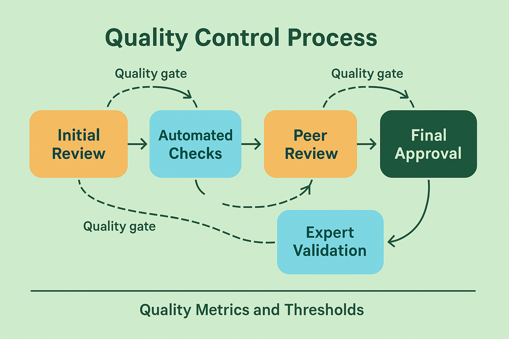

# Quality Control and Consensus Building: Ensuring Reliable Collaborative Evaluation

## Introduction

Quality control and consensus building represent the cornerstone of reliable collaborative evaluation systems. While human expertise brings invaluable judgment and contextual understanding to AI evaluation, it also introduces variability that must be systematically managed to ensure consistent, reliable results. Effective quality control frameworks transform the inherent subjectivity of human evaluation into structured, repeatable processes that deliver measurable business value.

The challenge of quality control in collaborative evaluation extends beyond simple error detection. It encompasses establishing shared understanding of evaluation criteria, maintaining consistency across diverse evaluator populations, building consensus around complex or ambiguous cases, and continuously improving evaluation processes based on performance data. Organizations that master these quality control capabilities achieve evaluation reliability that rivals or exceeds automated systems while retaining the nuanced judgment that only human expertise can provide.

Consider the transformation achieved by a major technology company that implemented comprehensive quality control for its AI content recommendation system. Initially, human evaluators showed agreement rates of only 65% on content quality assessments, leading to inconsistent training data and poor model performance. After implementing systematic quality control processes including standardized training, peer review mechanisms, and consensus-building protocols, inter-evaluator agreement improved to 92% while evaluation throughput increased by 35%. This improvement directly translated to better AI model performance and increased user engagement.

The business impact of effective quality control extends far beyond evaluation accuracy. Organizations with robust quality control processes report 40-60% reductions in evaluation-related rework, 25-35% improvements in downstream AI system performance, and 50-70% reductions in evaluation disputes and escalations. These improvements compound over time, creating sustainable competitive advantages through superior evaluation capabilities.

## Foundational Principles of Quality Control

Effective quality control in collaborative evaluation is built on several foundational principles that guide the design and implementation of quality assurance systems. These principles ensure that quality control efforts enhance rather than hinder evaluation effectiveness while maintaining the flexibility necessary for complex evaluation tasks.

**Systematic Standardization**

Standardization provides the foundation for consistent evaluation by establishing clear, shared understanding of evaluation criteria, processes, and expectations. However, standardization in human evaluation must balance consistency with the flexibility necessary for handling edge cases and evolving requirements.

Evaluation criteria standardization begins with developing comprehensive, unambiguous definitions of quality dimensions and assessment scales. Effective criteria are specific enough to guide consistent evaluation while flexible enough to accommodate the variability inherent in real-world content. Leading organizations invest significant effort in developing evaluation rubrics that include detailed descriptions, concrete examples, and guidance for handling common edge cases.

Process standardization establishes consistent workflows that evaluators follow regardless of their individual preferences or working styles. Standardized processes reduce variability while ensuring that all necessary evaluation steps are completed. However, process standardization must accommodate legitimate variations in evaluator expertise and task complexity.

Training standardization ensures that all evaluators receive consistent preparation for evaluation tasks. Standardized training programs include evaluation criteria, tool usage, quality expectations, and escalation procedures. Effective training programs combine theoretical instruction with hands-on practice and ongoing reinforcement.

Documentation standardization creates consistent formats and requirements for evaluation outputs. Standardized documentation improves the usability of evaluation results while supporting quality assurance and continuous improvement efforts.

**Multi-Layer Validation**

Robust quality control implements multiple validation layers that catch different types of errors and inconsistencies. These layers work together to ensure evaluation reliability while providing feedback for continuous improvement.

Automated validation catches obvious errors and inconsistencies that can be detected through rule-based or statistical analysis. These checks include impossible rating combinations, evaluation times that suggest insufficient attention, and results that deviate significantly from statistical norms. While automated validation cannot assess evaluation quality directly, it provides valuable early warning signals for potential issues.

Peer validation involves experienced evaluators reviewing samples of their colleagues' work to assess quality and consistency. Effective peer validation programs establish clear review criteria, provide structured feedback mechanisms, and track reviewer performance over time. Research demonstrates that peer validation can improve evaluation quality by 15-25% while building shared understanding of evaluation standards.

Expert validation involves senior domain experts reviewing challenging or high-stakes evaluation cases to ensure accuracy and appropriateness. Expert validation provides the highest quality assurance but is resource-intensive and must be used strategically for maximum impact.

Statistical validation uses quantitative analysis to identify patterns and outliers in evaluation data. This validation includes inter-annotator agreement analysis, evaluation time analysis, and quality trend tracking. Statistical validation provides objective performance data that supports evaluator feedback and system improvement.

**Continuous Improvement Integration**

Quality control systems must be designed to support continuous improvement rather than simply detecting and correcting errors. This requires systematic collection and analysis of quality data, regular review of quality control processes, and mechanisms for implementing improvements based on lessons learned.

Performance monitoring tracks quality metrics over time to identify trends, patterns, and improvement opportunities. Effective monitoring systems provide real-time feedback to evaluators while generating aggregate data for system-level analysis.

Root cause analysis investigates quality issues to understand their underlying causes and develop targeted solutions. This analysis goes beyond identifying what went wrong to understand why it happened and how similar issues can be prevented.

Process optimization uses quality data to identify and implement improvements in evaluation workflows, training programs, and quality control mechanisms. Optimization efforts should be data-driven and systematically evaluated to ensure they deliver intended benefits.

Knowledge capture and sharing ensures that lessons learned from quality control efforts are preserved and disseminated across the organization. This includes updating training materials, revising evaluation guidelines, and sharing best practices across evaluation teams.

## Consensus Building Methodologies

Building consensus among human evaluators represents one of the most challenging aspects of collaborative evaluation, particularly for subjective or culturally sensitive content. Effective consensus building methodologies balance the need for agreement with respect for legitimate differences in perspective and expertise.

**Structured Consensus Processes**

Structured consensus processes provide systematic approaches for reaching agreement on challenging evaluation cases while maintaining efficiency and quality. These processes must be carefully designed to avoid common pitfalls such as groupthink, anchoring bias, and coordination overhead.

The Delphi method involves multiple rounds of independent evaluation followed by controlled feedback and discussion. Evaluators first assess content independently, then receive anonymized summaries of group responses and rationale. Subsequent rounds allow evaluators to revise their assessments based on group feedback while maintaining independence. Research shows that the Delphi method can achieve consensus on 80-90% of cases within 2-3 rounds while maintaining high evaluation quality.

Nominal group technique brings evaluators together for structured discussion and decision-making. The process begins with independent evaluation, followed by round-robin sharing of perspectives, group discussion of differences, and final voting. This technique works well for complex cases where face-to-face discussion adds value while maintaining systematic structure.

Consensus development conferences involve larger groups of stakeholders in developing evaluation standards and resolving complex cases. These conferences use structured facilitation techniques to ensure productive discussion while managing group dynamics. While resource-intensive, consensus conferences can establish evaluation standards that have broad acceptance and legitimacy.

Modified consensus approaches adapt traditional consensus methods for specific evaluation contexts. These might include weighted voting based on evaluator expertise, threshold-based consensus that requires agreement from a specified percentage of evaluators, or hierarchical consensus that escalates disagreements to higher levels of expertise.

**Conflict Resolution Mechanisms**

Even with well-designed consensus processes, conflicts and disagreements will arise in collaborative evaluation. Effective conflict resolution mechanisms provide systematic approaches for handling these situations while maintaining evaluation quality and team cohesion.

Structured mediation involves neutral facilitators helping evaluators work through disagreements to reach mutually acceptable resolutions. Effective mediation focuses on understanding different perspectives, identifying common ground, and developing solutions that address underlying concerns.

Expert arbitration escalates unresolved conflicts to senior domain experts who make final decisions based on their expertise and understanding of evaluation standards. Arbitration provides definitive resolution while maintaining respect for the evaluation process.

Evidence-based resolution requires evaluators to provide specific evidence and rationale for their positions. This approach encourages thoughtful consideration of evaluation criteria while providing a framework for objective assessment of different perspectives.

Majority rule systems resolve conflicts through voting mechanisms that respect minority perspectives while enabling decision-making. These systems work well when combined with documentation requirements that capture dissenting views and rationale.

**Cultural and Contextual Considerations**

Consensus building in global evaluation teams must account for cultural differences in communication styles, decision-making preferences, and evaluation perspectives. These differences can enrich evaluation quality when properly managed but can also create challenges for consensus building.

Cultural communication patterns affect how evaluators express disagreement, provide feedback, and participate in group discussions. Some cultures emphasize direct communication and open disagreement, while others prioritize harmony and indirect communication. Effective consensus processes accommodate these differences through multiple communication channels and culturally sensitive facilitation.

Contextual expertise differences arise when evaluators have different backgrounds, experiences, and domain knowledge. These differences can provide valuable perspectives but can also create challenges for reaching consensus. Effective processes recognize and leverage expertise differences while maintaining respect for all perspectives.

Language and translation considerations become important when evaluation teams span multiple languages. Consensus building processes must account for potential translation issues, cultural concepts that don't translate directly, and varying levels of language proficiency.

Time zone and scheduling challenges affect global evaluation teams' ability to participate in synchronous consensus building activities. Effective processes provide both synchronous and asynchronous options while ensuring all team members have opportunities to contribute.

## Statistical Quality Assurance Methods

Statistical methods provide objective, quantitative approaches to quality assurance that complement subjective quality assessment. These methods help identify patterns, trends, and outliers that might not be apparent through manual review while providing data-driven insights for improvement.

**Inter-Annotator Agreement Analysis**

Inter-annotator agreement analysis measures the consistency of evaluation results across different evaluators, providing quantitative assessment of evaluation reliability. Different statistical measures capture different aspects of agreement and are appropriate for different types of evaluation tasks.

Percent agreement measures the simple proportion of cases where evaluators provide identical assessments. While easy to calculate and interpret, percent agreement doesn't account for chance agreement and can be misleading for tasks with unbalanced category distributions. Percent agreement is most useful for initial quality assessment and trend monitoring.

Cohen's kappa adjusts for chance agreement between two evaluators, providing a more robust measure of true agreement. Kappa values range from -1 to 1, with values above 0.8 generally considered excellent agreement. Cohen's kappa works well for categorical evaluation tasks with two evaluators.

Fleiss' kappa extends Cohen's kappa to multiple evaluators, providing agreement measures for larger evaluation teams. This measure is particularly valuable for consensus-building scenarios where multiple evaluators assess the same content. Fleiss' kappa interpretation follows similar guidelines to Cohen's kappa.

Intraclass correlation coefficient (ICC) measures agreement for continuous rating scales, providing more nuanced assessment of evaluator consistency than categorical measures. ICC is particularly valuable for quality rating tasks where evaluators provide numerical scores rather than categorical classifications.

Krippendorff's alpha provides a comprehensive agreement measure that handles multiple evaluators, different data types, and missing data. While more complex to calculate, Krippendorff's alpha provides the most robust agreement assessment for complex evaluation scenarios.

**Quality Trend Analysis**

Quality trend analysis tracks evaluation quality metrics over time to identify patterns, improvements, and potential issues. This analysis provides early warning signals for quality problems while demonstrating the effectiveness of quality improvement efforts.

Longitudinal agreement tracking monitors inter-annotator agreement rates over time to identify trends and patterns. Declining agreement rates may indicate evaluator fatigue, changing evaluation standards, or inadequate training. Improving agreement rates demonstrate the effectiveness of quality improvement efforts.

Evaluator performance tracking monitors individual evaluator quality metrics to identify high performers, training needs, and potential issues. This tracking should balance accountability with support, providing feedback and development opportunities rather than punitive measures.

Quality variance analysis examines the distribution of quality metrics to identify outliers and patterns. High variance may indicate inconsistent evaluation standards or inadequate training, while low variance may suggest overly rigid evaluation criteria.

Temporal pattern analysis examines how evaluation quality varies across different time periods, identifying factors that affect quality such as workload, training cycles, or external events.

**Predictive Quality Modeling**

Advanced statistical approaches use machine learning and predictive modeling to anticipate quality issues and optimize quality control processes. These approaches leverage historical quality data to identify patterns and predict future quality outcomes.

Evaluator performance prediction models use historical performance data to predict which evaluators are likely to produce high-quality results for specific types of evaluation tasks. These models can inform task assignment decisions while identifying evaluators who might benefit from additional training or support.

Quality risk assessment models identify evaluation cases that are likely to have quality issues based on content characteristics, evaluator assignments, and historical patterns. These models enable proactive quality control by focusing attention on high-risk cases.

Optimal sampling strategies use statistical modeling to determine the most effective approaches for quality control sampling. These strategies balance quality assurance coverage with resource constraints while maximizing the probability of detecting quality issues.

Dynamic quality thresholds adapt quality control criteria based on ongoing performance data and changing requirements. These adaptive approaches maintain appropriate quality standards while accommodating legitimate variations in evaluation difficulty and context.

## Implementation Frameworks for Quality Control

Implementing effective quality control requires systematic frameworks that address technology infrastructure, process design, human resource management, and performance monitoring. These frameworks provide roadmaps for organizations seeking to establish or improve their quality control capabilities.

**Technology Infrastructure for Quality Control**

Modern quality control systems require sophisticated technology infrastructure that supports automated monitoring, statistical analysis, and collaborative quality assurance processes. This infrastructure must integrate seamlessly with evaluation workflows while providing comprehensive quality oversight.

Quality monitoring dashboards provide real-time visibility into evaluation quality metrics, enabling proactive identification and resolution of quality issues. Effective dashboards present key metrics clearly while providing drill-down capabilities for detailed analysis.

Automated quality checking systems implement rule-based and statistical validation to identify potential quality issues automatically. These systems should provide immediate feedback to evaluators while generating alerts for quality assurance teams.

Statistical analysis platforms support sophisticated quality analysis including inter-annotator agreement calculation, trend analysis, and predictive modeling. These platforms should integrate with evaluation data systems while providing user-friendly interfaces for quality analysts.

Collaboration tools support quality assurance processes including peer review, consensus building, and expert consultation. These tools should integrate with evaluation workflows while providing appropriate communication and coordination capabilities.

**Process Design and Documentation**

Systematic process design ensures that quality control activities are efficient, effective, and consistently applied across evaluation teams. Process documentation provides clear guidance for quality control activities while supporting training and continuous improvement efforts.

Quality control workflows define the step-by-step processes for different types of quality assurance activities. These workflows should be detailed enough to ensure consistency while flexible enough to accommodate different evaluation contexts and requirements.

Escalation procedures establish clear protocols for handling quality issues, disputes, and complex cases. These procedures should define roles and responsibilities while ensuring timely resolution of quality concerns.

Quality standards documentation provides comprehensive guidance on evaluation criteria, quality expectations, and assessment methods. This documentation should be regularly updated based on lessons learned and changing requirements.

Training and certification programs ensure that quality control personnel have the knowledge and skills necessary for effective quality assurance. These programs should cover quality control methods, statistical analysis, and conflict resolution techniques.

**Organizational Integration Strategies**

Quality control systems must be integrated effectively with broader organizational structures and processes to ensure sustainability and effectiveness. This integration requires attention to governance, incentives, and cultural factors that affect quality control success.

Governance structures establish clear accountability and decision-making authority for quality control activities. Effective governance balances centralized standards with distributed implementation while ensuring appropriate oversight and support.

Incentive alignment ensures that quality control activities are appropriately recognized and rewarded within organizational performance management systems. This includes both individual incentives for quality performance and team incentives for collaborative quality improvement.

Cultural integration embeds quality control values and practices into organizational culture rather than treating them as external compliance requirements. This requires leadership commitment, clear communication of quality importance, and celebration of quality achievements.

Change management processes support the implementation and evolution of quality control systems while managing resistance and ensuring adoption. Effective change management includes stakeholder engagement, communication planning, and systematic rollout strategies.

## Advanced Quality Control Techniques

As quality control systems mature, advanced techniques can provide additional value for complex evaluation scenarios and sophisticated quality requirements. These techniques represent the state-of-the-art in collaborative evaluation quality assurance.

**Machine Learning-Enhanced Quality Control**

Machine learning techniques can augment human quality control capabilities by identifying patterns, predicting issues, and optimizing quality control processes. These techniques must be carefully implemented to enhance rather than replace human judgment.

Anomaly detection algorithms identify evaluation results that deviate significantly from expected patterns, flagging potential quality issues for human review. These algorithms can detect subtle patterns that might escape manual review while reducing the burden on human quality controllers.

Quality prediction models use historical data to predict the likelihood of quality issues for specific evaluation tasks or evaluator assignments. These models enable proactive quality control by focusing attention on high-risk scenarios.

Automated feedback systems provide real-time guidance to evaluators based on their evaluation patterns and historical performance. These systems can suggest improvements while maintaining evaluator autonomy and judgment.

Intelligent sampling algorithms optimize quality control sampling strategies based on risk assessment, resource constraints, and quality objectives. These algorithms can improve quality control effectiveness while reducing costs.

**Adaptive Quality Control Systems**

Adaptive quality control systems modify their behavior based on ongoing performance data and changing requirements. These systems provide more responsive and effective quality assurance while reducing administrative overhead.

Dynamic threshold adjustment modifies quality control criteria based on evaluation difficulty, evaluator experience, and performance trends. This adaptation maintains appropriate quality standards while accommodating legitimate variations in evaluation context.

Personalized quality feedback provides evaluator-specific guidance based on individual performance patterns and development needs. This personalization improves the effectiveness of quality feedback while supporting evaluator development.

Context-aware quality control adapts quality assurance processes based on evaluation task characteristics, content types, and business requirements. This adaptation ensures that quality control efforts are appropriately matched to quality risks and requirements.

Continuous learning systems update quality control models and processes based on ongoing performance data and feedback. These systems enable quality control capabilities to improve over time while adapting to changing requirements.

## Case Studies in Quality Control Implementation

Real-world implementations of quality control systems provide valuable insights into the challenges and opportunities of building effective quality assurance capabilities. These case studies demonstrate how different organizations have successfully implemented quality control across various domains and scales.

**Case Study 1: Global Content Platform Quality Control**

A major social media platform implemented comprehensive quality control for content moderation across multiple languages and cultures. The system needed to maintain consistent quality standards while accommodating cultural differences and scaling to handle millions of evaluation tasks daily.

The platform's approach combined automated quality checking with human oversight across multiple validation layers. Automated systems performed initial consistency checks and statistical monitoring, while human reviewers conducted peer validation and expert review for complex cases.

Key innovations included cultural adaptation frameworks that adjusted quality standards for different cultural contexts, real-time quality monitoring that provided immediate feedback to moderators, and machine learning systems that predicted quality issues based on content characteristics and moderator performance patterns.

The implementation achieved significant improvements in content moderation quality while maintaining operational efficiency. Inter-annotator agreement improved from 72% to 94% across all languages, while evaluation throughput increased by 45%. The system successfully handled cultural variations while maintaining global quality standards.

**Case Study 2: Healthcare AI Quality Assurance**

A healthcare technology company implemented rigorous quality control for evaluating AI-assisted diagnostic tools. The system needed to ensure clinical accuracy while supporting regulatory compliance and maintaining physician confidence in AI recommendations.

The quality control framework combined clinical expertise with statistical validation across multiple specialties. Board-certified physicians conducted primary evaluations, while statistical analysis identified patterns and outliers that required additional review.

Key features included multi-specialty review processes that ensured appropriate clinical expertise for different diagnostic domains, longitudinal outcome tracking that validated evaluation accuracy against patient outcomes, and regulatory compliance frameworks that met FDA requirements for AI system validation.

Results demonstrated the critical importance of rigorous quality control in healthcare applications. The system achieved 98% accuracy in clinical evaluations while identifying AI system limitations that prevented potential diagnostic errors. Physician confidence in AI recommendations increased by 60% following implementation of comprehensive quality control.

**Case Study 3: Financial Services Risk Assessment**

A financial services company implemented quality control for evaluating AI-driven risk assessment models. The system needed to ensure regulatory compliance while maintaining competitive advantage through superior risk evaluation capabilities.

The quality control approach combined quantitative analysis with expert judgment across multiple risk domains. Statistical models provided initial risk assessments, while human experts validated results and assessed edge cases that required specialized knowledge.

Key components included regulatory compliance monitoring that ensured adherence to financial regulations, bias detection systems that identified potential discrimination in risk assessments, and performance tracking that validated risk model accuracy against actual outcomes.

Implementation results showed significant improvements in risk assessment quality and regulatory compliance. Model accuracy improved by 25% while regulatory compliance scores increased by 40%. The system successfully balanced automated efficiency with human oversight requirements.

## Future Directions in Quality Control

The field of quality control for collaborative evaluation continues to evolve rapidly, driven by advances in machine learning, changes in evaluation requirements, and innovations in human-computer collaboration. Understanding these trends helps organizations prepare for future quality control challenges and opportunities.

**AI-Augmented Quality Control**

Future quality control systems will increasingly leverage AI capabilities to augment human quality assurance while maintaining human oversight of critical decisions. These AI-augmented systems can improve both efficiency and effectiveness of quality control processes.

Intelligent quality monitoring systems will use machine learning to identify subtle quality patterns that might escape human notice. These systems will provide early warning signals for quality issues while reducing the burden on human quality controllers.

Automated quality coaching systems will provide personalized feedback and guidance to evaluators based on their performance patterns and development needs. These systems will support continuous improvement while maintaining evaluator autonomy.

Predictive quality management systems will anticipate quality issues before they occur, enabling proactive intervention and prevention. These systems will optimize quality control resource allocation while maintaining high quality standards.

**Distributed and Remote Quality Control**

The shift toward distributed and remote work has accelerated innovation in quality control technologies and processes. Organizations are developing new approaches to maintain quality standards across distributed evaluation teams.

Virtual quality control platforms provide comprehensive quality assurance capabilities for distributed teams. These platforms integrate communication, collaboration, and quality monitoring tools to support effective remote quality control.

Asynchronous quality control workflows enable quality assurance activities across different time zones and schedules. These workflows maintain quality standards while accommodating the flexibility requirements of distributed teams.

Global quality control networks leverage distributed expertise to provide comprehensive quality coverage across different domains and cultures. These networks require sophisticated coordination mechanisms while maintaining consistent quality standards.

## Conclusion

Quality control and consensus building represent critical capabilities for organizations implementing collaborative evaluation systems. These capabilities transform the inherent variability of human evaluation into structured, reliable processes that deliver measurable business value while maintaining the nuanced judgment that only human expertise can provide.

Success in quality control requires systematic attention to standardization, validation, consensus building, and continuous improvement. Organizations that invest in sophisticated quality control capabilities gain significant competitive advantages through superior evaluation reliability, reduced operational costs, and improved AI system performance.

The future of quality control lies in increasingly sophisticated collaboration between human expertise and artificial intelligence, with AI systems augmenting human quality assurance capabilities while human oversight ensures appropriate standards and ethical considerations. Organizations that master these collaborative approaches will be best positioned to build evaluation systems that meet the highest standards of quality and reliability.

As AI systems become more capable and are deployed in increasingly critical applications, the importance of rigorous quality control will only grow. The frameworks, methodologies, and practices outlined in this section provide a foundation for building quality control systems that can meet these evolving challenges while delivering sustainable competitive advantages.

---

**Next**: [Section 4: Inter-Annotator Agreement and Statistical Methods](04-inter-annotator-agreement.md)

