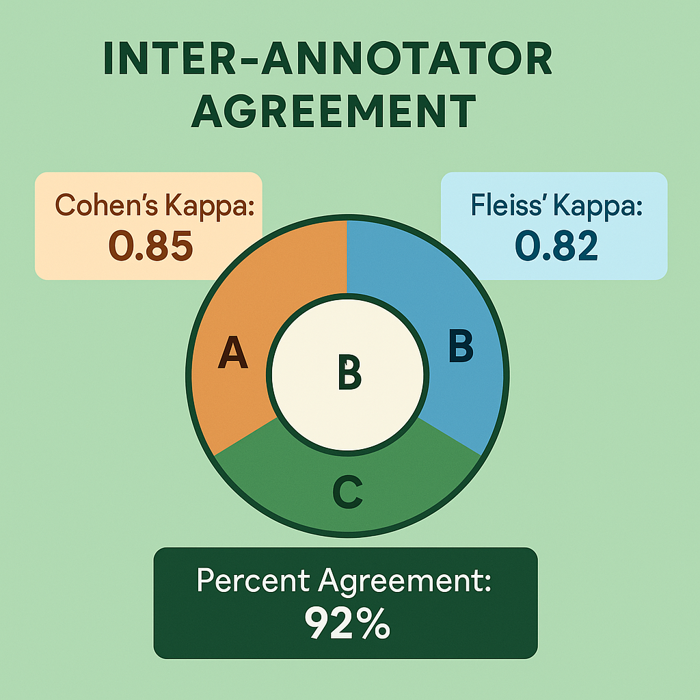

# Inter-Annotator Agreement and Statistical Methods: Measuring and Improving Evaluation Consistency



## Introduction

Inter-annotator agreement represents the cornerstone of reliable collaborative evaluation, providing quantitative measures of consistency across human evaluators. These statistical measures not only validate the reliability of evaluation results but also guide improvements in evaluation processes, training programs, and quality control mechanisms. Understanding and optimizing inter-annotator agreement is essential for building evaluation systems that deliver consistent, trustworthy results at scale.

The significance of inter-annotator agreement extends far beyond academic validation. In production AI systems, evaluation consistency directly impacts model training quality, performance measurement accuracy, and business decision-making reliability. Organizations with high inter-annotator agreement report 30-50% improvements in AI model performance, 40-60% reductions in evaluation-related disputes, and 25-35% increases in stakeholder confidence in evaluation results.

Consider the transformation achieved by a major e-commerce platform that systematically improved inter-annotator agreement for product recommendation evaluation. Initially, evaluators showed only 58% agreement on recommendation quality assessments, leading to inconsistent training data and poor model performance. Through systematic application of statistical methods, targeted training interventions, and process improvements, the platform achieved 89% inter-annotator agreement while reducing evaluation time by 25%. This improvement directly translated to 18% better recommendation accuracy and $12 million in additional revenue.

The challenge of measuring and improving inter-annotator agreement requires sophisticated understanding of statistical methods, human psychology, and evaluation process design. Different types of evaluation tasks require different statistical approaches, while improvement strategies must address both technical and human factors that affect consistency.

## Theoretical Foundations of Agreement Measurement

Understanding inter-annotator agreement requires grounding in statistical theory and measurement principles that guide the selection and interpretation of agreement metrics. These theoretical foundations help practitioners choose appropriate measures while avoiding common pitfalls in agreement analysis.

**Agreement vs. Reliability Concepts**

The distinction between agreement and reliability represents a fundamental concept in inter-annotator analysis. Agreement measures the extent to which evaluators provide identical responses, while reliability measures the consistency of relative rankings or patterns across evaluators. Understanding this distinction is crucial for selecting appropriate statistical measures and interpreting results correctly.

Absolute agreement requires evaluators to provide identical responses for the same content. This type of agreement is most relevant for categorical evaluation tasks where precise classification is important. High absolute agreement indicates that evaluators are applying evaluation criteria consistently and arriving at the same conclusions.

Relative agreement focuses on whether evaluators rank or order content consistently, even if their absolute ratings differ. This type of agreement is more relevant for continuous rating tasks where the relative ordering of quality is more important than precise numerical scores. Relative agreement can be high even when absolute agreement is moderate.

Systematic bias affects agreement measurements when evaluators consistently differ in their use of rating scales or interpretation of criteria. For example, one evaluator might consistently rate content higher than others while maintaining the same relative ordering. Understanding and accounting for systematic bias is important for accurate agreement interpretation.

Random error represents unsystematic variation in evaluator responses that reduces both agreement and reliability. Random error can result from fatigue, distraction, unclear criteria, or genuine uncertainty about evaluation decisions. Reducing random error typically improves both agreement and evaluation quality.

**Chance Agreement Considerations**

All agreement measures must account for the possibility that evaluators might agree by chance rather than through genuine consensus. Chance agreement becomes particularly important when evaluation categories are unbalanced or when the number of possible responses is limited.

Expected chance agreement varies based on the distribution of responses across evaluation categories. When most content falls into a single category, evaluators are likely to agree frequently by chance alone. Conversely, when content is evenly distributed across categories, chance agreement is lower.

Base rate effects influence chance agreement calculations when some evaluation categories are much more common than others. For example, if 90% of content receives a "good" rating, evaluators will agree on "good" ratings frequently by chance. Agreement measures must account for these base rate effects to provide meaningful results.

Marginal distributions affect chance agreement when evaluators have different tendencies to use certain rating categories. Some evaluators might be more generous in their ratings, while others might be more critical. These differences in marginal distributions must be considered in agreement calculations.

**Statistical Assumptions and Limitations**

Agreement measures rely on various statistical assumptions that must be understood and validated for accurate interpretation. Violating these assumptions can lead to misleading results and incorrect conclusions about evaluation quality.

Independence assumptions require that evaluation decisions are made independently without influence from other evaluators or external factors. Violations of independence can artificially inflate agreement measures and lead to overconfidence in evaluation consistency.

Distributional assumptions underlie many agreement measures and affect their interpretation. Some measures assume normal distributions of ratings, while others are designed for categorical data. Using inappropriate measures for the data type can produce misleading results.

Sample size requirements vary across different agreement measures, with some requiring larger samples for reliable estimation. Small samples can produce unstable agreement estimates that don't generalize to larger evaluation populations.

Missing data considerations become important when evaluators don't assess all content or when some evaluations are excluded due to quality concerns. Different agreement measures handle missing data differently, and the approach to missing data can significantly affect results.

## Statistical Measures of Agreement

Different statistical measures capture different aspects of inter-annotator agreement and are appropriate for different types of evaluation tasks. Understanding the strengths and limitations of each measure is essential for selecting appropriate approaches and interpreting results correctly.

**Categorical Agreement Measures**

Categorical agreement measures are designed for evaluation tasks where content is classified into discrete categories. These measures vary in their sophistication and ability to account for chance agreement and other confounding factors.

Percent agreement represents the simplest measure of categorical agreement, calculated as the proportion of cases where evaluators provide identical classifications. While easy to calculate and interpret, percent agreement doesn't account for chance agreement and can be misleading when category distributions are unbalanced.

The formula for percent agreement is:
```
Percent Agreement = (Number of Agreements) / (Total Number of Cases) × 100
```

Percent agreement is most useful for initial quality assessment and trend monitoring but should be supplemented with more sophisticated measures for formal reliability analysis.

Cohen's kappa adjusts percent agreement for chance agreement between two evaluators, providing a more robust measure of true agreement. Kappa values range from -1 to 1, with 0 indicating chance-level agreement and 1 indicating perfect agreement. Negative values indicate agreement worse than chance.

The formula for Cohen's kappa is:
```
κ = (Po - Pe) / (1 - Pe)
```
Where Po is observed agreement and Pe is expected chance agreement.

Interpretation guidelines for Cohen's kappa suggest:
- κ < 0.20: Poor agreement
- κ = 0.21-0.40: Fair agreement  
- κ = 0.41-0.60: Moderate agreement
- κ = 0.61-0.80: Good agreement
- κ = 0.81-1.00: Excellent agreement

Fleiss' kappa extends Cohen's kappa to multiple evaluators, providing agreement measures for larger evaluation teams. This measure is particularly valuable for consensus-building scenarios where multiple evaluators assess the same content. Fleiss' kappa uses the same interpretation guidelines as Cohen's kappa.

Weighted kappa accounts for the severity of disagreements by assigning different weights to different types of errors. For example, disagreeing between "excellent" and "good" might be weighted less severely than disagreeing between "excellent" and "poor." Weighted kappa is particularly useful for ordinal rating scales where some disagreements are more serious than others.

**Continuous Agreement Measures**

Continuous agreement measures are designed for evaluation tasks where content receives numerical ratings or scores. These measures capture different aspects of agreement and are sensitive to different types of evaluator differences.

Pearson correlation coefficient measures the linear relationship between evaluators' ratings, indicating whether evaluators tend to rate content similarly relative to other content. High correlations indicate that evaluators rank content consistently, even if their absolute ratings differ.

The formula for Pearson correlation is:
```
r = Σ[(xi - x̄)(yi - ȳ)] / √[Σ(xi - x̄)²Σ(yi - ȳ)²]
```

Pearson correlation ranges from -1 to 1, with values above 0.7 generally considered strong agreement for evaluation purposes.

Intraclass correlation coefficient (ICC) provides a more comprehensive measure of agreement for continuous ratings by accounting for both correlation and absolute agreement. ICC is particularly valuable when absolute rating values are important, not just relative rankings.

ICC comes in several forms:
- ICC(1,1): Single measures, absolute agreement
- ICC(2,1): Single measures, consistency  
- ICC(3,1): Single measures, absolute agreement with fixed evaluators
- ICC(1,k): Average measures, absolute agreement
- ICC(2,k): Average measures, consistency
- ICC(3,k): Average measures, absolute agreement with fixed evaluators

ICC interpretation follows similar guidelines to correlation coefficients, with values above 0.75 indicating good agreement and values above 0.9 indicating excellent agreement.

Mean absolute difference (MAD) measures the average absolute difference between evaluators' ratings, providing a direct measure of rating discrepancy. MAD is easy to interpret and provides practical information about the magnitude of disagreements.

The formula for MAD is:
```
MAD = Σ|xi - yi| / n
```

MAD should be interpreted relative to the rating scale range. For example, a MAD of 0.5 on a 1-10 scale represents relatively good agreement, while the same MAD on a 1-5 scale indicates more substantial disagreement.

**Advanced Agreement Measures**

Advanced agreement measures address specific challenges in inter-annotator agreement analysis, such as multiple evaluators, complex rating schemes, and missing data. These measures provide more sophisticated analysis capabilities for complex evaluation scenarios.

Krippendorff's alpha provides a comprehensive agreement measure that handles multiple evaluators, different data types, and missing data. Alpha is designed to work with nominal, ordinal, interval, and ratio data while providing consistent interpretation across different measurement levels.

Krippendorff's alpha ranges from 0 to 1, with interpretation guidelines:
- α ≥ 0.80: Acceptable for most purposes
- α ≥ 0.67: Acceptable for exploratory research
- α < 0.67: Questionable reliability

Alpha's ability to handle missing data and different data types makes it particularly valuable for complex evaluation scenarios where other measures might not be appropriate.

Gwet's AC coefficients provide alternative agreement measures that are less sensitive to trait prevalence than kappa-based measures. These coefficients can provide more stable agreement estimates when category distributions are highly unbalanced.

Bennett's S statistic provides a chance-corrected agreement measure that assumes equal probability for all categories. While less sophisticated than kappa-based measures, Bennett's S can be useful when category probabilities are unknown or when simple interpretation is preferred.

Multi-rater kappa extends traditional kappa measures to scenarios with varying numbers of evaluators per case. This measure is useful when not all evaluators assess all content, which is common in large-scale evaluation scenarios.

## Practical Implementation of Agreement Analysis

Implementing inter-annotator agreement analysis requires systematic approaches to data collection, statistical calculation, and result interpretation. Practical implementation must balance statistical rigor with operational efficiency while providing actionable insights for evaluation improvement.

**Data Collection and Preparation**

Effective agreement analysis begins with careful data collection and preparation that ensures statistical validity while supporting practical evaluation requirements. Data collection strategies must balance the need for reliable agreement estimates with operational constraints and costs.

Sample size planning determines the number of cases needed for reliable agreement estimates. Larger samples provide more stable estimates but require more resources. Statistical power analysis can guide sample size decisions by determining the minimum sample needed to detect meaningful differences in agreement.

For categorical data, samples of 50-100 cases typically provide reasonable agreement estimates, while continuous data may require larger samples for stable correlation estimates. Complex evaluation tasks with many categories or evaluators may require even larger samples.

Stratified sampling ensures that agreement analysis covers different types of content or evaluation scenarios. Random sampling might miss important edge cases or fail to represent the full range of evaluation challenges. Stratified approaches ensure comprehensive coverage while maintaining statistical validity.

Evaluator selection affects agreement results and must be carefully considered. Agreement analysis should include evaluators who are representative of the broader evaluation population. Including only expert evaluators might overestimate agreement, while including only novices might underestimate it.

Data quality checks identify and address issues that could affect agreement analysis. These checks include identifying incomplete evaluations, detecting obvious errors, and ensuring that all evaluators used the same evaluation criteria and procedures.

**Statistical Calculation Procedures**

Calculating agreement statistics requires attention to methodological details that can significantly affect results. Proper calculation procedures ensure accurate estimates while avoiding common pitfalls that can lead to misleading conclusions.

Software selection affects both calculation accuracy and analysis capabilities. Statistical packages like R, SPSS, and SAS provide comprehensive agreement analysis capabilities, while specialized tools like MATLAB or Python libraries offer more flexibility for custom analyses.

Popular R packages for agreement analysis include:
- `irr`: Inter-rater reliability measures
- `psych`: Psychological statistics including ICC
- `rel`: Reliability analysis tools
- `agreement`: Comprehensive agreement measures

Confidence interval calculation provides important information about the precision of agreement estimates. Agreement measures are sample statistics that have associated uncertainty, and confidence intervals help interpret the practical significance of observed agreement levels.

Bootstrap methods can provide robust confidence intervals for agreement measures, particularly when distributional assumptions are questionable. Bootstrap approaches repeatedly resample the data to estimate the sampling distribution of agreement statistics.

Missing data handling requires careful consideration of the mechanisms that produce missing data and their potential impact on agreement estimates. Different agreement measures handle missing data differently, and the chosen approach can significantly affect results.

**Result Interpretation and Reporting**

Interpreting agreement results requires understanding both statistical significance and practical significance. High statistical agreement doesn't necessarily indicate adequate evaluation quality, while moderate statistical agreement might be sufficient for some practical applications.

Contextual interpretation considers the specific evaluation task, consequences of disagreement, and available alternatives when assessing whether observed agreement levels are adequate. High-stakes evaluation tasks typically require higher agreement levels than exploratory or developmental evaluations.

Comparative analysis examines agreement levels relative to benchmarks, previous studies, or alternative evaluation approaches. This comparison helps assess whether observed agreement represents good performance or indicates need for improvement.

Trend analysis tracks agreement levels over time to identify improvements, deteriorations, or patterns in evaluation consistency. Longitudinal analysis can reveal the effects of training interventions, process changes, or other improvement efforts.

Reporting standards ensure that agreement analysis results are communicated clearly and completely. Reports should include the specific measures used, sample characteristics, confidence intervals, and practical interpretation of results.

## Strategies for Improving Agreement

Improving inter-annotator agreement requires systematic approaches that address the multiple factors affecting evaluation consistency. Effective improvement strategies combine training interventions, process modifications, and ongoing monitoring to achieve sustainable improvements in agreement levels.

**Training and Calibration Approaches**

Training represents the most direct approach to improving inter-annotator agreement by ensuring that evaluators have shared understanding of evaluation criteria and procedures. Effective training programs combine theoretical instruction with practical exercises and ongoing calibration activities.

Criterion-based training focuses on developing clear, shared understanding of evaluation criteria through detailed explanation, examples, and practice. This training should cover not only what to evaluate but how to apply evaluation criteria consistently across different types of content.

Effective criterion training includes:
- Detailed rubrics with specific quality indicators
- Extensive examples of different quality levels
- Practice exercises with immediate feedback
- Discussion of edge cases and ambiguous situations
- Regular refresher training to maintain consistency

Consensus-building exercises bring evaluators together to discuss challenging cases and develop shared approaches to difficult evaluation decisions. These exercises help identify sources of disagreement while building team consensus around evaluation standards.

Calibration sessions involve evaluators assessing the same content and comparing their results to identify differences and develop consistency. Regular calibration helps maintain agreement over time while identifying evaluators who might need additional training or support.

Expert-led training involves experienced evaluators or domain experts providing guidance and feedback to less experienced team members. This mentoring approach can be particularly effective for complex evaluation tasks that require specialized knowledge or judgment.

**Process Design Modifications**

Process modifications can significantly improve agreement by reducing sources of variability and providing better support for consistent evaluation. These modifications address structural factors that affect evaluation consistency.

Evaluation guideline refinement involves updating and improving evaluation criteria based on agreement analysis results. Guidelines should be specific enough to promote consistency while flexible enough to handle legitimate variations in content and context.

Effective guidelines include:
- Clear definitions of evaluation criteria
- Specific examples of different quality levels
- Guidance for handling edge cases
- Procedures for escalating difficult decisions
- Regular updates based on experience and feedback

Task decomposition breaks complex evaluation tasks into smaller, more manageable components that can be evaluated more consistently. This approach reduces cognitive load while allowing evaluators to focus on specific aspects of quality.

Sequential evaluation processes have evaluators assess different aspects of content in a specific order, reducing the cognitive complexity of simultaneous multi-dimensional evaluation. This approach can improve consistency while maintaining comprehensive evaluation coverage.

Reference standard development creates benchmark examples that evaluators can use for comparison during evaluation. These standards provide concrete anchors for evaluation decisions while reducing reliance on subjective judgment alone.

**Technology-Assisted Improvement**

Technology solutions can support agreement improvement by providing better tools, feedback, and guidance for evaluators. These solutions augment human capabilities while maintaining human control over evaluation decisions.

Real-time feedback systems provide immediate information about evaluation patterns and potential inconsistencies. These systems can alert evaluators when their ratings deviate significantly from typical patterns while providing suggestions for improvement.

Intelligent highlighting systems use machine learning to identify content features that are most relevant for evaluation decisions. These systems can help evaluators focus their attention on the most important aspects of content while reducing the likelihood of missing critical information.

Comparative evaluation interfaces present multiple examples simultaneously to support more consistent relative judgments. These interfaces can reduce absolute rating variability while improving the consistency of relative quality assessments.

Automated consistency checking identifies obvious inconsistencies in evaluation results and prompts evaluators to review their decisions. These checks can catch simple errors while encouraging more careful evaluation.

## Advanced Statistical Techniques

Advanced statistical techniques provide deeper insights into agreement patterns and support more sophisticated approaches to agreement improvement. These techniques are particularly valuable for complex evaluation scenarios with multiple evaluators, diverse content types, or evolving evaluation requirements.

**Multilevel Agreement Analysis**

Multilevel analysis examines agreement at different levels of granularity, providing insights into sources of variability and opportunities for improvement. This analysis can reveal whether disagreements are systematic or random and whether they vary across different types of content or evaluators.

Evaluator-level analysis examines agreement patterns for individual evaluators, identifying those who consistently agree or disagree with others. This analysis can guide targeted training interventions while identifying evaluators who might serve as calibration anchors.

Content-level analysis examines agreement patterns for different types of content, identifying categories or characteristics that are particularly difficult to evaluate consistently. This analysis can guide improvements in evaluation criteria or training materials.

Task-level analysis examines agreement patterns across different evaluation dimensions or criteria, identifying aspects of evaluation that are most and least reliable. This analysis can guide process improvements and resource allocation decisions.

Temporal analysis examines how agreement changes over time, identifying trends, cycles, or events that affect evaluation consistency. This analysis can reveal the effects of training interventions, process changes, or external factors on agreement levels.

**Latent Variable Modeling**

Latent variable models provide sophisticated approaches to understanding the underlying factors that drive agreement and disagreement among evaluators. These models can reveal hidden patterns while providing more nuanced understanding of evaluation processes.

Item response theory (IRT) models treat evaluation tasks as test items and evaluators as test-takers, providing insights into both task difficulty and evaluator ability. IRT models can identify evaluation tasks that are particularly difficult or discriminating while assessing evaluator performance.

Factor analysis examines the underlying dimensions of evaluation tasks, identifying whether apparent disagreements reflect different aspects of quality rather than true inconsistency. This analysis can guide the development of more focused evaluation criteria.

Mixture models identify subgroups of evaluators or content that show different agreement patterns. These models can reveal whether apparent disagreement reflects legitimate differences in perspective rather than evaluation errors.

Hierarchical models account for nested structures in evaluation data, such as evaluators within teams or content within categories. These models provide more accurate agreement estimates while identifying sources of variability at different organizational levels.

**Predictive Agreement Modeling**

Predictive models use historical agreement data to anticipate future agreement patterns and optimize evaluation processes. These models can guide resource allocation decisions while identifying opportunities for proactive intervention.

Evaluator performance prediction models use historical data to predict which evaluators are likely to produce consistent results for specific types of evaluation tasks. These models can inform task assignment decisions while identifying evaluators who might benefit from additional training.

Content difficulty prediction models identify evaluation tasks that are likely to produce low agreement based on content characteristics. These models enable proactive quality control by focusing attention on challenging cases.

Agreement trend prediction models forecast future agreement levels based on historical patterns and planned interventions. These models can guide strategic planning while setting realistic expectations for agreement improvement efforts.

Optimal sampling models determine the most effective approaches for agreement monitoring and quality control. These models balance agreement measurement accuracy with resource constraints while maximizing the probability of detecting agreement problems.

## Case Studies in Agreement Improvement

Real-world examples of agreement improvement initiatives provide valuable insights into the challenges and opportunities of enhancing evaluation consistency. These case studies demonstrate how different organizations have successfully improved agreement across various domains and scales.

**Case Study 1: Medical Imaging Agreement Enhancement**

A radiology practice implemented a comprehensive agreement improvement program for AI-assisted diagnostic evaluations. The initiative needed to achieve high agreement levels while maintaining diagnostic accuracy and clinical workflow efficiency.

Initial agreement analysis revealed significant variability in diagnostic assessments, with Cohen's kappa values ranging from 0.45 to 0.72 across different imaging modalities. This variability was affecting AI training data quality and reducing confidence in automated diagnostic tools.

The improvement program combined multiple interventions:
- Standardized diagnostic criteria with detailed imaging examples
- Regular calibration sessions using challenging cases
- Peer review processes with structured feedback
- Technology-assisted highlighting of relevant imaging features
- Ongoing statistical monitoring with real-time feedback

Implementation results showed substantial improvements in diagnostic agreement. Cohen's kappa values improved to 0.82-0.94 across all imaging modalities, while diagnostic accuracy increased by 15%. The program also reduced diagnostic time by 20% through improved efficiency and confidence.

Key success factors included strong physician leadership, comprehensive training programs, and technology solutions that supported rather than replaced clinical judgment. The program demonstrated that high agreement levels are achievable in complex medical domains through systematic improvement efforts.

**Case Study 2: Content Moderation Agreement Optimization**

A social media platform implemented agreement improvement initiatives for content moderation across multiple languages and cultural contexts. The challenge involved maintaining consistent moderation standards while accommodating cultural differences and scaling to handle millions of evaluation tasks.

Initial agreement analysis revealed significant variations across different content types and cultural contexts, with overall agreement rates of only 68%. This variability was affecting content quality and user experience while creating operational inefficiencies.

The improvement program addressed multiple sources of variability:
- Cultural adaptation of moderation guidelines for different regions
- Specialized training programs for different content types
- Consensus-building processes for challenging cases
- Machine learning systems that provided contextual guidance
- Statistical monitoring that identified agreement patterns and trends

Results demonstrated significant improvements in moderation consistency. Overall agreement rates improved to 91% while maintaining cultural sensitivity and operational efficiency. The program successfully balanced global consistency with local adaptation requirements.

Critical success factors included cultural expertise, flexible technology platforms, and systematic approaches to guideline development and training. The program showed that high agreement is achievable even in culturally diverse, high-volume evaluation scenarios.

**Case Study 3: Financial Risk Assessment Agreement**

A financial services company implemented agreement improvement for AI-driven credit risk evaluations. The initiative needed to achieve high agreement while maintaining regulatory compliance and competitive advantage through superior risk assessment capabilities.

Initial analysis revealed moderate agreement levels (ICC = 0.67) that were affecting model training quality and regulatory confidence. Disagreements were particularly common for edge cases and emerging risk patterns that weren't well-covered by existing guidelines.

The improvement program focused on systematic enhancement of evaluation capabilities:
- Enhanced risk assessment criteria based on regulatory requirements
- Expert-led training programs with case-based learning
- Collaborative evaluation processes for complex cases
- Predictive models that identified high-disagreement cases
- Continuous monitoring with regulatory reporting integration

Implementation achieved significant improvements in risk assessment consistency. ICC values improved to 0.89 while regulatory compliance scores increased by 35%. The program also improved risk model accuracy by 22% through better training data quality.

Key success factors included regulatory expertise, systematic training approaches, and technology solutions that supported complex risk analysis. The program demonstrated that agreement improvement can deliver both operational and strategic benefits in regulated industries.

## Future Directions in Agreement Analysis

The field of inter-annotator agreement analysis continues to evolve rapidly, driven by advances in statistical methods, machine learning capabilities, and understanding of human evaluation processes. Emerging trends point toward more sophisticated, automated, and adaptive approaches to agreement measurement and improvement.

**AI-Enhanced Agreement Analysis**

Artificial intelligence technologies offer new possibilities for understanding and improving inter-annotator agreement. These technologies can identify subtle patterns in agreement data while providing more sophisticated support for agreement improvement efforts.

Machine learning models can predict agreement levels based on content characteristics, evaluator profiles, and task features. These predictions enable proactive quality control by identifying cases likely to produce disagreement before evaluation begins.

Natural language processing techniques can analyze evaluation comments and feedback to identify sources of disagreement and confusion. This analysis can guide improvements in evaluation criteria and training materials while providing insights into evaluator thought processes.

Computer vision approaches can analyze visual content to identify features that contribute to evaluation disagreement. These insights can guide the development of more objective evaluation criteria while supporting evaluator training and calibration efforts.

Automated pattern recognition can identify subtle agreement patterns that might escape manual analysis. These patterns can reveal hidden sources of variability while suggesting targeted improvement strategies.

**Dynamic Agreement Monitoring**

Future agreement analysis systems will provide real-time monitoring and adaptive responses to agreement patterns. These systems will enable more responsive quality control while reducing the administrative burden of agreement monitoring.

Real-time agreement calculation will provide immediate feedback about evaluation consistency as evaluations are completed. This immediate feedback enables rapid identification and correction of agreement problems while supporting continuous improvement efforts.

Adaptive sampling strategies will optimize agreement monitoring by focusing measurement efforts on high-risk cases and evaluators. These strategies will maintain comprehensive agreement oversight while reducing monitoring costs and evaluator burden.

Predictive intervention systems will anticipate agreement problems before they occur, enabling proactive training and support interventions. These systems will improve agreement outcomes while reducing the costs associated with reactive quality control.

Automated improvement recommendations will suggest specific actions for improving agreement based on statistical analysis and best practice knowledge. These recommendations will guide improvement efforts while reducing the expertise required for effective agreement management.

## Conclusion

Inter-annotator agreement represents a fundamental requirement for reliable collaborative evaluation systems. Understanding and optimizing agreement requires sophisticated knowledge of statistical methods, human factors, and evaluation process design. Organizations that master these capabilities achieve significant competitive advantages through superior evaluation reliability and quality.

The statistical measurement of agreement provides objective assessment of evaluation consistency while guiding targeted improvement efforts. Different statistical measures capture different aspects of agreement and must be selected carefully based on evaluation task characteristics and analytical objectives.

Improving inter-annotator agreement requires systematic approaches that combine training interventions, process modifications, and technology solutions. Successful improvement programs address both technical and human factors while maintaining focus on practical evaluation requirements and constraints.

The future of agreement analysis lies in increasingly sophisticated integration of statistical methods with artificial intelligence capabilities. These advanced approaches will provide more nuanced understanding of agreement patterns while enabling more effective and efficient improvement strategies.

As AI systems become more capable and are deployed in increasingly critical applications, the importance of reliable human evaluation will only grow. The statistical methods, improvement strategies, and analytical frameworks outlined in this section provide a foundation for building evaluation systems that meet the highest standards of consistency and reliability while delivering measurable business value.

---

**Next**: [Section 5: Team Coordination and Knowledge Sharing](05-team-coordination-knowledge-sharing.md)

