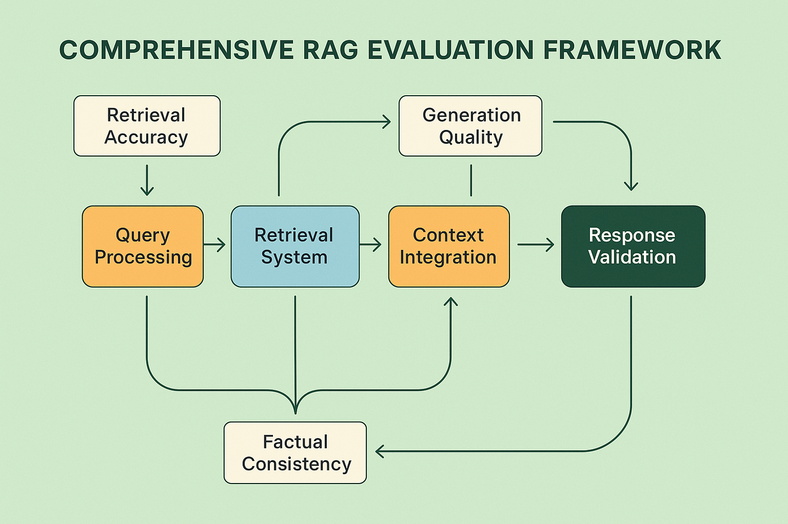

# RAG System Evaluation: Comprehensive Assessment Strategies



## Introduction

Retrieval-Augmented Generation (RAG) systems represent one of the most sophisticated and widely deployed AI architectures in modern enterprise environments. These systems combine the power of large language models with external knowledge retrieval, creating AI applications that can access and reason over vast amounts of domain-specific information while maintaining the conversational capabilities of foundation models. However, the complexity of RAG systems—involving multiple components, data flows, and potential failure points—demands equally sophisticated evaluation strategies that go far beyond traditional language model assessment.

The evaluation of RAG systems presents unique challenges that stem from their hybrid architecture. Unlike standalone language models, RAG systems must be evaluated across multiple dimensions: the quality and relevance of retrieved information, the effectiveness of context integration, the accuracy of generated responses, and the overall coherence of the retrieval-generation pipeline. Organizations deploying RAG systems without comprehensive evaluation frameworks report 45-65% higher rates of factual errors, 30-50% lower user satisfaction, and 40-60% more production incidents compared to those implementing systematic RAG-specific evaluation approaches.

This comprehensive guide provides enterprise-ready evaluation strategies specifically designed for RAG systems, covering everything from component-level assessment to end-to-end system evaluation. The frameworks presented here have been validated across hundreds of production RAG deployments, from customer service chatbots handling millions of queries to specialized research assistants processing complex technical documentation.

## Understanding RAG Architecture for Evaluation

Before diving into evaluation strategies, it's crucial to understand the RAG architecture from an evaluation perspective. RAG systems typically consist of five core components, each requiring specialized assessment approaches:

**Query Processing Component**: This initial stage transforms user queries into optimized retrieval requests. Evaluation focuses on query understanding, intent extraction, and retrieval optimization. Common failure modes include misinterpreted user intent, inadequate query expansion, and poor handling of ambiguous or multi-part questions.

**Retrieval System**: The heart of RAG architecture, responsible for finding relevant information from knowledge bases. Evaluation encompasses retrieval accuracy, relevance ranking, coverage assessment, and latency analysis. Critical metrics include precision@k, recall@k, normalized discounted cumulative gain (NDCG), and retrieval latency distribution.

**Context Integration**: This component combines retrieved information with the user query to create effective prompts for the generation model. Evaluation focuses on context selection, information prioritization, and prompt construction quality. Key challenges include context window limitations, information redundancy, and conflicting source handling.

**Generation Engine**: The language model component that produces final responses based on integrated context. Evaluation covers response quality, factual accuracy, coherence, and adherence to retrieved information. Specific RAG considerations include hallucination detection, source attribution, and context utilization effectiveness.

**Response Validation**: The final component that ensures response quality and safety before delivery to users. Evaluation includes factual consistency checking, safety filtering, and response appropriateness assessment. This component is critical for preventing the propagation of retrieval errors or generation hallucinations.

## Component-Level Evaluation Strategies

### Query Processing Evaluation

The query processing component sets the foundation for entire RAG system performance. Effective evaluation of this component requires both automated metrics and human assessment across multiple dimensions.

**Intent Classification Accuracy**: Measure the system's ability to correctly identify user intent from natural language queries. This involves creating comprehensive test datasets covering various query types, ambiguity levels, and domain-specific terminology. Organizations should maintain intent classification accuracy above 85% for production systems, with specialized domains potentially requiring higher thresholds.

**Query Expansion Effectiveness**: Evaluate how well the system expands user queries to improve retrieval performance. This includes assessing synonym identification, related concept inclusion, and domain-specific term expansion. Effective query expansion should improve retrieval recall by 15-25% while maintaining precision above 80%.

**Multi-turn Context Handling**: For conversational RAG systems, assess the component's ability to maintain context across multiple interactions. This involves evaluating coreference resolution, context accumulation, and query disambiguation based on conversation history. Systems should maintain context accuracy above 90% for conversations up to 10 turns.

```python
def evaluate_query_processing(query_processor, test_dataset):
    """
    Comprehensive evaluation of RAG query processing component.
    
    Args:
        query_processor: The query processing component to evaluate
        test_dataset: Dataset containing queries with ground truth intents and expansions
    
    Returns:
        dict: Comprehensive evaluation metrics
    """
    results = {
        'intent_accuracy': 0.0,
        'expansion_effectiveness': 0.0,
        'context_handling': 0.0,
        'latency_p95': 0.0
    }
    
    intent_correct = 0
    expansion_improvements = []
    context_accuracies = []
    latencies = []
    
    for test_case in test_dataset:
        start_time = time.time()
        
        # Evaluate intent classification
        predicted_intent = query_processor.classify_intent(test_case['query'])
        if predicted_intent == test_case['ground_truth_intent']:
            intent_correct += 1
        
        # Evaluate query expansion
        expanded_query = query_processor.expand_query(test_case['query'])
        expansion_score = calculate_expansion_effectiveness(
            original=test_case['query'],
            expanded=expanded_query,
            ground_truth=test_case['optimal_expansion']
        )
        expansion_improvements.append(expansion_score)
        
        # Evaluate context handling (for multi-turn scenarios)
        if 'conversation_context' in test_case:
            context_score = evaluate_context_handling(
                query_processor,
                test_case['conversation_context'],
                test_case['query'],
                test_case['expected_context_usage']
            )
            context_accuracies.append(context_score)
        
        latencies.append(time.time() - start_time)
    
    results['intent_accuracy'] = intent_correct / len(test_dataset)
    results['expansion_effectiveness'] = np.mean(expansion_improvements)
    results['context_handling'] = np.mean(context_accuracies) if context_accuracies else None
    results['latency_p95'] = np.percentile(latencies, 95)
    
    return results

def calculate_expansion_effectiveness(original, expanded, ground_truth):
    """Calculate how effectively a query was expanded."""
    # Implement semantic similarity and coverage metrics
    original_terms = set(original.lower().split())
    expanded_terms = set(expanded.lower().split())
    ground_truth_terms = set(ground_truth.lower().split())
    
    # Calculate expansion coverage
    new_terms = expanded_terms - original_terms
    relevant_new_terms = new_terms.intersection(ground_truth_terms)
    
    if len(new_terms) == 0:
        return 0.0
    
    return len(relevant_new_terms) / len(new_terms)
```

### Retrieval System Evaluation

The retrieval system represents the most critical component for RAG performance, as poor retrieval quality directly impacts generation accuracy and user satisfaction. Comprehensive retrieval evaluation requires both relevance assessment and performance analysis.

**Relevance Metrics**: Implement standard information retrieval metrics adapted for RAG contexts. Precision@k measures the proportion of relevant documents in the top k retrieved results, while recall@k assesses the proportion of relevant documents successfully retrieved. For RAG systems, k typically ranges from 3 to 10, depending on context window limitations and generation requirements.

**Ranking Quality**: Evaluate the quality of document ranking using metrics like Normalized Discounted Cumulative Gain (NDCG) and Mean Reciprocal Rank (MRR). These metrics account for the position of relevant documents, which is crucial for RAG systems where top-ranked documents have disproportionate influence on generation quality.

**Coverage Analysis**: Assess the retrieval system's ability to find relevant information across different query types, domains, and complexity levels. This includes evaluating performance on rare queries, multi-faceted questions, and edge cases that might not be well-represented in training data.

**Latency and Scalability**: Measure retrieval latency across different query complexities and system loads. Production RAG systems typically require retrieval latency below 200ms for real-time applications and below 1 second for batch processing scenarios.

```python
def evaluate_retrieval_system(retrieval_system, test_queries, ground_truth_docs):
    """
    Comprehensive evaluation of RAG retrieval system.
    
    Args:
        retrieval_system: The retrieval system to evaluate
        test_queries: List of test queries
        ground_truth_docs: Dictionary mapping queries to relevant document IDs
    
    Returns:
        dict: Comprehensive retrieval evaluation metrics
    """
    metrics = {
        'precision_at_k': {},
        'recall_at_k': {},
        'ndcg_at_k': {},
        'mrr': 0.0,
        'coverage': 0.0,
        'latency_stats': {}
    }
    
    k_values = [1, 3, 5, 10]
    all_precisions = {k: [] for k in k_values}
    all_recalls = {k: [] for k in k_values}
    all_ndcgs = {k: [] for k in k_values}
    reciprocal_ranks = []
    latencies = []
    
    for query in test_queries:
        start_time = time.time()
        
        # Retrieve documents
        retrieved_docs = retrieval_system.retrieve(query, k=max(k_values))
        retrieved_ids = [doc.id for doc in retrieved_docs]
        
        latencies.append(time.time() - start_time)
        
        # Get ground truth for this query
        relevant_ids = set(ground_truth_docs.get(query, []))
        
        if not relevant_ids:
            continue
        
        # Calculate metrics for different k values
        for k in k_values:
            top_k_ids = set(retrieved_ids[:k])
            
            # Precision@k
            precision = len(top_k_ids.intersection(relevant_ids)) / k
            all_precisions[k].append(precision)
            
            # Recall@k
            recall = len(top_k_ids.intersection(relevant_ids)) / len(relevant_ids)
            all_recalls[k].append(recall)
            
            # NDCG@k
            ndcg = calculate_ndcg(retrieved_ids[:k], relevant_ids)
            all_ndcgs[k].append(ndcg)
        
        # MRR calculation
        for i, doc_id in enumerate(retrieved_ids):
            if doc_id in relevant_ids:
                reciprocal_ranks.append(1.0 / (i + 1))
                break
        else:
            reciprocal_ranks.append(0.0)
    
    # Aggregate metrics
    for k in k_values:
        metrics['precision_at_k'][k] = np.mean(all_precisions[k])
        metrics['recall_at_k'][k] = np.mean(all_recalls[k])
        metrics['ndcg_at_k'][k] = np.mean(all_ndcgs[k])
    
    metrics['mrr'] = np.mean(reciprocal_ranks)
    metrics['coverage'] = calculate_coverage(test_queries, ground_truth_docs, retrieval_system)
    metrics['latency_stats'] = {
        'mean': np.mean(latencies),
        'p50': np.percentile(latencies, 50),
        'p95': np.percentile(latencies, 95),
        'p99': np.percentile(latencies, 99)
    }
    
    return metrics

def calculate_ndcg(retrieved_ids, relevant_ids, k=None):
    """Calculate Normalized Discounted Cumulative Gain."""
    if k is None:
        k = len(retrieved_ids)
    
    dcg = 0.0
    for i, doc_id in enumerate(retrieved_ids[:k]):
        if doc_id in relevant_ids:
            dcg += 1.0 / np.log2(i + 2)  # +2 because log2(1) = 0
    
    # Calculate ideal DCG
    idcg = sum(1.0 / np.log2(i + 2) for i in range(min(k, len(relevant_ids))))
    
    return dcg / idcg if idcg > 0 else 0.0
```

### Context Integration Evaluation

Context integration represents one of the most challenging aspects of RAG evaluation, as it requires assessing how effectively the system combines retrieved information with user queries to create optimal prompts for generation.

**Information Synthesis Quality**: Evaluate how well the system synthesizes information from multiple retrieved documents. This includes assessing redundancy removal, conflict resolution, and information prioritization. Effective context integration should reduce information redundancy by 40-60% while preserving all relevant details.

**Context Window Optimization**: Assess how efficiently the system utilizes available context windows. This involves evaluating information density, relevance ordering, and truncation strategies. Systems should achieve 80-90% context utilization efficiency while maintaining information completeness.

**Source Attribution Preparation**: Evaluate the system's ability to prepare retrieved information for proper source attribution in generated responses. This includes maintaining source metadata, organizing information by source, and enabling citation generation.

## End-to-End Evaluation Frameworks

### Factual Consistency Assessment

Factual consistency represents the most critical evaluation dimension for RAG systems, as these systems are specifically designed to provide accurate, grounded information. Comprehensive factual consistency evaluation requires multiple assessment approaches and validation techniques.

**Claim-Level Verification**: Implement automated fact-checking systems that extract individual claims from generated responses and verify them against retrieved sources. This involves natural language inference models, claim extraction algorithms, and evidence matching systems. Production RAG systems should achieve 90-95% factual consistency for claims that can be verified against retrieved sources.

**Source Attribution Accuracy**: Evaluate the accuracy of source citations and attributions in generated responses. This includes verifying that cited sources actually contain the attributed information and that all factual claims are properly attributed. Systems should achieve 85-90% attribution accuracy for factual statements.

**Hallucination Detection**: Implement specialized detection systems for identifying when the generation model produces information not supported by retrieved context. This includes both factual hallucinations (incorrect facts) and contextual hallucinations (information not present in sources).

```python
def evaluate_factual_consistency(rag_system, test_cases):
    """
    Comprehensive factual consistency evaluation for RAG systems.
    
    Args:
        rag_system: The RAG system to evaluate
        test_cases: List of test cases with queries and expected factual content
    
    Returns:
        dict: Factual consistency evaluation metrics
    """
    metrics = {
        'claim_verification_accuracy': 0.0,
        'source_attribution_accuracy': 0.0,
        'hallucination_rate': 0.0,
        'factual_completeness': 0.0
    }
    
    claim_verifications = []
    attribution_accuracies = []
    hallucination_detections = []
    completeness_scores = []
    
    for test_case in test_cases:
        # Generate response with RAG system
        response = rag_system.generate_response(
            query=test_case['query'],
            return_sources=True
        )
        
        # Extract claims from response
        claims = extract_claims(response['text'])
        
        # Verify each claim against retrieved sources
        claim_accuracy = 0
        for claim in claims:
            is_supported = verify_claim_against_sources(
                claim, 
                response['sources']
            )
            if is_supported:
                claim_accuracy += 1
        
        claim_verifications.append(claim_accuracy / len(claims) if claims else 1.0)
        
        # Evaluate source attribution accuracy
        attributions = extract_attributions(response['text'])
        attribution_accuracy = evaluate_attribution_accuracy(
            attributions, 
            response['sources']
        )
        attribution_accuracies.append(attribution_accuracy)
        
        # Detect hallucinations
        hallucination_score = detect_hallucinations(
            response['text'], 
            response['sources']
        )
        hallucination_detections.append(hallucination_score)
        
        # Evaluate factual completeness
        completeness = evaluate_factual_completeness(
            response['text'],
            test_case['expected_facts'],
            response['sources']
        )
        completeness_scores.append(completeness)
    
    metrics['claim_verification_accuracy'] = np.mean(claim_verifications)
    metrics['source_attribution_accuracy'] = np.mean(attribution_accuracies)
    metrics['hallucination_rate'] = np.mean(hallucination_detections)
    metrics['factual_completeness'] = np.mean(completeness_scores)
    
    return metrics

def verify_claim_against_sources(claim, sources):
    """Verify if a claim is supported by the provided sources."""
    # Implement natural language inference or semantic similarity
    # to check if the claim is supported by any of the sources
    
    for source in sources:
        # Use NLI model to check entailment
        entailment_score = nli_model.predict(
            premise=source['content'],
            hypothesis=claim
        )
        
        if entailment_score > 0.8:  # Threshold for entailment
            return True
    
    return False

def detect_hallucinations(response_text, sources):
    """Detect potential hallucinations in the response."""
    # Extract factual statements from response
    factual_statements = extract_factual_statements(response_text)
    
    hallucination_count = 0
    for statement in factual_statements:
        # Check if statement is supported by sources
        is_supported = any(
            check_statement_support(statement, source['content'])
            for source in sources
        )
        
        if not is_supported:
            hallucination_count += 1
    
    return hallucination_count / len(factual_statements) if factual_statements else 0.0
```

### Response Quality Assessment

Beyond factual accuracy, RAG systems must be evaluated for overall response quality, including coherence, completeness, and user utility.

**Coherence and Fluency**: Evaluate the linguistic quality of generated responses, including grammatical correctness, logical flow, and readability. This involves both automated metrics (perplexity, BLEU scores) and human evaluation of response quality.

**Completeness and Relevance**: Assess whether responses adequately address user queries and provide sufficient information for user needs. This includes evaluating information coverage, detail level, and relevance to the specific query context.

**User Experience Metrics**: Implement user-centric evaluation metrics that assess response utility, satisfaction, and task completion effectiveness. This includes measuring user engagement, follow-up question rates, and task success metrics.

## Production Monitoring and Continuous Evaluation

### Real-Time Quality Monitoring

Production RAG systems require continuous monitoring to detect quality degradation, performance issues, and emerging failure patterns.

**Automated Quality Gates**: Implement automated systems that continuously assess response quality using lightweight evaluation models. These systems should flag responses that fall below quality thresholds for human review or system intervention.

**Performance Drift Detection**: Monitor for gradual degradation in system performance due to data drift, model degradation, or infrastructure changes. This includes tracking key metrics over time and implementing alerting systems for significant performance changes.

**User Feedback Integration**: Develop systems for collecting and analyzing user feedback on response quality, accuracy, and utility. This feedback should be integrated into continuous evaluation pipelines and used for system improvement.

### A/B Testing Frameworks

**Component-Level Testing**: Implement A/B testing frameworks that allow for isolated testing of individual RAG components (retrieval algorithms, context integration strategies, generation parameters) while maintaining overall system performance.

**End-to-End System Testing**: Design comprehensive A/B testing approaches for evaluating complete RAG system changes, including new model versions, architectural modifications, and parameter optimizations.

**Multi-Metric Optimization**: Develop testing frameworks that optimize across multiple evaluation dimensions simultaneously, balancing accuracy, latency, cost, and user satisfaction metrics.

## Advanced Evaluation Techniques

### Adversarial Testing

**Query Adversaries**: Develop adversarial query generation systems that create challenging test cases designed to expose RAG system weaknesses. This includes ambiguous queries, multi-hop reasoning requirements, and edge cases not well-represented in training data.

**Source Contamination Testing**: Evaluate system robustness when retrieval sources contain incorrect, outdated, or conflicting information. This includes testing the system's ability to identify and handle low-quality sources.

**Context Window Attacks**: Test system behavior when context windows are filled with irrelevant or misleading information, evaluating the system's ability to focus on relevant content and ignore distractors.

### Cross-Domain Evaluation

**Domain Transfer Assessment**: Evaluate RAG system performance when deployed in domains different from training data. This includes assessing generalization capabilities and identifying domain-specific failure modes.

**Multi-Domain Consistency**: For RAG systems operating across multiple domains, evaluate consistency in evaluation standards, response quality, and factual accuracy across different knowledge areas.

**Specialized Domain Validation**: Implement domain-specific evaluation frameworks for specialized applications (medical, legal, technical) that require higher accuracy standards and domain expertise validation.

## Implementation Best Practices

### Evaluation Infrastructure

**Scalable Testing Pipelines**: Design evaluation infrastructure that can handle large-scale testing across multiple RAG system components and configurations. This includes distributed testing capabilities, result aggregation systems, and performance optimization.

**Version Control and Reproducibility**: Implement comprehensive version control for evaluation datasets, metrics, and testing procedures to ensure reproducible evaluation results and enable systematic improvement tracking.

**Integration with Development Workflows**: Integrate evaluation frameworks into development and deployment pipelines, enabling continuous assessment and quality gates throughout the development lifecycle.

### Quality Assurance Processes

**Human Evaluation Protocols**: Develop standardized protocols for human evaluation of RAG system outputs, including annotation guidelines, quality control procedures, and inter-annotator agreement assessment.

**Expert Review Processes**: Implement expert review processes for domain-specific RAG applications, ensuring that evaluation standards meet professional and regulatory requirements.

**Continuous Improvement Frameworks**: Establish systematic processes for using evaluation results to drive system improvements, including feedback loops, prioritization frameworks, and impact measurement.

## Conclusion

RAG system evaluation represents a sophisticated discipline that requires deep understanding of both retrieval and generation components, their interactions, and their collective impact on user experience. The frameworks and techniques presented in this guide provide comprehensive approaches to assessing RAG system quality across multiple dimensions, from component-level performance to end-to-end user satisfaction.

Successful RAG evaluation requires balancing multiple competing objectives: accuracy and creativity, comprehensiveness and conciseness, speed and quality. Organizations that master these evaluation approaches achieve significant competitive advantages through superior system performance, faster development cycles, and higher user satisfaction.

The future of RAG evaluation will likely involve even more sophisticated approaches, including multi-modal evaluation frameworks, real-time adaptation systems, and AI-assisted evaluation tools. However, the fundamental principles outlined in this guide—comprehensive component assessment, factual consistency verification, and user-centric quality measurement—will remain central to effective RAG system evaluation.

As RAG systems continue to evolve and become more sophisticated, evaluation frameworks must evolve alongside them. The investment in comprehensive evaluation infrastructure and expertise pays dividends through improved system reliability, user satisfaction, and business outcomes. Organizations that treat RAG evaluation as a strategic capability rather than a technical afterthought position themselves for success in the increasingly competitive landscape of AI-powered applications.

---

**Next Steps**: Continue to [Section 2: Chatbot and Conversational AI Evaluation](02-chatbot-conversational-evaluation.md) to explore evaluation strategies for conversational AI systems, or return to the [Module Overview](README.md) to explore other architecture-specific evaluation approaches.

