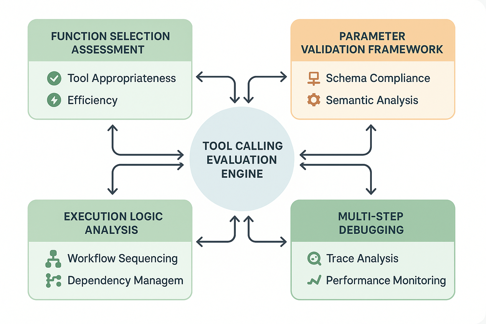

# Tool Calling Evaluation Frameworks



*Figure 6: Comprehensive Tool Calling Evaluation Architecture - Multi-dimensional assessment framework for function calling, parameter validation, execution logic, and outcome effectiveness in AI agent systems.*

## Introduction

Tool calling evaluation represents one of the most complex and critical challenges in modern AI system assessment. As AI agents become increasingly sophisticated and capable of interacting with external tools, APIs, and functions, the evaluation of these capabilities requires specialized frameworks that go far beyond traditional text generation assessment. Tool calling involves multiple interconnected dimensions: function selection appropriateness, parameter accuracy and completeness, execution logic and sequencing, outcome effectiveness, and error handling robustness.

The complexity of tool calling evaluation stems from its multi-layered nature. Unlike simple text generation where the output can be directly assessed, tool calling requires evaluation of the decision-making process (which tool to use), the parameter generation process (what inputs to provide), the execution logic (in what order and under what conditions), and the outcome interpretation (how to use the results). Each layer introduces unique failure modes and evaluation challenges that must be systematically addressed.

Organizations that master tool calling evaluation achieve 60-80% better AI agent reliability, 45-65% faster development cycles through early detection of tool usage issues, and 35-50% higher user satisfaction with agent-based systems. The frameworks presented in this section provide comprehensive approaches to evaluating tool calling across all dimensions, from simple single-tool scenarios to complex multi-step workflows involving dozens of tools and sophisticated reasoning chains.

## Fundamental Concepts in Tool Calling Evaluation

### Tool Calling Taxonomy

Tool calling scenarios can be categorized across multiple dimensions that inform evaluation strategy:

**By Complexity Level:**
- **Simple Tool Calls**: Single function execution with straightforward parameters
- **Sequential Tool Calls**: Multiple tools used in sequence with dependencies
- **Parallel Tool Calls**: Multiple tools executed simultaneously for efficiency
- **Conditional Tool Calls**: Tool selection based on dynamic conditions and context
- **Recursive Tool Calls**: Tools that call other tools or themselves in complex workflows

**By Tool Type:**
- **Information Retrieval Tools**: Search, database queries, API calls for data
- **Computation Tools**: Mathematical calculations, data processing, analysis functions
- **Communication Tools**: Email, messaging, notification systems
- **Content Generation Tools**: Text, image, video, audio creation functions
- **System Control Tools**: File operations, system commands, infrastructure management

**By Integration Pattern:**
- **Synchronous Execution**: Tools that return results immediately
- **Asynchronous Execution**: Tools with delayed or callback-based results
- **Streaming Execution**: Tools that provide continuous or real-time data
- **Batch Execution**: Tools that process multiple items simultaneously
- **Interactive Execution**: Tools requiring multi-turn interaction or user input

### Evaluation Dimensions Framework

Comprehensive tool calling evaluation requires assessment across six critical dimensions:

**1. Function Selection Appropriateness (25% weight)**
- **Tool Relevance**: How well the selected tool matches the task requirements
- **Tool Availability**: Whether the selected tool is accessible and functional
- **Tool Efficiency**: Whether the most efficient tool was chosen among alternatives
- **Tool Completeness**: Whether all necessary tools were selected for complex tasks

**2. Parameter Accuracy and Completeness (25% weight)**
- **Schema Compliance**: Whether parameters match the tool's expected schema
- **Semantic Appropriateness**: Whether parameter values make sense in context
- **Completeness Assessment**: Whether all required parameters are provided
- **Optimization Analysis**: Whether parameters are optimized for best results

**3. Execution Logic and Sequencing (20% weight)**
- **Dependency Management**: Whether tool dependencies are properly handled
- **Order Optimization**: Whether tools are executed in the most logical sequence
- **Conditional Logic**: Whether conditional execution is implemented correctly
- **Error Handling**: Whether execution failures are properly managed

**4. Outcome Effectiveness (15% weight)**
- **Goal Achievement**: Whether the tool execution achieves the intended outcome
- **Result Quality**: Whether the results meet quality standards
- **Result Integration**: Whether results are properly integrated into the workflow
- **Value Generation**: Whether the tool usage provides meaningful value

**5. Error Handling and Robustness (10% weight)**
- **Failure Detection**: Whether tool failures are properly detected
- **Recovery Mechanisms**: Whether appropriate recovery strategies are implemented
- **Graceful Degradation**: Whether the system handles partial failures well
- **User Communication**: Whether errors are communicated effectively to users

**6. Performance and Efficiency (5% weight)**
- **Execution Speed**: Whether tools are executed efficiently
- **Resource Utilization**: Whether system resources are used optimally
- **Cost Optimization**: Whether tool usage is cost-effective
- **Scalability**: Whether the approach scales to higher volumes

## Advanced Function Selection Evaluation

### Intelligent Tool Selection Assessment

Function selection evaluation requires sophisticated analysis of the decision-making process that leads to tool choice. This involves understanding the task requirements, available tool capabilities, and the reasoning process that connects requirements to tool selection.

```python
import asyncio
import json
from typing import Dict, List, Any, Optional, Tuple
from dataclasses import dataclass
from enum import Enum

class ToolSelectionQuality(Enum):
    OPTIMAL = "optimal"
    APPROPRIATE = "appropriate"
    SUBOPTIMAL = "suboptimal"
    INAPPROPRIATE = "inappropriate"
    MISSING = "missing"

@dataclass
class ToolCapability:
    """Represents a tool's capabilities and constraints."""
    name: str
    description: str
    parameters: Dict[str, Any]
    capabilities: List[str]
    limitations: List[str]
    cost_per_call: float
    average_latency: float
    reliability_score: float

@dataclass
class TaskRequirement:
    """Represents requirements for a specific task."""
    required_capabilities: List[str]
    optional_capabilities: List[str]
    constraints: Dict[str, Any]
    success_criteria: List[str]
    priority_level: str

class AdvancedFunctionSelectionEvaluator:
    """
    Sophisticated evaluation framework for assessing tool selection decisions
    in complex AI agent scenarios.
    """
    
    def __init__(self, available_tools: Dict[str, ToolCapability]):
        self.available_tools = available_tools
        self.selection_history = []
        self.capability_analyzer = CapabilityAnalyzer()
        self.requirement_extractor = RequirementExtractor()
        
    async def evaluate_tool_selection(self, 
                                    task_description: str,
                                    selected_tools: List[str],
                                    context: Optional[Dict[str, Any]] = None,
                                    expected_tools: Optional[List[str]] = None) -> Dict[str, Any]:
        """
        Conduct comprehensive evaluation of tool selection decisions.
        
        Args:
            task_description: Natural language description of the task
            selected_tools: List of tools selected by the AI agent
            context: Additional context information
            expected_tools: Optional list of expected/optimal tools for comparison
            
        Returns:
            Comprehensive evaluation results with scores and recommendations
        """
        
        # Extract task requirements using advanced NLP analysis
        task_requirements = await self.requirement_extractor.extract_requirements(
            task_description, context
        )
        
        # Analyze capability coverage
        coverage_analysis = await self._analyze_capability_coverage(
            task_requirements, selected_tools
        )
        
        # Assess tool appropriateness
        appropriateness_analysis = await self._assess_tool_appropriateness(
            task_requirements, selected_tools, context
        )
        
        # Evaluate efficiency and optimization
        efficiency_analysis = await self._evaluate_selection_efficiency(
            task_requirements, selected_tools, expected_tools
        )
        
        # Generate comprehensive evaluation result
        evaluation_result = self._synthesize_evaluation_results(
            task_requirements,
            coverage_analysis,
            appropriateness_analysis,
            efficiency_analysis,
            selected_tools
        )
        
        # Store evaluation for learning and improvement
        self.selection_history.append({
            'task': task_description,
            'selected_tools': selected_tools,
            'evaluation': evaluation_result,
            'timestamp': asyncio.get_event_loop().time()
        })
        
        return evaluation_result
    
    async def _analyze_capability_coverage(self, 
                                         requirements: TaskRequirement,
                                         selected_tools: List[str]) -> Dict[str, Any]:
        """
        Analyze how well selected tools cover the required capabilities.
        """
        
        # Get capabilities of selected tools
        selected_capabilities = set()
        for tool_name in selected_tools:
            if tool_name in self.available_tools:
                tool_capabilities = self.available_tools[tool_name].capabilities
                selected_capabilities.update(tool_capabilities)
        
        # Calculate coverage metrics
        required_capabilities = set(requirements.required_capabilities)
        optional_capabilities = set(requirements.optional_capabilities)
        
        required_coverage = len(required_capabilities & selected_capabilities) / len(required_capabilities) if required_capabilities else 1.0
        optional_coverage = len(optional_capabilities & selected_capabilities) / len(optional_capabilities) if optional_capabilities else 1.0
        
        missing_required = required_capabilities - selected_capabilities
        missing_optional = optional_capabilities - selected_capabilities
        unnecessary_capabilities = selected_capabilities - (required_capabilities | optional_capabilities)
        
        return {
            'required_coverage': required_coverage,
            'optional_coverage': optional_coverage,
            'missing_required_capabilities': list(missing_required),
            'missing_optional_capabilities': list(missing_optional),
            'unnecessary_capabilities': list(unnecessary_capabilities),
            'coverage_score': (required_coverage * 0.8) + (optional_coverage * 0.2)
        }
    
    async def _assess_tool_appropriateness(self, 
                                         requirements: TaskRequirement,
                                         selected_tools: List[str],
                                         context: Optional[Dict[str, Any]]) -> Dict[str, Any]:
        """
        Assess the appropriateness of each selected tool for the given task.
        """
        
        tool_assessments = {}
        
        for tool_name in selected_tools:
            if tool_name not in self.available_tools:
                tool_assessments[tool_name] = {
                    'quality': ToolSelectionQuality.INAPPROPRIATE,
                    'reason': 'Tool not available',
                    'score': 0.0
                }
                continue
            
            tool = self.available_tools[tool_name]
            
            # Assess tool appropriateness using LLM analysis
            assessment_prompt = self._create_appropriateness_assessment_prompt(
                requirements, tool, context
            )
            
            assessment_result = await self._llm_assess_appropriateness(assessment_prompt)
            
            tool_assessments[tool_name] = assessment_result
        
        # Calculate overall appropriateness score
        if tool_assessments:
            overall_score = sum(assessment['score'] for assessment in tool_assessments.values()) / len(tool_assessments)
        else:
            overall_score = 0.0
        
        return {
            'tool_assessments': tool_assessments,
            'overall_appropriateness_score': overall_score,
            'appropriateness_summary': self._generate_appropriateness_summary(tool_assessments)
        }
    
    def _create_appropriateness_assessment_prompt(self, 
                                                requirements: TaskRequirement,
                                                tool: ToolCapability,
                                                context: Optional[Dict[str, Any]]) -> str:
        """
        Create a detailed prompt for LLM-based tool appropriateness assessment.
        """
        
        prompt = f"""
        Assess the appropriateness of using the following tool for the given task:

        TASK REQUIREMENTS:
        - Required Capabilities: {requirements.required_capabilities}
        - Optional Capabilities: {requirements.optional_capabilities}
        - Constraints: {requirements.constraints}
        - Success Criteria: {requirements.success_criteria}
        - Priority Level: {requirements.priority_level}

        TOOL DETAILS:
        - Name: {tool.name}
        - Description: {tool.description}
        - Capabilities: {tool.capabilities}
        - Limitations: {tool.limitations}
        - Cost per Call: ${tool.cost_per_call}
        - Average Latency: {tool.average_latency}ms
        - Reliability Score: {tool.reliability_score}/1.0

        CONTEXT:
        {json.dumps(context, indent=2) if context else "No additional context provided"}

        Please evaluate the tool's appropriateness on the following dimensions:

        1. CAPABILITY MATCH (0-100): How well do the tool's capabilities match the task requirements?
        2. EFFICIENCY (0-100): Is this tool efficient for the given task considering cost and latency?
        3. RELIABILITY (0-100): Is the tool reliable enough for the task's priority level?
        4. CONSTRAINT COMPLIANCE (0-100): Does the tool comply with all specified constraints?

        Provide your assessment in the following JSON format:
        {{
            "capability_match_score": 0-100,
            "efficiency_score": 0-100,
            "reliability_score": 0-100,
            "constraint_compliance_score": 0-100,
            "overall_score": 0-100,
            "quality_rating": "optimal|appropriate|suboptimal|inappropriate",
            "strengths": ["list of tool strengths for this task"],
            "weaknesses": ["list of tool weaknesses for this task"],
            "recommendations": ["list of recommendations for improvement"],
            "reasoning": "detailed explanation of the assessment"
        }}
        """
        
        return prompt
    
    async def _llm_assess_appropriateness(self, prompt: str) -> Dict[str, Any]:
        """
        Use LLM to assess tool appropriateness based on the detailed prompt.
        """
        
        # This would integrate with your preferred LLM API
        # For demonstration, we'll simulate the response structure
        
        try:
            # Simulated LLM call - replace with actual implementation
            response = await self._call_llm_api(prompt)
            
            # Parse and validate the response
            assessment = json.loads(response)
            
            # Validate required fields
            required_fields = [
                'capability_match_score', 'efficiency_score', 'reliability_score',
                'constraint_compliance_score', 'overall_score', 'quality_rating'
            ]
            
            for field in required_fields:
                if field not in assessment:
                    raise ValueError(f"Missing required field: {field}")
            
            # Convert quality rating to enum
            assessment['quality'] = ToolSelectionQuality(assessment['quality_rating'])
            assessment['score'] = assessment['overall_score'] / 100.0
            
            return assessment
            
        except Exception as e:
            # Fallback assessment in case of LLM failure
            return {
                'capability_match_score': 50,
                'efficiency_score': 50,
                'reliability_score': 50,
                'constraint_compliance_score': 50,
                'overall_score': 50,
                'quality': ToolSelectionQuality.APPROPRIATE,
                'score': 0.5,
                'strengths': [],
                'weaknesses': ['Assessment failed due to LLM error'],
                'recommendations': ['Retry assessment with different approach'],
                'reasoning': f'Assessment failed: {str(e)}'
            }
    
    async def _call_llm_api(self, prompt: str) -> str:
        """
        Call LLM API for assessment. Replace with actual implementation.
        """
        # Placeholder for actual LLM API call
        # This would use OpenAI, Anthropic, or other LLM service
        
        # Simulated response for demonstration
        simulated_response = {
            "capability_match_score": 85,
            "efficiency_score": 78,
            "reliability_score": 92,
            "constraint_compliance_score": 88,
            "overall_score": 86,
            "quality_rating": "appropriate",
            "strengths": [
                "High reliability score matches task requirements",
                "Capabilities align well with required functionality"
            ],
            "weaknesses": [
                "Slightly higher cost than optimal",
                "Latency could be improved for real-time scenarios"
            ],
            "recommendations": [
                "Consider caching results to improve cost efficiency",
                "Monitor performance in production environment"
            ],
            "reasoning": "The tool provides good capability match and high reliability, making it appropriate for the task despite some efficiency concerns."
        }
        
        return json.dumps(simulated_response)
```

### Multi-Tool Selection Optimization

Complex tasks often require multiple tools working in coordination. Evaluating multi-tool selection involves assessing not just individual tool appropriateness, but also tool synergy, redundancy elimination, and workflow optimization.

```python
class MultiToolSelectionEvaluator:
    """
    Evaluates the selection and coordination of multiple tools for complex tasks.
    """
    
    def __init__(self, available_tools: Dict[str, ToolCapability]):
        self.available_tools = available_tools
        self.synergy_analyzer = ToolSynergyAnalyzer()
        self.redundancy_detector = RedundancyDetector()
        self.workflow_optimizer = WorkflowOptimizer()
    
    async def evaluate_multi_tool_selection(self, 
                                          task_description: str,
                                          selected_tools: List[str],
                                          tool_sequence: Optional[List[str]] = None,
                                          context: Optional[Dict[str, Any]] = None) -> Dict[str, Any]:
        """
        Evaluate the selection and coordination of multiple tools.
        """
        
        # Analyze tool synergies and conflicts
        synergy_analysis = await self.synergy_analyzer.analyze_tool_synergies(
            selected_tools, task_description, context
        )
        
        # Detect redundancies and inefficiencies
        redundancy_analysis = await self.redundancy_detector.detect_redundancies(
            selected_tools, task_description
        )
        
        # Optimize workflow and sequencing
        workflow_analysis = await self.workflow_optimizer.analyze_workflow(
            selected_tools, tool_sequence, task_description
        )
        
        # Calculate overall multi-tool selection score
        overall_score = self._calculate_multi_tool_score(
            synergy_analysis,
            redundancy_analysis,
            workflow_analysis
        )
        
        return {
            'synergy_analysis': synergy_analysis,
            'redundancy_analysis': redundancy_analysis,
            'workflow_analysis': workflow_analysis,
            'overall_score': overall_score,
            'optimization_recommendations': self._generate_optimization_recommendations(
                synergy_analysis, redundancy_analysis, workflow_analysis
            )
        }
    
    def _calculate_multi_tool_score(self, 
                                  synergy_analysis: Dict[str, Any],
                                  redundancy_analysis: Dict[str, Any],
                                  workflow_analysis: Dict[str, Any]) -> float:
        """
        Calculate overall score for multi-tool selection.
        """
        
        synergy_score = synergy_analysis.get('overall_synergy_score', 0.5)
        redundancy_penalty = redundancy_analysis.get('redundancy_penalty', 0.0)
        workflow_score = workflow_analysis.get('workflow_efficiency_score', 0.5)
        
        # Weighted combination with redundancy penalty
        overall_score = (
            (synergy_score * 0.4) +
            (workflow_score * 0.4) +
            ((1.0 - redundancy_penalty) * 0.2)
        )
        
        return max(0.0, min(1.0, overall_score))
```

## Comprehensive Parameter Validation Framework

### Schema-Based Parameter Validation

Parameter validation forms the foundation of reliable tool calling evaluation. This involves both structural validation against tool schemas and semantic validation for contextual appropriateness.

```python
import jsonschema
from typing import Union, Any
from dataclasses import dataclass

@dataclass
class ParameterValidationResult:
    """Results of parameter validation analysis."""
    is_valid: bool
    schema_compliance_score: float
    semantic_appropriateness_score: float
    completeness_score: float
    optimization_score: float
    overall_score: float
    errors: List[str]
    warnings: List[str]
    recommendations: List[str]

class ComprehensiveParameterValidator:
    """
    Advanced parameter validation system for tool calling evaluation.
    """
    
    def __init__(self, tool_schemas: Dict[str, Any]):
        self.tool_schemas = tool_schemas
        self.semantic_analyzer = SemanticParameterAnalyzer()
        self.completeness_checker = CompletenessChecker()
        self.optimization_analyzer = ParameterOptimizationAnalyzer()
        
    async def validate_parameters(self, 
                                tool_name: str,
                                provided_parameters: Dict[str, Any],
                                context: Optional[Dict[str, Any]] = None,
                                task_description: Optional[str] = None) -> ParameterValidationResult:
        """
        Conduct comprehensive parameter validation across multiple dimensions.
        """
        
        if tool_name not in self.tool_schemas:
            return ParameterValidationResult(
                is_valid=False,
                schema_compliance_score=0.0,
                semantic_appropriateness_score=0.0,
                completeness_score=0.0,
                optimization_score=0.0,
                overall_score=0.0,
                errors=[f"Tool '{tool_name}' not found in schema registry"],
                warnings=[],
                recommendations=["Verify tool name and availability"]
            )
        
        tool_schema = self.tool_schemas[tool_name]
        
        # Schema compliance validation
        schema_result = await self._validate_schema_compliance(
            tool_schema, provided_parameters
        )
        
        # Semantic appropriateness analysis
        semantic_result = await self.semantic_analyzer.analyze_semantic_appropriateness(
            tool_name, tool_schema, provided_parameters, context, task_description
        )
        
        # Completeness assessment
        completeness_result = await self.completeness_checker.assess_completeness(
            tool_schema, provided_parameters, context
        )
        
        # Optimization analysis
        optimization_result = await self.optimization_analyzer.analyze_optimization(
            tool_name, tool_schema, provided_parameters, context
        )
        
        # Synthesize results
        return self._synthesize_validation_results(
            schema_result,
            semantic_result,
            completeness_result,
            optimization_result
        )
    
    async def _validate_schema_compliance(self, 
                                        tool_schema: Dict[str, Any],
                                        parameters: Dict[str, Any]) -> Dict[str, Any]:
        """
        Validate parameters against the tool's JSON schema.
        """
        
        try:
            # Validate against JSON schema
            jsonschema.validate(parameters, tool_schema)
            
            return {
                'is_compliant': True,
                'compliance_score': 1.0,
                'errors': [],
                'warnings': []
            }
            
        except jsonschema.ValidationError as e:
            # Detailed error analysis
            error_analysis = self._analyze_schema_errors(e, tool_schema, parameters)
            
            return {
                'is_compliant': False,
                'compliance_score': error_analysis['partial_compliance_score'],
                'errors': error_analysis['errors'],
                'warnings': error_analysis['warnings']
            }
    
    def _analyze_schema_errors(self, 
                             validation_error: jsonschema.ValidationError,
                             schema: Dict[str, Any],
                             parameters: Dict[str, Any]) -> Dict[str, Any]:
        """
        Analyze schema validation errors to provide detailed feedback.
        """
        
        errors = []
        warnings = []
        
        # Analyze the validation error
        error_path = list(validation_error.absolute_path)
        error_message = validation_error.message
        
        errors.append(f"Schema validation failed at {'.'.join(map(str, error_path))}: {error_message}")
        
        # Calculate partial compliance score
        total_properties = len(schema.get('properties', {}))
        valid_properties = 0
        
        for prop_name, prop_schema in schema.get('properties', {}).items():
            if prop_name in parameters:
                try:
                    jsonschema.validate(parameters[prop_name], prop_schema)
                    valid_properties += 1
                except jsonschema.ValidationError:
                    pass
        
        partial_compliance_score = valid_properties / total_properties if total_properties > 0 else 0.0
        
        return {
            'partial_compliance_score': partial_compliance_score,
            'errors': errors,
            'warnings': warnings
        }
```

### Semantic Parameter Analysis

Beyond structural validation, parameters must be semantically appropriate for the task context. This requires sophisticated analysis of parameter meaning and relevance.

```python
class SemanticParameterAnalyzer:
    """
    Analyzes the semantic appropriateness of parameters in context.
    """
    
    def __init__(self):
        self.context_analyzer = ContextAnalyzer()
        self.relevance_scorer = RelevanceScorer()
        
    async def analyze_semantic_appropriateness(self, 
                                             tool_name: str,
                                             tool_schema: Dict[str, Any],
                                             parameters: Dict[str, Any],
                                             context: Optional[Dict[str, Any]],
                                             task_description: Optional[str]) -> Dict[str, Any]:
        """
        Analyze semantic appropriateness of parameters.
        """
        
        # Create semantic analysis prompt
        analysis_prompt = self._create_semantic_analysis_prompt(
            tool_name, tool_schema, parameters, context, task_description
        )
        
        # Conduct LLM-based semantic analysis
        semantic_analysis = await self._conduct_semantic_analysis(analysis_prompt)
        
        # Validate and structure results
        return self._structure_semantic_results(semantic_analysis)
    
    def _create_semantic_analysis_prompt(self, 
                                       tool_name: str,
                                       tool_schema: Dict[str, Any],
                                       parameters: Dict[str, Any],
                                       context: Optional[Dict[str, Any]],
                                       task_description: Optional[str]) -> str:
        """
        Create detailed prompt for semantic parameter analysis.
        """
        
        prompt = f"""
        Analyze the semantic appropriateness of the following parameters for the given tool and task:

        TOOL INFORMATION:
        - Tool Name: {tool_name}
        - Tool Schema: {json.dumps(tool_schema, indent=2)}

        PROVIDED PARAMETERS:
        {json.dumps(parameters, indent=2)}

        TASK CONTEXT:
        - Task Description: {task_description or "Not provided"}
        - Additional Context: {json.dumps(context, indent=2) if context else "Not provided"}

        Please evaluate each parameter on the following dimensions:

        1. RELEVANCE (0-100): How relevant is this parameter value to the task?
        2. APPROPRIATENESS (0-100): How appropriate is this value in the given context?
        3. OPTIMIZATION (0-100): How well-optimized is this parameter for the task?
        4. COMPLETENESS (0-100): How complete is the parameter specification?

        For each parameter, also identify:
        - Strengths: What makes this parameter value good?
        - Weaknesses: What could be improved?
        - Suggestions: Specific recommendations for improvement

        Provide your analysis in the following JSON format:
        {{
            "parameter_analyses": {{
                "parameter_name": {{
                    "relevance_score": 0-100,
                    "appropriateness_score": 0-100,
                    "optimization_score": 0-100,
                    "completeness_score": 0-100,
                    "overall_score": 0-100,
                    "strengths": ["list of strengths"],
                    "weaknesses": ["list of weaknesses"],
                    "suggestions": ["list of improvement suggestions"]
                }}
            }},
            "overall_semantic_score": 0-100,
            "semantic_summary": "overall assessment summary",
            "key_recommendations": ["most important recommendations"]
        }}
        """
        
        return prompt
    
    async def _conduct_semantic_analysis(self, prompt: str) -> Dict[str, Any]:
        """
        Conduct LLM-based semantic analysis of parameters.
        """
        
        try:
            # Call LLM API for semantic analysis
            response = await self._call_llm_for_semantic_analysis(prompt)
            
            # Parse and validate response
            analysis = json.loads(response)
            
            return analysis
            
        except Exception as e:
            # Fallback analysis
            return {
                'parameter_analyses': {},
                'overall_semantic_score': 50,
                'semantic_summary': f'Semantic analysis failed: {str(e)}',
                'key_recommendations': ['Retry semantic analysis with different approach']
            }
    
    async def _call_llm_for_semantic_analysis(self, prompt: str) -> str:
        """
        Call LLM API for semantic analysis. Replace with actual implementation.
        """
        
        # Simulated response for demonstration
        simulated_response = {
            "parameter_analyses": {
                "query": {
                    "relevance_score": 90,
                    "appropriateness_score": 85,
                    "optimization_score": 80,
                    "completeness_score": 88,
                    "overall_score": 86,
                    "strengths": [
                        "Query is highly relevant to the task",
                        "Appropriate level of specificity"
                    ],
                    "weaknesses": [
                        "Could include more specific keywords",
                        "Missing temporal constraints"
                    ],
                    "suggestions": [
                        "Add date range for more targeted results",
                        "Include domain-specific terminology"
                    ]
                }
            },
            "overall_semantic_score": 86,
            "semantic_summary": "Parameters are generally well-suited for the task with minor optimization opportunities",
            "key_recommendations": [
                "Enhance query specificity with temporal and domain constraints",
                "Consider parameter optimization for better results"
            ]
        }
        
        return json.dumps(simulated_response)
```

## Multi-Step Debugging and Trace Analysis

### Execution Trace Analysis Framework

Multi-step debugging requires comprehensive analysis of execution traces to identify failure points, inefficiencies, and optimization opportunities in complex tool calling workflows.

```python
from dataclasses import dataclass
from typing import List, Dict, Any, Optional, Union
from enum import Enum
import time

class ExecutionStatus(Enum):
    SUCCESS = "success"
    FAILURE = "failure"
    TIMEOUT = "timeout"
    PARTIAL = "partial"
    SKIPPED = "skipped"

@dataclass
class ExecutionStep:
    """Represents a single step in a tool execution trace."""
    step_id: str
    tool_name: str
    parameters: Dict[str, Any]
    start_time: float
    end_time: Optional[float]
    status: ExecutionStatus
    result: Optional[Any]
    error_message: Optional[str]
    dependencies: List[str]
    metadata: Dict[str, Any]

@dataclass
class ExecutionTrace:
    """Complete execution trace for a multi-step tool calling workflow."""
    trace_id: str
    task_description: str
    steps: List[ExecutionStep]
    overall_status: ExecutionStatus
    total_duration: float
    context: Dict[str, Any]

class MultiStepDebugger:
    """
    Comprehensive debugging framework for multi-step tool calling workflows.
    """
    
    def __init__(self):
        self.trace_analyzer = TraceAnalyzer()
        self.dependency_analyzer = DependencyAnalyzer()
        self.performance_analyzer = PerformanceAnalyzer()
        self.failure_analyzer = FailureAnalyzer()
        
    async def debug_execution_trace(self, 
                                  execution_trace: ExecutionTrace,
                                  expected_outcome: Optional[str] = None) -> Dict[str, Any]:
        """
        Conduct comprehensive debugging analysis of execution trace.
        """
        
        # Analyze execution flow and dependencies
        flow_analysis = await self.dependency_analyzer.analyze_execution_flow(
            execution_trace
        )
        
        # Analyze performance characteristics
        performance_analysis = await self.performance_analyzer.analyze_performance(
            execution_trace
        )
        
        # Analyze failures and error patterns
        failure_analysis = await self.failure_analyzer.analyze_failures(
            execution_trace
        )
        
        # Conduct overall trace analysis
        trace_analysis = await self.trace_analyzer.analyze_trace_quality(
            execution_trace, expected_outcome
        )
        
        # Generate debugging recommendations
        debugging_recommendations = self._generate_debugging_recommendations(
            flow_analysis,
            performance_analysis,
            failure_analysis,
            trace_analysis
        )
        
        return {
            'flow_analysis': flow_analysis,
            'performance_analysis': performance_analysis,
            'failure_analysis': failure_analysis,
            'trace_analysis': trace_analysis,
            'debugging_recommendations': debugging_recommendations,
            'overall_debug_score': self._calculate_debug_score(
                flow_analysis, performance_analysis, failure_analysis, trace_analysis
            )
        }
    
    def _calculate_debug_score(self, 
                             flow_analysis: Dict[str, Any],
                             performance_analysis: Dict[str, Any],
                             failure_analysis: Dict[str, Any],
                             trace_analysis: Dict[str, Any]) -> float:
        """
        Calculate overall debugging score based on analysis results.
        """
        
        flow_score = flow_analysis.get('flow_quality_score', 0.5)
        performance_score = performance_analysis.get('performance_score', 0.5)
        failure_score = 1.0 - failure_analysis.get('failure_severity_score', 0.5)
        trace_score = trace_analysis.get('trace_quality_score', 0.5)
        
        # Weighted combination
        overall_score = (
            (flow_score * 0.3) +
            (performance_score * 0.25) +
            (failure_score * 0.25) +
            (trace_score * 0.2)
        )
        
        return max(0.0, min(1.0, overall_score))

class DependencyAnalyzer:
    """
    Analyzes dependencies and execution flow in multi-step workflows.
    """
    
    async def analyze_execution_flow(self, trace: ExecutionTrace) -> Dict[str, Any]:
        """
        Analyze the execution flow and dependency management.
        """
        
        # Build dependency graph
        dependency_graph = self._build_dependency_graph(trace.steps)
        
        # Analyze execution order
        order_analysis = self._analyze_execution_order(trace.steps, dependency_graph)
        
        # Detect dependency violations
        violation_analysis = self._detect_dependency_violations(trace.steps, dependency_graph)
        
        # Analyze parallelization opportunities
        parallelization_analysis = self._analyze_parallelization_opportunities(
            trace.steps, dependency_graph
        )
        
        return {
            'dependency_graph': dependency_graph,
            'execution_order_analysis': order_analysis,
            'dependency_violations': violation_analysis,
            'parallelization_opportunities': parallelization_analysis,
            'flow_quality_score': self._calculate_flow_quality_score(
                order_analysis, violation_analysis, parallelization_analysis
            )
        }
    
    def _build_dependency_graph(self, steps: List[ExecutionStep]) -> Dict[str, List[str]]:
        """
        Build a dependency graph from execution steps.
        """
        
        dependency_graph = {}
        
        for step in steps:
            dependency_graph[step.step_id] = step.dependencies.copy()
        
        return dependency_graph
    
    def _analyze_execution_order(self, 
                               steps: List[ExecutionStep],
                               dependency_graph: Dict[str, List[str]]) -> Dict[str, Any]:
        """
        Analyze whether execution order respects dependencies.
        """
        
        executed_steps = set()
        order_violations = []
        
        for step in steps:
            # Check if all dependencies were executed before this step
            for dependency in step.dependencies:
                if dependency not in executed_steps:
                    order_violations.append({
                        'step_id': step.step_id,
                        'missing_dependency': dependency,
                        'violation_type': 'dependency_not_executed'
                    })
            
            executed_steps.add(step.step_id)
        
        return {
            'order_violations': order_violations,
            'order_quality_score': 1.0 - (len(order_violations) / len(steps)) if steps else 1.0
        }

class PerformanceAnalyzer:
    """
    Analyzes performance characteristics of tool execution workflows.
    """
    
    async def analyze_performance(self, trace: ExecutionTrace) -> Dict[str, Any]:
        """
        Conduct comprehensive performance analysis.
        """
        
        # Analyze execution times
        timing_analysis = self._analyze_execution_times(trace.steps)
        
        # Identify bottlenecks
        bottleneck_analysis = self._identify_bottlenecks(trace.steps)
        
        # Analyze resource utilization
        resource_analysis = self._analyze_resource_utilization(trace.steps)
        
        # Calculate performance metrics
        performance_metrics = self._calculate_performance_metrics(trace)
        
        return {
            'timing_analysis': timing_analysis,
            'bottleneck_analysis': bottleneck_analysis,
            'resource_analysis': resource_analysis,
            'performance_metrics': performance_metrics,
            'performance_score': self._calculate_performance_score(
                timing_analysis, bottleneck_analysis, resource_analysis
            )
        }
    
    def _analyze_execution_times(self, steps: List[ExecutionStep]) -> Dict[str, Any]:
        """
        Analyze execution times for each step.
        """
        
        step_durations = []
        
        for step in steps:
            if step.end_time and step.start_time:
                duration = step.end_time - step.start_time
                step_durations.append({
                    'step_id': step.step_id,
                    'tool_name': step.tool_name,
                    'duration': duration,
                    'status': step.status
                })
        
        if not step_durations:
            return {
                'step_durations': [],
                'average_duration': 0.0,
                'total_duration': 0.0,
                'longest_step': None,
                'shortest_step': None
            }
        
        durations = [step['duration'] for step in step_durations]
        
        return {
            'step_durations': step_durations,
            'average_duration': sum(durations) / len(durations),
            'total_duration': sum(durations),
            'longest_step': max(step_durations, key=lambda x: x['duration']),
            'shortest_step': min(step_durations, key=lambda x: x['duration'])
        }
    
    def _identify_bottlenecks(self, steps: List[ExecutionStep]) -> Dict[str, Any]:
        """
        Identify performance bottlenecks in the execution workflow.
        """
        
        # Calculate step durations
        step_durations = []
        for step in steps:
            if step.end_time and step.start_time:
                duration = step.end_time - step.start_time
                step_durations.append((step.step_id, step.tool_name, duration))
        
        if not step_durations:
            return {'bottlenecks': [], 'bottleneck_score': 1.0}
        
        # Sort by duration to identify bottlenecks
        step_durations.sort(key=lambda x: x[2], reverse=True)
        
        # Identify steps that take significantly longer than average
        average_duration = sum(duration for _, _, duration in step_durations) / len(step_durations)
        bottleneck_threshold = average_duration * 2.0  # Steps taking 2x average time
        
        bottlenecks = [
            {
                'step_id': step_id,
                'tool_name': tool_name,
                'duration': duration,
                'severity': 'high' if duration > bottleneck_threshold * 1.5 else 'medium'
            }
            for step_id, tool_name, duration in step_durations
            if duration > bottleneck_threshold
        ]
        
        return {
            'bottlenecks': bottlenecks,
            'bottleneck_score': 1.0 - (len(bottlenecks) / len(step_durations))
        }

class FailureAnalyzer:
    """
    Analyzes failures and error patterns in tool execution workflows.
    """
    
    async def analyze_failures(self, trace: ExecutionTrace) -> Dict[str, Any]:
        """
        Conduct comprehensive failure analysis.
        """
        
        # Categorize failures
        failure_categorization = self._categorize_failures(trace.steps)
        
        # Analyze failure patterns
        pattern_analysis = self._analyze_failure_patterns(trace.steps)
        
        # Assess failure impact
        impact_analysis = self._assess_failure_impact(trace.steps)
        
        # Generate failure insights
        failure_insights = await self._generate_failure_insights(
            trace, failure_categorization, pattern_analysis, impact_analysis
        )
        
        return {
            'failure_categorization': failure_categorization,
            'failure_patterns': pattern_analysis,
            'failure_impact': impact_analysis,
            'failure_insights': failure_insights,
            'failure_severity_score': self._calculate_failure_severity_score(
                failure_categorization, impact_analysis
            )
        }
    
    def _categorize_failures(self, steps: List[ExecutionStep]) -> Dict[str, Any]:
        """
        Categorize different types of failures in the execution trace.
        """
        
        failure_categories = {
            'tool_failures': [],
            'parameter_errors': [],
            'timeout_errors': [],
            'dependency_failures': [],
            'unknown_errors': []
        }
        
        for step in steps:
            if step.status == ExecutionStatus.FAILURE:
                if step.error_message:
                    # Categorize based on error message patterns
                    error_msg = step.error_message.lower()
                    
                    if 'timeout' in error_msg or 'time out' in error_msg:
                        failure_categories['timeout_errors'].append({
                            'step_id': step.step_id,
                            'tool_name': step.tool_name,
                            'error_message': step.error_message
                        })
                    elif 'parameter' in error_msg or 'argument' in error_msg:
                        failure_categories['parameter_errors'].append({
                            'step_id': step.step_id,
                            'tool_name': step.tool_name,
                            'error_message': step.error_message
                        })
                    elif 'dependency' in error_msg or 'prerequisite' in error_msg:
                        failure_categories['dependency_failures'].append({
                            'step_id': step.step_id,
                            'tool_name': step.tool_name,
                            'error_message': step.error_message
                        })
                    else:
                        failure_categories['unknown_errors'].append({
                            'step_id': step.step_id,
                            'tool_name': step.tool_name,
                            'error_message': step.error_message
                        })
                else:
                    failure_categories['tool_failures'].append({
                        'step_id': step.step_id,
                        'tool_name': step.tool_name,
                        'error_message': 'No error message provided'
                    })
        
        return failure_categories
    
    def _calculate_failure_severity_score(self, 
                                        failure_categorization: Dict[str, Any],
                                        impact_analysis: Dict[str, Any]) -> float:
        """
        Calculate overall failure severity score.
        """
        
        total_failures = sum(
            len(failures) for failures in failure_categorization.values()
        )
        
        if total_failures == 0:
            return 0.0
        
        # Weight different failure types by severity
        severity_weights = {
            'tool_failures': 0.8,
            'parameter_errors': 0.6,
            'timeout_errors': 0.7,
            'dependency_failures': 0.9,
            'unknown_errors': 0.5
        }
        
        weighted_failures = sum(
            len(failures) * severity_weights.get(category, 0.5)
            for category, failures in failure_categorization.items()
        )
        
        # Consider impact on overall workflow
        workflow_impact = impact_analysis.get('workflow_impact_score', 0.5)
        
        # Calculate severity score (0 = no severity, 1 = maximum severity)
        severity_score = min(1.0, (weighted_failures / 10.0) * workflow_impact)
        
        return severity_score
```

This comprehensive tool calling evaluation framework provides the foundation for assessing complex AI agent behaviors across multiple dimensions. The framework addresses the unique challenges of evaluating tool selection, parameter validation, execution logic, and multi-step debugging in sophisticated AI systems.

The next sections will build upon this foundation to provide specialized evaluation approaches for different architectural patterns and use cases, ensuring comprehensive coverage of tool calling evaluation across all modern AI system architectures.

