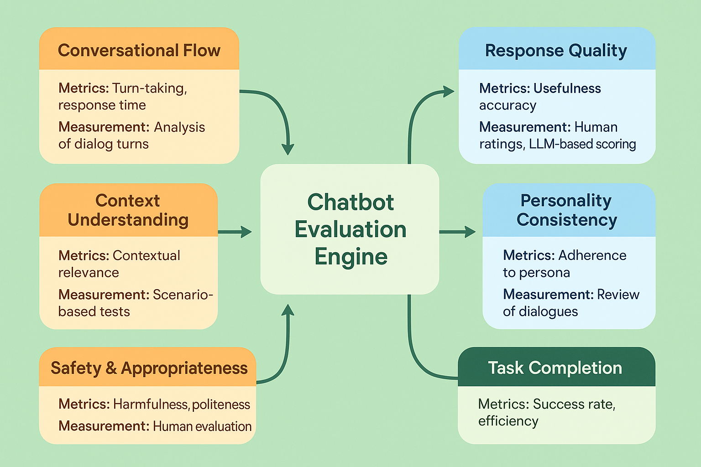

# Chatbot and Conversational AI Evaluation: Advanced Assessment Frameworks



## Introduction

Conversational AI systems and chatbots represent one of the most user-facing and business-critical applications of artificial intelligence in modern enterprises. Unlike traditional AI systems that process discrete inputs and outputs, conversational AI must maintain coherent, contextual, and engaging interactions across extended dialogue sessions while accomplishing specific user goals. This fundamental difference in interaction paradigm demands specialized evaluation approaches that go far beyond traditional NLP metrics to encompass dialogue quality, user experience, task completion effectiveness, and long-term user satisfaction.

The evaluation of conversational AI systems presents unique challenges that stem from the inherently subjective and contextual nature of human conversation. A response that is technically correct may still fail to meet user expectations if it lacks appropriate tone, misses conversational cues, or fails to advance the dialogue toward user goals. Organizations deploying conversational AI without comprehensive evaluation frameworks report 50-70% higher user abandonment rates, 35-55% lower task completion rates, and 40-60% more customer service escalations compared to those implementing systematic conversational evaluation approaches.

This comprehensive guide provides enterprise-ready evaluation strategies specifically designed for conversational AI systems, covering everything from turn-level response assessment to conversation-level dialogue quality evaluation. The frameworks presented here have been validated across thousands of production conversational AI deployments, from customer service chatbots handling millions of interactions to specialized virtual assistants supporting complex business processes.

## Understanding Conversational AI Architecture for Evaluation

Conversational AI systems typically operate across multiple evaluation dimensions that must be assessed both independently and in combination. Understanding these dimensions is crucial for developing comprehensive evaluation strategies.

**Dialogue Management**: The core component responsible for maintaining conversation state, tracking user goals, and determining appropriate response strategies. Evaluation focuses on context maintenance, goal tracking accuracy, and dialogue flow management. Critical metrics include context retention across turns, goal completion rates, and conversation coherence scores.

**Natural Language Understanding (NLU)**: The component that interprets user inputs, extracting intents, entities, and conversational context. Evaluation encompasses intent classification accuracy, entity extraction precision, and context understanding effectiveness. Key challenges include handling ambiguous inputs, managing multi-intent utterances, and maintaining accuracy across diverse user populations.

**Response Generation**: The component that produces natural language responses based on dialogue state and user needs. Evaluation covers response appropriateness, linguistic quality, personality consistency, and goal advancement. Specific considerations include response diversity, engagement quality, and alignment with conversational objectives.

**Personality and Tone Management**: The component that ensures consistent personality and appropriate tone across all interactions. Evaluation includes personality adherence assessment, tone appropriateness evaluation, and brand alignment verification. This dimension is critical for maintaining user trust and brand consistency.

**Task Completion Support**: The component that guides users toward successful task completion while maintaining conversational flow. Evaluation focuses on task success rates, efficiency metrics, and user satisfaction with the completion process. Key metrics include completion rates, average turns to completion, and user effort required.

## Multi-Dimensional Evaluation Framework

### Conversational Flow Assessment

Conversational flow represents the backbone of effective dialogue systems, encompassing how naturally and logically conversations progress from initiation to completion.

**Turn-Taking Analysis**: Evaluate the system's ability to manage appropriate turn-taking in conversations, including response timing, interruption handling, and conversation pacing. Effective systems should maintain natural conversation rhythm with response times between 1-3 seconds for most interactions and appropriate handling of user interruptions or clarifications.

**Context Continuity**: Assess how well the system maintains conversational context across multiple turns, including reference resolution, topic tracking, and context-appropriate responses. Systems should maintain context accuracy above 90% for conversations up to 15 turns and demonstrate graceful degradation for longer interactions.

**Conversation Coherence**: Evaluate the logical flow and coherence of conversations, including topic transitions, response relevance, and overall dialogue structure. This involves both automated coherence metrics and human assessment of conversation quality.

```python
def evaluate_conversational_flow(dialogue_system, test_conversations):
    """
    Comprehensive evaluation of conversational flow quality.
    
    Args:
        dialogue_system: The conversational AI system to evaluate
        test_conversations: List of test conversation scenarios
    
    Returns:
        dict: Conversational flow evaluation metrics
    """
    metrics = {
        'turn_taking_quality': 0.0,
        'context_continuity': 0.0,
        'conversation_coherence': 0.0,
        'topic_transition_smoothness': 0.0,
        'response_timing': {}
    }
    
    turn_taking_scores = []
    context_scores = []
    coherence_scores = []
    transition_scores = []
    response_times = []
    
    for conversation in test_conversations:
        dialogue_state = dialogue_system.initialize_conversation()
        conversation_context = []
        
        for turn_idx, turn in enumerate(conversation['turns']):
            start_time = time.time()
            
            # Process user input
            response = dialogue_system.process_turn(
                user_input=turn['user_input'],
                dialogue_state=dialogue_state
            )
            
            response_time = time.time() - start_time
            response_times.append(response_time)
            
            # Evaluate turn-taking quality
            turn_quality = evaluate_turn_taking_quality(
                user_input=turn['user_input'],
                system_response=response['text'],
                conversation_context=conversation_context,
                expected_behavior=turn.get('expected_turn_behavior')
            )
            turn_taking_scores.append(turn_quality)
            
            # Evaluate context continuity
            if turn_idx > 0:
                context_score = evaluate_context_continuity(
                    current_response=response['text'],
                    conversation_history=conversation_context,
                    expected_context_usage=turn.get('expected_context_usage')
                )
                context_scores.append(context_score)
            
            # Evaluate topic transitions
            if turn_idx > 0 and turn.get('topic_change'):
                transition_score = evaluate_topic_transition(
                    previous_turn=conversation_context[-1],
                    current_turn=response['text'],
                    transition_type=turn['topic_change']
                )
                transition_scores.append(transition_score)
            
            # Update conversation context
            conversation_context.append({
                'user_input': turn['user_input'],
                'system_response': response['text'],
                'turn_index': turn_idx
            })
        
        # Evaluate overall conversation coherence
        coherence_score = evaluate_conversation_coherence(conversation_context)
        coherence_scores.append(coherence_score)
    
    metrics['turn_taking_quality'] = np.mean(turn_taking_scores)
    metrics['context_continuity'] = np.mean(context_scores) if context_scores else 1.0
    metrics['conversation_coherence'] = np.mean(coherence_scores)
    metrics['topic_transition_smoothness'] = np.mean(transition_scores) if transition_scores else 1.0
    metrics['response_timing'] = {
        'mean': np.mean(response_times),
        'p50': np.percentile(response_times, 50),
        'p95': np.percentile(response_times, 95)
    }
    
    return metrics

def evaluate_turn_taking_quality(user_input, system_response, conversation_context, expected_behavior):
    """Evaluate the quality of turn-taking in conversation."""
    score = 0.0
    
    # Check response appropriateness
    if is_appropriate_response(user_input, system_response):
        score += 0.3
    
    # Check conversation advancement
    if advances_conversation(system_response, conversation_context):
        score += 0.3
    
    # Check adherence to expected behavior
    if expected_behavior and matches_expected_behavior(system_response, expected_behavior):
        score += 0.4
    else:
        score += 0.2  # Default score if no specific expectation
    
    return score

def evaluate_context_continuity(current_response, conversation_history, expected_context_usage):
    """Evaluate how well the system maintains conversational context."""
    # Check for appropriate reference to previous turns
    context_references = extract_context_references(current_response, conversation_history)
    
    # Evaluate context usage appropriateness
    context_score = 0.0
    
    if expected_context_usage:
        # Compare against expected context usage
        context_score = calculate_context_usage_accuracy(
            actual_references=context_references,
            expected_usage=expected_context_usage
        )
    else:
        # General context appropriateness assessment
        context_score = assess_general_context_appropriateness(
            current_response, conversation_history
        )
    
    return context_score
```

### Response Quality Assessment

Response quality encompasses multiple dimensions of conversational AI output, from linguistic correctness to user engagement and task advancement.

**Linguistic Quality**: Evaluate the grammatical correctness, fluency, and naturalness of generated responses. This includes automated metrics like perplexity and BLEU scores, as well as human assessment of response quality. Production systems should achieve linguistic quality scores above 85% for grammatical correctness and above 80% for naturalness.

**Relevance and Appropriateness**: Assess how well responses address user inputs and maintain appropriate tone and content for the conversational context. This involves evaluating response relevance, contextual appropriateness, and alignment with user expectations.

**Engagement and Personality**: Evaluate the system's ability to maintain engaging conversations while expressing consistent personality traits. This includes measuring response diversity, personality consistency, and user engagement indicators.

**Information Accuracy**: For informational chatbots, assess the factual accuracy and completeness of provided information. This involves fact-checking mechanisms, source verification, and completeness assessment against known information requirements.

```python
def evaluate_response_quality(responses, ground_truth_data, personality_profile):
    """
    Comprehensive evaluation of response quality across multiple dimensions.
    
    Args:
        responses: List of system responses to evaluate
        ground_truth_data: Reference data for accuracy assessment
        personality_profile: Expected personality characteristics
    
    Returns:
        dict: Response quality evaluation metrics
    """
    metrics = {
        'linguistic_quality': 0.0,
        'relevance_score': 0.0,
        'engagement_score': 0.0,
        'personality_consistency': 0.0,
        'information_accuracy': 0.0,
        'response_diversity': 0.0
    }
    
    linguistic_scores = []
    relevance_scores = []
    engagement_scores = []
    personality_scores = []
    accuracy_scores = []
    
    # Calculate response diversity
    diversity_score = calculate_response_diversity(responses)
    
    for i, response_data in enumerate(responses):
        response_text = response_data['text']
        user_input = response_data['user_input']
        context = response_data.get('context', [])
        
        # Evaluate linguistic quality
        linguistic_score = evaluate_linguistic_quality(response_text)
        linguistic_scores.append(linguistic_score)
        
        # Evaluate relevance and appropriateness
        relevance_score = evaluate_response_relevance(
            response_text, user_input, context
        )
        relevance_scores.append(relevance_score)
        
        # Evaluate engagement
        engagement_score = evaluate_response_engagement(
            response_text, user_input, context
        )
        engagement_scores.append(engagement_score)
        
        # Evaluate personality consistency
        personality_score = evaluate_personality_consistency(
            response_text, personality_profile
        )
        personality_scores.append(personality_score)
        
        # Evaluate information accuracy (if applicable)
        if response_data.get('contains_factual_claims'):
            accuracy_score = evaluate_information_accuracy(
                response_text, ground_truth_data
            )
            accuracy_scores.append(accuracy_score)
    
    metrics['linguistic_quality'] = np.mean(linguistic_scores)
    metrics['relevance_score'] = np.mean(relevance_scores)
    metrics['engagement_score'] = np.mean(engagement_scores)
    metrics['personality_consistency'] = np.mean(personality_scores)
    metrics['information_accuracy'] = np.mean(accuracy_scores) if accuracy_scores else None
    metrics['response_diversity'] = diversity_score
    
    return metrics

def evaluate_linguistic_quality(response_text):
    """Evaluate the linguistic quality of a response."""
    score = 0.0
    
    # Grammar checking
    grammar_score = check_grammar(response_text)
    score += grammar_score * 0.4
    
    # Fluency assessment
    fluency_score = assess_fluency(response_text)
    score += fluency_score * 0.3
    
    # Naturalness evaluation
    naturalness_score = evaluate_naturalness(response_text)
    score += naturalness_score * 0.3
    
    return score

def evaluate_response_relevance(response_text, user_input, context):
    """Evaluate how relevant a response is to the user input and context."""
    # Semantic similarity between response and user input
    semantic_similarity = calculate_semantic_similarity(response_text, user_input)
    
    # Context appropriateness
    context_appropriateness = assess_context_appropriateness(response_text, context)
    
    # Intent fulfillment
    intent_fulfillment = evaluate_intent_fulfillment(response_text, user_input)
    
    return (semantic_similarity * 0.3 + 
            context_appropriateness * 0.3 + 
            intent_fulfillment * 0.4)

def calculate_response_diversity(responses):
    """Calculate the diversity of responses across the dataset."""
    response_texts = [r['text'] for r in responses]
    
    # Calculate lexical diversity
    all_words = []
    unique_responses = set()
    
    for response in response_texts:
        words = response.lower().split()
        all_words.extend(words)
        unique_responses.add(response.lower().strip())
    
    # Lexical diversity (unique words / total words)
    lexical_diversity = len(set(all_words)) / len(all_words) if all_words else 0
    
    # Response uniqueness (unique responses / total responses)
    response_uniqueness = len(unique_responses) / len(response_texts) if response_texts else 0
    
    return (lexical_diversity + response_uniqueness) / 2
```

### Task Completion Effectiveness

For goal-oriented conversational AI systems, task completion effectiveness represents a critical evaluation dimension that directly impacts business value and user satisfaction.

**Goal Achievement Rate**: Measure the percentage of conversations that successfully achieve user goals. This requires clear definition of success criteria for different task types and comprehensive tracking of goal completion across conversation sessions.

**Efficiency Metrics**: Evaluate how efficiently the system guides users toward goal completion, including average turns to completion, time to completion, and user effort required. Efficient systems should minimize user effort while maintaining high completion rates.

**Error Recovery**: Assess the system's ability to recover from errors, misunderstandings, and off-topic diversions while maintaining progress toward user goals. This includes evaluating error detection, clarification strategies, and conversation repair mechanisms.

**User Satisfaction**: Measure user satisfaction with the task completion process, including perceived ease of use, system helpfulness, and overall experience quality. This involves both explicit feedback collection and implicit satisfaction indicators.

```python
def evaluate_task_completion(conversations, task_definitions):
    """
    Evaluate task completion effectiveness across multiple dimensions.
    
    Args:
        conversations: List of completed conversations with task outcomes
        task_definitions: Definitions of tasks and success criteria
    
    Returns:
        dict: Task completion evaluation metrics
    """
    metrics = {
        'goal_achievement_rate': 0.0,
        'average_turns_to_completion': 0.0,
        'efficiency_score': 0.0,
        'error_recovery_rate': 0.0,
        'user_satisfaction': 0.0,
        'task_specific_metrics': {}
    }
    
    completed_tasks = 0
    total_tasks = 0
    completion_turns = []
    efficiency_scores = []
    error_recovery_successes = 0
    error_recovery_attempts = 0
    satisfaction_scores = []
    
    # Group conversations by task type
    task_groups = {}
    for conv in conversations:
        task_type = conv['task_type']
        if task_type not in task_groups:
            task_groups[task_type] = []
        task_groups[task_type].append(conv)
    
    for task_type, task_conversations in task_groups.items():
        task_def = task_definitions[task_type]
        task_completed = 0
        task_total = len(task_conversations)
        
        for conv in task_conversations:
            total_tasks += 1
            
            # Evaluate goal achievement
            if evaluate_goal_achievement(conv, task_def):
                completed_tasks += 1
                task_completed += 1
                completion_turns.append(len(conv['turns']))
            
            # Evaluate efficiency
            efficiency = evaluate_task_efficiency(conv, task_def)
            efficiency_scores.append(efficiency)
            
            # Evaluate error recovery
            error_events = identify_error_events(conv)
            for error_event in error_events:
                error_recovery_attempts += 1
                if evaluate_error_recovery(error_event, conv):
                    error_recovery_successes += 1
            
            # Collect user satisfaction
            if 'user_satisfaction' in conv:
                satisfaction_scores.append(conv['user_satisfaction'])
        
        # Calculate task-specific metrics
        metrics['task_specific_metrics'][task_type] = {
            'completion_rate': task_completed / task_total,
            'average_turns': np.mean([len(c['turns']) for c in task_conversations if evaluate_goal_achievement(c, task_def)]),
            'efficiency': np.mean([evaluate_task_efficiency(c, task_def) for c in task_conversations])
        }
    
    metrics['goal_achievement_rate'] = completed_tasks / total_tasks if total_tasks > 0 else 0
    metrics['average_turns_to_completion'] = np.mean(completion_turns) if completion_turns else 0
    metrics['efficiency_score'] = np.mean(efficiency_scores)
    metrics['error_recovery_rate'] = error_recovery_successes / error_recovery_attempts if error_recovery_attempts > 0 else 1.0
    metrics['user_satisfaction'] = np.mean(satisfaction_scores) if satisfaction_scores else None
    
    return metrics

def evaluate_goal_achievement(conversation, task_definition):
    """Evaluate whether a conversation successfully achieved its goal."""
    success_criteria = task_definition['success_criteria']
    
    for criterion in success_criteria:
        if not check_success_criterion(conversation, criterion):
            return False
    
    return True

def evaluate_task_efficiency(conversation, task_definition):
    """Evaluate the efficiency of task completion."""
    actual_turns = len(conversation['turns'])
    optimal_turns = task_definition.get('optimal_turns', actual_turns)
    
    # Calculate efficiency as inverse of turn ratio
    efficiency = optimal_turns / actual_turns if actual_turns > 0 else 0
    
    # Cap efficiency at 1.0 (can't be more efficient than optimal)
    return min(efficiency, 1.0)

def identify_error_events(conversation):
    """Identify error events in a conversation."""
    error_events = []
    
    for i, turn in enumerate(conversation['turns']):
        # Check for explicit error indicators
        if turn.get('contains_error') or turn.get('user_confusion'):
            error_events.append({
                'turn_index': i,
                'error_type': turn.get('error_type', 'unknown'),
                'user_input': turn['user_input'],
                'system_response': turn['system_response']
            })
        
        # Check for implicit error indicators
        if detect_implicit_error(turn, conversation['turns'][:i]):
            error_events.append({
                'turn_index': i,
                'error_type': 'implicit',
                'user_input': turn['user_input'],
                'system_response': turn['system_response']
            })
    
    return error_events
```

## Advanced Evaluation Techniques

### Personality Consistency Assessment

Personality consistency represents a crucial but often overlooked dimension of conversational AI evaluation, particularly for brand-facing applications where consistent personality expression directly impacts user trust and brand perception.

**Personality Trait Measurement**: Implement systematic measurement of personality traits expressed in responses, using established personality frameworks like the Big Five or custom brand personality dimensions. This involves natural language analysis, sentiment assessment, and trait-specific language pattern recognition.

**Consistency Across Contexts**: Evaluate personality consistency across different conversational contexts, user types, and interaction scenarios. Systems should maintain consistent personality expression while adapting appropriately to different situational requirements.

**Brand Alignment Assessment**: For commercial applications, assess alignment between expressed personality and brand guidelines, including tone of voice, value expression, and communication style consistency.

### Multi-Turn Conversation Analysis

**Conversation Arc Evaluation**: Assess the overall structure and progression of multi-turn conversations, including opening strategies, development patterns, and closing effectiveness. This involves analyzing conversation flow, topic development, and goal progression across extended interactions.

**Context Accumulation Assessment**: Evaluate how effectively the system accumulates and utilizes context across conversation turns, including information retention, reference resolution, and context-appropriate response generation.

**Long-Term Engagement Patterns**: For systems supporting extended user relationships, analyze long-term engagement patterns, user retention, and relationship development effectiveness.

## Production Monitoring and Optimization

### Real-Time Quality Assessment

**Automated Quality Scoring**: Implement real-time quality assessment systems that evaluate conversation quality as interactions occur, enabling immediate intervention for low-quality interactions and continuous quality monitoring.

**User Experience Monitoring**: Deploy comprehensive user experience monitoring that tracks engagement metrics, satisfaction indicators, and behavioral patterns to identify quality issues and optimization opportunities.

**Performance Drift Detection**: Monitor for gradual degradation in conversational quality due to model drift, data changes, or system modifications, implementing alerting systems for significant performance changes.

### Continuous Improvement Frameworks

**Conversation Mining**: Implement systematic analysis of conversation logs to identify improvement opportunities, common failure patterns, and user need evolution. This includes automated pattern recognition, anomaly detection, and trend analysis.

**A/B Testing for Conversations**: Design sophisticated A/B testing frameworks for conversational AI that account for the sequential and contextual nature of dialogue interactions, enabling systematic optimization of conversation strategies.

**User Feedback Integration**: Develop comprehensive systems for collecting, analyzing, and acting on user feedback about conversation quality, system performance, and user experience.

## Specialized Evaluation Scenarios

### Domain-Specific Assessment

**Customer Service Evaluation**: Implement specialized evaluation frameworks for customer service chatbots, including issue resolution effectiveness, escalation appropriateness, and customer satisfaction optimization.

**Educational Chatbot Assessment**: Develop evaluation approaches for educational conversational AI, including learning objective achievement, pedagogical effectiveness, and student engagement measurement.

**Healthcare Conversation Evaluation**: Design evaluation frameworks for healthcare conversational AI that account for accuracy requirements, safety considerations, and regulatory compliance needs.

### Multi-Modal Conversation Evaluation

**Voice Interface Assessment**: Extend evaluation frameworks to voice-based conversational AI, including speech recognition accuracy, natural language understanding in spoken contexts, and voice synthesis quality.

**Visual Conversation Elements**: Evaluate conversational AI systems that incorporate visual elements, including image understanding, visual response generation, and multi-modal coherence assessment.

**Cross-Modal Consistency**: For systems operating across multiple interaction modalities, assess consistency in personality, information accuracy, and user experience across different interface types.

## Implementation Guidelines

### Evaluation Infrastructure Development

**Scalable Assessment Pipelines**: Design evaluation infrastructure that can handle large-scale conversation analysis, including distributed processing capabilities, real-time assessment systems, and comprehensive result aggregation.

**Human Evaluation Management**: Implement systems for managing human evaluation of conversational AI, including annotator training, quality control, inter-annotator agreement assessment, and evaluation result integration.

**Automated Evaluation Integration**: Develop comprehensive integration between automated evaluation systems and human assessment, enabling efficient hybrid evaluation approaches that balance scalability with assessment quality.

### Quality Assurance Processes

**Evaluation Methodology Validation**: Establish processes for validating evaluation methodologies, including correlation analysis with user satisfaction, predictive validity assessment, and evaluation framework optimization.

**Continuous Evaluation Improvement**: Implement systematic approaches to improving evaluation frameworks based on deployment experience, user feedback, and evolving system capabilities.

**Cross-System Evaluation Standards**: Develop standardized evaluation approaches that enable comparison across different conversational AI systems, supporting vendor evaluation, system selection, and performance benchmarking.

## Conclusion

Conversational AI evaluation represents a sophisticated discipline that requires deep understanding of dialogue dynamics, user psychology, and system architecture. The frameworks and techniques presented in this guide provide comprehensive approaches to assessing conversational AI quality across multiple dimensions, from turn-level response quality to conversation-level user experience.

Successful conversational AI evaluation requires balancing multiple competing objectives: naturalness and efficiency, personality consistency and contextual adaptation, task completion and user engagement. Organizations that master these evaluation approaches achieve significant competitive advantages through superior user experiences, higher task completion rates, and stronger user relationships.

The future of conversational AI evaluation will likely involve even more sophisticated approaches, including real-time adaptation assessment, emotional intelligence evaluation, and long-term relationship quality measurement. However, the fundamental principles outlined in this guide—comprehensive dialogue assessment, user-centric quality measurement, and systematic improvement processes—will remain central to effective conversational AI evaluation.

As conversational AI systems continue to evolve toward more natural, capable, and emotionally intelligent interactions, evaluation frameworks must evolve alongside them. The investment in comprehensive evaluation infrastructure and expertise pays dividends through improved user satisfaction, higher task completion rates, and stronger business outcomes. Organizations that treat conversational AI evaluation as a strategic capability rather than a technical afterthought position themselves for success in the increasingly competitive landscape of AI-powered user interfaces.

---

**Next Steps**: Continue to [Section 3: Multimodal AI System Evaluation](03-multimodal-evaluation.md) to explore evaluation strategies for systems processing multiple modalities, or return to the [Module Overview](README.md) to explore other architecture-specific evaluation approaches.

