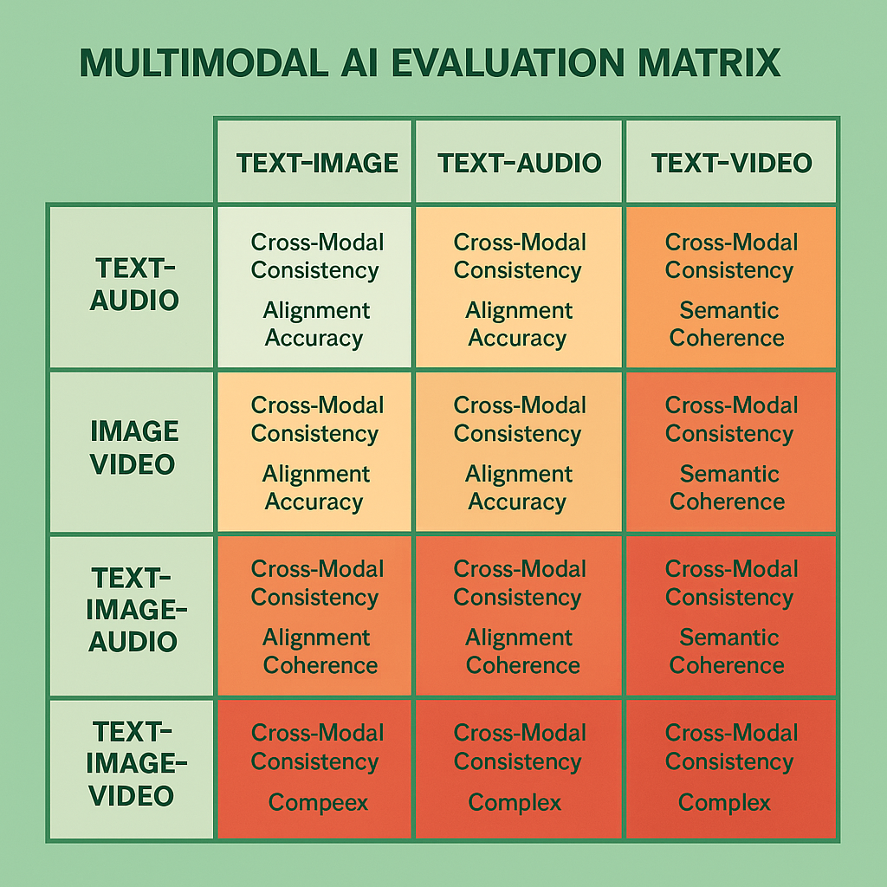

# Multimodal AI System Evaluation: Cross-Modal Assessment Strategies



## Introduction

Multimodal AI systems represent the cutting edge of artificial intelligence, combining multiple input and output modalities—text, images, audio, video, and sensor data—to create more comprehensive and human-like AI interactions. These systems can understand and generate content across modalities, enabling applications like visual question answering, image captioning, video analysis, and cross-modal content generation. However, the complexity of multimodal systems introduces unique evaluation challenges that go far beyond single-modality assessment approaches.

The evaluation of multimodal AI systems requires sophisticated frameworks that assess not only the quality of individual modality processing but also the coherence, consistency, and effectiveness of cross-modal interactions. Organizations deploying multimodal AI without comprehensive evaluation frameworks report 60-80% higher rates of cross-modal inconsistencies, 45-65% lower user satisfaction with multimodal features, and 50-70% more deployment failures compared to those implementing systematic multimodal evaluation approaches.

This comprehensive guide provides enterprise-ready evaluation strategies specifically designed for multimodal AI systems, covering cross-modal consistency assessment, modality-specific quality evaluation, and integrated system performance measurement. The frameworks presented here have been validated across diverse multimodal AI deployments, from content creation platforms to autonomous systems requiring multimodal perception and reasoning.

## Multimodal Architecture Understanding

Multimodal AI systems typically integrate several key components that must be evaluated both independently and as integrated systems:

**Modality Encoders**: Components that process individual modalities (text, image, audio, video) into shared representation spaces. Evaluation focuses on encoding quality, representation effectiveness, and cross-modal alignment capabilities.

**Cross-Modal Fusion**: Mechanisms that combine information from multiple modalities into coherent representations. Assessment includes fusion effectiveness, information preservation, and modality balance evaluation.

**Multimodal Reasoning**: Components that perform reasoning across modalities, enabling complex understanding and generation tasks. Evaluation encompasses reasoning accuracy, cross-modal inference quality, and logical consistency assessment.

**Modality-Specific Decoders**: Components that generate outputs in specific modalities based on multimodal understanding. Assessment includes generation quality, modality-appropriate expression, and cross-modal consistency maintenance.

## Cross-Modal Consistency Evaluation

### Semantic Alignment Assessment

Cross-modal semantic alignment represents the foundation of effective multimodal AI systems, ensuring that information expressed in different modalities maintains consistent meaning and relationships.

**Content Consistency Verification**: Implement systematic approaches to verify that content expressed across different modalities maintains semantic consistency. This includes comparing textual descriptions with visual content, ensuring audio-visual synchronization, and validating cross-modal factual accuracy.

**Relationship Preservation**: Evaluate how well systems preserve semantic relationships when translating information between modalities. This involves assessing whether spatial relationships in images are correctly described in text, temporal relationships in video are accurately captured in summaries, and emotional content is consistently expressed across modalities.

**Cross-Modal Entailment**: Assess the logical consistency of information across modalities using natural language inference techniques adapted for multimodal contexts. Systems should maintain logical consistency with entailment accuracy above 85% for cross-modal information pairs.

```python
def evaluate_cross_modal_consistency(multimodal_system, test_cases):
    """
    Comprehensive evaluation of cross-modal consistency in multimodal AI systems.
    
    Args:
        multimodal_system: The multimodal AI system to evaluate
        test_cases: List of test cases with multimodal content and consistency requirements
    
    Returns:
        dict: Cross-modal consistency evaluation metrics
    """
    metrics = {
        'semantic_alignment': 0.0,
        'content_consistency': 0.0,
        'relationship_preservation': 0.0,
        'cross_modal_entailment': 0.0,
        'temporal_consistency': 0.0
    }
    
    alignment_scores = []
    consistency_scores = []
    relationship_scores = []
    entailment_scores = []
    temporal_scores = []
    
    for test_case in test_cases:
        # Process multimodal input
        system_output = multimodal_system.process_multimodal_input(
            text=test_case.get('text'),
            image=test_case.get('image'),
            audio=test_case.get('audio'),
            video=test_case.get('video')
        )
        
        # Evaluate semantic alignment
        if 'text' in test_case and 'image' in test_case:
            alignment_score = evaluate_text_image_alignment(
                text=test_case['text'],
                image=test_case['image'],
                system_understanding=system_output['cross_modal_representation']
            )
            alignment_scores.append(alignment_score)
        
        # Evaluate content consistency
        consistency_score = evaluate_content_consistency(
            input_modalities=test_case,
            system_output=system_output,
            expected_consistency=test_case.get('consistency_requirements')
        )
        consistency_scores.append(consistency_score)
        
        # Evaluate relationship preservation
        if 'spatial_relationships' in test_case or 'temporal_relationships' in test_case:
            relationship_score = evaluate_relationship_preservation(
                input_data=test_case,
                system_output=system_output
            )
            relationship_scores.append(relationship_score)
        
        # Evaluate cross-modal entailment
        if 'entailment_pairs' in test_case:
            entailment_score = evaluate_cross_modal_entailment(
                entailment_pairs=test_case['entailment_pairs'],
                system_reasoning=system_output['reasoning_output']
            )
            entailment_scores.append(entailment_score)
        
        # Evaluate temporal consistency (for video/audio)
        if 'video' in test_case or 'audio' in test_case:
            temporal_score = evaluate_temporal_consistency(
                temporal_data=test_case,
                system_output=system_output
            )
            temporal_scores.append(temporal_score)
    
    metrics['semantic_alignment'] = np.mean(alignment_scores) if alignment_scores else None
    metrics['content_consistency'] = np.mean(consistency_scores)
    metrics['relationship_preservation'] = np.mean(relationship_scores) if relationship_scores else None
    metrics['cross_modal_entailment'] = np.mean(entailment_scores) if entailment_scores else None
    metrics['temporal_consistency'] = np.mean(temporal_scores) if temporal_scores else None
    
    return metrics

def evaluate_text_image_alignment(text, image, system_understanding):
    """Evaluate alignment between text and image content."""
    # Extract visual concepts from image
    visual_concepts = extract_visual_concepts(image)
    
    # Extract textual concepts from text
    textual_concepts = extract_textual_concepts(text)
    
    # Evaluate concept overlap and consistency
    concept_overlap = calculate_concept_overlap(visual_concepts, textual_concepts)
    
    # Evaluate system's understanding alignment
    understanding_alignment = evaluate_understanding_alignment(
        visual_concepts, textual_concepts, system_understanding
    )
    
    return (concept_overlap + understanding_alignment) / 2

def evaluate_content_consistency(input_modalities, system_output, expected_consistency):
    """Evaluate consistency of content across modalities."""
    consistency_score = 0.0
    
    # Check factual consistency across modalities
    if 'factual_claims' in expected_consistency:
        factual_consistency = check_factual_consistency(
            input_modalities, system_output, expected_consistency['factual_claims']
        )
        consistency_score += factual_consistency * 0.4
    
    # Check emotional consistency
    if 'emotional_tone' in expected_consistency:
        emotional_consistency = check_emotional_consistency(
            input_modalities, system_output, expected_consistency['emotional_tone']
        )
        consistency_score += emotional_consistency * 0.3
    
    # Check stylistic consistency
    if 'style_consistency' in expected_consistency:
        style_consistency = check_style_consistency(
            input_modalities, system_output, expected_consistency['style_consistency']
        )
        consistency_score += style_consistency * 0.3
    
    return consistency_score
```

### Modality-Specific Quality Assessment

While cross-modal consistency is crucial, each modality within multimodal systems must also meet high-quality standards for individual modality processing.

**Visual Processing Quality**: For image and video processing components, evaluate object detection accuracy, scene understanding quality, visual reasoning capabilities, and image generation fidelity. Systems should achieve object detection mAP scores above 0.7 for general domains and above 0.8 for specialized applications.

**Audio Processing Excellence**: Assess speech recognition accuracy, audio classification performance, music understanding capabilities, and audio generation quality. Speech recognition should achieve word error rates below 5% for clear audio and below 15% for challenging acoustic conditions.

**Text Processing Sophistication**: Evaluate natural language understanding accuracy, text generation quality, semantic reasoning capabilities, and linguistic coherence. Text processing components should maintain accuracy above 90% for standard NLP tasks and above 85% for complex reasoning tasks.

**Temporal Processing Capabilities**: For video and sequential audio processing, assess temporal understanding, event detection accuracy, sequence modeling quality, and temporal reasoning capabilities.

## Integrated System Performance Evaluation

### End-to-End Task Assessment

Multimodal AI systems must be evaluated on their ability to complete complex tasks that require integration across multiple modalities.

**Visual Question Answering**: Evaluate the system's ability to answer questions about visual content, requiring integration of visual understanding and textual reasoning. Systems should achieve accuracy above 80% on standard VQA benchmarks and above 70% on complex reasoning tasks.

**Cross-Modal Retrieval**: Assess the system's ability to retrieve relevant content across modalities, such as finding images based on text descriptions or identifying audio clips matching visual scenes. Retrieval systems should achieve recall@10 above 0.8 for well-defined queries.

**Multimodal Content Generation**: Evaluate the quality of content generated across multiple modalities, including image captioning, video summarization, and cross-modal content creation. Generated content should maintain consistency scores above 85% and quality scores above 80%.

**Complex Reasoning Tasks**: Assess performance on tasks requiring sophisticated reasoning across modalities, such as visual storytelling, multimodal dialogue, and cross-modal inference. These tasks require evaluation frameworks that account for creativity, coherence, and logical consistency.

```python
def evaluate_integrated_performance(multimodal_system, task_suite):
    """
    Evaluate integrated performance across multimodal tasks.
    
    Args:
        multimodal_system: The multimodal AI system to evaluate
        task_suite: Collection of multimodal tasks for evaluation
    
    Returns:
        dict: Integrated performance evaluation metrics
    """
    metrics = {
        'vqa_accuracy': 0.0,
        'cross_modal_retrieval': {},
        'content_generation_quality': {},
        'reasoning_task_performance': {},
        'overall_integration_score': 0.0
    }
    
    # Evaluate Visual Question Answering
    if 'vqa' in task_suite:
        vqa_results = evaluate_vqa_performance(
            multimodal_system, task_suite['vqa']
        )
        metrics['vqa_accuracy'] = vqa_results['accuracy']
    
    # Evaluate Cross-Modal Retrieval
    if 'retrieval' in task_suite:
        retrieval_results = evaluate_cross_modal_retrieval(
            multimodal_system, task_suite['retrieval']
        )
        metrics['cross_modal_retrieval'] = retrieval_results
    
    # Evaluate Content Generation
    if 'generation' in task_suite:
        generation_results = evaluate_multimodal_generation(
            multimodal_system, task_suite['generation']
        )
        metrics['content_generation_quality'] = generation_results
    
    # Evaluate Complex Reasoning
    if 'reasoning' in task_suite:
        reasoning_results = evaluate_multimodal_reasoning(
            multimodal_system, task_suite['reasoning']
        )
        metrics['reasoning_task_performance'] = reasoning_results
    
    # Calculate overall integration score
    integration_scores = []
    for task_type, results in metrics.items():
        if task_type != 'overall_integration_score' and isinstance(results, dict):
            if 'overall_score' in results:
                integration_scores.append(results['overall_score'])
        elif task_type != 'overall_integration_score' and isinstance(results, (int, float)):
            integration_scores.append(results)
    
    metrics['overall_integration_score'] = np.mean(integration_scores) if integration_scores else 0.0
    
    return metrics

def evaluate_vqa_performance(multimodal_system, vqa_dataset):
    """Evaluate Visual Question Answering performance."""
    correct_answers = 0
    total_questions = len(vqa_dataset)
    
    answer_type_accuracy = {}
    complexity_accuracy = {}
    
    for vqa_item in vqa_dataset:
        # Generate answer using multimodal system
        predicted_answer = multimodal_system.answer_visual_question(
            image=vqa_item['image'],
            question=vqa_item['question']
        )
        
        # Evaluate answer correctness
        is_correct = evaluate_answer_correctness(
            predicted_answer, vqa_item['ground_truth_answer']
        )
        
        if is_correct:
            correct_answers += 1
        
        # Track performance by answer type
        answer_type = vqa_item.get('answer_type', 'unknown')
        if answer_type not in answer_type_accuracy:
            answer_type_accuracy[answer_type] = {'correct': 0, 'total': 0}
        answer_type_accuracy[answer_type]['total'] += 1
        if is_correct:
            answer_type_accuracy[answer_type]['correct'] += 1
        
        # Track performance by question complexity
        complexity = vqa_item.get('complexity', 'medium')
        if complexity not in complexity_accuracy:
            complexity_accuracy[complexity] = {'correct': 0, 'total': 0}
        complexity_accuracy[complexity]['total'] += 1
        if is_correct:
            complexity_accuracy[complexity]['correct'] += 1
    
    # Calculate accuracy by category
    for category in answer_type_accuracy:
        answer_type_accuracy[category]['accuracy'] = (
            answer_type_accuracy[category]['correct'] / 
            answer_type_accuracy[category]['total']
        )
    
    for complexity in complexity_accuracy:
        complexity_accuracy[complexity]['accuracy'] = (
            complexity_accuracy[complexity]['correct'] / 
            complexity_accuracy[complexity]['total']
        )
    
    return {
        'accuracy': correct_answers / total_questions,
        'answer_type_breakdown': answer_type_accuracy,
        'complexity_breakdown': complexity_accuracy
    }
```

## Advanced Multimodal Evaluation Techniques

### Cross-Modal Attention Analysis

Understanding how multimodal systems allocate attention across different modalities provides crucial insights into system behavior and potential improvement areas.

**Attention Distribution Assessment**: Analyze how systems distribute attention across modalities for different task types, identifying whether attention patterns align with human expectations and task requirements.

**Cross-Modal Attention Coherence**: Evaluate whether attention patterns across modalities are coherent and mutually supportive, rather than conflicting or redundant.

**Attention-Performance Correlation**: Assess the relationship between attention patterns and task performance, identifying optimal attention strategies for different multimodal scenarios.

### Robustness and Failure Mode Analysis

Multimodal systems face unique robustness challenges due to the complexity of cross-modal interactions and the potential for cascading failures across modalities.

**Modality Dropout Resilience**: Evaluate system performance when individual modalities are unavailable or degraded, assessing graceful degradation capabilities and compensation strategies.

**Cross-Modal Interference**: Assess how conflicting or noisy information in one modality affects processing and reasoning in other modalities.

**Adversarial Robustness**: Evaluate system resilience to adversarial attacks that exploit cross-modal vulnerabilities, including attacks that manipulate one modality to influence processing of others.

## Production Deployment Considerations

### Real-Time Performance Monitoring

Multimodal systems in production require sophisticated monitoring approaches that account for the complexity of cross-modal processing and the potential for subtle quality degradation.

**Cross-Modal Quality Drift**: Monitor for gradual degradation in cross-modal consistency and quality, implementing alerting systems for significant performance changes across modality combinations.

**Modality-Specific Performance Tracking**: Maintain separate monitoring for each modality while tracking their integrated performance, enabling rapid identification of component-specific issues.

**User Experience Monitoring**: Deploy comprehensive user experience monitoring that captures satisfaction with multimodal features, interaction patterns, and task completion effectiveness.

### Scalability and Resource Optimization

**Computational Efficiency Assessment**: Evaluate the computational efficiency of multimodal processing, including memory usage, processing latency, and resource allocation across modalities.

**Modality Processing Optimization**: Assess opportunities for optimizing individual modality processing while maintaining cross-modal integration quality.

**Dynamic Resource Allocation**: Evaluate systems' ability to dynamically allocate computational resources based on task requirements and modality importance.

## Specialized Multimodal Applications

### Creative Content Generation

**Artistic Quality Assessment**: For creative multimodal applications, develop evaluation frameworks that assess artistic quality, creativity, and aesthetic appeal across modalities.

**Style Consistency Evaluation**: Assess consistency of artistic style and creative expression across different modalities in generated content.

**Creative Coherence Assessment**: Evaluate the coherence and thematic consistency of creative content that spans multiple modalities.

### Scientific and Technical Applications

**Accuracy and Precision Requirements**: For scientific applications, implement evaluation frameworks that meet domain-specific accuracy and precision requirements across modalities.

**Domain Knowledge Integration**: Assess how effectively systems integrate domain-specific knowledge across modalities for specialized applications.

**Regulatory Compliance Evaluation**: For regulated domains, ensure evaluation frameworks address compliance requirements for multimodal AI systems.

## Future Directions and Emerging Challenges

### Next-Generation Multimodal Evaluation

**Embodied AI Assessment**: Develop evaluation frameworks for embodied AI systems that integrate multimodal perception with physical interaction capabilities.

**Real-World Deployment Evaluation**: Create evaluation approaches that account for real-world deployment conditions, including environmental variability and user diversity.

**Continuous Learning Assessment**: Evaluate multimodal systems' ability to continuously learn and adapt while maintaining cross-modal consistency and quality.

### Ethical and Social Considerations

**Bias Assessment Across Modalities**: Implement comprehensive bias evaluation that accounts for potential bias amplification through cross-modal interactions.

**Fairness in Multimodal Systems**: Develop fairness evaluation frameworks that ensure equitable performance across different user populations and use cases.

**Privacy and Security Evaluation**: Assess privacy and security implications of multimodal data processing, including cross-modal inference risks and data protection requirements.

## Conclusion

Multimodal AI evaluation represents one of the most challenging and important frontiers in AI assessment. The frameworks and techniques presented in this guide provide comprehensive approaches to evaluating multimodal systems across multiple dimensions, from cross-modal consistency to integrated task performance.

Successful multimodal evaluation requires sophisticated understanding of cross-modal interactions, modality-specific requirements, and integrated system behavior. Organizations that master these evaluation approaches achieve significant competitive advantages through superior multimodal AI capabilities, more reliable system performance, and enhanced user experiences.

The future of multimodal AI evaluation will likely involve even more sophisticated approaches, including real-time adaptation assessment, embodied intelligence evaluation, and comprehensive bias and fairness analysis across modalities. However, the fundamental principles outlined in this guide—cross-modal consistency assessment, integrated performance evaluation, and systematic quality measurement—will remain central to effective multimodal AI evaluation.

As multimodal AI systems continue to evolve toward more sophisticated and human-like capabilities, evaluation frameworks must evolve alongside them. The investment in comprehensive multimodal evaluation infrastructure and expertise pays dividends through improved system reliability, enhanced user satisfaction, and stronger competitive positioning in the rapidly advancing field of multimodal artificial intelligence.

---

**Next Steps**: Continue to [Section 4: Content Generation System Evaluation](04-content-generation-evaluation.md) to explore evaluation strategies for creative and content generation systems, or return to the [Module Overview](README.md) to explore other architecture-specific evaluation approaches.

