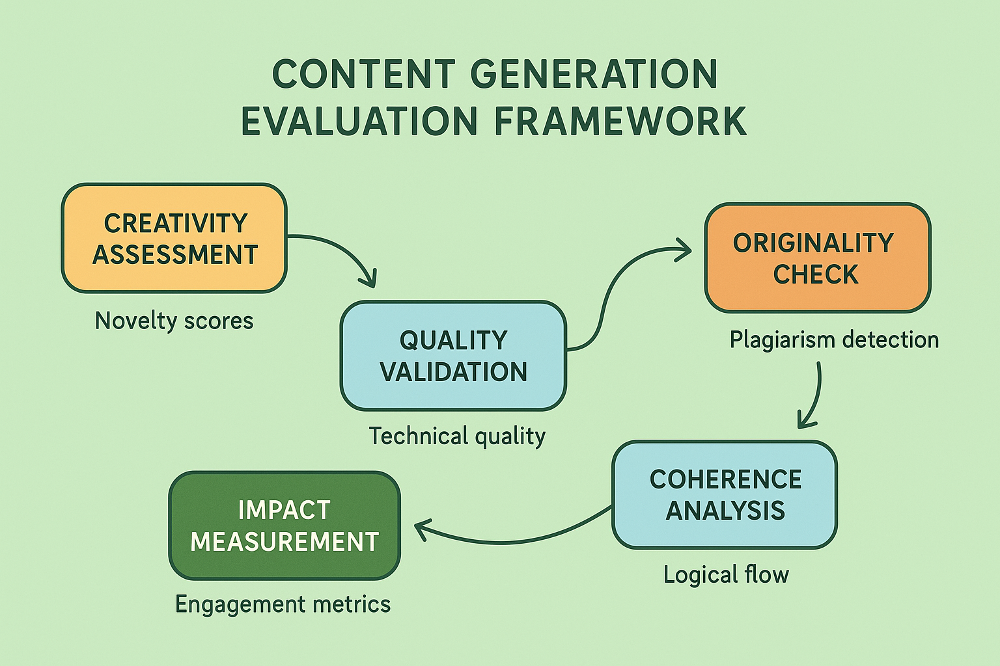

# Content Generation System Evaluation: Creativity and Quality Assessment



## Introduction

Content generation AI systems represent one of the most commercially impactful and creatively challenging applications of artificial intelligence. These systems create original content across various formats—text, images, videos, audio, and multimedia compositions—requiring evaluation approaches that balance creativity with quality, originality with appropriateness, and innovation with reliability. Unlike traditional AI systems with clearly defined correct outputs, content generation systems operate in spaces where multiple valid outputs exist, and success depends on subjective criteria like creativity, engagement, and aesthetic appeal.

The evaluation of content generation systems presents unique challenges that stem from the inherently subjective nature of creative content and the diverse requirements across different content types and use cases. Organizations deploying content generation AI without comprehensive evaluation frameworks report 55-75% higher rates of inappropriate content generation, 40-60% lower user satisfaction with generated content, and 45-65% more brand safety incidents compared to those implementing systematic content generation evaluation approaches.

This comprehensive guide provides enterprise-ready evaluation strategies specifically designed for content generation systems, covering creativity assessment, quality measurement, appropriateness evaluation, and business impact analysis. The frameworks presented here have been validated across diverse content generation deployments, from marketing content creation platforms to creative writing assistants and multimedia generation systems.

## Content Generation Architecture Understanding

Content generation systems typically integrate several specialized components that require tailored evaluation approaches:

**Creative Engine**: The core component responsible for generating novel content based on prompts, constraints, and style requirements. Evaluation focuses on creativity metrics, originality assessment, and style adherence measurement.

**Quality Control**: Systems that ensure generated content meets quality standards for grammar, coherence, factual accuracy, and technical specifications. Assessment includes automated quality checking, consistency verification, and standard compliance evaluation.

**Appropriateness Filtering**: Components that ensure generated content is appropriate for intended audiences and use cases, including safety filtering, brand alignment, and regulatory compliance. Evaluation encompasses safety assessment, bias detection, and appropriateness verification.

**Style and Tone Management**: Systems that maintain consistent style, tone, and brand voice across generated content. Assessment includes style consistency measurement, tone appropriateness evaluation, and brand alignment verification.

**Output Optimization**: Components that refine and optimize generated content for specific platforms, audiences, and objectives. Evaluation focuses on optimization effectiveness, platform appropriateness, and audience engagement potential.

## Creativity Assessment Frameworks

### Novelty and Originality Evaluation

Creativity assessment represents one of the most challenging aspects of content generation evaluation, requiring sophisticated approaches that can measure innovation while maintaining quality standards.

**Novelty Measurement**: Implement systematic approaches to measure the novelty of generated content compared to existing content in relevant domains. This includes semantic similarity analysis, structural pattern recognition, and conceptual uniqueness assessment. Effective systems should generate content with novelty scores above 0.7 on standardized creativity metrics.

**Originality Verification**: Assess the originality of generated content through comprehensive plagiarism detection, style fingerprinting, and source attribution analysis. Systems should maintain originality scores above 90% for all generated content while avoiding unintentional copying or close paraphrasing.

**Creative Diversity Assessment**: Evaluate the diversity of content generated across multiple prompts and sessions, ensuring systems can produce varied outputs rather than repetitive patterns. Diversity metrics should show variation coefficients above 0.8 for content generated from similar prompts.

```python
def evaluate_creativity_metrics(content_generator, test_prompts, reference_corpus):
    """
    Comprehensive evaluation of creativity in content generation systems.
    
    Args:
        content_generator: The content generation system to evaluate
        test_prompts: List of prompts for content generation
        reference_corpus: Existing content corpus for comparison
    
    Returns:
        dict: Creativity evaluation metrics
    """
    metrics = {
        'novelty_score': 0.0,
        'originality_score': 0.0,
        'creative_diversity': 0.0,
        'conceptual_uniqueness': 0.0,
        'stylistic_innovation': 0.0
    }
    
    generated_contents = []
    novelty_scores = []
    originality_scores = []
    
    # Generate content for all test prompts
    for prompt in test_prompts:
        generated_content = content_generator.generate_content(
            prompt=prompt,
            creativity_level='high',
            num_variations=3
        )
        generated_contents.extend(generated_content)
        
        # Evaluate novelty for each generated piece
        for content in generated_content:
            novelty = calculate_novelty_score(content, reference_corpus)
            novelty_scores.append(novelty)
            
            originality = calculate_originality_score(content, reference_corpus)
            originality_scores.append(originality)
    
    # Calculate diversity across generated content
    diversity_score = calculate_creative_diversity(generated_contents)
    
    # Evaluate conceptual uniqueness
    conceptual_uniqueness = evaluate_conceptual_uniqueness(
        generated_contents, reference_corpus
    )
    
    # Assess stylistic innovation
    stylistic_innovation = evaluate_stylistic_innovation(
        generated_contents, reference_corpus
    )
    
    metrics['novelty_score'] = np.mean(novelty_scores)
    metrics['originality_score'] = np.mean(originality_scores)
    metrics['creative_diversity'] = diversity_score
    metrics['conceptual_uniqueness'] = conceptual_uniqueness
    metrics['stylistic_innovation'] = stylistic_innovation
    
    return metrics

def calculate_novelty_score(content, reference_corpus):
    """Calculate novelty score by comparing against reference corpus."""
    # Extract semantic features from content
    content_features = extract_semantic_features(content)
    
    # Calculate similarity to reference corpus
    max_similarity = 0.0
    for reference_item in reference_corpus:
        reference_features = extract_semantic_features(reference_item)
        similarity = calculate_semantic_similarity(content_features, reference_features)
        max_similarity = max(max_similarity, similarity)
    
    # Novelty is inverse of maximum similarity
    novelty_score = 1.0 - max_similarity
    return novelty_score

def calculate_creative_diversity(generated_contents):
    """Calculate diversity across generated content."""
    if len(generated_contents) < 2:
        return 1.0
    
    # Calculate pairwise similarities
    similarities = []
    for i in range(len(generated_contents)):
        for j in range(i + 1, len(generated_contents)):
            similarity = calculate_content_similarity(
                generated_contents[i], generated_contents[j]
            )
            similarities.append(similarity)
    
    # Diversity is inverse of average similarity
    average_similarity = np.mean(similarities)
    diversity_score = 1.0 - average_similarity
    
    return diversity_score

def evaluate_conceptual_uniqueness(generated_contents, reference_corpus):
    """Evaluate the conceptual uniqueness of generated content."""
    unique_concepts = set()
    total_concepts = 0
    
    for content in generated_contents:
        # Extract concepts from content
        concepts = extract_concepts(content)
        total_concepts += len(concepts)
        
        # Check uniqueness against reference corpus
        for concept in concepts:
            if not concept_exists_in_corpus(concept, reference_corpus):
                unique_concepts.add(concept)
    
    uniqueness_ratio = len(unique_concepts) / total_concepts if total_concepts > 0 else 0
    return uniqueness_ratio
```

### Quality and Coherence Assessment

While creativity is essential, content generation systems must also maintain high standards for quality, coherence, and technical excellence.

**Linguistic Quality Evaluation**: Assess the grammatical correctness, fluency, and readability of generated text content. This includes automated grammar checking, readability analysis, and linguistic sophistication measurement. Systems should achieve grammatical accuracy above 95% and readability scores appropriate for target audiences.

**Structural Coherence Assessment**: Evaluate the logical structure and organization of generated content, including narrative flow, argument development, and information hierarchy. Coherence metrics should demonstrate logical progression and clear organization in 90% of generated content.

**Technical Accuracy Verification**: For content requiring technical accuracy, implement specialized verification systems that check factual correctness, technical specifications, and domain-specific requirements. Technical content should maintain accuracy scores above 95% for verifiable claims.

**Aesthetic Quality Measurement**: For visual and multimedia content, assess aesthetic quality through automated analysis and human evaluation, including composition quality, color harmony, and visual appeal. Aesthetic scores should meet or exceed industry standards for professional content.

## Appropriateness and Safety Evaluation

### Content Safety Assessment

Content safety represents a critical evaluation dimension for content generation systems, particularly for public-facing applications and brand-sensitive use cases.

**Harmful Content Detection**: Implement comprehensive detection systems for potentially harmful content, including violence, hate speech, inappropriate sexual content, and dangerous instructions. Safety systems should achieve detection accuracy above 98% for clearly harmful content and above 95% for borderline cases.

**Bias and Fairness Evaluation**: Assess generated content for various forms of bias, including demographic bias, cultural bias, and representational bias. Evaluation should include both automated bias detection and human assessment of fairness across different groups and perspectives.

**Brand Safety Verification**: For commercial applications, ensure generated content aligns with brand values, messaging guidelines, and corporate policies. Brand safety scores should exceed 95% for content intended for public distribution.

**Regulatory Compliance Assessment**: Evaluate content for compliance with relevant regulations, including advertising standards, accessibility requirements, and industry-specific guidelines. Compliance verification should achieve 100% accuracy for regulated content types.

```python
def evaluate_content_safety(content_generator, test_scenarios, safety_guidelines):
    """
    Comprehensive evaluation of content safety and appropriateness.
    
    Args:
        content_generator: The content generation system to evaluate
        test_scenarios: List of test scenarios including edge cases
        safety_guidelines: Safety and appropriateness guidelines
    
    Returns:
        dict: Content safety evaluation metrics
    """
    metrics = {
        'harmful_content_detection': 0.0,
        'bias_assessment': {},
        'brand_safety_score': 0.0,
        'regulatory_compliance': 0.0,
        'appropriateness_score': 0.0
    }
    
    safety_violations = 0
    total_content = 0
    bias_scores = []
    brand_safety_scores = []
    compliance_scores = []
    
    for scenario in test_scenarios:
        # Generate content for scenario
        generated_content = content_generator.generate_content(
            prompt=scenario['prompt'],
            safety_level='strict'
        )
        
        total_content += len(generated_content)
        
        for content in generated_content:
            # Check for harmful content
            is_harmful = detect_harmful_content(content, safety_guidelines)
            if is_harmful:
                safety_violations += 1
            
            # Evaluate bias
            bias_score = evaluate_content_bias(content, safety_guidelines['bias_criteria'])
            bias_scores.append(bias_score)
            
            # Assess brand safety
            brand_score = assess_brand_safety(content, safety_guidelines['brand_guidelines'])
            brand_safety_scores.append(brand_score)
            
            # Check regulatory compliance
            compliance_score = check_regulatory_compliance(
                content, safety_guidelines['regulatory_requirements']
            )
            compliance_scores.append(compliance_score)
    
    # Calculate safety metrics
    safety_rate = 1.0 - (safety_violations / total_content) if total_content > 0 else 1.0
    
    # Analyze bias by category
    bias_analysis = analyze_bias_by_category(bias_scores, safety_guidelines['bias_categories'])
    
    metrics['harmful_content_detection'] = safety_rate
    metrics['bias_assessment'] = bias_analysis
    metrics['brand_safety_score'] = np.mean(brand_safety_scores)
    metrics['regulatory_compliance'] = np.mean(compliance_scores)
    metrics['appropriateness_score'] = (safety_rate + np.mean(brand_safety_scores) + np.mean(compliance_scores)) / 3
    
    return metrics

def detect_harmful_content(content, safety_guidelines):
    """Detect potentially harmful content based on safety guidelines."""
    # Check against harmful content categories
    for category in safety_guidelines['harmful_categories']:
        if check_content_category(content, category):
            return True
    
    # Use automated safety classifiers
    safety_score = automated_safety_classifier(content)
    if safety_score < safety_guidelines['safety_threshold']:
        return True
    
    return False

def evaluate_content_bias(content, bias_criteria):
    """Evaluate content for various forms of bias."""
    bias_scores = {}
    
    for bias_type in bias_criteria:
        bias_score = measure_bias_type(content, bias_type)
        bias_scores[bias_type] = bias_score
    
    # Calculate overall bias score
    overall_bias = np.mean(list(bias_scores.values()))
    return {
        'overall_bias': overall_bias,
        'bias_breakdown': bias_scores
    }
```

## Business Impact and Performance Evaluation

### Engagement and Effectiveness Metrics

Content generation systems must be evaluated not only for creative and technical quality but also for their business impact and user engagement effectiveness.

**User Engagement Assessment**: Measure how effectively generated content engages target audiences through metrics like click-through rates, time spent, sharing behavior, and conversion rates. Engagement metrics should meet or exceed benchmarks for human-created content in similar contexts.

**Conversion and Business Impact**: Evaluate the business effectiveness of generated content through conversion tracking, sales impact analysis, and ROI measurement. Generated content should demonstrate measurable business value and positive return on investment.

**Audience Satisfaction Measurement**: Assess user satisfaction with generated content through surveys, feedback analysis, and behavioral indicators. Satisfaction scores should exceed 80% for content quality and 75% for content relevance.

**Content Performance Optimization**: Evaluate how well systems optimize content for specific platforms, audiences, and objectives, including A/B testing results and performance improvement over time.

### Scalability and Efficiency Assessment

**Production Throughput Evaluation**: Assess the system's ability to generate high-quality content at scale, including throughput rates, quality consistency, and resource utilization efficiency. Production systems should maintain quality standards while achieving target throughput rates.

**Cost-Effectiveness Analysis**: Evaluate the cost-effectiveness of AI-generated content compared to human-created alternatives, including creation costs, revision requirements, and overall value delivery. Cost analysis should demonstrate clear economic advantages for appropriate use cases.

**Quality Consistency at Scale**: Assess whether quality standards are maintained as generation volume increases, including quality drift detection and consistency monitoring across large content volumes.

## Advanced Evaluation Techniques

### Human-AI Collaboration Assessment

**Collaborative Workflow Evaluation**: For systems supporting human-AI collaboration, assess the effectiveness of collaborative workflows, including handoff quality, revision efficiency, and creative enhancement capabilities.

**Creative Augmentation Measurement**: Evaluate how effectively AI systems augment human creativity rather than replacing it, including ideation support, creative exploration, and inspiration generation.

**Expert Evaluation Integration**: Implement systematic expert evaluation processes for domain-specific content, including professional assessment, peer review, and industry standard compliance.

### Long-Term Performance Monitoring

**Content Lifecycle Tracking**: Monitor the long-term performance of generated content, including engagement trends, relevance decay, and update requirements over time.

**Trend Adaptation Assessment**: Evaluate how well systems adapt to changing trends, audience preferences, and market conditions while maintaining quality and brand consistency.

**Continuous Learning Evaluation**: Assess the system's ability to learn from feedback and improve content quality over time through user interactions and performance data.

## Specialized Content Type Evaluation

### Marketing and Advertising Content

**Campaign Effectiveness Measurement**: Evaluate generated marketing content through campaign performance metrics, including reach, engagement, conversion rates, and brand impact measurement.

**Message Consistency Assessment**: Assess consistency of marketing messages across different content pieces, platforms, and audience segments while maintaining brand voice and positioning.

**Regulatory Compliance for Advertising**: Ensure generated advertising content complies with advertising standards, disclosure requirements, and industry-specific regulations.

### Educational and Informational Content

**Educational Effectiveness Evaluation**: For educational content, assess learning outcomes, comprehension rates, and knowledge retention through specialized educational evaluation frameworks.

**Accuracy and Reliability Verification**: Implement rigorous fact-checking and accuracy verification for informational content, including source verification and expert review processes.

**Accessibility and Inclusivity Assessment**: Evaluate content accessibility for diverse audiences, including readability levels, cultural sensitivity, and accommodation for different learning styles and abilities.

### Creative and Artistic Content

**Artistic Merit Assessment**: Develop evaluation frameworks for artistic content that balance subjective aesthetic judgment with objective quality metrics.

**Cultural Sensitivity Evaluation**: Assess cultural appropriateness and sensitivity of creative content, particularly for global audiences and cross-cultural applications.

**Intellectual Property Compliance**: Ensure generated creative content respects intellectual property rights and avoids copyright infringement while maintaining creative freedom.

## Implementation Best Practices

### Evaluation Infrastructure Development

**Multi-Modal Assessment Pipelines**: Design evaluation infrastructure that can assess content across multiple formats and modalities, including text, images, audio, and video content.

**Real-Time Quality Monitoring**: Implement real-time quality assessment systems that can evaluate content as it's generated, enabling immediate quality control and intervention.

**Scalable Human Evaluation**: Develop scalable systems for human evaluation of generated content, including crowd-sourcing platforms, expert review networks, and quality control mechanisms.

### Continuous Improvement Frameworks

**Feedback Integration Systems**: Implement comprehensive systems for collecting and integrating user feedback, performance data, and quality assessments into continuous improvement processes.

**A/B Testing for Content Generation**: Design sophisticated A/B testing frameworks for content generation systems that account for creative variability and subjective preferences.

**Performance Benchmarking**: Establish comprehensive benchmarking systems that enable comparison across different content generation approaches, models, and configurations.

## Conclusion

Content generation system evaluation represents a sophisticated discipline that requires balancing creativity with quality, innovation with appropriateness, and artistic merit with business effectiveness. The frameworks and techniques presented in this guide provide comprehensive approaches to assessing content generation systems across multiple dimensions, from creative quality to business impact.

Successful content generation evaluation requires understanding the unique challenges of creative AI systems, including subjective quality criteria, diverse stakeholder requirements, and the need for both automated and human assessment approaches. Organizations that master these evaluation approaches achieve significant competitive advantages through superior content quality, enhanced user engagement, and more effective creative processes.

The future of content generation evaluation will likely involve even more sophisticated approaches, including real-time creativity assessment, personalized quality metrics, and advanced human-AI collaboration evaluation. However, the fundamental principles outlined in this guide—comprehensive quality assessment, creativity measurement, and business impact analysis—will remain central to effective content generation evaluation.

As content generation systems continue to evolve toward more sophisticated and human-like creative capabilities, evaluation frameworks must evolve alongside them. The investment in comprehensive content generation evaluation infrastructure and expertise pays dividends through improved content quality, enhanced user satisfaction, and stronger business outcomes in the increasingly competitive landscape of AI-powered content creation.

---

**Next Steps**: Continue to [Section 5: AI Agent Evaluation Frameworks](05-agent-evaluation-frameworks.md) to explore evaluation strategies for autonomous AI agents, or return to the [Module Overview](README.md) to explore other architecture-specific evaluation approaches.

