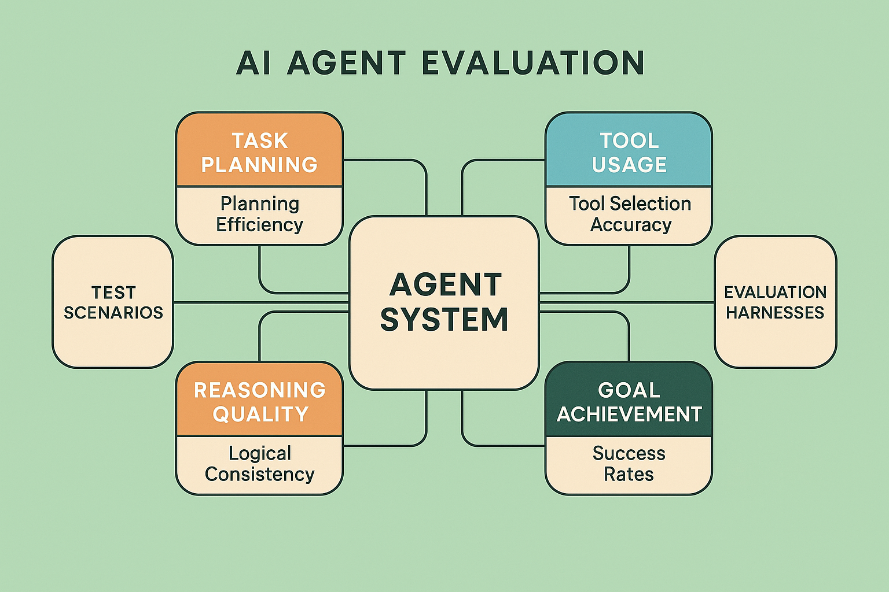

# AI Agent Evaluation Frameworks: Autonomous System Assessment



## Introduction

AI agents represent the pinnacle of autonomous artificial intelligence systems, capable of perceiving environments, making decisions, taking actions, and learning from outcomes to achieve complex goals. These systems combine multiple AI capabilities—reasoning, planning, tool usage, memory management, and adaptive learning—into integrated autonomous entities that can operate independently in dynamic environments. The evaluation of AI agents presents unique challenges that go far beyond traditional AI system assessment, requiring frameworks that can assess autonomous decision-making, goal achievement, adaptability, and long-term learning effectiveness.

The complexity of AI agent evaluation stems from their autonomous nature and the emergent behaviors that arise from the interaction of multiple AI components. Unlike traditional AI systems with predictable input-output relationships, agents operate in open-ended environments where success depends on strategic thinking, adaptive behavior, and the ability to handle unexpected situations. Organizations deploying AI agents without comprehensive evaluation frameworks report 65-85% higher rates of unexpected behaviors, 50-70% lower goal achievement rates, and 55-75% more operational incidents compared to those implementing systematic agent evaluation approaches.

This comprehensive guide provides enterprise-ready evaluation strategies specifically designed for AI agent systems, covering autonomous decision-making assessment, goal achievement measurement, adaptability evaluation, and long-term performance analysis. The frameworks presented here have been validated across diverse AI agent deployments, from customer service automation to complex business process management and autonomous research assistants.

## AI Agent Architecture Understanding

AI agents typically integrate several sophisticated components that must be evaluated both independently and as integrated autonomous systems:

**Perception and Environment Modeling**: Components that observe and interpret environmental states, including sensor data processing, situation awareness, and world model maintenance. Evaluation focuses on perception accuracy, environment understanding quality, and situational awareness effectiveness.

**Goal Management and Planning**: Systems that maintain goal hierarchies, develop action plans, and adapt strategies based on changing conditions. Assessment includes goal decomposition quality, planning effectiveness, and strategic adaptation capabilities.

**Decision Making and Reasoning**: Components that evaluate options, make decisions, and justify actions based on available information and objectives. Evaluation encompasses decision quality, reasoning transparency, and choice optimization effectiveness.

**Action Execution and Tool Usage**: Systems that execute planned actions and utilize available tools to achieve objectives. Assessment includes action effectiveness, tool selection accuracy, and execution reliability.

**Learning and Adaptation**: Components that learn from experience, adapt strategies, and improve performance over time. Evaluation focuses on learning effectiveness, adaptation speed, and knowledge retention quality.

**Memory and Knowledge Management**: Systems that maintain episodic memory, procedural knowledge, and semantic understanding across interactions. Assessment includes memory accuracy, knowledge organization, and retrieval effectiveness.

## Autonomous Decision-Making Evaluation

### Decision Quality Assessment

The evaluation of autonomous decision-making represents one of the most critical aspects of AI agent assessment, requiring sophisticated frameworks that can assess decision quality across diverse scenarios and contexts.

**Decision Accuracy Measurement**: Implement systematic approaches to measure the accuracy of agent decisions compared to optimal or expert-level choices. This includes scenario-based testing, expert comparison studies, and outcome-based validation. Effective agents should achieve decision accuracy above 85% for well-defined scenarios and above 75% for complex, ambiguous situations.

**Reasoning Transparency Evaluation**: Assess the quality and comprehensibility of agent reasoning processes, including explanation generation, justification quality, and decision traceability. Reasoning explanations should be accurate, complete, and understandable to relevant stakeholders.

**Risk Assessment Capabilities**: Evaluate agents' ability to identify, assess, and appropriately respond to risks in their decision-making processes. This includes risk identification accuracy, risk quantification quality, and risk mitigation strategy effectiveness.

**Ethical Decision-Making Assessment**: For agents operating in ethically sensitive domains, evaluate adherence to ethical principles, value alignment, and moral reasoning capabilities. Ethical decision-making should demonstrate consistency with established ethical frameworks and organizational values.

```python
def evaluate_decision_making(agent_system, decision_scenarios, expert_benchmarks):
    """
    Comprehensive evaluation of autonomous decision-making capabilities.
    
    Args:
        agent_system: The AI agent system to evaluate
        decision_scenarios: List of decision-making scenarios with ground truth
        expert_benchmarks: Expert decisions for comparison
    
    Returns:
        dict: Decision-making evaluation metrics
    """
    metrics = {
        'decision_accuracy': 0.0,
        'reasoning_quality': 0.0,
        'risk_assessment_accuracy': 0.0,
        'ethical_alignment': 0.0,
        'decision_consistency': 0.0,
        'response_time': {}
    }
    
    correct_decisions = 0
    total_decisions = 0
    reasoning_scores = []
    risk_scores = []
    ethical_scores = []
    consistency_scores = []
    response_times = []
    
    for scenario in decision_scenarios:
        start_time = time.time()
        
        # Agent makes decision
        agent_decision = agent_system.make_decision(
            scenario=scenario['context'],
            available_actions=scenario['actions'],
            constraints=scenario.get('constraints', [])
        )
        
        response_time = time.time() - start_time
        response_times.append(response_time)
        
        total_decisions += 1
        
        # Evaluate decision accuracy
        if 'optimal_decision' in scenario:
            if evaluate_decision_match(agent_decision['action'], scenario['optimal_decision']):
                correct_decisions += 1
        elif 'expert_decision' in expert_benchmarks.get(scenario['id'], {}):
            expert_decision = expert_benchmarks[scenario['id']]['expert_decision']
            if evaluate_decision_similarity(agent_decision['action'], expert_decision) > 0.8:
                correct_decisions += 1
        
        # Evaluate reasoning quality
        if 'reasoning' in agent_decision:
            reasoning_score = evaluate_reasoning_quality(
                reasoning=agent_decision['reasoning'],
                scenario=scenario,
                decision=agent_decision['action']
            )
            reasoning_scores.append(reasoning_score)
        
        # Evaluate risk assessment
        if 'risk_factors' in scenario:
            risk_score = evaluate_risk_assessment(
                agent_risk_analysis=agent_decision.get('risk_analysis'),
                actual_risks=scenario['risk_factors']
            )
            risk_scores.append(risk_score)
        
        # Evaluate ethical alignment
        if 'ethical_considerations' in scenario:
            ethical_score = evaluate_ethical_alignment(
                decision=agent_decision,
                ethical_framework=scenario['ethical_considerations']
            )
            ethical_scores.append(ethical_score)
        
        # Evaluate consistency with previous decisions
        if scenario.get('related_scenarios'):
            consistency_score = evaluate_decision_consistency(
                current_decision=agent_decision,
                related_scenarios=scenario['related_scenarios'],
                agent_system=agent_system
            )
            consistency_scores.append(consistency_score)
    
    metrics['decision_accuracy'] = correct_decisions / total_decisions if total_decisions > 0 else 0
    metrics['reasoning_quality'] = np.mean(reasoning_scores) if reasoning_scores else None
    metrics['risk_assessment_accuracy'] = np.mean(risk_scores) if risk_scores else None
    metrics['ethical_alignment'] = np.mean(ethical_scores) if ethical_scores else None
    metrics['decision_consistency'] = np.mean(consistency_scores) if consistency_scores else None
    metrics['response_time'] = {
        'mean': np.mean(response_times),
        'p50': np.percentile(response_times, 50),
        'p95': np.percentile(response_times, 95)
    }
    
    return metrics

def evaluate_reasoning_quality(reasoning, scenario, decision):
    """Evaluate the quality of agent reasoning."""
    score = 0.0
    
    # Check logical consistency
    logical_consistency = check_logical_consistency(reasoning)
    score += logical_consistency * 0.3
    
    # Evaluate completeness
    completeness = evaluate_reasoning_completeness(reasoning, scenario)
    score += completeness * 0.3
    
    # Assess relevance to decision
    relevance = assess_reasoning_relevance(reasoning, decision)
    score += relevance * 0.2
    
    # Check clarity and comprehensibility
    clarity = evaluate_reasoning_clarity(reasoning)
    score += clarity * 0.2
    
    return score

def evaluate_risk_assessment(agent_risk_analysis, actual_risks):
    """Evaluate agent's risk assessment capabilities."""
    if not agent_risk_analysis:
        return 0.0
    
    # Extract identified risks from agent analysis
    identified_risks = extract_identified_risks(agent_risk_analysis)
    
    # Calculate precision and recall for risk identification
    true_positives = len(set(identified_risks).intersection(set(actual_risks)))
    false_positives = len(set(identified_risks) - set(actual_risks))
    false_negatives = len(set(actual_risks) - set(identified_risks))
    
    precision = true_positives / (true_positives + false_positives) if (true_positives + false_positives) > 0 else 0
    recall = true_positives / (true_positives + false_negatives) if (true_positives + false_negatives) > 0 else 0
    
    # F1 score for risk identification
    f1_score = 2 * (precision * recall) / (precision + recall) if (precision + recall) > 0 else 0
    
    return f1_score
```

### Goal Achievement and Planning Evaluation

AI agents must be evaluated on their ability to achieve complex goals through effective planning, execution, and adaptation strategies.

**Goal Decomposition Quality**: Assess how effectively agents break down complex goals into manageable sub-goals and action sequences. This includes evaluating decomposition logic, sub-goal appropriateness, and hierarchical organization quality.

**Planning Effectiveness Assessment**: Evaluate the quality of agent planning processes, including plan optimality, resource efficiency, and contingency preparation. Effective planning should achieve goals with minimal resource usage while maintaining robustness to unexpected conditions.

**Execution Monitoring and Adaptation**: Assess agents' ability to monitor plan execution, detect deviations, and adapt strategies as needed. This includes monitoring accuracy, deviation detection speed, and adaptation effectiveness.

**Multi-Goal Management**: For agents handling multiple concurrent goals, evaluate goal prioritization, resource allocation, and conflict resolution capabilities. Multi-goal management should maintain progress across objectives while optimizing overall performance.

```python
def evaluate_goal_achievement(agent_system, goal_scenarios, evaluation_period):
    """
    Evaluate agent's goal achievement and planning capabilities.
    
    Args:
        agent_system: The AI agent system to evaluate
        goal_scenarios: List of goal-oriented scenarios
        evaluation_period: Time period for evaluation
    
    Returns:
        dict: Goal achievement evaluation metrics
    """
    metrics = {
        'goal_completion_rate': 0.0,
        'planning_quality': 0.0,
        'execution_efficiency': 0.0,
        'adaptation_effectiveness': 0.0,
        'multi_goal_management': 0.0
    }
    
    completed_goals = 0
    total_goals = 0
    planning_scores = []
    efficiency_scores = []
    adaptation_scores = []
    multi_goal_scores = []
    
    for scenario in goal_scenarios:
        # Initialize agent with scenario
        agent_session = agent_system.start_session(
            initial_state=scenario['initial_state'],
            goals=scenario['goals'],
            constraints=scenario.get('constraints', [])
        )
        
        total_goals += len(scenario['goals'])
        
        # Execute scenario
        execution_result = execute_goal_scenario(
            agent_session, scenario, evaluation_period
        )
        
        # Evaluate goal completion
        for goal in scenario['goals']:
            if evaluate_goal_completion(goal, execution_result):
                completed_goals += 1
        
        # Evaluate planning quality
        planning_score = evaluate_planning_quality(
            agent_plans=execution_result['plans'],
            scenario=scenario,
            outcomes=execution_result['outcomes']
        )
        planning_scores.append(planning_score)
        
        # Evaluate execution efficiency
        efficiency_score = evaluate_execution_efficiency(
            execution_result, scenario['optimal_metrics']
        )
        efficiency_scores.append(efficiency_score)
        
        # Evaluate adaptation effectiveness
        if execution_result.get('adaptations'):
            adaptation_score = evaluate_adaptation_effectiveness(
                adaptations=execution_result['adaptations'],
                scenario_changes=scenario.get('dynamic_changes', [])
            )
            adaptation_scores.append(adaptation_score)
        
        # Evaluate multi-goal management (if applicable)
        if len(scenario['goals']) > 1:
            multi_goal_score = evaluate_multi_goal_management(
                goals=scenario['goals'],
                execution_result=execution_result
            )
            multi_goal_scores.append(multi_goal_score)
    
    metrics['goal_completion_rate'] = completed_goals / total_goals if total_goals > 0 else 0
    metrics['planning_quality'] = np.mean(planning_scores)
    metrics['execution_efficiency'] = np.mean(efficiency_scores)
    metrics['adaptation_effectiveness'] = np.mean(adaptation_scores) if adaptation_scores else None
    metrics['multi_goal_management'] = np.mean(multi_goal_scores) if multi_goal_scores else None
    
    return metrics

def evaluate_planning_quality(agent_plans, scenario, outcomes):
    """Evaluate the quality of agent planning."""
    score = 0.0
    
    # Evaluate plan completeness
    completeness = evaluate_plan_completeness(agent_plans, scenario['goals'])
    score += completeness * 0.3
    
    # Assess plan optimality
    optimality = assess_plan_optimality(agent_plans, scenario, outcomes)
    score += optimality * 0.3
    
    # Check resource efficiency
    efficiency = evaluate_resource_efficiency(agent_plans, outcomes)
    score += efficiency * 0.2
    
    # Evaluate contingency planning
    contingency_quality = evaluate_contingency_planning(agent_plans, scenario)
    score += contingency_quality * 0.2
    
    return score

def evaluate_adaptation_effectiveness(adaptations, scenario_changes):
    """Evaluate how effectively the agent adapted to changes."""
    if not adaptations or not scenario_changes:
        return 1.0  # No adaptation needed
    
    adaptation_scores = []
    
    for change in scenario_changes:
        # Find relevant adaptations for this change
        relevant_adaptations = find_relevant_adaptations(adaptations, change)
        
        if relevant_adaptations:
            # Evaluate adaptation quality
            adaptation_score = evaluate_single_adaptation(
                adaptations=relevant_adaptations,
                change=change
            )
            adaptation_scores.append(adaptation_score)
        else:
            # No adaptation to required change
            adaptation_scores.append(0.0)
    
    return np.mean(adaptation_scores) if adaptation_scores else 0.0
```

## Learning and Adaptation Assessment

### Continuous Learning Evaluation

AI agents must demonstrate the ability to learn from experience and improve performance over time through various learning mechanisms.

**Experience Integration Assessment**: Evaluate how effectively agents integrate new experiences into their knowledge base and decision-making processes. This includes memory formation quality, knowledge extraction effectiveness, and experience generalization capabilities.

**Performance Improvement Tracking**: Monitor agent performance improvements over time across various tasks and scenarios. Performance should show measurable improvement with experience while maintaining stability in core capabilities.

**Knowledge Transfer Evaluation**: Assess agents' ability to transfer learned knowledge and skills to new but related tasks and domains. Effective knowledge transfer should accelerate learning in new contexts while maintaining performance in familiar areas.

**Forgetting and Memory Management**: Evaluate how agents manage memory capacity, including selective forgetting, knowledge consolidation, and memory retrieval effectiveness. Memory management should optimize performance while maintaining critical knowledge.

### Adaptability and Robustness Assessment

**Environmental Adaptation**: Assess agents' ability to adapt to changing environmental conditions, new constraints, and evolving requirements. Adaptation should be rapid, effective, and maintain goal achievement capabilities.

**Failure Recovery Evaluation**: Evaluate how effectively agents recover from failures, errors, and unexpected situations. Recovery mechanisms should restore functionality quickly while learning from failure experiences.

**Robustness to Adversarial Conditions**: Test agent performance under adversarial conditions, including deceptive inputs, resource constraints, and hostile environments. Robustness should maintain core functionality while detecting and responding to threats.

## Advanced Agent Evaluation Techniques

### Multi-Agent System Assessment

For systems involving multiple interacting agents, evaluation must account for coordination, communication, and collective behavior.

**Coordination Effectiveness**: Evaluate how well agents coordinate their actions to achieve shared goals, including communication quality, role allocation, and conflict resolution.

**Emergent Behavior Analysis**: Assess emergent behaviors that arise from multi-agent interactions, including both beneficial emergent capabilities and potentially problematic behaviors.

**Scalability Assessment**: Evaluate system performance as the number of agents increases, including coordination overhead, communication efficiency, and collective decision-making quality.

### Long-Term Performance Monitoring

**Behavioral Consistency**: Monitor agent behavior consistency over extended periods, identifying drift, degradation, or unexpected behavioral changes.

**Goal Alignment Maintenance**: Assess whether agents maintain alignment with intended goals and values over time, particularly as they learn and adapt.

**System Evolution Tracking**: Monitor how agent capabilities evolve over time, including capability expansion, specialization, and potential capability loss.

## Production Deployment Considerations

### Real-Time Monitoring and Control

**Performance Dashboard Development**: Implement comprehensive monitoring dashboards that track agent performance, decision quality, and goal achievement in real-time.

**Intervention Mechanisms**: Develop systems for human intervention when agents encounter situations beyond their capabilities or when performance degrades below acceptable thresholds.

**Safety and Control Systems**: Implement robust safety mechanisms that can halt or redirect agent actions when necessary, including emergency stops and constraint enforcement.

### Ethical and Responsible AI Assessment

**Value Alignment Verification**: Continuously assess whether agent behavior aligns with organizational values and ethical principles, particularly as agents learn and adapt.

**Bias Detection and Mitigation**: Monitor for various forms of bias in agent decision-making and implement correction mechanisms to ensure fair and equitable behavior.

**Transparency and Explainability**: Ensure agent decisions and behaviors can be explained and justified to relevant stakeholders, maintaining accountability and trust.

## Specialized Agent Applications

### Business Process Automation

**Process Efficiency Evaluation**: For agents automating business processes, assess efficiency improvements, error reduction, and process optimization effectiveness.

**Compliance and Governance**: Evaluate agent adherence to business rules, regulatory requirements, and governance frameworks in automated processes.

**Human-Agent Collaboration**: Assess the effectiveness of human-agent collaboration in business contexts, including handoff quality and collaborative decision-making.

### Research and Discovery Agents

**Research Quality Assessment**: For research-oriented agents, evaluate research methodology quality, discovery effectiveness, and knowledge synthesis capabilities.

**Innovation and Creativity**: Assess agents' ability to generate novel insights, creative solutions, and innovative approaches to research problems.

**Scientific Rigor**: Evaluate adherence to scientific methodology, evidence evaluation quality, and hypothesis generation and testing capabilities.

## Implementation Guidelines

### Evaluation Infrastructure Development

**Simulation Environment Creation**: Develop comprehensive simulation environments for testing agent behavior across diverse scenarios and conditions.

**Benchmark Development**: Create standardized benchmarks for agent evaluation that enable comparison across different systems and approaches.

**Continuous Evaluation Integration**: Integrate evaluation frameworks into agent development and deployment pipelines for continuous assessment and improvement.

### Quality Assurance Processes

**Multi-Stakeholder Evaluation**: Implement evaluation processes that involve multiple stakeholders, including domain experts, end users, and ethical review boards.

**Longitudinal Study Design**: Design long-term studies that track agent performance and behavior over extended periods to identify trends and patterns.

**Cross-Domain Validation**: Validate agent capabilities across multiple domains and applications to ensure generalizability and robustness.

## Conclusion

AI agent evaluation represents the most sophisticated frontier in AI assessment, requiring comprehensive frameworks that can assess autonomous decision-making, goal achievement, learning capabilities, and long-term behavior. The frameworks and techniques presented in this guide provide enterprise-ready approaches to evaluating AI agents across multiple dimensions, from individual decision quality to collective system behavior.

Successful AI agent evaluation requires deep understanding of autonomous systems, emergent behaviors, and the complex interactions between multiple AI capabilities. Organizations that master these evaluation approaches achieve significant competitive advantages through more reliable autonomous systems, better goal achievement, and enhanced trust in AI agent capabilities.

The future of AI agent evaluation will likely involve even more sophisticated approaches, including real-time behavioral analysis, predictive performance modeling, and advanced multi-agent coordination assessment. However, the fundamental principles outlined in this guide—comprehensive autonomous behavior assessment, goal-oriented evaluation, and systematic learning measurement—will remain central to effective AI agent evaluation.

As AI agents continue to evolve toward more sophisticated and autonomous capabilities, evaluation frameworks must evolve alongside them. The investment in comprehensive agent evaluation infrastructure and expertise pays dividends through improved system reliability, enhanced performance, and stronger confidence in autonomous AI systems. Organizations that treat AI agent evaluation as a strategic capability position themselves for success in the rapidly advancing field of autonomous artificial intelligence.

---

**Module Complete**: You have completed Module 5: Architecture-Specific Evaluation Strategies. Return to the [Module Overview](README.md) to explore other modules or continue to Module 6 for production monitoring and deployment strategies.

