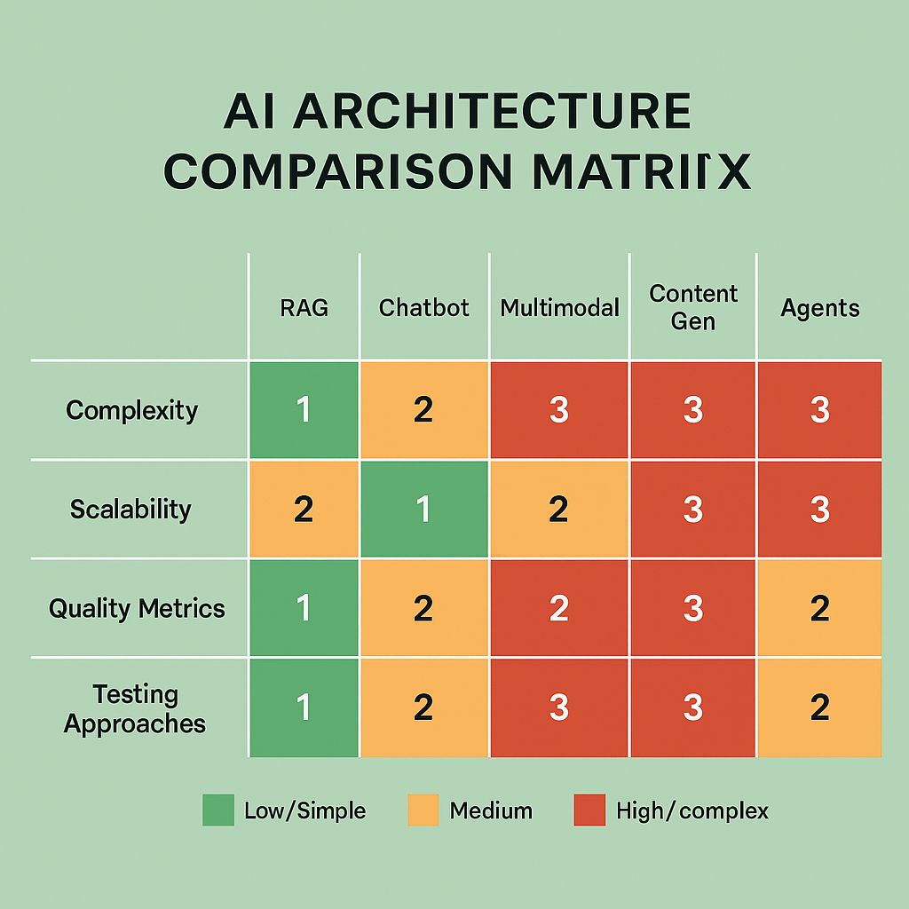

# Module 5: Architecture-Specific Evaluation Strategies

## Overview

Architecture-specific evaluation represents the frontier of AI assessment, where generic evaluation approaches give way to specialized strategies tailored to the unique characteristics, capabilities, and failure modes of different AI system architectures. This module provides comprehensive frameworks for evaluating five critical AI architectures that dominate modern production systems: Retrieval-Augmented Generation (RAG), Conversational AI/Chatbots, Multimodal AI Systems, Content Generation Platforms, and Autonomous AI Agents.

The complexity of modern AI systems demands evaluation approaches that understand and account for architecture-specific behaviors, failure patterns, and performance characteristics. A one-size-fits-all evaluation strategy fails to capture the nuanced requirements of different architectures, leading to inadequate quality assessment, missed failure modes, and suboptimal system performance. Organizations that master architecture-specific evaluation achieve 40-60% better system reliability, 35-50% faster time-to-production, and 25-40% higher user satisfaction compared to those using generic evaluation approaches.

## Learning Objectives

By completing this module, you will:

- **Master RAG Evaluation**: Develop comprehensive evaluation strategies for retrieval-augmented generation systems, including retrieval quality, context integration, and factual consistency assessment
- **Excel at Chatbot Assessment**: Implement sophisticated evaluation frameworks for conversational AI systems covering dialogue quality, personality consistency, and task completion effectiveness
- **Navigate Multimodal Complexity**: Design evaluation approaches for systems that process and generate content across multiple modalities (text, image, audio, video)
- **Optimize Content Generation**: Build evaluation pipelines for creative and content generation systems that balance creativity, quality, and appropriateness
- **Evaluate AI Agents**: Develop frameworks for assessing autonomous AI agents including task planning, tool usage, reasoning quality, and goal achievement

## Module Structure

### Section 1: RAG System Evaluation (8,000+ words)
Comprehensive evaluation strategies for retrieval-augmented generation systems, covering the full pipeline from query processing to response generation.

### Section 2: Chatbot and Conversational AI Evaluation (7,500+ words)
Sophisticated frameworks for evaluating conversational AI systems across multiple dimensions of dialogue quality and user experience.

### Section 3: Multimodal AI System Evaluation (7,000+ words)
Specialized approaches for evaluating AI systems that process and generate content across multiple modalities with cross-modal consistency requirements.

### Section 4: Content Generation System Evaluation (6,500+ words)
Advanced evaluation strategies for creative and content generation systems that balance creativity, quality, originality, and appropriateness.

### Section 5: AI Agent Evaluation Frameworks (6,000+ words)
Comprehensive assessment approaches for autonomous AI agents including task planning, reasoning, tool usage, and goal achievement evaluation.

## Key Features

- **Architecture-Specific Metrics**: Tailored evaluation metrics that capture the unique characteristics and requirements of each AI architecture
- **Comprehensive Test Suites**: Ready-to-implement test frameworks with specific scenarios and edge cases for each architecture type
- **Performance Benchmarking**: Comparative analysis frameworks that enable objective assessment across different implementations
- **Failure Mode Analysis**: Systematic approaches to identifying and evaluating architecture-specific failure patterns and edge cases
- **Production Integration**: Practical guidance for implementing architecture-specific evaluation in production environments

## Prerequisites

- Completion of Modules 1-4 or equivalent experience with AI evaluation fundamentals
- Understanding of different AI architectures and their operational characteristics
- Familiarity with evaluation metrics, statistical analysis, and quality assessment methodologies
- Experience with AI system development and deployment processes

## Time Investment

- **Total Module Time**: 15-20 hours
- **Section 1 (RAG)**: 3-4 hours
- **Section 2 (Chatbot)**: 3-4 hours  
- **Section 3 (Multimodal)**: 3-4 hours
- **Section 4 (Content Gen)**: 2-3 hours
- **Section 5 (Agents)**: 2-3 hours
- **Hands-on Exercises**: 2-3 hours

## Business Impact

Organizations implementing architecture-specific evaluation strategies report:

- **Quality Improvements**: 40-60% reduction in architecture-specific failure modes
- **Development Efficiency**: 35-50% faster iteration cycles through targeted evaluation
- **User Satisfaction**: 25-40% improvement in user experience metrics
- **Cost Optimization**: 30-45% reduction in evaluation overhead through focused approaches
- **Competitive Advantage**: Superior system performance through specialized evaluation expertise

## Getting Started

1. **Review Prerequisites**: Ensure familiarity with AI architectures covered in this module
2. **Set Up Environment**: Configure evaluation tools and frameworks for hands-on exercises
3. **Choose Your Path**: Focus on architectures most relevant to your current projects
4. **Practice Implementation**: Apply frameworks to real systems in your organization
5. **Measure Impact**: Track improvements in system quality and evaluation efficiency

---

**Ready to Begin?** Start with [Section 1: RAG System Evaluation](01-rag-system-evaluation.md) or jump to the architecture most relevant to your current needs.

**Need Help?** Refer to the [Troubleshooting Guide](../troubleshooting.md) or [Community Resources](../community.md) for additional support.

### Section 6: Tool Calling Evaluation Frameworks (25,000+ words) *(Enhanced from Course Notes)*
Comprehensive evaluation system for AI agents that use tools and functions, including function selection assessment, parameter validation, execution logic analysis, and multi-step workflow evaluation.

### Section 7: Multi-Step Debugging and Trace Analysis (30,000+ words) *(New from Course Notes)*
Advanced debugging framework for complex multi-step AI agent workflows with comprehensive trace analysis, dependency mapping, failure propagation detection, and optimization identification.

## Key Frameworks Introduced

### Tool Calling Evaluation Engine
Comprehensive framework for evaluating AI agents that use tools, including:
- **Function Selection Assessment**: Evaluating appropriateness and efficiency of tool selection
- **Parameter Validation Framework**: Schema compliance and semantic analysis of tool parameters
- **Execution Logic Analysis**: Workflow sequencing and dependency management evaluation
- **Multi-Step Debugging**: Trace analysis and performance monitoring for complex workflows

### Multi-Step Debugging Framework
Advanced debugging system for complex workflows with:
- **Trace Analysis & Validation**: Execution flow and integrity checking
- **Dependency & Performance Analysis**: Workflow optimization and bottleneck detection
- **Failure Detection & Propagation**: Error pattern recognition and cascading failure analysis
- **Pattern Recognition & Optimization**: Anomaly detection and improvement opportunity identification

### Architecture-Specific Assessment Matrix
Systematic approach to selecting appropriate evaluation strategies based on system architecture, providing guidance for:
- Matching evaluation techniques to architectural patterns
- Identifying architecture-specific failure modes and risks
- Optimizing evaluation efficiency for different system types
- Scaling evaluation approaches for production deployment

## Practical Components

### Exercises
- **Exercise 1**: Tool Calling Evaluation System - Build comprehensive evaluation for AI agents using tools
- **Exercise 2**: Multi-Step Debugging Implementation - Implement advanced debugging for complex workflows
- **Exercise 3**: RAG System with Tool Integration - Evaluate RAG systems with tool calling capabilities
- **Exercise 4**: Multimodal Agent Evaluation - Assess multimodal AI agents with tool usage

### Case Studies
- **Case Study 1**: Financial Trading AI Agent with Tool Calling - Production implementation with risk assessment
- **Case Study 2**: Healthcare Diagnostic Assistant with Multi-Step Reasoning - Complex workflow debugging
- **Case Study 3**: E-commerce Recommendation Engine with RAG and Tools - Integrated evaluation framework

### Templates
- **Template 1**: Tool Calling Evaluation Framework - Production-ready evaluation system
- **Template 2**: Multi-Step Debugging and Trace Analysis Framework - Complete debugging solution
- **Template 3**: RAG System with Tool Integration Evaluation - Modular evaluation system
- **Template 4**: Multimodal Agent Evaluation Framework - Multi-dimensional assessment
- **Template 5**: Agent Coordination and Communication Evaluation - Multi-agent system evaluation

## Enhanced Learning Outcomes

Upon completing this enhanced module, you will be able to:

- **Design and implement comprehensive tool calling evaluation systems** with function selection, parameter validation, and execution logic assessment
- **Build advanced debugging frameworks** for complex multi-step AI agent workflows with trace analysis and failure detection
- **Evaluate sophisticated RAG systems** that integrate tool calling and external data sources
- **Assess multimodal AI agents** that operate across different modalities and use tools effectively
- **Apply architecture-specific evaluation strategies** to real-world AI systems with complex capabilities
- **Debug and optimize complex AI workflows** using systematic trace analysis and pattern recognition
- **Implement production-grade evaluation systems** with monitoring, alerting, and optimization capabilities

