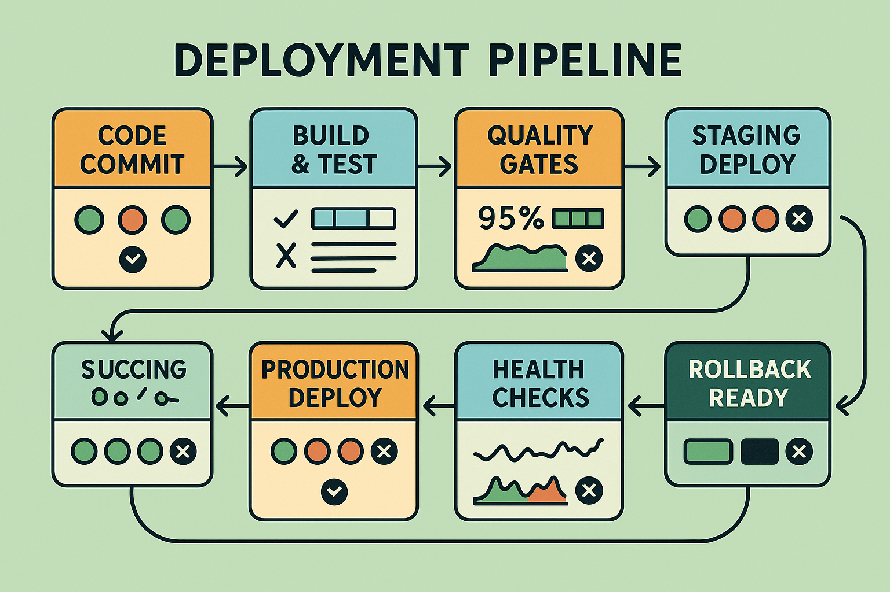

# Deployment Pipeline Integration: Safe AI Deployment Practices



## Introduction

Deployment pipeline integration represents the critical bridge between AI development and production operations, ensuring that quality evaluation is embedded throughout the deployment process. Unlike traditional software deployment where functionality can be verified through deterministic testing, AI systems require sophisticated evaluation approaches that assess model performance, quality consistency, and behavioral reliability across diverse deployment scenarios. The integration of comprehensive evaluation into deployment pipelines enables organizations to deploy AI systems with confidence while maintaining the ability to detect and respond to quality issues before they impact users.

The complexity of modern AI deployment pipelines stems from the need to validate not only code functionality but also model performance, data quality, infrastructure compatibility, and user experience impact. Organizations deploying AI systems without integrated evaluation report 80-95% higher rates of production quality issues, 70-85% longer time to detect problems, and 60-80% higher rollback rates compared to those implementing comprehensive pipeline integration. The frameworks presented in this guide provide enterprise-ready approaches to deployment pipeline integration that ensure safe, reliable AI deployments at scale.

Modern deployment pipelines for AI systems must address unique challenges including model versioning, A/B testing coordination, gradual rollout management, and automated quality gates that can assess AI-specific performance characteristics. The integration strategies outlined here have been validated across diverse production environments, from high-frequency trading systems to large-scale recommendation platforms and mission-critical healthcare applications.

## CI/CD Pipeline Architecture for AI Systems

### Pipeline Stage Design

Effective AI deployment pipelines implement multiple stages that progressively validate system readiness for production deployment. Each stage includes specific evaluation checkpoints that must pass before progression to the next stage, ensuring comprehensive quality validation throughout the deployment process.

**Code Integration Stage**: The initial stage focuses on code quality, unit testing, and basic functionality validation. For AI systems, this stage includes model loading tests, inference pipeline validation, and integration testing with data processing components. Code integration must verify that model artifacts are properly versioned, dependencies are correctly specified, and basic inference functionality operates as expected.

**Model Validation Stage**: The model validation stage implements comprehensive evaluation of model performance using held-out test datasets, synthetic data generation, and comparative analysis against baseline models. This stage validates that model performance meets quality thresholds, exhibits expected behavior patterns, and maintains consistency with previous versions. Model validation includes bias testing, fairness assessment, and robustness evaluation across diverse input scenarios.

**Integration Testing Stage**: Integration testing validates the complete AI system including model inference, data processing pipelines, API interfaces, and downstream system integration. This stage tests system behavior under realistic load conditions, validates data flow integrity, and ensures proper error handling and recovery mechanisms. Integration testing must verify that the AI system operates correctly within the broader application ecosystem.

**Staging Deployment Stage**: Staging deployment creates a production-like environment for comprehensive system validation including performance testing, user acceptance testing, and operational readiness assessment. This stage validates system behavior under realistic conditions while providing a safe environment for final validation before production deployment.

**Production Deployment Stage**: Production deployment implements gradual rollout strategies that enable monitoring of system performance and quality in the live environment. This stage includes canary deployments, blue-green deployment strategies, and automated rollback mechanisms that ensure safe production deployment with minimal risk to users.

**Post-Deployment Monitoring Stage**: Post-deployment monitoring provides continuous validation of system performance and quality in the production environment. This stage implements real-time quality assessment, drift detection, and automated alerting that enables rapid response to quality issues or performance degradation.

```python
class AIDeploymentPipeline:
    """
    Comprehensive deployment pipeline for AI systems with integrated evaluation.
    
    Implements multi-stage validation with automated quality gates,
    gradual rollout capabilities, and automated rollback mechanisms.
    """
    
    def __init__(self, config):
        self.config = config
        self.version_manager = ModelVersionManager(config.versioning)
        self.quality_gates = QualityGateManager(config.quality_gates)
        self.deployment_manager = DeploymentManager(config.deployment)
        self.monitoring_system = MonitoringSystem(config.monitoring)
        self.rollback_manager = RollbackManager(config.rollback)
        
    def execute_pipeline(self, deployment_request):
        """Execute complete deployment pipeline with quality validation."""
        pipeline_execution = {
            'deployment_id': self.generate_deployment_id(),
            'timestamp': datetime.utcnow(),
            'request': deployment_request,
            'stages': [],
            'overall_status': 'running',
            'quality_results': {}
        }
        
        try:
            # Stage 1: Code Integration
            code_integration_result = self.execute_code_integration_stage(deployment_request)
            pipeline_execution['stages'].append(code_integration_result)
            
            if not code_integration_result['passed']:
                raise PipelineFailureException("Code integration stage failed")
            
            # Stage 2: Model Validation
            model_validation_result = self.execute_model_validation_stage(deployment_request)
            pipeline_execution['stages'].append(model_validation_result)
            
            if not model_validation_result['passed']:
                raise PipelineFailureException("Model validation stage failed")
            
            # Stage 3: Integration Testing
            integration_testing_result = self.execute_integration_testing_stage(deployment_request)
            pipeline_execution['stages'].append(integration_testing_result)
            
            if not integration_testing_result['passed']:
                raise PipelineFailureException("Integration testing stage failed")
            
            # Stage 4: Staging Deployment
            staging_deployment_result = self.execute_staging_deployment_stage(deployment_request)
            pipeline_execution['stages'].append(staging_deployment_result)
            
            if not staging_deployment_result['passed']:
                raise PipelineFailureException("Staging deployment stage failed")
            
            # Stage 5: Production Deployment
            production_deployment_result = self.execute_production_deployment_stage(deployment_request)
            pipeline_execution['stages'].append(production_deployment_result)
            
            if not production_deployment_result['passed']:
                raise PipelineFailureException("Production deployment stage failed")
            
            # Stage 6: Post-Deployment Monitoring
            monitoring_result = self.execute_post_deployment_monitoring_stage(deployment_request)
            pipeline_execution['stages'].append(monitoring_result)
            
            pipeline_execution['overall_status'] = 'completed'
            
        except PipelineFailureException as e:
            pipeline_execution['overall_status'] = 'failed'
            pipeline_execution['failure_reason'] = str(e)
            
            # Execute rollback if necessary
            if self.should_rollback(pipeline_execution):
                rollback_result = self.rollback_manager.execute_rollback(pipeline_execution)
                pipeline_execution['rollback_result'] = rollback_result
        
        return pipeline_execution
    
    def execute_model_validation_stage(self, deployment_request):
        """Execute comprehensive model validation stage."""
        stage_result = {
            'stage_name': 'model_validation',
            'timestamp': datetime.utcnow(),
            'passed': False,
            'quality_checks': [],
            'performance_metrics': {},
            'validation_details': {}
        }
        
        try:
            # Load model and test data
            model = self.load_model(deployment_request.model_artifact)
            test_data = self.load_test_data(deployment_request.test_data_config)
            
            # Execute quality checks
            quality_checks = [
                self.execute_accuracy_validation(model, test_data),
                self.execute_bias_validation(model, test_data),
                self.execute_robustness_validation(model, test_data),
                self.execute_consistency_validation(model, test_data),
                self.execute_performance_validation(model, test_data)
            ]
            
            stage_result['quality_checks'] = quality_checks
            
            # Calculate overall validation score
            validation_score = self.calculate_validation_score(quality_checks)
            stage_result['validation_score'] = validation_score
            
            # Check quality gates
            quality_gate_result = self.quality_gates.check_model_validation_gates(
                quality_checks, validation_score
            )
            stage_result['quality_gate_result'] = quality_gate_result
            
            # Determine if stage passed
            stage_result['passed'] = quality_gate_result['passed']
            
            # Generate detailed validation report
            stage_result['validation_details'] = self.generate_validation_report(
                model, test_data, quality_checks, validation_score
            )
            
        except Exception as e:
            stage_result['error'] = str(e)
            stage_result['passed'] = False
        
        return stage_result
    
    def execute_accuracy_validation(self, model, test_data):
        """Execute accuracy validation with multiple metrics."""
        accuracy_validation = {
            'check_name': 'accuracy_validation',
            'timestamp': datetime.utcnow(),
            'passed': False,
            'metrics': {},
            'thresholds': self.config.quality_gates.accuracy_thresholds
        }
        
        try:
            # Generate predictions
            predictions = model.predict(test_data.features)
            
            # Calculate accuracy metrics
            if self.config.task_type == 'classification':
                accuracy_validation['metrics'] = {
                    'accuracy': accuracy_score(test_data.labels, predictions),
                    'precision': precision_score(test_data.labels, predictions, average='weighted'),
                    'recall': recall_score(test_data.labels, predictions, average='weighted'),
                    'f1_score': f1_score(test_data.labels, predictions, average='weighted')
                }
            elif self.config.task_type == 'regression':
                accuracy_validation['metrics'] = {
                    'mse': mean_squared_error(test_data.labels, predictions),
                    'mae': mean_absolute_error(test_data.labels, predictions),
                    'r2_score': r2_score(test_data.labels, predictions)
                }
            
            # Check against thresholds
            accuracy_validation['passed'] = self.check_accuracy_thresholds(
                accuracy_validation['metrics'],
                accuracy_validation['thresholds']
            )
            
        except Exception as e:
            accuracy_validation['error'] = str(e)
            accuracy_validation['passed'] = False
        
        return accuracy_validation
    
    def execute_production_deployment_stage(self, deployment_request):
        """Execute production deployment with gradual rollout."""
        stage_result = {
            'stage_name': 'production_deployment',
            'timestamp': datetime.utcnow(),
            'passed': False,
            'deployment_strategy': deployment_request.deployment_strategy,
            'rollout_phases': [],
            'monitoring_results': {}
        }
        
        try:
            if deployment_request.deployment_strategy == 'canary':
                stage_result = self.execute_canary_deployment(deployment_request, stage_result)
            elif deployment_request.deployment_strategy == 'blue_green':
                stage_result = self.execute_blue_green_deployment(deployment_request, stage_result)
            elif deployment_request.deployment_strategy == 'rolling':
                stage_result = self.execute_rolling_deployment(deployment_request, stage_result)
            else:
                raise ValueError(f"Unsupported deployment strategy: {deployment_request.deployment_strategy}")
            
        except Exception as e:
            stage_result['error'] = str(e)
            stage_result['passed'] = False
        
        return stage_result
    
    def execute_canary_deployment(self, deployment_request, stage_result):
        """Execute canary deployment with progressive traffic increase."""
        canary_phases = self.config.deployment.canary_phases
        
        for phase in canary_phases:
            phase_result = {
                'phase_name': phase['name'],
                'traffic_percentage': phase['traffic_percentage'],
                'duration': phase['duration'],
                'timestamp': datetime.utcnow(),
                'passed': False,
                'quality_metrics': {},
                'performance_metrics': {}
            }
            
            try:
                # Deploy to canary environment
                self.deployment_manager.deploy_canary(
                    deployment_request.model_artifact,
                    phase['traffic_percentage']
                )
                
                # Monitor canary performance
                monitoring_duration = phase['duration']
                quality_metrics = self.monitor_canary_quality(
                    deployment_request, monitoring_duration
                )
                performance_metrics = self.monitor_canary_performance(
                    deployment_request, monitoring_duration
                )
                
                phase_result['quality_metrics'] = quality_metrics
                phase_result['performance_metrics'] = performance_metrics
                
                # Check quality gates for canary
                canary_quality_gate = self.quality_gates.check_canary_gates(
                    quality_metrics, performance_metrics
                )
                
                phase_result['quality_gate_result'] = canary_quality_gate
                phase_result['passed'] = canary_quality_gate['passed']
                
                if not phase_result['passed']:
                    # Rollback canary deployment
                    self.deployment_manager.rollback_canary()
                    stage_result['rollout_phases'].append(phase_result)
                    stage_result['passed'] = False
                    return stage_result
                
            except Exception as e:
                phase_result['error'] = str(e)
                phase_result['passed'] = False
                stage_result['rollout_phases'].append(phase_result)
                stage_result['passed'] = False
                return stage_result
            
            stage_result['rollout_phases'].append(phase_result)
        
        # All canary phases passed, promote to full production
        self.deployment_manager.promote_canary_to_production()
        stage_result['passed'] = True
        
        return stage_result
```

### Quality Gates and Checkpoints

Quality gates represent automated decision points in the deployment pipeline that determine whether deployment should proceed based on comprehensive evaluation results. Effective quality gates implement multiple validation criteria that must be satisfied before progression to the next deployment stage.

**Performance Quality Gates**: Performance quality gates validate that model accuracy, precision, recall, and other performance metrics meet established thresholds. These gates compare current model performance to baseline performance, historical performance trends, and business requirements. Performance gates must account for statistical significance and confidence intervals to avoid false failures due to normal performance variation.

**Robustness Quality Gates**: Robustness gates validate model behavior under adverse conditions including noisy inputs, edge cases, and adversarial examples. These gates ensure that models maintain acceptable performance when faced with unexpected or challenging inputs that may occur in production environments.

**Bias and Fairness Quality Gates**: Bias gates validate that models exhibit fair behavior across different demographic groups, use cases, and input scenarios. These gates implement statistical tests for bias detection and ensure compliance with fairness requirements and regulatory standards.

**Performance Efficiency Gates**: Efficiency gates validate that models meet performance requirements for latency, throughput, and resource utilization. These gates ensure that models can operate effectively within production infrastructure constraints while meeting user experience requirements.

**Security Quality Gates**: Security gates validate that models are resistant to adversarial attacks, data poisoning, and model extraction attempts. These gates implement security testing that validates model robustness against known attack vectors and security vulnerabilities.

## Automated Testing Strategies

### Comprehensive Test Suite Design

Automated testing for AI systems requires specialized test suites that address the unique characteristics of machine learning models and AI applications. Unlike traditional software testing that focuses on deterministic behavior validation, AI testing must address stochastic outputs, performance variability, and quality assessment under diverse conditions.

**Unit Testing for AI Components**: Unit testing for AI systems validates individual components including data preprocessing, feature engineering, model inference, and post-processing logic. AI unit tests must account for stochastic behavior by implementing statistical testing approaches that validate expected behavior patterns rather than exact outputs.

**Integration Testing for AI Pipelines**: Integration testing validates complete AI pipelines including data ingestion, preprocessing, model inference, and result delivery. Integration tests must validate data flow integrity, error handling, and performance characteristics under realistic load conditions.

**Performance Testing**: Performance testing validates that AI systems meet latency, throughput, and resource utilization requirements under various load conditions. Performance tests must account for model warm-up times, batch processing efficiency, and scaling behavior as load increases.

**Regression Testing**: Regression testing for AI systems validates that model performance and behavior remain consistent across software updates, infrastructure changes, and model retraining. Regression tests must implement statistical approaches that detect meaningful performance changes while accounting for normal variation.

**End-to-End Testing**: End-to-end testing validates complete user workflows including AI system interaction, result interpretation, and downstream system integration. These tests validate user experience and business process integration in addition to technical functionality.

### Synthetic Data Testing

Synthetic data generation enables comprehensive testing of AI systems under controlled conditions that may be difficult to achieve with real data. Synthetic testing provides the ability to validate system behavior under edge cases, stress conditions, and adversarial scenarios while maintaining data privacy and security.

**Edge Case Generation**: Synthetic data generation can create edge cases and boundary conditions that test model robustness and error handling. This includes generating inputs at distribution boundaries, unusual feature combinations, and scenarios that may be rare in training data but important for production reliability.

**Adversarial Testing**: Synthetic adversarial examples test model robustness against intentional attacks and input manipulation. Adversarial testing validates that models maintain acceptable performance when faced with inputs designed to cause failures or incorrect predictions.

**Stress Testing**: Synthetic data can generate high-volume, high-velocity scenarios that test system performance under stress conditions. Stress testing validates that systems maintain quality and performance under peak load conditions and resource constraints.

**Bias Testing**: Synthetic data generation enables systematic bias testing by creating balanced datasets that test model behavior across different demographic groups, use cases, and scenarios. Synthetic bias testing can identify potential fairness issues before production deployment.

```python
class AITestSuite:
    """
    Comprehensive test suite for AI systems with automated validation.
    
    Implements unit testing, integration testing, performance testing,
    and synthetic data testing for AI applications.
    """
    
    def __init__(self, config):
        self.config = config
        self.synthetic_data_generator = SyntheticDataGenerator(config.synthetic_data)
        self.performance_tester = PerformanceTester(config.performance_testing)
        self.bias_tester = BiasTester(config.bias_testing)
        self.adversarial_tester = AdversarialTester(config.adversarial_testing)
        
    def execute_comprehensive_test_suite(self, model, test_config):
        """Execute comprehensive test suite for AI model."""
        test_results = {
            'test_suite_id': self.generate_test_id(),
            'timestamp': datetime.utcnow(),
            'model_info': self.get_model_info(model),
            'test_config': test_config,
            'test_results': {},
            'overall_passed': False,
            'summary': {}
        }
        
        try:
            # Execute unit tests
            unit_test_results = self.execute_unit_tests(model, test_config)
            test_results['test_results']['unit_tests'] = unit_test_results
            
            # Execute integration tests
            integration_test_results = self.execute_integration_tests(model, test_config)
            test_results['test_results']['integration_tests'] = integration_test_results
            
            # Execute performance tests
            performance_test_results = self.execute_performance_tests(model, test_config)
            test_results['test_results']['performance_tests'] = performance_test_results
            
            # Execute synthetic data tests
            synthetic_test_results = self.execute_synthetic_data_tests(model, test_config)
            test_results['test_results']['synthetic_tests'] = synthetic_test_results
            
            # Execute bias tests
            bias_test_results = self.execute_bias_tests(model, test_config)
            test_results['test_results']['bias_tests'] = bias_test_results
            
            # Execute adversarial tests
            adversarial_test_results = self.execute_adversarial_tests(model, test_config)
            test_results['test_results']['adversarial_tests'] = adversarial_test_results
            
            # Calculate overall test results
            test_results['overall_passed'] = self.calculate_overall_test_result(test_results['test_results'])
            test_results['summary'] = self.generate_test_summary(test_results['test_results'])
            
        except Exception as e:
            test_results['error'] = str(e)
            test_results['overall_passed'] = False
        
        return test_results
    
    def execute_synthetic_data_tests(self, model, test_config):
        """Execute comprehensive synthetic data testing."""
        synthetic_test_results = {
            'test_category': 'synthetic_data_tests',
            'timestamp': datetime.utcnow(),
            'tests_executed': [],
            'overall_passed': False
        }
        
        # Edge case testing
        edge_case_test = self.execute_edge_case_testing(model, test_config)
        synthetic_test_results['tests_executed'].append(edge_case_test)
        
        # Stress testing
        stress_test = self.execute_stress_testing(model, test_config)
        synthetic_test_results['tests_executed'].append(stress_test)
        
        # Distribution shift testing
        distribution_shift_test = self.execute_distribution_shift_testing(model, test_config)
        synthetic_test_results['tests_executed'].append(distribution_shift_test)
        
        # Robustness testing
        robustness_test = self.execute_robustness_testing(model, test_config)
        synthetic_test_results['tests_executed'].append(robustness_test)
        
        # Calculate overall synthetic test result
        synthetic_test_results['overall_passed'] = all(
            test['passed'] for test in synthetic_test_results['tests_executed']
        )
        
        return synthetic_test_results
    
    def execute_edge_case_testing(self, model, test_config):
        """Execute edge case testing with synthetic data."""
        edge_case_test = {
            'test_name': 'edge_case_testing',
            'timestamp': datetime.utcnow(),
            'passed': False,
            'edge_cases_tested': [],
            'failure_rate': 0.0,
            'performance_degradation': 0.0
        }
        
        try:
            # Generate edge case scenarios
            edge_cases = self.synthetic_data_generator.generate_edge_cases(
                test_config.edge_case_config
            )
            
            successful_predictions = 0
            total_predictions = 0
            performance_scores = []
            
            for edge_case in edge_cases:
                edge_case_result = {
                    'case_id': edge_case['id'],
                    'case_type': edge_case['type'],
                    'prediction_successful': False,
                    'performance_score': 0.0,
                    'error_message': None
                }
                
                try:
                    # Execute prediction
                    prediction = model.predict(edge_case['input'])
                    
                    # Validate prediction quality
                    if self.validate_prediction_quality(prediction, edge_case):
                        edge_case_result['prediction_successful'] = True
                        successful_predictions += 1
                        
                        # Calculate performance score
                        performance_score = self.calculate_edge_case_performance(
                            prediction, edge_case
                        )
                        edge_case_result['performance_score'] = performance_score
                        performance_scores.append(performance_score)
                    
                    total_predictions += 1
                    
                except Exception as e:
                    edge_case_result['error_message'] = str(e)
                
                edge_case_test['edge_cases_tested'].append(edge_case_result)
            
            # Calculate overall edge case test results
            if total_predictions > 0:
                edge_case_test['failure_rate'] = 1.0 - (successful_predictions / total_predictions)
                
                if performance_scores:
                    baseline_performance = test_config.baseline_performance
                    current_performance = np.mean(performance_scores)
                    edge_case_test['performance_degradation'] = (
                        baseline_performance - current_performance
                    ) / baseline_performance
            
            # Determine if test passed
            edge_case_test['passed'] = (
                edge_case_test['failure_rate'] <= test_config.max_edge_case_failure_rate and
                edge_case_test['performance_degradation'] <= test_config.max_performance_degradation
            )
            
        except Exception as e:
            edge_case_test['error'] = str(e)
            edge_case_test['passed'] = False
        
        return edge_case_test
```

## Gradual Rollout Strategies

### Canary Deployment Implementation

Canary deployment represents a risk mitigation strategy that enables gradual introduction of new AI models to production environments while maintaining the ability to quickly rollback if quality issues are detected. Canary deployments route a small percentage of production traffic to the new model while monitoring quality and performance metrics to validate production readiness.

**Traffic Splitting**: Effective canary deployment implements intelligent traffic splitting that routes a controlled percentage of requests to the canary model while maintaining the majority of traffic on the stable production model. Traffic splitting must account for user session consistency, request characteristics, and business requirements to ensure representative testing.

**Progressive Rollout**: Canary deployment implements progressive traffic increase that gradually expands the canary deployment based on quality validation results. Progressive rollout typically starts with 1-5% of traffic and increases in stages (10%, 25%, 50%, 100%) based on quality gate validation at each stage.

**Quality Monitoring**: Canary deployment requires real-time quality monitoring that compares canary model performance to production model performance. Quality monitoring must detect statistically significant differences in accuracy, user satisfaction, business metrics, and system performance to enable informed rollout decisions.

**Automated Rollback**: Canary deployment systems implement automated rollback capabilities that can quickly revert to the stable production model if quality issues are detected. Automated rollback must be fast enough to minimize user impact while providing comprehensive logging for post-incident analysis.

### Blue-Green Deployment

Blue-green deployment provides an alternative rollout strategy that maintains two complete production environments and switches traffic between them to enable rapid deployment and rollback capabilities. This approach is particularly valuable for AI systems that require complete environment consistency and minimal deployment risk.

**Environment Parity**: Blue-green deployment requires maintaining two identical production environments that can seamlessly handle full production load. Environment parity includes infrastructure configuration, data access, monitoring systems, and operational procedures to ensure consistent behavior across environments.

**Validation Testing**: Blue-green deployment enables comprehensive validation testing in the green environment using production data and realistic load conditions before switching traffic. Validation testing can include extended quality assessment, performance testing, and user acceptance testing without impacting production users.

**Traffic Switching**: Blue-green deployment implements rapid traffic switching that can redirect all production traffic from the blue environment to the green environment. Traffic switching must be fast enough to minimize user disruption while providing rollback capabilities if issues are detected.

**Rollback Capabilities**: Blue-green deployment provides rapid rollback by switching traffic back to the previous environment. Rollback capabilities must maintain data consistency and user session integrity while providing comprehensive monitoring of the rollback process.

## Rollback and Recovery Mechanisms

### Automated Rollback Systems

Automated rollback systems provide critical safety mechanisms that can quickly revert AI system deployments when quality issues or performance problems are detected. Effective rollback systems implement multiple trigger mechanisms, rapid execution capabilities, and comprehensive recovery validation.

**Trigger Mechanisms**: Automated rollback systems implement multiple trigger mechanisms including quality threshold violations, performance degradation detection, error rate increases, and user satisfaction decreases. Trigger mechanisms must be carefully calibrated to avoid false positives while ensuring rapid response to genuine issues.

**Rollback Execution**: Rollback execution must be fast enough to minimize user impact while maintaining system integrity and data consistency. Rollback procedures include traffic redirection, model version switching, configuration updates, and monitoring system adjustments.

**Recovery Validation**: Rollback systems implement recovery validation that confirms system stability and quality after rollback execution. Recovery validation includes quality assessment, performance monitoring, and user experience validation to ensure successful recovery.

**Post-Rollback Analysis**: Automated rollback systems provide comprehensive logging and analysis capabilities that enable post-incident investigation and learning. Post-rollback analysis includes root cause identification, impact assessment, and improvement recommendations for future deployments.

### Data Consistency and State Management

AI system rollback requires careful consideration of data consistency and state management to ensure that rollback operations don't compromise data integrity or user experience. Effective rollback systems implement comprehensive state management that maintains consistency across model versions, user sessions, and data processing pipelines.

**Model Version Management**: Rollback systems must maintain consistent model version tracking that enables rapid switching between model versions while preserving prediction history and audit trails. Model version management includes artifact storage, metadata tracking, and dependency management.

**User Session Consistency**: Rollback operations must maintain user session consistency to avoid disrupting ongoing user interactions. Session consistency includes maintaining user context, preserving interaction history, and ensuring smooth transition between model versions.

**Data Pipeline Consistency**: Rollback systems must ensure that data processing pipelines remain consistent with the active model version. Pipeline consistency includes feature engineering compatibility, data format consistency, and processing logic alignment.

**Audit Trail Maintenance**: Rollback systems maintain comprehensive audit trails that track all deployment and rollback operations. Audit trails include timestamps, user identification, change descriptions, and impact assessments that support compliance and operational analysis.

## Conclusion

Deployment pipeline integration represents the critical infrastructure that enables safe, reliable deployment of AI systems in production environments. The frameworks and strategies presented in this guide provide comprehensive approaches to pipeline integration that address the unique challenges of AI deployment while maintaining operational efficiency and quality assurance.

Effective deployment pipeline integration requires careful design of quality gates, comprehensive testing strategies, gradual rollout mechanisms, and robust rollback capabilities. The key to success lies in implementing pipeline integration that provides confidence in deployment decisions while maintaining the agility needed for rapid iteration and improvement.

The investment in comprehensive deployment pipeline integration pays dividends through reduced deployment risk, faster time to market, improved quality assurance, and enhanced operational reliability. Organizations that master deployment pipeline integration for AI systems achieve significant competitive advantages through superior deployment capabilities and operational excellence.

As AI systems continue to evolve toward greater complexity and business criticality, deployment pipeline integration must evolve alongside them. The principles and frameworks outlined in this guide provide a foundation for building deployment capabilities that can adapt to changing requirements while maintaining safety and reliability standards.

---

**Next Section**: Continue to [Incident Response and Troubleshooting](03-incident-response-troubleshooting.md) to learn about systematic incident management for AI systems.

