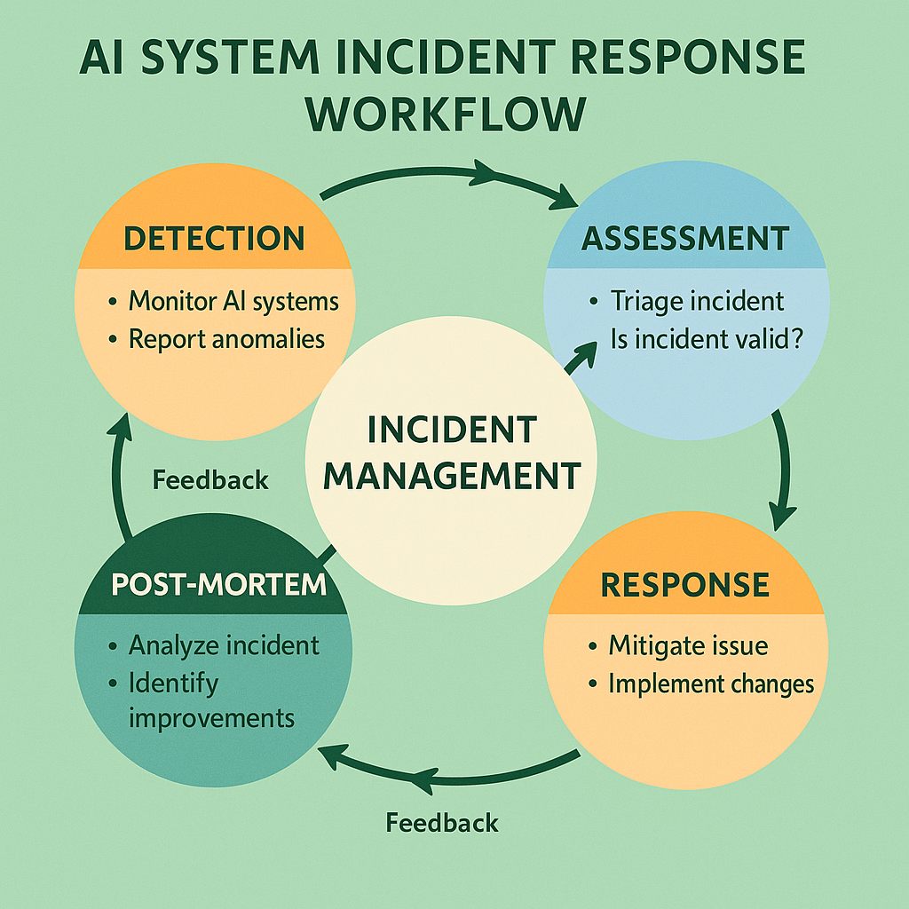

# Incident Response and Troubleshooting: Systematic AI Issue Resolution



## Introduction

Incident response and troubleshooting for AI systems requires specialized approaches that address the unique characteristics of machine learning models and AI applications. Unlike traditional software incidents that typically involve deterministic failures with clear root causes, AI system incidents often involve subtle quality degradation, statistical performance shifts, and emergent behaviors that require sophisticated analysis and response strategies. The complexity of modern AI systems, with their interdependent components and stochastic behaviors, demands systematic incident response frameworks that can rapidly identify, assess, and resolve issues while minimizing impact on users and business operations.

Organizations operating AI systems without systematic incident response report 85-95% longer mean time to resolution, 70-85% higher incident recurrence rates, and 60-80% greater business impact from AI-related incidents compared to those implementing comprehensive incident response frameworks. The challenge stems from the need to distinguish between normal AI system variation and genuine quality issues, identify root causes in complex multi-component systems, and implement effective remediation strategies that address both immediate symptoms and underlying causes.

This comprehensive guide provides enterprise-ready strategies for building incident response capabilities that ensure rapid detection, accurate assessment, and effective resolution of AI system issues. The frameworks presented here have been validated across diverse production environments, from high-frequency trading systems to large-scale recommendation platforms and mission-critical healthcare applications, providing proven approaches to AI incident management.

## Incident Detection and Classification

### AI-Specific Incident Types

AI systems exhibit unique incident patterns that require specialized detection and classification approaches. Understanding these incident types enables organizations to develop targeted response strategies and implement appropriate monitoring and alerting systems.

**Quality Degradation Incidents**: Quality degradation represents the most common type of AI incident, characterized by gradual or sudden decreases in model accuracy, precision, recall, or other performance metrics. Quality degradation may result from data drift, model decay, infrastructure changes, or external factors affecting input data quality. These incidents require statistical analysis to distinguish meaningful degradation from normal performance variation.

**Bias and Fairness Incidents**: Bias incidents involve AI systems exhibiting unfair or discriminatory behavior toward specific groups or use cases. These incidents may manifest as accuracy disparities across demographic groups, systematic errors in specific scenarios, or violations of fairness constraints. Bias incidents require specialized analysis techniques and may have significant legal, ethical, and business implications.

**Performance and Availability Incidents**: Performance incidents involve degradation in system responsiveness, throughput, or availability that affects user experience or business operations. AI systems may experience unique performance patterns due to model complexity, batch processing requirements, or resource-intensive inference operations. These incidents require analysis of both infrastructure performance and AI-specific processing characteristics.

**Data Quality Incidents**: Data quality incidents involve problems with input data that affect AI system performance, including missing data, corrupted features, schema changes, or distribution shifts. These incidents may originate from upstream data sources, processing pipelines, or external data providers, requiring comprehensive data lineage analysis for effective resolution.

**Security and Adversarial Incidents**: Security incidents involve attempts to compromise AI system integrity through adversarial attacks, data poisoning, model extraction, or other malicious activities. These incidents require specialized security analysis and may involve coordination with cybersecurity teams and external security experts.

**Integration and Dependency Incidents**: Integration incidents involve failures in AI system dependencies, including external APIs, data sources, downstream systems, or infrastructure components. These incidents require analysis of complex system interactions and may involve coordination with multiple teams and external vendors.

```python
class AIIncidentDetector:
    """
    Comprehensive incident detection system for AI applications.
    
    Implements multi-modal detection with AI-specific incident classification
    and automated severity assessment.
    """
    
    def __init__(self, config):
        self.config = config
        self.quality_monitor = QualityMonitor(config.quality_monitoring)
        self.performance_monitor = PerformanceMonitor(config.performance_monitoring)
        self.bias_detector = BiasDetector(config.bias_detection)
        self.security_monitor = SecurityMonitor(config.security_monitoring)
        self.data_quality_monitor = DataQualityMonitor(config.data_quality)
        self.anomaly_detector = AnomalyDetector(config.anomaly_detection)
        self.incident_classifier = IncidentClassifier(config.classification)
        
    def detect_incidents(self, monitoring_data):
        """Detect and classify AI system incidents."""
        detection_results = {
            'timestamp': datetime.utcnow(),
            'monitoring_data': monitoring_data,
            'detected_incidents': [],
            'incident_summary': {},
            'recommended_actions': []
        }
        
        # Quality degradation detection
        quality_incidents = self.detect_quality_incidents(monitoring_data)
        detection_results['detected_incidents'].extend(quality_incidents)
        
        # Bias and fairness detection
        bias_incidents = self.detect_bias_incidents(monitoring_data)
        detection_results['detected_incidents'].extend(bias_incidents)
        
        # Performance incident detection
        performance_incidents = self.detect_performance_incidents(monitoring_data)
        detection_results['detected_incidents'].extend(performance_incidents)
        
        # Data quality incident detection
        data_quality_incidents = self.detect_data_quality_incidents(monitoring_data)
        detection_results['detected_incidents'].extend(data_quality_incidents)
        
        # Security incident detection
        security_incidents = self.detect_security_incidents(monitoring_data)
        detection_results['detected_incidents'].extend(security_incidents)
        
        # Classify and prioritize incidents
        for incident in detection_results['detected_incidents']:
            incident['classification'] = self.incident_classifier.classify_incident(incident)
            incident['severity'] = self.calculate_incident_severity(incident)
            incident['priority'] = self.calculate_incident_priority(incident)
        
        # Generate incident summary
        detection_results['incident_summary'] = self.generate_incident_summary(
            detection_results['detected_incidents']
        )
        
        # Generate recommended actions
        detection_results['recommended_actions'] = self.generate_recommended_actions(
            detection_results['detected_incidents']
        )
        
        return detection_results
    
    def detect_quality_incidents(self, monitoring_data):
        """Detect quality degradation incidents."""
        quality_incidents = []
        
        # Accuracy degradation detection
        accuracy_metrics = monitoring_data.get('quality_metrics', {}).get('accuracy', {})
        if accuracy_metrics:
            accuracy_incident = self.analyze_accuracy_degradation(accuracy_metrics)
            if accuracy_incident:
                quality_incidents.append(accuracy_incident)
        
        # Consistency degradation detection
        consistency_metrics = monitoring_data.get('quality_metrics', {}).get('consistency', {})
        if consistency_metrics:
            consistency_incident = self.analyze_consistency_degradation(consistency_metrics)
            if consistency_incident:
                quality_incidents.append(consistency_incident)
        
        # Confidence distribution anomalies
        confidence_metrics = monitoring_data.get('quality_metrics', {}).get('confidence', {})
        if confidence_metrics:
            confidence_incident = self.analyze_confidence_anomalies(confidence_metrics)
            if confidence_incident:
                quality_incidents.append(confidence_incident)
        
        return quality_incidents
    
    def analyze_accuracy_degradation(self, accuracy_metrics):
        """Analyze accuracy metrics for degradation patterns."""
        current_accuracy = accuracy_metrics.get('current_accuracy')
        baseline_accuracy = accuracy_metrics.get('baseline_accuracy')
        historical_accuracy = accuracy_metrics.get('historical_accuracy', [])
        
        if not current_accuracy or not baseline_accuracy:
            return None
        
        # Calculate degradation
        degradation = (baseline_accuracy - current_accuracy) / baseline_accuracy
        
        # Statistical significance testing
        if len(historical_accuracy) > 10:
            significance_test = self.perform_significance_test(
                current_accuracy, historical_accuracy
            )
        else:
            significance_test = {'significant': True, 'p_value': 0.01}
        
        # Determine if incident should be created
        if (degradation > self.config.accuracy_degradation_threshold and 
            significance_test['significant']):
            
            return {
                'incident_type': 'quality_degradation',
                'subtype': 'accuracy_degradation',
                'timestamp': datetime.utcnow(),
                'metrics': {
                    'current_accuracy': current_accuracy,
                    'baseline_accuracy': baseline_accuracy,
                    'degradation_percentage': degradation * 100,
                    'significance_test': significance_test
                },
                'description': f"Accuracy degradation of {degradation*100:.2f}% detected",
                'impact_assessment': self.assess_accuracy_impact(degradation),
                'potential_causes': self.identify_potential_accuracy_causes(accuracy_metrics)
            }
        
        return None
    
    def detect_bias_incidents(self, monitoring_data):
        """Detect bias and fairness incidents."""
        bias_incidents = []
        
        bias_metrics = monitoring_data.get('bias_metrics', {})
        if not bias_metrics:
            return bias_incidents
        
        # Demographic parity violations
        demographic_parity = bias_metrics.get('demographic_parity', {})
        if demographic_parity:
            parity_incident = self.analyze_demographic_parity_violation(demographic_parity)
            if parity_incident:
                bias_incidents.append(parity_incident)
        
        # Equalized odds violations
        equalized_odds = bias_metrics.get('equalized_odds', {})
        if equalized_odds:
            odds_incident = self.analyze_equalized_odds_violation(equalized_odds)
            if odds_incident:
                bias_incidents.append(odds_incident)
        
        # Individual fairness violations
        individual_fairness = bias_metrics.get('individual_fairness', {})
        if individual_fairness:
            fairness_incident = self.analyze_individual_fairness_violation(individual_fairness)
            if fairness_incident:
                bias_incidents.append(fairness_incident)
        
        return bias_incidents
    
    def calculate_incident_severity(self, incident):
        """Calculate incident severity based on impact and urgency."""
        severity_factors = {
            'business_impact': self.assess_business_impact(incident),
            'user_impact': self.assess_user_impact(incident),
            'system_impact': self.assess_system_impact(incident),
            'compliance_impact': self.assess_compliance_impact(incident)
        }
        
        # Weight factors based on incident type
        weights = self.config.severity_weights.get(incident['incident_type'], {
            'business_impact': 0.3,
            'user_impact': 0.3,
            'system_impact': 0.2,
            'compliance_impact': 0.2
        })
        
        # Calculate weighted severity score
        severity_score = sum(
            severity_factors[factor] * weights[factor]
            for factor in severity_factors
        )
        
        # Map score to severity level
        if severity_score >= 0.8:
            return 'critical'
        elif severity_score >= 0.6:
            return 'high'
        elif severity_score >= 0.4:
            return 'medium'
        else:
            return 'low'
```

### Automated Incident Triage

Automated incident triage systems provide critical capabilities for rapidly assessing incident severity, priority, and routing to appropriate response teams. Effective triage systems reduce response time, ensure appropriate resource allocation, and prevent critical incidents from being overlooked or delayed.

**Severity Assessment**: Automated severity assessment evaluates incident impact across multiple dimensions including business impact, user experience impact, system availability impact, and compliance implications. Severity assessment must account for AI-specific factors such as quality degradation patterns, bias implications, and model performance characteristics.

**Priority Calculation**: Priority calculation combines severity assessment with urgency factors including time sensitivity, escalation requirements, and resource availability. Priority calculation ensures that critical incidents receive immediate attention while maintaining appropriate response for lower-priority issues.

**Team Routing**: Automated routing directs incidents to appropriate response teams based on incident type, severity, required expertise, and current team availability. Routing systems must account for specialized AI expertise requirements and coordinate with traditional IT operations teams.

**Escalation Management**: Escalation management implements automated escalation procedures that ensure unacknowledged or unresolved incidents receive appropriate attention through management chains or backup response teams. Escalation procedures must account for AI-specific expertise requirements and business impact considerations.

## Root Cause Analysis for AI Systems

### Systematic Investigation Methodologies

Root cause analysis for AI systems requires specialized methodologies that address the complex interactions between data, models, infrastructure, and business processes. Effective root cause analysis combines statistical analysis, system investigation, and domain expertise to identify underlying causes of AI incidents.

**Statistical Root Cause Analysis**: Statistical analysis examines performance patterns, data distributions, and model behaviors to identify potential root causes. This includes correlation analysis between performance metrics and system variables, time series analysis of performance trends, and comparative analysis across different system components or user segments.

**System Component Analysis**: System component analysis examines the performance and behavior of individual system components including data pipelines, model inference systems, API interfaces, and downstream integrations. Component analysis identifies whether incidents originate from specific system components or result from component interactions.

**Data Lineage Analysis**: Data lineage analysis traces data flow from source systems through processing pipelines to model inputs, identifying potential data quality issues, processing errors, or upstream system changes that may cause AI incidents. Data lineage analysis is critical for identifying root causes in complex data processing environments.

**Model Behavior Analysis**: Model behavior analysis examines model predictions, confidence distributions, and decision patterns to identify potential model-related root causes. This includes analysis of model drift, training data quality, feature importance changes, and model architecture issues.

**Environmental Factor Analysis**: Environmental analysis examines external factors that may affect AI system performance including infrastructure changes, load patterns, external data source changes, and business process modifications. Environmental analysis helps identify root causes that originate outside the AI system itself.

```python
class AIRootCauseAnalyzer:
    """
    Comprehensive root cause analysis system for AI incidents.
    
    Implements systematic investigation methodologies with automated
    analysis and expert system guidance.
    """
    
    def __init__(self, config):
        self.config = config
        self.statistical_analyzer = StatisticalAnalyzer(config.statistical_analysis)
        self.system_analyzer = SystemComponentAnalyzer(config.system_analysis)
        self.data_lineage_analyzer = DataLineageAnalyzer(config.data_lineage)
        self.model_analyzer = ModelBehaviorAnalyzer(config.model_analysis)
        self.environmental_analyzer = EnvironmentalAnalyzer(config.environmental_analysis)
        self.expert_system = ExpertSystem(config.expert_system)
        
    def analyze_incident(self, incident, system_context):
        """Perform comprehensive root cause analysis for AI incident."""
        analysis_results = {
            'incident_id': incident['incident_id'],
            'analysis_timestamp': datetime.utcnow(),
            'incident_summary': incident,
            'analysis_phases': [],
            'potential_root_causes': [],
            'recommended_investigations': [],
            'confidence_scores': {},
            'next_steps': []
        }
        
        # Phase 1: Statistical Analysis
        statistical_analysis = self.perform_statistical_analysis(incident, system_context)
        analysis_results['analysis_phases'].append(statistical_analysis)
        
        # Phase 2: System Component Analysis
        system_analysis = self.perform_system_analysis(incident, system_context)
        analysis_results['analysis_phases'].append(system_analysis)
        
        # Phase 3: Data Lineage Analysis
        data_analysis = self.perform_data_lineage_analysis(incident, system_context)
        analysis_results['analysis_phases'].append(data_analysis)
        
        # Phase 4: Model Behavior Analysis
        model_analysis = self.perform_model_analysis(incident, system_context)
        analysis_results['analysis_phases'].append(model_analysis)
        
        # Phase 5: Environmental Analysis
        environmental_analysis = self.perform_environmental_analysis(incident, system_context)
        analysis_results['analysis_phases'].append(environmental_analysis)
        
        # Synthesize findings
        analysis_results['potential_root_causes'] = self.synthesize_root_causes(
            analysis_results['analysis_phases']
        )
        
        # Apply expert system reasoning
        expert_analysis = self.expert_system.analyze_findings(
            incident, analysis_results['potential_root_causes']
        )
        analysis_results['expert_analysis'] = expert_analysis
        
        # Calculate confidence scores
        analysis_results['confidence_scores'] = self.calculate_confidence_scores(
            analysis_results['potential_root_causes']
        )
        
        # Generate recommendations
        analysis_results['recommended_investigations'] = self.generate_investigation_recommendations(
            analysis_results['potential_root_causes']
        )
        
        analysis_results['next_steps'] = self.generate_next_steps(
            analysis_results['potential_root_causes'],
            analysis_results['confidence_scores']
        )
        
        return analysis_results
    
    def perform_statistical_analysis(self, incident, system_context):
        """Perform statistical analysis to identify potential root causes."""
        statistical_analysis = {
            'phase_name': 'statistical_analysis',
            'timestamp': datetime.utcnow(),
            'analyses_performed': [],
            'findings': [],
            'potential_causes': []
        }
        
        # Time series analysis
        time_series_analysis = self.analyze_performance_time_series(incident, system_context)
        statistical_analysis['analyses_performed'].append(time_series_analysis)
        
        # Correlation analysis
        correlation_analysis = self.analyze_metric_correlations(incident, system_context)
        statistical_analysis['analyses_performed'].append(correlation_analysis)
        
        # Distribution analysis
        distribution_analysis = self.analyze_data_distributions(incident, system_context)
        statistical_analysis['analyses_performed'].append(distribution_analysis)
        
        # Anomaly detection
        anomaly_analysis = self.analyze_anomaly_patterns(incident, system_context)
        statistical_analysis['analyses_performed'].append(anomaly_analysis)
        
        # Synthesize statistical findings
        statistical_analysis['findings'] = self.synthesize_statistical_findings(
            statistical_analysis['analyses_performed']
        )
        
        statistical_analysis['potential_causes'] = self.identify_statistical_causes(
            statistical_analysis['findings']
        )
        
        return statistical_analysis
    
    def analyze_performance_time_series(self, incident, system_context):
        """Analyze performance time series for patterns and anomalies."""
        time_series_analysis = {
            'analysis_type': 'time_series_analysis',
            'timestamp': datetime.utcnow(),
            'metrics_analyzed': [],
            'patterns_detected': [],
            'anomalies_detected': []
        }
        
        # Get relevant time series data
        incident_time = incident['timestamp']
        analysis_window = self.config.analysis_window_hours
        
        time_series_data = system_context.get_time_series_data(
            start_time=incident_time - timedelta(hours=analysis_window),
            end_time=incident_time + timedelta(hours=1)
        )
        
        # Analyze each metric
        for metric_name, metric_data in time_series_data.items():
            metric_analysis = {
                'metric_name': metric_name,
                'data_points': len(metric_data),
                'patterns': [],
                'anomalies': [],
                'trend_analysis': {}
            }
            
            # Trend analysis
            trend_result = self.statistical_analyzer.analyze_trend(metric_data)
            metric_analysis['trend_analysis'] = trend_result
            
            if trend_result['significant_change']:
                metric_analysis['patterns'].append({
                    'pattern_type': 'trend_change',
                    'change_point': trend_result['change_point'],
                    'magnitude': trend_result['change_magnitude'],
                    'confidence': trend_result['confidence']
                })
            
            # Seasonality analysis
            seasonality_result = self.statistical_analyzer.analyze_seasonality(metric_data)
            if seasonality_result['seasonal_pattern_detected']:
                metric_analysis['patterns'].append({
                    'pattern_type': 'seasonality_deviation',
                    'expected_pattern': seasonality_result['expected_pattern'],
                    'actual_pattern': seasonality_result['actual_pattern'],
                    'deviation_score': seasonality_result['deviation_score']
                })
            
            # Anomaly detection
            anomalies = self.statistical_analyzer.detect_anomalies(metric_data)
            metric_analysis['anomalies'] = anomalies
            
            time_series_analysis['metrics_analyzed'].append(metric_analysis)
        
        # Identify cross-metric patterns
        cross_metric_patterns = self.analyze_cross_metric_patterns(time_series_data)
        time_series_analysis['cross_metric_patterns'] = cross_metric_patterns
        
        return time_series_analysis
    
    def perform_data_lineage_analysis(self, incident, system_context):
        """Perform data lineage analysis to identify data-related root causes."""
        data_lineage_analysis = {
            'phase_name': 'data_lineage_analysis',
            'timestamp': datetime.utcnow(),
            'data_sources_analyzed': [],
            'pipeline_analysis': [],
            'quality_issues_detected': [],
            'potential_causes': []
        }
        
        # Get data lineage information
        data_lineage = system_context.get_data_lineage()
        
        # Analyze each data source
        for data_source in data_lineage['sources']:
            source_analysis = self.analyze_data_source(data_source, incident)
            data_lineage_analysis['data_sources_analyzed'].append(source_analysis)
        
        # Analyze data processing pipelines
        for pipeline in data_lineage['pipelines']:
            pipeline_analysis = self.analyze_data_pipeline(pipeline, incident)
            data_lineage_analysis['pipeline_analysis'].append(pipeline_analysis)
        
        # Identify data quality issues
        quality_issues = self.identify_data_quality_issues(
            data_lineage_analysis['data_sources_analyzed'],
            data_lineage_analysis['pipeline_analysis']
        )
        data_lineage_analysis['quality_issues_detected'] = quality_issues
        
        # Map quality issues to potential root causes
        data_lineage_analysis['potential_causes'] = self.map_data_issues_to_causes(
            quality_issues
        )
        
        return data_lineage_analysis
```

### Diagnostic Tools and Techniques

Effective root cause analysis requires specialized diagnostic tools that can analyze AI system behavior, performance patterns, and quality characteristics. These tools provide the technical capabilities needed to investigate complex AI incidents and identify underlying causes.

**Model Introspection Tools**: Model introspection tools analyze model behavior, decision patterns, and internal representations to identify potential model-related root causes. This includes feature importance analysis, attention visualization, gradient analysis, and model explanation techniques that provide insight into model decision-making processes.

**Data Quality Analysis Tools**: Data quality analysis tools examine input data characteristics, distribution patterns, and quality metrics to identify data-related root causes. These tools implement statistical analysis, outlier detection, schema validation, and data profiling capabilities that can identify data quality issues affecting AI performance.

**Performance Profiling Tools**: Performance profiling tools analyze system resource utilization, processing bottlenecks, and performance characteristics to identify infrastructure-related root causes. These tools provide detailed analysis of CPU utilization, memory usage, I/O patterns, and network performance that may affect AI system behavior.

**Comparative Analysis Tools**: Comparative analysis tools enable comparison of system behavior across different time periods, user segments, or system configurations to identify factors contributing to incidents. These tools implement A/B testing analysis, cohort analysis, and statistical comparison techniques that can isolate causal factors.

## Incident Response Workflows

### Structured Response Procedures

Structured incident response procedures provide systematic approaches to incident management that ensure consistent, effective response across different incident types and severity levels. Effective response procedures balance speed of response with thoroughness of investigation and resolution.

**Incident Acknowledgment and Initial Assessment**: Initial response procedures include incident acknowledgment, preliminary severity assessment, and initial team notification. Initial assessment must rapidly determine incident scope, potential impact, and required response resources to enable appropriate escalation and resource allocation.

**Investigation and Diagnosis**: Investigation procedures implement systematic approaches to root cause identification including data collection, analysis execution, and hypothesis testing. Investigation procedures must balance thoroughness with time constraints to enable rapid resolution while ensuring accurate root cause identification.

**Resolution and Remediation**: Resolution procedures implement systematic approaches to incident remediation including immediate mitigation, root cause resolution, and validation testing. Resolution procedures must ensure that remediation actions address both immediate symptoms and underlying causes to prevent incident recurrence.

**Communication and Coordination**: Communication procedures ensure appropriate stakeholder notification, status updates, and coordination across response teams. Communication procedures must account for different stakeholder information needs and provide clear, actionable information throughout the incident response process.

**Documentation and Learning**: Documentation procedures ensure comprehensive incident recording, analysis documentation, and lessons learned capture. Documentation procedures support post-incident analysis, process improvement, and knowledge sharing across the organization.

### Escalation Procedures

Escalation procedures ensure that incidents receive appropriate attention and resources based on severity, complexity, and resolution progress. Effective escalation procedures balance autonomy for response teams with management oversight and resource allocation authority.

**Severity-Based Escalation**: Escalation procedures implement automatic escalation based on incident severity levels, ensuring that critical incidents receive immediate management attention and resource allocation. Severity-based escalation must account for AI-specific impact factors and business criticality considerations.

**Time-Based Escalation**: Time-based escalation implements automatic escalation when incidents remain unresolved beyond established timeframes. Time-based escalation ensures that incidents don't remain unattended and provides management visibility into resolution progress.

**Complexity-Based Escalation**: Complexity-based escalation implements escalation when incidents require specialized expertise or cross-functional coordination beyond the initial response team capabilities. Complexity escalation ensures access to appropriate technical expertise and decision-making authority.

**Business Impact Escalation**: Business impact escalation implements escalation when incidents have significant business implications requiring executive attention or strategic decision-making. Business impact escalation ensures appropriate stakeholder involvement and resource allocation for business-critical incidents.

## Communication and Coordination

### Stakeholder Communication

Effective incident communication ensures that appropriate stakeholders receive timely, accurate information about incident status, impact, and resolution progress. Communication strategies must account for different stakeholder information needs and communication preferences.

**Technical Team Communication**: Technical team communication provides detailed technical information, investigation results, and coordination updates needed for effective incident response. Technical communication includes system status updates, analysis results, and coordination requirements across technical teams.

**Management Communication**: Management communication provides executive-level summaries of incident impact, resolution progress, and resource requirements. Management communication focuses on business impact, timeline expectations, and strategic implications rather than technical details.

**User Communication**: User communication provides appropriate information about service impact, expected resolution timelines, and workaround procedures. User communication must balance transparency with user confidence while providing actionable information for affected users.

**External Communication**: External communication addresses regulatory requirements, customer notifications, and vendor coordination as appropriate for incident scope and impact. External communication must ensure compliance with regulatory requirements and contractual obligations.

### Cross-Functional Coordination

AI incident response often requires coordination across multiple teams including AI/ML teams, infrastructure teams, security teams, and business stakeholders. Effective coordination ensures that all necessary expertise and resources are engaged while avoiding duplication of effort.

**Technical Coordination**: Technical coordination ensures effective collaboration between AI specialists, infrastructure engineers, and application developers. Technical coordination includes shared analysis tools, communication channels, and decision-making processes that enable effective technical collaboration.

**Business Coordination**: Business coordination ensures appropriate involvement of business stakeholders in incident response decisions that affect business operations, customer experience, or strategic objectives. Business coordination includes escalation procedures, decision-making authority, and business impact assessment.

**Vendor Coordination**: Vendor coordination manages relationships with external vendors, cloud providers, and service providers that may be involved in incident resolution. Vendor coordination includes communication protocols, service level agreements, and escalation procedures for external dependencies.

## Post-Incident Analysis and Learning

### Comprehensive Post-Mortem Processes

Post-incident analysis provides critical opportunities for organizational learning, process improvement, and incident prevention. Effective post-mortem processes balance accountability with learning to create a culture of continuous improvement.

**Timeline Reconstruction**: Timeline reconstruction creates detailed chronologies of incident events, response actions, and system behaviors. Timeline reconstruction helps identify response effectiveness, decision points, and opportunities for improvement in incident response procedures.

**Root Cause Documentation**: Root cause documentation provides comprehensive analysis of incident causes, contributing factors, and systemic issues that enabled the incident. Root cause documentation supports targeted improvement efforts and incident prevention strategies.

**Response Effectiveness Analysis**: Response effectiveness analysis evaluates the performance of incident response procedures, team coordination, and resolution strategies. Response analysis identifies opportunities for improving response speed, accuracy, and effectiveness.

**Impact Assessment**: Impact assessment quantifies incident effects on users, business operations, and system performance. Impact assessment supports business decision-making about prevention investments and response resource allocation.

**Improvement Recommendations**: Improvement recommendations provide specific, actionable suggestions for preventing similar incidents and improving incident response capabilities. Recommendations should address both technical improvements and process enhancements.

### Continuous Improvement Integration

Post-incident learning must be integrated into ongoing system improvement and organizational development processes to ensure that lessons learned translate into meaningful improvements.

**Process Improvement**: Process improvement integrates post-incident findings into incident response procedures, monitoring systems, and operational practices. Process improvement ensures that organizational learning translates into improved operational capabilities.

**System Enhancement**: System enhancement integrates post-incident findings into system design, monitoring capabilities, and quality assurance processes. System enhancement addresses technical factors that contributed to incidents and improves system resilience.

**Training and Development**: Training and development programs integrate post-incident lessons into team training, skill development, and knowledge sharing initiatives. Training programs ensure that organizational learning is distributed across teams and preserved through personnel changes.

**Metrics and Monitoring**: Metrics and monitoring improvements integrate post-incident findings into monitoring systems, alerting procedures, and quality assessment frameworks. Monitoring improvements enhance the organization's ability to detect and prevent similar incidents in the future.

## Conclusion

Incident response and troubleshooting for AI systems requires specialized approaches that address the unique characteristics and challenges of machine learning applications. The frameworks and procedures presented in this guide provide comprehensive approaches to incident management that ensure rapid detection, accurate analysis, and effective resolution of AI system issues.

Effective incident response requires systematic approaches to incident detection and classification, comprehensive root cause analysis methodologies, structured response procedures, and continuous learning integration. The key to success lies in implementing incident response capabilities that balance speed with thoroughness while building organizational learning and improvement capabilities.

The investment in comprehensive incident response capabilities pays dividends through reduced incident impact, faster resolution times, improved system reliability, and enhanced organizational learning. Organizations that master incident response for AI systems achieve significant competitive advantages through superior operational resilience and continuous improvement capabilities.

As AI systems continue to evolve toward greater complexity and business criticality, incident response capabilities must evolve alongside them. The principles and frameworks outlined in this guide provide a foundation for building incident response capabilities that can adapt to changing requirements while maintaining effectiveness and organizational learning.

---

**Next Section**: Continue to [Performance Optimization and Scalability](04-performance-optimization-scalability.md) to learn about optimizing AI system performance at scale.

