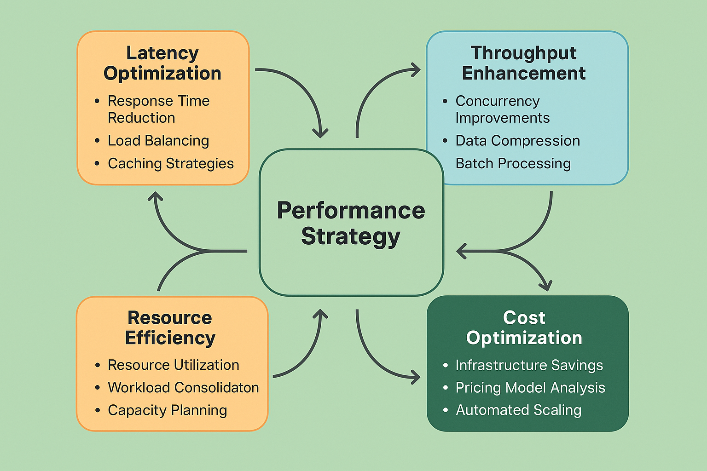
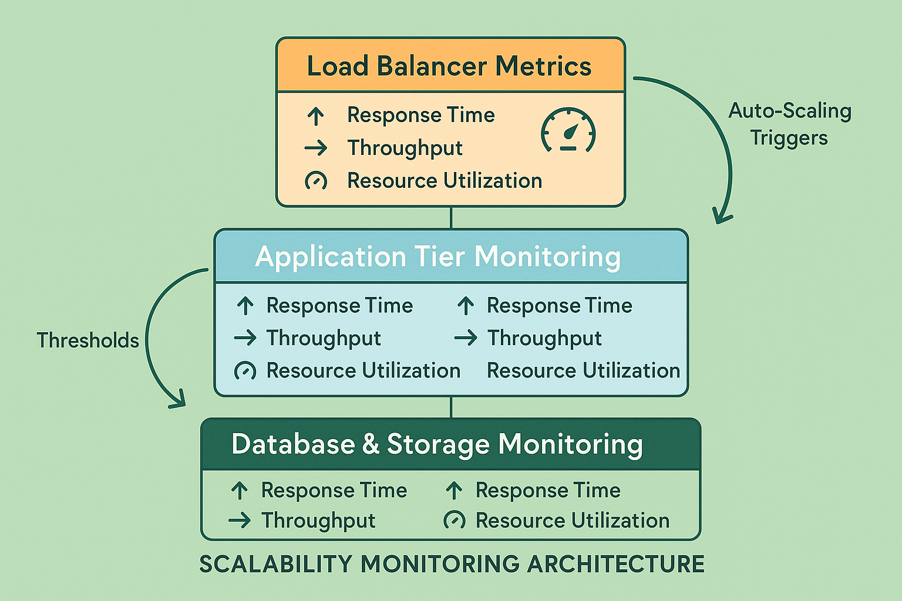

# Performance Optimization and Scalability: Enterprise AI at Scale



## Introduction

Performance optimization and scalability represent critical capabilities for AI systems operating in production environments where user experience, business requirements, and cost efficiency demand high-performance operation at scale. Unlike traditional software optimization that focuses primarily on computational efficiency, AI system optimization must address unique challenges including model inference latency, batch processing efficiency, memory management for large models, and dynamic scaling based on demand patterns. The complexity of modern AI systems, with their diverse computational requirements and resource-intensive operations, demands sophisticated optimization strategies that balance performance, cost, and quality across multiple dimensions.

Organizations operating AI systems without systematic performance optimization report 60-80% higher operational costs, 40-60% slower response times, and 50-70% lower user satisfaction compared to those implementing comprehensive optimization frameworks. The challenge stems from the need to optimize across multiple performance dimensions simultaneously while maintaining quality standards and managing resource costs. AI systems exhibit unique performance characteristics including variable inference times, memory-intensive operations, and complex scaling behaviors that require specialized optimization approaches.

This comprehensive guide provides enterprise-ready strategies for optimizing AI system performance and implementing scalable architectures that can handle production workloads efficiently. The frameworks presented here have been validated across diverse production environments, from high-frequency trading systems requiring microsecond latency to large-scale recommendation platforms serving millions of users, providing proven approaches to AI performance optimization at scale.



## Performance Metrics and Monitoring

### AI-Specific Performance Indicators

AI systems require specialized performance metrics that capture the unique characteristics of machine learning workloads and user experience requirements. Traditional performance metrics like CPU utilization and response time must be supplemented with AI-specific indicators that provide insight into model performance, quality consistency, and resource efficiency.

**Inference Latency Metrics**: Inference latency represents the time required to generate predictions from input data, including data preprocessing, model execution, and result post-processing. Effective latency monitoring must capture percentile distributions (P50, P95, P99) rather than simple averages, as AI systems often exhibit variable latency patterns based on input complexity, model state, and system load. Latency monitoring should distinguish between cold start latency (first inference after model loading) and warm inference latency to enable accurate performance assessment and optimization targeting.

**Throughput and Concurrency Metrics**: Throughput metrics measure the number of inference requests processed per unit time, while concurrency metrics track the number of simultaneous requests being processed. AI systems often exhibit complex throughput characteristics due to batch processing optimizations, GPU utilization patterns, and memory management requirements. Effective throughput monitoring must account for batch size effects, queue management, and resource contention to provide accurate performance assessment.

**Resource Utilization Metrics**: Resource utilization metrics for AI systems must capture specialized hardware usage including GPU utilization, memory consumption patterns, and specialized accelerator usage. AI workloads often exhibit unique resource consumption patterns including memory spikes during model loading, GPU utilization variations based on batch sizes, and storage I/O patterns for large model artifacts. Resource monitoring must provide detailed visibility into these patterns to enable effective optimization.

**Quality-Performance Trade-offs**: AI systems often involve trade-offs between performance and quality that must be monitored and optimized. This includes monitoring the relationship between inference speed and prediction accuracy, batch size effects on quality consistency, and resource allocation impacts on model performance. Quality-performance monitoring enables optimization decisions that balance user experience requirements with operational efficiency.

**Model-Specific Performance Metrics**: Different AI model architectures exhibit unique performance characteristics that require specialized monitoring. Transformer models may require attention to sequence length effects on performance, computer vision models may exhibit performance variations based on image resolution, and ensemble models may require monitoring of component model performance and aggregation overhead.

```python
class AIPerformanceMonitor:
    """
    Comprehensive performance monitoring system for AI applications.
    
    Implements AI-specific metrics collection, analysis, and optimization
    recommendations with real-time monitoring capabilities.
    """
    
    def __init__(self, config):
        self.config = config
        self.metrics_collector = MetricsCollector(config.metrics_collection)
        self.latency_analyzer = LatencyAnalyzer(config.latency_analysis)
        self.throughput_analyzer = ThroughputAnalyzer(config.throughput_analysis)
        self.resource_monitor = ResourceMonitor(config.resource_monitoring)
        self.quality_monitor = QualityPerformanceMonitor(config.quality_monitoring)
        self.optimization_engine = OptimizationEngine(config.optimization)
        
    def collect_performance_metrics(self, time_window):
        """Collect comprehensive performance metrics for specified time window."""
        performance_metrics = {
            'collection_timestamp': datetime.utcnow(),
            'time_window': time_window,
            'latency_metrics': {},
            'throughput_metrics': {},
            'resource_metrics': {},
            'quality_performance_metrics': {},
            'optimization_opportunities': []
        }
        
        # Collect latency metrics
        performance_metrics['latency_metrics'] = self.collect_latency_metrics(time_window)
        
        # Collect throughput metrics
        performance_metrics['throughput_metrics'] = self.collect_throughput_metrics(time_window)
        
        # Collect resource utilization metrics
        performance_metrics['resource_metrics'] = self.collect_resource_metrics(time_window)
        
        # Collect quality-performance metrics
        performance_metrics['quality_performance_metrics'] = self.collect_quality_performance_metrics(time_window)
        
        # Analyze optimization opportunities
        performance_metrics['optimization_opportunities'] = self.identify_optimization_opportunities(
            performance_metrics
        )
        
        return performance_metrics
    
    def collect_latency_metrics(self, time_window):
        """Collect comprehensive latency metrics."""
        latency_data = self.metrics_collector.get_latency_data(time_window)
        
        latency_metrics = {
            'inference_latency': self.analyze_inference_latency(latency_data),
            'preprocessing_latency': self.analyze_preprocessing_latency(latency_data),
            'postprocessing_latency': self.analyze_postprocessing_latency(latency_data),
            'end_to_end_latency': self.analyze_end_to_end_latency(latency_data),
            'cold_start_analysis': self.analyze_cold_start_latency(latency_data),
            'latency_distribution': self.analyze_latency_distribution(latency_data)
        }
        
        return latency_metrics
    
    def analyze_inference_latency(self, latency_data):
        """Analyze model inference latency patterns."""
        inference_latency = latency_data.get('inference_latency', [])
        
        if not inference_latency:
            return {'error': 'No inference latency data available'}
        
        analysis = {
            'sample_count': len(inference_latency),
            'percentiles': {
                'p50': np.percentile(inference_latency, 50),
                'p90': np.percentile(inference_latency, 90),
                'p95': np.percentile(inference_latency, 95),
                'p99': np.percentile(inference_latency, 99)
            },
            'statistics': {
                'mean': np.mean(inference_latency),
                'median': np.median(inference_latency),
                'std_dev': np.std(inference_latency),
                'min': np.min(inference_latency),
                'max': np.max(inference_latency)
            },
            'trend_analysis': self.latency_analyzer.analyze_latency_trends(inference_latency),
            'anomaly_detection': self.latency_analyzer.detect_latency_anomalies(inference_latency)
        }
        
        # Analyze latency by batch size if available
        if 'batch_sizes' in latency_data:
            analysis['batch_size_analysis'] = self.analyze_latency_by_batch_size(
                inference_latency, latency_data['batch_sizes']
            )
        
        # Analyze latency by input characteristics if available
        if 'input_characteristics' in latency_data:
            analysis['input_characteristic_analysis'] = self.analyze_latency_by_input_characteristics(
                inference_latency, latency_data['input_characteristics']
            )
        
        return analysis
    
    def collect_throughput_metrics(self, time_window):
        """Collect comprehensive throughput metrics."""
        throughput_data = self.metrics_collector.get_throughput_data(time_window)
        
        throughput_metrics = {
            'requests_per_second': self.analyze_requests_per_second(throughput_data),
            'batch_throughput': self.analyze_batch_throughput(throughput_data),
            'concurrent_requests': self.analyze_concurrent_requests(throughput_data),
            'queue_analysis': self.analyze_queue_performance(throughput_data),
            'scaling_efficiency': self.analyze_scaling_efficiency(throughput_data)
        }
        
        return throughput_metrics
    
    def analyze_requests_per_second(self, throughput_data):
        """Analyze requests per second patterns."""
        rps_data = throughput_data.get('requests_per_second', [])
        
        if not rps_data:
            return {'error': 'No RPS data available'}
        
        analysis = {
            'current_rps': rps_data[-1] if rps_data else 0,
            'peak_rps': max(rps_data) if rps_data else 0,
            'average_rps': np.mean(rps_data) if rps_data else 0,
            'rps_percentiles': {
                'p50': np.percentile(rps_data, 50),
                'p90': np.percentile(rps_data, 90),
                'p95': np.percentile(rps_data, 95),
                'p99': np.percentile(rps_data, 99)
            } if rps_data else {},
            'trend_analysis': self.throughput_analyzer.analyze_rps_trends(rps_data),
            'capacity_analysis': self.analyze_capacity_utilization(rps_data)
        }
        
        return analysis
    
    def collect_resource_metrics(self, time_window):
        """Collect comprehensive resource utilization metrics."""
        resource_data = self.metrics_collector.get_resource_data(time_window)
        
        resource_metrics = {
            'cpu_utilization': self.analyze_cpu_utilization(resource_data),
            'memory_utilization': self.analyze_memory_utilization(resource_data),
            'gpu_utilization': self.analyze_gpu_utilization(resource_data),
            'storage_io': self.analyze_storage_io(resource_data),
            'network_io': self.analyze_network_io(resource_data),
            'resource_efficiency': self.analyze_resource_efficiency(resource_data)
        }
        
        return resource_metrics
    
    def analyze_gpu_utilization(self, resource_data):
        """Analyze GPU utilization patterns for AI workloads."""
        gpu_data = resource_data.get('gpu_utilization', {})
        
        if not gpu_data:
            return {'error': 'No GPU data available'}
        
        analysis = {
            'gpu_devices': [],
            'overall_utilization': {},
            'memory_utilization': {},
            'efficiency_analysis': {}
        }
        
        for gpu_id, gpu_metrics in gpu_data.items():
            gpu_analysis = {
                'gpu_id': gpu_id,
                'utilization_stats': {
                    'mean': np.mean(gpu_metrics.get('utilization', [])),
                    'max': np.max(gpu_metrics.get('utilization', [])),
                    'min': np.min(gpu_metrics.get('utilization', [])),
                    'std_dev': np.std(gpu_metrics.get('utilization', []))
                },
                'memory_stats': {
                    'mean_used': np.mean(gpu_metrics.get('memory_used', [])),
                    'max_used': np.max(gpu_metrics.get('memory_used', [])),
                    'total_memory': gpu_metrics.get('total_memory', 0),
                    'utilization_percentage': np.mean(gpu_metrics.get('memory_used', [])) / gpu_metrics.get('total_memory', 1) * 100
                },
                'efficiency_metrics': {
                    'utilization_efficiency': self.calculate_gpu_efficiency(gpu_metrics),
                    'memory_efficiency': self.calculate_memory_efficiency(gpu_metrics),
                    'thermal_throttling': self.detect_thermal_throttling(gpu_metrics)
                }
            }
            
            analysis['gpu_devices'].append(gpu_analysis)
        
        # Calculate overall GPU utilization
        all_utilization = [
            util for gpu_metrics in gpu_data.values() 
            for util in gpu_metrics.get('utilization', [])
        ]
        
        if all_utilization:
            analysis['overall_utilization'] = {
                'mean': np.mean(all_utilization),
                'max': np.max(all_utilization),
                'min': np.min(all_utilization),
                'percentiles': {
                    'p50': np.percentile(all_utilization, 50),
                    'p90': np.percentile(all_utilization, 90),
                    'p95': np.percentile(all_utilization, 95)
                }
            }
        
        return analysis
    
    def identify_optimization_opportunities(self, performance_metrics):
        """Identify performance optimization opportunities."""
        opportunities = []
        
        # Analyze latency optimization opportunities
        latency_opportunities = self.identify_latency_optimizations(
            performance_metrics['latency_metrics']
        )
        opportunities.extend(latency_opportunities)
        
        # Analyze throughput optimization opportunities
        throughput_opportunities = self.identify_throughput_optimizations(
            performance_metrics['throughput_metrics']
        )
        opportunities.extend(throughput_opportunities)
        
        # Analyze resource optimization opportunities
        resource_opportunities = self.identify_resource_optimizations(
            performance_metrics['resource_metrics']
        )
        opportunities.extend(resource_opportunities)
        
        # Analyze quality-performance trade-off opportunities
        quality_opportunities = self.identify_quality_performance_optimizations(
            performance_metrics['quality_performance_metrics']
        )
        opportunities.extend(quality_opportunities)
        
        # Prioritize opportunities by impact and effort
        prioritized_opportunities = self.prioritize_optimization_opportunities(opportunities)
        
        return prioritized_opportunities
    
    def identify_latency_optimizations(self, latency_metrics):
        """Identify latency optimization opportunities."""
        opportunities = []
        
        # Check for high P99 latency
        inference_latency = latency_metrics.get('inference_latency', {})
        if inference_latency.get('percentiles', {}).get('p99', 0) > self.config.latency_thresholds.p99:
            opportunities.append({
                'type': 'latency_optimization',
                'subtype': 'high_p99_latency',
                'description': 'High P99 inference latency detected',
                'current_value': inference_latency['percentiles']['p99'],
                'threshold': self.config.latency_thresholds.p99,
                'impact': 'high',
                'effort': 'medium',
                'recommendations': [
                    'Implement model quantization',
                    'Optimize batch processing',
                    'Consider model distillation',
                    'Implement caching strategies'
                ]
            })
        
        # Check for cold start issues
        cold_start_analysis = latency_metrics.get('cold_start_analysis', {})
        if cold_start_analysis.get('cold_start_penalty', 0) > self.config.cold_start_threshold:
            opportunities.append({
                'type': 'latency_optimization',
                'subtype': 'cold_start_optimization',
                'description': 'High cold start latency detected',
                'current_value': cold_start_analysis['cold_start_penalty'],
                'threshold': self.config.cold_start_threshold,
                'impact': 'medium',
                'effort': 'low',
                'recommendations': [
                    'Implement model pre-warming',
                    'Use keep-alive strategies',
                    'Optimize model loading',
                    'Consider serverless optimizations'
                ]
            })
        
        # Check for preprocessing bottlenecks
        preprocessing_latency = latency_metrics.get('preprocessing_latency', {})
        total_latency = latency_metrics.get('end_to_end_latency', {}).get('statistics', {}).get('mean', 1)
        preprocessing_ratio = preprocessing_latency.get('statistics', {}).get('mean', 0) / total_latency
        
        if preprocessing_ratio > 0.3:  # Preprocessing takes more than 30% of total time
            opportunities.append({
                'type': 'latency_optimization',
                'subtype': 'preprocessing_optimization',
                'description': 'Preprocessing represents significant portion of latency',
                'current_value': preprocessing_ratio * 100,
                'threshold': 30,
                'impact': 'medium',
                'effort': 'low',
                'recommendations': [
                    'Optimize data preprocessing pipelines',
                    'Implement preprocessing caching',
                    'Use vectorized operations',
                    'Consider preprocessing parallelization'
                ]
            })
        
        return opportunities
```

### Real-Time Performance Tracking

Real-time performance tracking provides continuous visibility into AI system performance characteristics, enabling rapid detection of performance issues and optimization opportunities. Effective real-time tracking balances comprehensive monitoring with system overhead to provide actionable insights without impacting system performance.

**Streaming Metrics Collection**: Real-time performance tracking implements streaming metrics collection that captures performance data with minimal latency and system overhead. Streaming collection must handle high-volume metrics data while providing real-time aggregation and analysis capabilities. Effective streaming systems implement sampling strategies, data compression, and efficient transport mechanisms to minimize performance impact.

**Dynamic Threshold Management**: Real-time tracking systems implement dynamic threshold management that adapts performance thresholds based on system behavior patterns, load characteristics, and business requirements. Dynamic thresholds enable more accurate anomaly detection and reduce false alerts while maintaining sensitivity to genuine performance issues.

**Predictive Performance Analysis**: Advanced real-time tracking systems implement predictive analysis that forecasts performance trends and identifies potential issues before they impact users. Predictive analysis uses historical performance patterns, load forecasting, and system behavior models to enable proactive performance management.

**Automated Performance Alerting**: Real-time tracking systems implement intelligent alerting that notifies appropriate teams when performance issues are detected. Automated alerting must balance sensitivity with specificity to ensure that critical issues receive immediate attention while avoiding alert fatigue from false positives.

## Optimization Strategies

### Model-Level Optimizations

Model-level optimizations focus on improving the computational efficiency and resource utilization of AI models themselves, addressing performance bottlenecks at the algorithmic and implementation level.

**Model Quantization**: Model quantization reduces the precision of model weights and activations to decrease memory usage and improve inference speed. Effective quantization strategies balance performance improvements with quality preservation, implementing techniques such as post-training quantization, quantization-aware training, and dynamic quantization based on model characteristics and deployment requirements.

**Model Pruning**: Model pruning removes unnecessary model parameters to reduce model size and improve inference speed. Pruning strategies include magnitude-based pruning, structured pruning, and gradual pruning that maintain model quality while achieving significant performance improvements. Effective pruning requires careful analysis of model architecture and performance requirements to optimize the trade-off between model size and quality.

**Model Distillation**: Model distillation creates smaller, faster models that approximate the behavior of larger, more complex models. Distillation strategies include teacher-student training, progressive distillation, and ensemble distillation that enable deployment of high-performance models in resource-constrained environments while maintaining quality standards.

**Architecture Optimization**: Architecture optimization involves selecting and configuring model architectures that provide optimal performance for specific deployment requirements. This includes choosing appropriate model sizes, layer configurations, and architectural patterns that balance quality requirements with performance constraints.

**Compilation and Runtime Optimization**: Model compilation and runtime optimization use specialized compilers and runtime systems to optimize model execution for specific hardware platforms. This includes graph optimization, operator fusion, memory layout optimization, and hardware-specific optimizations that can provide significant performance improvements.

```python
class ModelOptimizer:
    """
    Comprehensive model optimization system for AI applications.
    
    Implements quantization, pruning, distillation, and compilation
    optimizations with quality preservation guarantees.
    """
    
    def __init__(self, config):
        self.config = config
        self.quantization_engine = QuantizationEngine(config.quantization)
        self.pruning_engine = PruningEngine(config.pruning)
        self.distillation_engine = DistillationEngine(config.distillation)
        self.compilation_engine = CompilationEngine(config.compilation)
        self.quality_validator = QualityValidator(config.quality_validation)
        
    def optimize_model(self, model, optimization_config):
        """Perform comprehensive model optimization."""
        optimization_results = {
            'original_model': self.analyze_model_characteristics(model),
            'optimization_steps': [],
            'final_model': None,
            'performance_improvements': {},
            'quality_impact': {},
            'optimization_summary': {}
        }
        
        current_model = model
        
        # Apply optimizations in sequence
        for optimization_step in optimization_config.optimization_sequence:
            step_result = self.apply_optimization_step(current_model, optimization_step)
            optimization_results['optimization_steps'].append(step_result)
            
            if step_result['success']:
                current_model = step_result['optimized_model']
            else:
                # Skip failed optimization step
                continue
        
        optimization_results['final_model'] = current_model
        
        # Analyze overall optimization results
        optimization_results['performance_improvements'] = self.analyze_performance_improvements(
            optimization_results['original_model'],
            current_model
        )
        
        optimization_results['quality_impact'] = self.analyze_quality_impact(
            model,
            current_model,
            optimization_config.quality_validation_data
        )
        
        optimization_results['optimization_summary'] = self.generate_optimization_summary(
            optimization_results
        )
        
        return optimization_results
    
    def apply_quantization_optimization(self, model, quantization_config):
        """Apply model quantization optimization."""
        quantization_result = {
            'optimization_type': 'quantization',
            'timestamp': datetime.utcnow(),
            'success': False,
            'original_model_size': self.get_model_size(model),
            'quantized_model': None,
            'quantization_details': {},
            'performance_impact': {},
            'quality_impact': {}
        }
        
        try:
            # Analyze model for quantization suitability
            quantization_analysis = self.quantization_engine.analyze_quantization_suitability(
                model, quantization_config
            )
            quantization_result['quantization_analysis'] = quantization_analysis
            
            if not quantization_analysis['suitable_for_quantization']:
                quantization_result['error'] = 'Model not suitable for quantization'
                return quantization_result
            
            # Apply quantization
            if quantization_config.quantization_type == 'post_training':
                quantized_model = self.quantization_engine.apply_post_training_quantization(
                    model, quantization_config
                )
            elif quantization_config.quantization_type == 'quantization_aware':
                quantized_model = self.quantization_engine.apply_quantization_aware_training(
                    model, quantization_config
                )
            else:
                raise ValueError(f"Unsupported quantization type: {quantization_config.quantization_type}")
            
            quantization_result['quantized_model'] = quantized_model
            quantization_result['quantized_model_size'] = self.get_model_size(quantized_model)
            
            # Analyze performance impact
            performance_impact = self.analyze_quantization_performance_impact(
                model, quantized_model, quantization_config
            )
            quantization_result['performance_impact'] = performance_impact
            
            # Validate quality preservation
            quality_impact = self.quality_validator.validate_quantization_quality(
                model, quantized_model, quantization_config.validation_data
            )
            quantization_result['quality_impact'] = quality_impact
            
            # Check if quality preservation meets requirements
            if quality_impact['quality_preserved']:
                quantization_result['success'] = True
            else:
                quantization_result['error'] = 'Quality preservation requirements not met'
            
        except Exception as e:
            quantization_result['error'] = str(e)
        
        return quantization_result
    
    def apply_pruning_optimization(self, model, pruning_config):
        """Apply model pruning optimization."""
        pruning_result = {
            'optimization_type': 'pruning',
            'timestamp': datetime.utcnow(),
            'success': False,
            'original_parameters': self.count_model_parameters(model),
            'pruned_model': None,
            'pruning_details': {},
            'performance_impact': {},
            'quality_impact': {}
        }
        
        try:
            # Analyze model for pruning opportunities
            pruning_analysis = self.pruning_engine.analyze_pruning_opportunities(
                model, pruning_config
            )
            pruning_result['pruning_analysis'] = pruning_analysis
            
            # Apply pruning strategy
            if pruning_config.pruning_strategy == 'magnitude_based':
                pruned_model = self.pruning_engine.apply_magnitude_based_pruning(
                    model, pruning_config
                )
            elif pruning_config.pruning_strategy == 'structured':
                pruned_model = self.pruning_engine.apply_structured_pruning(
                    model, pruning_config
                )
            elif pruning_config.pruning_strategy == 'gradual':
                pruned_model = self.pruning_engine.apply_gradual_pruning(
                    model, pruning_config
                )
            else:
                raise ValueError(f"Unsupported pruning strategy: {pruning_config.pruning_strategy}")
            
            pruning_result['pruned_model'] = pruned_model
            pruning_result['pruned_parameters'] = self.count_model_parameters(pruned_model)
            pruning_result['pruning_ratio'] = (
                pruning_result['original_parameters'] - pruning_result['pruned_parameters']
            ) / pruning_result['original_parameters']
            
            # Analyze performance impact
            performance_impact = self.analyze_pruning_performance_impact(
                model, pruned_model, pruning_config
            )
            pruning_result['performance_impact'] = performance_impact
            
            # Validate quality preservation
            quality_impact = self.quality_validator.validate_pruning_quality(
                model, pruned_model, pruning_config.validation_data
            )
            pruning_result['quality_impact'] = quality_impact
            
            # Check if quality preservation meets requirements
            if quality_impact['quality_preserved']:
                pruning_result['success'] = True
            else:
                pruning_result['error'] = 'Quality preservation requirements not met'
            
        except Exception as e:
            pruning_result['error'] = str(e)
        
        return pruning_result
    
    def apply_distillation_optimization(self, model, distillation_config):
        """Apply model distillation optimization."""
        distillation_result = {
            'optimization_type': 'distillation',
            'timestamp': datetime.utcnow(),
            'success': False,
            'teacher_model': model,
            'student_model': None,
            'distillation_details': {},
            'performance_impact': {},
            'quality_impact': {}
        }
        
        try:
            # Create student model architecture
            student_model = self.distillation_engine.create_student_model(
                model, distillation_config
            )
            
            # Perform distillation training
            distilled_model = self.distillation_engine.perform_distillation(
                teacher_model=model,
                student_model=student_model,
                distillation_config=distillation_config
            )
            
            distillation_result['student_model'] = distilled_model
            
            # Analyze performance impact
            performance_impact = self.analyze_distillation_performance_impact(
                model, distilled_model, distillation_config
            )
            distillation_result['performance_impact'] = performance_impact
            
            # Validate quality preservation
            quality_impact = self.quality_validator.validate_distillation_quality(
                model, distilled_model, distillation_config.validation_data
            )
            distillation_result['quality_impact'] = quality_impact
            
            # Check if quality preservation meets requirements
            if quality_impact['quality_preserved']:
                distillation_result['success'] = True
            else:
                distillation_result['error'] = 'Quality preservation requirements not met'
            
        except Exception as e:
            distillation_result['error'] = str(e)
        
        return distillation_result
```

### Infrastructure-Level Optimizations

Infrastructure-level optimizations focus on improving the deployment environment, resource allocation, and system configuration to maximize AI system performance and efficiency.

**Hardware Optimization**: Hardware optimization involves selecting and configuring appropriate hardware resources for AI workloads including GPU selection, memory configuration, storage optimization, and network configuration. Effective hardware optimization requires understanding of model computational requirements, memory access patterns, and scaling characteristics to select optimal hardware configurations.

**Container and Orchestration Optimization**: Container optimization involves configuring containerized AI applications for optimal performance including resource allocation, image optimization, and runtime configuration. Orchestration optimization focuses on Kubernetes and other orchestration platforms to optimize pod scheduling, resource allocation, and scaling behavior for AI workloads.

**Caching and Memory Management**: Caching optimization implements intelligent caching strategies for model artifacts, intermediate results, and frequently accessed data. Memory management optimization focuses on efficient memory allocation, garbage collection tuning, and memory pool management to minimize memory-related performance bottlenecks.

**Network and I/O Optimization**: Network optimization addresses data transfer bottlenecks, API communication efficiency, and distributed system coordination. I/O optimization focuses on storage access patterns, data loading efficiency, and pipeline optimization to minimize I/O-related performance impacts.

**Auto-Scaling Configuration**: Auto-scaling optimization implements intelligent scaling policies that respond to AI-specific load patterns and performance requirements. Effective auto-scaling must account for model warm-up times, batch processing characteristics, and quality consistency requirements while optimizing cost and performance.

### Application-Level Optimizations

Application-level optimizations focus on improving the overall application architecture, request handling, and user experience optimization for AI-powered applications.

**Request Batching and Queuing**: Request batching optimization implements intelligent batching strategies that balance latency requirements with throughput optimization. Effective batching must account for batch size effects on model performance, queue management strategies, and fairness considerations for request processing.

**Caching and Memoization**: Application-level caching implements intelligent caching of prediction results, intermediate computations, and frequently accessed data. Caching strategies must balance memory usage with cache hit rates while ensuring cache consistency and invalidation for dynamic data.

**Load Balancing and Traffic Management**: Load balancing optimization implements intelligent traffic distribution across AI service instances, accounting for model warm-up states, resource utilization, and quality consistency requirements. Traffic management includes request routing, circuit breaker patterns, and graceful degradation strategies.

**API Optimization**: API optimization focuses on efficient request/response handling, data serialization optimization, and communication protocol selection. API optimization must balance ease of use with performance requirements while maintaining compatibility and extensibility.

**User Experience Optimization**: User experience optimization implements strategies for managing AI-specific user experience challenges including variable response times, progressive result delivery, and quality uncertainty communication. UX optimization must balance user expectations with system capabilities while maintaining transparency and trust.

## Scalability Architecture Patterns

### Horizontal Scaling Strategies

Horizontal scaling strategies enable AI systems to handle increased load by adding additional compute resources and distributing workload across multiple instances. Effective horizontal scaling must address the unique characteristics of AI workloads including model state management, batch processing coordination, and quality consistency across instances.

**Stateless Service Design**: Stateless service design enables effective horizontal scaling by eliminating dependencies on local state that would prevent load distribution across instances. AI services must carefully manage model state, cache state, and session state to enable stateless operation while maintaining performance and quality consistency.

**Load Distribution Patterns**: Load distribution for AI services must account for model warm-up requirements, resource utilization patterns, and quality consistency needs. Effective load distribution implements intelligent routing that considers instance readiness, current load, and model state to optimize both performance and quality.

**Data Partitioning Strategies**: Data partitioning enables horizontal scaling of data-intensive AI workloads by distributing data processing across multiple instances. Partitioning strategies must account for data dependencies, processing order requirements, and result aggregation needs while maintaining data consistency and processing efficiency.

**Model Replication and Synchronization**: Model replication strategies enable horizontal scaling by deploying model instances across multiple compute resources. Replication must address model version consistency, update synchronization, and performance optimization while maintaining quality consistency across instances.

**Coordination and Consensus**: Horizontal scaling requires coordination mechanisms for distributed AI workloads including task distribution, result aggregation, and failure handling. Coordination strategies must balance consistency requirements with performance and availability needs while handling network partitions and instance failures.

### Vertical Scaling Considerations

Vertical scaling strategies focus on optimizing resource utilization within individual compute instances to maximize performance and efficiency. Vertical scaling is particularly important for AI workloads that may have specific resource requirements or benefit from specialized hardware configurations.

**Resource Allocation Optimization**: Resource allocation optimization involves configuring CPU, memory, GPU, and storage resources to match AI workload characteristics. Effective resource allocation requires understanding of model computational requirements, memory access patterns, and I/O characteristics to optimize resource utilization and minimize bottlenecks.

**Multi-Model Deployment**: Multi-model deployment strategies enable efficient resource utilization by deploying multiple AI models on shared infrastructure. Multi-model deployment must address resource isolation, performance interference, and quality consistency while maximizing resource utilization and cost efficiency.

**Dynamic Resource Management**: Dynamic resource management implements adaptive resource allocation that responds to changing workload characteristics and performance requirements. Dynamic management must balance resource utilization optimization with performance consistency and cost control while handling workload variability.

**Specialized Hardware Utilization**: Specialized hardware utilization focuses on optimizing AI workloads for GPUs, TPUs, and other AI-specific hardware accelerators. Hardware utilization optimization requires understanding of hardware characteristics, model compatibility, and performance optimization techniques specific to each hardware platform.

### Microservices Architecture for AI

Microservices architecture enables scalable, maintainable AI systems by decomposing complex AI applications into smaller, independently deployable services. Effective microservices architecture for AI must address unique challenges including model dependencies, data flow coordination, and quality consistency across service boundaries.

**Service Decomposition Strategies**: Service decomposition for AI systems must balance service independence with data flow efficiency and quality consistency. Effective decomposition considers model dependencies, data processing pipelines, and business logic boundaries while maintaining service autonomy and scalability.

**Inter-Service Communication**: Inter-service communication for AI microservices must handle large data payloads, variable processing times, and quality metadata propagation. Communication strategies must balance performance with reliability while maintaining service independence and fault tolerance.

**Data Flow Management**: Data flow management coordinates data movement and processing across AI microservices while maintaining data consistency, processing order, and quality tracking. Effective data flow management implements event-driven architectures, streaming data processing, and distributed transaction management as appropriate for AI workload requirements.

**Service Discovery and Configuration**: Service discovery for AI microservices must handle dynamic service deployment, model version management, and configuration propagation. Service discovery must support AI-specific requirements including model compatibility checking, resource requirement matching, and quality constraint validation.

**Fault Tolerance and Resilience**: Fault tolerance for AI microservices must address service failures, model errors, and data quality issues while maintaining overall system availability and quality. Resilience strategies include circuit breaker patterns, graceful degradation, and quality-aware failover mechanisms.

## Resource Management and Auto-Scaling

### Dynamic Resource Allocation

Dynamic resource allocation enables AI systems to adapt resource usage based on workload characteristics, performance requirements, and cost constraints. Effective dynamic allocation must account for AI-specific resource patterns including model warm-up requirements, batch processing efficiency, and quality consistency needs.

**Workload-Aware Scaling**: Workload-aware scaling implements scaling policies that consider AI-specific workload characteristics including request patterns, batch processing opportunities, and quality requirements. Scaling policies must balance performance optimization with cost control while maintaining quality consistency and user experience.

**Predictive Scaling**: Predictive scaling uses historical patterns, business forecasts, and system behavior models to anticipate resource needs and scale proactively. Predictive scaling for AI systems must account for model-specific scaling characteristics, warm-up requirements, and quality consistency needs while optimizing cost and performance.

**Quality-Aware Resource Management**: Quality-aware resource management implements resource allocation policies that consider quality requirements and trade-offs in addition to performance and cost considerations. Quality-aware management ensures that resource optimization doesn't compromise quality standards while maximizing efficiency and cost-effectiveness.

**Multi-Objective Optimization**: Multi-objective optimization balances multiple competing objectives including performance, cost, quality, and availability in resource allocation decisions. Effective multi-objective optimization implements sophisticated decision-making algorithms that can navigate complex trade-offs while meeting business requirements.

### Cost-Performance Optimization

Cost-performance optimization focuses on achieving optimal balance between system performance and operational costs while maintaining quality standards and user experience requirements.

**Cost Modeling and Analysis**: Cost modeling for AI systems must account for compute costs, storage costs, data transfer costs, and specialized hardware costs while considering usage patterns and scaling characteristics. Effective cost modeling provides visibility into cost drivers and optimization opportunities across different system components and usage scenarios.

**Performance-Cost Trade-off Analysis**: Performance-cost trade-off analysis evaluates the relationship between performance improvements and cost increases to identify optimal operating points. Trade-off analysis must consider quality requirements, user experience needs, and business value to make informed optimization decisions.

**Resource Efficiency Metrics**: Resource efficiency metrics provide visibility into how effectively system resources are being utilized to deliver business value. Efficiency metrics must account for AI-specific characteristics including model utilization, batch processing efficiency, and quality delivery while providing actionable insights for optimization.

**Optimization Automation**: Optimization automation implements automated systems that continuously monitor performance and cost metrics and make optimization adjustments based on predefined policies and objectives. Automation must balance optimization aggressiveness with system stability while maintaining quality standards and user experience.

## Conclusion

Performance optimization and scalability represent critical capabilities for AI systems operating in production environments where user experience, business requirements, and cost efficiency demand high-performance operation at scale. The frameworks and strategies presented in this guide provide comprehensive approaches to optimization that address the unique characteristics and challenges of AI systems while delivering measurable improvements in performance, scalability, and cost efficiency.

Effective performance optimization requires systematic approaches to metrics collection and analysis, comprehensive optimization strategies across model, infrastructure, and application levels, and scalable architecture patterns that can adapt to changing requirements. The key to success lies in implementing optimization capabilities that balance multiple objectives while maintaining quality standards and operational reliability.

The investment in comprehensive performance optimization capabilities pays dividends through improved user experience, reduced operational costs, enhanced system reliability, and increased competitive advantage. Organizations that master performance optimization for AI systems achieve significant benefits through superior system performance and operational efficiency.

As AI systems continue to evolve toward greater complexity and scale, performance optimization capabilities must evolve alongside them. The principles and frameworks outlined in this guide provide a foundation for building optimization capabilities that can adapt to changing requirements while maintaining effectiveness and operational excellence.

---

**Next Section**: Continue to [Cost Optimization and ROI Measurement](05-cost-optimization-roi-measurement.md) to learn about optimizing AI system economics and measuring business value.

