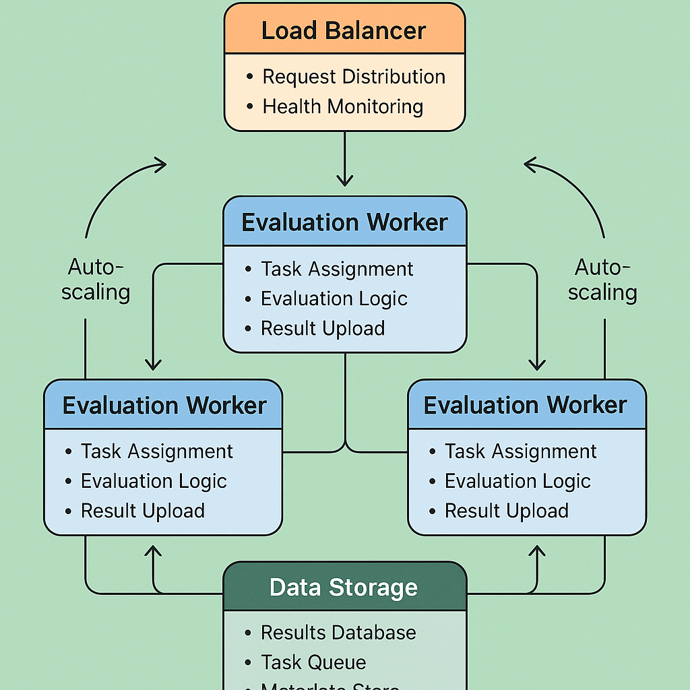

# Scalability and Performance: Building Enterprise-Scale Evaluation Systems



## Introduction: The Imperative of Scale in AI Evaluation

The transition from prototype AI evaluation systems to enterprise-scale production deployments requires fundamental architectural changes that address the challenges of massive scale, diverse workloads, and stringent performance requirements. Traditional evaluation approaches that work effectively for small-scale testing often fail catastrophically when applied to enterprise environments with thousands of daily evaluations, complex multi-model systems, and demanding latency requirements.

Scalability and performance optimization in AI evaluation systems encompasses multiple dimensions including computational efficiency, memory management, network optimization, storage scalability, and intelligent resource allocation. The strategic importance of scalable evaluation systems extends beyond technical requirements to include business continuity, cost management, and competitive advantage through faster iteration cycles and more comprehensive evaluation coverage.

The business impact of implementing scalable evaluation architectures includes significant cost reductions through efficient resource utilization, enhanced system reliability through robust infrastructure design, improved development velocity through faster evaluation cycles, and increased evaluation coverage through parallel processing capabilities. Organizations that successfully implement scalable evaluation systems gain competitive advantages through more comprehensive testing capabilities and faster time-to-market for AI improvements.

The technical challenges of building scalable evaluation systems require sophisticated approaches to distributed computing, load balancing, caching strategies, and performance monitoring that ensure consistent performance across diverse workloads while maintaining evaluation accuracy and reliability.

## Distributed Architecture Patterns

### Microservices-Based Evaluation Systems

The foundation of scalable AI evaluation lies in microservices architectures that decompose monolithic evaluation systems into independent, scalable services that can be developed, deployed, and scaled independently. Microservices-based evaluation systems provide the flexibility and scalability required for enterprise-scale evaluation workloads while enabling efficient resource utilization and fault isolation.

The design of effective microservices architectures requires careful consideration of service boundaries, communication patterns, data consistency requirements, and deployment strategies that optimize both performance and maintainability. The most successful microservices implementations balance service granularity with operational complexity, ensuring that services are sufficiently independent while maintaining efficient inter-service communication.

**Service Decomposition Strategies** provide systematic approaches to breaking down evaluation functionality into independent services that can be scaled and managed separately while maintaining coherent evaluation workflows.

The implementation of effective service decomposition requires domain expertise, architectural analysis, and careful consideration of service dependencies and communication patterns that optimize both performance and maintainability.

*Evaluation Engine Services* provide core evaluation capabilities including LLM-as-a-Judge functionality, traditional metric calculation, and specialized evaluation algorithms that can be scaled independently based on demand patterns.

The development of evaluation engine services requires sophisticated API design, load balancing capabilities, and state management strategies that enable efficient scaling while maintaining evaluation consistency.

*Data Management Services* handle evaluation data storage, retrieval, and processing, providing scalable data access patterns that support high-throughput evaluation workloads while maintaining data consistency and reliability.

The implementation of data management services requires sophisticated database design, caching strategies, and data partitioning approaches that optimize performance across diverse access patterns.

*Orchestration Services* coordinate complex evaluation workflows, manage resource allocation, and provide workflow scheduling capabilities that enable efficient execution of large-scale evaluation processes.

The design of orchestration services requires sophisticated workflow management, resource scheduling, and failure handling capabilities that ensure reliable execution of complex evaluation processes.

**Inter-Service Communication Optimization** ensures efficient communication between evaluation services while maintaining loose coupling and fault tolerance that are essential for scalable distributed systems.

The optimization of inter-service communication requires careful consideration of communication patterns, protocol selection, and error handling strategies that minimize latency while maintaining system reliability.

*Asynchronous Messaging Patterns* enable efficient communication between services without blocking operations, providing scalability and fault tolerance through message queuing and event-driven architectures.

The implementation of asynchronous messaging requires sophisticated message broker selection, queue management, and error handling strategies that ensure reliable message delivery while maintaining high throughput.

*API Gateway Implementation* provides centralized access control, load balancing, and protocol translation that simplifies client interactions while enabling efficient service scaling and management.

The development of API gateway implementation requires sophisticated routing algorithms, authentication mechanisms, and monitoring capabilities that optimize performance while maintaining security and reliability.

```python
import asyncio
import aiohttp
import json
import time
import logging
from typing import Dict, List, Any, Optional, Callable
from dataclasses import dataclass, field
from abc import ABC, abstractmethod
from enum import Enum
import uuid
from datetime import datetime, timedelta
import redis
import asyncpg
from concurrent.futures import ThreadPoolExecutor
import multiprocessing as mp
from queue import Queue
import threading
import psutil
import numpy as np

# Configure logging
logging.basicConfig(level=logging.INFO)
logger = logging.getLogger(__name__)

class ServiceType(Enum):
    """Types of evaluation services"""
    EVALUATION_ENGINE = "evaluation_engine"
    DATA_MANAGER = "data_manager"
    ORCHESTRATOR = "orchestrator"
    CACHE_MANAGER = "cache_manager"
    METRICS_COLLECTOR = "metrics_collector"

class WorkloadType(Enum):
    """Types of evaluation workloads"""
    BATCH_EVALUATION = "batch_evaluation"
    REAL_TIME_EVALUATION = "real_time_evaluation"
    STREAMING_EVALUATION = "streaming_evaluation"
    SCHEDULED_EVALUATION = "scheduled_evaluation"

@dataclass
class ServiceConfig:
    """Configuration for evaluation services"""
    service_id: str
    service_type: ServiceType
    host: str = "localhost"
    port: int = 8000
    max_workers: int = 10
    max_concurrent_requests: int = 100
    timeout_seconds: int = 30
    health_check_interval: int = 30
    resource_limits: Dict[str, Any] = field(default_factory=dict)
    scaling_config: Dict[str, Any] = field(default_factory=dict)

@dataclass
class EvaluationRequest:
    """Request for evaluation processing"""
    request_id: str
    workload_type: WorkloadType
    evaluation_config: Dict[str, Any]
    input_data: List[Dict[str, Any]]
    priority: int = 5  # 1-10, higher is more urgent
    timeout_seconds: int = 300
    callback_url: Optional[str] = None
    metadata: Dict[str, Any] = field(default_factory=dict)

@dataclass
class EvaluationResponse:
    """Response from evaluation processing"""
    request_id: str
    status: str  # 'success', 'failure', 'partial'
    results: List[Dict[str, Any]] = field(default_factory=list)
    metrics: Dict[str, float] = field(default_factory=dict)
    processing_time: float = 0.0
    error_message: str = ""
    metadata: Dict[str, Any] = field(default_factory=dict)

class ServiceRegistry:
    """Registry for managing service discovery and health"""
    
    def __init__(self, redis_url: str = "redis://localhost:6379"):
        self.redis_client = redis.from_url(redis_url)
        self.services: Dict[str, ServiceConfig] = {}
        self.health_status: Dict[str, Dict[str, Any]] = {}
        
    async def register_service(self, config: ServiceConfig):
        """Register a service in the registry"""
        self.services[config.service_id] = config
        
        # Store in Redis for distributed access
        service_data = {
            'service_id': config.service_id,
            'service_type': config.service_type.value,
            'host': config.host,
            'port': config.port,
            'max_workers': config.max_workers,
            'registered_at': datetime.now().isoformat()
        }
        
        self.redis_client.hset(
            f"service:{config.service_id}",
            mapping=service_data
        )
        
        # Add to service type index
        self.redis_client.sadd(
            f"services:{config.service_type.value}",
            config.service_id
        )
        
        logger.info(f"Registered service {config.service_id} ({config.service_type.value})")
    
    async def unregister_service(self, service_id: str):
        """Unregister a service from the registry"""
        if service_id in self.services:
            config = self.services[service_id]
            
            # Remove from Redis
            self.redis_client.delete(f"service:{service_id}")
            self.redis_client.srem(f"services:{config.service_type.value}", service_id)
            
            # Remove from local registry
            del self.services[service_id]
            if service_id in self.health_status:
                del self.health_status[service_id]
            
            logger.info(f"Unregistered service {service_id}")
    
    async def discover_services(self, service_type: ServiceType) -> List[ServiceConfig]:
        """Discover available services of a specific type"""
        service_ids = self.redis_client.smembers(f"services:{service_type.value}")
        
        available_services = []
        for service_id in service_ids:
            service_data = self.redis_client.hgetall(f"service:{service_id.decode()}")
            if service_data:
                # Check health status
                if self._is_service_healthy(service_id.decode()):
                    config = ServiceConfig(
                        service_id=service_data[b'service_id'].decode(),
                        service_type=ServiceType(service_data[b'service_type'].decode()),
                        host=service_data[b'host'].decode(),
                        port=int(service_data[b'port']),
                        max_workers=int(service_data[b'max_workers'])
                    )
                    available_services.append(config)
        
        return available_services
    
    def _is_service_healthy(self, service_id: str) -> bool:
        """Check if a service is healthy"""
        health_data = self.redis_client.hgetall(f"health:{service_id}")
        if not health_data:
            return False
        
        last_heartbeat = datetime.fromisoformat(health_data[b'last_heartbeat'].decode())
        return (datetime.now() - last_heartbeat).total_seconds() < 60
    
    async def update_health_status(self, service_id: str, status: Dict[str, Any]):
        """Update health status for a service"""
        status['last_heartbeat'] = datetime.now().isoformat()
        self.health_status[service_id] = status
        
        # Store in Redis
        self.redis_client.hset(f"health:{service_id}", mapping=status)

class LoadBalancer:
    """Load balancer for distributing requests across services"""
    
    def __init__(self, service_registry: ServiceRegistry):
        self.service_registry = service_registry
        self.request_counts: Dict[str, int] = {}
        self.response_times: Dict[str, List[float]] = {}
        
    async def select_service(self, service_type: ServiceType, 
                           request: EvaluationRequest) -> Optional[ServiceConfig]:
        """Select the best service for handling a request"""
        
        available_services = await self.service_registry.discover_services(service_type)
        
        if not available_services:
            return None
        
        # Use weighted round-robin with performance metrics
        best_service = None
        best_score = float('inf')
        
        for service in available_services:
            score = self._calculate_service_score(service, request)
            if score < best_score:
                best_score = score
                best_service = service
        
        return best_service
    
    def _calculate_service_score(self, service: ServiceConfig, 
                               request: EvaluationRequest) -> float:
        """Calculate a score for service selection (lower is better)"""
        
        service_id = service.service_id
        
        # Base score from current load
        current_load = self.request_counts.get(service_id, 0)
        load_score = current_load / service.max_concurrent_requests
        
        # Performance score from response times
        recent_times = self.response_times.get(service_id, [])
        if recent_times:
            avg_response_time = sum(recent_times[-10:]) / len(recent_times[-10:])
            performance_score = avg_response_time / 1000  # Normalize to seconds
        else:
            performance_score = 0.5  # Default for new services
        
        # Priority adjustment
        priority_weight = (11 - request.priority) / 10  # Higher priority = lower weight
        
        # Combine scores
        total_score = (load_score * 0.4 + performance_score * 0.4) * priority_weight
        
        return total_score
    
    async def record_request_start(self, service_id: str):
        """Record the start of a request to a service"""
        self.request_counts[service_id] = self.request_counts.get(service_id, 0) + 1
    
    async def record_request_end(self, service_id: str, response_time: float):
        """Record the completion of a request to a service"""
        self.request_counts[service_id] = max(0, self.request_counts.get(service_id, 1) - 1)
        
        if service_id not in self.response_times:
            self.response_times[service_id] = []
        
        self.response_times[service_id].append(response_time)
        
        # Keep only recent response times
        if len(self.response_times[service_id]) > 100:
            self.response_times[service_id] = self.response_times[service_id][-50:]

class EvaluationService(ABC):
    """Abstract base class for evaluation services"""
    
    def __init__(self, config: ServiceConfig, service_registry: ServiceRegistry):
        self.config = config
        self.service_registry = service_registry
        self.is_running = False
        self.request_queue = asyncio.Queue(maxsize=config.max_concurrent_requests)
        self.worker_pool = ThreadPoolExecutor(max_workers=config.max_workers)
        
    async def start(self):
        """Start the evaluation service"""
        await self.service_registry.register_service(self.config)
        self.is_running = True
        
        # Start health check task
        asyncio.create_task(self._health_check_loop())
        
        # Start request processing
        asyncio.create_task(self._process_requests())
        
        logger.info(f"Started {self.config.service_type.value} service {self.config.service_id}")
    
    async def stop(self):
        """Stop the evaluation service"""
        self.is_running = False
        await self.service_registry.unregister_service(self.config.service_id)
        self.worker_pool.shutdown(wait=True)
        
        logger.info(f"Stopped service {self.config.service_id}")
    
    async def submit_request(self, request: EvaluationRequest) -> str:
        """Submit a request for processing"""
        try:
            await self.request_queue.put(request)
            return f"Request {request.request_id} queued successfully"
        except asyncio.QueueFull:
            raise Exception("Service is at capacity")
    
    @abstractmethod
    async def process_request(self, request: EvaluationRequest) -> EvaluationResponse:
        """Process an evaluation request"""
        pass
    
    async def _process_requests(self):
        """Main request processing loop"""
        while self.is_running:
            try:
                # Get request from queue
                request = await asyncio.wait_for(self.request_queue.get(), timeout=1.0)
                
                # Process request asynchronously
                asyncio.create_task(self._handle_request(request))
                
            except asyncio.TimeoutError:
                continue
            except Exception as e:
                logger.error(f"Error in request processing loop: {str(e)}")
    
    async def _handle_request(self, request: EvaluationRequest):
        """Handle a single request"""
        start_time = time.time()
        
        try:
            # Process the request
            response = await self.process_request(request)
            response.processing_time = time.time() - start_time
            
            # Send response if callback URL provided
            if request.callback_url:
                await self._send_callback(request.callback_url, response)
            
        except Exception as e:
            logger.error(f"Error processing request {request.request_id}: {str(e)}")
            
            # Create error response
            error_response = EvaluationResponse(
                request_id=request.request_id,
                status='failure',
                error_message=str(e),
                processing_time=time.time() - start_time
            )
            
            if request.callback_url:
                await self._send_callback(request.callback_url, error_response)
    
    async def _send_callback(self, callback_url: str, response: EvaluationResponse):
        """Send response to callback URL"""
        try:
            async with aiohttp.ClientSession() as session:
                async with session.post(
                    callback_url,
                    json=response.__dict__,
                    timeout=aiohttp.ClientTimeout(total=10)
                ) as resp:
                    if resp.status != 200:
                        logger.warning(f"Callback failed with status {resp.status}")
        except Exception as e:
            logger.error(f"Error sending callback: {str(e)}")
    
    async def _health_check_loop(self):
        """Periodic health check reporting"""
        while self.is_running:
            try:
                # Collect health metrics
                health_status = {
                    'service_id': self.config.service_id,
                    'status': 'healthy' if self.is_running else 'unhealthy',
                    'queue_size': self.request_queue.qsize(),
                    'max_queue_size': self.request_queue.maxsize,
                    'cpu_percent': psutil.cpu_percent(),
                    'memory_percent': psutil.virtual_memory().percent,
                    'active_workers': self.worker_pool._threads,
                    'max_workers': self.config.max_workers
                }
                
                # Update health status in registry
                await self.service_registry.update_health_status(
                    self.config.service_id, health_status
                )
                
                # Wait for next health check
                await asyncio.sleep(self.config.health_check_interval)
                
            except Exception as e:
                logger.error(f"Error in health check: {str(e)}")
                await asyncio.sleep(5)

class EvaluationEngineService(EvaluationService):
    """Service for running AI evaluations"""
    
    def __init__(self, config: ServiceConfig, service_registry: ServiceRegistry,
                 evaluation_framework=None):
        super().__init__(config, service_registry)
        self.evaluation_framework = evaluation_framework
    
    async def process_request(self, request: EvaluationRequest) -> EvaluationResponse:
        """Process an evaluation request"""
        
        try:
            results = []
            
            # Process each input item
            for i, input_item in enumerate(request.input_data):
                try:
                    if self.evaluation_framework:
                        # Use provided evaluation framework
                        eval_result = await self.evaluation_framework.evaluate_single(
                            input_text=input_item.get('input', ''),
                            criteria=request.evaluation_config.get('criteria', 'accuracy'),
                            reference_text=input_item.get('reference', '')
                        )
                        
                        result = {
                            'item_id': input_item.get('id', f'item_{i}'),
                            'evaluation_result': eval_result,
                            'status': 'success'
                        }
                    else:
                        # Mock evaluation
                        result = {
                            'item_id': input_item.get('id', f'item_{i}'),
                            'evaluation_result': {
                                'score': np.random.uniform(6, 9),
                                'criteria': request.evaluation_config.get('criteria', 'accuracy')
                            },
                            'status': 'success'
                        }
                    
                    results.append(result)
                    
                except Exception as e:
                    logger.error(f"Error evaluating item {i}: {str(e)}")
                    results.append({
                        'item_id': input_item.get('id', f'item_{i}'),
                        'status': 'error',
                        'error_message': str(e)
                    })
            
            # Calculate metrics
            successful_results = [r for r in results if r['status'] == 'success']
            metrics = {
                'total_items': len(request.input_data),
                'successful_evaluations': len(successful_results),
                'error_count': len(results) - len(successful_results),
                'success_rate': len(successful_results) / len(request.input_data) if request.input_data else 0
            }
            
            if successful_results:
                scores = [r['evaluation_result']['score'] for r in successful_results if 'score' in r['evaluation_result']]
                if scores:
                    metrics['average_score'] = sum(scores) / len(scores)
                    metrics['min_score'] = min(scores)
                    metrics['max_score'] = max(scores)
            
            return EvaluationResponse(
                request_id=request.request_id,
                status='success' if len(successful_results) == len(request.input_data) else 'partial',
                results=results,
                metrics=metrics
            )
            
        except Exception as e:
            logger.error(f"Error processing evaluation request: {str(e)}")
            return EvaluationResponse(
                request_id=request.request_id,
                status='failure',
                error_message=str(e)
            )

class OrchestratorService(EvaluationService):
    """Service for orchestrating complex evaluation workflows"""
    
    def __init__(self, config: ServiceConfig, service_registry: ServiceRegistry,
                 load_balancer: LoadBalancer):
        super().__init__(config, service_registry)
        self.load_balancer = load_balancer
    
    async def process_request(self, request: EvaluationRequest) -> EvaluationResponse:
        """Process an orchestration request"""
        
        try:
            # For batch requests, split into smaller chunks
            if request.workload_type == WorkloadType.BATCH_EVALUATION:
                return await self._process_batch_request(request)
            else:
                return await self._process_single_request(request)
                
        except Exception as e:
            logger.error(f"Error in orchestration: {str(e)}")
            return EvaluationResponse(
                request_id=request.request_id,
                status='failure',
                error_message=str(e)
            )
    
    async def _process_batch_request(self, request: EvaluationRequest) -> EvaluationResponse:
        """Process a batch evaluation request"""
        
        # Split input data into chunks
        chunk_size = 10  # Configurable
        chunks = [
            request.input_data[i:i + chunk_size]
            for i in range(0, len(request.input_data), chunk_size)
        ]
        
        # Process chunks in parallel
        chunk_tasks = []
        for i, chunk in enumerate(chunks):
            chunk_request = EvaluationRequest(
                request_id=f"{request.request_id}_chunk_{i}",
                workload_type=WorkloadType.REAL_TIME_EVALUATION,
                evaluation_config=request.evaluation_config,
                input_data=chunk,
                priority=request.priority
            )
            
            task = asyncio.create_task(self._process_single_request(chunk_request))
            chunk_tasks.append(task)
        
        # Wait for all chunks to complete
        chunk_responses = await asyncio.gather(*chunk_tasks, return_exceptions=True)
        
        # Aggregate results
        all_results = []
        all_metrics = {}
        
        for response in chunk_responses:
            if isinstance(response, EvaluationResponse):
                all_results.extend(response.results)
                
                # Aggregate metrics
                for key, value in response.metrics.items():
                    if key not in all_metrics:
                        all_metrics[key] = []
                    all_metrics[key].append(value)
        
        # Calculate final metrics
        final_metrics = {}
        for key, values in all_metrics.items():
            if values:
                if key.endswith('_count') or key == 'total_items':
                    final_metrics[key] = sum(values)
                else:
                    final_metrics[key] = sum(values) / len(values)
        
        return EvaluationResponse(
            request_id=request.request_id,
            status='success',
            results=all_results,
            metrics=final_metrics
        )
    
    async def _process_single_request(self, request: EvaluationRequest) -> EvaluationResponse:
        """Process a single evaluation request"""
        
        # Select appropriate evaluation service
        service = await self.load_balancer.select_service(
            ServiceType.EVALUATION_ENGINE, request
        )
        
        if not service:
            raise Exception("No evaluation services available")
        
        # Forward request to selected service
        service_url = f"http://{service.host}:{service.port}/evaluate"
        
        start_time = time.time()
        await self.load_balancer.record_request_start(service.service_id)
        
        try:
            async with aiohttp.ClientSession() as session:
                async with session.post(
                    service_url,
                    json=request.__dict__,
                    timeout=aiohttp.ClientTimeout(total=request.timeout_seconds)
                ) as resp:
                    if resp.status == 200:
                        response_data = await resp.json()
                        response = EvaluationResponse(**response_data)
                    else:
                        raise Exception(f"Service returned status {resp.status}")
            
            response_time = time.time() - start_time
            await self.load_balancer.record_request_end(service.service_id, response_time)
            
            return response
            
        except Exception as e:
            response_time = time.time() - start_time
            await self.load_balancer.record_request_end(service.service_id, response_time)
            raise e

# Example usage and demonstration
async def demonstrate_scalable_architecture():
    """Demonstrate scalable evaluation architecture"""
    
    print("=== Scalable Evaluation Architecture Demonstration ===")
    
    # Initialize service registry
    service_registry = ServiceRegistry()
    load_balancer = LoadBalancer(service_registry)
    
    # Create evaluation engine services
    engine_configs = [
        ServiceConfig(
            service_id="eval_engine_1",
            service_type=ServiceType.EVALUATION_ENGINE,
            host="localhost",
            port=8001,
            max_workers=5,
            max_concurrent_requests=50
        ),
        ServiceConfig(
            service_id="eval_engine_2",
            service_type=ServiceType.EVALUATION_ENGINE,
            host="localhost",
            port=8002,
            max_workers=5,
            max_concurrent_requests=50
        )
    ]
    
    # Create orchestrator service
    orchestrator_config = ServiceConfig(
        service_id="orchestrator_1",
        service_type=ServiceType.ORCHESTRATOR,
        host="localhost",
        port=8000,
        max_workers=10,
        max_concurrent_requests=100
    )
    
    # Start services
    services = []
    
    for config in engine_configs:
        service = EvaluationEngineService(config, service_registry)
        await service.start()
        services.append(service)
    
    orchestrator = OrchestratorService(orchestrator_config, service_registry, load_balancer)
    await orchestrator.start()
    services.append(orchestrator)
    
    # Wait for services to register
    await asyncio.sleep(2)
    
    # Create test request
    test_request = EvaluationRequest(
        request_id=str(uuid.uuid4()),
        workload_type=WorkloadType.BATCH_EVALUATION,
        evaluation_config={'criteria': 'accuracy'},
        input_data=[
            {'id': f'test_{i}', 'input': f'Test input {i}', 'reference': f'Expected output {i}'}
            for i in range(25)  # Large batch to demonstrate chunking
        ],
        priority=7
    )
    
    print(f"Submitting batch request with {len(test_request.input_data)} items")
    
    # Process request through orchestrator
    start_time = time.time()
    response = await orchestrator.process_request(test_request)
    processing_time = time.time() - start_time
    
    print(f"\n=== Results ===")
    print(f"Status: {response.status}")
    print(f"Processing time: {processing_time:.2f} seconds")
    print(f"Results count: {len(response.results)}")
    print(f"Metrics: {response.metrics}")
    
    # Check service health
    print(f"\n=== Service Health ===")
    for service_config in engine_configs + [orchestrator_config]:
        health = service_registry.health_status.get(service_config.service_id, {})
        print(f"{service_config.service_id}: {health.get('status', 'unknown')}")
        print(f"  Queue: {health.get('queue_size', 0)}/{health.get('max_queue_size', 0)}")
        print(f"  CPU: {health.get('cpu_percent', 0):.1f}%")
        print(f"  Memory: {health.get('memory_percent', 0):.1f}%")
    
    # Cleanup
    for service in services:
        await service.stop()

if __name__ == "__main__":
    # Note: This requires Redis to be running
    # asyncio.run(demonstrate_scalable_architecture())
    print("Scalable architecture framework loaded. Start Redis server to run demonstration.")
```

### Container Orchestration and Auto-Scaling

The deployment of scalable evaluation systems requires sophisticated container orchestration and auto-scaling capabilities that can dynamically adjust resources based on workload demands while maintaining service availability and performance. Container orchestration provides the foundation for elastic scaling, efficient resource utilization, and reliable service deployment across diverse infrastructure environments.

**Kubernetes-Based Deployment** provides robust container orchestration capabilities that enable automatic scaling, load balancing, and fault tolerance for evaluation services while simplifying deployment and management across diverse infrastructure environments.

The implementation of Kubernetes-based deployment requires sophisticated configuration management, resource allocation strategies, and monitoring capabilities that optimize performance while maintaining cost efficiency.

*Horizontal Pod Autoscaling* automatically adjusts the number of service instances based on CPU utilization, memory usage, and custom metrics such as queue depth and response times, ensuring optimal resource allocation.

The development of horizontal pod autoscaling requires careful metric selection, scaling policies, and performance monitoring that balance responsiveness with stability to avoid oscillating scaling behavior.

*Vertical Pod Autoscaling* optimizes resource allocation for individual service instances by automatically adjusting CPU and memory limits based on actual usage patterns and performance requirements.

The implementation of vertical pod autoscaling requires sophisticated resource monitoring, performance analysis, and resource adjustment algorithms that optimize efficiency while maintaining service reliability.

**Service Mesh Integration** provides advanced networking capabilities including traffic management, security, and observability that enhance the reliability and performance of distributed evaluation systems.

The integration of service mesh technologies requires careful configuration of traffic policies, security settings, and monitoring capabilities that optimize performance while maintaining security and reliability.

*Traffic Management and Load Balancing* enables sophisticated routing strategies, circuit breaking, and failover capabilities that ensure reliable service communication even during high load or partial system failures.

The implementation of traffic management requires sophisticated routing algorithms, health checking mechanisms, and failover strategies that maintain service availability while optimizing performance.

*Security and Authentication* provides comprehensive security capabilities including mutual TLS, authentication, and authorization that protect evaluation systems while maintaining performance and usability.

The development of security and authentication requires careful consideration of security requirements, performance impact, and operational complexity to ensure comprehensive protection without impeding system functionality.

## Performance Monitoring and Optimization

### Comprehensive Metrics Collection

The optimization of scalable evaluation systems requires comprehensive metrics collection and analysis capabilities that provide visibility into system performance, resource utilization, and bottlenecks that impact evaluation efficiency. Performance monitoring provides the foundation for continuous optimization and proactive problem resolution.

**Multi-Dimensional Performance Metrics** provide comprehensive visibility into system performance across multiple dimensions including throughput, latency, resource utilization, and error rates that enable effective performance optimization.

The implementation of multi-dimensional performance metrics requires sophisticated monitoring infrastructure, data collection strategies, and analysis capabilities that provide actionable insights into system performance.

*Throughput and Latency Monitoring* tracks evaluation processing rates and response times across different service components, enabling identification of bottlenecks and optimization opportunities.

The development of throughput and latency monitoring requires sophisticated instrumentation, data aggregation, and analysis capabilities that provide real-time visibility into system performance.

*Resource Utilization Tracking* monitors CPU, memory, network, and storage utilization across evaluation services, enabling efficient resource allocation and capacity planning.

The implementation of resource utilization tracking requires comprehensive monitoring infrastructure, data collection strategies, and analysis capabilities that optimize resource efficiency while maintaining performance.

*Error Rate and Quality Monitoring* tracks evaluation errors, quality metrics, and system reliability indicators that ensure evaluation accuracy while maintaining system availability.

The development of error rate and quality monitoring requires sophisticated error classification, quality assessment, and alerting capabilities that enable proactive problem resolution.

**Real-Time Performance Dashboards** provide comprehensive visualization of system performance metrics, enabling rapid identification of performance issues and optimization opportunities.

The creation of real-time performance dashboards requires sophisticated data visualization, alerting capabilities, and user interface design that enable effective performance monitoring and management.

*Operational Dashboards* provide real-time visibility into system health, performance metrics, and operational status that enable effective system management and problem resolution.

The development of operational dashboards requires careful consideration of information architecture, visualization design, and alerting strategies that optimize operational effectiveness.

*Business Intelligence Dashboards* provide strategic visibility into evaluation system performance, cost efficiency, and business impact that enable informed decision-making and strategic planning.

The implementation of business intelligence dashboards requires sophisticated data analysis, reporting capabilities, and strategic metrics that align technical performance with business objectives.

## Resource Optimization Strategies

### Intelligent Resource Allocation

The efficiency of scalable evaluation systems depends critically on intelligent resource allocation strategies that optimize computational resources while maintaining evaluation quality and system reliability. Resource optimization requires sophisticated approaches to workload analysis, resource scheduling, and performance optimization.

**Dynamic Resource Scheduling** provides adaptive resource allocation that adjusts computational resources based on workload characteristics, priority levels, and resource availability to optimize system efficiency.

The implementation of dynamic resource scheduling requires sophisticated workload analysis, resource modeling, and scheduling algorithms that balance efficiency with fairness and reliability.

*Workload-Aware Scheduling* analyzes evaluation workload characteristics and resource requirements to optimize resource allocation and minimize processing times while maintaining quality standards.

The development of workload-aware scheduling requires machine learning capabilities, workload characterization, and optimization algorithms that can efficiently match workloads with appropriate resources.

*Priority-Based Resource Allocation* ensures that high-priority evaluation tasks receive appropriate resources while maintaining fair resource distribution across different workload types and users.

The implementation of priority-based resource allocation requires sophisticated priority management, resource reservation, and fairness algorithms that balance competing resource demands.

**Cost-Performance Optimization** balances evaluation quality with computational costs through intelligent resource selection, optimization strategies, and cost-aware scheduling that minimize expenses while maintaining performance standards.

The development of cost-performance optimization requires sophisticated cost modeling, performance analysis, and optimization algorithms that achieve optimal cost-efficiency ratios.

*Multi-Cloud Resource Management* leverages multiple cloud providers and resource types to optimize cost and performance while maintaining reliability and avoiding vendor lock-in.

The implementation of multi-cloud resource management requires sophisticated resource comparison, cost analysis, and orchestration capabilities that optimize resource selection across diverse cloud environments.

*Spot Instance Optimization* utilizes low-cost spot instances and preemptible resources for non-critical evaluation workloads while maintaining reliability through intelligent failover and checkpointing strategies.

The development of spot instance optimization requires sophisticated cost analysis, reliability modeling, and failover strategies that maximize cost savings while maintaining acceptable reliability levels.

## Conclusion: Building the Future of Scalable AI Evaluation

Scalability and performance optimization represent critical capabilities for enterprise-scale AI evaluation systems that must handle massive workloads while maintaining high reliability and cost efficiency. The comprehensive framework presented in this section provides the foundation for implementing production-ready scalable evaluation systems that can grow with organizational needs while maintaining optimal performance.

The combination of distributed architecture patterns, container orchestration, and intelligent resource allocation creates evaluation systems that can efficiently handle diverse workloads while providing the flexibility and reliability required for enterprise environments.

The emphasis on performance monitoring and optimization ensures that scalable evaluation systems maintain optimal performance over time while providing the visibility and control necessary for effective system management and continuous improvement.

As evaluation workloads continue to grow and AI systems become more complex, scalable evaluation architectures will become increasingly important, providing the foundation for comprehensive, efficient, and reliable AI system evaluation at enterprise scale.

---

**Next**: [Section 5: Cost Optimization and Monitoring →](05-cost-optimization-monitoring.md)

