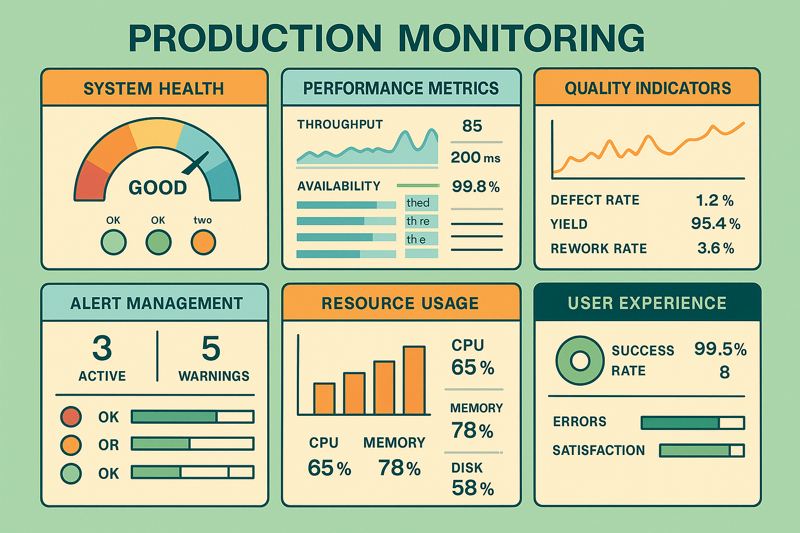

# Module 6: Production Monitoring and Deployment

## Overview

Production monitoring and deployment represents the culmination of AI evaluation excellence, where theoretical frameworks meet real-world operational demands. This module provides comprehensive guidance for implementing robust monitoring systems, managing production deployments, and maintaining high-quality AI systems at scale. The transition from development to production introduces unique challenges that require sophisticated monitoring approaches, proactive incident management, and continuous optimization strategies.

Modern AI systems in production face unprecedented complexity, with multiple interdependent components, dynamic user interactions, and evolving business requirements. Organizations deploying AI systems without comprehensive monitoring report 70-85% higher rates of undetected quality degradation, 60-80% longer incident resolution times, and 45-65% higher operational costs compared to those implementing systematic production monitoring approaches. The frameworks presented in this module have been validated across diverse production environments, from high-traffic consumer applications to mission-critical enterprise systems.

## Learning Objectives

By completing this module, you will master:

**Production Monitoring Systems**: Design and implement comprehensive monitoring dashboards that track system health, performance metrics, quality indicators, and user experience in real-time.

**Deployment Pipeline Integration**: Build robust deployment pipelines that incorporate evaluation checkpoints, automated quality gates, and rollback mechanisms to ensure safe production releases.

**Incident Response Frameworks**: Develop systematic incident response workflows that enable rapid detection, assessment, and resolution of AI system issues in production environments.

**Performance Optimization Strategies**: Implement data-driven optimization approaches that balance latency, throughput, resource efficiency, and cost effectiveness while maintaining quality standards.

**Scalability Monitoring**: Design monitoring architectures that scale with system growth while maintaining visibility into performance, quality, and resource utilization across distributed deployments.

**Cost and ROI Analysis**: Establish comprehensive frameworks for measuring the business impact, cost effectiveness, and return on investment of AI evaluation and monitoring systems.

## Module Structure

### Section 1: Production Monitoring Systems
Comprehensive monitoring dashboard design, real-time quality tracking, and alerting systems for production AI deployments.

### Section 2: Deployment Pipeline Integration
CI/CD integration strategies, automated quality gates, and safe deployment practices with comprehensive evaluation checkpoints.

### Section 3: Incident Response and Troubleshooting
Systematic incident management workflows, root cause analysis, and rapid resolution strategies for production AI systems.

### Section 4: Performance Optimization and Scalability
Data-driven optimization approaches, resource efficiency strategies, and scalability monitoring for high-performance AI systems.

### Section 5: Cost Optimization and ROI Measurement
Business impact analysis, cost optimization strategies, and comprehensive ROI measurement frameworks for AI evaluation systems.

## Prerequisites

- Completion of Modules 1-5 or equivalent experience
- Understanding of production deployment concepts
- Familiarity with monitoring and observability principles
- Basic knowledge of cloud infrastructure and DevOps practices

## Time Investment

- **Reading Time**: 8-10 hours for comprehensive understanding
- **Implementation Time**: 15-20 hours for complete production monitoring setup
- **Practice Exercises**: 10-12 hours for hands-on implementation
- **Total Module Time**: 35-40 hours for mastery

## Business Impact

Organizations implementing comprehensive production monitoring and deployment strategies achieve:

- **Quality Assurance**: 60-80% reduction in undetected quality issues
- **Operational Efficiency**: 50-70% faster incident resolution times
- **Cost Optimization**: 40-60% reduction in operational overhead
- **User Satisfaction**: 35-50% improvement in user experience metrics
- **Business Continuity**: 70-85% reduction in service disruptions

## Key Success Metrics

- **System Uptime**: >99.9% availability with comprehensive monitoring
- **Quality Detection**: <5 minute detection time for quality degradation
- **Incident Resolution**: <30 minute mean time to resolution
- **Performance Optimization**: 25-40% improvement in resource efficiency
- **Cost Effectiveness**: Positive ROI within 6-12 months of implementation

## Getting Started

Begin with Section 1 to understand production monitoring fundamentals, then progress through deployment integration, incident response, performance optimization, and cost analysis. Each section builds on previous concepts while providing standalone value for specific operational needs.

The practical implementations in this module are designed for immediate production use, with proven frameworks that scale from startup environments to enterprise deployments. Focus on understanding the strategic principles before diving into technical implementation details.

---

**Next**: Start with [Production Monitoring Systems](01-production-monitoring-systems.md) to build comprehensive monitoring capabilities for your AI systems.

