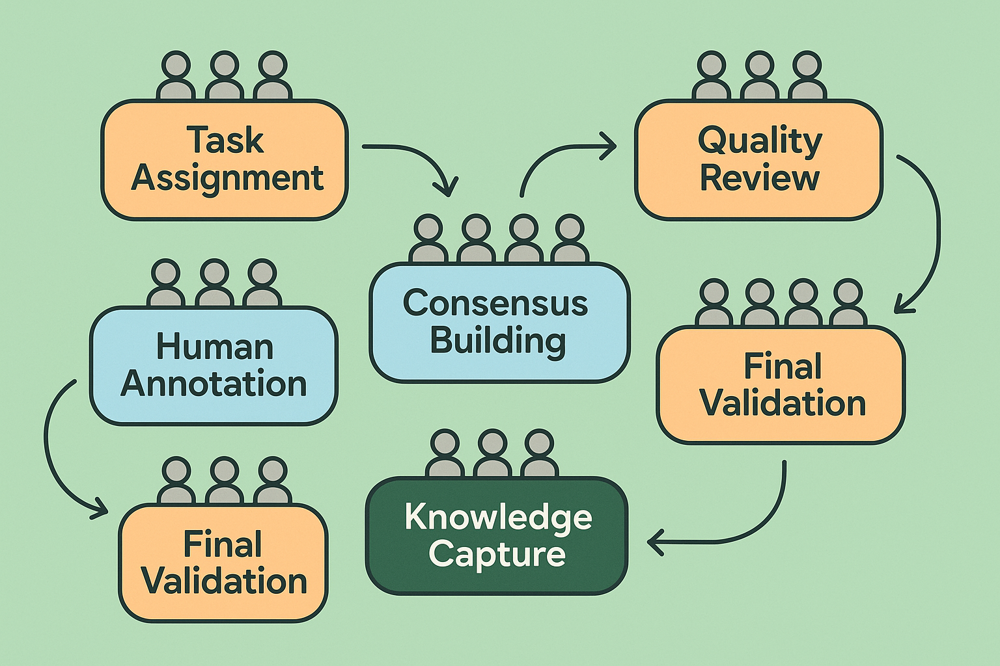

# Human-in-the-Loop Evaluation Systems: Building Effective Human-AI Collaboration

## Introduction

Human-in-the-loop (HITL) evaluation systems represent the gold standard for AI quality assessment, combining the scalability of automated processes with the nuanced judgment that only human expertise can provide. These systems are not merely about adding humans to automated workflows; they require careful design of collaborative processes that maximize the unique strengths of both human and machine intelligence while mitigating their respective limitations.

The evolution of AI systems has made human evaluation more critical, not less. As AI capabilities advance and applications become more sophisticated, the need for nuanced, contextual evaluation grows exponentially. Modern AI systems operate in complex domains where success cannot be measured by simple metrics alone. They require evaluation that considers cultural context, ethical implications, user experience, and business impact—areas where human judgment remains irreplaceable.

Consider the challenge facing a major technology company deploying a customer service chatbot across multiple markets. Automated metrics might show high task completion rates and low response times, but human evaluators discover that the bot's responses, while technically correct, feel impersonal and fail to address the emotional needs of frustrated customers. This insight, impossible to capture through automated evaluation alone, leads to significant improvements in customer satisfaction and business outcomes.

## The Strategic Imperative for Human-Centered Evaluation

The business case for human-in-the-loop evaluation extends far beyond quality assurance. Organizations that invest in sophisticated collaborative evaluation practices gain significant competitive advantages through superior product quality, reduced risk exposure, and accelerated innovation cycles.

Research from leading technology companies demonstrates that human evaluation identifies critical issues missed by automated systems in 40-60% of cases, depending on the domain and application complexity. These issues often represent the difference between a product that meets basic functional requirements and one that delivers exceptional user experiences. In competitive markets where user experience differentiation drives market share, this distinction becomes strategically critical.

The financial impact of effective human evaluation manifests across multiple dimensions. Direct cost savings emerge from early identification of issues that would be exponentially more expensive to address post-deployment. A major e-commerce platform reported that human evaluation during development identified personalization algorithm biases that, if deployed, would have resulted in estimated revenue losses of $50 million annually due to reduced customer engagement and increased churn.

Beyond direct cost avoidance, human evaluation drives revenue growth through quality improvements that enhance user satisfaction and engagement. Companies with sophisticated human evaluation practices report 25-40% higher user satisfaction scores and 15-30% lower churn rates compared to those relying primarily on automated evaluation methods.

## Foundational Principles of Effective HITL Systems

Successful human-in-the-loop evaluation systems are built on several foundational principles that distinguish them from ad-hoc human review processes. These principles guide the design of systems that scale effectively while maintaining quality and consistency.

**Principle 1: Complementary Intelligence Design**

The most effective HITL systems are designed around the principle of complementary intelligence, where human and machine capabilities are combined to achieve outcomes neither could accomplish alone. This requires understanding the unique strengths and limitations of both human and automated evaluation.

Human evaluators excel at contextual understanding, subjective quality assessment, edge case identification, and ethical reasoning. They can assess whether an AI system's output is appropriate for a specific cultural context, whether it maintains appropriate tone and empathy, and whether it aligns with broader organizational values and objectives.

Automated systems excel at consistency, scale, objective measurement, and pattern detection across large datasets. They can process thousands of examples per hour, maintain consistent evaluation criteria, and identify statistical patterns that might escape human notice.

Effective HITL systems leverage these complementary strengths through careful workflow design. Automated systems handle initial filtering, consistency checks, and objective measurements, while human evaluators focus on nuanced assessment, edge case analysis, and subjective quality evaluation.

**Principle 2: Systematic Quality Assurance**

Human evaluation introduces variability that must be systematically managed to ensure reliable results. This requires implementing comprehensive quality assurance frameworks that address both individual evaluator performance and overall system consistency.

Quality assurance begins with evaluator selection and training. Effective programs establish clear competency requirements, provide comprehensive training on evaluation criteria and tools, and implement ongoing performance monitoring. Leading organizations report that investing in evaluator training reduces inter-annotator disagreement by 30-50% while improving evaluation quality.

Systematic quality assurance also requires implementing multiple validation layers. These include automated consistency checks, peer review processes, expert validation for complex cases, and statistical monitoring of evaluator performance over time. Organizations with mature HITL systems typically implement 3-5 distinct quality assurance mechanisms to ensure evaluation reliability.

**Principle 3: Scalable Process Design**

HITL systems must be designed to scale efficiently as evaluation requirements grow. This requires careful attention to process design, tool development, and resource allocation strategies that maintain quality while managing costs.

Scalable design begins with modular workflow architecture that allows different evaluation tasks to be distributed across appropriate evaluator skill levels. Simple, objective tasks can be handled by junior evaluators or crowd workers, while complex, subjective assessments require senior experts. This tiered approach optimizes resource utilization while maintaining quality standards.

Technology infrastructure plays a critical role in scalability. Modern HITL systems leverage sophisticated annotation platforms, automated task routing, real-time quality monitoring, and integrated communication tools to maximize evaluator productivity. Organizations report 40-70% improvements in evaluation throughput when transitioning from manual processes to well-designed technological platforms.

## Designing Collaborative Evaluation Workflows

The design of collaborative evaluation workflows represents the core challenge in building effective HITL systems. These workflows must balance multiple competing objectives: quality, speed, cost, consistency, and scalability. Success requires systematic approach to workflow design that considers the entire evaluation lifecycle.

**Workflow Architecture Patterns**

Effective collaborative evaluation workflows typically follow one of several proven architectural patterns, each optimized for different evaluation requirements and organizational constraints.

The **Sequential Review Pattern** involves multiple evaluators reviewing the same content in sequence, with each evaluator building on previous assessments. This pattern works well for complex evaluation tasks requiring multiple perspectives or specialized expertise. For example, a content moderation system might use sequential review where initial evaluators assess basic policy compliance, followed by cultural experts evaluating contextual appropriateness, and finally senior reviewers making final decisions on edge cases.

The **Parallel Assessment Pattern** involves multiple evaluators independently assessing the same content, with results aggregated through statistical methods or consensus-building processes. This pattern provides high reliability through redundancy and works well for subjective evaluation tasks where individual bias might affect results. Research organizations often use parallel assessment for evaluating AI system outputs where ground truth is ambiguous or contested.

The **Hierarchical Escalation Pattern** routes evaluation tasks through multiple tiers based on complexity or confidence levels. Simple cases are handled by junior evaluators or automated systems, while complex cases escalate to senior experts. This pattern optimizes resource utilization while ensuring appropriate expertise is applied to challenging cases.

The **Collaborative Consensus Pattern** brings multiple evaluators together in real-time or asynchronous collaboration to reach consensus on challenging cases. This pattern works well for high-stakes evaluation where accuracy is paramount and the cost of errors is high.

**Task Decomposition Strategies**

Effective workflow design requires careful decomposition of complex evaluation tasks into manageable components that can be efficiently distributed across human and automated systems. This decomposition must consider both the cognitive demands of different evaluation aspects and the practical constraints of human attention and expertise.

Successful task decomposition typically separates objective and subjective evaluation components. Objective components—such as factual accuracy, format compliance, and quantitative measurements—can often be automated or handled by junior evaluators with clear guidelines. Subjective components—such as quality assessment, appropriateness evaluation, and contextual judgment—require more experienced evaluators with domain expertise.

Temporal decomposition separates evaluation tasks that require different types of attention or expertise. For example, initial screening might focus on obvious quality issues or policy violations, while detailed assessment examines nuanced aspects of content quality and appropriateness. This approach allows evaluators to focus their attention effectively while maintaining evaluation thoroughness.

Expertise-based decomposition aligns evaluation tasks with evaluator capabilities and knowledge domains. Technical accuracy assessment might be handled by subject matter experts, while user experience evaluation is conducted by UX specialists, and cultural appropriateness is assessed by cultural experts. This specialization improves evaluation quality while optimizing resource utilization.

## Implementation Framework for HITL Systems

Building effective human-in-the-loop evaluation systems requires a systematic implementation framework that addresses technology infrastructure, process design, human resource management, and quality assurance. This framework provides a roadmap for organizations seeking to establish or improve their collaborative evaluation capabilities.

**Technology Infrastructure Requirements**

Modern HITL systems require sophisticated technology infrastructure that supports efficient human-computer collaboration. This infrastructure must provide intuitive interfaces for human evaluators while maintaining robust backend systems for data management, workflow orchestration, and quality monitoring.

The annotation platform represents the primary interface between human evaluators and the evaluation system. Effective platforms provide customizable interfaces that adapt to different evaluation tasks, support multiple media types, enable real-time collaboration, and integrate with broader evaluation workflows. Leading platforms report that well-designed interfaces improve evaluator productivity by 50-80% compared to basic tools.

Workflow orchestration systems manage the complex logistics of distributing evaluation tasks, tracking progress, managing dependencies, and ensuring quality standards. These systems must handle dynamic task routing based on evaluator availability and expertise, implement quality gates and escalation procedures, and provide real-time visibility into evaluation progress and bottlenecks.

Data management infrastructure ensures secure, reliable storage and processing of evaluation data while maintaining audit trails and supporting analytical requirements. This includes version control for evaluation guidelines, secure storage of sensitive content, and analytical databases for performance monitoring and improvement.

**Process Design and Documentation**

Systematic process design and documentation are essential for maintaining consistency and quality across distributed evaluation teams. This documentation must be comprehensive enough to ensure consistency while remaining practical for day-to-day use.

Evaluation guidelines form the foundation of consistent human evaluation. These guidelines must clearly define evaluation criteria, provide concrete examples of different quality levels, address common edge cases, and establish procedures for handling ambiguous situations. Effective guidelines are developed iteratively through pilot testing and evaluator feedback, with regular updates based on emerging patterns and challenges.

Standard operating procedures (SOPs) define the step-by-step processes evaluators follow for different types of evaluation tasks. These procedures must be detailed enough to ensure consistency while flexible enough to accommodate the variability inherent in human judgment. SOPs typically include task preparation, evaluation execution, quality checking, and result submission procedures.

Training and certification programs ensure evaluators have the knowledge and skills necessary for effective evaluation. These programs must cover evaluation criteria, tool usage, quality standards, and escalation procedures. Leading organizations implement multi-stage certification processes with ongoing performance monitoring and refresher training requirements.

## Quality Assurance and Performance Monitoring

Quality assurance in human-in-the-loop evaluation systems requires multi-layered approaches that address both individual evaluator performance and overall system effectiveness. These approaches must balance the need for quality control with the practical constraints of human evaluation processes.

**Multi-Layer Quality Control**

Effective quality assurance implements multiple validation layers that catch different types of errors and inconsistencies. These layers work together to ensure evaluation reliability while providing feedback for continuous improvement.

Automated consistency checks identify obvious errors and inconsistencies in human evaluation results. These checks can detect impossible combinations of ratings, identify evaluators whose results consistently deviate from statistical norms, and flag cases where evaluation time suggests insufficient attention. While automated checks cannot assess evaluation quality directly, they provide valuable early warning signals for potential issues.

Peer review processes involve experienced evaluators reviewing a sample of each evaluator's work to assess quality and consistency. Effective peer review programs establish clear review criteria, provide structured feedback mechanisms, and track reviewer performance over time. Organizations typically implement peer review for 5-15% of evaluation tasks, with higher rates for new evaluators or complex evaluation domains.

Expert validation involves senior domain experts reviewing challenging or high-stakes evaluation cases to ensure accuracy and appropriateness. This validation typically focuses on edge cases, disputed evaluations, and cases with significant business impact. Expert validation provides the highest quality assurance but is resource-intensive and must be used strategically.

Statistical monitoring tracks evaluator performance patterns over time to identify trends, outliers, and potential issues. This monitoring includes inter-annotator agreement analysis, evaluation time analysis, and quality trend tracking. Statistical monitoring provides objective performance data that supports evaluator feedback and system improvement.

**Performance Measurement and Improvement**

Systematic performance measurement provides the foundation for continuous improvement in HITL evaluation systems. This measurement must capture both efficiency and effectiveness metrics while providing actionable insights for system optimization.

Efficiency metrics track the speed and cost-effectiveness of evaluation processes. Key metrics include evaluation throughput (tasks completed per hour), cost per evaluation, and resource utilization rates. These metrics help optimize workflow design and resource allocation while identifying bottlenecks and inefficiencies.

Effectiveness metrics assess the quality and reliability of evaluation results. Key metrics include inter-annotator agreement rates, expert validation scores, and downstream impact measurements. These metrics provide insights into evaluation quality and guide improvements in training, guidelines, and process design.

Evaluator performance metrics track individual evaluator effectiveness and development needs. These metrics include accuracy scores, consistency ratings, productivity measures, and improvement trends. Individual performance data supports targeted training, performance management, and career development initiatives.

System-level metrics assess overall HITL system performance and business impact. These metrics include evaluation coverage rates, issue detection effectiveness, and business outcome correlations. System-level metrics demonstrate the value of human evaluation investment and guide strategic decisions about evaluation priorities and resource allocation.

## Advanced Collaboration Patterns

As organizations mature their human-in-the-loop evaluation capabilities, they often implement advanced collaboration patterns that leverage collective intelligence and specialized expertise more effectively. These patterns represent the state-of-the-art in collaborative evaluation design.

**Collective Intelligence Frameworks**

Collective intelligence frameworks harness the combined knowledge and judgment of multiple evaluators to achieve evaluation outcomes that exceed what any individual evaluator could accomplish. These frameworks require careful design to avoid common pitfalls such as groupthink, anchoring bias, and coordination overhead.

Wisdom of crowds approaches aggregate independent evaluations from multiple evaluators to produce more reliable results than individual assessments. Research demonstrates that aggregating 5-7 independent evaluations typically produces results with 20-40% lower error rates than individual evaluations, provided evaluators have appropriate expertise and independence is maintained.

Deliberative consensus processes bring evaluators together to discuss challenging cases and reach collective decisions. These processes work well for high-stakes evaluations where accuracy is paramount and the cost of errors is high. Effective deliberative processes require skilled facilitation, structured discussion protocols, and clear decision-making criteria.

Prediction market mechanisms allow evaluators to express confidence in their assessments through market-like mechanisms. These approaches can reveal hidden information and provide more nuanced assessment of evaluation confidence. While still experimental, prediction markets show promise for complex evaluation domains where traditional consensus mechanisms struggle.

**Specialized Expertise Integration**

Advanced HITL systems integrate specialized expertise from multiple domains to provide comprehensive evaluation coverage. This integration requires careful coordination to ensure different perspectives are appropriately weighted and integrated.

Multi-disciplinary evaluation teams bring together experts from different domains to assess AI systems from multiple perspectives. For example, evaluating a medical AI system might involve clinicians, ethicists, user experience experts, and technical specialists. Effective multi-disciplinary evaluation requires clear role definitions, structured communication protocols, and integration mechanisms that synthesize diverse perspectives.

Expert-crowd hybrid models combine the deep expertise of domain specialists with the scale and diversity of crowd evaluation. Experts provide guidance, training, and validation while crowd evaluators handle routine assessment tasks. This hybrid approach can achieve both quality and scale while managing costs effectively.

Dynamic expertise routing automatically directs evaluation tasks to evaluators with appropriate expertise based on task characteristics and evaluator capabilities. Advanced systems use machine learning to optimize task-evaluator matching based on historical performance data and task requirements.

## Case Studies in HITL Implementation

Real-world implementations of human-in-the-loop evaluation systems provide valuable insights into the challenges and opportunities of collaborative evaluation. These case studies demonstrate how different organizations have successfully implemented HITL systems across various domains and scales.

**Case Study 1: Global Social Media Platform**

A major social media platform implemented a comprehensive HITL system for content moderation that processes millions of posts daily while maintaining high accuracy and cultural sensitivity. The system combines automated pre-filtering with human evaluation across multiple tiers of expertise.

The platform's approach uses a hierarchical escalation pattern where automated systems handle clear-cut cases, crowd evaluators assess borderline content, and expert moderators review complex or culturally sensitive cases. This tiered approach processes 95% of content automatically while ensuring human oversight for challenging cases.

Key innovations include dynamic cultural routing that directs content to evaluators familiar with relevant cultural contexts, real-time quality monitoring that identifies and addresses evaluator performance issues, and continuous learning systems that update automated filters based on human evaluation patterns.

Results demonstrate the effectiveness of well-designed HITL systems: the platform achieved 99.2% accuracy in content moderation decisions while reducing evaluation costs by 60% compared to purely human moderation. The system processes over 10 million evaluation tasks daily with average response times under 4 hours for human-reviewed content.

**Case Study 2: Enterprise AI Assistant**

A technology company developing an enterprise AI assistant implemented a sophisticated HITL evaluation system to assess response quality across multiple dimensions including accuracy, helpfulness, appropriateness, and brand alignment. The system supports continuous improvement of the AI assistant through systematic quality assessment.

The company's approach uses parallel assessment patterns where multiple evaluators independently assess AI responses, with results aggregated through statistical methods. Specialized evaluation teams focus on different quality dimensions: technical accuracy, user experience, brand consistency, and ethical considerations.

The evaluation workflow integrates seamlessly with the AI development process, providing real-time feedback to development teams and supporting rapid iteration cycles. Automated quality gates prevent deployment of AI models that don't meet established quality thresholds based on human evaluation results.

Implementation results show significant improvements in AI assistant quality: user satisfaction scores increased by 35%, task completion rates improved by 28%, and customer support escalations decreased by 45%. The HITL evaluation system identified and addressed quality issues that automated testing missed, preventing potential customer experience problems.

**Case Study 3: Healthcare AI Evaluation**

A healthcare organization implemented a HITL evaluation system for AI-assisted diagnostic tools that combines clinical expertise with systematic evaluation processes. The system ensures AI recommendations meet clinical standards while supporting physician decision-making.

The evaluation framework uses multi-disciplinary teams including practicing physicians, medical researchers, and AI specialists. Each AI recommendation undergoes evaluation across multiple dimensions: clinical accuracy, evidence quality, presentation clarity, and integration with clinical workflows.

The system implements sophisticated quality assurance including blind evaluation protocols, expert consensus mechanisms, and longitudinal outcome tracking. Statistical monitoring tracks both immediate evaluation results and long-term patient outcomes to validate evaluation effectiveness.

Results demonstrate the critical importance of human expertise in healthcare AI evaluation: human evaluators identified clinically significant issues in 23% of cases that passed automated validation. The HITL system contributed to a 40% improvement in physician confidence in AI recommendations and a 15% improvement in diagnostic accuracy.

## Future Directions and Emerging Trends

The field of human-in-the-loop evaluation continues to evolve rapidly, driven by advances in AI capabilities, changes in evaluation requirements, and innovations in collaborative technologies. Understanding these trends helps organizations prepare for future evaluation challenges and opportunities.

**AI-Augmented Human Evaluation**

Emerging approaches use AI systems to augment human evaluation capabilities rather than replace human judgment. These AI-augmented systems can highlight potential issues for human attention, provide relevant context and background information, and suggest evaluation criteria based on task characteristics.

Intelligent highlighting systems use machine learning to identify aspects of content that require human attention, allowing evaluators to focus their limited attention on the most critical elements. These systems can improve evaluation efficiency by 30-50% while maintaining or improving quality.

Context augmentation systems provide evaluators with relevant background information, similar cases, and evaluation guidelines tailored to specific evaluation tasks. This augmentation helps evaluators make more informed decisions while reducing the cognitive load of information gathering and context switching.

Adaptive evaluation interfaces adjust their presentation and functionality based on evaluator expertise, task characteristics, and performance patterns. These adaptive systems can improve evaluator productivity and satisfaction while reducing training requirements for new evaluation tasks.

**Distributed and Remote Evaluation**

The shift toward distributed and remote work has accelerated innovation in collaborative evaluation technologies and processes. Organizations are developing new approaches to maintain evaluation quality and team cohesion across distributed teams.

Virtual collaboration platforms provide rich communication and coordination capabilities that support effective remote evaluation. These platforms integrate video conferencing, shared annotation tools, real-time collaboration features, and asynchronous communication channels.

Asynchronous evaluation workflows allow evaluators in different time zones to collaborate effectively on evaluation tasks. These workflows require careful design to maintain evaluation quality while accommodating scheduling constraints and communication delays.

Global evaluator networks leverage distributed expertise to provide 24/7 evaluation coverage and access to specialized knowledge. These networks require sophisticated coordination mechanisms and quality assurance processes to maintain consistency across diverse evaluator populations.

## Conclusion

Human-in-the-loop evaluation systems represent a critical capability for organizations developing and deploying AI systems in complex, high-stakes environments. These systems combine the unique strengths of human and machine intelligence to achieve evaluation outcomes that neither could accomplish alone.

Success in implementing HITL systems requires systematic attention to workflow design, technology infrastructure, quality assurance, and performance monitoring. Organizations that invest in sophisticated collaborative evaluation practices gain significant competitive advantages through superior product quality, reduced risk exposure, and accelerated innovation cycles.

The future of human-in-the-loop evaluation lies in increasingly sophisticated collaboration between human and artificial intelligence, with AI systems augmenting human capabilities while human expertise guides and validates AI-driven processes. Organizations that master these collaborative approaches will be best positioned to develop AI systems that meet the highest standards of quality, safety, and effectiveness.

As AI systems become more capable and are deployed in increasingly critical applications, the importance of human-centered evaluation will only grow. The frameworks, principles, and practices outlined in this section provide a foundation for building evaluation systems that can meet these evolving challenges while delivering measurable business value.

---

**Next**: [Section 2: Annotation Interface Design](02-annotation-interface-design.md)

