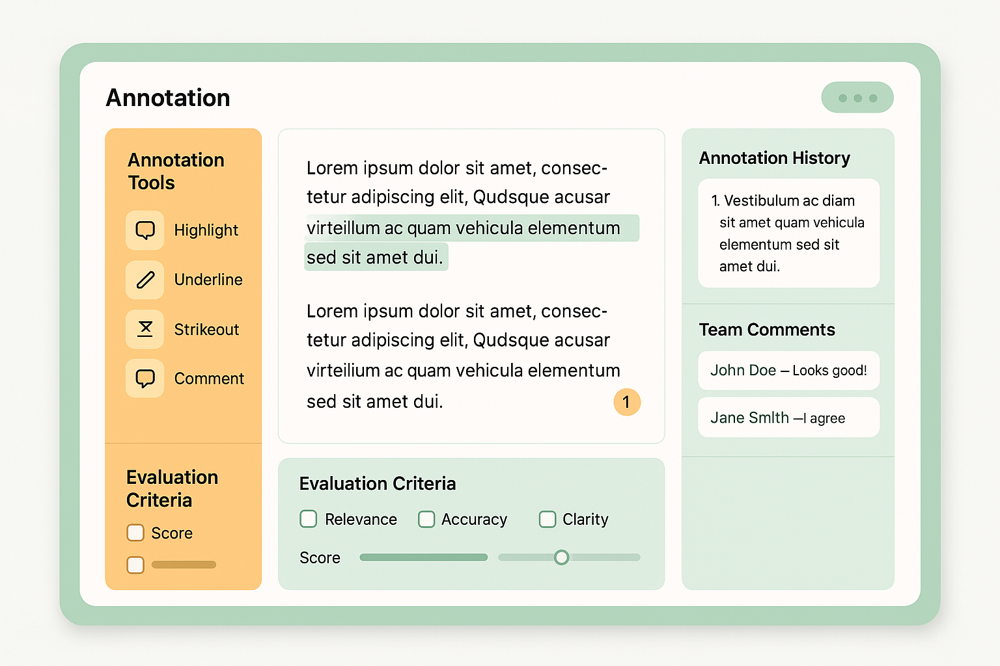

# Annotation Interface Design: Creating Effective Tools for Human Evaluation

## Introduction

The design of annotation interfaces represents a critical factor in the success of human-in-the-loop evaluation systems. These interfaces serve as the primary touchpoint between human evaluators and the evaluation process, directly impacting evaluator productivity, data quality, and overall system effectiveness. Well-designed annotation interfaces can improve evaluation throughput by 50-80% while reducing errors and evaluator fatigue.

Annotation interface design requires balancing multiple competing objectives: usability, functionality, efficiency, and accuracy. The interface must be intuitive enough for new evaluators to learn quickly, yet sophisticated enough to support complex evaluation tasks. It must minimize cognitive load while providing access to all necessary information and tools. Most importantly, it must be designed around human cognitive capabilities and limitations rather than technical constraints.

The evolution of annotation interfaces reflects broader trends in human-computer interaction and user experience design. Early annotation tools were often technical, command-line driven systems that required significant training and expertise. Modern interfaces leverage advances in web technologies, mobile computing, and user experience design to create more intuitive, efficient, and enjoyable evaluation experiences.

Consider the transformation at a major technology company that redesigned its content moderation interface. The original interface required evaluators to navigate through multiple screens and forms to complete a single evaluation, taking an average of 3.5 minutes per task. The redesigned interface consolidated all necessary information and controls into a single, streamlined view, reducing evaluation time to 1.2 minutes while improving accuracy by 15%. This improvement translated to millions of dollars in cost savings and significantly better content quality.

## User Experience Principles for Annotation Interfaces

Effective annotation interface design is grounded in fundamental user experience principles that prioritize human needs and capabilities. These principles guide design decisions and help create interfaces that support rather than hinder human evaluation performance.

**Cognitive Load Minimization**

Human attention and working memory are limited resources that must be carefully managed in annotation interface design. Cognitive load theory provides a framework for understanding how interface design affects evaluator performance and guides optimization strategies.

Intrinsic cognitive load relates to the inherent complexity of the evaluation task itself. While this load cannot be eliminated, interface design can avoid adding unnecessary complexity. This means presenting information in logical, hierarchical structures that match human mental models and avoiding interface elements that distract from the core evaluation task.

Extraneous cognitive load results from poor interface design that forces evaluators to spend mental resources on navigation, information seeking, and tool operation rather than evaluation itself. Effective interfaces minimize extraneous load through intuitive navigation, clear information hierarchy, and streamlined interaction patterns.

Germane cognitive load involves the mental effort required to process and integrate evaluation-relevant information. Well-designed interfaces can actually enhance germane cognitive load by presenting information in ways that support pattern recognition, comparison, and decision-making processes.

Research demonstrates that interfaces designed with cognitive load principles improve evaluation performance significantly. A study of annotation interfaces across multiple domains found that cognitive load-optimized designs improved evaluation accuracy by 12-25% while reducing completion time by 20-40%.

**Information Architecture and Visual Hierarchy**

Effective information architecture ensures that evaluators can quickly locate and process the information needed for accurate evaluation. This requires understanding the information needs of different evaluation tasks and organizing interface elements to support efficient information consumption.

Primary information includes the content being evaluated and the core evaluation criteria. This information should be prominently displayed and easily accessible without scrolling or navigation. The visual design should clearly distinguish primary information from secondary elements through size, color, positioning, and contrast.

Secondary information includes context, guidelines, examples, and reference materials that support evaluation decisions. This information should be readily accessible but not visually competing with primary information. Effective designs often use expandable sections, hover states, or sidebar panels to provide access to secondary information without cluttering the main interface.

Tertiary information includes system status, progress indicators, and administrative functions. This information should be present but visually de-emphasized to avoid distraction from evaluation tasks. Common approaches include using muted colors, smaller text, and peripheral positioning for tertiary elements.

The visual hierarchy must also consider the temporal flow of evaluation tasks. Information needed early in the evaluation process should be more prominent than information needed later. Interactive elements should be positioned to support natural reading and interaction patterns.

**Interaction Design and Workflow Optimization**

Interaction design focuses on how evaluators interact with the annotation interface to complete evaluation tasks. Effective interaction design reduces the number of actions required, minimizes context switching, and supports natural evaluation workflows.

Single-screen evaluation represents the gold standard for simple evaluation tasks. When all necessary information and controls are visible simultaneously, evaluators can complete tasks more quickly and accurately. This approach eliminates the cognitive overhead of remembering information across screens and reduces the risk of errors from incomplete information.

Progressive disclosure techniques allow complex evaluation tasks to be broken down into manageable steps while maintaining single-screen efficiency. Information and controls are revealed progressively as evaluators advance through the evaluation process, reducing initial complexity while ensuring all necessary elements are available when needed.

Keyboard shortcuts and hotkeys can dramatically improve evaluation efficiency for experienced evaluators. Research shows that keyboard-driven interfaces can be 2-3 times faster than mouse-driven interfaces for repetitive tasks. However, shortcuts must be intuitive and well-documented to be effective.

Batch processing capabilities allow evaluators to apply the same evaluation criteria or actions to multiple items simultaneously. This is particularly valuable for evaluation tasks with high volumes of similar content. Effective batch processing interfaces provide clear selection mechanisms and confirmation steps to prevent errors.

## Design Patterns for Evaluation Tasks

Different types of evaluation tasks require different interface design patterns optimized for specific cognitive and interaction requirements. Understanding these patterns helps designers select appropriate approaches for different evaluation scenarios.

**Classification and Labeling Interfaces**

Classification tasks involve assigning predefined categories or labels to content. These interfaces must present classification options clearly while supporting efficient selection and modification of assignments.

Single-select classification interfaces work well for mutually exclusive categories. Radio buttons provide clear visual indication of selection state and prevent multiple selections. For large numbers of categories, dropdown menus or searchable lists can save screen space while maintaining usability.

Multi-select classification interfaces support content that may belong to multiple categories simultaneously. Checkboxes provide clear visual feedback about selection state, while tag-based interfaces can be more space-efficient for large numbers of categories.

Hierarchical classification interfaces support complex taxonomies with nested categories. Tree-view controls or breadcrumb navigation help evaluators understand their position within the hierarchy while providing efficient navigation between levels.

Confidence rating interfaces allow evaluators to express uncertainty about classification decisions. Slider controls or discrete rating scales can capture confidence levels while maintaining evaluation efficiency. Research shows that confidence ratings improve overall evaluation quality by identifying cases that require additional review.

**Quality Assessment Interfaces**

Quality assessment tasks involve evaluating content against multiple criteria or dimensions. These interfaces must present evaluation criteria clearly while supporting efficient assessment across multiple dimensions.

Rubric-based interfaces present evaluation criteria in structured formats that guide consistent assessment. Effective rubrics include clear descriptions of quality levels, concrete examples, and scoring guidelines. Visual design should clearly distinguish between different criteria and quality levels.

Comparative evaluation interfaces allow evaluators to assess quality relative to reference examples or alternative options. Side-by-side layouts facilitate comparison while maintaining access to evaluation criteria. These interfaces work particularly well for subjective quality assessment where absolute standards are difficult to define.

Multi-dimensional rating interfaces support evaluation across multiple quality dimensions simultaneously. Matrix layouts can efficiently present multiple criteria and rating scales, though care must be taken to avoid visual complexity that impairs usability.

Weighted scoring interfaces allow different evaluation criteria to have different importance levels. These interfaces must clearly communicate weighting schemes while supporting efficient evaluation across all criteria.

**Content Annotation Interfaces**

Content annotation tasks involve marking specific portions of content with labels, comments, or corrections. These interfaces must provide precise selection tools while maintaining overview of the entire content.

Text annotation interfaces support highlighting, commenting, and labeling of text content. Effective designs provide multiple selection methods (click-and-drag, double-click, keyboard shortcuts) and clear visual feedback about selected regions. Annotation tools should be easily accessible without obscuring the content being annotated.

Image annotation interfaces support region selection, object labeling, and visual markup of images. Bounding box tools, polygon selection, and freehand drawing capabilities serve different annotation needs. Zoom and pan functionality is essential for detailed annotation of high-resolution images.

Video annotation interfaces add temporal dimensions to content annotation. Timeline controls, frame-by-frame navigation, and temporal region selection tools are essential for effective video annotation. Playback speed control helps evaluators review content at appropriate speeds for different annotation tasks.

Audio annotation interfaces support temporal annotation of audio content. Waveform visualization, playback controls, and temporal selection tools enable precise annotation of audio segments. Visual representation of audio features can help evaluators identify relevant content sections more efficiently.

## Technology Implementation Strategies

Implementing effective annotation interfaces requires careful technology choices that balance functionality, performance, usability, and maintainability. Modern web technologies provide powerful capabilities for creating sophisticated annotation interfaces while maintaining cross-platform compatibility.

**Frontend Architecture Patterns**

Single-page application (SPA) architectures provide responsive, desktop-like experiences that minimize page loads and maintain application state across evaluation sessions. Modern JavaScript frameworks like React, Vue, or Angular provide robust foundations for building complex annotation interfaces with good performance characteristics.

Component-based architectures enable reusable interface elements that maintain consistency across different evaluation tasks while supporting customization for specific requirements. Well-designed component libraries can significantly accelerate interface development while ensuring consistent user experiences.

Progressive web application (PWA) technologies enable annotation interfaces that work reliably across different devices and network conditions. Offline capabilities are particularly valuable for evaluation scenarios where network connectivity may be unreliable.

Responsive design ensures annotation interfaces work effectively across different screen sizes and device types. Mobile-responsive interfaces are increasingly important as evaluation work becomes more distributed and flexible.

**Real-time Collaboration Features**

Modern annotation interfaces increasingly support real-time collaboration between multiple evaluators working on the same content. These features require sophisticated technical implementation but provide significant value for collaborative evaluation scenarios.

Real-time synchronization ensures that multiple evaluators see consistent views of annotation state and can coordinate their efforts effectively. WebSocket connections or similar technologies provide the low-latency communication necessary for smooth collaborative experiences.

Conflict resolution mechanisms handle situations where multiple evaluators attempt to modify the same content simultaneously. Effective approaches include operational transformation algorithms, last-writer-wins strategies, or explicit conflict resolution interfaces.

Presence indicators show which evaluators are currently active and what they are working on. This awareness helps coordinate collaborative efforts and prevents duplicated work.

Communication tools integrated into annotation interfaces enable evaluators to discuss challenging cases without leaving the evaluation context. Chat systems, comment threads, and annotation-specific discussions support effective collaboration.

**Performance Optimization Techniques**

Annotation interfaces must maintain responsive performance even when handling large volumes of content or complex evaluation tasks. Performance optimization requires attention to both frontend and backend implementation details.

Lazy loading techniques load content and interface elements only when needed, reducing initial page load times and memory usage. This is particularly important for interfaces that handle large images, videos, or datasets.

Caching strategies reduce server load and improve response times by storing frequently accessed content and evaluation data locally. Browser caching, service worker caching, and application-level caching all contribute to improved performance.

Efficient data structures and algorithms ensure that annotation interfaces remain responsive as evaluation datasets grow. Virtualization techniques allow interfaces to handle thousands of items efficiently by rendering only visible elements.

Progressive enhancement ensures that annotation interfaces remain functional even when advanced features are unavailable due to browser limitations or network conditions. Core evaluation functionality should work reliably across all supported platforms.

## Accessibility and Inclusive Design

Annotation interfaces must be accessible to evaluators with diverse abilities and needs. Inclusive design principles ensure that interfaces work effectively for all users while often improving usability for everyone.

**Universal Design Principles**

Universal design creates interfaces that are usable by people with the widest range of abilities and situations. These principles benefit all users while ensuring accessibility for people with disabilities.

Perceivable information ensures that all interface elements can be perceived by users regardless of sensory abilities. This includes providing text alternatives for images, ensuring sufficient color contrast, and supporting screen readers and other assistive technologies.

Operable interfaces can be used by people with diverse motor abilities. This includes providing keyboard navigation alternatives to mouse interactions, ensuring sufficient target sizes for touch interfaces, and avoiding interactions that require precise timing or coordination.

Understandable interfaces present information and functionality in ways that users can comprehend. This includes using clear language, providing consistent navigation patterns, and offering help and error recovery mechanisms.

Robust interfaces work reliably across different assistive technologies and user agents. This requires following web standards, testing with assistive technologies, and designing for forward compatibility.

**Assistive Technology Integration**

Modern annotation interfaces must integrate effectively with assistive technologies used by evaluators with disabilities. This integration requires understanding how different assistive technologies work and designing interfaces that support their functionality.

Screen reader compatibility ensures that visually impaired evaluators can access all interface functionality through audio feedback. This requires proper semantic markup, descriptive labels, and logical navigation order.

Keyboard navigation support enables evaluators who cannot use pointing devices to access all interface functionality through keyboard interactions. This includes providing visible focus indicators, logical tab order, and keyboard shortcuts for common actions.

Voice control integration allows evaluators to interact with annotation interfaces through speech recognition systems. This requires designing interfaces that support voice commands and providing clear feedback about system state and available actions.

Motor accessibility features support evaluators with limited motor abilities. This includes providing large target areas, supporting alternative input methods, and avoiding interactions that require precise timing or coordination.

## Quality Assurance in Interface Design

The quality of annotation interfaces directly impacts evaluation quality, making interface quality assurance a critical component of overall evaluation system effectiveness. Systematic quality assurance approaches help identify and address interface issues before they impact evaluation outcomes.

**Usability Testing Methodologies**

Usability testing provides direct feedback about how real evaluators interact with annotation interfaces and identifies areas for improvement. Effective testing combines multiple methodologies to capture different aspects of interface performance.

Task-based testing observes evaluators completing realistic evaluation tasks while using the annotation interface. This testing reveals workflow issues, efficiency bottlenecks, and usability problems that might not be apparent from interface inspection alone.

Think-aloud protocols capture evaluators' thought processes as they use annotation interfaces. This methodology reveals cognitive challenges, confusion points, and mental model mismatches that impact evaluation effectiveness.

Comparative testing evaluates different interface designs or features to identify optimal approaches. A/B testing and multivariate testing can provide quantitative data about interface effectiveness while controlling for other variables.

Longitudinal testing tracks interface performance over extended periods to identify issues that emerge with sustained use. This testing can reveal problems like evaluator fatigue, learning curve challenges, and workflow optimization opportunities.

**Performance Metrics and Analytics**

Systematic measurement of interface performance provides objective data about effectiveness and guides improvement efforts. Key metrics capture both efficiency and effectiveness aspects of interface performance.

Task completion time measures how long evaluators take to complete evaluation tasks using the interface. This metric should be tracked across different task types, evaluator experience levels, and interface versions to identify optimization opportunities.

Error rates capture the frequency of mistakes made during evaluation tasks. Interface-related errors include incorrect selections, missed information, and workflow mistakes that result from poor interface design.

User satisfaction metrics capture evaluators' subjective experiences with annotation interfaces. Standardized questionnaires like the System Usability Scale (SUS) provide comparable measures across different interfaces and time periods.

Engagement metrics track how evaluators interact with different interface features and identify areas of high and low usage. Heat mapping, click tracking, and interaction analytics provide insights into actual usage patterns versus intended workflows.

## Advanced Interface Features

As annotation interfaces mature, advanced features can provide significant value for complex evaluation scenarios and experienced evaluators. These features must be carefully designed to add value without increasing complexity for basic use cases.

**AI-Assisted Annotation**

AI-assisted annotation features use machine learning to support human evaluation while maintaining human control over final decisions. These features can significantly improve evaluation efficiency when properly implemented.

Intelligent pre-annotation uses AI systems to provide initial annotations that human evaluators can review and modify. This approach works well when AI systems have reasonable accuracy but require human oversight for quality assurance.

Suggestion systems provide real-time recommendations as evaluators work, highlighting potential issues or suggesting relevant categories. These systems must be carefully calibrated to provide value without creating distraction or bias.

Quality checking features use AI to identify potential errors or inconsistencies in human annotations. These features can catch common mistakes and prompt evaluators to review their work before submission.

Pattern recognition systems identify recurring patterns in evaluation data and suggest standardized approaches for handling similar cases. This can improve consistency while reducing cognitive load for evaluators.

**Adaptive Interface Behavior**

Adaptive interfaces modify their behavior based on evaluator preferences, performance patterns, and task characteristics. These features can improve efficiency and satisfaction for experienced evaluators while maintaining simplicity for newcomers.

Personalization features allow evaluators to customize interface layouts, shortcuts, and workflows to match their preferences and working styles. Research shows that personalized interfaces can improve productivity by 15-30% for experienced users.

Intelligent defaults adapt interface settings based on task characteristics and evaluator history. This reduces setup time while ensuring appropriate configurations for different evaluation scenarios.

Progressive disclosure systems reveal advanced features as evaluators demonstrate proficiency with basic functionality. This approach maintains interface simplicity for new users while providing power features for experts.

Context-aware assistance provides relevant help and guidance based on current task context and evaluator behavior patterns. This support can reduce training requirements while improving evaluation quality.

## Case Studies in Interface Design

Real-world examples of annotation interface design provide valuable insights into the challenges and opportunities of creating effective evaluation tools. These case studies demonstrate how different design approaches address specific evaluation requirements and constraints.

**Case Study 1: Medical Image Annotation Platform**

A healthcare technology company developed a sophisticated annotation interface for radiologists evaluating AI-assisted diagnostic tools. The interface needed to support precise annotation of medical images while integrating with existing clinical workflows.

The design challenge involved presenting high-resolution medical images alongside AI predictions, evaluation criteria, and clinical context information. The interface needed to support detailed annotation while maintaining the speed necessary for clinical practice.

Key design innovations included multi-monitor support that allowed radiologists to view images at full resolution while accessing evaluation tools on secondary screens, intelligent zoom and pan controls that maintained annotation precision across different magnification levels, and integrated comparison tools that enabled side-by-side evaluation of AI predictions and ground truth annotations.

The interface also incorporated clinical workflow integration that connected with existing radiology information systems, voice control capabilities that allowed hands-free annotation during image review, and collaborative features that enabled consultation with colleagues on challenging cases.

Results demonstrated significant improvements in evaluation efficiency and quality. Radiologists completed evaluation tasks 40% faster while maintaining diagnostic accuracy. The interface supported evaluation of over 100,000 medical images with consistently high inter-annotator agreement rates.

**Case Study 2: Content Moderation Interface**

A social media platform redesigned its content moderation interface to handle increasing volumes of user-generated content while maintaining high accuracy and cultural sensitivity. The interface needed to support rapid evaluation across multiple content types and languages.

The original interface required multiple screen transitions and form submissions for each evaluation task, resulting in slow evaluation speeds and high error rates. The redesigned interface consolidated all evaluation elements into a single, streamlined view optimized for rapid decision-making.

Key design features included unified content display that presented text, images, and videos in consistent formats, contextual evaluation tools that adapted to different content types automatically, and batch processing capabilities that allowed moderators to handle multiple similar cases efficiently.

The interface also incorporated cultural context integration that provided relevant cultural information for content evaluation, real-time collaboration features that enabled consultation on challenging cases, and quality assurance tools that identified potential errors before submission.

Implementation results showed dramatic improvements in moderation effectiveness. Evaluation speed increased by 65% while accuracy improved by 20%. The interface supported evaluation of over 50 million pieces of content monthly with consistent quality standards across global moderation teams.

**Case Study 3: Research Annotation Platform**

An academic research institution developed a flexible annotation platform to support diverse research projects across multiple disciplines. The platform needed to accommodate different annotation schemas while maintaining usability for researchers with varying technical expertise.

The design challenge involved creating a configurable interface that could adapt to different research requirements without becoming overly complex. The platform needed to support text, image, audio, and video annotation while maintaining consistent user experiences across different media types.

Key innovations included schema-driven interface generation that automatically created appropriate annotation tools based on research requirements, collaborative annotation features that supported distributed research teams, and version control systems that tracked annotation changes over time.

The platform also incorporated statistical analysis tools that provided real-time feedback about inter-annotator agreement, export capabilities that supported integration with various analysis tools, and training modules that helped researchers learn effective annotation practices.

Results demonstrated the value of flexible, research-oriented annotation tools. The platform supported over 200 research projects with annotation schemas ranging from simple classification tasks to complex multi-dimensional coding schemes. Researchers reported 50% improvements in annotation efficiency compared to previous tools.

## Future Directions in Annotation Interface Design

The field of annotation interface design continues to evolve rapidly, driven by advances in web technologies, user experience research, and understanding of human-computer collaboration. Emerging trends point toward more intelligent, adaptive, and collaborative annotation experiences.

**Immersive and Spatial Interfaces**

Virtual and augmented reality technologies offer new possibilities for annotation interface design, particularly for spatial content like 3D models, architectural plans, and geographic data. These interfaces can provide more natural interaction paradigms while supporting complex annotation tasks.

VR annotation environments allow evaluators to work with 3D content in natural spatial contexts. This is particularly valuable for evaluating AI systems that operate in physical environments or process spatial data.

AR overlay systems can augment real-world content with annotation tools and evaluation information. This approach shows promise for field evaluation scenarios where evaluators need to assess AI system performance in real-world contexts.

Spatial interaction paradigms leverage natural human spatial reasoning abilities to create more intuitive annotation experiences. Gesture-based controls and spatial organization of information can reduce cognitive load while improving evaluation efficiency.

**AI-Human Collaborative Interfaces**

Future annotation interfaces will increasingly leverage AI capabilities to augment human evaluation while maintaining human control over critical decisions. These collaborative approaches can improve both efficiency and quality of evaluation processes.

Intelligent assistance systems will provide contextual support that adapts to individual evaluator needs and preferences. These systems will learn from evaluator behavior to provide increasingly relevant suggestions and automation.

Collaborative AI partners will work alongside human evaluators to handle routine tasks while escalating complex decisions to human judgment. This partnership model can optimize the use of both human and artificial intelligence.

Explainable AI integration will help evaluators understand AI system reasoning and identify potential issues more effectively. Interfaces that clearly communicate AI decision processes can improve evaluation quality while building appropriate trust in AI capabilities.

## Conclusion

Annotation interface design represents a critical success factor for human-in-the-loop evaluation systems. Well-designed interfaces can dramatically improve evaluation efficiency, quality, and evaluator satisfaction while poorly designed interfaces create bottlenecks that limit system effectiveness.

Effective annotation interface design requires systematic attention to user experience principles, task-specific design patterns, technology implementation strategies, and quality assurance processes. Organizations that invest in sophisticated interface design capabilities gain significant competitive advantages through improved evaluation capabilities and reduced operational costs.

The future of annotation interface design lies in increasingly intelligent, adaptive, and collaborative systems that leverage the complementary strengths of human and artificial intelligence. Organizations that master these advanced interface design approaches will be best positioned to build evaluation systems that meet the evolving challenges of AI system development and deployment.

As AI systems become more sophisticated and are deployed in increasingly critical applications, the importance of effective human evaluation interfaces will only grow. The principles, patterns, and practices outlined in this section provide a foundation for creating annotation interfaces that support high-quality evaluation while delivering measurable business value.

---

**Next**: [Section 3: Quality Control and Consensus Building](03-quality-control-consensus.md)

