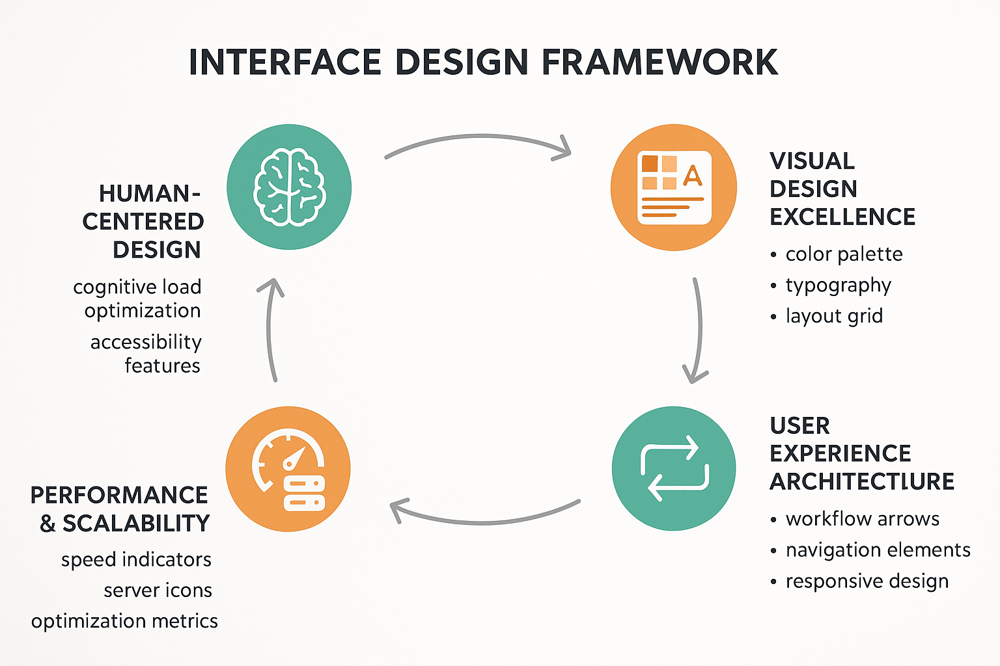

# Interface Design Principles and Best Practices



*Figure 7: Interface Design Framework - Comprehensive design principles for annotation and review interfaces with user-centered design, cognitive optimization, accessibility standards, and performance excellence.*

## Introduction

Interface design represents the critical bridge between human cognitive capabilities and AI evaluation systems. Effective annotation and review interfaces can dramatically improve reviewer productivity, reduce cognitive fatigue, minimize errors, and enhance the overall quality of human evaluation processes. This section provides comprehensive guidance for designing, implementing, and optimizing interfaces that maximize human potential while supporting sophisticated evaluation workflows.

The principles and frameworks presented here are based on extensive research in human-computer interaction, cognitive psychology, and real-world implementations across diverse industries and evaluation scenarios. By mastering these concepts, you will be able to create interfaces that not only meet functional requirements but also provide exceptional user experiences that drive adoption, engagement, and performance.

## Fundamental Design Principles

### User-Centered Design Philosophy

User-centered design places human needs, capabilities, and limitations at the center of interface development. This approach recognizes that the most technically sophisticated system will fail if it doesn't align with how humans naturally think, work, and interact with information.

```python
class UserCenteredDesignFramework:
    def __init__(self):
        self.design_principles = {
            'human_cognition': CognitivePrinciplesEngine(),
            'task_optimization': TaskOptimizationEngine(),
            'accessibility': AccessibilityEngine(),
            'usability': UsabilityEngine()
        }
        self.user_research = UserResearchFramework()
        self.design_validator = DesignValidator()
    
    def design_interface(self, requirements: InterfaceRequirements) -> InterfaceDesign:
        # Conduct user research
        user_insights = self.user_research.conduct_research(
            target_users=requirements.target_users,
            use_cases=requirements.use_cases,
            constraints=requirements.constraints
        )
        
        # Apply design principles
        design_recommendations = {}
        for principle, engine in self.design_principles.items():
            recommendations = engine.generate_recommendations(
                user_insights=user_insights,
                requirements=requirements
            )
            design_recommendations[principle] = recommendations
        
        # Create integrated design
        interface_design = self.integrate_design_recommendations(
            design_recommendations, requirements
        )
        
        # Validate design
        validation_result = self.design_validator.validate(
            design=interface_design,
            user_insights=user_insights,
            requirements=requirements
        )
        
        interface_design.validation_score = validation_result
        return interface_design
    
    def optimize_cognitive_load(self, interface_design: InterfaceDesign) -> CognitiveOptimization:
        cognitive_analyzer = CognitiveLoadAnalyzer()
        
        # Analyze current cognitive load
        load_analysis = cognitive_analyzer.analyze_cognitive_load(interface_design)
        
        # Identify optimization opportunities
        optimization_opportunities = cognitive_analyzer.identify_optimizations(
            load_analysis, interface_design
        )
        
        # Generate optimization recommendations
        optimizations = []
        for opportunity in optimization_opportunities:
            optimization = self.generate_cognitive_optimization(
                opportunity, interface_design
            )
            optimizations.append(optimization)
        
        return CognitiveOptimization(load_analysis, optimizations)
```

### Cognitive Load Management

Human cognitive capacity is limited, and effective interface design must carefully manage cognitive load to maintain reviewer performance and prevent fatigue. This involves understanding the different types of cognitive load and designing interfaces that minimize extraneous load while supporting intrinsic and germane cognitive processing.

```python
class CognitiveLoadManager:
    def __init__(self):
        self.load_types = {
            'intrinsic': IntrinsicLoadAnalyzer(),
            'extraneous': ExtraneousLoadAnalyzer(),
            'germane': GermaneLoadAnalyzer()
        }
        self.optimization_strategies = {
            'chunking': ChunkingStrategy(),
            'progressive_disclosure': ProgressiveDisclosureStrategy(),
            'visual_hierarchy': VisualHierarchyStrategy(),
            'automation': AutomationStrategy()
        }
    
    def analyze_cognitive_load(self, interface_design: InterfaceDesign, 
                              task_context: TaskContext) -> CognitiveLoadAnalysis:
        load_analysis = {}
        
        # Analyze intrinsic load (task complexity)
        intrinsic_load = self.load_types['intrinsic'].analyze(
            task_complexity=task_context.complexity,
            domain_knowledge_required=task_context.domain_knowledge,
            decision_points=task_context.decision_points
        )
        load_analysis['intrinsic'] = intrinsic_load
        
        # Analyze extraneous load (interface complexity)
        extraneous_load = self.load_types['extraneous'].analyze(
            interface_elements=interface_design.elements,
            navigation_complexity=interface_design.navigation,
            visual_clutter=interface_design.visual_complexity
        )
        load_analysis['extraneous'] = extraneous_load
        
        # Analyze germane load (learning and schema construction)
        germane_load = self.load_types['germane'].analyze(
            learning_opportunities=interface_design.learning_features,
            feedback_mechanisms=interface_design.feedback_systems,
            skill_development=interface_design.skill_support
        )
        load_analysis['germane'] = germane_load
        
        return CognitiveLoadAnalysis(load_analysis, interface_design, task_context)
    
    def optimize_cognitive_load(self, load_analysis: CognitiveLoadAnalysis) -> LoadOptimizationPlan:
        optimization_plan = LoadOptimizationPlan()
        
        # Optimize intrinsic load through task design
        if load_analysis.intrinsic_load.score > 0.7:
            intrinsic_optimizations = self.optimize_intrinsic_load(load_analysis)
            optimization_plan.add_optimizations('intrinsic', intrinsic_optimizations)
        
        # Minimize extraneous load through interface simplification
        if load_analysis.extraneous_load.score > 0.5:
            extraneous_optimizations = self.minimize_extraneous_load(load_analysis)
            optimization_plan.add_optimizations('extraneous', extraneous_optimizations)
        
        # Enhance germane load through learning support
        if load_analysis.germane_load.score < 0.6:
            germane_optimizations = self.enhance_germane_load(load_analysis)
            optimization_plan.add_optimizations('germane', germane_optimizations)
        
        return optimization_plan
```

### Information Architecture and Visual Hierarchy

Effective information architecture organizes content and functionality in ways that align with human mental models and task flows. Visual hierarchy guides attention and supports efficient information processing through strategic use of typography, color, spacing, and layout.

```python
class InformationArchitectureDesigner:
    def __init__(self):
        self.ia_principles = {
            'mental_models': MentalModelAnalyzer(),
            'task_flows': TaskFlowAnalyzer(),
            'content_organization': ContentOrganizationEngine(),
            'navigation_design': NavigationDesignEngine()
        }
        self.visual_hierarchy = VisualHierarchyEngine()
    
    def design_information_architecture(self, content_inventory: ContentInventory, 
                                      user_tasks: List[UserTask]) -> InformationArchitecture:
        # Analyze user mental models
        mental_models = self.ia_principles['mental_models'].analyze(
            user_research_data=content_inventory.user_research,
            domain_expertise=content_inventory.domain_context,
            task_patterns=user_tasks
        )
        
        # Analyze task flows
        task_flows = self.ia_principles['task_flows'].analyze(
            user_tasks=user_tasks,
            content_relationships=content_inventory.relationships,
            workflow_patterns=content_inventory.workflows
        )
        
        # Design content organization
        content_organization = self.ia_principles['content_organization'].design(
            content_items=content_inventory.items,
            mental_models=mental_models,
            task_flows=task_flows
        )
        
        # Design navigation system
        navigation_design = self.ia_principles['navigation_design'].design(
            content_organization=content_organization,
            task_flows=task_flows,
            user_preferences=content_inventory.user_preferences
        )
        
        return InformationArchitecture(
            mental_models=mental_models,
            task_flows=task_flows,
            content_organization=content_organization,
            navigation_design=navigation_design
        )
    
    def create_visual_hierarchy(self, information_architecture: InformationArchitecture, 
                               design_constraints: DesignConstraints) -> VisualHierarchy:
        # Define hierarchy levels
        hierarchy_levels = self.visual_hierarchy.define_levels(
            content_importance=information_architecture.content_importance,
            task_priorities=information_architecture.task_priorities,
            user_attention_patterns=information_architecture.attention_patterns
        )
        
        # Design typography hierarchy
        typography_hierarchy = self.visual_hierarchy.design_typography(
            hierarchy_levels=hierarchy_levels,
            readability_requirements=design_constraints.readability,
            accessibility_standards=design_constraints.accessibility
        )
        
        # Design color hierarchy
        color_hierarchy = self.visual_hierarchy.design_color_system(
            hierarchy_levels=hierarchy_levels,
            brand_constraints=design_constraints.brand,
            accessibility_requirements=design_constraints.accessibility
        )
        
        # Design spacing and layout hierarchy
        layout_hierarchy = self.visual_hierarchy.design_layout_system(
            hierarchy_levels=hierarchy_levels,
            content_density=design_constraints.content_density,
            screen_constraints=design_constraints.screen_sizes
        )
        
        return VisualHierarchy(
            hierarchy_levels=hierarchy_levels,
            typography=typography_hierarchy,
            color_system=color_hierarchy,
            layout_system=layout_hierarchy
        )
```

## Annotation Interface Design Patterns

### Task-Specific Interface Components

Different annotation tasks require specialized interface components optimized for specific types of human judgment and data interaction. Understanding these patterns enables designers to select and customize components that maximize efficiency and accuracy for each evaluation scenario.

```python
class AnnotationInterfaceComponentLibrary:
    def __init__(self):
        self.components = {
            'text_annotation': TextAnnotationComponents(),
            'image_annotation': ImageAnnotationComponents(),
            'audio_annotation': AudioAnnotationComponents(),
            'video_annotation': VideoAnnotationComponents(),
            'multimodal_annotation': MultimodalAnnotationComponents()
        }
        self.interaction_patterns = InteractionPatternLibrary()
        self.validation_components = ValidationComponentLibrary()
    
    def design_annotation_interface(self, annotation_task: AnnotationTask) -> AnnotationInterface:
        # Select appropriate components
        primary_components = self.select_primary_components(annotation_task)
        
        # Design interaction patterns
        interaction_design = self.interaction_patterns.design_interactions(
            components=primary_components,
            task_requirements=annotation_task.requirements,
            user_capabilities=annotation_task.user_capabilities
        )
        
        # Add validation components
        validation_design = self.validation_components.design_validation(
            annotation_task=annotation_task,
            primary_components=primary_components
        )
        
        # Integrate components
        interface_design = self.integrate_components(
            primary_components=primary_components,
            interaction_design=interaction_design,
            validation_design=validation_design
        )
        
        return AnnotationInterface(interface_design, annotation_task)
    
    def select_primary_components(self, annotation_task: AnnotationTask) -> List[InterfaceComponent]:
        components = []
        
        # Select based on data type
        if annotation_task.data_type == 'text':
            components.extend(self.components['text_annotation'].get_components(
                annotation_type=annotation_task.annotation_type,
                complexity_level=annotation_task.complexity
            ))
        elif annotation_task.data_type == 'image':
            components.extend(self.components['image_annotation'].get_components(
                annotation_type=annotation_task.annotation_type,
                image_characteristics=annotation_task.data_characteristics
            ))
        elif annotation_task.data_type == 'multimodal':
            components.extend(self.components['multimodal_annotation'].get_components(
                modalities=annotation_task.modalities,
                interaction_requirements=annotation_task.interaction_requirements
            ))
        
        # Add common components
        components.extend(self.get_common_components(annotation_task))
        
        return components
```

### Text Annotation Interface Patterns

Text annotation interfaces must support various types of linguistic analysis, from simple classification to complex semantic annotation. These interfaces require careful attention to text presentation, selection mechanisms, and annotation visualization.

```python
class TextAnnotationInterfaceDesigner:
    def __init__(self):
        self.text_components = {
            'classification': TextClassificationComponent(),
            'entity_recognition': EntityRecognitionComponent(),
            'sentiment_analysis': SentimentAnalysisComponent(),
            'relation_extraction': RelationExtractionComponent(),
            'discourse_analysis': DiscourseAnalysisComponent()
        }
        self.text_presentation = TextPresentationEngine()
        self.annotation_visualization = AnnotationVisualizationEngine()
    
    def design_text_annotation_interface(self, text_task: TextAnnotationTask) -> TextAnnotationInterface:
        # Design text presentation
        text_presentation = self.text_presentation.design_presentation(
            text_characteristics=text_task.text_characteristics,
            annotation_requirements=text_task.annotation_requirements,
            readability_constraints=text_task.readability_constraints
        )
        
        # Select annotation components
        annotation_components = self.select_text_annotation_components(text_task)
        
        # Design annotation visualization
        visualization_design = self.annotation_visualization.design_visualization(
            annotation_types=text_task.annotation_types,
            text_presentation=text_presentation,
            user_preferences=text_task.user_preferences
        )
        
        # Create integrated interface
        interface_design = TextAnnotationInterfaceDesign(
            text_presentation=text_presentation,
            annotation_components=annotation_components,
            visualization=visualization_design
        )
        
        return TextAnnotationInterface(interface_design, text_task)
    
    def design_entity_recognition_interface(self, entity_task: EntityRecognitionTask) -> EntityRecognitionInterface:
        # Design entity selection mechanism
        selection_mechanism = EntitySelectionMechanism(
            selection_mode=entity_task.selection_mode,  # span, token, phrase
            multi_selection=entity_task.allows_overlapping,
            keyboard_shortcuts=entity_task.keyboard_shortcuts
        )
        
        # Design entity type selector
        entity_type_selector = EntityTypeSelector(
            entity_types=entity_task.entity_types,
            hierarchy=entity_task.entity_hierarchy,
            quick_access=entity_task.frequent_entities
        )
        
        # Design annotation display
        annotation_display = EntityAnnotationDisplay(
            highlighting_scheme=entity_task.highlighting_scheme,
            label_positioning=entity_task.label_positioning,
            conflict_resolution=entity_task.conflict_resolution
        )
        
        return EntityRecognitionInterface(
            selection_mechanism=selection_mechanism,
            entity_type_selector=entity_type_selector,
            annotation_display=annotation_display
        )
```

### Image and Multimodal Annotation Interfaces

Image and multimodal annotation interfaces present unique challenges in spatial annotation, object detection, and cross-modal relationship annotation. These interfaces must provide precise spatial controls while maintaining usability and efficiency.

```python
class ImageAnnotationInterfaceDesigner:
    def __init__(self):
        self.spatial_tools = SpatialAnnotationToolkit()
        self.image_viewer = ImageViewerEngine()
        self.annotation_overlays = AnnotationOverlayEngine()
        self.multimodal_coordinator = MultimodalCoordinationEngine()
    
    def design_image_annotation_interface(self, image_task: ImageAnnotationTask) -> ImageAnnotationInterface:
        # Design image viewer
        image_viewer = self.image_viewer.design_viewer(
            image_characteristics=image_task.image_characteristics,
            zoom_requirements=image_task.zoom_requirements,
            navigation_needs=image_task.navigation_needs
        )
        
        # Design spatial annotation tools
        spatial_tools = self.spatial_tools.design_tools(
            annotation_types=image_task.annotation_types,
            precision_requirements=image_task.precision_requirements,
            interaction_preferences=image_task.interaction_preferences
        )
        
        # Design annotation overlays
        overlay_system = self.annotation_overlays.design_overlays(
            annotation_visualization=image_task.visualization_requirements,
            layer_management=image_task.layer_requirements,
            performance_constraints=image_task.performance_constraints
        )
        
        return ImageAnnotationInterface(
            image_viewer=image_viewer,
            spatial_tools=spatial_tools,
            overlay_system=overlay_system
        )
    
    def design_object_detection_interface(self, detection_task: ObjectDetectionTask) -> ObjectDetectionInterface:
        # Design bounding box tools
        bounding_box_tools = BoundingBoxToolset(
            box_creation_mode=detection_task.box_creation_mode,
            resize_handles=detection_task.resize_handles,
            snap_to_edges=detection_task.snap_to_edges,
            keyboard_shortcuts=detection_task.keyboard_shortcuts
        )
        
        # Design object classification
        object_classifier = ObjectClassificationPanel(
            object_classes=detection_task.object_classes,
            class_hierarchy=detection_task.class_hierarchy,
            quick_selection=detection_task.quick_selection_enabled
        )
        
        # Design annotation management
        annotation_manager = AnnotationManagementPanel(
            annotation_list=detection_task.annotation_list_enabled,
            bulk_operations=detection_task.bulk_operations_enabled,
            validation_indicators=detection_task.validation_indicators
        )
        
        return ObjectDetectionInterface(
            bounding_box_tools=bounding_box_tools,
            object_classifier=object_classifier,
            annotation_manager=annotation_manager
        )
```

## User Experience Optimization

### Workflow Efficiency Enhancement

Optimizing workflow efficiency requires deep understanding of how annotators actually work, identifying bottlenecks and friction points, and designing solutions that streamline the annotation process without sacrificing quality.

```python
class WorkflowEfficiencyOptimizer:
    def __init__(self):
        self.workflow_analyzer = WorkflowAnalyzer()
        self.bottleneck_detector = BottleneckDetector()
        self.efficiency_enhancer = EfficiencyEnhancer()
        self.automation_identifier = AutomationIdentifier()
    
    def optimize_annotation_workflow(self, workflow_data: WorkflowData) -> WorkflowOptimization:
        # Analyze current workflow
        workflow_analysis = self.workflow_analyzer.analyze_workflow(
            user_actions=workflow_data.user_actions,
            task_completion_times=workflow_data.completion_times,
            error_patterns=workflow_data.error_patterns
        )
        
        # Detect bottlenecks
        bottlenecks = self.bottleneck_detector.detect_bottlenecks(
            workflow_analysis=workflow_analysis,
            performance_metrics=workflow_data.performance_metrics
        )
        
        # Identify automation opportunities
        automation_opportunities = self.automation_identifier.identify_opportunities(
            workflow_analysis=workflow_analysis,
            repetitive_patterns=workflow_data.repetitive_patterns
        )
        
        # Generate optimization recommendations
        optimizations = self.efficiency_enhancer.generate_optimizations(
            bottlenecks=bottlenecks,
            automation_opportunities=automation_opportunities,
            workflow_analysis=workflow_analysis
        )
        
        return WorkflowOptimization(
            current_analysis=workflow_analysis,
            bottlenecks=bottlenecks,
            automation_opportunities=automation_opportunities,
            optimizations=optimizations
        )
    
    def implement_keyboard_shortcuts(self, annotation_interface: AnnotationInterface, 
                                   usage_patterns: UsagePatterns) -> KeyboardShortcutSystem:
        # Analyze frequent actions
        frequent_actions = usage_patterns.get_frequent_actions(threshold=0.1)
        
        # Design shortcut mappings
        shortcut_mappings = {}
        for action in frequent_actions:
            shortcut = self.design_optimal_shortcut(
                action=action,
                frequency=usage_patterns.get_action_frequency(action),
                context=usage_patterns.get_action_context(action)
            )
            shortcut_mappings[action] = shortcut
        
        # Create shortcut system
        shortcut_system = KeyboardShortcutSystem(
            mappings=shortcut_mappings,
            conflict_resolution=ConflictResolutionStrategy(),
            customization_support=True
        )
        
        return shortcut_system
```

### Error Prevention and Recovery

Effective error prevention reduces annotation errors through interface design, while robust error recovery mechanisms help annotators quickly identify and correct mistakes when they occur.

```python
class ErrorPreventionSystem:
    def __init__(self):
        self.error_predictors = {
            'cognitive_overload': CognitiveOverloadPredictor(),
            'attention_lapses': AttentionLapsePredictor(),
            'fatigue_detection': FatigueDetector(),
            'confusion_indicators': ConfusionIndicatorDetector()
        }
        self.prevention_strategies = {
            'validation_prompts': ValidationPromptStrategy(),
            'confirmation_dialogs': ConfirmationDialogStrategy(),
            'auto_save': AutoSaveStrategy(),
            'undo_redo': UndoRedoStrategy()
        }
    
    def implement_error_prevention(self, annotation_interface: AnnotationInterface, 
                                 error_patterns: ErrorPatterns) -> ErrorPreventionImplementation:
        # Analyze error patterns
        error_analysis = self.analyze_error_patterns(error_patterns)
        
        # Select prevention strategies
        selected_strategies = self.select_prevention_strategies(
            error_analysis=error_analysis,
            interface_constraints=annotation_interface.constraints
        )
        
        # Implement prevention mechanisms
        prevention_mechanisms = []
        for strategy_name, strategy in selected_strategies.items():
            mechanism = strategy.implement(
                interface=annotation_interface,
                error_context=error_analysis.get_context(strategy_name)
            )
            prevention_mechanisms.append(mechanism)
        
        return ErrorPreventionImplementation(
            error_analysis=error_analysis,
            prevention_mechanisms=prevention_mechanisms
        )
    
    def design_validation_system(self, annotation_task: AnnotationTask) -> ValidationSystem:
        # Design real-time validation
        real_time_validation = RealTimeValidator(
            validation_rules=annotation_task.validation_rules,
            immediate_feedback=annotation_task.immediate_feedback_enabled,
            severity_levels=annotation_task.validation_severity_levels
        )
        
        # Design batch validation
        batch_validation = BatchValidator(
            consistency_checks=annotation_task.consistency_checks,
            cross_validation=annotation_task.cross_validation_enabled,
            statistical_validation=annotation_task.statistical_validation
        )
        
        # Design validation feedback
        validation_feedback = ValidationFeedbackSystem(
            feedback_modes=annotation_task.feedback_modes,
            learning_integration=annotation_task.learning_integration,
            performance_tracking=annotation_task.performance_tracking
        )
        
        return ValidationSystem(
            real_time_validation=real_time_validation,
            batch_validation=batch_validation,
            validation_feedback=validation_feedback
        )
```

## Accessibility and Inclusive Design

### Universal Design Principles

Universal design creates interfaces that are usable by people with diverse abilities, backgrounds, and contexts. This approach benefits all users while ensuring compliance with accessibility standards and legal requirements.

```python
class UniversalDesignImplementor:
    def __init__(self):
        self.accessibility_standards = {
            'wcag': WCAGComplianceEngine(),
            'section_508': Section508ComplianceEngine(),
            'ada': ADAComplianceEngine()
        }
        self.inclusive_design = InclusiveDesignEngine()
        self.assistive_technology = AssistiveTechnologySupport()
    
    def implement_universal_design(self, interface_design: InterfaceDesign, 
                                 accessibility_requirements: AccessibilityRequirements) -> UniversalDesignImplementation:
        # Assess current accessibility
        accessibility_assessment = self.assess_accessibility(
            interface_design=interface_design,
            standards=accessibility_requirements.standards
        )
        
        # Design inclusive features
        inclusive_features = self.inclusive_design.design_features(
            user_diversity=accessibility_requirements.user_diversity,
            context_diversity=accessibility_requirements.context_diversity,
            technology_diversity=accessibility_requirements.technology_diversity
        )
        
        # Implement assistive technology support
        assistive_support = self.assistive_technology.implement_support(
            interface_design=interface_design,
            assistive_technologies=accessibility_requirements.assistive_technologies
        )
        
        # Create implementation plan
        implementation_plan = UniversalDesignImplementationPlan(
            accessibility_assessment=accessibility_assessment,
            inclusive_features=inclusive_features,
            assistive_support=assistive_support
        )
        
        return UniversalDesignImplementation(implementation_plan)
    
    def ensure_keyboard_accessibility(self, interface_design: InterfaceDesign) -> KeyboardAccessibilityImplementation:
        # Analyze keyboard navigation requirements
        navigation_analysis = self.analyze_keyboard_navigation(interface_design)
        
        # Design tab order
        tab_order = self.design_logical_tab_order(
            interface_elements=interface_design.interactive_elements,
            task_flow=interface_design.task_flow
        )
        
        # Implement keyboard shortcuts
        keyboard_shortcuts = self.implement_accessible_shortcuts(
            frequent_actions=interface_design.frequent_actions,
            accessibility_constraints=interface_design.accessibility_constraints
        )
        
        # Design focus indicators
        focus_indicators = self.design_focus_indicators(
            visual_design=interface_design.visual_design,
            accessibility_standards=interface_design.accessibility_standards
        )
        
        return KeyboardAccessibilityImplementation(
            navigation_analysis=navigation_analysis,
            tab_order=tab_order,
            keyboard_shortcuts=keyboard_shortcuts,
            focus_indicators=focus_indicators
        )
```

### Screen Reader and Assistive Technology Support

Supporting screen readers and other assistive technologies requires careful attention to semantic markup, alternative text, and programmatic access to interface functionality.

```python
class AssistiveTechnologySupportSystem:
    def __init__(self):
        self.screen_reader_support = ScreenReaderSupportEngine()
        self.semantic_markup = SemanticMarkupEngine()
        self.alternative_content = AlternativeContentEngine()
        self.programmatic_access = ProgrammaticAccessEngine()
    
    def implement_screen_reader_support(self, annotation_interface: AnnotationInterface) -> ScreenReaderSupport:
        # Design semantic structure
        semantic_structure = self.semantic_markup.design_structure(
            interface_hierarchy=annotation_interface.hierarchy,
            content_relationships=annotation_interface.content_relationships,
            interaction_patterns=annotation_interface.interaction_patterns
        )
        
        # Create alternative content
        alternative_content = self.alternative_content.create_alternatives(
            visual_content=annotation_interface.visual_content,
            interactive_elements=annotation_interface.interactive_elements,
            dynamic_content=annotation_interface.dynamic_content
        )
        
        # Implement programmatic access
        programmatic_access = self.programmatic_access.implement_access(
            interface_functionality=annotation_interface.functionality,
            state_management=annotation_interface.state_management,
            event_handling=annotation_interface.event_handling
        )
        
        return ScreenReaderSupport(
            semantic_structure=semantic_structure,
            alternative_content=alternative_content,
            programmatic_access=programmatic_access
        )
    
    def create_alternative_text_system(self, visual_content: VisualContent) -> AlternativeTextSystem:
        # Analyze visual content
        content_analysis = self.analyze_visual_content(visual_content)
        
        # Generate descriptive text
        descriptive_text = self.generate_descriptive_text(
            content_analysis=content_analysis,
            context=visual_content.context,
            user_needs=visual_content.user_needs
        )
        
        # Create structured descriptions
        structured_descriptions = self.create_structured_descriptions(
            visual_content=visual_content,
            descriptive_text=descriptive_text
        )
        
        return AlternativeTextSystem(
            content_analysis=content_analysis,
            descriptive_text=descriptive_text,
            structured_descriptions=structured_descriptions
        )
```

## Performance and Scalability Considerations

### Interface Performance Optimization

Annotation interfaces must maintain responsive performance even when handling large datasets, complex visualizations, and multiple concurrent users. Performance optimization requires careful attention to rendering efficiency, data management, and user interaction responsiveness.

```python
class InterfacePerformanceOptimizer:
    def __init__(self):
        self.rendering_optimizer = RenderingOptimizer()
        self.data_manager = DataManagementOptimizer()
        self.interaction_optimizer = InteractionOptimizer()
        self.memory_manager = MemoryManager()
    
    def optimize_interface_performance(self, interface_design: InterfaceDesign, 
                                     performance_requirements: PerformanceRequirements) -> PerformanceOptimization:
        # Optimize rendering performance
        rendering_optimization = self.rendering_optimizer.optimize(
            visual_complexity=interface_design.visual_complexity,
            update_frequency=interface_design.update_frequency,
            target_framerate=performance_requirements.target_framerate
        )
        
        # Optimize data management
        data_optimization = self.data_manager.optimize(
            data_volume=interface_design.data_volume,
            data_access_patterns=interface_design.data_access_patterns,
            caching_strategy=performance_requirements.caching_strategy
        )
        
        # Optimize user interactions
        interaction_optimization = self.interaction_optimizer.optimize(
            interaction_complexity=interface_design.interaction_complexity,
            response_time_requirements=performance_requirements.response_times,
            concurrent_users=performance_requirements.concurrent_users
        )
        
        # Optimize memory usage
        memory_optimization = self.memory_manager.optimize(
            memory_constraints=performance_requirements.memory_constraints,
            data_lifecycle=interface_design.data_lifecycle,
            garbage_collection=performance_requirements.garbage_collection
        )
        
        return PerformanceOptimization(
            rendering=rendering_optimization,
            data_management=data_optimization,
            interactions=interaction_optimization,
            memory=memory_optimization
        )
    
    def implement_lazy_loading(self, data_requirements: DataRequirements) -> LazyLoadingSystem:
        # Design loading strategy
        loading_strategy = LoadingStrategy(
            priority_levels=data_requirements.priority_levels,
            viewport_awareness=data_requirements.viewport_awareness,
            prefetch_strategy=data_requirements.prefetch_strategy
        )
        
        # Implement progressive loading
        progressive_loading = ProgressiveLoadingSystem(
            chunk_size=data_requirements.optimal_chunk_size,
            loading_indicators=data_requirements.loading_indicators,
            error_handling=data_requirements.error_handling
        )
        
        # Create caching system
        caching_system = CachingSystem(
            cache_strategy=data_requirements.cache_strategy,
            cache_size_limits=data_requirements.cache_limits,
            invalidation_rules=data_requirements.invalidation_rules
        )
        
        return LazyLoadingSystem(
            loading_strategy=loading_strategy,
            progressive_loading=progressive_loading,
            caching_system=caching_system
        )
```

### Scalability Architecture

Scalable annotation interfaces must handle growing numbers of users, increasing data volumes, and evolving requirements without degrading performance or user experience.

```python
class ScalabilityArchitect:
    def __init__(self):
        self.architecture_patterns = ArchitecturePatternLibrary()
        self.load_balancer = LoadBalancingEngine()
        self.data_partitioner = DataPartitioningEngine()
        self.scaling_predictor = ScalingPredictor()
    
    def design_scalable_architecture(self, scalability_requirements: ScalabilityRequirements) -> ScalableArchitecture:
        # Select architecture pattern
        architecture_pattern = self.architecture_patterns.select_pattern(
            user_scale=scalability_requirements.user_scale,
            data_scale=scalability_requirements.data_scale,
            geographic_distribution=scalability_requirements.geographic_distribution
        )
        
        # Design load balancing
        load_balancing = self.load_balancer.design_balancing(
            traffic_patterns=scalability_requirements.traffic_patterns,
            performance_requirements=scalability_requirements.performance_requirements,
            availability_requirements=scalability_requirements.availability_requirements
        )
        
        # Design data partitioning
        data_partitioning = self.data_partitioner.design_partitioning(
            data_characteristics=scalability_requirements.data_characteristics,
            access_patterns=scalability_requirements.access_patterns,
            consistency_requirements=scalability_requirements.consistency_requirements
        )
        
        # Create scaling strategy
        scaling_strategy = self.scaling_predictor.create_strategy(
            growth_projections=scalability_requirements.growth_projections,
            resource_constraints=scalability_requirements.resource_constraints,
            cost_optimization=scalability_requirements.cost_optimization
        )
        
        return ScalableArchitecture(
            architecture_pattern=architecture_pattern,
            load_balancing=load_balancing,
            data_partitioning=data_partitioning,
            scaling_strategy=scaling_strategy
        )
```

## Testing and Validation Frameworks

### Usability Testing Methodologies

Comprehensive usability testing ensures that annotation interfaces meet user needs and perform effectively in real-world conditions. This requires systematic testing approaches that evaluate both objective performance metrics and subjective user experience.

```python
class UsabilityTestingFramework:
    def __init__(self):
        self.test_designers = {
            'task_based': TaskBasedTestDesigner(),
            'comparative': ComparativeTestDesigner(),
            'longitudinal': LongitudinalTestDesigner(),
            'accessibility': AccessibilityTestDesigner()
        }
        self.data_collectors = {
            'behavioral': BehavioralDataCollector(),
            'physiological': PhysiologicalDataCollector(),
            'subjective': SubjectiveDataCollector(),
            'performance': PerformanceDataCollector()
        }
        self.analyzers = {
            'statistical': StatisticalAnalyzer(),
            'qualitative': QualitativeAnalyzer(),
            'mixed_methods': MixedMethodsAnalyzer()
        }
    
    def design_usability_study(self, testing_objectives: TestingObjectives, 
                              interface_design: InterfaceDesign) -> UsabilityStudyDesign:
        # Select testing methodology
        testing_methodology = self.select_testing_methodology(
            objectives=testing_objectives,
            interface_characteristics=interface_design.characteristics,
            resource_constraints=testing_objectives.resource_constraints
        )
        
        # Design test tasks
        test_tasks = self.design_test_tasks(
            interface_functionality=interface_design.functionality,
            user_goals=testing_objectives.user_goals,
            testing_methodology=testing_methodology
        )
        
        # Design data collection
        data_collection_plan = self.design_data_collection(
            testing_methodology=testing_methodology,
            research_questions=testing_objectives.research_questions,
            available_tools=testing_objectives.available_tools
        )
        
        # Design analysis approach
        analysis_plan = self.design_analysis_approach(
            data_collection_plan=data_collection_plan,
            research_questions=testing_objectives.research_questions,
            statistical_requirements=testing_objectives.statistical_requirements
        )
        
        return UsabilityStudyDesign(
            methodology=testing_methodology,
            test_tasks=test_tasks,
            data_collection=data_collection_plan,
            analysis_plan=analysis_plan
        )
    
    def conduct_usability_evaluation(self, study_design: UsabilityStudyDesign, 
                                   participants: List[Participant]) -> UsabilityEvaluationResults:
        evaluation_results = {}
        
        # Collect behavioral data
        behavioral_data = self.data_collectors['behavioral'].collect_data(
            participants=participants,
            test_tasks=study_design.test_tasks,
            interface=study_design.interface
        )
        evaluation_results['behavioral'] = behavioral_data
        
        # Collect performance data
        performance_data = self.data_collectors['performance'].collect_data(
            participants=participants,
            test_tasks=study_design.test_tasks,
            metrics=study_design.performance_metrics
        )
        evaluation_results['performance'] = performance_data
        
        # Collect subjective data
        subjective_data = self.data_collectors['subjective'].collect_data(
            participants=participants,
            questionnaires=study_design.questionnaires,
            interviews=study_design.interviews
        )
        evaluation_results['subjective'] = subjective_data
        
        # Analyze results
        analysis_results = self.analyze_evaluation_results(
            evaluation_results=evaluation_results,
            analysis_plan=study_design.analysis_plan
        )
        
        return UsabilityEvaluationResults(evaluation_results, analysis_results)
```

### A/B Testing for Interface Optimization

A/B testing enables data-driven optimization of annotation interfaces by comparing different design alternatives and measuring their impact on user performance and satisfaction.

```python
class ABTestingFramework:
    def __init__(self):
        self.experiment_designer = ExperimentDesigner()
        self.randomization_engine = RandomizationEngine()
        self.metrics_collector = MetricsCollector()
        self.statistical_analyzer = StatisticalAnalyzer()
    
    def design_ab_test(self, interface_variants: List[InterfaceVariant], 
                      testing_objectives: ABTestingObjectives) -> ABTestDesign:
        # Design experiment structure
        experiment_design = self.experiment_designer.design_experiment(
            variants=interface_variants,
            primary_metrics=testing_objectives.primary_metrics,
            secondary_metrics=testing_objectives.secondary_metrics,
            statistical_power=testing_objectives.statistical_power
        )
        
        # Design randomization strategy
        randomization_strategy = self.randomization_engine.design_randomization(
            participant_characteristics=testing_objectives.participant_characteristics,
            blocking_factors=testing_objectives.blocking_factors,
            stratification_requirements=testing_objectives.stratification_requirements
        )
        
        # Design metrics collection
        metrics_collection = self.metrics_collector.design_collection(
            metrics_definitions=testing_objectives.metrics_definitions,
            collection_frequency=testing_objectives.collection_frequency,
            data_quality_requirements=testing_objectives.data_quality_requirements
        )
        
        return ABTestDesign(
            experiment_design=experiment_design,
            randomization_strategy=randomization_strategy,
            metrics_collection=metrics_collection
        )
    
    def analyze_ab_test_results(self, test_data: ABTestData, 
                               test_design: ABTestDesign) -> ABTestResults:
        # Perform statistical analysis
        statistical_results = self.statistical_analyzer.analyze_results(
            test_data=test_data,
            experiment_design=test_design.experiment_design,
            significance_level=test_design.significance_level
        )
        
        # Calculate effect sizes
        effect_sizes = self.calculate_effect_sizes(
            test_data=test_data,
            metrics=test_design.metrics_collection.metrics
        )
        
        # Generate recommendations
        recommendations = self.generate_recommendations(
            statistical_results=statistical_results,
            effect_sizes=effect_sizes,
            business_context=test_design.business_context
        )
        
        return ABTestResults(
            statistical_results=statistical_results,
            effect_sizes=effect_sizes,
            recommendations=recommendations
        )
```

## Implementation Guidelines

### Development Best Practices

Implementing effective annotation interfaces requires adherence to software development best practices while maintaining focus on user experience and performance requirements.

```python
class InterfaceImplementationFramework:
    def __init__(self):
        self.development_standards = DevelopmentStandardsEngine()
        self.code_quality_manager = CodeQualityManager()
        self.testing_framework = TestingFramework()
        self.deployment_manager = DeploymentManager()
    
    def implement_annotation_interface(self, interface_design: InterfaceDesign, 
                                     development_requirements: DevelopmentRequirements) -> InterfaceImplementation:
        # Set up development environment
        development_environment = self.setup_development_environment(
            technology_stack=development_requirements.technology_stack,
            development_tools=development_requirements.development_tools,
            quality_standards=development_requirements.quality_standards
        )
        
        # Implement core functionality
        core_implementation = self.implement_core_functionality(
            interface_design=interface_design,
            development_environment=development_environment
        )
        
        # Implement testing suite
        testing_implementation = self.implement_testing_suite(
            core_implementation=core_implementation,
            testing_requirements=development_requirements.testing_requirements
        )
        
        # Prepare deployment
        deployment_preparation = self.prepare_deployment(
            implementation=core_implementation,
            deployment_requirements=development_requirements.deployment_requirements
        )
        
        return InterfaceImplementation(
            development_environment=development_environment,
            core_implementation=core_implementation,
            testing_implementation=testing_implementation,
            deployment_preparation=deployment_preparation
        )
    
    def ensure_code_quality(self, implementation: InterfaceImplementation) -> CodeQualityAssessment:
        # Perform static analysis
        static_analysis = self.code_quality_manager.perform_static_analysis(
            codebase=implementation.codebase,
            quality_standards=implementation.quality_standards
        )
        
        # Perform security analysis
        security_analysis = self.code_quality_manager.perform_security_analysis(
            codebase=implementation.codebase,
            security_requirements=implementation.security_requirements
        )
        
        # Perform performance analysis
        performance_analysis = self.code_quality_manager.perform_performance_analysis(
            codebase=implementation.codebase,
            performance_requirements=implementation.performance_requirements
        )
        
        return CodeQualityAssessment(
            static_analysis=static_analysis,
            security_analysis=security_analysis,
            performance_analysis=performance_analysis
        )
```

### Deployment and Maintenance Strategies

Successful annotation interface deployment requires careful planning for rollout, monitoring, and ongoing maintenance to ensure continued effectiveness and user satisfaction.

```python
class DeploymentMaintenanceFramework:
    def __init__(self):
        self.deployment_planner = DeploymentPlanner()
        self.monitoring_system = MonitoringSystem()
        self.maintenance_scheduler = MaintenanceScheduler()
        self.update_manager = UpdateManager()
    
    def plan_deployment(self, interface_implementation: InterfaceImplementation, 
                       deployment_context: DeploymentContext) -> DeploymentPlan:
        # Design rollout strategy
        rollout_strategy = self.deployment_planner.design_rollout(
            user_base=deployment_context.user_base,
            risk_tolerance=deployment_context.risk_tolerance,
            business_constraints=deployment_context.business_constraints
        )
        
        # Plan infrastructure requirements
        infrastructure_plan = self.deployment_planner.plan_infrastructure(
            performance_requirements=deployment_context.performance_requirements,
            scalability_requirements=deployment_context.scalability_requirements,
            availability_requirements=deployment_context.availability_requirements
        )
        
        # Design monitoring strategy
        monitoring_strategy = self.monitoring_system.design_monitoring(
            key_metrics=deployment_context.key_metrics,
            alert_thresholds=deployment_context.alert_thresholds,
            reporting_requirements=deployment_context.reporting_requirements
        )
        
        return DeploymentPlan(
            rollout_strategy=rollout_strategy,
            infrastructure_plan=infrastructure_plan,
            monitoring_strategy=monitoring_strategy
        )
    
    def implement_continuous_improvement(self, deployed_interface: DeployedInterface) -> ContinuousImprovementSystem:
        # Set up feedback collection
        feedback_collection = FeedbackCollectionSystem(
            user_feedback_channels=deployed_interface.feedback_channels,
            usage_analytics=deployed_interface.analytics_system,
            performance_monitoring=deployed_interface.monitoring_system
        )
        
        # Implement improvement pipeline
        improvement_pipeline = ImprovementPipeline(
            feedback_analysis=FeedbackAnalysisEngine(),
            improvement_prioritization=ImprovementPrioritizationEngine(),
            implementation_planning=ImplementationPlanningEngine()
        )
        
        # Set up update management
        update_management = self.update_manager.setup_management(
            update_frequency=deployed_interface.update_frequency,
            testing_requirements=deployed_interface.testing_requirements,
            rollback_procedures=deployed_interface.rollback_procedures
        )
        
        return ContinuousImprovementSystem(
            feedback_collection=feedback_collection,
            improvement_pipeline=improvement_pipeline,
            update_management=update_management
        )
```

## Conclusion

Interface design principles and best practices form the foundation of effective human review and annotation systems. By applying user-centered design philosophy, managing cognitive load, implementing accessibility standards, and following systematic testing and optimization approaches, organizations can create annotation interfaces that maximize human potential while supporting sophisticated evaluation workflows.

The frameworks and methodologies presented in this section provide comprehensive guidance for designing, implementing, and optimizing annotation interfaces that deliver exceptional user experiences and superior evaluation outcomes. Success in interface design requires ongoing attention to user needs, continuous testing and optimization, and commitment to accessibility and inclusive design principles.

Effective annotation interfaces represent a critical competitive advantage in AI evaluation, enabling organizations to harness human expertise more effectively while scaling evaluation capabilities to meet growing demands for AI system quality and reliability. By mastering these principles and practices, teams can create annotation systems that not only meet current requirements but also adapt and evolve to support future evaluation challenges and opportunities.

