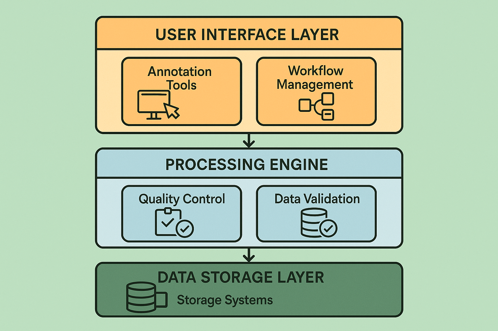

# Annotation System Architecture: Building Scalable Technology Platforms for Human Excellence

## Introduction: The Technology Foundation of Human Review Excellence

The architecture of annotation systems represents the technological backbone that enables sophisticated human review workflows to operate at enterprise scale while maintaining quality, efficiency, and user satisfaction. While workflow design defines the processes and procedures that guide human evaluation activities, system architecture provides the technological infrastructure that makes these workflows practical, scalable, and sustainable in real-world operational environments.

Modern annotation system architecture must address multiple complex requirements simultaneously: supporting diverse evaluation tasks and content types, scaling to handle enterprise workloads, providing intuitive user experiences that optimize reviewer productivity, ensuring data security and compliance, integrating seamlessly with existing technology ecosystems, and maintaining high availability and performance under varying load conditions. These requirements demand sophisticated architectural approaches that go far beyond simple task management or content presentation systems.

The most successful organizations recognize that annotation system architecture is not merely a technical implementation detail but a strategic capability that directly impacts their ability to deliver high-quality AI systems at scale. Poor architectural decisions can create bottlenecks that limit evaluation capacity, introduce quality issues that compromise system reliability, or create user experience problems that reduce reviewer productivity and satisfaction. Conversely, well-designed annotation system architecture enables organizations to scale evaluation operations efficiently while maintaining quality and building sustainable competitive advantages.

## Foundational Architectural Principles

### Scalability and Performance Design

The foundation of effective annotation system architecture lies in designing for scalability and performance from the outset rather than attempting to retrofit these capabilities as operational requirements grow. Scalability encompasses multiple dimensions including user capacity, data volume, computational load, and geographic distribution, each requiring specific architectural considerations and design patterns.

User scalability involves supporting growing numbers of concurrent reviewers without degrading system performance or user experience. This requires careful attention to session management, resource allocation, load balancing, and caching strategies. The architecture must handle peak usage periods gracefully while maintaining responsive performance during normal operations. Advanced systems implement auto-scaling capabilities that automatically adjust resources based on demand patterns and usage forecasts.

Data scalability addresses the challenges of managing increasingly large volumes of content to be evaluated, evaluation results, and associated metadata. This includes not only storage capacity but also data access patterns, query performance, and data lifecycle management. Modern architectures leverage distributed storage systems, intelligent caching, and data partitioning strategies to maintain performance as data volumes grow exponentially.

Computational scalability ensures that processing-intensive operations such as automated pre-processing, quality analysis, and reporting can scale to meet operational demands. This often requires distributed computing architectures, microservices design patterns, and intelligent workload distribution strategies that can leverage cloud computing resources effectively.

Geographic scalability enables organizations to support distributed teams of reviewers across multiple time zones and regions while maintaining consistent performance and user experience. This requires careful attention to content delivery networks, data replication strategies, and network optimization techniques that minimize latency and ensure reliable connectivity.

### Security and Compliance Framework

Annotation systems often handle sensitive or proprietary content that requires robust security measures and compliance with various regulatory requirements. The security framework must be designed as an integral part of the system architecture rather than an afterthought, ensuring that security measures do not compromise usability or performance while providing comprehensive protection against various threat vectors.

Data protection encompasses encryption at rest and in transit, access controls, audit logging, and data lifecycle management. The architecture must ensure that sensitive content is protected throughout the evaluation process while enabling authorized reviewers to access necessary information efficiently. Advanced systems implement zero-trust security models that verify every access request regardless of user location or device.

Access control systems must support complex organizational structures and role-based permissions while maintaining usability and administrative efficiency. This includes support for single sign-on integration, multi-factor authentication, and fine-grained permissions that can be managed at scale. The system must also support temporary access grants, delegation capabilities, and emergency access procedures.

Audit and compliance capabilities provide comprehensive logging and reporting of all system activities to support regulatory compliance and security monitoring. This includes detailed access logs, change tracking, and compliance reporting that can demonstrate adherence to various regulatory requirements such as GDPR, HIPAA, or industry-specific standards.

Privacy protection measures ensure that personally identifiable information and other sensitive data are handled appropriately throughout the evaluation process. This includes data anonymization capabilities, consent management, and privacy-preserving evaluation techniques that enable effective review while protecting individual privacy rights.

### Integration and Interoperability

Modern annotation systems must integrate seamlessly with existing organizational technology ecosystems including content management systems, workflow management platforms, quality assurance tools, and business intelligence systems. This integration capability is critical for operational efficiency and data consistency across the organization.

API design and management provide standardized interfaces for integration with external systems while maintaining security and performance requirements. The API architecture should follow industry standards and best practices while providing comprehensive functionality for common integration scenarios. Advanced systems implement API versioning, rate limiting, and comprehensive documentation to support sustainable integration relationships.

Data synchronization and consistency mechanisms ensure that information remains accurate and up-to-date across integrated systems while avoiding conflicts and data corruption. This includes real-time synchronization for critical data, batch processing for large data volumes, and conflict resolution strategies for handling simultaneous updates.

Workflow integration enables annotation processes to be embedded within larger organizational workflows and business processes. This includes support for external workflow engines, event-driven architectures, and standardized workflow definition languages that enable flexible integration with various business process management systems.

## Three-Tier Architecture Framework

### User Interface Layer: Optimizing Human-Computer Interaction

The user interface layer represents the primary point of interaction between human reviewers and the annotation system, making its design and implementation critical for overall system effectiveness. This layer must balance multiple competing requirements: providing comprehensive functionality while maintaining simplicity, supporting diverse evaluation tasks while ensuring consistency, and optimizing for efficiency while preserving usability.

**Interface Design Principles and Implementation**

Effective annotation interface design follows established human-computer interaction principles while addressing the specific cognitive and operational requirements of evaluation tasks. The interface must minimize cognitive overhead by presenting information clearly and logically, reducing unnecessary complexity, and providing intuitive navigation patterns that become second nature to experienced reviewers.

Information architecture plays a critical role in interface effectiveness. Content must be organized and presented in ways that support natural evaluation workflows while providing easy access to necessary context, criteria, and tools. This includes careful attention to information hierarchy, visual grouping, and progressive disclosure techniques that reveal additional detail when needed without overwhelming reviewers with unnecessary information.

Visual design elements including color schemes, typography, spacing, and iconography must be carefully selected to support extended use without causing fatigue or strain. The interface should provide sufficient contrast and readability while maintaining visual appeal and professional appearance. Accessibility considerations ensure that the interface can be used effectively by reviewers with various abilities and assistive technologies.

Interaction patterns must be designed to support efficient task completion while minimizing errors and providing clear feedback about system state and user actions. This includes consistent navigation patterns, clear action buttons, appropriate use of keyboard shortcuts, and responsive feedback that confirms user actions and system responses.

**Responsive Design and Multi-Device Support**

Modern annotation systems must support reviewers using various devices and screen sizes while maintaining consistent functionality and user experience. Responsive design techniques ensure that interfaces adapt appropriately to different screen sizes and input methods without compromising functionality or usability.

Mobile optimization enables reviewers to perform evaluation tasks using smartphones and tablets when appropriate, expanding operational flexibility and enabling more efficient use of reviewer time. However, mobile interfaces must be carefully designed to ensure that evaluation quality is not compromised by reduced screen real estate or different interaction patterns.

Cross-platform compatibility ensures that the annotation system functions consistently across different operating systems and web browsers while taking advantage of platform-specific capabilities when beneficial. This includes careful testing across various browser versions and operating systems to ensure consistent behavior and performance.

**Customization and Personalization Capabilities**

Advanced annotation interfaces provide customization and personalization capabilities that enable reviewers to optimize their work environment for maximum productivity and comfort. These capabilities must be balanced with the need for consistency and standardization across the organization.

Interface customization options might include adjustable layouts, configurable toolbars, personalized dashboards, and customizable keyboard shortcuts that enable experienced reviewers to work more efficiently. These customizations should be saved and synchronized across devices to provide consistent experience regardless of access location.

Personalization features can include adaptive interfaces that learn from reviewer behavior and preferences, personalized content recommendations, and customized reporting and analytics that provide relevant insights for individual reviewers and teams.

### Processing Engine: Orchestrating Evaluation Operations

The processing engine represents the core operational component of the annotation system, responsible for orchestrating evaluation workflows, managing data processing, implementing quality controls, and coordinating between various system components. This layer must be designed for reliability, scalability, and flexibility while maintaining high performance under varying operational conditions.

**Workflow Management and Orchestration**

Sophisticated workflow management capabilities enable the system to handle complex evaluation processes that may involve multiple reviewers, various evaluation stages, conditional logic, and integration with external systems. The workflow engine must be flexible enough to support diverse evaluation requirements while providing sufficient structure to ensure consistency and quality.

Workflow definition and configuration capabilities enable administrators to design and modify evaluation processes without requiring software development expertise. This includes visual workflow designers, template libraries, and configuration interfaces that make workflow management accessible to business users while maintaining necessary technical capabilities.

Dynamic workflow adaptation enables the system to modify evaluation processes based on content characteristics, reviewer performance, quality requirements, or other operational factors. This includes conditional branching, automatic escalation procedures, and adaptive quality controls that respond to changing conditions and requirements.

Parallel processing coordination enables multiple evaluation activities to proceed simultaneously while managing dependencies and ensuring data consistency. This includes task scheduling, resource allocation, and synchronization mechanisms that optimize throughput while maintaining quality and avoiding conflicts.

**Quality Control and Validation Systems**

Automated quality control systems provide real-time validation of evaluation activities while minimizing disruption to reviewer workflows. These systems must be sophisticated enough to catch meaningful quality issues while avoiding false positives that frustrate reviewers or slow down operations unnecessarily.

Rule-based validation systems implement configurable business rules that check for common quality issues such as incomplete evaluations, inconsistent scoring, or violations of evaluation guidelines. These rules should be easily configurable by administrators and provide clear feedback to reviewers when violations are detected.

Machine learning-based quality detection systems can identify subtle quality issues based on patterns learned from historical data and expert feedback. These systems continuously improve their detection capabilities based on new data and feedback while providing explanations for their assessments to maintain reviewer trust and understanding.

Statistical quality monitoring tracks evaluation patterns and identifies potential quality issues through statistical analysis of reviewer behavior, evaluation outcomes, and process metrics. This includes outlier detection, trend analysis, and comparative assessment that can identify systematic quality issues before they impact operations significantly.

**Data Processing and Management**

Comprehensive data processing capabilities ensure that content is prepared appropriately for evaluation while maintaining data integrity and security throughout the process. This includes content preprocessing, format conversion, metadata extraction, and data validation that prepare content for efficient evaluation.

Content preprocessing systems can automatically extract relevant information, identify potential quality issues, or provide initial assessments that support human evaluation activities. These systems should be designed to enhance rather than replace human judgment while providing valuable efficiency improvements.

Data validation and integrity checking ensure that content and evaluation data remain accurate and consistent throughout the evaluation process. This includes format validation, consistency checking, and error detection that prevent data corruption and ensure reliable evaluation outcomes.

Version control and change tracking capabilities maintain comprehensive records of all changes to content and evaluation data while supporting collaboration and quality assurance processes. This includes detailed audit trails, rollback capabilities, and conflict resolution mechanisms that ensure data integrity in collaborative environments.

### Data Storage Layer: Ensuring Reliability and Performance

The data storage layer provides the foundation for all annotation system operations, requiring careful design to ensure data reliability, performance, security, and scalability. This layer must handle diverse data types including content to be evaluated, evaluation results, user information, and system metadata while maintaining high availability and performance under varying load conditions.

**Database Design and Optimization**

Effective database design for annotation systems must balance multiple requirements including query performance, data consistency, scalability, and maintenance efficiency. The design must support complex queries for reporting and analytics while maintaining fast response times for interactive operations.

Schema design should be optimized for common access patterns while maintaining flexibility for evolving requirements. This includes careful attention to indexing strategies, data normalization, and partitioning approaches that optimize performance for typical workloads while supporting ad-hoc queries and reporting needs.

Performance optimization techniques include query optimization, caching strategies, connection pooling, and database tuning that ensure responsive performance under varying load conditions. Advanced systems implement automated performance monitoring and optimization that can identify and address performance issues proactively.

Backup and recovery procedures ensure that critical data is protected against loss while minimizing downtime in case of system failures. This includes regular backup schedules, disaster recovery procedures, and business continuity planning that ensure operational resilience.

**Distributed Storage and Replication**

Large-scale annotation systems often require distributed storage architectures that can handle massive data volumes while providing high availability and performance across geographic regions. These architectures must balance consistency, availability, and partition tolerance while meeting operational requirements.

Data replication strategies ensure that critical data is available across multiple locations while maintaining consistency and minimizing synchronization overhead. This includes master-slave replication, multi-master replication, and eventual consistency models that provide appropriate trade-offs between consistency and availability.

Sharding and partitioning strategies distribute data across multiple storage nodes to improve performance and scalability while maintaining data locality and minimizing cross-node queries. These strategies must be carefully designed to avoid hotspots and ensure balanced load distribution.

Content delivery and caching systems optimize data access performance by storing frequently accessed content closer to users while maintaining data consistency and security. This includes edge caching, content delivery networks, and intelligent cache invalidation strategies.

## Advanced Architectural Patterns

### Microservices Architecture and Service Decomposition

Modern annotation systems increasingly adopt microservices architectures that decompose system functionality into independent, loosely coupled services that can be developed, deployed, and scaled independently. This architectural approach provides significant benefits for complex systems while introducing new challenges that must be carefully managed.

Service decomposition strategies must balance service independence with operational efficiency while avoiding excessive complexity or communication overhead. Services should be designed around business capabilities and data ownership boundaries while maintaining clear interfaces and minimal dependencies.

Inter-service communication patterns include synchronous APIs, asynchronous messaging, and event-driven architectures that enable services to collaborate effectively while maintaining independence and resilience. These patterns must be carefully selected based on consistency requirements, performance needs, and operational constraints.

Service discovery and configuration management enable services to locate and communicate with each other dynamically while supporting deployment flexibility and operational resilience. This includes service registries, configuration servers, and dynamic routing capabilities that support complex deployment scenarios.

### Event-Driven Architecture and Real-Time Processing

Event-driven architectures enable annotation systems to respond to operational events in real-time while maintaining loose coupling between system components. This approach is particularly valuable for implementing real-time quality monitoring, automated workflows, and responsive user interfaces.

Event sourcing patterns capture all system changes as a sequence of events that can be replayed to reconstruct system state while providing comprehensive audit trails and supporting complex analytics. This approach is particularly valuable for annotation systems where understanding the evolution of evaluations and decisions is important.

Stream processing capabilities enable real-time analysis of evaluation activities, quality metrics, and operational patterns while supporting immediate response to quality issues or operational problems. This includes complex event processing, real-time analytics, and automated alerting systems.

Message queuing and event bus architectures provide reliable, scalable communication between system components while supporting complex routing, filtering, and transformation of events and messages. These systems must be designed for high availability and performance while maintaining message ordering and delivery guarantees when required.

### Cloud-Native Design and Deployment

Cloud-native architectures leverage cloud computing capabilities to provide scalability, resilience, and operational efficiency while reducing infrastructure management overhead. These architectures must be designed to take advantage of cloud services while avoiding vendor lock-in and maintaining operational flexibility.

Containerization and orchestration strategies enable consistent deployment and scaling of annotation system components while providing isolation and resource management capabilities. This includes container design, orchestration platform selection, and deployment automation that support efficient operations.

Auto-scaling and resource management capabilities automatically adjust system resources based on demand patterns while optimizing costs and maintaining performance. This includes horizontal scaling, vertical scaling, and predictive scaling strategies that respond to changing operational requirements.

Multi-cloud and hybrid deployment strategies provide operational resilience and flexibility while avoiding vendor lock-in and supporting diverse operational requirements. This includes cloud abstraction layers, data portability strategies, and disaster recovery planning that ensure business continuity.

## Implementation Strategies and Best Practices

### Technology Stack Selection and Integration

The selection of appropriate technologies for annotation system implementation requires careful evaluation of multiple factors including functionality, performance, scalability, security, cost, and long-term viability. The technology stack must support current requirements while providing flexibility for future evolution and growth.

Frontend technology selection should prioritize user experience, performance, and maintainability while supporting diverse devices and browsers. Modern frameworks provide sophisticated capabilities for building responsive, interactive interfaces while maintaining code quality and development efficiency.

Backend technology selection must balance performance, scalability, and development productivity while supporting integration requirements and operational constraints. The selection should consider factors such as ecosystem maturity, community support, and long-term viability.

Database technology selection depends on data characteristics, access patterns, consistency requirements, and scalability needs. Modern systems often employ polyglot persistence strategies that use different database technologies for different data types and access patterns.

### Development and Deployment Practices

Effective development and deployment practices ensure that annotation systems can be built, tested, and deployed reliably while maintaining quality and supporting rapid iteration and improvement. These practices must balance development velocity with operational stability and quality assurance.

Continuous integration and deployment pipelines automate testing, building, and deployment processes while ensuring that changes are validated thoroughly before reaching production environments. These pipelines should include comprehensive testing, security scanning, and performance validation.

Testing strategies must cover unit testing, integration testing, performance testing, and user acceptance testing while maintaining development velocity and ensuring comprehensive coverage. Automated testing is particularly important for complex systems with multiple integration points.

Monitoring and observability capabilities provide comprehensive visibility into system behavior, performance, and quality while supporting proactive issue detection and resolution. This includes application monitoring, infrastructure monitoring, and business metrics tracking.

### Security Implementation and Compliance

Security implementation must be integrated throughout the system architecture and development process rather than being added as an afterthought. This includes secure coding practices, security testing, and ongoing security monitoring and maintenance.

Authentication and authorization systems must support complex organizational requirements while maintaining usability and security. This includes integration with existing identity management systems, support for multi-factor authentication, and fine-grained access controls.

Data protection measures must ensure that sensitive information is protected throughout its lifecycle while supporting necessary business operations. This includes encryption, access controls, data masking, and secure data disposal procedures.

Compliance monitoring and reporting capabilities ensure that the system meets relevant regulatory requirements while providing evidence of compliance for auditing and certification purposes. This includes automated compliance checking, audit trail generation, and compliance reporting.

## Performance Optimization and Monitoring

### Performance Measurement and Analysis

Comprehensive performance measurement provides visibility into system behavior and identifies optimization opportunities while supporting capacity planning and operational decision-making. Performance metrics must cover all aspects of system operation including user experience, system throughput, resource utilization, and business outcomes.

User experience metrics include response times, page load times, error rates, and user satisfaction measures that directly impact reviewer productivity and satisfaction. These metrics should be monitored continuously and used to guide optimization efforts.

System performance metrics include throughput, latency, resource utilization, and availability measures that indicate overall system health and capacity. These metrics should be tracked at multiple levels including individual components, services, and end-to-end workflows.

Business performance metrics include evaluation throughput, quality measures, cost per evaluation, and reviewer productivity measures that indicate business value and operational efficiency. These metrics should be aligned with organizational objectives and used to guide strategic decisions.

### Optimization Strategies and Techniques

Performance optimization requires systematic analysis of system behavior and targeted improvements that address the most significant bottlenecks and inefficiencies. Optimization efforts should be guided by performance data and focused on areas with the greatest impact on user experience and business outcomes.

Database optimization techniques include query optimization, indexing strategies, caching, and schema design improvements that reduce database load and improve response times. These optimizations should be based on actual usage patterns and performance data.

Application optimization includes code optimization, algorithm improvements, caching strategies, and resource management improvements that reduce computational overhead and improve system efficiency. These optimizations should be validated through performance testing and monitoring.

Infrastructure optimization includes resource allocation, network optimization, and deployment configuration improvements that maximize hardware utilization and minimize operational costs while maintaining performance and reliability.

## Conclusion: Building Sustainable Technology Foundations

Annotation system architecture represents a critical foundation that enables organizations to scale human review operations effectively while maintaining quality, efficiency, and user satisfaction. The architectural decisions made during system design and implementation have long-lasting impacts on operational capabilities, costs, and competitive positioning.

The three-tier architecture framework presented in this section provides a comprehensive foundation for building scalable, reliable annotation systems that can evolve with changing requirements and growing operational demands. However, successful implementation requires careful adaptation to specific organizational contexts, requirements, and constraints.

The investment in sophisticated annotation system architecture pays dividends through improved operational efficiency, enhanced user experience, reduced operational costs, and increased scalability. Organizations that master these architectural capabilities gain significant advantages in their ability to deliver high-quality AI systems while building sustainable foundations for long-term success.

As evaluation requirements continue to evolve and operational scales continue to grow, the importance of robust annotation system architecture will only increase. Organizations that invest in building these capabilities today will be well-positioned to capitalize on future opportunities while managing the challenges of increasingly complex evaluation requirements.

---

**Next Steps**: Continue to [Quality Control and Validation](03-quality-control-validation.md) to learn how to implement rigorous quality assurance frameworks that ensure consistent evaluation quality across distributed teams and complex evaluation processes.

