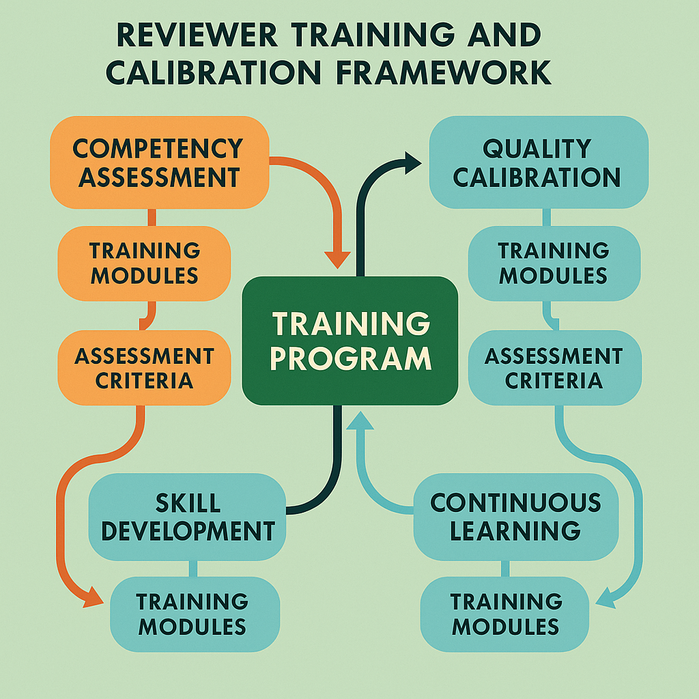

# Reviewer Training and Calibration: Building Competency and Consistency at Scale

## Introduction: The Strategic Foundation of Human Evaluation Excellence

Reviewer training and calibration represent the cornerstone of sustainable human evaluation excellence, transforming individual expertise into organizational capability while ensuring consistent quality across diverse teams, evaluation contexts, and operational scales. While technology platforms and workflow design provide the infrastructure for effective evaluation, the competency and consistency of human reviewers ultimately determine the quality, reliability, and business value of evaluation outcomes.

The challenge of reviewer training extends far beyond traditional educational approaches to encompass competency development, performance calibration, quality assurance, and continuous improvement within complex operational environments. Modern training programs must address multiple competing objectives simultaneously: developing deep expertise while maintaining evaluation consistency, scaling training delivery while preserving quality, accommodating diverse learning styles while ensuring standardized outcomes, and balancing theoretical knowledge with practical application skills.

Organizations that excel at reviewer training and calibration gain significant competitive advantages through superior evaluation quality, reduced operational risk, faster onboarding of new reviewers, and enhanced ability to scale evaluation operations while maintaining consistency. These capabilities become increasingly critical as evaluation requirements become more sophisticated and organizational scales continue to grow.

## Foundational Training Principles and Frameworks

### Competency-Based Learning Architecture

Effective reviewer training programs are built upon competency-based learning architectures that define specific knowledge, skills, and abilities required for successful evaluation performance while providing structured pathways for competency development and assessment. This approach ensures that training efforts are focused on outcomes that directly impact evaluation quality and operational effectiveness.

Competency frameworks must be comprehensive enough to address all aspects of evaluation performance while remaining practical for training design and assessment purposes. These frameworks should encompass technical knowledge about evaluation criteria and procedures, analytical skills for assessing content quality and appropriateness, communication abilities for documenting evaluation outcomes and collaborating with team members, and judgment capabilities for handling ambiguous or complex evaluation scenarios.

Learning objective hierarchies organize competencies into logical progressions that support systematic skill development while accommodating different starting points and learning paces. These hierarchies should distinguish between foundational competencies that all reviewers must master and specialized competencies that may be required for specific evaluation types or roles.

Assessment and validation strategies ensure that competency development is measured accurately and consistently while providing meaningful feedback for improvement. These strategies should include both formative assessments that support learning and summative assessments that validate competency achievement while maintaining appropriate standards for evaluation quality and consistency.

### Adult Learning and Cognitive Psychology Integration

Reviewer training programs must be designed with deep understanding of adult learning principles and cognitive psychology to maximize learning effectiveness while accommodating the diverse backgrounds, experiences, and learning preferences of professional reviewers. This requires sophisticated instructional design that goes beyond simple information transfer to encompass skill development, judgment calibration, and performance optimization.

Experiential learning approaches leverage reviewers' professional experience and expertise while providing structured opportunities to apply new knowledge and skills in realistic evaluation contexts. These approaches should balance guided practice with independent application while providing appropriate feedback and support for skill development.

Cognitive load management ensures that training programs present information and activities in ways that optimize learning while avoiding cognitive overload that can impair comprehension and retention. This includes careful sequencing of learning activities, appropriate use of multimedia and interactive elements, and strategic use of practice and reinforcement activities.

Social learning integration recognizes that much professional learning occurs through interaction with peers and mentors rather than through formal instruction alone. Training programs should incorporate collaborative learning activities, peer feedback mechanisms, and mentoring relationships that leverage collective expertise while building professional networks and support systems.

### Continuous Calibration and Performance Optimization

Reviewer calibration represents an ongoing process of aligning individual evaluation approaches with organizational standards and peer performance while maintaining appropriate flexibility for legitimate differences in expertise and judgment. Effective calibration requires systematic measurement of evaluation consistency, targeted interventions for performance improvement, and continuous monitoring of calibration effectiveness.

Baseline establishment involves measuring initial reviewer performance and consistency to identify strengths, development needs, and calibration requirements. This baseline should be comprehensive enough to guide training design while remaining practical for operational implementation.

Calibration exercises provide structured opportunities for reviewers to practice evaluation skills while receiving feedback on consistency and accuracy. These exercises should use carefully selected content that represents typical evaluation challenges while providing clear learning objectives and success criteria.

Performance monitoring and feedback systems provide ongoing assessment of reviewer performance and calibration while identifying opportunities for additional training or support. These systems should be designed to support improvement rather than punitive management while maintaining appropriate quality standards and expectations.

## Four-Component Training Framework

### Component 1: Competency Assessment and Baseline Establishment

Comprehensive competency assessment provides the foundation for effective training program design by identifying individual reviewer strengths, development needs, and learning preferences while establishing baseline performance measures that can guide training customization and track improvement over time.

**Multi-Dimensional Assessment Strategy**

Effective competency assessment must evaluate multiple dimensions of reviewer capability including technical knowledge, analytical skills, judgment quality, communication effectiveness, and collaboration abilities. This multi-dimensional approach ensures comprehensive understanding of reviewer capabilities while identifying specific areas for development and improvement.

Technical knowledge assessment evaluates reviewer understanding of evaluation criteria, procedures, quality standards, and domain-specific requirements. This assessment should be comprehensive enough to identify knowledge gaps while remaining practical for administration and scoring. Advanced assessment techniques might include scenario-based questions, case study analysis, or practical application exercises that test knowledge application rather than simple recall.

Analytical skills assessment measures reviewer ability to analyze content systematically, identify quality issues, apply evaluation criteria consistently, and draw appropriate conclusions based on available evidence. This assessment should use realistic evaluation scenarios that require complex analysis and judgment while providing objective measures of analytical quality and consistency.

Judgment quality assessment evaluates reviewer ability to make appropriate decisions in ambiguous or complex situations while maintaining consistency with organizational standards and peer performance. This assessment is particularly challenging because it requires evaluation of subjective judgment while maintaining objective assessment criteria.

Communication skills assessment measures reviewer ability to document evaluation outcomes clearly, provide constructive feedback, and collaborate effectively with team members and stakeholders. This assessment should evaluate both written and verbal communication while considering the specific communication requirements of evaluation roles.

**Baseline Performance Measurement**

Baseline performance measurement establishes initial performance levels across all competency dimensions while providing reference points for tracking improvement and calibration effectiveness. This measurement should be comprehensive and objective while remaining practical for operational implementation.

Standardized evaluation exercises provide controlled assessment opportunities using carefully selected content that represents typical evaluation challenges while enabling objective comparison of reviewer performance. These exercises should be designed to assess multiple competency dimensions simultaneously while providing clear scoring criteria and performance standards.

Comparative analysis measures individual reviewer performance relative to peer performance and organizational standards while identifying specific areas where calibration or additional training may be needed. This analysis should account for legitimate differences in expertise and experience while identifying performance patterns that may indicate training needs.

Historical performance analysis examines reviewer performance trends over time to identify patterns, improvement opportunities, and potential quality issues. This analysis should consider factors such as content type, evaluation complexity, and operational conditions that may influence performance while providing insights for training customization.

**Learning Style and Preference Assessment**

Understanding individual learning styles and preferences enables training customization that maximizes learning effectiveness while accommodating diverse reviewer backgrounds and experiences. This assessment should inform training design and delivery while maintaining consistency in learning outcomes and performance standards.

Learning style assessment identifies individual preferences for information processing, learning activities, and feedback mechanisms while providing insights for training customization. This assessment should be practical and actionable while avoiding oversimplification of complex learning processes.

Experience and background analysis examines reviewer professional experience, domain expertise, and previous training to identify relevant knowledge and skills that can be leveraged in training design. This analysis should inform training customization while ensuring that all reviewers achieve necessary competency levels.

Motivation and goal assessment identifies individual reviewer motivations, career objectives, and learning goals to ensure that training programs align with personal and professional development needs. This assessment can improve training engagement and effectiveness while supporting reviewer retention and satisfaction.

### Component 2: Skill Development and Knowledge Transfer

Systematic skill development provides structured learning experiences that build reviewer competencies progressively while ensuring comprehensive coverage of all necessary knowledge and skills. This component must balance theoretical understanding with practical application while accommodating diverse learning needs and preferences.

**Modular Learning Architecture**

Modular learning design organizes training content into logical units that can be completed independently while building toward comprehensive competency development. This approach provides flexibility for different learning paces and schedules while ensuring systematic coverage of all necessary topics.

Core competency modules address fundamental knowledge and skills that all reviewers must master regardless of their specific roles or specializations. These modules should provide comprehensive coverage of evaluation principles, quality standards, procedures, and basic analytical skills while establishing common foundations for advanced learning.

Specialized competency modules address specific knowledge and skills required for particular evaluation types, content domains, or organizational roles. These modules should build upon core competencies while providing deep expertise in specialized areas that may not be relevant for all reviewers.

Progressive skill building sequences organize learning activities to support systematic competency development while ensuring that prerequisite knowledge and skills are established before advancing to more complex topics. These sequences should be flexible enough to accommodate different starting points while maintaining logical progression toward competency goals.

**Interactive Learning Methodologies**

Interactive learning approaches engage reviewers actively in the learning process while providing opportunities for practice, feedback, and skill application. These approaches should be varied and engaging while maintaining focus on competency development and performance improvement.

Case-based learning uses realistic evaluation scenarios to provide practical application opportunities while illustrating key concepts and principles. These cases should be carefully selected to represent typical evaluation challenges while providing clear learning objectives and discussion points.

Simulation exercises provide safe environments for practicing evaluation skills while receiving feedback and guidance. These exercises should be realistic enough to provide meaningful learning experiences while allowing for experimentation and mistake-making without operational consequences.

Collaborative learning activities leverage peer expertise and experience while building professional networks and support systems. These activities should be structured to ensure productive collaboration while accommodating different expertise levels and learning styles.

Mentoring and coaching relationships provide personalized guidance and support while leveraging experienced reviewer expertise for skill development. These relationships should be structured and supported while maintaining flexibility for individual needs and preferences.

**Knowledge Validation and Reinforcement**

Knowledge validation ensures that learning objectives are achieved while providing feedback for improvement and additional learning needs. This validation should be comprehensive and objective while supporting continued learning and development.

Formative assessment activities provide ongoing feedback during the learning process while identifying areas that may need additional attention or reinforcement. These assessments should be frequent and low-stakes while providing meaningful feedback for learning improvement.

Summative assessment activities validate competency achievement while ensuring that reviewers meet necessary performance standards before advancing to operational responsibilities. These assessments should be comprehensive and rigorous while providing clear feedback for any additional learning needs.

Practical application exercises provide opportunities to apply learned knowledge and skills in realistic contexts while receiving feedback and guidance. These exercises should bridge the gap between training and operational performance while building confidence and competency.

### Component 3: Quality Calibration and Consistency Training

Quality calibration ensures that individual reviewer approaches align with organizational standards and peer performance while maintaining appropriate flexibility for legitimate differences in expertise and judgment. This component requires sophisticated approaches that balance standardization with professional autonomy while building sustainable consistency across diverse evaluation contexts.

**Calibration Exercise Design and Implementation**

Calibration exercises provide structured opportunities for reviewers to practice evaluation skills while receiving feedback on consistency and accuracy relative to established standards and peer performance. These exercises must be carefully designed to provide meaningful learning experiences while accurately measuring calibration effectiveness.

Reference standard development involves creating high-quality evaluation examples that represent organizational standards and expectations while providing clear benchmarks for calibration assessment. These standards should be developed collaboratively with experienced reviewers and subject matter experts while being regularly updated based on experience and feedback.

Blind calibration exercises prevent bias and gaming by concealing reference standards and peer responses while enabling objective assessment of reviewer consistency and accuracy. These exercises should be realistic and challenging while providing clear feedback about performance relative to standards and peers.

Collaborative calibration sessions bring reviewers together to discuss evaluation approaches, share perspectives, and work toward consensus on challenging evaluation scenarios. These sessions should be facilitated effectively while encouraging open discussion and learning from diverse perspectives.

Iterative calibration processes provide multiple opportunities for reviewers to practice and improve their calibration while tracking progress over time. These processes should be systematic and regular while remaining engaging and supportive rather than punitive or stressful.

**Consistency Measurement and Analysis**

Consistency measurement provides objective assessment of reviewer alignment with standards and peers while identifying specific areas where additional calibration may be needed. This measurement should be comprehensive and accurate while providing actionable feedback for improvement.

Inter-rater reliability analysis measures agreement between reviewers on the same content while identifying patterns of disagreement that may indicate calibration needs. This analysis should account for legitimate differences in expertise while identifying systematic inconsistencies that require attention.

Standard deviation analysis measures the variability in reviewer responses while identifying reviewers who may be consistently high or low relative to peers. This analysis should consider content characteristics and evaluation complexity while providing insights for targeted calibration efforts.

Bias detection analysis identifies systematic patterns in reviewer responses that may indicate bias, misunderstanding, or calibration issues. This analysis should be conducted sensitively while providing constructive feedback for improvement rather than punitive consequences.

Trend analysis tracks changes in reviewer consistency over time while identifying the effectiveness of calibration efforts and training interventions. This analysis should inform ongoing calibration strategies while celebrating improvement and identifying continued development needs.

**Feedback and Coaching Integration**

Effective feedback and coaching transform calibration data into actionable improvement strategies while supporting reviewer development and maintaining positive learning environments. This integration requires skilled facilitation and coaching capabilities that go beyond simple performance measurement.

Individual feedback sessions provide personalized guidance based on calibration performance while identifying specific improvement strategies and development opportunities. These sessions should be supportive and developmental while maintaining clear expectations for performance improvement.

Group feedback sessions enable peer learning and shared problem-solving while building collective understanding of evaluation standards and approaches. These sessions should be facilitated effectively while encouraging open discussion and collaborative learning.

Coaching and mentoring relationships provide ongoing support for calibration improvement while leveraging experienced reviewer expertise for skill development. These relationships should be structured and supported while maintaining flexibility for individual needs and learning styles.

Performance improvement planning provides structured approaches for addressing calibration issues while setting clear expectations and timelines for improvement. These plans should be collaborative and supportive while maintaining accountability for performance standards.

### Component 4: Continuous Learning and Professional Development

Continuous learning ensures that reviewer capabilities remain current with evolving requirements, technologies, and best practices while providing career development opportunities and professional growth. This component must balance organizational needs with individual development goals while building sustainable learning cultures that support long-term success.

**Ongoing Education and Skill Enhancement**

Ongoing education programs provide regular opportunities for reviewers to update their knowledge and skills while staying current with industry developments and organizational changes. These programs should be relevant and engaging while accommodating busy operational schedules and diverse learning preferences.

Industry trend analysis and education keep reviewers informed about developments in AI technology, evaluation methodologies, and industry best practices while providing context for their work and career development. This education should be practical and applicable while building broader professional knowledge and expertise.

Advanced skill development programs provide opportunities for experienced reviewers to develop specialized expertise or leadership capabilities while supporting career advancement and organizational capability building. These programs should be challenging and rewarding while aligning with organizational needs and individual goals.

Cross-training and rotation programs enable reviewers to develop broader expertise while providing operational flexibility and career development opportunities. These programs should be structured and supported while maintaining quality standards and operational effectiveness.

Professional certification and credentialing programs provide external validation of reviewer expertise while supporting career development and professional recognition. These programs should be relevant and valuable while aligning with organizational standards and industry requirements.

**Performance Monitoring and Development Planning**

Performance monitoring provides ongoing assessment of reviewer development and effectiveness while identifying opportunities for additional training, coaching, or career development. This monitoring should be supportive and developmental while maintaining appropriate performance standards and expectations.

Regular performance reviews provide structured opportunities to assess reviewer development, discuss career goals, and plan future learning and development activities. These reviews should be collaborative and forward-looking while addressing any performance issues or development needs.

Individual development planning helps reviewers identify career goals and learning objectives while creating structured pathways for achieving these goals. These plans should be realistic and achievable while aligning with organizational needs and opportunities.

Skill gap analysis identifies areas where additional training or development may be needed while informing strategic decisions about training investments and priorities. This analysis should be comprehensive and objective while providing actionable insights for improvement.

Career pathway development provides clear progression opportunities for reviewers while supporting retention and motivation. These pathways should be realistic and achievable while providing meaningful advancement opportunities and professional growth.

## Advanced Training Methodologies and Technologies

### Technology-Enhanced Learning Platforms

Modern training programs increasingly leverage technology platforms that provide scalable, personalized, and engaging learning experiences while maintaining quality and consistency across diverse learner populations. These platforms must balance technological sophistication with usability and effectiveness while supporting various learning styles and preferences.

**Adaptive Learning Systems**

Adaptive learning technologies personalize training experiences based on individual learner progress, preferences, and performance while optimizing learning efficiency and effectiveness. These systems can significantly improve training outcomes while reducing time and resource requirements for competency development.

Personalized learning paths adjust training content and activities based on individual learner needs, preferences, and progress while ensuring that all necessary competencies are developed. These paths should be flexible and responsive while maintaining consistency in learning outcomes and performance standards.

Intelligent tutoring systems provide personalized guidance and feedback while adapting to individual learning styles and needs. These systems can supplement human instruction while providing scalable support for diverse learner populations.

Performance analytics and insights provide detailed information about learner progress, engagement, and effectiveness while identifying opportunities for improvement and optimization. These analytics should be actionable and meaningful while protecting learner privacy and confidentiality.

**Virtual and Augmented Reality Applications**

Immersive learning technologies provide realistic training environments that enable safe practice and experimentation while building confidence and competency. These technologies are particularly valuable for complex or high-stakes evaluation scenarios that may be difficult to replicate in traditional training environments.

Virtual evaluation environments simulate realistic evaluation scenarios while providing controlled learning experiences that enable practice and feedback without operational consequences. These environments should be realistic and engaging while providing clear learning objectives and assessment criteria.

Augmented reality assistance can provide real-time guidance and information during training activities while building familiarity with technology-enhanced evaluation tools. These applications should enhance rather than distract from learning while building comfort with advanced evaluation technologies.

Collaborative virtual spaces enable distributed teams to participate in training activities together while building relationships and shared understanding. These spaces should be engaging and functional while supporting effective collaboration and learning.

### Microlearning and Just-in-Time Training

Microlearning approaches break training content into small, focused units that can be completed quickly while fitting into busy operational schedules. This approach can improve learning retention and application while reducing the burden of extended training programs.

**Bite-Sized Learning Modules**

Short-form content modules address specific learning objectives while providing focused, actionable knowledge and skills. These modules should be self-contained and practical while building toward comprehensive competency development.

Mobile-friendly delivery enables reviewers to access training content using smartphones and tablets while accommodating various schedules and locations. This delivery should be optimized for mobile devices while maintaining learning effectiveness and engagement.

Spaced repetition techniques optimize learning retention by presenting content at strategic intervals while reinforcing key concepts and skills. These techniques should be evidence-based and effective while remaining practical for operational implementation.

**Performance Support Systems**

Just-in-time learning provides immediate access to relevant information and guidance when needed while supporting performance improvement and problem-solving. These systems should be easily accessible and practical while providing accurate and current information.

Interactive job aids provide quick reference materials and guidance while supporting consistent evaluation performance. These aids should be practical and easy to use while providing comprehensive coverage of necessary information and procedures.

Expert consultation systems enable reviewers to access experienced guidance when needed while building expertise and confidence. These systems should be responsive and helpful while managing expert time and availability effectively.

## Implementation Strategies and Best Practices

### Program Design and Curriculum Development

Effective training program implementation requires systematic design and development processes that ensure comprehensive coverage of necessary competencies while maintaining engagement and effectiveness. This design should be based on thorough needs analysis and learning objectives while incorporating best practices from instructional design and adult education.

**Needs Analysis and Requirements Definition**

Comprehensive needs analysis identifies specific training requirements based on organizational objectives, performance gaps, and operational requirements while providing foundation for training design and development. This analysis should be thorough and objective while remaining practical for implementation.

Stakeholder consultation ensures that training programs address the needs and expectations of all relevant parties including reviewers, managers, quality assurance staff, and organizational leadership. This consultation should be inclusive and collaborative while maintaining focus on training effectiveness and business value.

Performance gap analysis identifies specific differences between current and desired reviewer performance while providing targeted focus for training design and development. This analysis should be comprehensive and objective while providing actionable insights for improvement.

Learning objective development translates performance requirements into specific, measurable learning objectives that guide training design and assessment. These objectives should be clear and achievable while aligning with organizational standards and expectations.

**Curriculum Architecture and Sequencing**

Logical curriculum organization ensures that training content is presented in sequences that support effective learning while building systematically toward competency goals. This organization should be based on learning science principles while remaining practical for implementation and delivery.

Prerequisite mapping identifies knowledge and skills that must be established before advancing to more complex topics while ensuring that learners are prepared for each stage of training. This mapping should be comprehensive and accurate while providing clear guidance for learning progression.

Integration and reinforcement strategies ensure that learning is consolidated and retained while building connections between different topics and competencies. These strategies should be evidence-based and effective while remaining practical for implementation.

Assessment integration embeds evaluation activities throughout the training program while providing ongoing feedback and validation of learning progress. This integration should be seamless and supportive while maintaining rigor and objectivity.

### Delivery and Facilitation Excellence

Effective training delivery requires skilled facilitation and instruction that engages learners while maintaining focus on competency development and performance improvement. This delivery should be professional and effective while accommodating diverse learning styles and preferences.

**Instructor Development and Certification**

Instructor qualification and training ensure that training delivery meets quality standards while providing effective learning experiences for reviewers. This qualification should be comprehensive and rigorous while providing ongoing support and development for instructors.

Facilitation skills development provides instructors with necessary capabilities for managing group dynamics, encouraging participation, and supporting learning while maintaining program objectives and standards. These skills should be practical and effective while being regularly updated and reinforced.

Subject matter expertise ensures that instructors have necessary knowledge and experience to provide credible and valuable instruction while answering questions and providing guidance. This expertise should be current and comprehensive while being regularly validated and updated.

Teaching methodology training provides instructors with evidence-based approaches for effective instruction while accommodating diverse learning styles and preferences. This training should be practical and applicable while being based on current research and best practices.

**Engagement and Motivation Strategies**

Learner engagement techniques maintain interest and participation while supporting effective learning and competency development. These techniques should be varied and appropriate while maintaining focus on learning objectives and outcomes.

Motivation and incentive systems encourage participation and performance while supporting learning goals and organizational objectives. These systems should be fair and effective while avoiding unintended consequences or gaming behaviors.

Recognition and celebration acknowledge learning achievements and progress while building positive learning cultures and supporting continued development. This recognition should be meaningful and appropriate while maintaining focus on performance improvement and business value.

Feedback and coaching provide ongoing support and guidance while helping learners improve their performance and achieve their goals. This support should be timely and constructive while maintaining appropriate standards and expectations.

## Measuring Training Effectiveness and ROI

### Comprehensive Evaluation Framework

Training program evaluation must assess multiple dimensions of effectiveness including learning outcomes, performance improvement, operational impact, and return on investment while providing insights for continuous improvement and optimization. This evaluation should be systematic and objective while remaining practical for operational implementation.

**Kirkpatrick Model Implementation**

Level 1 evaluation measures learner satisfaction and engagement while providing feedback about training quality and effectiveness. This evaluation should be comprehensive and actionable while providing insights for program improvement.

Level 2 evaluation assesses learning achievement and competency development while validating that training objectives have been met. This evaluation should be objective and rigorous while providing clear evidence of learning outcomes.

Level 3 evaluation measures behavior change and performance improvement while assessing the transfer of learning to operational performance. This evaluation should be comprehensive and objective while accounting for factors that may influence performance beyond training.

Level 4 evaluation assesses business impact and return on investment while demonstrating the value of training investments. This evaluation should be thorough and credible while providing insights for strategic decision-making about training priorities and investments.

**Performance Metrics and Analytics**

Training effectiveness metrics provide quantitative measures of program success while identifying areas for improvement and optimization. These metrics should be meaningful and actionable while being regularly monitored and analyzed.

Learning analytics provide detailed insights into learner behavior, progress, and outcomes while identifying patterns and trends that can inform program improvement. These analytics should be comprehensive and actionable while protecting learner privacy and confidentiality.

Performance improvement tracking measures changes in reviewer performance following training while accounting for other factors that may influence performance. This tracking should be objective and comprehensive while providing insights for training effectiveness and business value.

Cost-benefit analysis evaluates the financial impact of training investments while demonstrating return on investment and informing strategic decisions about training priorities. This analysis should be thorough and credible while considering both direct and indirect costs and benefits.

## Conclusion: Building Sustainable Learning Excellence

Reviewer training and calibration represent critical investments that enable organizations to build sustainable human evaluation capabilities while maintaining quality, consistency, and operational effectiveness at scale. The four-component framework and advanced methodologies presented in this section provide comprehensive approaches for developing reviewer competencies while supporting career development and organizational success.

Successful training implementation requires careful balance between standardization and personalization, efficiency and effectiveness, and organizational needs and individual development goals. Organizations must adapt these frameworks to their specific contexts and requirements while maintaining focus on continuous improvement and stakeholder value.

The investment in sophisticated training and calibration capabilities pays dividends through improved evaluation quality, reduced operational risk, enhanced reviewer satisfaction and retention, and competitive advantage. Organizations that master these capabilities gain significant advantages in their ability to scale evaluation operations while maintaining excellence and building sustainable foundations for long-term success.

As evaluation requirements continue to evolve and organizational scales continue to grow, the importance of robust training and calibration capabilities will only increase. Organizations that invest in building these capabilities today will be well-positioned to capitalize on future opportunities while managing the challenges of increasingly sophisticated evaluation requirements and competitive pressures.

---

**Next Steps**: Continue to [Bias Detection and Mitigation](05-bias-detection-mitigation.md) to learn how to identify and address systematic biases in human evaluation while maintaining evaluation quality and fairness across diverse content types and reviewer populations.

