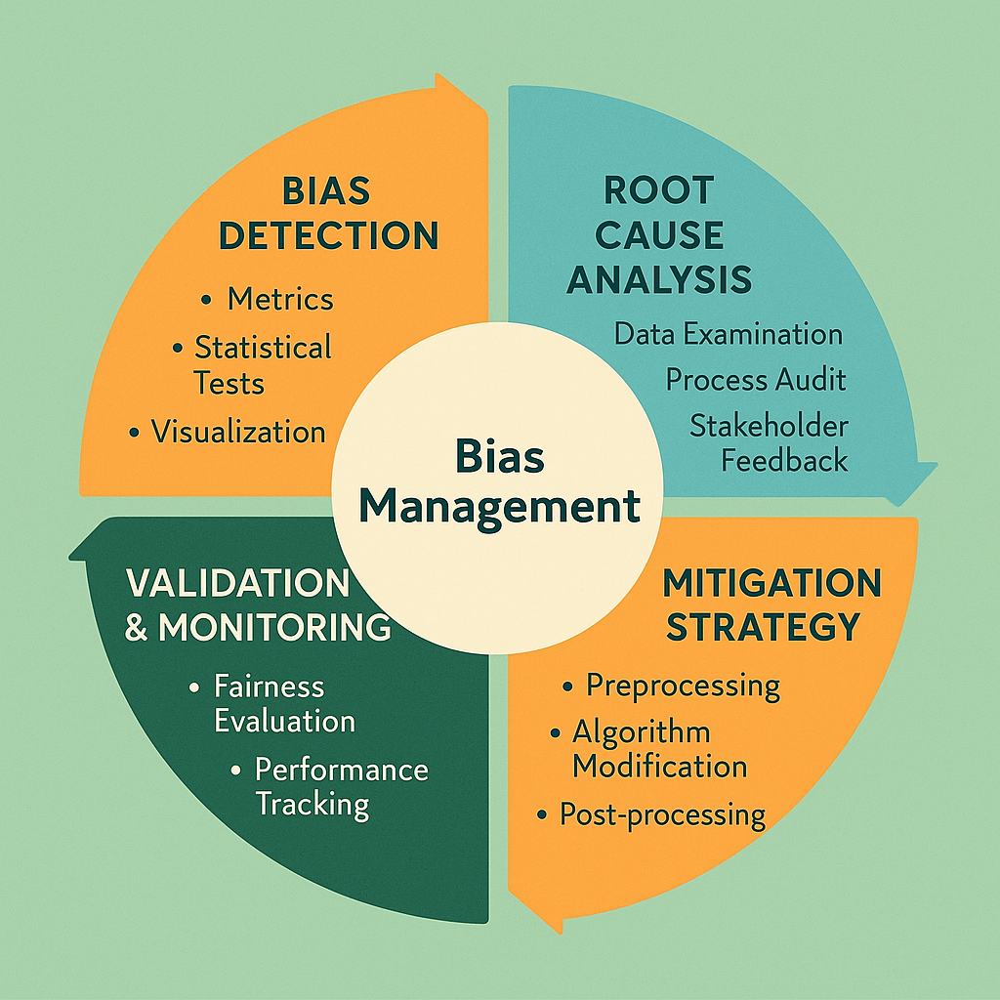

# Bias Detection and Mitigation: Ensuring Fairness and Objectivity in Human Evaluation

## Introduction: The Critical Challenge of Evaluation Bias

Bias detection and mitigation represent fundamental challenges in human evaluation systems that can significantly impact the fairness, accuracy, and business value of evaluation outcomes while creating legal, ethical, and operational risks for organizations. While human judgment brings essential capabilities including contextual understanding, creative assessment, and nuanced reasoning to evaluation processes, it also introduces potential for systematic biases that can compromise evaluation quality and organizational objectives.

The challenge of bias in human evaluation extends beyond simple prejudice or discrimination to encompass cognitive biases, systematic errors, cultural influences, and structural inequities that can affect evaluation outcomes in subtle but significant ways. These biases can manifest at individual, group, and organizational levels while being influenced by factors including personal experience, cultural background, training, incentives, and operational pressures.

Organizations that fail to address evaluation bias effectively face significant risks including poor decision-making based on biased evaluation outcomes, legal liability for discriminatory practices, reputational damage from unfair treatment, reduced evaluation quality and reliability, and competitive disadvantage from suboptimal resource allocation. Conversely, organizations that excel at bias detection and mitigation gain advantages through improved evaluation quality, enhanced fairness and equity, reduced legal and reputational risk, and better business outcomes from more accurate evaluation.

## Understanding Bias Types and Sources

### Cognitive Bias Categories

Human evaluation is susceptible to numerous cognitive biases that can systematically distort judgment and decision-making while being difficult to detect and address through traditional quality control approaches. Understanding these bias categories is essential for developing effective detection and mitigation strategies.

**Confirmation and Anchoring Biases**

Confirmation bias leads evaluators to seek information that confirms their initial impressions while discounting contradictory evidence, resulting in evaluation outcomes that reflect preconceptions rather than objective assessment. This bias is particularly problematic in complex evaluation scenarios where multiple interpretations may be valid and comprehensive analysis is required for accurate assessment.

Anchoring bias causes evaluators to rely too heavily on initial information or impressions while failing to adjust adequately based on subsequent evidence. This bias can be especially problematic in sequential evaluation processes where early assessments influence later judgments, creating systematic distortions that compound over time.

Availability bias leads evaluators to overweight easily recalled information while underweighting less memorable but potentially more relevant evidence. This bias can be influenced by recent experiences, vivid examples, or frequently encountered scenarios while creating systematic distortions in evaluation outcomes.

**Social and Cultural Biases**

In-group bias leads evaluators to favor content, perspectives, or approaches that align with their own backgrounds, experiences, or group memberships while potentially disadvantaging different viewpoints or approaches. This bias can be particularly problematic in diverse evaluation contexts where fairness across different groups is essential.

Cultural bias reflects systematic differences in evaluation approaches based on cultural background, values, or experiences while potentially creating unfair advantages or disadvantages for content that aligns with or differs from evaluator cultural perspectives. This bias requires careful attention in global organizations or diverse evaluation contexts.

Authority bias leads evaluators to defer inappropriately to perceived expertise or status while potentially compromising independent judgment and evaluation quality. This bias can be problematic in hierarchical organizations or when evaluating content from recognized experts or authorities.

**Temporal and Contextual Biases**

Recency bias leads evaluators to overweight recent information or experiences while underweighting earlier evidence that may be equally or more relevant. This bias can be particularly problematic in longitudinal evaluation processes or when evaluating content that changes over time.

Halo effect causes overall impressions to influence specific evaluations while creating systematic correlations between different evaluation dimensions that may not reflect actual content quality. This bias can compromise the independence and accuracy of multi-dimensional evaluation approaches.

Fatigue and order effects influence evaluation quality based on when evaluations are conducted or the sequence in which content is reviewed while creating systematic variations that may not reflect actual content differences. These effects require careful attention in operational evaluation processes.

### Structural and Systematic Bias Sources

Beyond individual cognitive biases, evaluation systems can exhibit structural biases that emerge from organizational design, incentive systems, training approaches, or operational processes while creating systematic distortions that may be difficult to detect through individual-focused approaches.

**Organizational and Incentive Biases**

Performance incentive misalignment can create systematic biases when evaluation criteria or rewards encourage behaviors that compromise evaluation quality or fairness while optimizing for metrics that may not align with organizational objectives or stakeholder value.

Resource and time pressure can lead to systematic shortcuts or simplified evaluation approaches that may introduce bias while compromising evaluation quality and consistency. These pressures require careful management to maintain evaluation integrity while meeting operational requirements.

Training and calibration gaps can create systematic differences in evaluation approaches between different evaluators or groups while introducing biases that reflect training limitations rather than content differences. These gaps require ongoing attention and systematic approaches for detection and correction.

**Data and Sampling Biases**

Selection bias in evaluation content can create systematic distortions when the content being evaluated is not representative of the broader population or use cases while leading to evaluation outcomes that may not generalize appropriately to operational contexts.

Representation bias occurs when evaluation datasets or scenarios systematically under-represent or over-represent certain groups, perspectives, or use cases while creating evaluation outcomes that may not be fair or accurate across diverse contexts.

Historical bias can perpetuate past inequities or errors when evaluation approaches, criteria, or standards reflect historical biases while failing to account for changing contexts, values, or requirements that may require different evaluation approaches.

## Four-Stage Bias Detection and Mitigation Framework

### Stage 1: Bias Detection and Measurement

Effective bias detection requires systematic approaches that can identify both obvious and subtle biases while providing objective measures of bias magnitude and impact. This detection must be comprehensive and ongoing while remaining practical for operational implementation.

**Statistical Analysis and Pattern Recognition**

Systematic statistical analysis provides objective measures of potential bias while identifying patterns that may not be apparent through casual observation or individual assessment. This analysis should be comprehensive and regular while being accessible to non-statistical stakeholders.

Demographic analysis examines evaluation outcomes across different demographic groups while identifying systematic differences that may indicate bias. This analysis should be conducted sensitively and appropriately while providing actionable insights for bias mitigation.

Performance variance analysis identifies systematic differences in evaluation outcomes that cannot be explained by content quality differences while highlighting potential sources of bias or systematic error. This analysis should account for legitimate factors that may influence evaluation while identifying unexplained variance that may indicate bias.

Temporal trend analysis examines changes in evaluation patterns over time while identifying systematic shifts that may indicate emerging bias or the effectiveness of mitigation efforts. This analysis should consider operational changes and external factors while providing insights for ongoing bias management.

**Inter-Evaluator Consistency Analysis**

Systematic comparison of evaluation outcomes between different evaluators provides insights into potential bias while identifying evaluators or groups that may exhibit systematic differences in evaluation approaches. This analysis should be conducted constructively while providing feedback for improvement rather than punitive consequences.

Agreement analysis measures the consistency of evaluation outcomes between different evaluators while identifying areas where systematic disagreement may indicate bias, training needs, or evaluation criteria ambiguity. This analysis should account for legitimate differences in expertise while identifying concerning patterns.

Calibration assessment evaluates how well individual evaluators align with established standards or peer consensus while identifying systematic deviations that may indicate bias or training needs. This assessment should be regular and constructive while providing clear feedback for improvement.

Blind evaluation comparison uses concealed evaluator identity to assess whether systematic differences exist between evaluators while eliminating potential influence from knowledge of evaluator characteristics or reputation. This comparison should be conducted ethically while providing objective insights into evaluation consistency.

**Content and Context Analysis**

Systematic analysis of evaluation outcomes across different content types, contexts, or characteristics can reveal biases that may not be apparent when examining individual evaluations while providing insights into systematic patterns that require attention.

Content characteristic analysis examines whether evaluation outcomes vary systematically based on content characteristics that should not influence evaluation while identifying potential sources of inappropriate bias. This analysis should be comprehensive while focusing on characteristics that are relevant to bias detection.

Context sensitivity analysis evaluates whether evaluation outcomes are appropriately influenced by relevant contextual factors while identifying inappropriate sensitivity to irrelevant factors that may indicate bias. This analysis requires careful consideration of which contextual factors should and should not influence evaluation.

Comparative analysis across different content domains or evaluation contexts can reveal systematic biases that may be specific to certain types of content or evaluation scenarios while providing insights for targeted bias mitigation efforts.

### Stage 2: Root Cause Analysis and Understanding

Once bias is detected, systematic root cause analysis is essential for understanding the sources and mechanisms of bias while developing effective mitigation strategies. This analysis should be thorough and objective while being conducted in ways that support improvement rather than blame or punishment.

**Individual and Cognitive Factor Analysis**

Understanding the individual and cognitive factors that contribute to bias enables targeted interventions that address specific causes while building evaluator awareness and capability for bias self-management.

Cognitive bias assessment identifies which specific cognitive biases may be affecting individual evaluators while providing targeted feedback and training opportunities. This assessment should be educational and supportive while providing actionable insights for improvement.

Personal background and experience analysis examines how individual characteristics, experiences, or perspectives may influence evaluation approaches while identifying potential sources of bias that require attention or accommodation.

Training and knowledge gap analysis identifies areas where additional education or calibration may be needed to address bias while providing clear direction for professional development and improvement efforts.

Motivation and incentive analysis examines whether individual motivations or incentive structures may be contributing to bias while identifying opportunities for alignment improvement or incentive redesign.

**Organizational and Systematic Factor Analysis**

Organizational factors can create or exacerbate bias through structural influences that affect multiple evaluators while requiring systematic rather than individual-focused interventions.

Process and procedure analysis examines whether evaluation processes, procedures, or tools may be contributing to bias while identifying opportunities for systematic improvement that can benefit all evaluators.

Training and calibration system analysis evaluates whether organizational training and calibration approaches may be inadvertently introducing or failing to address bias while providing insights for systematic improvement.

Incentive and performance management analysis examines whether organizational incentive structures or performance management approaches may be encouraging behaviors that contribute to bias while identifying opportunities for better alignment.

Cultural and environmental factor analysis considers whether organizational culture, values, or environmental factors may be influencing evaluation approaches in ways that contribute to bias while identifying opportunities for cultural change or environmental modification.

**Content and Context Factor Analysis**

Understanding how content characteristics or evaluation contexts may contribute to bias enables targeted interventions that address specific scenarios or content types while improving overall evaluation fairness and accuracy.

Content complexity analysis examines whether certain types of content complexity may be more susceptible to bias while identifying opportunities for additional support, training, or process modification for challenging evaluation scenarios.

Evaluation criteria clarity analysis assesses whether ambiguous or unclear evaluation criteria may be contributing to bias while providing opportunities for criteria refinement or additional guidance.

Context and situational factor analysis examines whether specific evaluation contexts or situations may be more prone to bias while identifying opportunities for contextual modifications or additional safeguards.

### Stage 3: Mitigation Strategy Development and Implementation

Effective bias mitigation requires comprehensive strategies that address identified root causes while being practical for operational implementation and sustainable over time. These strategies should be evidence-based and targeted while being regularly evaluated and refined based on effectiveness.

**Individual-Level Interventions**

Individual-focused interventions address personal factors that contribute to bias while building evaluator capability for bias awareness and self-management.

**Bias Awareness Training and Education**

Comprehensive bias awareness training helps evaluators understand cognitive biases, recognize their own susceptibility to bias, and develop strategies for bias mitigation while building organizational capability for bias management.

Cognitive bias education provides evaluators with understanding of common cognitive biases and their effects on judgment while building awareness that can support bias recognition and mitigation. This education should be practical and applicable while being regularly updated based on research and experience.

Personal bias assessment helps evaluators identify their own potential biases while providing personalized feedback and development opportunities. This assessment should be confidential and developmental while providing actionable insights for improvement.

Bias mitigation technique training provides evaluators with practical strategies and tools for reducing bias in their evaluation approaches while building sustainable capability for ongoing bias management. This training should be evidence-based and practical while being regularly reinforced and updated.

**Structured Decision-Making Processes**

Structured approaches to evaluation can reduce bias by providing systematic frameworks that encourage comprehensive analysis while reducing reliance on intuitive judgment that may be more susceptible to bias.

Evaluation checklists and frameworks provide systematic approaches for evaluation while ensuring comprehensive consideration of relevant factors and reducing the likelihood of bias-influenced shortcuts or omissions.

Devil's advocate processes encourage evaluators to consider alternative perspectives or interpretations while building resistance to confirmation bias and promoting more thorough analysis.

Structured reflection and documentation requirements encourage evaluators to articulate their reasoning while building awareness of potential bias and providing opportunities for self-correction.

**Organizational-Level Interventions**

Organizational interventions address systematic factors that contribute to bias while creating environments and processes that support fair and accurate evaluation.

**Process and System Design**

Evaluation process design can incorporate bias mitigation features while maintaining efficiency and effectiveness for operational requirements.

Blind and double-blind evaluation processes reduce bias by concealing information that might inappropriately influence evaluation while maintaining focus on relevant content characteristics and quality factors.

Randomization and rotation strategies reduce systematic biases by varying evaluation assignments, sequences, or contexts while preventing the development of systematic patterns that might introduce bias.

Multi-evaluator approaches use multiple independent evaluations to reduce the impact of individual bias while providing opportunities for bias detection through disagreement analysis.

Structured review and appeal processes provide mechanisms for addressing potential bias in evaluation outcomes while maintaining fairness and accountability in evaluation systems.

**Training and Calibration System Enhancement**

Organizational training and calibration systems can be enhanced to address bias more effectively while building systematic capability for bias management across the organization.

Bias-focused calibration exercises provide specific practice opportunities for bias recognition and mitigation while building organizational capability and consistency in bias management approaches.

Diverse perspective integration ensures that training and calibration activities include diverse viewpoints and approaches while building awareness of different perspectives and reducing the likelihood of systematic bias.

Regular bias assessment and feedback provides ongoing monitoring of bias levels while identifying emerging issues and evaluating the effectiveness of mitigation efforts.

### Stage 4: Validation and Continuous Monitoring

Ongoing validation and monitoring ensure that bias mitigation efforts are effective while identifying emerging bias issues and opportunities for continued improvement. This monitoring should be systematic and regular while being integrated into operational processes.

**Effectiveness Measurement and Validation**

Systematic measurement of bias mitigation effectiveness provides objective assessment of intervention success while identifying areas where additional effort may be needed.

Before-and-after analysis compares bias levels before and after mitigation interventions while providing evidence of effectiveness and identifying areas where additional improvement may be needed.

Controlled experiment approaches test specific bias mitigation interventions while providing rigorous evidence of effectiveness and informing decisions about broader implementation.

Longitudinal tracking monitors bias levels over time while identifying trends and patterns that may indicate the need for additional intervention or the emergence of new bias issues.

**Continuous Improvement and Adaptation**

Bias mitigation is an ongoing process that requires continuous attention and adaptation while evolving with changing contexts, requirements, and understanding.

Regular bias assessment and review provides ongoing monitoring of bias levels while identifying emerging issues and opportunities for improvement. This assessment should be systematic and regular while being integrated into operational processes.

Mitigation strategy refinement adapts bias mitigation approaches based on experience and effectiveness while ensuring that interventions remain current and effective for changing contexts and requirements.

Emerging bias identification monitors for new types or sources of bias while ensuring that mitigation efforts remain comprehensive and current for evolving evaluation contexts and requirements.

## Advanced Bias Detection Technologies and Methods

### Algorithmic Bias Detection Tools

Advanced technologies can enhance bias detection capabilities while providing objective and systematic analysis that may identify biases that are difficult to detect through traditional approaches.

**Machine Learning-Based Pattern Recognition**

Machine learning approaches can identify subtle patterns in evaluation data that may indicate bias while providing objective analysis that is not subject to human bias in bias detection itself.

Anomaly detection algorithms identify evaluation patterns that deviate from expected norms while highlighting potential bias or systematic error that requires investigation. These algorithms should be carefully designed and validated while being regularly updated based on experience and feedback.

Clustering analysis identifies groups of similar evaluation outcomes while revealing systematic patterns that may indicate bias or other systematic factors affecting evaluation. This analysis should be interpreted carefully while providing insights for targeted investigation and intervention.

Predictive modeling can identify factors that inappropriately influence evaluation outcomes while providing insights into potential sources of bias that may not be apparent through traditional analysis approaches.

**Natural Language Processing for Bias Detection**

NLP techniques can analyze evaluation comments and feedback for language patterns that may indicate bias while providing objective analysis of subjective evaluation content.

Sentiment analysis examines the emotional tone of evaluation feedback while identifying systematic differences that may indicate bias or inappropriate emotional influence on evaluation outcomes.

Language pattern analysis identifies systematic differences in language use that may indicate bias while providing insights into evaluator approaches and potential areas for improvement.

Bias-sensitive keyword analysis examines evaluation content for language that may indicate bias while providing objective measures of potentially problematic evaluation approaches.

### Statistical and Analytical Approaches

Advanced statistical methods provide sophisticated approaches for bias detection while accounting for complex factors that may influence evaluation outcomes.

**Multivariate Analysis Techniques**

Sophisticated statistical approaches can identify bias while controlling for legitimate factors that may influence evaluation outcomes.

Regression analysis identifies factors that influence evaluation outcomes while distinguishing between appropriate and inappropriate influences that may indicate bias. This analysis should be carefully designed and interpreted while providing actionable insights for bias mitigation.

Factor analysis identifies underlying patterns in evaluation data while revealing systematic influences that may indicate bias or other factors affecting evaluation quality and consistency.

Causal inference techniques attempt to identify causal relationships between potential bias factors and evaluation outcomes while providing stronger evidence for bias than simple correlation analysis.

**Experimental Design for Bias Testing**

Controlled experimental approaches provide rigorous methods for testing bias hypotheses while providing strong evidence for bias detection and mitigation effectiveness.

Randomized controlled trials test specific bias mitigation interventions while providing rigorous evidence of effectiveness and informing decisions about broader implementation.

A/B testing compares different evaluation approaches while identifying systematic differences that may indicate bias or opportunities for improvement.

Factorial experiments test multiple bias factors simultaneously while providing efficient approaches for understanding complex bias interactions and developing comprehensive mitigation strategies.

## Implementation Guidelines and Best Practices

### Organizational Readiness and Change Management

Successful bias detection and mitigation implementation requires careful attention to organizational readiness and change management while building support and capability for sustained bias management efforts.

**Leadership Commitment and Support**

Organizational leadership must demonstrate clear commitment to bias mitigation while providing necessary resources and support for effective implementation.

Executive sponsorship provides visible leadership support while ensuring that bias mitigation efforts receive necessary attention and resources for success.

Policy and procedure development establishes clear organizational expectations while providing guidance for bias management and creating accountability for bias mitigation efforts.

Resource allocation ensures that bias mitigation efforts receive adequate funding, staffing, and technological support while demonstrating organizational commitment to bias management.

**Cultural Change and Awareness Building**

Bias mitigation requires cultural change that supports openness about bias while creating environments where bias discussion and improvement are encouraged rather than punished.

Awareness and education campaigns build organizational understanding of bias issues while creating shared commitment to bias mitigation and improvement.

Open communication and feedback encourage discussion of bias issues while creating safe environments for bias reporting and improvement efforts.

Recognition and reward systems acknowledge bias mitigation efforts while encouraging continued attention to bias management and improvement.

### Ethical Considerations and Guidelines

Bias detection and mitigation efforts must be conducted ethically while respecting individual privacy and rights and avoiding unintended consequences or discrimination.

**Privacy and Confidentiality Protection**

Bias detection activities must protect individual privacy while providing necessary insights for bias mitigation and organizational improvement.

Data protection and anonymization ensure that bias detection activities protect individual privacy while providing necessary insights for organizational improvement.

Confidential reporting mechanisms enable individuals to report bias concerns while protecting them from retaliation or negative consequences.

Ethical review and oversight ensure that bias detection and mitigation activities are conducted ethically while respecting individual rights and organizational values.

**Fairness and Non-Discrimination**

Bias mitigation efforts must avoid creating new forms of bias or discrimination while ensuring that interventions are fair and appropriate for all individuals and groups.

Equal treatment and opportunity ensure that bias mitigation efforts do not create unfair advantages or disadvantages for different individuals or groups while promoting overall fairness and equity.

Accommodation and support provide appropriate assistance for individuals who may need additional help with bias mitigation while ensuring that all evaluators have opportunities for success and improvement.

Continuous monitoring and adjustment ensure that bias mitigation efforts remain fair and effective while adapting to changing contexts and requirements.

## Conclusion: Building Sustainable Bias Management Capabilities

Bias detection and mitigation represent ongoing organizational capabilities that require sustained attention, resources, and commitment while providing significant benefits through improved evaluation quality, fairness, and business outcomes. The four-stage framework and advanced methodologies presented in this section provide comprehensive approaches for building these capabilities while addressing the complex challenges of bias in human evaluation systems.

Successful bias management requires balance between systematic approaches and individual attention, technological solutions and human judgment, and organizational standardization and contextual flexibility. Organizations must adapt these frameworks to their specific contexts and requirements while maintaining focus on continuous improvement and stakeholder value.

The investment in sophisticated bias detection and mitigation capabilities pays dividends through improved evaluation quality and fairness, reduced legal and reputational risk, enhanced stakeholder trust and confidence, and competitive advantage through more accurate and reliable evaluation outcomes. Organizations that master these capabilities gain significant advantages in their ability to conduct fair and effective evaluation while building sustainable foundations for long-term success.

As evaluation requirements continue to evolve and societal expectations for fairness and equity continue to increase, the importance of robust bias management capabilities will only grow. Organizations that invest in building these capabilities today will be well-positioned to meet future challenges while capitalizing on opportunities for improved evaluation quality and business value.

---

**Next Steps**: Continue to [Human-AI Hybrid Integration](06-human-ai-hybrid-integration.md) to learn how to effectively combine human judgment with AI capabilities while maximizing the strengths of both approaches and creating synergistic evaluation systems that deliver superior outcomes.

