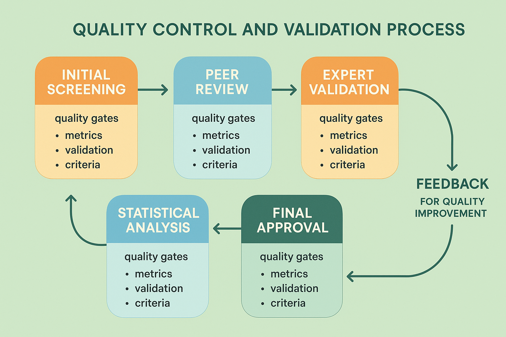

# Quality Control and Validation: Ensuring Excellence Through Systematic Quality Assurance

## Introduction: The Critical Role of Quality Assurance in Human Evaluation

Quality control and validation represent the cornerstone of effective human review systems, ensuring that evaluation outcomes meet organizational standards while maintaining consistency, reliability, and business value. While human expertise provides irreplaceable insights and judgment capabilities, the inherent variability in human performance requires sophisticated quality assurance frameworks that systematically optimize evaluation quality while preserving the benefits of human intelligence and creativity.

The challenge of quality control in human evaluation systems extends far beyond simple error detection or compliance checking. Modern quality assurance frameworks must address multiple complex objectives simultaneously: maintaining evaluation consistency across distributed teams and varying expertise levels, detecting and correcting quality issues before they impact downstream decisions, providing constructive feedback that improves reviewer performance over time, and balancing quality requirements with operational efficiency and cost constraints.

Organizations that excel at quality control and validation gain significant competitive advantages through superior evaluation reliability, reduced operational risk, faster iteration cycles, and enhanced stakeholder confidence in evaluation outcomes. These capabilities become increasingly critical as AI systems become more sophisticated and evaluation requirements become more complex and nuanced.

## Foundational Quality Assurance Principles

### Statistical Quality Control Framework

Effective quality control in human evaluation systems requires rigorous statistical frameworks that can detect quality issues systematically while distinguishing between acceptable variation and problematic inconsistency. These frameworks must account for the inherent subjectivity of many evaluation tasks while maintaining objective standards for quality assessment and improvement.

Statistical process control techniques adapted from manufacturing and service industries provide powerful tools for monitoring evaluation quality over time and detecting systematic quality issues before they impact operations significantly. These techniques include control charts, capability analysis, and trend detection that can identify when evaluation processes are operating outside acceptable quality boundaries.

Sampling strategies for quality assessment must balance thoroughness with efficiency while ensuring representative coverage of evaluation activities. Random sampling provides unbiased quality assessment but may miss systematic issues in specific content types or reviewer populations. Stratified sampling ensures coverage across important dimensions such as content type, reviewer experience, or evaluation complexity while maintaining statistical validity.

Quality metrics and measurement systems must capture multiple dimensions of evaluation quality including accuracy, consistency, completeness, and appropriateness while providing actionable insights for improvement. These metrics should be aligned with business objectives and evaluation requirements while remaining practical to measure and interpret.

### Multi-Stage Validation Architecture

Comprehensive quality assurance requires multiple validation stages that address different aspects of evaluation quality while minimizing redundancy and operational overhead. Each validation stage should be designed to catch specific types of quality issues while building upon the validation activities of previous stages.

Initial screening processes provide rapid identification of obvious quality issues such as incomplete evaluations, clear violations of evaluation guidelines, or technical problems that prevent proper evaluation. These processes should be largely automated to provide immediate feedback without delaying evaluation workflows unnecessarily.

Peer review processes leverage the collective expertise of the reviewer community to identify quality issues that may not be apparent to individual reviewers or automated systems. Peer review must be carefully designed to avoid bias, groupthink, or interpersonal conflicts while providing constructive feedback and quality improvement.

Expert validation processes involve senior reviewers or subject matter experts who can assess complex or high-stakes evaluations that require specialized knowledge or experience. Expert validation is typically reserved for the most critical evaluations due to resource constraints but provides the highest level of quality assurance for important decisions.

Statistical validation processes use quantitative analysis to identify patterns, outliers, or inconsistencies that may indicate quality issues. These processes can detect subtle quality problems that may not be apparent through individual review while providing objective evidence for quality assessment and improvement efforts.

### Continuous Improvement Integration

Quality control systems must be designed as learning systems that continuously improve their effectiveness based on experience, feedback, and changing requirements. This requires systematic collection and analysis of quality data, regular review and updating of quality standards and procedures, and integration of lessons learned into ongoing operations.

Feedback loops ensure that quality issues identified through validation processes are used to improve evaluation guidelines, training programs, and system design. These feedback loops should be systematic and regular while remaining responsive to urgent quality issues that require immediate attention.

Performance tracking and analysis provide visibility into quality trends, reviewer performance patterns, and the effectiveness of quality control measures. This analysis should inform strategic decisions about quality standards, resource allocation, and process improvements while supporting individual reviewer development and coaching.

Benchmarking and comparative analysis help organizations understand their quality performance relative to industry standards, best practices, or internal targets. This analysis can identify areas for improvement and validate the effectiveness of quality control investments while supporting strategic planning and goal setting.

## Five-Stage Quality Control Process

### Stage 1: Initial Screening and Automated Validation

The initial screening stage provides the first line of defense against quality issues by implementing automated checks that can identify obvious problems immediately upon evaluation submission. This stage is critical for maintaining evaluation workflow efficiency while catching common quality issues before they require human intervention.

**Automated Completeness Checking**

Completeness validation ensures that all required evaluation components have been addressed and that evaluations meet minimum standards for thoroughness and detail. This includes checking that all required fields have been completed, that evaluation scores fall within acceptable ranges, and that required documentation or justification has been provided.

Advanced completeness checking can analyze the quality and appropriateness of evaluation content using natural language processing techniques to identify evaluations that may be incomplete despite meeting basic field requirements. For example, the system might flag evaluations with unusually brief comments or generic responses that suggest insufficient attention or effort.

Conditional completeness requirements can be implemented to ensure that evaluations address specific aspects based on content characteristics or evaluation outcomes. For example, evaluations that identify significant quality issues might require additional documentation or justification to ensure that the issues are properly characterized and addressed.

**Consistency and Logic Validation**

Consistency checking identifies evaluations that contain internal contradictions or logical inconsistencies that suggest quality problems or reviewer confusion. This includes checking that evaluation scores are consistent with written comments, that different aspects of the evaluation are logically coherent, and that evaluation outcomes are consistent with identified issues or strengths.

Cross-reference validation ensures that evaluations are consistent with related evaluations or established benchmarks while accounting for legitimate differences in content or context. This can help identify evaluations that are significantly inconsistent with established patterns without inappropriately constraining reviewer judgment.

Temporal consistency checking identifies reviewers whose evaluation patterns change significantly over time, which may indicate fatigue, training needs, or other factors that could impact evaluation quality. This analysis should be used to provide support and coaching rather than punitive measures.

**Technical and Format Validation**

Technical validation ensures that evaluations meet formatting requirements and technical standards while identifying potential system issues that could impact evaluation quality. This includes checking file formats, data integrity, and system compatibility issues that could prevent proper evaluation processing or analysis.

Format standardization ensures that evaluations follow consistent formatting and structure requirements that support downstream processing and analysis. This includes standardized scoring scales, consistent documentation formats, and appropriate use of evaluation categories and tags.

Integration validation ensures that evaluations can be properly integrated with downstream systems and processes while maintaining data integrity and compatibility. This includes checking data formats, field mappings, and system compatibility requirements.

### Stage 2: Peer Review and Collaborative Validation

Peer review processes leverage the collective expertise and judgment of the reviewer community to identify quality issues that may not be apparent through automated validation or individual assessment. Effective peer review requires careful design to maximize quality benefits while minimizing bias, conflict, and operational overhead.

**Structured Peer Review Protocols**

Structured review protocols provide frameworks for peer reviewers to assess evaluation quality systematically while ensuring comprehensive coverage of important quality dimensions. These protocols should be specific enough to ensure consistency while allowing for appropriate reviewer judgment and expertise application.

Review criteria and guidelines must be clearly defined and regularly updated based on experience and feedback. The criteria should address multiple aspects of evaluation quality including accuracy, completeness, consistency, appropriateness, and adherence to evaluation standards and procedures.

Review assignment strategies must balance reviewer expertise with availability and workload while avoiding conflicts of interest or bias. Random assignment provides objectivity but may not optimize reviewer expertise matching, while strategic assignment can improve review quality but may introduce bias or create bottlenecks.

**Blind and Double-Blind Review Processes**

Blind review processes prevent reviewer bias by concealing the identity of the original evaluator while preserving the ability to assess evaluation quality objectively. This approach is particularly important for high-stakes evaluations or when reviewer relationships might influence review outcomes.

Double-blind review processes conceal both the original evaluator and the content creator identities to minimize bias and ensure objective assessment. This approach provides the highest level of objectivity but may limit the reviewer's ability to consider relevant context or background information.

Partial blinding strategies can be used when complete blinding is not practical or appropriate, such as concealing evaluator identity while preserving content context or vice versa. These strategies must be carefully designed to minimize bias while preserving necessary information for effective review.

**Consensus Building and Conflict Resolution**

Consensus building processes help resolve disagreements between original evaluators and peer reviewers while leveraging collective expertise to improve evaluation quality. These processes should be structured to encourage productive discussion while avoiding unproductive conflict or groupthink.

Structured discussion protocols provide frameworks for reviewers to share perspectives, discuss disagreements, and work toward consensus. These protocols should encourage open communication while maintaining focus on evaluation quality and adherence to established standards.

Escalation procedures define how unresolved disagreements are handled, typically involving senior reviewers or subject matter experts who can make final decisions. These procedures should be clearly defined and consistently applied while minimizing the burden on senior staff and maintaining reviewer confidence in the process.

### Stage 3: Expert Validation and Specialized Review

Expert validation provides the highest level of quality assurance for complex, high-stakes, or specialized evaluations that require advanced expertise or experience. This stage is typically reserved for the most critical evaluations due to resource constraints but provides essential quality assurance for important decisions.

**Expert Assignment and Qualification**

Expert qualification criteria must be clearly defined and regularly updated to ensure that expert reviewers have appropriate knowledge, experience, and judgment for the evaluations they assess. These criteria should consider both technical expertise and evaluation experience while maintaining appropriate standards for expert designation.

Expert assignment strategies must balance expertise matching with availability and workload while ensuring appropriate coverage of different evaluation types and content domains. Strategic assignment can optimize expertise utilization but may create bottlenecks or limit expert development opportunities.

Expert development and training programs ensure that expert reviewers maintain and improve their capabilities over time while staying current with evolving evaluation requirements and best practices. These programs should provide ongoing education, skill development, and performance feedback.

**Specialized Review Protocols**

Specialized review protocols address the unique requirements of different evaluation types, content domains, or quality standards while maintaining consistency with overall quality assurance frameworks. These protocols should be developed in collaboration with subject matter experts and regularly updated based on experience and feedback.

Domain-specific quality criteria address the unique characteristics and requirements of different content types or evaluation contexts while maintaining alignment with overall quality standards. These criteria should be specific enough to provide clear guidance while allowing for appropriate expert judgment.

Advanced quality assessment techniques may be required for complex or specialized evaluations, including quantitative analysis, comparative assessment, or specialized validation procedures. These techniques should be clearly documented and consistently applied while remaining practical for operational use.

### Stage 4: Statistical Analysis and Pattern Detection

Statistical analysis provides objective assessment of evaluation quality patterns and trends while identifying potential quality issues that may not be apparent through individual review processes. This analysis should be conducted regularly and used to inform quality improvement efforts and strategic decisions.

**Outlier Detection and Analysis**

Statistical outlier detection identifies evaluations or reviewers that deviate significantly from established patterns or norms, which may indicate quality issues, training needs, or other factors requiring attention. Outlier analysis should distinguish between legitimate variation and problematic inconsistency while providing actionable insights for improvement.

Multivariate analysis techniques can identify complex patterns and relationships in evaluation data that may not be apparent through simple statistical measures. These techniques can reveal subtle quality issues or improvement opportunities while providing insights into the factors that influence evaluation quality.

Trend analysis identifies changes in evaluation quality over time, which can indicate the effectiveness of quality improvement efforts, training programs, or system changes. This analysis should be conducted regularly and used to guide strategic decisions about quality assurance investments and priorities.

**Inter-Rater Reliability Assessment**

Inter-rater reliability measures provide quantitative assessment of evaluation consistency across different reviewers while identifying areas where additional training or calibration may be needed. These measures should be calculated regularly and used to guide quality improvement efforts.

Cohen's kappa and other agreement measures provide standardized metrics for assessing reviewer agreement while accounting for chance agreement. These measures should be interpreted in context and used to identify specific areas for improvement rather than as absolute quality indicators.

Reliability trend analysis tracks changes in inter-rater reliability over time, which can indicate the effectiveness of training programs, calibration efforts, or system changes. This analysis should inform strategic decisions about quality assurance investments and priorities.

### Stage 5: Final Approval and Quality Certification

The final approval stage provides a last opportunity to ensure evaluation quality before results are used for downstream decisions or system improvements. This stage should be designed to catch any remaining quality issues while avoiding unnecessary delays or redundant review processes.

**Approval Workflow Design**

Approval workflows must balance quality assurance with operational efficiency while ensuring appropriate accountability and oversight. These workflows should be clearly defined and consistently applied while providing flexibility for different evaluation types and quality requirements.

Approval criteria should focus on the most critical quality aspects that could significantly impact downstream decisions while avoiding unnecessary bureaucracy or delays. These criteria should be clearly communicated and consistently applied across all evaluation types and contexts.

Approval authority and delegation procedures define who has authority to approve different types of evaluations and under what circumstances. These procedures should balance quality assurance with operational efficiency while ensuring appropriate oversight and accountability.

**Quality Certification and Documentation**

Quality certification processes provide formal documentation of evaluation quality and compliance with established standards while supporting audit and compliance requirements. This documentation should be comprehensive and accessible while remaining practical for operational use.

Certification criteria and standards must be clearly defined and regularly updated to reflect evolving quality requirements and best practices. These standards should be aligned with organizational objectives and regulatory requirements while remaining practical for implementation.

Audit trail and documentation requirements ensure that quality assurance activities are properly documented and can be reviewed for compliance and improvement purposes. This documentation should be comprehensive and accessible while protecting reviewer privacy and confidentiality.

## Advanced Quality Control Techniques

### Machine Learning-Enhanced Quality Detection

Modern quality control systems increasingly leverage machine learning techniques to identify subtle quality issues and patterns that may not be apparent through traditional validation methods. These systems can continuously improve their detection capabilities based on new data and feedback while providing explanations for their assessments.

**Anomaly Detection Systems**

Machine learning-based anomaly detection can identify unusual patterns in evaluation data that may indicate quality issues, fraud, or other problems requiring attention. These systems can detect complex patterns that would be difficult or impossible to identify through rule-based approaches while continuously improving their detection capabilities.

Supervised learning approaches use labeled examples of quality issues to train models that can identify similar problems in new evaluations. These approaches require high-quality training data but can achieve high accuracy for well-defined quality issues.

Unsupervised learning approaches can identify unusual patterns without requiring labeled training data, making them valuable for detecting novel quality issues or patterns that have not been previously identified. These approaches require careful validation to ensure that detected anomalies represent actual quality issues rather than legitimate variation.

**Predictive Quality Assessment**

Predictive models can assess the likelihood of quality issues based on evaluation characteristics, reviewer behavior, or other factors while providing early warning of potential problems. These models can help prioritize quality assurance efforts and allocate resources more effectively.

Risk scoring models assign quality risk scores to evaluations based on various factors such as content complexity, reviewer experience, or historical quality patterns. These scores can be used to prioritize quality assurance activities and allocate resources more effectively.

Early warning systems can alert quality assurance staff to potential quality issues before they impact operations significantly while providing time for intervention and correction. These systems should be designed to minimize false alarms while ensuring that significant quality issues are detected promptly.

### Real-Time Quality Monitoring

Real-time quality monitoring provides immediate feedback on evaluation quality while enabling rapid response to quality issues and trends. These systems must balance comprehensiveness with performance while providing actionable insights for quality improvement.

**Dashboard and Alerting Systems**

Quality dashboards provide real-time visibility into evaluation quality metrics and trends while enabling quality assurance staff to monitor operations and respond to issues promptly. These dashboards should be designed for different user roles and responsibilities while providing appropriate levels of detail and functionality.

Automated alerting systems notify quality assurance staff of significant quality issues or trends while minimizing false alarms and alert fatigue. These systems should be configurable and adaptive while providing clear information about the nature and severity of detected issues.

Mobile and remote access capabilities enable quality assurance staff to monitor and respond to quality issues regardless of location while maintaining security and access control requirements. These capabilities are particularly important for organizations with distributed teams or 24/7 operations.

**Adaptive Quality Thresholds**

Adaptive quality thresholds automatically adjust quality standards and alert criteria based on operational conditions, performance trends, or other factors while maintaining appropriate quality assurance coverage. These systems can improve the effectiveness of quality monitoring while reducing false alarms and operational overhead.

Dynamic threshold adjustment can account for factors such as content difficulty, reviewer experience, or operational conditions that may legitimately affect evaluation quality while maintaining appropriate quality standards.

Contextual quality assessment considers the specific characteristics and requirements of different evaluation types or contexts while maintaining consistency with overall quality standards. This approach can improve the accuracy and relevance of quality assessment while reducing false positives.

## Implementation Strategies and Best Practices

### Technology Integration and Automation

Effective quality control implementation requires careful integration of technology solutions with human expertise and judgment while maintaining appropriate balance between automation and human oversight. Technology should enhance rather than replace human quality assurance capabilities while providing efficiency and consistency benefits.

**Quality Control Platform Selection**

Platform evaluation criteria should include functionality, usability, scalability, integration capabilities, security, cost, and vendor support while considering long-term strategic requirements and organizational constraints. The evaluation process should involve quality assurance staff and other stakeholders to ensure that selected platforms meet real-world requirements.

Integration requirements must be carefully assessed to ensure that quality control platforms can work effectively with existing annotation systems, workflow management tools, and business intelligence systems. Poor integration can create operational inefficiencies and data consistency issues that undermine quality assurance effectiveness.

Customization and configuration capabilities enable organizations to adapt quality control platforms to their specific requirements and processes while maintaining vendor support and upgrade compatibility. These capabilities should be evaluated carefully to ensure that necessary customizations are feasible and sustainable.

### Training and Change Management

Successful quality control implementation requires comprehensive training and change management programs that ensure all stakeholders understand and support new quality assurance processes and technologies. These programs should address both technical and cultural aspects of change while providing ongoing support and development opportunities.

**Quality Assurance Training Programs**

Training program design should address the specific needs and roles of different stakeholder groups while providing comprehensive coverage of quality control concepts, procedures, and technologies. Training should be practical and hands-on while providing theoretical foundation and context.

Competency assessment and certification programs ensure that quality assurance staff have necessary knowledge and skills while providing career development opportunities and professional recognition. These programs should be regularly updated to reflect evolving requirements and best practices.

Ongoing education and development programs ensure that quality assurance capabilities remain current with evolving requirements, technologies, and best practices while providing career advancement opportunities and professional growth.

### Performance Measurement and Optimization

Comprehensive performance measurement provides visibility into quality control effectiveness while identifying opportunities for improvement and optimization. These measurements should cover multiple dimensions of performance including quality outcomes, operational efficiency, cost effectiveness, and stakeholder satisfaction.

**Quality Control Metrics and KPIs**

Quality metrics should measure the effectiveness of quality control processes in detecting and preventing quality issues while providing insights into the factors that influence quality outcomes. These metrics should be aligned with organizational objectives and regularly reviewed and updated.

Efficiency metrics measure the operational efficiency of quality control processes while identifying opportunities for automation, streamlining, or resource optimization. These metrics should balance quality assurance thoroughness with operational efficiency and cost considerations.

Cost-effectiveness analysis evaluates the return on investment of quality control activities while identifying the most effective approaches for achieving quality objectives. This analysis should consider both direct costs and indirect benefits such as risk reduction and improved stakeholder confidence.

## Conclusion: Building Sustainable Quality Excellence

Quality control and validation represent critical capabilities that enable organizations to maintain evaluation excellence while scaling operations and managing complexity. The five-stage framework and advanced techniques presented in this section provide comprehensive approaches for ensuring evaluation quality while maintaining operational efficiency and stakeholder satisfaction.

Successful quality control implementation requires careful balance between thoroughness and efficiency, automation and human judgment, and standardization and flexibility. Organizations must adapt these frameworks to their specific contexts and requirements while maintaining focus on continuous improvement and stakeholder value.

The investment in sophisticated quality control capabilities pays dividends through improved evaluation reliability, reduced operational risk, enhanced stakeholder confidence, and competitive advantage. Organizations that master these capabilities gain significant advantages in their ability to deliver high-quality AI systems while building sustainable foundations for long-term success.

As evaluation requirements continue to evolve and operational complexity continues to grow, the importance of robust quality control and validation will only increase. Organizations that invest in building these capabilities today will be well-positioned to capitalize on future opportunities while managing the challenges of increasingly sophisticated evaluation requirements.

---

**Next Steps**: Continue to [Reviewer Training and Calibration](04-reviewer-training-calibration.md) to learn how to develop comprehensive training programs that ensure reviewer competency and consistency across diverse evaluation tasks and organizational contexts.

