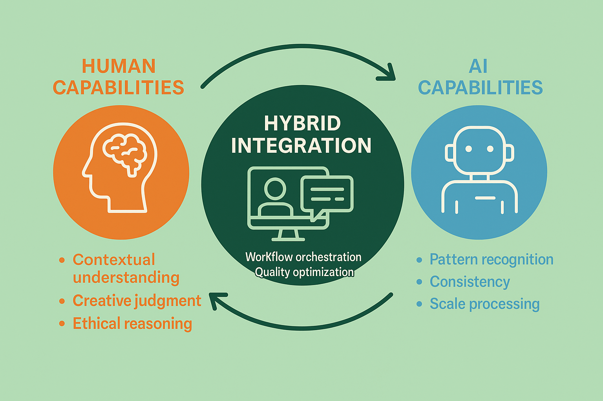

# Human-AI Hybrid Integration: Synergistic Evaluation Systems for Optimal Performance

## Introduction: The Future of Intelligent Evaluation

Human-AI hybrid integration represents the next frontier in evaluation system design, combining the unique strengths of human judgment with the scalability and consistency of artificial intelligence to create synergistic evaluation systems that deliver superior outcomes compared to either approach alone. This integration goes beyond simple automation or human oversight to create sophisticated collaborative systems where human and AI capabilities complement and enhance each other while addressing the limitations inherent in purely human or purely automated approaches.

The strategic importance of hybrid integration stems from the recognition that human evaluators and AI systems possess complementary strengths that, when properly combined, can achieve evaluation quality, efficiency, and scalability that neither approach can deliver independently. Human evaluators excel at contextual understanding, creative judgment, ethical reasoning, and handling novel or ambiguous situations, while AI systems provide consistency, scalability, pattern recognition, and objective analysis capabilities that can enhance human decision-making.

Organizations that master human-AI hybrid integration gain significant competitive advantages through superior evaluation quality, enhanced operational efficiency, improved scalability, and reduced costs while maintaining the human insight and judgment that are essential for complex evaluation scenarios. These capabilities become increasingly critical as evaluation requirements become more sophisticated and organizational scales continue to grow while quality expectations remain high.

## Foundational Principles of Hybrid Integration

### Complementary Capability Optimization

Effective hybrid integration requires deep understanding of the unique strengths and limitations of both human and AI evaluation approaches while designing systems that optimize the contribution of each component to overall evaluation effectiveness. This optimization must go beyond simple task division to create synergistic interactions where the combination delivers superior outcomes.

**Human Capability Strengths and Applications**

Human evaluators bring irreplaceable capabilities that are essential for comprehensive evaluation while being difficult or impossible to replicate through current AI technologies. Understanding these capabilities is crucial for effective hybrid system design.

Contextual understanding enables human evaluators to interpret content within broader contexts including cultural, historical, social, and situational factors that may not be apparent from content alone. This capability is particularly valuable for evaluation scenarios where context significantly influences quality, appropriateness, or effectiveness while requiring nuanced interpretation that goes beyond surface-level analysis.

Creative and subjective judgment allows human evaluators to assess qualities such as creativity, originality, aesthetic value, and emotional impact that may be difficult to quantify or automate while requiring sophisticated understanding of human experience and cultural values. This capability is essential for evaluation scenarios where subjective quality is important while requiring human insight and experience.

Ethical reasoning and moral judgment enable human evaluators to assess content for ethical implications, potential harm, and alignment with values while considering complex moral considerations that may not be captured by simple rules or guidelines. This capability is increasingly important as AI systems are deployed in contexts where ethical considerations are paramount.

Novel situation handling allows human evaluators to adapt to new or unexpected evaluation scenarios while applying judgment and reasoning to situations that may not have been anticipated in system design or training. This capability is essential for maintaining evaluation quality in dynamic environments where requirements and contexts may change rapidly.

**AI Capability Strengths and Applications**

AI systems provide capabilities that can significantly enhance evaluation effectiveness while addressing limitations of human-only approaches. Understanding these capabilities is essential for designing hybrid systems that leverage AI strengths effectively.

Consistency and reliability enable AI systems to apply evaluation criteria uniformly across large volumes of content while avoiding the fatigue, mood variations, and subjective inconsistencies that can affect human evaluation. This capability is particularly valuable for large-scale evaluation scenarios where consistency is critical for fairness and quality.

Scalability and efficiency allow AI systems to process large volumes of content quickly and cost-effectively while providing evaluation capabilities that would be impractical or impossible with human-only approaches. This capability enables organizations to conduct comprehensive evaluation at scales that would otherwise be prohibitive.

Pattern recognition and analysis enable AI systems to identify subtle patterns, correlations, and anomalies that may not be apparent to human evaluators while providing objective analysis that can inform human judgment and decision-making. This capability can enhance evaluation quality by identifying issues or opportunities that might otherwise be missed.

Objective measurement and quantification provide AI systems with capabilities for precise measurement and analysis while reducing subjective variability and providing consistent metrics that can support decision-making and quality assurance.

### Synergistic Design Principles

Effective hybrid integration requires design principles that create synergistic interactions between human and AI capabilities while avoiding common pitfalls such as automation bias, skill degradation, or inefficient task allocation.

**Collaborative Rather Than Replacement Approaches**

Hybrid systems should be designed to enhance human capabilities rather than replace human judgment while creating collaborative relationships where both human and AI contributions are valued and optimized. This approach requires careful attention to task allocation, interface design, and workflow integration.

Augmented decision-making provides AI analysis and insights to support human judgment while maintaining human authority and responsibility for final evaluation decisions. This approach leverages AI capabilities for analysis and pattern recognition while preserving human judgment for complex or ambiguous situations.

Intelligent task routing automatically directs evaluation tasks to the most appropriate evaluator (human or AI) based on task characteristics, complexity, and capability requirements while optimizing overall system efficiency and effectiveness. This routing should be dynamic and adaptive while ensuring that tasks are handled by the most capable evaluator.

Collaborative analysis enables human and AI evaluators to work together on complex evaluation tasks while combining their respective strengths for superior outcomes. This collaboration should be structured and supported while maintaining clear roles and responsibilities for each participant.

**Adaptive and Learning Integration**

Hybrid systems should be designed to learn and improve over time while adapting to changing requirements, contexts, and capabilities. This adaptation requires sophisticated feedback mechanisms and continuous improvement processes.

Continuous learning integration enables AI systems to learn from human evaluation decisions and feedback while improving their performance and alignment with human judgment over time. This learning should be carefully managed while ensuring that AI systems learn appropriate lessons and maintain quality standards.

Human skill development support provides opportunities for human evaluators to learn from AI analysis and insights while building their capabilities and improving their evaluation effectiveness. This support should be educational and empowering while maintaining human autonomy and judgment.

Dynamic capability allocation adjusts the balance between human and AI involvement based on performance, availability, and task requirements while optimizing overall system effectiveness and efficiency. This allocation should be flexible and responsive while maintaining quality standards and stakeholder satisfaction.

## Four-Component Hybrid Integration Framework

### Component 1: Intelligent Task Allocation and Routing

Effective hybrid integration requires sophisticated approaches for determining which evaluation tasks should be handled by human evaluators, AI systems, or collaborative approaches while optimizing overall system performance and ensuring appropriate quality standards.

**Task Complexity and Capability Matching**

Systematic analysis of task characteristics and capability requirements enables optimal allocation of evaluation tasks while ensuring that each task is handled by the most appropriate evaluator or combination of evaluators.

**Complexity Assessment Framework**

Task complexity assessment evaluates multiple dimensions of evaluation difficulty while providing objective criteria for allocation decisions that optimize system performance and quality outcomes.

Content complexity analysis examines factors such as ambiguity, novelty, cultural sensitivity, and technical sophistication while identifying tasks that may require human judgment or collaborative approaches. This analysis should be comprehensive and objective while being practical for operational implementation.

Context complexity assessment evaluates situational factors such as stakeholder sensitivity, legal implications, and business criticality while identifying tasks that may require human oversight or involvement. This assessment should consider both immediate and long-term implications while providing clear guidance for allocation decisions.

Evaluation criteria complexity examines the sophistication and subjectivity of evaluation requirements while identifying tasks that may benefit from human judgment or AI analysis. This examination should consider the nature of quality assessment required while providing practical guidance for task allocation.

**Capability Matching Algorithms**

Sophisticated algorithms can optimize task allocation by matching task requirements with evaluator capabilities while considering factors such as availability, workload, and performance history.

Multi-criteria decision algorithms evaluate multiple factors simultaneously while providing optimal allocation decisions that balance quality, efficiency, and resource utilization. These algorithms should be transparent and explainable while providing consistent and fair allocation decisions.

Dynamic load balancing adjusts task allocation based on real-time factors such as evaluator availability, system performance, and quality requirements while maintaining optimal system performance and stakeholder satisfaction.

Performance-based routing considers historical performance data and capability assessments while directing tasks to evaluators who are most likely to deliver high-quality outcomes. This routing should be fair and developmental while optimizing overall system performance.

**Quality and Risk Assessment**

Risk-based allocation considers the potential consequences of evaluation errors while ensuring that high-risk tasks receive appropriate attention and oversight from qualified evaluators.

Error impact analysis evaluates the potential consequences of evaluation mistakes while providing guidance for allocation decisions that minimize risk and optimize quality outcomes. This analysis should be comprehensive and practical while providing clear guidance for operational decisions.

Quality assurance requirements assessment identifies tasks that may require additional oversight, validation, or collaborative approaches while ensuring that quality standards are maintained across all evaluation scenarios.

Stakeholder sensitivity analysis considers the importance and expectations of different stakeholders while ensuring that allocation decisions support stakeholder satisfaction and organizational objectives.

### Component 2: Collaborative Workflow Design and Implementation

Effective collaboration between human and AI evaluators requires carefully designed workflows that facilitate productive interaction while optimizing the contribution of each participant to overall evaluation effectiveness.

**Workflow Architecture and Process Design**

Collaborative workflows must be designed to support effective interaction between human and AI evaluators while maintaining efficiency, quality, and user satisfaction.

**Sequential Collaboration Patterns**

Sequential workflows organize human and AI contributions in logical sequences that build upon each other while creating comprehensive evaluation outcomes that leverage the strengths of both approaches.

AI-first analysis provides initial assessment and insights that inform human evaluation while reducing human workload and providing objective foundation for human judgment. This approach should provide comprehensive analysis while maintaining human authority for final decisions.

Human-first evaluation establishes human assessment that is then validated, enhanced, or scaled through AI analysis while maintaining human judgment as the primary evaluation approach. This approach should leverage AI capabilities for validation and enhancement while preserving human insight and expertise.

Iterative refinement enables multiple rounds of collaboration between human and AI evaluators while progressively improving evaluation quality and accuracy through successive refinement and validation.

**Parallel Collaboration Approaches**

Parallel workflows enable simultaneous human and AI evaluation while providing opportunities for comparison, validation, and synthesis of different evaluation approaches.

Independent parallel evaluation provides separate human and AI assessments that are then compared and synthesized while enabling identification of agreement, disagreement, and complementary insights. This approach should provide comprehensive evaluation while identifying areas where additional analysis may be needed.

Collaborative real-time evaluation enables human and AI evaluators to work together simultaneously while providing immediate feedback and interaction that can enhance evaluation quality and efficiency.

Consensus building processes facilitate agreement between human and AI evaluators while resolving disagreements and creating unified evaluation outcomes that reflect the best insights from both approaches.

**Integration and Synthesis Mechanisms**

Effective integration mechanisms combine human and AI contributions while creating coherent evaluation outcomes that leverage the strengths of both approaches.

Weighted synthesis algorithms combine human and AI evaluations based on confidence levels, expertise, and task characteristics while creating optimal evaluation outcomes that reflect appropriate balance between different evaluation approaches.

Conflict resolution processes address disagreements between human and AI evaluators while providing systematic approaches for reaching appropriate evaluation decisions. These processes should be fair and transparent while maintaining quality standards and stakeholder confidence.

Quality validation mechanisms ensure that collaborative evaluation outcomes meet quality standards while providing feedback for continuous improvement of collaboration processes and outcomes.

### Component 3: Interface Design and User Experience Optimization

Effective hybrid integration requires sophisticated interface design that supports productive collaboration between human evaluators and AI systems while maintaining usability, efficiency, and user satisfaction.

**Human-AI Interaction Design Principles**

Interface design must facilitate effective communication and collaboration between human and AI evaluators while providing intuitive and efficient user experiences that support evaluation quality and productivity.

**Transparency and Explainability**

AI system transparency enables human evaluators to understand AI analysis and reasoning while building trust and confidence in AI contributions to evaluation outcomes.

Explainable AI interfaces provide clear explanations of AI analysis, reasoning, and recommendations while enabling human evaluators to understand and validate AI contributions. These interfaces should be comprehensive and accessible while remaining practical for operational use.

Confidence and uncertainty communication enables AI systems to communicate their confidence levels and uncertainty while helping human evaluators understand when AI analysis may be less reliable or require additional validation.

Decision support visualization provides graphical representations of AI analysis and insights while enabling human evaluators to quickly understand complex information and make informed evaluation decisions.

**Cognitive Load Management**

Interface design must manage cognitive load effectively while enabling human evaluators to process AI information efficiently without becoming overwhelmed or confused.

Information hierarchy and organization present AI analysis in logical structures that support human comprehension while avoiding information overload that can impair decision-making quality.

Progressive disclosure techniques provide detailed information when needed while maintaining simple and clean interfaces that support efficient evaluation workflows.

Customizable interface options enable human evaluators to adapt interfaces to their preferences and working styles while maintaining consistency and quality standards across different users and contexts.

**Feedback and Learning Integration**

Interfaces should facilitate feedback and learning between human and AI evaluators while supporting continuous improvement of collaboration effectiveness and evaluation quality.

Real-time feedback mechanisms enable immediate communication between human and AI evaluators while supporting rapid iteration and improvement of evaluation outcomes.

Learning and adaptation interfaces enable human evaluators to provide feedback that improves AI performance while enabling AI systems to share insights that enhance human evaluation capabilities.

Performance tracking and analytics provide insights into collaboration effectiveness while identifying opportunities for improvement and optimization of hybrid evaluation processes.

### Component 4: Performance Monitoring and Optimization

Continuous monitoring and optimization ensure that hybrid evaluation systems deliver optimal performance while identifying opportunities for improvement and adaptation to changing requirements and contexts.

**Comprehensive Performance Measurement**

Performance monitoring must evaluate multiple dimensions of hybrid system effectiveness while providing actionable insights for optimization and improvement.

**Quality and Accuracy Metrics**

Quality measurement evaluates the accuracy and reliability of hybrid evaluation outcomes while comparing performance to human-only or AI-only approaches.

Evaluation accuracy assessment measures how well hybrid evaluation outcomes align with ground truth or expert consensus while providing objective measures of evaluation quality and reliability.

Consistency and reliability analysis evaluates the stability and predictability of hybrid evaluation outcomes while identifying factors that may influence performance variability.

Comparative performance analysis compares hybrid system performance to alternative approaches while demonstrating the value and effectiveness of hybrid integration.

**Efficiency and Productivity Metrics**

Efficiency measurement evaluates the resource utilization and productivity of hybrid evaluation systems while identifying opportunities for optimization and improvement.

Throughput and capacity analysis measures the volume and speed of evaluation processing while identifying bottlenecks and optimization opportunities that can improve system performance.

Resource utilization assessment evaluates how effectively human and AI resources are used while identifying opportunities for better allocation and optimization.

Cost-effectiveness analysis compares the costs and benefits of hybrid evaluation approaches while demonstrating return on investment and informing strategic decisions about system design and implementation.

**User Experience and Satisfaction Metrics**

User experience measurement evaluates human evaluator satisfaction and engagement while identifying opportunities for interface and workflow improvement.

User satisfaction surveys and feedback provide insights into human evaluator experiences while identifying areas where interface design or workflow optimization may be needed.

Usability and efficiency assessment measures how effectively human evaluators can work with AI systems while identifying opportunities for interface improvement and training enhancement.

Adoption and engagement analysis evaluates how well human evaluators embrace and utilize AI capabilities while identifying barriers to effective collaboration and opportunities for improvement.

## Advanced Integration Technologies and Approaches

### Machine Learning for Collaboration Optimization

Advanced machine learning approaches can optimize hybrid evaluation systems while learning from collaboration patterns and outcomes to improve system performance over time.

**Collaborative Filtering and Recommendation Systems**

Machine learning can identify optimal collaboration patterns while providing recommendations for task allocation, workflow design, and performance optimization.

Collaborative filtering algorithms analyze patterns of successful human-AI collaboration while identifying optimal approaches for different evaluation scenarios and requirements.

Recommendation systems suggest optimal task allocation, workflow configurations, and collaboration approaches based on historical performance and current context while supporting continuous optimization of hybrid system performance.

Adaptive learning algorithms adjust collaboration approaches based on performance feedback while continuously improving system effectiveness and user satisfaction.

**Predictive Analytics for Performance Optimization**

Predictive analytics can anticipate performance issues and optimization opportunities while enabling proactive management of hybrid evaluation systems.

Performance prediction models forecast evaluation quality and efficiency while enabling proactive optimization and resource allocation decisions that improve system performance.

Bottleneck identification algorithms predict workflow constraints and capacity limitations while enabling proactive management and optimization of system performance.

Quality prediction systems anticipate evaluation accuracy and reliability while enabling quality assurance and validation processes that maintain high standards.

### Natural Language Processing for Enhanced Collaboration

Advanced NLP technologies can facilitate communication and collaboration between human and AI evaluators while providing sophisticated analysis and insight capabilities.

**Intelligent Communication and Feedback Systems**

NLP technologies can enhance communication between human and AI evaluators while providing sophisticated feedback and learning capabilities.

Natural language explanation generation provides human-readable explanations of AI analysis and reasoning while building trust and understanding in human-AI collaboration.

Intelligent feedback processing analyzes human feedback to AI systems while extracting insights that can improve AI performance and collaboration effectiveness.

Collaborative dialogue systems enable natural language interaction between human and AI evaluators while supporting productive collaboration and knowledge sharing.

**Advanced Content Analysis and Insight Generation**

NLP technologies can provide sophisticated content analysis that enhances human evaluation capabilities while providing insights that may not be apparent through traditional analysis approaches.

Semantic analysis and understanding provide deep insights into content meaning and implications while supporting human evaluation with sophisticated analytical capabilities.

Sentiment and emotion analysis identify emotional content and implications while providing insights that can inform human evaluation decisions and quality assessment.

Cultural and contextual analysis identify cultural references, implications, and sensitivities while supporting human evaluation with sophisticated contextual understanding.

## Implementation Strategies and Best Practices

### Organizational Readiness and Change Management

Successful hybrid integration implementation requires careful attention to organizational readiness and change management while building support and capability for effective human-AI collaboration.

**Leadership and Strategic Alignment**

Organizational leadership must provide clear vision and support for hybrid integration while ensuring alignment with strategic objectives and stakeholder expectations.

Executive sponsorship and vision provide clear organizational direction while ensuring that hybrid integration efforts receive necessary support and resources for success.

Strategic alignment ensures that hybrid integration efforts support organizational objectives while delivering measurable value and competitive advantage.

Stakeholder engagement builds support and understanding among key stakeholders while addressing concerns and ensuring that hybrid integration efforts meet stakeholder needs and expectations.

**Cultural Change and Capability Building**

Hybrid integration requires cultural change that supports collaboration between human and AI evaluators while building organizational capability for effective hybrid system management.

Collaboration culture development promotes positive attitudes toward human-AI collaboration while building organizational norms and practices that support effective hybrid integration.

Training and skill development provide human evaluators with necessary capabilities for effective collaboration with AI systems while building confidence and competency in hybrid evaluation approaches.

Change management and communication ensure that organizational changes are managed effectively while building support and understanding for hybrid integration initiatives.

### Technical Implementation and Integration

Technical implementation requires careful attention to system architecture, integration approaches, and performance optimization while ensuring that hybrid systems are reliable, scalable, and maintainable.

**System Architecture and Design**

Hybrid system architecture must support effective collaboration while providing reliable, scalable, and maintainable technical infrastructure.

Modular and flexible architecture enables adaptation and evolution of hybrid systems while supporting changing requirements and technological advancement.

API and integration design facilitate communication and data exchange between human and AI evaluation components while ensuring reliable and efficient system operation.

Security and privacy protection ensure that hybrid systems protect sensitive information while maintaining compliance with relevant regulations and organizational policies.

**Performance Optimization and Scaling**

Technical optimization ensures that hybrid systems deliver optimal performance while scaling effectively to meet organizational requirements and growth.

Load balancing and resource management optimize system performance while ensuring that human and AI resources are utilized effectively and efficiently.

Caching and optimization strategies improve system responsiveness while reducing computational requirements and improving user experience.

Monitoring and alerting systems provide real-time insights into system performance while enabling proactive management and optimization of hybrid evaluation systems.

## Measuring Success and ROI

### Comprehensive Value Assessment

Measuring the success and return on investment of hybrid integration requires comprehensive assessment that considers multiple dimensions of value while providing clear evidence of benefits and areas for improvement.

**Quality and Effectiveness Metrics**

Quality measurement evaluates the effectiveness of hybrid evaluation systems while demonstrating improvements over alternative approaches.

Evaluation accuracy and reliability assessment measures the quality of hybrid evaluation outcomes while comparing performance to human-only or AI-only approaches.

Stakeholder satisfaction measurement evaluates how well hybrid systems meet stakeholder needs and expectations while identifying areas for improvement and optimization.

Business impact assessment measures the effect of hybrid evaluation systems on organizational objectives while demonstrating value and return on investment.

**Efficiency and Cost Metrics**

Efficiency measurement evaluates the resource utilization and cost-effectiveness of hybrid evaluation systems while demonstrating economic value and optimization opportunities.

Cost reduction analysis measures the cost savings achieved through hybrid integration while comparing costs to alternative evaluation approaches.

Productivity improvement assessment evaluates increases in evaluation throughput and efficiency while demonstrating the operational benefits of hybrid integration.

Resource optimization measurement evaluates how effectively hybrid systems utilize human and AI resources while identifying opportunities for further optimization and improvement.

**Strategic and Competitive Metrics**

Strategic measurement evaluates the long-term value and competitive advantage provided by hybrid evaluation systems while demonstrating strategic benefits and positioning.

Competitive advantage assessment evaluates how hybrid evaluation capabilities provide strategic benefits while supporting organizational differentiation and market positioning.

Innovation and capability building measurement evaluates how hybrid integration builds organizational capabilities while supporting future innovation and growth opportunities.

Scalability and adaptability assessment evaluates how well hybrid systems support organizational growth while adapting to changing requirements and contexts.

## Conclusion: The Future of Intelligent Evaluation

Human-AI hybrid integration represents the future of intelligent evaluation systems, combining the irreplaceable insights of human judgment with the scalability and consistency of artificial intelligence to create evaluation capabilities that exceed what either approach can achieve independently. The four-component framework and advanced methodologies presented in this section provide comprehensive approaches for building these capabilities while addressing the complex challenges of effective human-AI collaboration.

Successful hybrid integration requires careful balance between human autonomy and AI assistance, technological sophistication and usability, and standardization and flexibility. Organizations must adapt these frameworks to their specific contexts and requirements while maintaining focus on continuous improvement and stakeholder value.

The investment in sophisticated hybrid integration capabilities pays dividends through superior evaluation quality, enhanced operational efficiency, improved scalability, and competitive advantage that positions organizations for success in an increasingly AI-enabled future. Organizations that master these capabilities gain significant advantages in their ability to conduct effective evaluation while building sustainable foundations for long-term success.

As AI technologies continue to advance and organizational evaluation requirements become more sophisticated, the importance of effective human-AI collaboration will only increase. Organizations that invest in building these capabilities today will be well-positioned to capitalize on future opportunities while managing the challenges of increasingly complex evaluation requirements and competitive pressures.

The future belongs to organizations that can effectively combine human insight with artificial intelligence to create evaluation systems that are more capable, efficient, and valuable than either approach alone. The frameworks and methodologies presented in this module provide the foundation for building these capabilities while creating sustainable competitive advantages in an AI-enabled future.

---

**Module 7 Complete**: You have completed the comprehensive study of Human Review and Annotation Systems. Continue to [Module 8: Cost Optimization Strategies](../08-cost-optimization/README.md) to learn how to optimize evaluation costs while maintaining quality standards and achieving sustainable economic performance.

