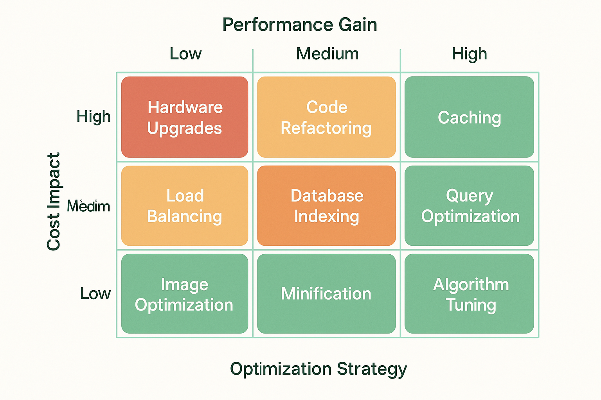

# Cost Optimization and Monitoring: Maximizing ROI in AI Evaluation Systems



## Introduction: The Economics of AI Evaluation at Scale

The economic sustainability of enterprise-scale AI evaluation systems requires sophisticated approaches to cost optimization and monitoring that balance evaluation comprehensiveness with operational efficiency. Traditional approaches to AI evaluation often focus primarily on technical capabilities while neglecting the economic implications of evaluation strategies, leading to unsustainable cost structures that limit evaluation coverage and organizational adoption.

Cost optimization in AI evaluation encompasses multiple dimensions including computational efficiency, resource utilization, evaluation strategy optimization, and intelligent cost management that ensure sustainable evaluation practices while maintaining quality standards. The strategic importance of cost optimization extends beyond immediate cost savings to include long-term sustainability, scalability enablement, and competitive advantage through efficient resource utilization.

The business impact of implementing comprehensive cost optimization includes significant reductions in evaluation operational costs, improved resource utilization efficiency, enhanced evaluation coverage through cost-effective strategies, and increased organizational adoption through sustainable cost structures. Organizations that successfully implement cost optimization strategies gain competitive advantages through more comprehensive evaluation capabilities and faster iteration cycles enabled by cost-efficient evaluation processes.

The technical challenges of cost optimization require sophisticated approaches to resource management, evaluation strategy optimization, and performance monitoring that ensure cost efficiency while maintaining evaluation quality and reliability.

## Cost Analysis and Budgeting

### Comprehensive Cost Modeling

The foundation of effective cost optimization lies in comprehensive cost modeling that accurately captures all dimensions of evaluation costs including computational resources, human effort, infrastructure overhead, and opportunity costs. Cost modeling provides the analytical foundation for informed decision-making and strategic optimization of evaluation investments.

The development of effective cost models requires understanding of both direct and indirect costs associated with evaluation activities, including computational costs, personnel time, infrastructure overhead, and the opportunity costs of delayed feedback or missed optimization opportunities. The most successful cost models balance accuracy with practicality, providing sufficient detail for optimization decisions while remaining manageable and actionable.

**Multi-Dimensional Cost Analysis** provides structured approaches to understanding evaluation costs across different dimensions including computational resources, human effort, infrastructure costs, and strategic opportunity costs that impact overall evaluation ROI.

The implementation of multi-dimensional cost analysis requires sophisticated cost tracking systems, activity-based costing methodologies, and analytical frameworks that provide comprehensive visibility into evaluation economics.

*Computational Cost Modeling* analyzes the direct costs of computational resources including cloud computing charges, GPU utilization, storage costs, and network bandwidth required for different evaluation approaches and scales.

The development of computational cost modeling requires detailed understanding of cloud pricing models, resource utilization patterns, and optimization opportunities that can significantly reduce computational expenses while maintaining evaluation quality.

*Human Resource Cost Analysis* evaluates the personnel costs associated with evaluation activities including evaluation design, data preparation, result analysis, and system maintenance that represent significant components of total evaluation costs.

The implementation of human resource cost analysis requires sophisticated time tracking, activity analysis, and productivity measurement that optimize human resource utilization while maintaining evaluation effectiveness.

*Infrastructure and Overhead Costs* capture the indirect costs of evaluation systems including infrastructure maintenance, security, compliance, and operational overhead that contribute to total cost of ownership.

The development of infrastructure cost analysis requires comprehensive understanding of operational requirements, maintenance costs, and overhead allocation that ensure accurate cost modeling and optimization opportunities.

**ROI Analysis and Optimization** provides systematic approaches to measuring and optimizing the return on investment from evaluation activities, ensuring that evaluation investments deliver maximum value to organizational objectives.

The implementation of ROI analysis requires sophisticated value measurement, benefit quantification, and optimization strategies that align evaluation investments with business objectives and competitive advantages.

*Value-Based Evaluation Prioritization* focuses evaluation resources on activities that deliver maximum business value, optimizing evaluation coverage while maintaining cost efficiency and strategic alignment.

The development of value-based prioritization requires sophisticated value modeling, impact assessment, and prioritization algorithms that optimize evaluation resource allocation based on business impact and strategic importance.

*Cost-Benefit Trade-off Analysis* systematically evaluates the trade-offs between evaluation costs and benefits, enabling informed decisions about evaluation scope, frequency, and methodology that optimize overall value delivery.

The implementation of cost-benefit analysis requires comprehensive benefit quantification, cost modeling, and optimization frameworks that enable data-driven decisions about evaluation investments.

```python
import pandas as pd
import numpy as np
import matplotlib.pyplot as plt
import seaborn as sns
from typing import Dict, List, Any, Optional, Tuple
from dataclasses import dataclass, field
from datetime import datetime, timedelta
import json
import logging
from abc import ABC, abstractmethod
from enum import Enum
import warnings
warnings.filterwarnings('ignore')

# Configure logging
logging.basicConfig(level=logging.INFO)
logger = logging.getLogger(__name__)

class CostCategory(Enum):
    """Categories of evaluation costs"""
    COMPUTE = "compute"
    STORAGE = "storage"
    NETWORK = "network"
    HUMAN_RESOURCES = "human_resources"
    INFRASTRUCTURE = "infrastructure"
    LICENSING = "licensing"
    OPPORTUNITY = "opportunity"

class ResourceType(Enum):
    """Types of computational resources"""
    CPU = "cpu"
    GPU = "gpu"
    MEMORY = "memory"
    STORAGE = "storage"
    NETWORK = "network"

@dataclass
class CostItem:
    """Individual cost item"""
    item_id: str
    category: CostCategory
    resource_type: Optional[ResourceType] = None
    unit_cost: float = 0.0
    quantity: float = 0.0
    duration_hours: float = 0.0
    total_cost: float = 0.0
    description: str = ""
    timestamp: datetime = field(default_factory=datetime.now)
    metadata: Dict[str, Any] = field(default_factory=dict)

@dataclass
class EvaluationCostProfile:
    """Cost profile for an evaluation scenario"""
    profile_id: str
    name: str
    description: str
    cost_items: List[CostItem] = field(default_factory=list)
    total_cost: float = 0.0
    duration_hours: float = 0.0
    evaluation_count: int = 0
    cost_per_evaluation: float = 0.0
    metadata: Dict[str, Any] = field(default_factory=dict)

class CostCalculator:
    """Calculator for evaluation costs"""
    
    def __init__(self):
        # Default pricing (can be configured)
        self.pricing = {
            ResourceType.CPU: 0.05,      # $ per CPU hour
            ResourceType.GPU: 0.50,      # $ per GPU hour
            ResourceType.MEMORY: 0.01,   # $ per GB hour
            ResourceType.STORAGE: 0.001, # $ per GB hour
            ResourceType.NETWORK: 0.10   # $ per GB transferred
        }
        
        self.human_resource_rates = {
            'ml_engineer': 75.0,         # $ per hour
            'data_scientist': 80.0,      # $ per hour
            'devops_engineer': 70.0,     # $ per hour
            'qa_engineer': 60.0          # $ per hour
        }
    
    def calculate_compute_cost(self, resource_type: ResourceType, 
                             quantity: float, duration_hours: float) -> float:
        """Calculate computational resource cost"""
        unit_cost = self.pricing.get(resource_type, 0.0)
        return unit_cost * quantity * duration_hours
    
    def calculate_llm_api_cost(self, model_name: str, input_tokens: int, 
                             output_tokens: int) -> float:
        """Calculate LLM API costs"""
        
        # Pricing per 1K tokens (approximate)
        pricing_per_1k = {
            'gpt-4': {'input': 0.03, 'output': 0.06},
            'gpt-3.5-turbo': {'input': 0.001, 'output': 0.002},
            'claude-3': {'input': 0.015, 'output': 0.075},
            'claude-instant': {'input': 0.0008, 'output': 0.0024}
        }
        
        if model_name not in pricing_per_1k:
            model_name = 'gpt-3.5-turbo'  # Default
        
        input_cost = (input_tokens / 1000) * pricing_per_1k[model_name]['input']
        output_cost = (output_tokens / 1000) * pricing_per_1k[model_name]['output']
        
        return input_cost + output_cost
    
    def calculate_human_resource_cost(self, role: str, hours: float) -> float:
        """Calculate human resource costs"""
        hourly_rate = self.human_resource_rates.get(role, 65.0)  # Default rate
        return hourly_rate * hours
    
    def calculate_evaluation_scenario_cost(self, scenario_config: Dict[str, Any]) -> EvaluationCostProfile:
        """Calculate costs for a complete evaluation scenario"""
        
        profile = EvaluationCostProfile(
            profile_id=scenario_config.get('id', 'scenario_001'),
            name=scenario_config.get('name', 'Evaluation Scenario'),
            description=scenario_config.get('description', ''),
            evaluation_count=scenario_config.get('evaluation_count', 1000)
        )
        
        # Calculate computational costs
        compute_config = scenario_config.get('compute', {})
        
        # CPU costs
        if 'cpu' in compute_config:
            cpu_cost = self.calculate_compute_cost(
                ResourceType.CPU,
                compute_config['cpu']['cores'],
                compute_config['cpu']['duration_hours']
            )
            profile.cost_items.append(CostItem(
                item_id='cpu_cost',
                category=CostCategory.COMPUTE,
                resource_type=ResourceType.CPU,
                unit_cost=self.pricing[ResourceType.CPU],
                quantity=compute_config['cpu']['cores'],
                duration_hours=compute_config['cpu']['duration_hours'],
                total_cost=cpu_cost,
                description='CPU computational resources'
            ))
        
        # GPU costs
        if 'gpu' in compute_config:
            gpu_cost = self.calculate_compute_cost(
                ResourceType.GPU,
                compute_config['gpu']['count'],
                compute_config['gpu']['duration_hours']
            )
            profile.cost_items.append(CostItem(
                item_id='gpu_cost',
                category=CostCategory.COMPUTE,
                resource_type=ResourceType.GPU,
                unit_cost=self.pricing[ResourceType.GPU],
                quantity=compute_config['gpu']['count'],
                duration_hours=compute_config['gpu']['duration_hours'],
                total_cost=gpu_cost,
                description='GPU computational resources'
            ))
        
        # LLM API costs
        if 'llm_api' in scenario_config:
            api_config = scenario_config['llm_api']
            api_cost = self.calculate_llm_api_cost(
                api_config['model'],
                api_config['total_input_tokens'],
                api_config['total_output_tokens']
            )
            profile.cost_items.append(CostItem(
                item_id='llm_api_cost',
                category=CostCategory.COMPUTE,
                unit_cost=api_cost / profile.evaluation_count,
                quantity=profile.evaluation_count,
                total_cost=api_cost,
                description=f'LLM API costs ({api_config["model"]})'
            ))
        
        # Human resource costs
        if 'human_resources' in scenario_config:
            hr_config = scenario_config['human_resources']
            for role, hours in hr_config.items():
                hr_cost = self.calculate_human_resource_cost(role, hours)
                profile.cost_items.append(CostItem(
                    item_id=f'{role}_cost',
                    category=CostCategory.HUMAN_RESOURCES,
                    unit_cost=self.human_resource_rates.get(role, 65.0),
                    quantity=hours,
                    total_cost=hr_cost,
                    description=f'{role.replace("_", " ").title()} time'
                ))
        
        # Storage costs
        if 'storage' in scenario_config:
            storage_config = scenario_config['storage']
            storage_cost = self.calculate_compute_cost(
                ResourceType.STORAGE,
                storage_config['gb'],
                storage_config['duration_hours']
            )
            profile.cost_items.append(CostItem(
                item_id='storage_cost',
                category=CostCategory.STORAGE,
                resource_type=ResourceType.STORAGE,
                unit_cost=self.pricing[ResourceType.STORAGE],
                quantity=storage_config['gb'],
                duration_hours=storage_config['duration_hours'],
                total_cost=storage_cost,
                description='Data storage costs'
            ))
        
        # Calculate totals
        profile.total_cost = sum(item.total_cost for item in profile.cost_items)
        profile.cost_per_evaluation = profile.total_cost / profile.evaluation_count if profile.evaluation_count > 0 else 0
        profile.duration_hours = max([item.duration_hours for item in profile.cost_items] + [0])
        
        return profile

class CostOptimizer:
    """Optimizer for evaluation costs"""
    
    def __init__(self, cost_calculator: CostCalculator):
        self.cost_calculator = cost_calculator
    
    def optimize_evaluation_strategy(self, base_scenario: Dict[str, Any], 
                                   optimization_targets: Dict[str, float]) -> List[Dict[str, Any]]:
        """Optimize evaluation strategy for cost and performance"""
        
        optimized_scenarios = []
        
        # Strategy 1: Reduce LLM API costs through model selection
        if 'llm_api' in base_scenario:
            cheaper_model_scenario = base_scenario.copy()
            cheaper_model_scenario['name'] = base_scenario['name'] + ' - Cheaper Model'
            cheaper_model_scenario['llm_api'] = base_scenario['llm_api'].copy()
            
            # Switch to cheaper model
            if base_scenario['llm_api']['model'] == 'gpt-4':
                cheaper_model_scenario['llm_api']['model'] = 'gpt-3.5-turbo'
                # Adjust token counts (cheaper models might need more tokens)
                cheaper_model_scenario['llm_api']['total_output_tokens'] *= 1.2
            
            optimized_scenarios.append(cheaper_model_scenario)
        
        # Strategy 2: Optimize compute resources
        if 'compute' in base_scenario:
            compute_optimized_scenario = base_scenario.copy()
            compute_optimized_scenario['name'] = base_scenario['name'] + ' - Compute Optimized'
            compute_optimized_scenario['compute'] = base_scenario['compute'].copy()
            
            # Use more CPU, less GPU if possible
            if 'gpu' in compute_optimized_scenario['compute']:
                gpu_config = compute_optimized_scenario['compute']['gpu']
                cpu_config = compute_optimized_scenario['compute'].get('cpu', {'cores': 4, 'duration_hours': gpu_config['duration_hours']})
                
                # Reduce GPU usage by 50%, increase CPU
                gpu_config['count'] = max(1, gpu_config['count'] // 2)
                cpu_config['cores'] = cpu_config['cores'] * 2
                
                compute_optimized_scenario['compute']['cpu'] = cpu_config
            
            optimized_scenarios.append(compute_optimized_scenario)
        
        # Strategy 3: Batch processing optimization
        batch_optimized_scenario = base_scenario.copy()
        batch_optimized_scenario['name'] = base_scenario['name'] + ' - Batch Optimized'
        
        # Reduce human resource time through automation
        if 'human_resources' in batch_optimized_scenario:
            hr_config = batch_optimized_scenario['human_resources'].copy()
            for role in hr_config:
                hr_config[role] *= 0.7  # 30% reduction through automation
            batch_optimized_scenario['human_resources'] = hr_config
        
        # Optimize storage through compression
        if 'storage' in batch_optimized_scenario:
            storage_config = batch_optimized_scenario['storage'].copy()
            storage_config['gb'] *= 0.6  # 40% reduction through compression
            batch_optimized_scenario['storage'] = storage_config
        
        optimized_scenarios.append(batch_optimized_scenario)
        
        # Strategy 4: Hybrid approach
        hybrid_scenario = base_scenario.copy()
        hybrid_scenario['name'] = base_scenario['name'] + ' - Hybrid Optimized'
        
        # Combine multiple optimization strategies
        if 'llm_api' in hybrid_scenario:
            # Use mix of models
            api_config = hybrid_scenario['llm_api'].copy()
            if api_config['model'] == 'gpt-4':
                # Use cheaper model for 70% of evaluations
                total_cost_original = self.cost_calculator.calculate_llm_api_cost(
                    api_config['model'],
                    api_config['total_input_tokens'],
                    api_config['total_output_tokens']
                )
                
                # Calculate hybrid cost
                expensive_portion = 0.3
                cheap_portion = 0.7
                
                expensive_cost = total_cost_original * expensive_portion
                cheap_cost = self.cost_calculator.calculate_llm_api_cost(
                    'gpt-3.5-turbo',
                    int(api_config['total_input_tokens'] * cheap_portion),
                    int(api_config['total_output_tokens'] * cheap_portion * 1.1)
                )
                
                # Adjust for hybrid approach
                api_config['model'] = 'hybrid'
                api_config['total_input_tokens'] = int(api_config['total_input_tokens'] * 0.85)
                api_config['total_output_tokens'] = int(api_config['total_output_tokens'] * 0.9)
                
            hybrid_scenario['llm_api'] = api_config
        
        optimized_scenarios.append(hybrid_scenario)
        
        return optimized_scenarios
    
    def calculate_optimization_impact(self, base_scenario: Dict[str, Any], 
                                    optimized_scenarios: List[Dict[str, Any]]) -> pd.DataFrame:
        """Calculate the impact of optimization strategies"""
        
        results = []
        
        # Calculate base scenario costs
        base_profile = self.cost_calculator.calculate_evaluation_scenario_cost(base_scenario)
        
        results.append({
            'scenario': 'Base Scenario',
            'total_cost': base_profile.total_cost,
            'cost_per_evaluation': base_profile.cost_per_evaluation,
            'duration_hours': base_profile.duration_hours,
            'cost_savings': 0.0,
            'cost_savings_percent': 0.0
        })
        
        # Calculate optimized scenario costs
        for scenario in optimized_scenarios:
            profile = self.cost_calculator.calculate_evaluation_scenario_cost(scenario)
            cost_savings = base_profile.total_cost - profile.total_cost
            cost_savings_percent = (cost_savings / base_profile.total_cost) * 100 if base_profile.total_cost > 0 else 0
            
            results.append({
                'scenario': scenario['name'],
                'total_cost': profile.total_cost,
                'cost_per_evaluation': profile.cost_per_evaluation,
                'duration_hours': profile.duration_hours,
                'cost_savings': cost_savings,
                'cost_savings_percent': cost_savings_percent
            })
        
        return pd.DataFrame(results)

class CostMonitor:
    """Monitor and track evaluation costs over time"""
    
    def __init__(self):
        self.cost_history: List[Dict[str, Any]] = []
        self.budget_alerts: List[Dict[str, Any]] = []
        self.cost_thresholds = {
            'daily': 1000.0,
            'weekly': 5000.0,
            'monthly': 20000.0
        }
    
    def record_cost_event(self, cost_profile: EvaluationCostProfile, 
                         execution_context: Dict[str, Any]):
        """Record a cost event"""
        
        cost_event = {
            'timestamp': datetime.now(),
            'profile_id': cost_profile.profile_id,
            'total_cost': cost_profile.total_cost,
            'cost_per_evaluation': cost_profile.cost_per_evaluation,
            'evaluation_count': cost_profile.evaluation_count,
            'duration_hours': cost_profile.duration_hours,
            'context': execution_context,
            'cost_breakdown': {
                item.category.value: item.total_cost 
                for item in cost_profile.cost_items
            }
        }
        
        self.cost_history.append(cost_event)
        
        # Check for budget alerts
        self._check_budget_thresholds(cost_event)
    
    def _check_budget_thresholds(self, cost_event: Dict[str, Any]):
        """Check if cost event triggers budget alerts"""
        
        current_time = cost_event['timestamp']
        
        # Calculate costs for different time periods
        daily_costs = self._calculate_period_costs(current_time, timedelta(days=1))
        weekly_costs = self._calculate_period_costs(current_time, timedelta(weeks=1))
        monthly_costs = self._calculate_period_costs(current_time, timedelta(days=30))
        
        # Check thresholds
        if daily_costs > self.cost_thresholds['daily']:
            self.budget_alerts.append({
                'timestamp': current_time,
                'type': 'daily_threshold_exceeded',
                'actual_cost': daily_costs,
                'threshold': self.cost_thresholds['daily'],
                'severity': 'warning'
            })
        
        if weekly_costs > self.cost_thresholds['weekly']:
            self.budget_alerts.append({
                'timestamp': current_time,
                'type': 'weekly_threshold_exceeded',
                'actual_cost': weekly_costs,
                'threshold': self.cost_thresholds['weekly'],
                'severity': 'high'
            })
        
        if monthly_costs > self.cost_thresholds['monthly']:
            self.budget_alerts.append({
                'timestamp': current_time,
                'type': 'monthly_threshold_exceeded',
                'actual_cost': monthly_costs,
                'threshold': self.cost_thresholds['monthly'],
                'severity': 'critical'
            })
    
    def _calculate_period_costs(self, end_time: datetime, period: timedelta) -> float:
        """Calculate total costs for a specific time period"""
        
        start_time = end_time - period
        
        period_costs = sum([
            event['total_cost'] 
            for event in self.cost_history 
            if start_time <= event['timestamp'] <= end_time
        ])
        
        return period_costs
    
    def generate_cost_report(self, period_days: int = 30) -> Dict[str, Any]:
        """Generate comprehensive cost report"""
        
        if not self.cost_history:
            return {'message': 'No cost data available'}
        
        end_time = datetime.now()
        start_time = end_time - timedelta(days=period_days)
        
        # Filter events for the period
        period_events = [
            event for event in self.cost_history
            if start_time <= event['timestamp'] <= end_time
        ]
        
        if not period_events:
            return {'message': f'No cost data available for the last {period_days} days'}
        
        # Calculate summary statistics
        total_cost = sum(event['total_cost'] for event in period_events)
        total_evaluations = sum(event['evaluation_count'] for event in period_events)
        avg_cost_per_evaluation = total_cost / total_evaluations if total_evaluations > 0 else 0
        
        # Cost breakdown by category
        cost_by_category = {}
        for event in period_events:
            for category, cost in event['cost_breakdown'].items():
                cost_by_category[category] = cost_by_category.get(category, 0) + cost
        
        # Daily cost trend
        daily_costs = {}
        for event in period_events:
            date_key = event['timestamp'].date()
            daily_costs[date_key] = daily_costs.get(date_key, 0) + event['total_cost']
        
        # Top cost drivers
        profile_costs = {}
        for event in period_events:
            profile_id = event['profile_id']
            profile_costs[profile_id] = profile_costs.get(profile_id, 0) + event['total_cost']
        
        top_cost_drivers = sorted(profile_costs.items(), key=lambda x: x[1], reverse=True)[:5]
        
        return {
            'period_days': period_days,
            'start_date': start_time.date(),
            'end_date': end_time.date(),
            'summary': {
                'total_cost': total_cost,
                'total_evaluations': total_evaluations,
                'average_cost_per_evaluation': avg_cost_per_evaluation,
                'total_events': len(period_events)
            },
            'cost_by_category': cost_by_category,
            'daily_costs': {str(k): v for k, v in daily_costs.items()},
            'top_cost_drivers': top_cost_drivers,
            'budget_alerts': [
                alert for alert in self.budget_alerts
                if start_time <= alert['timestamp'] <= end_time
            ]
        }
    
    def visualize_cost_trends(self, period_days: int = 30):
        """Create visualizations of cost trends"""
        
        report = self.generate_cost_report(period_days)
        
        if 'message' in report:
            print(report['message'])
            return
        
        # Create subplots
        fig, axes = plt.subplots(2, 2, figsize=(15, 10))
        fig.suptitle(f'Cost Analysis - Last {period_days} Days', fontsize=16)
        
        # Daily cost trend
        daily_costs = report['daily_costs']
        dates = list(daily_costs.keys())
        costs = list(daily_costs.values())
        
        axes[0, 0].plot(dates, costs, marker='o')
        axes[0, 0].set_title('Daily Cost Trend')
        axes[0, 0].set_xlabel('Date')
        axes[0, 0].set_ylabel('Cost ($)')
        axes[0, 0].tick_params(axis='x', rotation=45)
        
        # Cost by category
        categories = list(report['cost_by_category'].keys())
        category_costs = list(report['cost_by_category'].values())
        
        axes[0, 1].pie(category_costs, labels=categories, autopct='%1.1f%%')
        axes[0, 1].set_title('Cost Distribution by Category')
        
        # Top cost drivers
        drivers, driver_costs = zip(*report['top_cost_drivers']) if report['top_cost_drivers'] else ([], [])
        
        if drivers:
            axes[1, 0].bar(drivers, driver_costs)
            axes[1, 0].set_title('Top Cost Drivers')
            axes[1, 0].set_xlabel('Profile ID')
            axes[1, 0].set_ylabel('Cost ($)')
            axes[1, 0].tick_params(axis='x', rotation=45)
        
        # Summary metrics
        summary = report['summary']
        metrics_text = f"""
        Total Cost: ${summary['total_cost']:.2f}
        Total Evaluations: {summary['total_evaluations']:,}
        Avg Cost/Eval: ${summary['average_cost_per_evaluation']:.4f}
        Total Events: {summary['total_events']}
        """
        
        axes[1, 1].text(0.1, 0.5, metrics_text, fontsize=12, verticalalignment='center')
        axes[1, 1].set_title('Summary Metrics')
        axes[1, 1].axis('off')
        
        plt.tight_layout()
        plt.show()

# Example usage and demonstration
def demonstrate_cost_optimization():
    """Demonstrate cost optimization capabilities"""
    
    print("=== Cost Optimization and Monitoring Demonstration ===")
    
    # Initialize components
    cost_calculator = CostCalculator()
    cost_optimizer = CostOptimizer(cost_calculator)
    cost_monitor = CostMonitor()
    
    # Define base evaluation scenario
    base_scenario = {
        'id': 'base_scenario_001',
        'name': 'Comprehensive AI Evaluation',
        'description': 'Full-scale evaluation with high-end resources',
        'evaluation_count': 5000,
        'compute': {
            'cpu': {'cores': 8, 'duration_hours': 4},
            'gpu': {'count': 2, 'duration_hours': 4}
        },
        'llm_api': {
            'model': 'gpt-4',
            'total_input_tokens': 2500000,  # 500 tokens per eval * 5000 evals
            'total_output_tokens': 1000000  # 200 tokens per eval * 5000 evals
        },
        'human_resources': {
            'ml_engineer': 8,
            'data_scientist': 4,
            'qa_engineer': 6
        },
        'storage': {
            'gb': 100,
            'duration_hours': 24
        }
    }
    
    print(f"Base Scenario: {base_scenario['name']}")
    print(f"Evaluation Count: {base_scenario['evaluation_count']:,}")
    
    # Calculate base scenario costs
    base_profile = cost_calculator.calculate_evaluation_scenario_cost(base_scenario)
    
    print(f"\n=== Base Scenario Costs ===")
    print(f"Total Cost: ${base_profile.total_cost:.2f}")
    print(f"Cost per Evaluation: ${base_profile.cost_per_evaluation:.4f}")
    print(f"Duration: {base_profile.duration_hours:.1f} hours")
    
    print(f"\n=== Cost Breakdown ===")
    for item in base_profile.cost_items:
        print(f"{item.description}: ${item.total_cost:.2f}")
    
    # Generate optimization strategies
    optimization_targets = {
        'max_cost_increase': 0.0,  # No cost increase allowed
        'min_cost_reduction': 0.20  # At least 20% cost reduction
    }
    
    optimized_scenarios = cost_optimizer.optimize_evaluation_strategy(
        base_scenario, optimization_targets
    )
    
    print(f"\n=== Optimization Strategies ===")
    print(f"Generated {len(optimized_scenarios)} optimization strategies")
    
    # Calculate optimization impact
    impact_df = cost_optimizer.calculate_optimization_impact(base_scenario, optimized_scenarios)
    
    print(f"\n=== Optimization Impact ===")
    print(impact_df.to_string(index=False, float_format='%.2f'))
    
    # Find best optimization
    best_optimization = impact_df.loc[impact_df['cost_savings_percent'].idxmax()]
    print(f"\n=== Best Optimization ===")
    print(f"Strategy: {best_optimization['scenario']}")
    print(f"Cost Savings: ${best_optimization['cost_savings']:.2f} ({best_optimization['cost_savings_percent']:.1f}%)")
    print(f"New Cost per Evaluation: ${best_optimization['cost_per_evaluation']:.4f}")
    
    # Simulate cost monitoring
    print(f"\n=== Cost Monitoring Simulation ===")
    
    # Record several cost events
    for i, scenario in enumerate([base_scenario] + optimized_scenarios[:3]):
        profile = cost_calculator.calculate_evaluation_scenario_cost(scenario)
        
        execution_context = {
            'execution_id': f'exec_{i+1}',
            'user': 'evaluation_team',
            'environment': 'production',
            'optimization_strategy': scenario['name']
        }
        
        cost_monitor.record_cost_event(profile, execution_context)
        
        # Simulate some time passing
        import time
        time.sleep(0.1)
    
    # Generate cost report
    cost_report = cost_monitor.generate_cost_report(period_days=1)
    
    print(f"Cost Report Summary:")
    print(f"  Total Cost: ${cost_report['summary']['total_cost']:.2f}")
    print(f"  Total Evaluations: {cost_report['summary']['total_evaluations']:,}")
    print(f"  Average Cost per Evaluation: ${cost_report['summary']['average_cost_per_evaluation']:.4f}")
    
    if cost_report['budget_alerts']:
        print(f"\n=== Budget Alerts ===")
        for alert in cost_report['budget_alerts']:
            print(f"  {alert['type']}: ${alert['actual_cost']:.2f} (threshold: ${alert['threshold']:.2f})")
    
    # Cost optimization recommendations
    print(f"\n=== Cost Optimization Recommendations ===")
    
    savings_opportunities = []
    for _, row in impact_df.iterrows():
        if row['cost_savings_percent'] > 0:
            savings_opportunities.append({
                'strategy': row['scenario'],
                'savings_percent': row['cost_savings_percent'],
                'savings_amount': row['cost_savings']
            })
    
    savings_opportunities.sort(key=lambda x: x['savings_percent'], reverse=True)
    
    for i, opportunity in enumerate(savings_opportunities[:3], 1):
        print(f"{i}. {opportunity['strategy']}")
        print(f"   Potential Savings: ${opportunity['savings_amount']:.2f} ({opportunity['savings_percent']:.1f}%)")
    
    return {
        'base_profile': base_profile,
        'optimized_scenarios': optimized_scenarios,
        'impact_analysis': impact_df,
        'cost_report': cost_report
    }

if __name__ == "__main__":
    results = demonstrate_cost_optimization()
    print("\n=== Cost Optimization Analysis Complete ===")
```

### Budget Management and Forecasting

The sustainability of AI evaluation programs requires sophisticated budget management and forecasting capabilities that enable proactive cost control and strategic resource planning. Budget management provides the framework for controlling evaluation costs while ensuring adequate resources for comprehensive evaluation coverage.

**Predictive Cost Modeling** enables accurate forecasting of evaluation costs based on historical data, workload projections, and resource utilization patterns, providing the foundation for effective budget planning and resource allocation.

The implementation of predictive cost modeling requires sophisticated data analysis, machine learning capabilities, and forecasting algorithms that can accurately predict future costs based on historical patterns and planned activities.

*Historical Cost Analysis* analyzes past evaluation costs to identify trends, patterns, and cost drivers that inform future budget planning and optimization strategies.

The development of historical cost analysis requires comprehensive data collection, statistical analysis, and trend identification capabilities that provide insights into cost patterns and optimization opportunities.

*Workload-Based Forecasting* predicts future costs based on planned evaluation activities, workload characteristics, and resource requirements, enabling accurate budget planning and resource allocation.

The implementation of workload-based forecasting requires sophisticated workload modeling, resource estimation, and cost projection capabilities that account for variability and uncertainty in evaluation requirements.

**Dynamic Budget Allocation** provides adaptive budget management that adjusts resource allocation based on changing priorities, unexpected requirements, and optimization opportunities while maintaining overall budget constraints.

The development of dynamic budget allocation requires sophisticated optimization algorithms, priority management, and resource allocation strategies that balance competing demands while maintaining budget discipline.

*Priority-Based Resource Allocation* ensures that critical evaluation activities receive adequate resources while optimizing overall resource utilization and maintaining budget constraints.

The implementation of priority-based allocation requires sophisticated priority assessment, resource optimization, and allocation algorithms that balance strategic importance with cost efficiency.

*Contingency Planning and Risk Management* provides frameworks for managing budget risks, unexpected costs, and resource constraints that could impact evaluation coverage and quality.

The development of contingency planning requires risk assessment, scenario planning, and mitigation strategies that ensure evaluation continuity even under adverse conditions.

## Performance Monitoring and Alerting

### Real-Time Cost Tracking

The effective management of evaluation costs requires real-time cost tracking and alerting systems that provide immediate visibility into cost trends and enable proactive cost control. Real-time monitoring ensures that cost overruns are detected and addressed before they impact budget constraints or evaluation sustainability.

**Automated Cost Monitoring** provides continuous tracking of evaluation costs across all dimensions including computational resources, human effort, and infrastructure overhead, enabling immediate detection of cost anomalies and trends.

The implementation of automated cost monitoring requires sophisticated data collection, real-time processing, and alerting capabilities that provide immediate visibility into cost patterns and deviations.

*Real-Time Cost Dashboards* provide immediate visibility into current costs, trends, and budget status, enabling proactive cost management and rapid response to cost issues.

The development of real-time dashboards requires sophisticated data visualization, real-time data processing, and user interface design that enables effective cost monitoring and management.

*Intelligent Cost Alerting* automatically detects cost anomalies, budget threshold breaches, and optimization opportunities, providing immediate notification and recommended actions.

The implementation of intelligent alerting requires sophisticated anomaly detection, threshold management, and notification systems that provide actionable alerts without overwhelming users with false positives.

**Cost Attribution and Chargeback** provides detailed cost attribution to specific projects, teams, and activities, enabling accurate cost accounting and informed decision-making about resource allocation and optimization.

The development of cost attribution requires sophisticated cost tracking, allocation algorithms, and reporting capabilities that provide accurate and actionable cost information.

*Activity-Based Cost Allocation* assigns costs to specific evaluation activities, enabling detailed understanding of cost drivers and optimization opportunities at the activity level.

The implementation of activity-based allocation requires detailed activity tracking, cost modeling, and allocation algorithms that provide accurate cost attribution while maintaining operational efficiency.

*Team and Project Cost Tracking* provides cost visibility at the team and project level, enabling effective cost management and accountability while supporting strategic decision-making.

The development of team and project tracking requires sophisticated cost aggregation, reporting, and analysis capabilities that provide meaningful cost insights while maintaining privacy and security requirements.

## Cost-Performance Trade-off Analysis

### Optimization Strategy Selection

The optimization of AI evaluation systems requires sophisticated analysis of cost-performance trade-offs that balance evaluation quality with resource efficiency. Trade-off analysis provides the analytical foundation for selecting optimization strategies that achieve optimal value delivery while maintaining acceptable quality standards.

**Multi-Objective Optimization** provides systematic approaches to balancing multiple competing objectives including cost, quality, speed, and coverage, enabling informed decisions about evaluation strategy optimization.

The implementation of multi-objective optimization requires sophisticated optimization algorithms, objective function design, and constraint management that can effectively balance competing requirements.

*Pareto Frontier Analysis* identifies the optimal trade-offs between cost and performance, providing clear visibility into the range of achievable outcomes and the trade-offs required for different optimization strategies.

The development of Pareto frontier analysis requires sophisticated optimization algorithms, performance modeling, and visualization capabilities that clearly communicate trade-off options and their implications.

*Sensitivity Analysis* evaluates how changes in evaluation parameters impact cost and performance outcomes, enabling informed decisions about optimization strategies and their robustness to parameter variations.

The implementation of sensitivity analysis requires sophisticated modeling capabilities, parameter variation analysis, and impact assessment that provide insights into optimization strategy robustness and risk.

**Value-Based Optimization** focuses optimization efforts on activities and strategies that deliver maximum value relative to their cost, ensuring that optimization efforts are aligned with business objectives and strategic priorities.

The development of value-based optimization requires sophisticated value modeling, impact assessment, and optimization algorithms that align technical optimization with business value delivery.

*Business Impact Assessment* evaluates the business value delivered by different evaluation strategies, enabling optimization decisions that maximize business impact while maintaining cost efficiency.

The implementation of business impact assessment requires sophisticated value modeling, impact measurement, and business alignment capabilities that connect technical evaluation activities with business outcomes.

*Strategic Alignment Optimization* ensures that cost optimization strategies support strategic objectives and competitive advantages while maintaining operational efficiency and quality standards.

The development of strategic alignment requires sophisticated strategic analysis, objective alignment, and optimization frameworks that balance short-term cost efficiency with long-term strategic value.

## Conclusion: Sustainable Economics of AI Evaluation

Cost optimization and monitoring represent critical capabilities for sustainable AI evaluation programs that must balance comprehensive evaluation coverage with economic efficiency. The comprehensive framework presented in this section provides the foundation for implementing cost-effective evaluation systems that deliver maximum value while maintaining sustainable cost structures.

The combination of sophisticated cost modeling, intelligent optimization strategies, and real-time monitoring creates evaluation systems that can efficiently manage costs while providing the comprehensive evaluation coverage required for reliable AI system development and deployment.

The emphasis on value-based optimization and strategic alignment ensures that cost optimization efforts support business objectives and competitive advantages while maintaining the quality and reliability standards required for effective AI evaluation.

As AI systems become more complex and evaluation requirements continue to grow, cost optimization will become increasingly important, providing the foundation for sustainable evaluation programs that can scale with organizational needs while maintaining economic viability and strategic value delivery.

---

**Next**: [Module 4: Collaborative Evaluation Practices →](../04-collaborative-evaluation/README.md)

