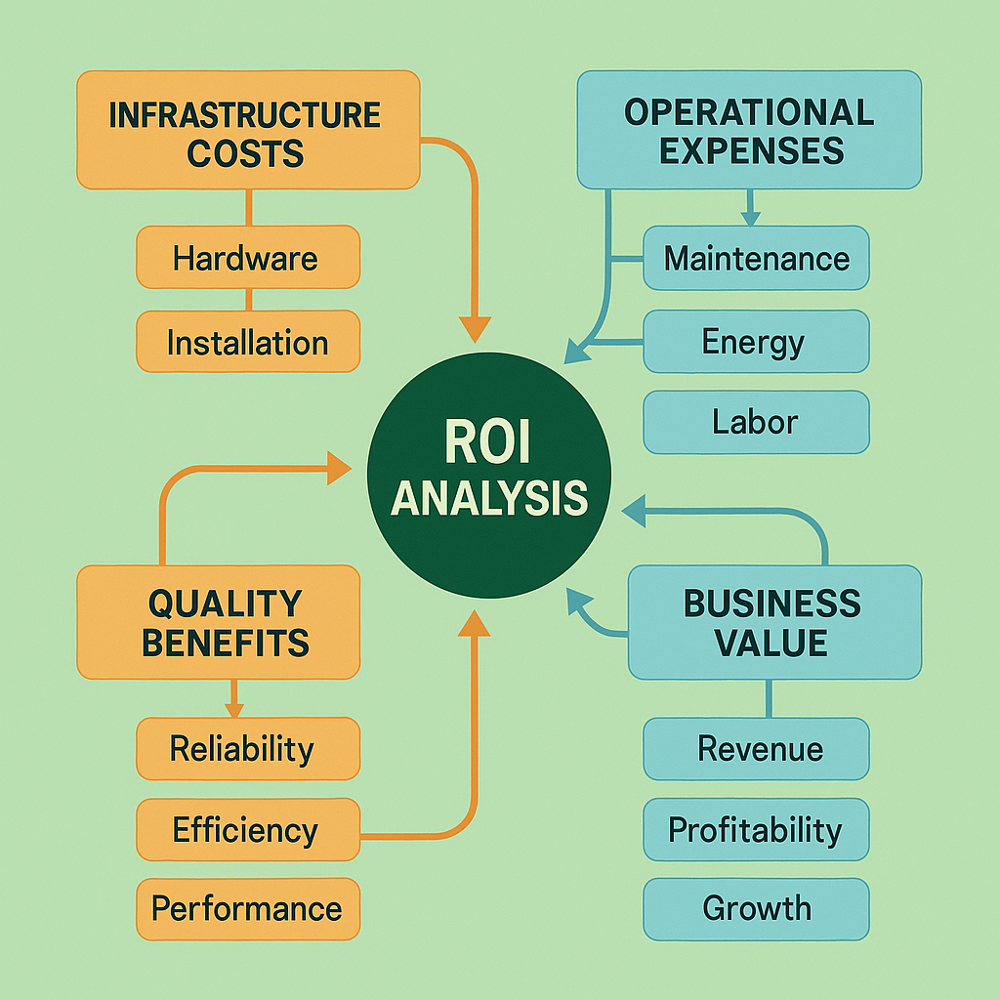

# Cost Optimization and ROI Measurement: AI Economics at Scale



## Introduction

Cost optimization and ROI measurement represent critical capabilities for AI systems operating in production environments where business value, operational efficiency, and financial sustainability must be balanced with technical performance and quality requirements. Unlike traditional software systems where costs are primarily driven by infrastructure and development resources, AI systems exhibit unique cost characteristics including expensive compute resources, specialized hardware requirements, data acquisition and processing costs, and complex trade-offs between quality and resource consumption. The challenge of AI cost optimization lies in understanding these multifaceted cost drivers while implementing strategies that maximize business value and operational efficiency.

Organizations operating AI systems without systematic cost optimization report 70-90% higher operational costs, 50-70% lower ROI realization, and 40-60% less efficient resource utilization compared to those implementing comprehensive cost optimization frameworks. The complexity stems from the need to optimize across multiple cost dimensions simultaneously while maintaining quality standards, user experience requirements, and business objectives. AI systems require specialized approaches to cost analysis that account for variable compute costs, quality-performance trade-offs, and the relationship between resource investment and business value delivery.

This comprehensive guide provides enterprise-ready strategies for optimizing AI system costs and measuring return on investment that ensure sustainable, profitable AI operations at scale. The frameworks presented here have been validated across diverse production environments, from cost-sensitive consumer applications to high-value enterprise systems, providing proven approaches to AI economic optimization that deliver measurable business value while maintaining operational excellence.

## Cost Analysis and Modeling

### AI-Specific Cost Components

AI systems exhibit unique cost structures that require specialized analysis and modeling approaches to understand cost drivers and optimization opportunities. Effective cost analysis must account for both direct operational costs and indirect costs that affect overall system economics.

**Compute Infrastructure Costs**: Compute costs represent the largest component of AI operational expenses, including CPU, GPU, and specialized accelerator costs for model training, inference, and data processing. AI compute costs exhibit unique characteristics including variable utilization patterns, batch processing efficiencies, and scaling behaviors that require sophisticated modeling to optimize. Compute cost analysis must account for on-demand versus reserved capacity trade-offs, multi-tenancy efficiency, and workload-specific resource requirements to identify optimization opportunities.

**Data Acquisition and Processing Costs**: Data costs include acquisition costs for external data sources, storage costs for training and inference data, and processing costs for data preparation and feature engineering. AI systems often require large volumes of high-quality data that can represent significant cost components, particularly for systems requiring real-time data feeds or specialized data sources. Data cost optimization must balance data quality requirements with cost efficiency while ensuring compliance with data licensing and privacy requirements.

**Model Development and Training Costs**: Development costs include research and development expenses, model training compute costs, experimentation infrastructure, and human expertise costs for model development and optimization. Training costs can be particularly significant for large models or systems requiring frequent retraining, making cost optimization critical for sustainable AI operations. Development cost analysis must account for experimentation efficiency, training optimization, and knowledge reuse to maximize development productivity.

**Quality Assurance and Evaluation Costs**: Quality assurance costs include evaluation infrastructure, human annotation costs, testing and validation expenses, and monitoring system costs. AI systems require continuous quality assessment that can represent significant operational expenses, particularly for systems requiring human evaluation or specialized testing infrastructure. Quality cost optimization must balance evaluation thoroughness with cost efficiency while maintaining quality standards and compliance requirements.

**Operational and Maintenance Costs**: Operational costs include monitoring infrastructure, incident response capabilities, system maintenance, and ongoing optimization efforts. AI systems require specialized operational capabilities that can represent significant ongoing expenses, particularly for systems requiring 24/7 availability or specialized expertise. Operational cost optimization must balance system reliability with cost efficiency while ensuring adequate support capabilities.

**Compliance and Governance Costs**: Compliance costs include regulatory compliance infrastructure, audit capabilities, documentation systems, and governance processes. AI systems operating in regulated industries or handling sensitive data may require significant compliance investments that must be factored into cost optimization strategies. Compliance cost optimization must balance regulatory requirements with operational efficiency while ensuring adequate risk management.

```python
class AICostAnalyzer:
    """
    Comprehensive cost analysis system for AI applications.
    
    Implements detailed cost modeling, optimization analysis, and ROI
    calculation with AI-specific cost component tracking.
    """
    
    def __init__(self, config):
        self.config = config
        self.compute_cost_analyzer = ComputeCostAnalyzer(config.compute_costs)
        self.data_cost_analyzer = DataCostAnalyzer(config.data_costs)
        self.development_cost_analyzer = DevelopmentCostAnalyzer(config.development_costs)
        self.operational_cost_analyzer = OperationalCostAnalyzer(config.operational_costs)
        self.roi_calculator = ROICalculator(config.roi_calculation)
        self.optimization_engine = CostOptimizationEngine(config.optimization)
        
    def analyze_comprehensive_costs(self, time_period, system_context):
        """Perform comprehensive cost analysis for AI system."""
        cost_analysis = {
            'analysis_timestamp': datetime.utcnow(),
            'time_period': time_period,
            'system_context': system_context,
            'cost_components': {},
            'total_costs': {},
            'cost_trends': {},
            'optimization_opportunities': [],
            'roi_analysis': {}
        }
        
        # Analyze compute infrastructure costs
        compute_costs = self.analyze_compute_costs(time_period, system_context)
        cost_analysis['cost_components']['compute_costs'] = compute_costs
        
        # Analyze data costs
        data_costs = self.analyze_data_costs(time_period, system_context)
        cost_analysis['cost_components']['data_costs'] = data_costs
        
        # Analyze development costs
        development_costs = self.analyze_development_costs(time_period, system_context)
        cost_analysis['cost_components']['development_costs'] = development_costs
        
        # Analyze operational costs
        operational_costs = self.analyze_operational_costs(time_period, system_context)
        cost_analysis['cost_components']['operational_costs'] = operational_costs
        
        # Analyze quality assurance costs
        qa_costs = self.analyze_qa_costs(time_period, system_context)
        cost_analysis['cost_components']['qa_costs'] = qa_costs
        
        # Calculate total costs
        cost_analysis['total_costs'] = self.calculate_total_costs(cost_analysis['cost_components'])
        
        # Analyze cost trends
        cost_analysis['cost_trends'] = self.analyze_cost_trends(cost_analysis['cost_components'])
        
        # Identify optimization opportunities
        cost_analysis['optimization_opportunities'] = self.identify_cost_optimization_opportunities(
            cost_analysis['cost_components']
        )
        
        # Calculate ROI
        cost_analysis['roi_analysis'] = self.calculate_roi_analysis(
            cost_analysis['total_costs'], system_context
        )
        
        return cost_analysis
    
    def analyze_compute_costs(self, time_period, system_context):
        """Analyze compute infrastructure costs."""
        compute_cost_analysis = {
            'analysis_type': 'compute_costs',
            'time_period': time_period,
            'cost_breakdown': {},
            'utilization_analysis': {},
            'optimization_opportunities': []
        }
        
        # Get compute usage data
        compute_usage = system_context.get_compute_usage_data(time_period)
        
        # Analyze CPU costs
        cpu_costs = self.compute_cost_analyzer.analyze_cpu_costs(compute_usage)
        compute_cost_analysis['cost_breakdown']['cpu_costs'] = cpu_costs
        
        # Analyze GPU costs
        gpu_costs = self.compute_cost_analyzer.analyze_gpu_costs(compute_usage)
        compute_cost_analysis['cost_breakdown']['gpu_costs'] = gpu_costs
        
        # Analyze specialized accelerator costs
        accelerator_costs = self.compute_cost_analyzer.analyze_accelerator_costs(compute_usage)
        compute_cost_analysis['cost_breakdown']['accelerator_costs'] = accelerator_costs
        
        # Analyze storage costs
        storage_costs = self.compute_cost_analyzer.analyze_storage_costs(compute_usage)
        compute_cost_analysis['cost_breakdown']['storage_costs'] = storage_costs
        
        # Analyze network costs
        network_costs = self.compute_cost_analyzer.analyze_network_costs(compute_usage)
        compute_cost_analysis['cost_breakdown']['network_costs'] = network_costs
        
        # Analyze resource utilization efficiency
        compute_cost_analysis['utilization_analysis'] = self.analyze_compute_utilization_efficiency(
            compute_usage
        )
        
        # Identify compute optimization opportunities
        compute_cost_analysis['optimization_opportunities'] = self.identify_compute_optimization_opportunities(
            compute_cost_analysis['cost_breakdown'],
            compute_cost_analysis['utilization_analysis']
        )
        
        return compute_cost_analysis
    
    def analyze_gpu_costs(self, compute_usage):
        """Analyze GPU cost patterns and optimization opportunities."""
        gpu_usage = compute_usage.get('gpu_usage', {})
        
        gpu_cost_analysis = {
            'total_gpu_costs': 0,
            'gpu_instance_costs': {},
            'utilization_efficiency': {},
            'cost_optimization_opportunities': []
        }
        
        total_cost = 0
        
        for gpu_instance_id, usage_data in gpu_usage.items():
            instance_analysis = {
                'instance_id': gpu_instance_id,
                'instance_type': usage_data.get('instance_type'),
                'hourly_rate': usage_data.get('hourly_rate', 0),
                'hours_used': usage_data.get('hours_used', 0),
                'total_cost': 0,
                'utilization_stats': {},
                'efficiency_metrics': {}
            }
            
            # Calculate total cost for instance
            instance_analysis['total_cost'] = (
                instance_analysis['hourly_rate'] * instance_analysis['hours_used']
            )
            total_cost += instance_analysis['total_cost']
            
            # Analyze utilization patterns
            utilization_data = usage_data.get('utilization_data', [])
            if utilization_data:
                instance_analysis['utilization_stats'] = {
                    'mean_utilization': np.mean(utilization_data),
                    'max_utilization': np.max(utilization_data),
                    'min_utilization': np.min(utilization_data),
                    'utilization_variance': np.var(utilization_data),
                    'low_utilization_percentage': np.mean(np.array(utilization_data) < 30)
                }
                
                # Calculate efficiency metrics
                instance_analysis['efficiency_metrics'] = {
                    'cost_per_utilization_hour': instance_analysis['total_cost'] / max(
                        np.sum(np.array(utilization_data) > 10), 1
                    ),
                    'idle_cost': instance_analysis['total_cost'] * instance_analysis['utilization_stats']['low_utilization_percentage'],
                    'efficiency_score': instance_analysis['utilization_stats']['mean_utilization'] / 100
                }
            
            gpu_cost_analysis['gpu_instance_costs'][gpu_instance_id] = instance_analysis
        
        gpu_cost_analysis['total_gpu_costs'] = total_cost
        
        # Analyze overall utilization efficiency
        all_utilization = []
        for instance_data in gpu_cost_analysis['gpu_instance_costs'].values():
            if 'utilization_stats' in instance_data:
                all_utilization.append(instance_data['utilization_stats']['mean_utilization'])
        
        if all_utilization:
            gpu_cost_analysis['utilization_efficiency'] = {
                'overall_mean_utilization': np.mean(all_utilization),
                'utilization_consistency': 1 - (np.std(all_utilization) / np.mean(all_utilization)),
                'underutilized_instances': sum(1 for util in all_utilization if util < 50),
                'total_instances': len(all_utilization)
            }
        
        # Identify optimization opportunities
        gpu_cost_analysis['cost_optimization_opportunities'] = self.identify_gpu_optimization_opportunities(
            gpu_cost_analysis
        )
        
        return gpu_cost_analysis
    
    def identify_gpu_optimization_opportunities(self, gpu_cost_analysis):
        """Identify GPU cost optimization opportunities."""
        opportunities = []
        
        # Check for underutilized instances
        underutilized_cost = 0
        for instance_id, instance_data in gpu_cost_analysis['gpu_instance_costs'].items():
            if 'efficiency_metrics' in instance_data:
                if instance_data['efficiency_metrics']['efficiency_score'] < 0.5:
                    underutilized_cost += instance_data['efficiency_metrics']['idle_cost']
                    
                    opportunities.append({
                        'type': 'gpu_optimization',
                        'subtype': 'underutilization',
                        'instance_id': instance_id,
                        'description': f"GPU instance {instance_id} shows low utilization",
                        'current_utilization': instance_data['utilization_stats']['mean_utilization'],
                        'potential_savings': instance_data['efficiency_metrics']['idle_cost'],
                        'recommendations': [
                            'Consider right-sizing instance type',
                            'Implement batch processing optimization',
                            'Use spot instances for non-critical workloads',
                            'Implement auto-scaling policies'
                        ]
                    })
        
        # Check for instance type optimization opportunities
        if len(gpu_cost_analysis['gpu_instance_costs']) > 1:
            cost_efficiency_analysis = self.analyze_instance_type_efficiency(
                gpu_cost_analysis['gpu_instance_costs']
            )
            
            if cost_efficiency_analysis['optimization_potential'] > 0.2:
                opportunities.append({
                    'type': 'gpu_optimization',
                    'subtype': 'instance_type_optimization',
                    'description': 'Instance type mix optimization opportunity detected',
                    'potential_savings': cost_efficiency_analysis['potential_savings'],
                    'recommendations': [
                        'Analyze workload requirements vs instance capabilities',
                        'Consider using more cost-effective instance types',
                        'Implement workload-aware instance selection',
                        'Use reserved instances for predictable workloads'
                    ]
                })
        
        # Check for scheduling optimization opportunities
        utilization_efficiency = gpu_cost_analysis.get('utilization_efficiency', {})
        if utilization_efficiency.get('utilization_consistency', 1) < 0.7:
            opportunities.append({
                'type': 'gpu_optimization',
                'subtype': 'scheduling_optimization',
                'description': 'Inconsistent utilization patterns detected',
                'utilization_consistency': utilization_efficiency['utilization_consistency'],
                'recommendations': [
                    'Implement intelligent workload scheduling',
                    'Use queue management for batch processing',
                    'Consider time-based scaling policies',
                    'Implement workload prioritization'
                ]
            })
        
        return opportunities
    
    def analyze_data_costs(self, time_period, system_context):
        """Analyze data acquisition and processing costs."""
        data_cost_analysis = {
            'analysis_type': 'data_costs',
            'time_period': time_period,
            'cost_breakdown': {},
            'data_efficiency_analysis': {},
            'optimization_opportunities': []
        }
        
        # Get data usage information
        data_usage = system_context.get_data_usage_data(time_period)
        
        # Analyze data acquisition costs
        acquisition_costs = self.data_cost_analyzer.analyze_acquisition_costs(data_usage)
        data_cost_analysis['cost_breakdown']['acquisition_costs'] = acquisition_costs
        
        # Analyze data storage costs
        storage_costs = self.data_cost_analyzer.analyze_data_storage_costs(data_usage)
        data_cost_analysis['cost_breakdown']['storage_costs'] = storage_costs
        
        # Analyze data processing costs
        processing_costs = self.data_cost_analyzer.analyze_processing_costs(data_usage)
        data_cost_analysis['cost_breakdown']['processing_costs'] = processing_costs
        
        # Analyze data transfer costs
        transfer_costs = self.data_cost_analyzer.analyze_transfer_costs(data_usage)
        data_cost_analysis['cost_breakdown']['transfer_costs'] = transfer_costs
        
        # Analyze data efficiency
        data_cost_analysis['data_efficiency_analysis'] = self.analyze_data_efficiency(data_usage)
        
        # Identify data cost optimization opportunities
        data_cost_analysis['optimization_opportunities'] = self.identify_data_optimization_opportunities(
            data_cost_analysis['cost_breakdown'],
            data_cost_analysis['data_efficiency_analysis']
        )
        
        return data_cost_analysis
    
    def calculate_total_costs(self, cost_components):
        """Calculate total costs across all components."""
        total_costs = {
            'total_operational_costs': 0,
            'total_development_costs': 0,
            'total_infrastructure_costs': 0,
            'grand_total': 0,
            'cost_breakdown_percentage': {}
        }
        
        # Sum operational costs
        operational_components = ['compute_costs', 'data_costs', 'operational_costs', 'qa_costs']
        for component in operational_components:
            if component in cost_components:
                component_total = self.extract_component_total(cost_components[component])
                total_costs['total_operational_costs'] += component_total
        
        # Sum development costs
        if 'development_costs' in cost_components:
            total_costs['total_development_costs'] = self.extract_component_total(
                cost_components['development_costs']
            )
        
        # Calculate infrastructure costs (subset of operational)
        infrastructure_components = ['compute_costs', 'data_costs']
        for component in infrastructure_components:
            if component in cost_components:
                component_total = self.extract_component_total(cost_components[component])
                total_costs['total_infrastructure_costs'] += component_total
        
        # Calculate grand total
        total_costs['grand_total'] = (
            total_costs['total_operational_costs'] + 
            total_costs['total_development_costs']
        )
        
        # Calculate percentage breakdown
        if total_costs['grand_total'] > 0:
            for component_name, component_data in cost_components.items():
                component_total = self.extract_component_total(component_data)
                total_costs['cost_breakdown_percentage'][component_name] = (
                    component_total / total_costs['grand_total'] * 100
                )
        
        return total_costs
```

### Cost Modeling Frameworks

Cost modeling frameworks provide systematic approaches to understanding, predicting, and optimizing AI system costs across different operational scenarios and business contexts. Effective cost modeling must account for the complex relationships between resource consumption, quality requirements, and business value delivery.

**Activity-Based Cost Modeling**: Activity-based cost modeling allocates costs based on specific activities and processes within the AI system, providing detailed visibility into cost drivers and optimization opportunities. This approach enables precise cost attribution to different system functions, user segments, or business processes, supporting targeted optimization efforts and accurate cost-benefit analysis.

**Usage-Based Cost Modeling**: Usage-based cost modeling relates costs directly to system usage patterns, enabling accurate cost prediction and optimization based on actual utilization. This approach is particularly valuable for AI systems with variable usage patterns or multi-tenant architectures where cost allocation must reflect actual resource consumption.

**Value-Based Cost Modeling**: Value-based cost modeling relates costs to business value delivery, enabling optimization decisions that maximize return on investment rather than simply minimizing costs. This approach considers the relationship between cost investment and business outcomes, supporting strategic decision-making about resource allocation and optimization priorities.

**Scenario-Based Cost Modeling**: Scenario-based cost modeling evaluates costs across different operational scenarios, enabling robust cost planning and optimization under uncertainty. This approach considers various growth scenarios, usage patterns, and business contexts to ensure cost optimization strategies remain effective across different operational conditions.

**Predictive Cost Modeling**: Predictive cost modeling uses historical data, usage patterns, and business forecasts to predict future costs and identify optimization opportunities. Predictive modeling enables proactive cost management and strategic planning while supporting budget planning and resource allocation decisions.

## ROI Calculation and Business Value Assessment

### Comprehensive ROI Frameworks

ROI calculation for AI systems requires sophisticated frameworks that account for both quantifiable financial benefits and strategic value creation that may be difficult to measure directly. Effective ROI frameworks balance precision with practicality while providing actionable insights for business decision-making.

**Financial ROI Calculation**: Financial ROI calculation focuses on quantifiable financial benefits including cost savings, revenue increases, and efficiency improvements that can be directly attributed to AI system implementation. Financial ROI provides clear, measurable metrics that support business case development and investment justification while enabling comparison with alternative investment opportunities.

**Strategic Value Assessment**: Strategic value assessment evaluates benefits that may be difficult to quantify directly but provide significant competitive advantage or strategic positioning. This includes improved decision-making capabilities, enhanced customer experience, increased innovation capacity, and market positioning advantages that contribute to long-term business success.

**Risk-Adjusted ROI**: Risk-adjusted ROI calculation incorporates uncertainty and risk factors into ROI assessment, providing more realistic evaluation of AI investment returns. Risk adjustment considers implementation risks, technology risks, market risks, and operational risks that may affect actual returns compared to projected benefits.

**Time-Horizon Analysis**: Time-horizon analysis evaluates ROI across different time periods, recognizing that AI investments often have different benefit realization patterns compared to traditional technology investments. This analysis considers initial investment costs, ongoing operational costs, and benefit realization timelines to provide comprehensive ROI assessment.

**Comparative ROI Analysis**: Comparative ROI analysis evaluates AI investment returns relative to alternative investment opportunities, enabling informed decision-making about resource allocation and investment priorities. Comparative analysis considers opportunity costs, alternative approaches, and strategic alignment to support optimal investment decisions.

```python
class ROICalculator:
    """
    Comprehensive ROI calculation system for AI investments.
    
    Implements multiple ROI calculation methodologies with business value
    assessment and strategic impact analysis.
    """
    
    def __init__(self, config):
        self.config = config
        self.financial_analyzer = FinancialROIAnalyzer(config.financial_analysis)
        self.strategic_analyzer = StrategicValueAnalyzer(config.strategic_analysis)
        self.risk_analyzer = RiskAdjustmentAnalyzer(config.risk_analysis)
        self.benefit_tracker = BenefitTracker(config.benefit_tracking)
        self.cost_tracker = CostTracker(config.cost_tracking)
        
    def calculate_comprehensive_roi(self, investment_data, time_horizon):
        """Calculate comprehensive ROI with multiple methodologies."""
        roi_analysis = {
            'calculation_timestamp': datetime.utcnow(),
            'investment_data': investment_data,
            'time_horizon': time_horizon,
            'financial_roi': {},
            'strategic_value': {},
            'risk_adjusted_roi': {},
            'time_horizon_analysis': {},
            'comparative_analysis': {},
            'overall_assessment': {}
        }
        
        # Calculate financial ROI
        roi_analysis['financial_roi'] = self.calculate_financial_roi(
            investment_data, time_horizon
        )
        
        # Assess strategic value
        roi_analysis['strategic_value'] = self.assess_strategic_value(
            investment_data, time_horizon
        )
        
        # Calculate risk-adjusted ROI
        roi_analysis['risk_adjusted_roi'] = self.calculate_risk_adjusted_roi(
            roi_analysis['financial_roi'], investment_data
        )
        
        # Perform time-horizon analysis
        roi_analysis['time_horizon_analysis'] = self.perform_time_horizon_analysis(
            investment_data, time_horizon
        )
        
        # Perform comparative analysis
        roi_analysis['comparative_analysis'] = self.perform_comparative_analysis(
            roi_analysis, investment_data
        )
        
        # Generate overall assessment
        roi_analysis['overall_assessment'] = self.generate_overall_assessment(roi_analysis)
        
        return roi_analysis
    
    def calculate_financial_roi(self, investment_data, time_horizon):
        """Calculate financial ROI with detailed benefit and cost analysis."""
        financial_roi = {
            'calculation_method': 'financial_roi',
            'time_horizon': time_horizon,
            'total_investment': 0,
            'total_benefits': 0,
            'net_benefit': 0,
            'roi_percentage': 0,
            'payback_period': 0,
            'npv': 0,
            'irr': 0,
            'benefit_breakdown': {},
            'cost_breakdown': {}
        }
        
        # Calculate total investment
        financial_roi['total_investment'] = self.calculate_total_investment(investment_data)
        financial_roi['cost_breakdown'] = self.analyze_investment_costs(investment_data)
        
        # Calculate total benefits
        benefits_analysis = self.calculate_total_benefits(investment_data, time_horizon)
        financial_roi['total_benefits'] = benefits_analysis['total_benefits']
        financial_roi['benefit_breakdown'] = benefits_analysis['benefit_breakdown']
        
        # Calculate basic ROI metrics
        financial_roi['net_benefit'] = financial_roi['total_benefits'] - financial_roi['total_investment']
        
        if financial_roi['total_investment'] > 0:
            financial_roi['roi_percentage'] = (
                financial_roi['net_benefit'] / financial_roi['total_investment'] * 100
            )
        
        # Calculate payback period
        financial_roi['payback_period'] = self.calculate_payback_period(
            investment_data, benefits_analysis
        )
        
        # Calculate NPV and IRR
        cash_flows = self.generate_cash_flow_projections(investment_data, benefits_analysis)
        financial_roi['npv'] = self.calculate_npv(cash_flows, self.config.discount_rate)
        financial_roi['irr'] = self.calculate_irr(cash_flows)
        
        return financial_roi
    
    def calculate_total_benefits(self, investment_data, time_horizon):
        """Calculate total benefits from AI investment."""
        benefits_analysis = {
            'total_benefits': 0,
            'benefit_breakdown': {},
            'benefit_categories': {}
        }
        
        # Cost savings benefits
        cost_savings = self.calculate_cost_savings_benefits(investment_data, time_horizon)
        benefits_analysis['benefit_breakdown']['cost_savings'] = cost_savings
        benefits_analysis['total_benefits'] += cost_savings['total_savings']
        
        # Revenue enhancement benefits
        revenue_benefits = self.calculate_revenue_benefits(investment_data, time_horizon)
        benefits_analysis['benefit_breakdown']['revenue_enhancement'] = revenue_benefits
        benefits_analysis['total_benefits'] += revenue_benefits['total_revenue_increase']
        
        # Productivity improvement benefits
        productivity_benefits = self.calculate_productivity_benefits(investment_data, time_horizon)
        benefits_analysis['benefit_breakdown']['productivity_improvement'] = productivity_benefits
        benefits_analysis['total_benefits'] += productivity_benefits['total_productivity_value']
        
        # Quality improvement benefits
        quality_benefits = self.calculate_quality_benefits(investment_data, time_horizon)
        benefits_analysis['benefit_breakdown']['quality_improvement'] = quality_benefits
        benefits_analysis['total_benefits'] += quality_benefits['total_quality_value']
        
        # Risk reduction benefits
        risk_benefits = self.calculate_risk_reduction_benefits(investment_data, time_horizon)
        benefits_analysis['benefit_breakdown']['risk_reduction'] = risk_benefits
        benefits_analysis['total_benefits'] += risk_benefits['total_risk_value']
        
        return benefits_analysis
    
    def calculate_cost_savings_benefits(self, investment_data, time_horizon):
        """Calculate cost savings benefits from AI implementation."""
        cost_savings = {
            'total_savings': 0,
            'automation_savings': 0,
            'efficiency_savings': 0,
            'resource_optimization_savings': 0,
            'error_reduction_savings': 0
        }
        
        # Automation savings
        automation_data = investment_data.get('automation_benefits', {})
        if automation_data:
            automated_processes = automation_data.get('automated_processes', [])
            for process in automated_processes:
                annual_savings = (
                    process.get('manual_cost_per_year', 0) * 
                    process.get('automation_percentage', 0) / 100
                )
                cost_savings['automation_savings'] += annual_savings * time_horizon.years
        
        # Efficiency savings
        efficiency_data = investment_data.get('efficiency_benefits', {})
        if efficiency_data:
            efficiency_improvement = efficiency_data.get('efficiency_improvement_percentage', 0)
            baseline_operational_cost = efficiency_data.get('baseline_operational_cost', 0)
            annual_efficiency_savings = baseline_operational_cost * efficiency_improvement / 100
            cost_savings['efficiency_savings'] = annual_efficiency_savings * time_horizon.years
        
        # Resource optimization savings
        resource_data = investment_data.get('resource_optimization', {})
        if resource_data:
            resource_savings = resource_data.get('annual_resource_savings', 0)
            cost_savings['resource_optimization_savings'] = resource_savings * time_horizon.years
        
        # Error reduction savings
        error_data = investment_data.get('error_reduction', {})
        if error_data:
            error_cost_reduction = error_data.get('annual_error_cost_reduction', 0)
            cost_savings['error_reduction_savings'] = error_cost_reduction * time_horizon.years
        
        cost_savings['total_savings'] = (
            cost_savings['automation_savings'] +
            cost_savings['efficiency_savings'] +
            cost_savings['resource_optimization_savings'] +
            cost_savings['error_reduction_savings']
        )
        
        return cost_savings
    
    def assess_strategic_value(self, investment_data, time_horizon):
        """Assess strategic value of AI investment."""
        strategic_value = {
            'competitive_advantage': {},
            'innovation_capability': {},
            'market_positioning': {},
            'organizational_capability': {},
            'strategic_score': 0
        }
        
        # Assess competitive advantage
        strategic_value['competitive_advantage'] = self.assess_competitive_advantage(
            investment_data
        )
        
        # Assess innovation capability
        strategic_value['innovation_capability'] = self.assess_innovation_capability(
            investment_data
        )
        
        # Assess market positioning
        strategic_value['market_positioning'] = self.assess_market_positioning(
            investment_data
        )
        
        # Assess organizational capability
        strategic_value['organizational_capability'] = self.assess_organizational_capability(
            investment_data
        )
        
        # Calculate overall strategic score
        strategic_value['strategic_score'] = self.calculate_strategic_score(strategic_value)
        
        return strategic_value
    
    def calculate_risk_adjusted_roi(self, financial_roi, investment_data):
        """Calculate risk-adjusted ROI incorporating uncertainty factors."""
        risk_adjusted_roi = {
            'base_roi': financial_roi['roi_percentage'],
            'risk_factors': {},
            'risk_adjustments': {},
            'adjusted_roi': 0,
            'confidence_interval': {},
            'sensitivity_analysis': {}
        }
        
        # Identify risk factors
        risk_adjusted_roi['risk_factors'] = self.identify_risk_factors(investment_data)
        
        # Calculate risk adjustments
        risk_adjusted_roi['risk_adjustments'] = self.calculate_risk_adjustments(
            risk_adjusted_roi['risk_factors']
        )
        
        # Apply risk adjustments
        total_risk_adjustment = sum(risk_adjusted_roi['risk_adjustments'].values())
        risk_adjusted_roi['adjusted_roi'] = financial_roi['roi_percentage'] - total_risk_adjustment
        
        # Calculate confidence intervals
        risk_adjusted_roi['confidence_interval'] = self.calculate_confidence_intervals(
            financial_roi, risk_adjusted_roi['risk_factors']
        )
        
        # Perform sensitivity analysis
        risk_adjusted_roi['sensitivity_analysis'] = self.perform_sensitivity_analysis(
            financial_roi, investment_data
        )
        
        return risk_adjusted_roi
```

### Business Value Metrics

Business value metrics provide comprehensive frameworks for measuring the impact of AI investments beyond traditional financial metrics, capturing strategic value creation and competitive advantage that may not be immediately quantifiable.

**Customer Experience Metrics**: Customer experience metrics measure the impact of AI systems on customer satisfaction, engagement, and loyalty. These metrics include customer satisfaction scores, net promoter scores, customer retention rates, and customer lifetime value improvements that result from AI-enhanced customer experiences.

**Operational Efficiency Metrics**: Operational efficiency metrics measure improvements in business process efficiency, resource utilization, and operational performance. These metrics include process cycle time reductions, error rate improvements, resource utilization optimization, and productivity enhancements that result from AI implementation.

**Innovation and Agility Metrics**: Innovation metrics measure the impact of AI systems on organizational innovation capability and market responsiveness. These metrics include time-to-market improvements, innovation pipeline enhancement, decision-making speed improvements, and competitive response capabilities that result from AI-enabled insights and automation.

**Risk Management Metrics**: Risk management metrics measure the impact of AI systems on organizational risk profile and risk management capabilities. These metrics include risk detection improvements, compliance enhancement, fraud reduction, and operational risk mitigation that result from AI-powered risk management systems.

**Strategic Positioning Metrics**: Strategic positioning metrics measure the impact of AI investments on competitive positioning and market advantage. These metrics include market share improvements, competitive differentiation enhancement, strategic capability development, and long-term competitive advantage creation.

## Cost Optimization Strategies

### Infrastructure Cost Optimization

Infrastructure cost optimization focuses on optimizing the underlying technology infrastructure that supports AI systems, addressing compute, storage, network, and specialized hardware costs that represent the largest component of AI operational expenses.

**Compute Resource Optimization**: Compute optimization implements strategies for optimizing CPU, GPU, and specialized accelerator usage to minimize costs while maintaining performance requirements. This includes right-sizing instance types, implementing auto-scaling policies, using spot instances for appropriate workloads, and optimizing batch processing to maximize resource utilization efficiency.

**Storage Cost Optimization**: Storage optimization addresses data storage costs through intelligent data lifecycle management, storage tier optimization, and data compression strategies. This includes implementing automated data archiving, optimizing storage class selection, using data deduplication, and implementing intelligent caching strategies to minimize storage costs while maintaining data accessibility.

**Network Cost Optimization**: Network optimization focuses on minimizing data transfer costs and optimizing network resource utilization. This includes optimizing data locality, implementing content delivery networks, using data compression, and optimizing API communication patterns to minimize network costs while maintaining performance requirements.

**Multi-Cloud and Hybrid Optimization**: Multi-cloud optimization implements strategies for optimizing costs across multiple cloud providers and hybrid environments. This includes workload placement optimization, cost arbitrage opportunities, vendor negotiation strategies, and hybrid cloud optimization that balances cost, performance, and strategic considerations.

**Reserved Capacity and Commitment Optimization**: Commitment optimization implements strategies for optimizing reserved capacity purchases and long-term commitments to achieve cost savings. This includes demand forecasting, commitment planning, and risk management strategies that balance cost savings with operational flexibility.

### Operational Cost Optimization

Operational cost optimization focuses on optimizing ongoing operational expenses including monitoring, maintenance, support, and quality assurance costs that are essential for reliable AI system operation.

**Monitoring and Observability Optimization**: Monitoring optimization implements cost-effective monitoring strategies that provide necessary visibility while minimizing monitoring infrastructure costs. This includes intelligent sampling strategies, metric aggregation optimization, and monitoring tool consolidation that balance observability requirements with cost efficiency.

**Automation and Self-Service Optimization**: Automation optimization implements strategies for reducing operational overhead through intelligent automation and self-service capabilities. This includes automated incident response, self-healing systems, and automated optimization that reduce manual operational costs while maintaining system reliability.

**Quality Assurance Cost Optimization**: Quality assurance optimization implements cost-effective strategies for maintaining quality standards while minimizing evaluation and testing costs. This includes automated testing optimization, synthetic data generation, and intelligent sampling strategies that maintain quality assurance effectiveness while reducing costs.

**Support and Maintenance Optimization**: Support optimization implements strategies for optimizing support costs while maintaining service quality. This includes tiered support models, knowledge base optimization, and automated support capabilities that reduce support costs while maintaining user satisfaction.

### Development and Training Cost Optimization

Development cost optimization focuses on optimizing the costs associated with AI model development, training, and ongoing improvement while maintaining innovation capability and competitive advantage.

**Training Infrastructure Optimization**: Training optimization implements strategies for optimizing model training costs including distributed training, training scheduling, and infrastructure sharing. This includes spot instance usage for training, training pipeline optimization, and resource sharing strategies that minimize training costs while maintaining development velocity.

**Experimentation and Research Optimization**: Experimentation optimization implements cost-effective strategies for AI research and experimentation including experiment management, resource sharing, and early stopping strategies. This includes intelligent experiment scheduling, resource pooling, and automated experiment management that maximize research productivity while minimizing costs.

**Model Development Lifecycle Optimization**: Development lifecycle optimization implements strategies for optimizing the entire model development process including version management, collaboration tools, and development environment optimization. This includes development environment sharing, automated testing, and continuous integration optimization that improve development efficiency while reducing costs.

**Knowledge Management and Reuse Optimization**: Knowledge optimization implements strategies for maximizing knowledge reuse and minimizing duplicated effort across development teams. This includes model sharing, component reuse, and knowledge management systems that improve development efficiency while reducing overall development costs.

## Budget Planning and Forecasting

### AI-Specific Budget Models

AI budget planning requires specialized models that account for the unique cost characteristics and scaling behaviors of AI systems. Effective budget models must balance accuracy with practicality while providing actionable insights for financial planning and resource allocation.

**Usage-Based Budget Modeling**: Usage-based budgeting relates costs directly to system usage patterns and business metrics, enabling accurate budget forecasting based on business growth projections. This approach accounts for variable cost components and scaling behaviors that are characteristic of AI systems while providing flexibility for changing business requirements.

**Scenario-Based Budget Planning**: Scenario-based budgeting evaluates budget requirements across different business scenarios and growth trajectories, enabling robust budget planning under uncertainty. This approach considers various growth scenarios, usage patterns, and business contexts to ensure budget adequacy across different operational conditions.

**Component-Based Budget Allocation**: Component-based budgeting allocates budget across different system components and cost categories, enabling detailed budget management and optimization targeting. This approach provides visibility into cost drivers and enables targeted budget optimization while maintaining overall system performance and quality.

**Value-Based Budget Prioritization**: Value-based budgeting prioritizes budget allocation based on business value delivery and strategic importance rather than simply minimizing costs. This approach ensures that budget allocation supports business objectives and competitive advantage while maintaining cost efficiency.

### Predictive Cost Forecasting

Predictive cost forecasting uses historical data, usage patterns, and business projections to forecast future AI system costs and identify potential cost optimization opportunities. Effective forecasting enables proactive cost management and strategic planning while supporting budget planning and resource allocation decisions.

**Machine Learning-Based Forecasting**: ML-based forecasting uses machine learning models to predict future costs based on historical patterns, usage trends, and business metrics. This approach can capture complex relationships between usage patterns and costs while providing accurate forecasting for budget planning and optimization.

**Trend Analysis and Extrapolation**: Trend analysis examines historical cost patterns and usage trends to project future costs and identify potential issues. This approach provides insights into cost trajectory and enables early identification of cost optimization opportunities or budget risks.

**Business Driver Correlation**: Business driver correlation relates costs to business metrics and growth indicators, enabling cost forecasting based on business projections. This approach provides alignment between cost forecasting and business planning while enabling scenario-based cost analysis.

**Uncertainty and Risk Assessment**: Uncertainty assessment incorporates risk factors and uncertainty into cost forecasting, providing realistic cost projections that account for potential variability. This approach enables robust budget planning and risk management while supporting informed decision-making about cost optimization investments.

## Conclusion

Cost optimization and ROI measurement represent critical capabilities for AI systems operating in production environments where business value, operational efficiency, and financial sustainability must be balanced with technical performance and quality requirements. The frameworks and strategies presented in this guide provide comprehensive approaches to AI economic optimization that deliver measurable business value while maintaining operational excellence and competitive advantage.

Effective cost optimization requires systematic approaches to cost analysis and modeling, comprehensive ROI calculation frameworks, targeted optimization strategies across infrastructure and operational dimensions, and robust budget planning and forecasting capabilities. The key to success lies in implementing cost optimization capabilities that balance multiple objectives while maintaining quality standards and strategic alignment.

The investment in comprehensive cost optimization capabilities pays dividends through reduced operational costs, improved ROI realization, enhanced resource efficiency, and increased competitive advantage. Organizations that master cost optimization for AI systems achieve significant benefits through superior economic performance and operational efficiency while maintaining the ability to invest in innovation and growth.

As AI systems continue to evolve toward greater complexity and business criticality, cost optimization capabilities must evolve alongside them. The principles and frameworks outlined in this guide provide a foundation for building cost optimization capabilities that can adapt to changing requirements while maintaining effectiveness and business value delivery.

---

**Module 6 Complete**: This concludes Module 6: Production Monitoring and Deployment. Continue to the next module to explore advanced AI evaluation topics or return to the [main tutorial](../../README.md) for navigation to other modules.

