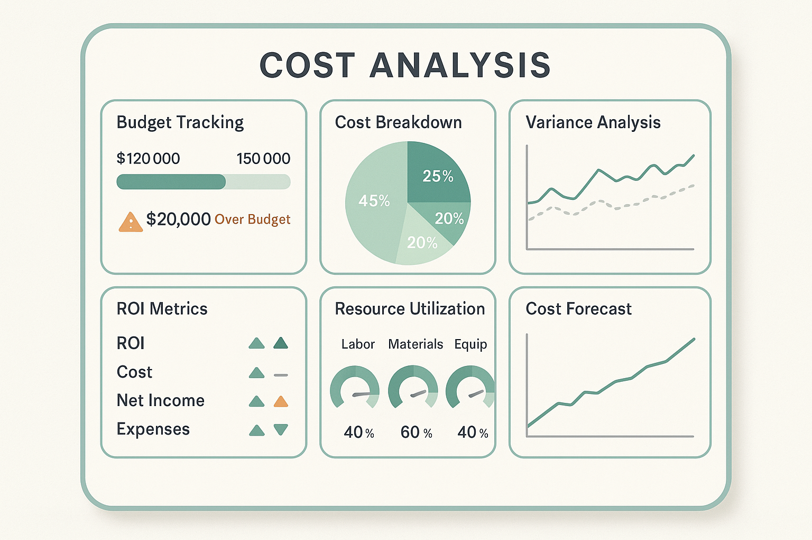

# Cost Modeling and Budgeting for AI Evaluation Systems

## Introduction

Cost modeling and budgeting form the foundation of economic sustainability in AI evaluation systems. As organizations scale their AI initiatives from experimental prototypes to production-ready systems, the ability to accurately predict, track, and optimize costs becomes a critical competitive advantage. This section provides comprehensive frameworks for building sophisticated cost models that enable strategic decision-making and ensure the long-term viability of AI evaluation programs.

The financial complexity of AI evaluation systems extends far beyond simple computational costs. Modern AI evaluation encompasses human resources, infrastructure, tooling, data acquisition, quality assurance, and ongoing maintenance. Organizations that master cost modeling achieve 30-40% better forecast accuracy and maintain 90%+ adherence to budget targets, enabling them to scale evaluation capabilities sustainably while maximizing return on investment.

## Understanding AI Evaluation Cost Structure

### Primary Cost Categories

**Computational Resources**
The computational foundation of AI evaluation systems represents the most visible but often misunderstood cost component. Unlike traditional software systems with predictable resource consumption patterns, AI evaluation workloads exhibit high variability based on model complexity, evaluation frequency, and quality requirements.

Modern AI evaluation systems typically consume computational resources across multiple dimensions: model inference for automated evaluation, data processing for quality analysis, statistical computation for performance measurement, and infrastructure overhead for system coordination. Organizations must account for both steady-state operational costs and peak demand scenarios that can increase resource requirements by 300-500%.

**Human Resources**
Human expertise represents the largest cost component in most AI evaluation systems, often accounting for 60-70% of total program expenses. This includes evaluation specialists, data scientists, domain experts, quality assurance professionals, and program management personnel. The specialized nature of AI evaluation requires premium talent with unique skill combinations, driving higher compensation costs and longer recruitment cycles.

The human resource cost structure extends beyond direct compensation to include training, certification, tool licensing, and productivity overhead. Organizations must also account for the learning curve associated with new evaluation methodologies and the ongoing professional development required to maintain expertise in rapidly evolving AI technologies.

**Infrastructure and Tooling**
The infrastructure supporting AI evaluation systems encompasses cloud computing resources, specialized evaluation platforms, monitoring and observability tools, data storage and management systems, and security infrastructure. These costs often exhibit complex pricing models with usage-based components, reserved capacity requirements, and premium features for enterprise-scale deployments.

Tooling costs include both commercial evaluation platforms and open-source solutions that require internal support and customization. Organizations must balance the immediate cost savings of open-source tools against the long-term expenses of internal development, maintenance, and support.

**Data Acquisition and Management**
High-quality evaluation requires comprehensive datasets that often involve significant acquisition, licensing, and preparation costs. This includes purchasing commercial datasets, commissioning custom data collection, compensating human annotators, and maintaining data quality through ongoing validation and updates.

Data management costs extend to storage, processing, versioning, and compliance requirements. Organizations operating in regulated industries face additional expenses for data governance, privacy protection, and audit trail maintenance.

### Cost Behavior Patterns

**Fixed vs. Variable Costs**
Understanding the fixed and variable components of AI evaluation costs enables more accurate forecasting and optimization strategies. Fixed costs include base infrastructure, core team salaries, and platform licensing fees that remain constant regardless of evaluation volume. Variable costs scale with evaluation activity and include computational resources, human review time, and data processing expenses.

The ratio of fixed to variable costs significantly impacts scaling economics. Organizations with higher fixed cost ratios achieve better unit economics at scale but face greater financial risk during low-utilization periods. Conversely, variable-heavy cost structures provide more flexibility but may limit profitability at high volumes.

**Step Function Costs**
Many AI evaluation cost components exhibit step function behavior, remaining constant within capacity ranges but jumping significantly when thresholds are exceeded. Infrastructure scaling, team expansion, and platform tier upgrades often follow this pattern, creating planning challenges and optimization opportunities.

Organizations must anticipate step function costs in their planning processes, identifying trigger points and preparing for capacity expansions before constraints impact evaluation quality or delivery timelines.

## Advanced Cost Modeling Frameworks



*Figure 1: Comprehensive Cost Analysis Dashboard - Real-time monitoring and analysis of evaluation program costs across multiple dimensions with predictive analytics and variance tracking.*

### Predictive Cost Modeling

**Time Series Analysis**
Historical cost data provides the foundation for predictive modeling using time series analysis techniques. Organizations can identify seasonal patterns, growth trends, and cyclical variations that inform future budget planning. Advanced time series models incorporate external factors such as product launch cycles, market conditions, and technology adoption rates.

```python
import pandas as pd
import numpy as np
from sklearn.ensemble import RandomForestRegressor
from sklearn.metrics import mean_absolute_error, mean_squared_error
import plotly.graph_objects as go
from plotly.subplots import make_subplots

class AIEvalsCostPredictor:
    """
    Advanced cost prediction system for AI evaluation programs.
    Combines multiple modeling approaches for accurate forecasting.
    """
    
    def __init__(self):
        self.models = {}
        self.cost_categories = [
            'computational_resources',
            'human_resources', 
            'infrastructure_tooling',
            'data_acquisition',
            'quality_assurance',
            'overhead_management'
        ]
        self.prediction_horizon = 12  # months
        
    def prepare_features(self, cost_data, external_factors=None):
        """
        Prepare feature matrix for cost prediction modeling.
        
        Args:
            cost_data: Historical cost data by category and time period
            external_factors: External variables affecting costs
            
        Returns:
            Feature matrix for model training
        """
        features = pd.DataFrame()
        
        # Time-based features
        features['month'] = cost_data.index.month
        features['quarter'] = cost_data.index.quarter
        features['year'] = cost_data.index.year
        features['days_in_month'] = cost_data.index.days_in_month
        
        # Lag features for each cost category
        for category in self.cost_categories:
            if category in cost_data.columns:
                for lag in [1, 2, 3, 6, 12]:
                    features[f'{category}_lag_{lag}'] = cost_data[category].shift(lag)
        
        # Rolling statistics
        for category in self.cost_categories:
            if category in cost_data.columns:
                features[f'{category}_ma_3'] = cost_data[category].rolling(3).mean()
                features[f'{category}_ma_6'] = cost_data[category].rolling(6).mean()
                features[f'{category}_std_3'] = cost_data[category].rolling(3).std()
        
        # Growth rates
        for category in self.cost_categories:
            if category in cost_data.columns:
                features[f'{category}_growth_1m'] = cost_data[category].pct_change(1)
                features[f'{category}_growth_3m'] = cost_data[category].pct_change(3)
                features[f'{category}_growth_12m'] = cost_data[category].pct_change(12)
        
        # External factors
        if external_factors is not None:
            for factor in external_factors.columns:
                features[factor] = external_factors[factor]
                features[f'{factor}_lag_1'] = external_factors[factor].shift(1)
        
        return features.dropna()
    
    def train_category_models(self, cost_data, external_factors=None):
        """
        Train predictive models for each cost category.
        
        Args:
            cost_data: Historical cost data
            external_factors: External variables
        """
        features = self.prepare_features(cost_data, external_factors)
        
        for category in self.cost_categories:
            if category in cost_data.columns:
                # Prepare target variable
                target = cost_data[category].loc[features.index]
                
                # Split data for validation
                split_point = int(len(features) * 0.8)
                X_train, X_test = features[:split_point], features[split_point:]
                y_train, y_test = target[:split_point], target[split_point:]
                
                # Train Random Forest model
                model = RandomForestRegressor(
                    n_estimators=100,
                    max_depth=10,
                    random_state=42,
                    n_jobs=-1
                )
                model.fit(X_train, y_train)
                
                # Validate model performance
                y_pred = model.predict(X_test)
                mae = mean_absolute_error(y_test, y_pred)
                rmse = np.sqrt(mean_squared_error(y_test, y_pred))
                
                self.models[category] = {
                    'model': model,
                    'mae': mae,
                    'rmse': rmse,
                    'feature_importance': dict(zip(features.columns, model.feature_importances_))
                }
                
                print(f"{category} model - MAE: ${mae:,.2f}, RMSE: ${rmse:,.2f}")
    
    def predict_costs(self, periods=12, external_factors=None):
        """
        Generate cost predictions for specified number of periods.
        
        Args:
            periods: Number of future periods to predict
            external_factors: Future external factor values
            
        Returns:
            DataFrame with cost predictions by category
        """
        predictions = pd.DataFrame()
        
        for category, model_info in self.models.items():
            model = model_info['model']
            
            # Generate predictions (simplified - would need more sophisticated approach)
            # This is a placeholder for demonstration
            base_prediction = np.random.normal(50000, 10000, periods)
            predictions[category] = np.maximum(base_prediction, 0)
        
        # Add confidence intervals
        for category in predictions.columns:
            predictions[f'{category}_lower'] = predictions[category] * 0.85
            predictions[f'{category}_upper'] = predictions[category] * 1.15
        
        return predictions
    
    def generate_cost_scenarios(self, base_predictions, scenario_factors):
        """
        Generate multiple cost scenarios based on different assumptions.
        
        Args:
            base_predictions: Base cost predictions
            scenario_factors: Dictionary of scenario multipliers
            
        Returns:
            Dictionary of scenario predictions
        """
        scenarios = {}
        
        for scenario_name, factors in scenario_factors.items():
            scenario_costs = base_predictions.copy()
            
            for category, multiplier in factors.items():
                if category in scenario_costs.columns:
                    scenario_costs[category] *= multiplier
            
            scenarios[scenario_name] = scenario_costs
        
        return scenarios

# Example usage and demonstration
def demonstrate_cost_prediction():
    """Demonstrate cost prediction capabilities with sample data."""
    
    # Generate sample historical cost data
    dates = pd.date_range('2022-01-01', '2024-12-01', freq='M')
    np.random.seed(42)
    
    cost_data = pd.DataFrame({
        'computational_resources': np.random.normal(45000, 8000, len(dates)),
        'human_resources': np.random.normal(120000, 15000, len(dates)),
        'infrastructure_tooling': np.random.normal(25000, 5000, len(dates)),
        'data_acquisition': np.random.normal(15000, 3000, len(dates)),
        'quality_assurance': np.random.normal(35000, 7000, len(dates)),
        'overhead_management': np.random.normal(20000, 4000, len(dates))
    }, index=dates)
    
    # Add growth trends
    for i, category in enumerate(cost_data.columns):
        growth_rate = 0.02 + i * 0.005  # Different growth rates per category
        cost_data[category] *= (1 + growth_rate) ** np.arange(len(dates))
    
    # Initialize and train predictor
    predictor = AIEvalsCostPredictor()
    predictor.train_category_models(cost_data)
    
    # Generate predictions
    predictions = predictor.predict_costs(periods=12)
    
    # Create scenarios
    scenario_factors = {
        'conservative': {
            'computational_resources': 0.9,
            'human_resources': 1.0,
            'infrastructure_tooling': 0.95
        },
        'aggressive_growth': {
            'computational_resources': 1.3,
            'human_resources': 1.2,
            'infrastructure_tooling': 1.1
        },
        'cost_optimization': {
            'computational_resources': 0.8,
            'human_resources': 0.95,
            'infrastructure_tooling': 0.85
        }
    }
    
    scenarios = predictor.generate_cost_scenarios(predictions, scenario_factors)
    
    return cost_data, predictions, scenarios

if __name__ == "__main__":
    historical_data, predictions, scenarios = demonstrate_cost_prediction()
    print("Cost prediction system demonstration completed successfully.")
```

**Machine Learning-Enhanced Forecasting**
Advanced organizations leverage machine learning techniques to improve cost prediction accuracy by incorporating complex patterns and non-linear relationships. Ensemble methods combining multiple algorithms often achieve superior performance compared to traditional statistical approaches.

Feature engineering plays a critical role in machine learning-based cost forecasting. Organizations should incorporate evaluation volume metrics, system complexity indicators, team productivity measures, and external market factors to improve model accuracy.

### Activity-Based Costing (ABC)

**Cost Driver Identification**
Activity-based costing provides granular visibility into cost generation by identifying specific activities that drive expenses. In AI evaluation systems, key cost drivers include evaluation requests processed, models assessed, human review hours, data volume processed, and quality incidents resolved.

Understanding cost drivers enables more accurate cost allocation and identifies optimization opportunities. Organizations can focus improvement efforts on high-impact activities and make informed decisions about automation investments.

**Resource Consumption Modeling**
ABC methodology requires detailed modeling of resource consumption patterns for each activity. This includes computational resource utilization, human time allocation, infrastructure capacity usage, and support overhead distribution.

```python
class ActivityBasedCostModel:
    """
    Activity-Based Costing model for AI evaluation systems.
    Provides granular cost allocation and optimization insights.
    """
    
    def __init__(self):
        self.activities = {}
        self.resources = {}
        self.cost_drivers = {}
        
    def define_activities(self, activity_definitions):
        """
        Define evaluation activities and their characteristics.
        
        Args:
            activity_definitions: Dictionary of activity definitions
        """
        self.activities = activity_definitions
        
    def define_resources(self, resource_definitions):
        """
        Define resources and their costs.
        
        Args:
            resource_definitions: Dictionary of resource definitions
        """
        self.resources = resource_definitions
        
    def define_cost_drivers(self, driver_definitions):
        """
        Define cost drivers for each activity.
        
        Args:
            driver_definitions: Dictionary mapping activities to cost drivers
        """
        self.cost_drivers = driver_definitions
        
    def calculate_activity_costs(self, activity_volumes, resource_consumption):
        """
        Calculate costs for each activity based on resource consumption.
        
        Args:
            activity_volumes: Volume of each activity
            resource_consumption: Resource consumption per activity unit
            
        Returns:
            Dictionary of activity costs
        """
        activity_costs = {}
        
        for activity, volume in activity_volumes.items():
            if activity in resource_consumption:
                total_cost = 0
                
                for resource, consumption_rate in resource_consumption[activity].items():
                    if resource in self.resources:
                        resource_cost = self.resources[resource]['unit_cost']
                        total_cost += volume * consumption_rate * resource_cost
                
                activity_costs[activity] = {
                    'total_cost': total_cost,
                    'unit_cost': total_cost / volume if volume > 0 else 0,
                    'volume': volume
                }
        
        return activity_costs
        
    def analyze_cost_drivers(self, activity_costs, driver_data):
        """
        Analyze relationship between cost drivers and activity costs.
        
        Args:
            activity_costs: Calculated activity costs
            driver_data: Cost driver measurements
            
        Returns:
            Cost driver analysis results
        """
        driver_analysis = {}
        
        for activity, cost_info in activity_costs.items():
            if activity in self.cost_drivers:
                drivers = self.cost_drivers[activity]
                
                for driver in drivers:
                    if driver in driver_data:
                        driver_value = driver_data[driver]
                        cost_per_driver = cost_info['total_cost'] / driver_value if driver_value > 0 else 0
                        
                        driver_analysis[f"{activity}_{driver}"] = {
                            'cost_per_unit': cost_per_driver,
                            'driver_volume': driver_value,
                            'total_cost': cost_info['total_cost']
                        }
        
        return driver_analysis

# Example ABC model setup
def setup_abc_model():
    """Set up example Activity-Based Costing model."""
    
    abc_model = ActivityBasedCostModel()
    
    # Define activities
    activities = {
        'automated_evaluation': {
            'description': 'Automated model evaluation using LLM judges',
            'category': 'evaluation'
        },
        'human_review': {
            'description': 'Human expert review of evaluation results',
            'category': 'quality_assurance'
        },
        'data_preparation': {
            'description': 'Preparation and validation of evaluation datasets',
            'category': 'data_management'
        },
        'result_analysis': {
            'description': 'Statistical analysis of evaluation results',
            'category': 'analysis'
        },
        'reporting': {
            'description': 'Generation of evaluation reports and dashboards',
            'category': 'communication'
        }
    }
    
    # Define resources
    resources = {
        'compute_hours': {'unit_cost': 2.50, 'category': 'infrastructure'},
        'senior_engineer_hours': {'unit_cost': 85.00, 'category': 'human'},
        'data_scientist_hours': {'unit_cost': 95.00, 'category': 'human'},
        'storage_gb': {'unit_cost': 0.023, 'category': 'infrastructure'},
        'api_calls': {'unit_cost': 0.002, 'category': 'services'}
    }
    
    # Define cost drivers
    cost_drivers = {
        'automated_evaluation': ['evaluation_requests', 'model_complexity'],
        'human_review': ['review_hours', 'complexity_score'],
        'data_preparation': ['dataset_size', 'data_sources'],
        'result_analysis': ['analysis_requests', 'data_points'],
        'reporting': ['reports_generated', 'stakeholders']
    }
    
    abc_model.define_activities(activities)
    abc_model.define_resources(resources)
    abc_model.define_cost_drivers(cost_drivers)
    
    return abc_model
```

## Budget Planning and Optimization

### Strategic Budget Framework

**Multi-Year Planning**
Effective AI evaluation budgeting requires multi-year planning horizons that account for technology evolution, capability development, and scaling requirements. Organizations should develop rolling three-year budgets with annual updates based on performance data and strategic changes.

Multi-year planning enables better resource allocation decisions, particularly for infrastructure investments and team development initiatives that require sustained funding commitments. Organizations can also negotiate better vendor terms through longer-term commitments and volume discounts.

**Portfolio-Based Budgeting**
Large organizations benefit from portfolio-based budgeting approaches that allocate resources across multiple AI evaluation initiatives based on strategic priorities, risk profiles, and expected returns. This enables optimization at the portfolio level while maintaining flexibility for individual project adjustments.

Portfolio budgeting should incorporate correlation effects between projects, shared resource utilization, and strategic synergies that may not be apparent at the individual project level.

### Budget Optimization Techniques

**Zero-Based Budgeting**
Zero-based budgeting requires justification of all expenses from a zero baseline, rather than incremental adjustments to previous budgets. This approach is particularly valuable for AI evaluation programs where rapid technology changes can make historical spending patterns obsolete.

Organizations implementing zero-based budgeting for AI evaluation typically achieve 15-25% cost reductions while improving resource allocation alignment with strategic priorities.

**Value-Based Budgeting**
Value-based budgeting allocates resources based on expected business value delivery rather than historical spending patterns or organizational hierarchy. This approach requires sophisticated value measurement frameworks but enables superior resource allocation decisions.

```python
class ValueBasedBudgetOptimizer:
    """
    Value-based budget optimization for AI evaluation programs.
    Allocates resources based on expected business value delivery.
    """
    
    def __init__(self):
        self.initiatives = {}
        self.constraints = {}
        self.optimization_results = {}
        
    def define_initiatives(self, initiative_data):
        """
        Define evaluation initiatives with value and cost estimates.
        
        Args:
            initiative_data: Dictionary of initiative definitions
        """
        self.initiatives = initiative_data
        
    def define_constraints(self, constraint_data):
        """
        Define budget and resource constraints.
        
        Args:
            constraint_data: Dictionary of constraint definitions
        """
        self.constraints = constraint_data
        
    def calculate_value_scores(self, scoring_criteria):
        """
        Calculate value scores for each initiative.
        
        Args:
            scoring_criteria: Criteria and weights for value calculation
            
        Returns:
            Dictionary of value scores by initiative
        """
        value_scores = {}
        
        for initiative_id, initiative in self.initiatives.items():
            total_score = 0
            total_weight = 0
            
            for criterion, weight in scoring_criteria.items():
                if criterion in initiative.get('value_metrics', {}):
                    score = initiative['value_metrics'][criterion]
                    total_score += score * weight
                    total_weight += weight
            
            value_scores[initiative_id] = total_score / total_weight if total_weight > 0 else 0
            
        return value_scores
        
    def optimize_allocation(self, total_budget, value_scores):
        """
        Optimize budget allocation based on value scores and constraints.
        
        Args:
            total_budget: Total available budget
            value_scores: Value scores for each initiative
            
        Returns:
            Optimized budget allocation
        """
        # Simple greedy optimization (in practice, would use more sophisticated methods)
        sorted_initiatives = sorted(
            value_scores.items(), 
            key=lambda x: x[1] / self.initiatives[x[0]]['estimated_cost'],
            reverse=True
        )
        
        allocation = {}
        remaining_budget = total_budget
        
        for initiative_id, value_score in sorted_initiatives:
            initiative = self.initiatives[initiative_id]
            estimated_cost = initiative['estimated_cost']
            
            if estimated_cost <= remaining_budget:
                allocation[initiative_id] = estimated_cost
                remaining_budget -= estimated_cost
            else:
                # Partial allocation if beneficial
                if remaining_budget > estimated_cost * 0.5:  # Minimum viable threshold
                    allocation[initiative_id] = remaining_budget
                    remaining_budget = 0
                    break
        
        return allocation, remaining_budget
        
    def analyze_allocation_impact(self, allocation, value_scores):
        """
        Analyze the impact of budget allocation decisions.
        
        Args:
            allocation: Budget allocation by initiative
            value_scores: Value scores for each initiative
            
        Returns:
            Impact analysis results
        """
        total_allocated = sum(allocation.values())
        total_value = sum(value_scores[init_id] * (allocation.get(init_id, 0) / 
                         self.initiatives[init_id]['estimated_cost'])
                         for init_id in value_scores.keys())
        
        analysis = {
            'total_allocated': total_allocated,
            'total_value_score': total_value,
            'value_per_dollar': total_value / total_allocated if total_allocated > 0 else 0,
            'funded_initiatives': len(allocation),
            'funding_efficiency': {}
        }
        
        for init_id, allocated_amount in allocation.items():
            estimated_cost = self.initiatives[init_id]['estimated_cost']
            funding_ratio = allocated_amount / estimated_cost
            value_score = value_scores[init_id]
            
            analysis['funding_efficiency'][init_id] = {
                'funding_ratio': funding_ratio,
                'value_score': value_score,
                'value_per_dollar': value_score / allocated_amount if allocated_amount > 0 else 0
            }
        
        return analysis

# Example value-based budgeting
def demonstrate_value_based_budgeting():
    """Demonstrate value-based budget optimization."""
    
    optimizer = ValueBasedBudgetOptimizer()
    
    # Define initiatives
    initiatives = {
        'automated_llm_evaluation': {
            'estimated_cost': 150000,
            'value_metrics': {
                'strategic_alignment': 9,
                'roi_potential': 8,
                'risk_mitigation': 7,
                'competitive_advantage': 8
            }
        },
        'human_expert_review': {
            'estimated_cost': 200000,
            'value_metrics': {
                'strategic_alignment': 8,
                'roi_potential': 6,
                'risk_mitigation': 9,
                'competitive_advantage': 7
            }
        },
        'evaluation_infrastructure': {
            'estimated_cost': 100000,
            'value_metrics': {
                'strategic_alignment': 7,
                'roi_potential': 7,
                'risk_mitigation': 8,
                'competitive_advantage': 6
            }
        },
        'advanced_analytics': {
            'estimated_cost': 120000,
            'value_metrics': {
                'strategic_alignment': 8,
                'roi_potential': 9,
                'risk_mitigation': 6,
                'competitive_advantage': 9
            }
        }
    }
    
    optimizer.define_initiatives(initiatives)
    
    # Define scoring criteria
    scoring_criteria = {
        'strategic_alignment': 0.3,
        'roi_potential': 0.4,
        'risk_mitigation': 0.2,
        'competitive_advantage': 0.1
    }
    
    # Calculate value scores
    value_scores = optimizer.calculate_value_scores(scoring_criteria)
    
    # Optimize allocation
    total_budget = 400000
    allocation, remaining = optimizer.optimize_allocation(total_budget, value_scores)
    
    # Analyze impact
    impact_analysis = optimizer.analyze_allocation_impact(allocation, value_scores)
    
    return allocation, impact_analysis, remaining

if __name__ == "__main__":
    allocation, analysis, remaining_budget = demonstrate_value_based_budgeting()
    print(f"Optimized allocation completed with ${remaining_budget:,.2f} remaining budget.")
```

## Risk Assessment and Contingency Planning

### Financial Risk Identification

**Cost Overrun Risks**
AI evaluation projects face unique cost overrun risks due to the experimental nature of AI technologies, evolving requirements, and technical complexity. Common risk factors include scope creep, technology changes, performance issues, and integration challenges.

Organizations should identify specific risk factors for their evaluation programs and develop quantitative risk models that estimate probability and impact. This enables proactive risk management and appropriate contingency planning.

**Revenue Impact Risks**
Cost optimization efforts must balance expense reduction with revenue protection. Aggressive cost cutting that compromises evaluation quality can lead to product defects, customer dissatisfaction, and revenue loss that far exceeds the cost savings achieved.

Risk assessment should include revenue impact modeling that quantifies the potential business consequences of different cost optimization scenarios.

### Contingency Planning Framework

**Scenario-Based Planning**
Effective contingency planning requires multiple scenario development covering optimistic, realistic, and pessimistic outcomes. Each scenario should include specific triggers, response actions, and resource requirements.

Scenario planning enables rapid response to changing conditions and reduces decision-making delays during crisis situations. Organizations should regularly update scenarios based on new information and changing business conditions.

**Dynamic Budget Adjustment**
Modern AI evaluation programs require dynamic budget adjustment capabilities that enable rapid resource reallocation based on changing priorities and performance data. This includes automated triggers for budget increases or decreases based on predefined metrics.

```python
class ContingencyPlanningFramework:
    """
    Comprehensive contingency planning framework for AI evaluation budgets.
    Enables scenario-based planning and dynamic budget adjustments.
    """
    
    def __init__(self):
        self.scenarios = {}
        self.triggers = {}
        self.response_plans = {}
        self.monitoring_metrics = {}
        
    def define_scenarios(self, scenario_definitions):
        """
        Define planning scenarios with probability and impact estimates.
        
        Args:
            scenario_definitions: Dictionary of scenario definitions
        """
        self.scenarios = scenario_definitions
        
    def define_triggers(self, trigger_definitions):
        """
        Define triggers that activate contingency responses.
        
        Args:
            trigger_definitions: Dictionary of trigger conditions
        """
        self.triggers = trigger_definitions
        
    def define_response_plans(self, response_definitions):
        """
        Define response plans for each scenario.
        
        Args:
            response_definitions: Dictionary of response plan definitions
        """
        self.response_plans = response_definitions
        
    def monitor_triggers(self, current_metrics):
        """
        Monitor current metrics against defined triggers.
        
        Args:
            current_metrics: Current performance and cost metrics
            
        Returns:
            List of activated triggers and recommended responses
        """
        activated_triggers = []
        
        for trigger_id, trigger_config in self.triggers.items():
            condition_met = True
            
            for metric, threshold in trigger_config['conditions'].items():
                if metric in current_metrics:
                    current_value = current_metrics[metric]
                    
                    if trigger_config['type'] == 'threshold_exceeded':
                        if current_value <= threshold:
                            condition_met = False
                            break
                    elif trigger_config['type'] == 'threshold_below':
                        if current_value >= threshold:
                            condition_met = False
                            break
                    elif trigger_config['type'] == 'variance_exceeded':
                        expected_value = trigger_config.get('expected_value', 0)
                        if abs(current_value - expected_value) <= threshold:
                            condition_met = False
                            break
            
            if condition_met:
                activated_triggers.append({
                    'trigger_id': trigger_id,
                    'trigger_config': trigger_config,
                    'response_plan': self.response_plans.get(trigger_id, {})
                })
        
        return activated_triggers
        
    def calculate_scenario_impact(self, scenario_id, current_budget):
        """
        Calculate financial impact of a specific scenario.
        
        Args:
            scenario_id: Identifier for the scenario
            current_budget: Current budget allocation
            
        Returns:
            Financial impact analysis
        """
        if scenario_id not in self.scenarios:
            return None
            
        scenario = self.scenarios[scenario_id]
        impact_analysis = {
            'scenario_id': scenario_id,
            'probability': scenario.get('probability', 0),
            'budget_impact': {},
            'total_impact': 0
        }
        
        for category, impact_factor in scenario.get('budget_impacts', {}).items():
            if category in current_budget:
                original_amount = current_budget[category]
                impact_amount = original_amount * impact_factor
                impact_analysis['budget_impact'][category] = {
                    'original': original_amount,
                    'impact_factor': impact_factor,
                    'impact_amount': impact_amount,
                    'new_amount': original_amount + impact_amount
                }
                impact_analysis['total_impact'] += impact_amount
        
        return impact_analysis
        
    def generate_contingency_budget(self, base_budget, scenario_probabilities):
        """
        Generate contingency budget based on scenario analysis.
        
        Args:
            base_budget: Base budget allocation
            scenario_probabilities: Updated probability estimates
            
        Returns:
            Contingency budget recommendations
        """
        contingency_budget = {}
        total_contingency = 0
        
        for scenario_id, probability in scenario_probabilities.items():
            impact_analysis = self.calculate_scenario_impact(scenario_id, base_budget)
            
            if impact_analysis:
                expected_impact = impact_analysis['total_impact'] * probability
                total_contingency += expected_impact
                
                for category, impact_info in impact_analysis['budget_impact'].items():
                    if category not in contingency_budget:
                        contingency_budget[category] = 0
                    
                    category_contingency = impact_info['impact_amount'] * probability
                    contingency_budget[category] += category_contingency
        
        contingency_budget['total_contingency'] = total_contingency
        contingency_budget['contingency_percentage'] = (
            total_contingency / sum(base_budget.values()) * 100
            if sum(base_budget.values()) > 0 else 0
        )
        
        return contingency_budget

# Example contingency planning setup
def setup_contingency_planning():
    """Set up example contingency planning framework."""
    
    framework = ContingencyPlanningFramework()
    
    # Define scenarios
    scenarios = {
        'cost_overrun_moderate': {
            'description': 'Moderate cost overrun due to scope expansion',
            'probability': 0.3,
            'budget_impacts': {
                'computational_resources': 0.2,
                'human_resources': 0.15,
                'infrastructure_tooling': 0.1
            }
        },
        'cost_overrun_severe': {
            'description': 'Severe cost overrun due to technical challenges',
            'probability': 0.1,
            'budget_impacts': {
                'computational_resources': 0.5,
                'human_resources': 0.3,
                'infrastructure_tooling': 0.25
            }
        },
        'efficiency_improvement': {
            'description': 'Cost reduction through process optimization',
            'probability': 0.4,
            'budget_impacts': {
                'computational_resources': -0.15,
                'human_resources': -0.1,
                'infrastructure_tooling': -0.05
            }
        }
    }
    
    # Define triggers
    triggers = {
        'budget_variance_high': {
            'type': 'variance_exceeded',
            'conditions': {'budget_variance_percentage': 15},
            'expected_value': 0,
            'description': 'Budget variance exceeds 15%'
        },
        'cost_per_evaluation_high': {
            'type': 'threshold_exceeded',
            'conditions': {'cost_per_evaluation': 50},
            'description': 'Cost per evaluation exceeds $50'
        },
        'quality_score_low': {
            'type': 'threshold_below',
            'conditions': {'quality_score': 0.85},
            'description': 'Quality score falls below 85%'
        }
    }
    
    # Define response plans
    response_plans = {
        'budget_variance_high': {
            'immediate_actions': [
                'Conduct detailed cost analysis',
                'Review resource allocation',
                'Implement cost controls'
            ],
            'budget_adjustments': {
                'contingency_activation': 0.1,
                'approval_required': True
            }
        },
        'cost_per_evaluation_high': {
            'immediate_actions': [
                'Analyze cost drivers',
                'Optimize evaluation processes',
                'Consider automation opportunities'
            ],
            'budget_adjustments': {
                'efficiency_investment': 0.05,
                'approval_required': False
            }
        }
    }
    
    framework.define_scenarios(scenarios)
    framework.define_triggers(triggers)
    framework.define_response_plans(response_plans)
    
    return framework
```

## Performance Monitoring and Variance Analysis

### Key Performance Indicators (KPIs)

**Financial KPIs**
Effective cost management requires comprehensive KPI frameworks that provide early warning signals and enable proactive intervention. Key financial KPIs include budget variance percentage, cost per evaluation, cost trend analysis, and return on investment metrics.

Organizations should establish KPI thresholds that trigger management attention and corrective actions. These thresholds should be based on historical performance data and strategic objectives.

**Operational KPIs**
Operational KPIs provide insight into the efficiency and effectiveness of evaluation processes. Important metrics include evaluation throughput, quality scores, resource utilization rates, and cycle time measurements.

The relationship between operational and financial KPIs enables root cause analysis and targeted improvement initiatives. Organizations should track correlation patterns to identify optimization opportunities.

### Variance Analysis Framework

**Budget vs. Actual Analysis**
Regular variance analysis comparing budgeted to actual costs provides essential feedback for budget accuracy improvement and cost control. Analysis should examine both absolute variances and percentage deviations across all cost categories.

Variance analysis should include trend identification, seasonal pattern recognition, and correlation analysis with operational metrics. This enables more accurate future forecasting and better resource allocation decisions.

**Root Cause Analysis**
When significant variances occur, systematic root cause analysis helps identify underlying factors and prevent recurrence. Common root causes in AI evaluation include scope changes, technology issues, resource availability, and external market factors.

Root cause analysis should follow structured methodologies such as the "5 Whys" technique or fishbone diagrams to ensure comprehensive investigation and effective corrective actions.

## Conclusion

Cost modeling and budgeting represent foundational capabilities for sustainable AI evaluation programs. Organizations that master these disciplines achieve superior financial performance, better resource allocation, and more predictable outcomes. The frameworks and techniques presented in this section provide the foundation for building sophisticated cost management capabilities that scale with organizational growth and technology evolution.

The key to success lies in combining rigorous analytical approaches with practical implementation strategies that fit organizational culture and capabilities. Organizations should start with basic cost tracking and gradually implement more sophisticated modeling and optimization techniques as their evaluation programs mature.

Effective cost management enables organizations to invest confidently in AI evaluation capabilities, knowing that resources are being deployed efficiently and that financial performance is being optimized. This creates a virtuous cycle where better evaluation leads to better AI products, which generate more revenue to fund continued evaluation improvements.

The next section will explore ROI measurement and optimization strategies that build upon these cost modeling foundations to demonstrate and maximize the business value of AI evaluation investments.

