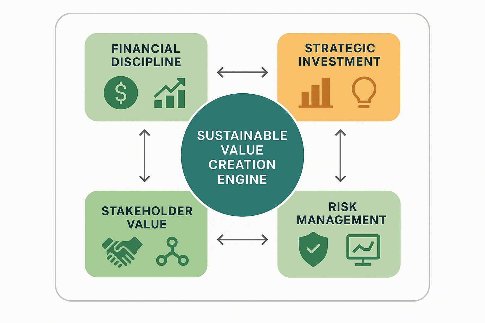

# Economic Sustainability Frameworks



*Figure 6: Economic Sustainability Framework - Sustainable value creation engine with financial discipline, strategic investment, risk management, and stakeholder value pillars for long-term economic viability.*

## Introduction

Economic sustainability frameworks provide the strategic foundation for ensuring that AI evaluation programs deliver long-term value while maintaining financial viability and operational excellence. Unlike short-term cost optimization tactics, sustainability frameworks focus on building evaluation capabilities that generate consistent value over time, adapt to changing requirements, and support organizational growth objectives. This section presents comprehensive approaches to developing economically sustainable evaluation programs that balance immediate efficiency with long-term strategic value creation.

The challenge of economic sustainability in AI evaluation extends beyond traditional cost management to encompass value creation, risk mitigation, capability development, and strategic alignment. Organizations that master economic sustainability achieve 30-50% better long-term ROI from evaluation investments and maintain 40-60% more stable cost structures compared to those focused solely on short-term optimization.

Modern sustainability frameworks must account for rapidly evolving AI technologies, changing regulatory requirements, competitive pressures, and organizational growth dynamics. The most successful organizations implement adaptive sustainability frameworks that balance financial discipline with innovation investment, operational efficiency with strategic flexibility, and immediate value with long-term capability development.

## Foundational Principles of Economic Sustainability

### Value-Centric Approach

**Business Value Alignment**
Economic sustainability begins with clear alignment between evaluation investments and business value creation. This requires understanding how evaluation capabilities contribute to organizational objectives, competitive advantage, and strategic success. Value alignment ensures that evaluation programs generate returns that justify their costs and support continued investment.

Effective value alignment involves:
- **Strategic Objective Mapping**: Connecting evaluation capabilities to specific business goals
- **Value Stream Analysis**: Understanding how evaluation contributes to value creation processes
- **Competitive Advantage Assessment**: Identifying how evaluation capabilities differentiate the organization
- **Stakeholder Value Definition**: Clarifying value propositions for different stakeholder groups
- **Impact Measurement**: Quantifying the business impact of evaluation investments

**Long-Term Value Creation**
Sustainable evaluation programs focus on creating long-term value rather than optimizing short-term costs. This involves building capabilities that appreciate over time, generate compound returns, and support future growth opportunities. Long-term value creation requires strategic thinking and patient capital allocation.

Long-term value creation strategies include:
- **Capability Investment**: Building evaluation expertise and infrastructure that improves over time
- **Knowledge Assets**: Developing intellectual property and best practices that create lasting value
- **Platform Development**: Creating reusable evaluation platforms that support multiple initiatives
- **Ecosystem Building**: Developing evaluation ecosystems that generate network effects
- **Innovation Investment**: Investing in emerging evaluation technologies and methodologies

### Financial Discipline and Control

**Cost Structure Optimization**
Sustainable evaluation programs maintain disciplined cost structures that balance efficiency with capability development. This requires understanding cost drivers, optimizing resource allocation, and maintaining cost flexibility to adapt to changing conditions.

```python
import pandas as pd
import numpy as np
from datetime import datetime, timedelta
from typing import Dict, List, Optional, Tuple
import matplotlib.pyplot as plt
import seaborn as sns
from dataclasses import dataclass
from enum import Enum

class CostCategory(Enum):
    PERSONNEL = "personnel"
    INFRASTRUCTURE = "infrastructure"
    TOOLS_LICENSES = "tools_licenses"
    EXTERNAL_SERVICES = "external_services"
    TRAINING_DEVELOPMENT = "training_development"
    RESEARCH_INNOVATION = "research_innovation"

class SustainabilityMetric(Enum):
    ROI = "roi"
    COST_EFFICIENCY = "cost_efficiency"
    VALUE_CREATION = "value_creation"
    CAPABILITY_MATURITY = "capability_maturity"
    FINANCIAL_STABILITY = "financial_stability"
    STRATEGIC_ALIGNMENT = "strategic_alignment"

@dataclass
class SustainabilityTarget:
    """Target values for sustainability metrics."""
    metric: SustainabilityMetric
    target_value: float
    tolerance: float
    measurement_period: str  # 'monthly', 'quarterly', 'annually'
    priority: str  # 'critical', 'important', 'monitoring'

class EconomicSustainabilityFramework:
    """
    Comprehensive framework for managing economic sustainability of AI evaluation programs.
    Provides strategic planning, monitoring, and optimization capabilities.
    """
    
    def __init__(self):
        self.cost_structure = {}
        self.value_metrics = {}
        self.sustainability_targets = {}
        self.performance_history = []
        self.investment_portfolio = {}
        self.risk_assessments = {}
        
    def define_cost_structure(self, cost_breakdown: Dict[CostCategory, Dict]):
        """
        Define the cost structure for the evaluation program.
        
        Args:
            cost_breakdown: Detailed cost breakdown by category
        """
        self.cost_structure = cost_breakdown
        
    def set_sustainability_targets(self, targets: List[SustainabilityTarget]):
        """
        Set sustainability targets for the evaluation program.
        
        Args:
            targets: List of sustainability targets
        """
        for target in targets:
            self.sustainability_targets[target.metric] = target
            
    def calculate_total_cost_of_ownership(self, time_horizon_years: int = 3) -> Dict:
        """
        Calculate comprehensive Total Cost of Ownership for the evaluation program.
        
        Args:
            time_horizon_years: Time horizon for TCO calculation
            
        Returns:
            Comprehensive TCO analysis
        """
        tco_analysis = {
            'time_horizon_years': time_horizon_years,
            'cost_by_category': {},
            'cost_by_year': [],
            'total_tco': 0,
            'cost_trends': {},
            'optimization_opportunities': []
        }
        
        total_tco = 0
        
        # Calculate costs by category
        for category, cost_data in self.cost_structure.items():
            category_tco = self._calculate_category_tco(cost_data, time_horizon_years)
            tco_analysis['cost_by_category'][category.value] = category_tco
            total_tco += category_tco['total_cost']
        
        tco_analysis['total_tco'] = total_tco
        
        # Calculate annual cost distribution
        for year in range(time_horizon_years):
            annual_cost = self._calculate_annual_cost(year)
            tco_analysis['cost_by_year'].append({
                'year': year + 1,
                'cost': annual_cost,
                'cumulative_cost': sum(tco_analysis['cost_by_year'][i]['cost'] 
                                     for i in range(year)) + annual_cost
            })
        
        # Analyze cost trends
        tco_analysis['cost_trends'] = self._analyze_cost_trends()
        
        # Identify optimization opportunities
        tco_analysis['optimization_opportunities'] = self._identify_cost_optimization_opportunities()
        
        return tco_analysis
        
    def _calculate_category_tco(self, cost_data: Dict, years: int) -> Dict:
        """Calculate TCO for a specific cost category."""
        category_analysis = {
            'initial_cost': cost_data.get('initial_cost', 0),
            'annual_cost': cost_data.get('annual_cost', 0),
            'growth_rate': cost_data.get('growth_rate', 0.03),  # 3% default inflation
            'total_cost': 0,
            'cost_breakdown': []
        }
        
        total_cost = category_analysis['initial_cost']
        
        for year in range(years):
            annual_cost = category_analysis['annual_cost'] * (
                (1 + category_analysis['growth_rate']) ** year
            )
            total_cost += annual_cost
            
            category_analysis['cost_breakdown'].append({
                'year': year + 1,
                'annual_cost': annual_cost,
                'cumulative_cost': total_cost
            })
        
        category_analysis['total_cost'] = total_cost
        return category_analysis
        
    def _calculate_annual_cost(self, year: int) -> float:
        """Calculate total annual cost for a specific year."""
        annual_cost = 0
        
        for category, cost_data in self.cost_structure.items():
            if year == 0:
                annual_cost += cost_data.get('initial_cost', 0)
            
            base_annual = cost_data.get('annual_cost', 0)
            growth_rate = cost_data.get('growth_rate', 0.03)
            annual_cost += base_annual * ((1 + growth_rate) ** year)
        
        return annual_cost
        
    def _analyze_cost_trends(self) -> Dict:
        """Analyze cost trends across categories."""
        trends = {}
        
        for category, cost_data in self.cost_structure.items():
            growth_rate = cost_data.get('growth_rate', 0.03)
            annual_cost = cost_data.get('annual_cost', 0)
            
            trends[category.value] = {
                'growth_rate': growth_rate,
                'trend_direction': 'increasing' if growth_rate > 0 else 'stable',
                'cost_volatility': cost_data.get('volatility', 0.1),
                'optimization_potential': self._assess_optimization_potential(category, cost_data)
            }
        
        return trends
        
    def _assess_optimization_potential(self, category: CostCategory, cost_data: Dict) -> str:
        """Assess optimization potential for a cost category."""
        annual_cost = cost_data.get('annual_cost', 0)
        growth_rate = cost_data.get('growth_rate', 0.03)
        
        if annual_cost > 100000 and growth_rate > 0.05:  # High cost, high growth
            return 'high'
        elif annual_cost > 50000 or growth_rate > 0.05:  # Medium cost or growth
            return 'medium'
        else:
            return 'low'
            
    def _identify_cost_optimization_opportunities(self) -> List[Dict]:
        """Identify cost optimization opportunities."""
        opportunities = []
        
        for category, cost_data in self.cost_structure.items():
            optimization_potential = self._assess_optimization_potential(category, cost_data)
            
            if optimization_potential == 'high':
                opportunities.append({
                    'category': category.value,
                    'type': 'cost_reduction',
                    'priority': 'high',
                    'description': f'High optimization potential in {category.value}',
                    'estimated_savings': cost_data.get('annual_cost', 0) * 0.15,
                    'implementation_effort': 'medium'
                })
            elif optimization_potential == 'medium':
                opportunities.append({
                    'category': category.value,
                    'type': 'efficiency_improvement',
                    'priority': 'medium',
                    'description': f'Efficiency improvements possible in {category.value}',
                    'estimated_savings': cost_data.get('annual_cost', 0) * 0.08,
                    'implementation_effort': 'low'
                })
        
        return opportunities
        
    def assess_financial_sustainability(self, revenue_projections: List[float]) -> Dict:
        """
        Assess financial sustainability based on cost and revenue projections.
        
        Args:
            revenue_projections: Projected revenue/value for each year
            
        Returns:
            Financial sustainability assessment
        """
        tco_analysis = self.calculate_total_cost_of_ownership(len(revenue_projections))
        
        sustainability_assessment = {
            'financial_metrics': {},
            'sustainability_score': 0,
            'risk_factors': [],
            'recommendations': []
        }
        
        # Calculate financial metrics
        total_revenue = sum(revenue_projections)
        total_cost = tco_analysis['total_tco']
        
        sustainability_assessment['financial_metrics'] = {
            'total_revenue': total_revenue,
            'total_cost': total_cost,
            'net_value': total_revenue - total_cost,
            'roi': (total_revenue - total_cost) / total_cost if total_cost > 0 else 0,
            'payback_period': self._calculate_payback_period(
                tco_analysis['cost_by_year'], revenue_projections
            ),
            'break_even_year': self._calculate_break_even_year(
                tco_analysis['cost_by_year'], revenue_projections
            )
        }
        
        # Calculate sustainability score
        sustainability_assessment['sustainability_score'] = self._calculate_sustainability_score(
            sustainability_assessment['financial_metrics']
        )
        
        # Identify risk factors
        sustainability_assessment['risk_factors'] = self._identify_sustainability_risks(
            sustainability_assessment['financial_metrics'], tco_analysis
        )
        
        # Generate recommendations
        sustainability_assessment['recommendations'] = self._generate_sustainability_recommendations(
            sustainability_assessment
        )
        
        return sustainability_assessment
        
    def _calculate_payback_period(self, cost_by_year: List[Dict], 
                                revenue_projections: List[float]) -> float:
        """Calculate payback period for the evaluation program."""
        cumulative_investment = 0
        cumulative_return = 0
        
        for i, (cost_data, revenue) in enumerate(zip(cost_by_year, revenue_projections)):
            cumulative_investment += cost_data['cost']
            cumulative_return += revenue
            
            if cumulative_return >= cumulative_investment:
                return i + 1 + (cumulative_investment - cumulative_return + revenue) / revenue
        
        return len(revenue_projections) + 1  # Beyond projection period
        
    def _calculate_break_even_year(self, cost_by_year: List[Dict], 
                                 revenue_projections: List[float]) -> int:
        """Calculate break-even year for the evaluation program."""
        for i, (cost_data, revenue) in enumerate(zip(cost_by_year, revenue_projections)):
            if revenue >= cost_data['cost']:
                return i + 1
        
        return len(revenue_projections) + 1  # Beyond projection period
        
    def _calculate_sustainability_score(self, financial_metrics: Dict) -> float:
        """Calculate overall sustainability score."""
        roi = financial_metrics['roi']
        payback_period = financial_metrics['payback_period']
        net_value = financial_metrics['net_value']
        
        # Normalize metrics to 0-100 scale
        roi_score = min(100, max(0, roi * 100))
        payback_score = max(0, 100 - payback_period * 20)  # Penalty for long payback
        value_score = min(100, max(0, net_value / 1000000 * 50))  # Scale based on $1M
        
        # Weighted average
        sustainability_score = (roi_score * 0.4 + payback_score * 0.3 + value_score * 0.3)
        
        return sustainability_score
        
    def _identify_sustainability_risks(self, financial_metrics: Dict, 
                                     tco_analysis: Dict) -> List[Dict]:
        """Identify sustainability risk factors."""
        risks = []
        
        # ROI risk
        if financial_metrics['roi'] < 0.15:  # 15% ROI threshold
            risks.append({
                'type': 'low_roi',
                'severity': 'high' if financial_metrics['roi'] < 0 else 'medium',
                'description': f"ROI ({financial_metrics['roi']:.1%}) below target threshold",
                'impact': 'Financial sustainability at risk'
            })
        
        # Payback period risk
        if financial_metrics['payback_period'] > 3:  # 3-year threshold
            risks.append({
                'type': 'long_payback',
                'severity': 'medium',
                'description': f"Payback period ({financial_metrics['payback_period']:.1f} years) exceeds target",
                'impact': 'Extended investment recovery period'
            })
        
        # Cost growth risk
        high_growth_categories = [
            cat for cat, trend in tco_analysis['cost_trends'].items()
            if trend['growth_rate'] > 0.1  # 10% growth threshold
        ]
        
        if high_growth_categories:
            risks.append({
                'type': 'cost_inflation',
                'severity': 'medium',
                'description': f"High cost growth in: {', '.join(high_growth_categories)}",
                'impact': 'Increasing cost pressure over time'
            })
        
        return risks
        
    def _generate_sustainability_recommendations(self, assessment: Dict) -> List[Dict]:
        """Generate sustainability improvement recommendations."""
        recommendations = []
        
        financial_metrics = assessment['financial_metrics']
        sustainability_score = assessment['sustainability_score']
        
        # Overall sustainability recommendations
        if sustainability_score < 60:
            recommendations.append({
                'type': 'strategic_review',
                'priority': 'high',
                'title': 'Comprehensive Sustainability Review',
                'description': f'Sustainability score ({sustainability_score:.1f}) requires strategic intervention',
                'actions': [
                    'Review value proposition and business case',
                    'Optimize cost structure and resource allocation',
                    'Explore alternative funding models',
                    'Reassess strategic objectives and priorities'
                ]
            })
        
        # ROI improvement recommendations
        if financial_metrics['roi'] < 0.2:
            recommendations.append({
                'type': 'roi_improvement',
                'priority': 'high',
                'title': 'ROI Enhancement Initiative',
                'description': f'ROI ({financial_metrics["roi"]:.1%}) needs improvement',
                'actions': [
                    'Identify high-value use cases and applications',
                    'Optimize resource allocation to value-generating activities',
                    'Implement value-based pricing and cost allocation',
                    'Accelerate time-to-value for evaluation initiatives'
                ]
            })
        
        # Cost optimization recommendations
        if financial_metrics['net_value'] < 0:
            recommendations.append({
                'type': 'cost_optimization',
                'priority': 'critical',
                'title': 'Immediate Cost Reduction',
                'description': 'Negative net value requires immediate cost action',
                'actions': [
                    'Implement emergency cost reduction measures',
                    'Eliminate non-essential activities and services',
                    'Renegotiate vendor contracts and pricing',
                    'Optimize resource utilization and efficiency'
                ]
            })
        
        return recommendations
        
    def develop_investment_strategy(self, strategic_objectives: List[str], 
                                  budget_constraints: Dict) -> Dict:
        """
        Develop investment strategy aligned with strategic objectives and budget constraints.
        
        Args:
            strategic_objectives: List of strategic objectives
            budget_constraints: Budget constraints and limits
            
        Returns:
            Comprehensive investment strategy
        """
        investment_strategy = {
            'strategic_alignment': {},
            'investment_portfolio': {},
            'resource_allocation': {},
            'risk_mitigation': {},
            'performance_targets': {}
        }
        
        # Analyze strategic alignment
        investment_strategy['strategic_alignment'] = self._analyze_strategic_alignment(
            strategic_objectives
        )
        
        # Develop investment portfolio
        investment_strategy['investment_portfolio'] = self._develop_investment_portfolio(
            strategic_objectives, budget_constraints
        )
        
        # Optimize resource allocation
        investment_strategy['resource_allocation'] = self._optimize_resource_allocation(
            investment_strategy['investment_portfolio'], budget_constraints
        )
        
        # Develop risk mitigation strategies
        investment_strategy['risk_mitigation'] = self._develop_risk_mitigation_strategies(
            investment_strategy['investment_portfolio']
        )
        
        # Set performance targets
        investment_strategy['performance_targets'] = self._set_investment_performance_targets(
            investment_strategy['investment_portfolio']
        )
        
        return investment_strategy
        
    def _analyze_strategic_alignment(self, objectives: List[str]) -> Dict:
        """Analyze alignment between investments and strategic objectives."""
        alignment_analysis = {
            'objective_mapping': {},
            'investment_gaps': [],
            'alignment_score': 0
        }
        
        # Map objectives to investment categories
        for objective in objectives:
            if 'quality' in objective.lower():
                alignment_analysis['objective_mapping'][objective] = [
                    CostCategory.TOOLS_LICENSES, CostCategory.TRAINING_DEVELOPMENT
                ]
            elif 'efficiency' in objective.lower():
                alignment_analysis['objective_mapping'][objective] = [
                    CostCategory.INFRASTRUCTURE, CostCategory.EXTERNAL_SERVICES
                ]
            elif 'innovation' in objective.lower():
                alignment_analysis['objective_mapping'][objective] = [
                    CostCategory.RESEARCH_INNOVATION, CostCategory.PERSONNEL
                ]
            else:
                alignment_analysis['objective_mapping'][objective] = [
                    CostCategory.PERSONNEL
                ]
        
        return alignment_analysis
        
    def _develop_investment_portfolio(self, objectives: List[str], 
                                    constraints: Dict) -> Dict:
        """Develop balanced investment portfolio."""
        portfolio = {
            'core_investments': {},
            'growth_investments': {},
            'innovation_investments': {},
            'total_allocation': 0
        }
        
        total_budget = constraints.get('total_budget', 1000000)
        
        # Allocate budget across investment types
        core_allocation = total_budget * 0.6  # 60% for core operations
        growth_allocation = total_budget * 0.25  # 25% for growth initiatives
        innovation_allocation = total_budget * 0.15  # 15% for innovation
        
        portfolio['core_investments'] = {
            'personnel': core_allocation * 0.5,
            'infrastructure': core_allocation * 0.3,
            'tools_licenses': core_allocation * 0.2
        }
        
        portfolio['growth_investments'] = {
            'capability_expansion': growth_allocation * 0.6,
            'process_optimization': growth_allocation * 0.4
        }
        
        portfolio['innovation_investments'] = {
            'research_development': innovation_allocation * 0.7,
            'emerging_technologies': innovation_allocation * 0.3
        }
        
        portfolio['total_allocation'] = total_budget
        
        return portfolio
        
    def _optimize_resource_allocation(self, portfolio: Dict, constraints: Dict) -> Dict:
        """Optimize resource allocation within portfolio constraints."""
        optimization = {
            'allocation_efficiency': {},
            'rebalancing_recommendations': [],
            'constraint_analysis': {}
        }
        
        # Analyze allocation efficiency
        for investment_type, allocations in portfolio.items():
            if isinstance(allocations, dict):
                total_type_allocation = sum(allocations.values())
                optimization['allocation_efficiency'][investment_type] = {
                    'total_allocation': total_type_allocation,
                    'allocation_breakdown': allocations,
                    'efficiency_score': self._calculate_allocation_efficiency(allocations)
                }
        
        return optimization
        
    def _calculate_allocation_efficiency(self, allocations: Dict) -> float:
        """Calculate efficiency score for resource allocation."""
        # Simplified efficiency calculation based on allocation balance
        values = list(allocations.values())
        if not values:
            return 0
        
        mean_allocation = np.mean(values)
        variance = np.var(values)
        
        # Higher variance indicates less balanced allocation
        efficiency_score = max(0, 100 - (variance / mean_allocation * 100) if mean_allocation > 0 else 0)
        
        return efficiency_score
        
    def _develop_risk_mitigation_strategies(self, portfolio: Dict) -> Dict:
        """Develop risk mitigation strategies for investment portfolio."""
        risk_mitigation = {
            'identified_risks': [],
            'mitigation_strategies': {},
            'contingency_plans': {}
        }
        
        # Identify portfolio risks
        risk_mitigation['identified_risks'] = [
            {
                'risk_type': 'technology_obsolescence',
                'probability': 'medium',
                'impact': 'high',
                'description': 'Risk of technology investments becoming obsolete'
            },
            {
                'risk_type': 'budget_constraints',
                'probability': 'high',
                'impact': 'medium',
                'description': 'Risk of budget reductions affecting investment plans'
            },
            {
                'risk_type': 'talent_retention',
                'probability': 'medium',
                'impact': 'high',
                'description': 'Risk of losing key personnel and expertise'
            }
        ]
        
        # Develop mitigation strategies
        risk_mitigation['mitigation_strategies'] = {
            'diversification': 'Diversify investments across multiple technologies and approaches',
            'flexibility': 'Maintain flexible investment structures that can adapt to changes',
            'monitoring': 'Implement continuous monitoring and early warning systems',
            'partnerships': 'Develop strategic partnerships to share risks and costs'
        }
        
        return risk_mitigation
        
    def _set_investment_performance_targets(self, portfolio: Dict) -> Dict:
        """Set performance targets for investment portfolio."""
        targets = {
            'financial_targets': {
                'roi_target': 0.25,  # 25% ROI
                'payback_period_target': 2.5,  # 2.5 years
                'cost_efficiency_improvement': 0.15  # 15% improvement
            },
            'operational_targets': {
                'capability_maturity_improvement': 0.20,  # 20% improvement
                'process_efficiency_improvement': 0.25,  # 25% improvement
                'quality_score_improvement': 0.10  # 10% improvement
            },
            'strategic_targets': {
                'market_position_improvement': 'top_quartile',
                'competitive_advantage_development': 'significant',
                'innovation_pipeline_strength': 'strong'
            }
        }
        
        return targets

# Example sustainability framework implementation
def demonstrate_economic_sustainability():
    """Demonstrate economic sustainability framework capabilities."""
    
    framework = EconomicSustainabilityFramework()
    
    # Define cost structure
    cost_structure = {
        CostCategory.PERSONNEL: {
            'initial_cost': 200000,
            'annual_cost': 800000,
            'growth_rate': 0.05
        },
        CostCategory.INFRASTRUCTURE: {
            'initial_cost': 150000,
            'annual_cost': 200000,
            'growth_rate': 0.08
        },
        CostCategory.TOOLS_LICENSES: {
            'initial_cost': 50000,
            'annual_cost': 120000,
            'growth_rate': 0.12
        },
        CostCategory.EXTERNAL_SERVICES: {
            'initial_cost': 25000,
            'annual_cost': 100000,
            'growth_rate': 0.06
        },
        CostCategory.TRAINING_DEVELOPMENT: {
            'initial_cost': 30000,
            'annual_cost': 80000,
            'growth_rate': 0.04
        },
        CostCategory.RESEARCH_INNOVATION: {
            'initial_cost': 75000,
            'annual_cost': 150000,
            'growth_rate': 0.10
        }
    }
    
    framework.define_cost_structure(cost_structure)
    
    # Set sustainability targets
    targets = [
        SustainabilityTarget(SustainabilityMetric.ROI, 0.25, 0.05, 'annually', 'critical'),
        SustainabilityTarget(SustainabilityMetric.COST_EFFICIENCY, 0.85, 0.10, 'quarterly', 'important'),
        SustainabilityTarget(SustainabilityMetric.VALUE_CREATION, 1000000, 200000, 'annually', 'critical')
    ]
    
    framework.set_sustainability_targets(targets)
    
    # Calculate TCO
    tco_analysis = framework.calculate_total_cost_of_ownership(3)
    
    # Assess financial sustainability
    revenue_projections = [800000, 1200000, 1800000]  # Growing revenue over 3 years
    sustainability_assessment = framework.assess_financial_sustainability(revenue_projections)
    
    # Develop investment strategy
    strategic_objectives = [
        'Improve evaluation quality and accuracy',
        'Increase operational efficiency',
        'Drive innovation in evaluation methodologies'
    ]
    
    budget_constraints = {
        'total_budget': 2000000,
        'annual_budget_limit': 800000,
        'innovation_budget_minimum': 200000
    }
    
    investment_strategy = framework.develop_investment_strategy(
        strategic_objectives, budget_constraints
    )
    
    return framework, tco_analysis, sustainability_assessment, investment_strategy

if __name__ == "__main__":
    framework, tco, assessment, strategy = demonstrate_economic_sustainability()
    print(f"Economic sustainability analysis completed. Sustainability score: {assessment['sustainability_score']:.1f}")
```

**Risk Management Integration**
Economic sustainability requires comprehensive risk management that identifies, assesses, and mitigates financial and operational risks that could threaten program viability. This includes market risks, technology risks, operational risks, and strategic risks.

Risk management components include:
- **Risk Identification**: Systematic identification of potential threats to sustainability
- **Risk Assessment**: Quantitative and qualitative assessment of risk impact and probability
- **Risk Mitigation**: Development of strategies to reduce or eliminate identified risks
- **Contingency Planning**: Preparation for risk scenarios and crisis response
- **Risk Monitoring**: Continuous monitoring of risk factors and early warning systems

### Adaptive Capability Development

**Dynamic Capability Building**
Sustainable evaluation programs build dynamic capabilities that enable adaptation to changing conditions while maintaining operational excellence. These capabilities include learning systems, innovation processes, and strategic flexibility mechanisms.

Dynamic capabilities enable organizations to:
- **Sense Changes**: Detect changes in technology, markets, and requirements
- **Seize Opportunities**: Capitalize on new opportunities and emerging trends
- **Reconfigure Resources**: Adapt resource allocation and organizational structure
- **Learn and Improve**: Continuously improve capabilities and performance
- **Innovate Solutions**: Develop new approaches and technologies

**Knowledge Management and Learning**
Knowledge management systems capture, organize, and leverage evaluation expertise to support sustainable capability development. These systems enable organizations to learn from experience, share best practices, and accelerate capability development.

Knowledge management includes:
- **Expertise Capture**: Documenting and preserving evaluation knowledge and experience
- **Best Practice Sharing**: Disseminating successful approaches across the organization
- **Learning Networks**: Creating communities of practice and expertise networks
- **Training Programs**: Systematic development of evaluation capabilities
- **Innovation Processes**: Structured approaches to developing new evaluation methods

## Strategic Investment Planning

### Portfolio Approach to Evaluation Investments

**Investment Diversification**
Sustainable evaluation programs use portfolio approaches to balance risk and return across different types of investments. This includes core operational investments, growth initiatives, and innovation projects that collectively support long-term sustainability.

Investment portfolio components include:
- **Core Operations**: Essential capabilities required for basic evaluation functions
- **Growth Initiatives**: Investments that expand evaluation capacity and capability
- **Innovation Projects**: Experimental investments in emerging technologies and methods
- **Strategic Partnerships**: Collaborative investments that leverage external capabilities
- **Infrastructure Development**: Platform investments that support multiple initiatives

**Value-Based Investment Prioritization**
Investment prioritization frameworks ensure that evaluation investments generate maximum value relative to their costs and risks. These frameworks consider both quantitative returns and strategic value creation.

Prioritization criteria include:
- **Financial Returns**: Expected ROI, payback period, and net present value
- **Strategic Value**: Alignment with strategic objectives and competitive advantage
- **Risk Profile**: Investment risks and mitigation strategies
- **Implementation Feasibility**: Resource requirements and execution complexity
- **Synergy Potential**: Opportunities for value creation through investment combinations

### Long-Term Financial Planning

**Scenario-Based Planning**
Scenario-based planning enables organizations to prepare for different future conditions and maintain financial sustainability across various scenarios. This includes optimistic, pessimistic, and most likely scenarios for key variables.

Scenario planning considers:
- **Market Conditions**: Different market scenarios and their impact on evaluation requirements
- **Technology Evolution**: Various technology development paths and their implications
- **Regulatory Changes**: Potential regulatory developments and compliance requirements
- **Competitive Dynamics**: Different competitive scenarios and strategic responses
- **Resource Availability**: Various resource availability scenarios and constraints

**Financial Modeling and Forecasting**
Sophisticated financial models enable accurate forecasting of costs, revenues, and returns under different scenarios. These models support strategic decision-making and risk management.

Financial modeling includes:
- **Cost Modeling**: Detailed modeling of cost structures and drivers
- **Revenue Forecasting**: Projection of value creation and revenue streams
- **Cash Flow Analysis**: Analysis of cash flow patterns and requirements
- **Sensitivity Analysis**: Assessment of sensitivity to key variables and assumptions
- **Monte Carlo Simulation**: Probabilistic analysis of financial outcomes

## Performance Measurement and Optimization

### Comprehensive Metrics Framework

**Multi-Dimensional Performance Measurement**
Sustainable evaluation programs use comprehensive metrics frameworks that measure performance across financial, operational, strategic, and stakeholder dimensions. This provides holistic visibility into program performance and sustainability.

Performance dimensions include:
- **Financial Performance**: Cost efficiency, ROI, and value creation metrics
- **Operational Performance**: Quality, efficiency, and reliability metrics
- **Strategic Performance**: Capability development and competitive advantage metrics
- **Stakeholder Performance**: Satisfaction, engagement, and value delivery metrics
- **Innovation Performance**: Innovation output and capability development metrics

**Leading and Lagging Indicators**
Effective measurement systems combine leading indicators that predict future performance with lagging indicators that measure historical results. This enables proactive management and continuous improvement.

Leading indicators include:
- **Investment Pipeline**: Quality and value of planned investments
- **Capability Maturity**: Development of evaluation capabilities and expertise
- **Innovation Activity**: Research and development activity and output
- **Stakeholder Engagement**: Stakeholder satisfaction and engagement levels
- **Market Position**: Competitive position and market share trends

### Continuous Improvement Processes

**Performance Review Cycles**
Regular performance review cycles enable systematic assessment of sustainability performance and identification of improvement opportunities. These cycles should include both quantitative analysis and qualitative assessment.

Review cycle components include:
- **Performance Assessment**: Comprehensive evaluation of performance against targets
- **Root Cause Analysis**: Analysis of performance gaps and their underlying causes
- **Improvement Planning**: Development of improvement initiatives and action plans
- **Resource Allocation**: Optimization of resource allocation based on performance insights
- **Strategic Adjustment**: Adaptation of strategy based on performance results

**Optimization Methodologies**
Systematic optimization methodologies enable continuous improvement of evaluation program performance and sustainability. These methodologies should be data-driven and focused on value creation.

Optimization approaches include:
- **Process Optimization**: Systematic improvement of evaluation processes and workflows
- **Resource Optimization**: Optimization of resource allocation and utilization
- **Technology Optimization**: Optimization of technology investments and implementations
- **Portfolio Optimization**: Optimization of investment portfolio composition and balance
- **Strategic Optimization**: Optimization of strategic direction and priorities

## Stakeholder Value Creation

### Multi-Stakeholder Value Propositions

**Stakeholder Value Mapping**
Sustainable evaluation programs create value for multiple stakeholders including business units, customers, partners, and society. Understanding and optimizing these value propositions is critical for long-term sustainability.

Stakeholder value includes:
- **Business Value**: Direct business benefits including cost reduction and revenue generation
- **Customer Value**: Improved products and services that benefit customers
- **Partner Value**: Enhanced partnerships and ecosystem value creation
- **Employee Value**: Professional development and career advancement opportunities
- **Societal Value**: Broader societal benefits including safety and fairness improvements

**Value Communication and Demonstration**
Effective communication of value creation builds stakeholder support and ensures continued investment in evaluation capabilities. This requires clear value propositions and compelling evidence of value delivery.

Value communication includes:
- **Value Storytelling**: Compelling narratives that illustrate value creation
- **Evidence Documentation**: Quantitative and qualitative evidence of value delivery
- **Success Case Studies**: Detailed examples of successful value creation
- **Stakeholder Testimonials**: Direct feedback from value recipients
- **Impact Measurement**: Systematic measurement and reporting of value impact

### Ecosystem Development and Partnerships

**Strategic Partnership Development**
Strategic partnerships enable organizations to leverage external capabilities and resources while sharing costs and risks. These partnerships can significantly enhance sustainability by providing access to specialized expertise and technologies.

Partnership opportunities include:
- **Technology Partnerships**: Collaboration with technology providers and innovators
- **Academic Partnerships**: Collaboration with research institutions and universities
- **Industry Partnerships**: Collaboration with industry peers and competitors
- **Customer Partnerships**: Collaboration with customers on evaluation initiatives
- **Vendor Partnerships**: Strategic relationships with key vendors and service providers

**Ecosystem Value Creation**
Evaluation ecosystems create network effects and shared value that benefit all participants. Building and participating in these ecosystems can enhance sustainability through shared costs and amplified value creation.

Ecosystem development includes:
- **Platform Development**: Creating platforms that enable ecosystem participation
- **Standard Development**: Contributing to industry standards and best practices
- **Community Building**: Building communities of practice and expertise sharing
- **Knowledge Sharing**: Contributing to and benefiting from shared knowledge resources
- **Collaborative Innovation**: Participating in collaborative innovation initiatives

## Conclusion

Economic sustainability frameworks provide the strategic foundation for building evaluation programs that deliver long-term value while maintaining financial viability and operational excellence. Organizations that master economic sustainability achieve superior long-term performance, better stakeholder value creation, and more resilient evaluation capabilities compared to those focused solely on short-term optimization.

The key to success lies in implementing comprehensive sustainability frameworks that balance financial discipline with strategic investment, operational efficiency with innovation capability, and immediate value with long-term sustainability. Organizations should develop sustainability frameworks that are adaptive, stakeholder-focused, and aligned with their strategic objectives.

Effective economic sustainability enables organizations to build evaluation capabilities that appreciate over time, generate compound returns, and support continued organizational growth and competitive advantage. This creates a virtuous cycle where sustainable evaluation programs generate the value and resources needed to support continued capability development and strategic success.

The frameworks and approaches presented in this module provide comprehensive guidance for optimizing AI evaluation costs while building sustainable, value-creating evaluation capabilities. Organizations should adapt these frameworks to their specific contexts while maintaining focus on long-term value creation and strategic alignment.

