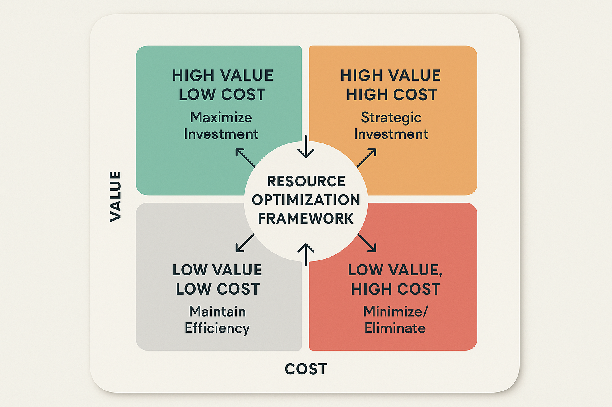

# Resource Allocation and Efficiency Optimization



*Figure 3: Resource Optimization Matrix - 4-quadrant value-cost framework for strategic resource allocation decisions with maximize investment, strategic investment, maintain efficiency, and minimize/eliminate strategies.*

## Introduction

Resource allocation and efficiency optimization represent the operational heart of cost-effective AI evaluation systems. While cost modeling provides the analytical foundation and ROI measurement demonstrates value creation, resource allocation determines how effectively organizations deploy their evaluation investments to achieve maximum impact. This section provides comprehensive frameworks for intelligent resource management that balance cost efficiency with quality outcomes, enabling sustainable scaling of AI evaluation capabilities.

The complexity of resource allocation in AI evaluation extends beyond traditional project management to encompass dynamic workloads, varying quality requirements, evolving technology capabilities, and uncertain demand patterns. Organizations that master resource allocation achieve 20-30% better resource utilization, 35-50% faster evaluation cycles, and 25-40% lower operational costs while maintaining or improving evaluation quality.

Modern resource allocation frameworks must account for both human and computational resources, balancing automation opportunities with human expertise requirements, and optimizing for both immediate efficiency and long-term capability development. The most successful organizations implement adaptive allocation systems that respond dynamically to changing conditions while maintaining strategic alignment and quality standards.

## Understanding Resource Allocation Complexity

### Multi-Dimensional Resource Landscape

**Human Resources**
Human resources in AI evaluation encompass diverse skill sets and expertise levels, from specialized AI researchers and domain experts to evaluation engineers and quality assurance professionals. Each resource type has different cost structures, availability constraints, productivity patterns, and value contribution profiles.

Effective human resource allocation requires understanding the unique characteristics of each role, including learning curves, collaboration patterns, peak performance periods, and skill development trajectories. Organizations must balance immediate productivity needs with long-term capability development and team sustainability.

The scarcity of specialized AI evaluation talent creates additional allocation challenges, requiring strategic decisions about internal development versus external acquisition, generalist versus specialist roles, and individual versus team-based work structures.

**Computational Resources**
Computational resources for AI evaluation include model inference capacity, data processing infrastructure, storage systems, and specialized hardware for different evaluation tasks. These resources exhibit complex cost structures with fixed infrastructure costs, variable usage charges, and performance optimization opportunities.

Resource allocation must account for workload variability, peak demand scenarios, geographic distribution requirements, and technology evolution cycles. Organizations need frameworks for balancing cost efficiency with performance requirements and reliability standards.

The rapid evolution of AI hardware and cloud computing services creates ongoing optimization opportunities but also requires continuous evaluation of resource allocation strategies and technology choices.

**Infrastructure and Tooling**
Infrastructure and tooling resources include evaluation platforms, monitoring systems, data management tools, and integration frameworks. These resources often have complex interdependencies and shared utilization patterns that complicate allocation decisions.

Effective allocation requires understanding tool capabilities, integration requirements, licensing models, and scalability characteristics. Organizations must balance standardization benefits with flexibility needs and optimize for both current requirements and future growth.

### Dynamic Allocation Challenges

**Workload Variability**
AI evaluation workloads exhibit significant variability based on product development cycles, model release schedules, quality incidents, and strategic initiatives. This variability creates challenges for resource planning and requires adaptive allocation strategies that can respond to changing demands.

Organizations must develop forecasting capabilities that predict workload patterns and resource requirements while maintaining flexibility for unexpected demands. This includes understanding seasonal patterns, project-driven spikes, and emergency response requirements.

**Quality vs. Efficiency Trade-offs**
Resource allocation decisions often involve trade-offs between evaluation quality and operational efficiency. Organizations must establish frameworks for making these trade-offs consistently and transparently while maintaining alignment with strategic objectives.

The trade-offs become more complex when considering different evaluation contexts, risk profiles, and business criticality levels. Organizations need sophisticated decision frameworks that account for these factors while maintaining operational simplicity.

## Intelligent Resource Allocation Frameworks

### Adaptive Allocation Systems

**Dynamic Resource Pooling**
Dynamic resource pooling enables flexible allocation of resources across multiple evaluation initiatives based on real-time demand and priority changes. This approach maximizes resource utilization while maintaining responsiveness to changing requirements.

```python
import pandas as pd
import numpy as np
from datetime import datetime, timedelta
from typing import Dict, List, Optional, Tuple
import heapq
from dataclasses import dataclass
from enum import Enum

class ResourceType(Enum):
    HUMAN_EXPERT = "human_expert"
    COMPUTE_CAPACITY = "compute_capacity"
    STORAGE = "storage"
    TOOLING_LICENSE = "tooling_license"
    INFRASTRUCTURE = "infrastructure"

class Priority(Enum):
    CRITICAL = 1
    HIGH = 2
    MEDIUM = 3
    LOW = 4

@dataclass
class Resource:
    """Represents a resource in the allocation system."""
    id: str
    type: ResourceType
    capacity: float
    cost_per_unit: float
    availability_schedule: Dict[str, float]  # time_slot -> available_capacity
    skills: List[str] = None
    location: str = None
    
@dataclass
class EvaluationTask:
    """Represents an evaluation task requiring resources."""
    id: str
    priority: Priority
    deadline: datetime
    estimated_duration: float
    resource_requirements: Dict[ResourceType, float]
    quality_requirements: Dict[str, float]
    dependencies: List[str] = None
    
@dataclass
class Allocation:
    """Represents a resource allocation decision."""
    task_id: str
    resource_id: str
    start_time: datetime
    duration: float
    allocated_capacity: float
    estimated_cost: float

class IntelligentResourceAllocator:
    """
    Advanced resource allocation system for AI evaluation programs.
    Implements dynamic pooling, priority-based scheduling, and efficiency optimization.
    """
    
    def __init__(self):
        self.resources: Dict[str, Resource] = {}
        self.tasks: Dict[str, EvaluationTask] = {}
        self.allocations: List[Allocation] = []
        self.allocation_history: List[Dict] = []
        self.efficiency_metrics: Dict[str, float] = {}
        
    def register_resource(self, resource: Resource):
        """Register a resource in the allocation system."""
        self.resources[resource.id] = resource
        
    def submit_task(self, task: EvaluationTask):
        """Submit a task for resource allocation."""
        self.tasks[task.id] = task
        
    def calculate_resource_utilization(self, time_window: Tuple[datetime, datetime]) -> Dict[str, float]:
        """
        Calculate resource utilization rates within a time window.
        
        Args:
            time_window: Start and end times for utilization calculation
            
        Returns:
            Dictionary of utilization rates by resource
        """
        start_time, end_time = time_window
        utilization = {}
        
        for resource_id, resource in self.resources.items():
            total_capacity = resource.capacity * (end_time - start_time).total_seconds() / 3600
            allocated_capacity = 0
            
            for allocation in self.allocations:
                if allocation.resource_id == resource_id:
                    alloc_start = max(allocation.start_time, start_time)
                    alloc_end = min(allocation.start_time + timedelta(hours=allocation.duration), end_time)
                    
                    if alloc_start < alloc_end:
                        overlap_hours = (alloc_end - alloc_start).total_seconds() / 3600
                        allocated_capacity += allocation.allocated_capacity * overlap_hours
            
            utilization[resource_id] = allocated_capacity / total_capacity if total_capacity > 0 else 0
            
        return utilization
        
    def find_optimal_allocation(self, task: EvaluationTask, current_time: datetime) -> List[Allocation]:
        """
        Find optimal resource allocation for a task.
        
        Args:
            task: Task requiring resource allocation
            current_time: Current time for scheduling
            
        Returns:
            List of optimal allocations for the task
        """
        allocations = []
        
        # Sort resource requirements by criticality and availability
        sorted_requirements = sorted(
            task.resource_requirements.items(),
            key=lambda x: (x[1], self._get_resource_availability_score(x[0], current_time)),
            reverse=True
        )
        
        for resource_type, required_capacity in sorted_requirements:
            # Find best available resource of this type
            best_resource = self._find_best_resource(
                resource_type, required_capacity, task.deadline, current_time
            )
            
            if best_resource:
                allocation = Allocation(
                    task_id=task.id,
                    resource_id=best_resource.id,
                    start_time=current_time,
                    duration=task.estimated_duration,
                    allocated_capacity=required_capacity,
                    estimated_cost=required_capacity * best_resource.cost_per_unit * task.estimated_duration
                )
                allocations.append(allocation)
        
        return allocations
        
    def _find_best_resource(self, resource_type: ResourceType, required_capacity: float, 
                           deadline: datetime, start_time: datetime) -> Optional[Resource]:
        """Find the best available resource for a requirement."""
        candidates = [r for r in self.resources.values() if r.type == resource_type]
        
        if not candidates:
            return None
            
        # Score candidates based on availability, cost, and suitability
        scored_candidates = []
        
        for resource in candidates:
            availability_score = self._calculate_availability_score(resource, start_time, deadline)
            cost_score = 1.0 / resource.cost_per_unit if resource.cost_per_unit > 0 else 0
            capacity_score = min(resource.capacity / required_capacity, 1.0) if required_capacity > 0 else 1.0
            
            total_score = availability_score * 0.4 + cost_score * 0.3 + capacity_score * 0.3
            scored_candidates.append((total_score, resource))
        
        # Return best candidate
        scored_candidates.sort(key=lambda x: x[0], reverse=True)
        return scored_candidates[0][1] if scored_candidates else None
        
    def _calculate_availability_score(self, resource: Resource, start_time: datetime, 
                                    deadline: datetime) -> float:
        """Calculate availability score for a resource."""
        # Simplified availability calculation
        time_slots = self._get_time_slots(start_time, deadline)
        available_slots = 0
        
        for slot in time_slots:
            if slot in resource.availability_schedule:
                if resource.availability_schedule[slot] > 0.5:  # 50% availability threshold
                    available_slots += 1
        
        return available_slots / len(time_slots) if time_slots else 0
        
    def _get_time_slots(self, start_time: datetime, end_time: datetime) -> List[str]:
        """Generate time slots between start and end times."""
        slots = []
        current = start_time
        
        while current < end_time:
            slots.append(current.strftime("%Y-%m-%d_%H"))
            current += timedelta(hours=1)
            
        return slots
        
    def _get_resource_availability_score(self, resource_type: ResourceType, current_time: datetime) -> float:
        """Get overall availability score for a resource type."""
        type_resources = [r for r in self.resources.values() if r.type == resource_type]
        
        if not type_resources:
            return 0
            
        total_score = sum(
            self._calculate_availability_score(r, current_time, current_time + timedelta(hours=24))
            for r in type_resources
        )
        
        return total_score / len(type_resources)
        
    def optimize_allocation_schedule(self, optimization_window: Tuple[datetime, datetime]) -> Dict:
        """
        Optimize resource allocation schedule within a time window.
        
        Args:
            optimization_window: Time window for optimization
            
        Returns:
            Optimization results and recommendations
        """
        start_time, end_time = optimization_window
        
        # Get tasks within the optimization window
        relevant_tasks = [
            task for task in self.tasks.values()
            if start_time <= task.deadline <= end_time
        ]
        
        # Sort tasks by priority and deadline
        sorted_tasks = sorted(
            relevant_tasks,
            key=lambda t: (t.priority.value, t.deadline)
        )
        
        # Generate optimal allocations
        optimized_allocations = []
        current_time = start_time
        
        for task in sorted_tasks:
            task_allocations = self.find_optimal_allocation(task, current_time)
            optimized_allocations.extend(task_allocations)
            
            # Update current time based on task completion
            if task_allocations:
                max_end_time = max(
                    alloc.start_time + timedelta(hours=alloc.duration)
                    for alloc in task_allocations
                )
                current_time = max(current_time, max_end_time)
        
        # Calculate optimization metrics
        total_cost = sum(alloc.estimated_cost for alloc in optimized_allocations)
        utilization = self.calculate_resource_utilization(optimization_window)
        avg_utilization = np.mean(list(utilization.values())) if utilization else 0
        
        return {
            'optimized_allocations': optimized_allocations,
            'total_cost': total_cost,
            'resource_utilization': utilization,
            'average_utilization': avg_utilization,
            'tasks_scheduled': len(set(alloc.task_id for alloc in optimized_allocations)),
            'optimization_window': optimization_window
        }
        
    def analyze_allocation_efficiency(self) -> Dict:
        """
        Analyze the efficiency of current resource allocations.
        
        Returns:
            Efficiency analysis results
        """
        if not self.allocations:
            return {'error': 'No allocations to analyze'}
            
        # Calculate efficiency metrics
        total_cost = sum(alloc.estimated_cost for alloc in self.allocations)
        total_duration = sum(alloc.duration for alloc in self.allocations)
        
        # Resource utilization analysis
        current_time = datetime.now()
        week_window = (current_time - timedelta(days=7), current_time)
        utilization = self.calculate_resource_utilization(week_window)
        
        # Cost efficiency analysis
        cost_per_hour = total_cost / total_duration if total_duration > 0 else 0
        
        # Task completion analysis
        completed_tasks = len(set(alloc.task_id for alloc in self.allocations))
        
        # Identify bottlenecks
        resource_demand = {}
        for alloc in self.allocations:
            resource_type = self.resources[alloc.resource_id].type
            if resource_type not in resource_demand:
                resource_demand[resource_type] = 0
            resource_demand[resource_type] += alloc.allocated_capacity
        
        bottlenecks = [
            resource_type for resource_type, demand in resource_demand.items()
            if demand > sum(r.capacity for r in self.resources.values() if r.type == resource_type) * 0.8
        ]
        
        return {
            'total_cost': total_cost,
            'cost_per_hour': cost_per_hour,
            'average_utilization': np.mean(list(utilization.values())) if utilization else 0,
            'completed_tasks': completed_tasks,
            'resource_bottlenecks': bottlenecks,
            'utilization_by_resource': utilization,
            'efficiency_score': self._calculate_efficiency_score(utilization, cost_per_hour)
        }
        
    def _calculate_efficiency_score(self, utilization: Dict[str, float], cost_per_hour: float) -> float:
        """Calculate overall efficiency score."""
        if not utilization:
            return 0
            
        avg_utilization = np.mean(list(utilization.values()))
        
        # Normalize cost per hour (assuming $100/hour as baseline)
        normalized_cost = min(100 / cost_per_hour, 1.0) if cost_per_hour > 0 else 0
        
        # Combine utilization and cost efficiency
        efficiency_score = (avg_utilization * 0.6 + normalized_cost * 0.4) * 100
        
        return efficiency_score
        
    def generate_optimization_recommendations(self, analysis_results: Dict) -> List[Dict]:
        """
        Generate actionable optimization recommendations.
        
        Args:
            analysis_results: Results from efficiency analysis
            
        Returns:
            List of optimization recommendations
        """
        recommendations = []
        
        # Utilization recommendations
        avg_utilization = analysis_results.get('average_utilization', 0)
        if avg_utilization < 0.6:
            recommendations.append({
                'type': 'utilization_improvement',
                'priority': 'high',
                'title': 'Improve Resource Utilization',
                'description': f'Average utilization is {avg_utilization:.1%}. Consider consolidating workloads or reducing resource capacity.',
                'potential_savings': f'${analysis_results.get("total_cost", 0) * 0.2:,.2f}'
            })
        elif avg_utilization > 0.9:
            recommendations.append({
                'type': 'capacity_expansion',
                'priority': 'medium',
                'title': 'Consider Capacity Expansion',
                'description': f'High utilization ({avg_utilization:.1%}) may impact quality. Consider adding resources.',
                'estimated_cost': f'${analysis_results.get("total_cost", 0) * 0.15:,.2f}'
            })
        
        # Bottleneck recommendations
        bottlenecks = analysis_results.get('resource_bottlenecks', [])
        for bottleneck in bottlenecks:
            recommendations.append({
                'type': 'bottleneck_resolution',
                'priority': 'high',
                'title': f'Address {bottleneck.value} Bottleneck',
                'description': f'{bottleneck.value} resources are over-utilized. Consider adding capacity or optimizing workflows.',
                'impact': 'High - affects overall system throughput'
            })
        
        # Cost optimization recommendations
        cost_per_hour = analysis_results.get('cost_per_hour', 0)
        if cost_per_hour > 150:  # Threshold for high cost
            recommendations.append({
                'type': 'cost_optimization',
                'priority': 'medium',
                'title': 'Optimize Cost Structure',
                'description': f'Cost per hour (${cost_per_hour:.2f}) is above target. Review resource mix and automation opportunities.',
                'potential_savings': f'${analysis_results.get("total_cost", 0) * 0.15:,.2f}'
            })
        
        return recommendations

# Example usage and demonstration
def demonstrate_resource_allocation():
    """Demonstrate intelligent resource allocation capabilities."""
    
    allocator = IntelligentResourceAllocator()
    
    # Register resources
    resources = [
        Resource(
            id="senior_engineer_1",
            type=ResourceType.HUMAN_EXPERT,
            capacity=40.0,  # hours per week
            cost_per_unit=120.0,  # per hour
            availability_schedule={f"2024-01-{day:02d}_09": 0.8 for day in range(1, 32)},
            skills=["llm_evaluation", "python", "statistics"]
        ),
        Resource(
            id="compute_cluster_1",
            type=ResourceType.COMPUTE_CAPACITY,
            capacity=1000.0,  # compute units
            cost_per_unit=2.5,  # per unit per hour
            availability_schedule={f"2024-01-{day:02d}_{hour:02d}": 0.9 for day in range(1, 32) for hour in range(24)}
        ),
        Resource(
            id="evaluation_platform",
            type=ResourceType.TOOLING_LICENSE,
            capacity=100.0,  # concurrent users
            cost_per_unit=50.0,  # per user per month
            availability_schedule={f"2024-01-{day:02d}_{hour:02d}": 1.0 for day in range(1, 32) for hour in range(24)}
        )
    ]
    
    for resource in resources:
        allocator.register_resource(resource)
    
    # Submit tasks
    tasks = [
        EvaluationTask(
            id="llm_quality_assessment",
            priority=Priority.HIGH,
            deadline=datetime(2024, 1, 15),
            estimated_duration=20.0,  # hours
            resource_requirements={
                ResourceType.HUMAN_EXPERT: 1.0,
                ResourceType.COMPUTE_CAPACITY: 100.0,
                ResourceType.TOOLING_LICENSE: 5.0
            },
            quality_requirements={"accuracy": 0.95, "completeness": 0.9}
        ),
        EvaluationTask(
            id="automated_testing_suite",
            priority=Priority.MEDIUM,
            deadline=datetime(2024, 1, 20),
            estimated_duration=40.0,
            resource_requirements={
                ResourceType.COMPUTE_CAPACITY: 500.0,
                ResourceType.TOOLING_LICENSE: 10.0
            },
            quality_requirements={"coverage": 0.85, "reliability": 0.95}
        )
    ]
    
    for task in tasks:
        allocator.submit_task(task)
    
    # Optimize allocation schedule
    optimization_window = (datetime(2024, 1, 1), datetime(2024, 1, 31))
    optimization_results = allocator.optimize_allocation_schedule(optimization_window)
    
    # Analyze efficiency
    efficiency_analysis = allocator.analyze_allocation_efficiency()
    
    # Generate recommendations
    recommendations = allocator.generate_optimization_recommendations(efficiency_analysis)
    
    return allocator, optimization_results, efficiency_analysis, recommendations

if __name__ == "__main__":
    allocator, opt_results, efficiency, recs = demonstrate_resource_allocation()
    print(f"Resource allocation optimization completed with {len(recs)} recommendations.")
```

**Priority-Based Scheduling**
Priority-based scheduling ensures that critical evaluation tasks receive appropriate resource allocation while maintaining overall system efficiency. This approach requires sophisticated frameworks for priority assessment that consider business impact, deadlines, dependencies, and resource constraints.

Effective priority-based scheduling balances immediate needs with long-term strategic objectives, ensuring that urgent tasks don't consistently crowd out important but less time-sensitive activities. Organizations should develop clear priority frameworks that align with business objectives and provide consistent decision-making guidance.

**Load Balancing and Optimization**
Load balancing distributes evaluation workloads across available resources to maximize utilization and minimize bottlenecks. This requires real-time monitoring of resource capacity, workload characteristics, and performance metrics to enable dynamic optimization.

Advanced load balancing systems incorporate predictive analytics to anticipate resource needs and proactively adjust allocations before bottlenecks occur. This proactive approach reduces delays and improves overall system efficiency.

## Efficiency Optimization Strategies

### Automation and Human-AI Collaboration

**Intelligent Task Routing**
Intelligent task routing automatically directs evaluation tasks to the most appropriate resources based on task characteristics, resource capabilities, and current workload. This reduces manual coordination overhead and improves resource utilization.

Task routing systems should consider multiple factors including resource expertise, availability, cost, and quality requirements. The systems should learn from historical performance data to improve routing decisions over time.

**Hybrid Evaluation Workflows**
Hybrid workflows combine automated and human evaluation capabilities to optimize both efficiency and quality. These workflows require careful design to ensure seamless handoffs between automated and human components while maintaining evaluation integrity.

Effective hybrid workflows leverage automation for routine, well-defined tasks while preserving human expertise for complex, nuanced evaluation activities. The goal is to amplify human capabilities rather than simply replace human effort.

### Performance Monitoring and Optimization

**Real-Time Efficiency Metrics**
Real-time monitoring of efficiency metrics enables proactive optimization and rapid response to performance issues. Key metrics include resource utilization rates, task completion times, quality scores, and cost per evaluation.

Monitoring systems should provide both operational dashboards for immediate decision-making and analytical reports for strategic optimization. The systems should include alerting capabilities for significant performance deviations.

**Continuous Improvement Frameworks**
Continuous improvement frameworks systematically identify and implement efficiency optimizations based on performance data and operational experience. These frameworks should include regular review cycles, improvement target setting, and progress tracking.

```python
class EfficiencyOptimizationEngine:
    """
    Comprehensive efficiency optimization engine for AI evaluation systems.
    Implements continuous improvement frameworks and performance monitoring.
    """
    
    def __init__(self):
        self.performance_history = []
        self.optimization_targets = {}
        self.improvement_initiatives = {}
        self.efficiency_metrics = {}
        
    def track_performance(self, performance_data: Dict):
        """
        Track performance metrics for efficiency analysis.
        
        Args:
            performance_data: Dictionary of performance measurements
        """
        performance_record = {
            'timestamp': datetime.now(),
            'metrics': performance_data.copy()
        }
        self.performance_history.append(performance_record)
        
        # Update current efficiency metrics
        self.efficiency_metrics.update(performance_data)
        
    def set_optimization_targets(self, targets: Dict[str, float]):
        """
        Set optimization targets for efficiency metrics.
        
        Args:
            targets: Dictionary of target values by metric
        """
        self.optimization_targets = targets
        
    def analyze_efficiency_trends(self, time_window_days: int = 30) -> Dict:
        """
        Analyze efficiency trends over a specified time window.
        
        Args:
            time_window_days: Number of days to analyze
            
        Returns:
            Trend analysis results
        """
        cutoff_date = datetime.now() - timedelta(days=time_window_days)
        recent_data = [
            record for record in self.performance_history
            if record['timestamp'] >= cutoff_date
        ]
        
        if len(recent_data) < 2:
            return {'error': 'Insufficient data for trend analysis'}
        
        # Calculate trends for each metric
        trends = {}
        
        for metric in self.optimization_targets.keys():
            values = [record['metrics'].get(metric, 0) for record in recent_data]
            timestamps = [record['timestamp'] for record in recent_data]
            
            if len(values) >= 2:
                # Simple linear trend calculation
                x = np.arange(len(values))
                slope, intercept = np.polyfit(x, values, 1)
                
                trends[metric] = {
                    'current_value': values[-1],
                    'trend_slope': slope,
                    'trend_direction': 'improving' if slope > 0 else 'declining',
                    'target_value': self.optimization_targets.get(metric, 0),
                    'target_gap': self.optimization_targets.get(metric, 0) - values[-1]
                }
        
        return {
            'trends': trends,
            'analysis_period': time_window_days,
            'data_points': len(recent_data)
        }
        
    def identify_optimization_opportunities(self, trend_analysis: Dict) -> List[Dict]:
        """
        Identify optimization opportunities based on trend analysis.
        
        Args:
            trend_analysis: Results from trend analysis
            
        Returns:
            List of optimization opportunities
        """
        opportunities = []
        
        if 'trends' not in trend_analysis:
            return opportunities
        
        for metric, trend_data in trend_analysis['trends'].items():
            current_value = trend_data['current_value']
            target_value = trend_data['target_value']
            target_gap = trend_data['target_gap']
            trend_direction = trend_data['trend_direction']
            
            # Identify opportunities based on performance gaps
            if abs(target_gap) > target_value * 0.1:  # 10% threshold
                opportunity_type = 'improvement' if target_gap > 0 else 'maintenance'
                priority = 'high' if abs(target_gap) > target_value * 0.2 else 'medium'
                
                opportunities.append({
                    'metric': metric,
                    'type': opportunity_type,
                    'priority': priority,
                    'current_value': current_value,
                    'target_value': target_value,
                    'gap': target_gap,
                    'trend': trend_direction,
                    'potential_impact': abs(target_gap) / target_value if target_value > 0 else 0
                })
        
        # Sort by potential impact
        opportunities.sort(key=lambda x: x['potential_impact'], reverse=True)
        
        return opportunities
        
    def generate_improvement_plan(self, opportunities: List[Dict]) -> Dict:
        """
        Generate improvement plan based on identified opportunities.
        
        Args:
            opportunities: List of optimization opportunities
            
        Returns:
            Comprehensive improvement plan
        """
        plan = {
            'initiatives': [],
            'timeline': {},
            'resource_requirements': {},
            'expected_outcomes': {}
        }
        
        for i, opportunity in enumerate(opportunities[:5]):  # Top 5 opportunities
            initiative_id = f"initiative_{i+1}"
            
            initiative = {
                'id': initiative_id,
                'title': f"Optimize {opportunity['metric']}",
                'description': f"Address {opportunity['gap']:.2f} gap in {opportunity['metric']}",
                'priority': opportunity['priority'],
                'target_metric': opportunity['metric'],
                'current_value': opportunity['current_value'],
                'target_value': opportunity['target_value'],
                'expected_improvement': opportunity['gap'],
                'estimated_effort': self._estimate_effort(opportunity),
                'estimated_duration': self._estimate_duration(opportunity)
            }
            
            plan['initiatives'].append(initiative)
            
            # Add to timeline
            start_week = i * 2 + 1  # Stagger initiatives
            plan['timeline'][initiative_id] = {
                'start_week': start_week,
                'duration_weeks': initiative['estimated_duration'],
                'end_week': start_week + initiative['estimated_duration']
            }
            
            # Add resource requirements
            plan['resource_requirements'][initiative_id] = {
                'engineering_hours': initiative['estimated_effort'],
                'budget': initiative['estimated_effort'] * 100,  # $100/hour
                'stakeholder_time': initiative['estimated_effort'] * 0.2
            }
            
            # Add expected outcomes
            plan['expected_outcomes'][initiative_id] = {
                'metric_improvement': opportunity['gap'],
                'efficiency_gain': opportunity['potential_impact'],
                'cost_impact': self._estimate_cost_impact(opportunity)
            }
        
        return plan
        
    def _estimate_effort(self, opportunity: Dict) -> float:
        """Estimate effort required for an optimization opportunity."""
        base_effort = 40  # Base hours
        complexity_multiplier = {
            'high': 2.0,
            'medium': 1.5,
            'low': 1.0
        }.get(opportunity['priority'], 1.0)
        
        impact_multiplier = min(opportunity['potential_impact'] * 2, 3.0)
        
        return base_effort * complexity_multiplier * impact_multiplier
        
    def _estimate_duration(self, opportunity: Dict) -> int:
        """Estimate duration in weeks for an optimization opportunity."""
        effort = self._estimate_effort(opportunity)
        return max(int(effort / 20), 2)  # Assuming 20 hours per week, minimum 2 weeks
        
    def _estimate_cost_impact(self, opportunity: Dict) -> float:
        """Estimate cost impact of an optimization opportunity."""
        # Simplified cost impact calculation
        return opportunity['potential_impact'] * 10000  # $10k per 1% improvement
        
    def track_initiative_progress(self, initiative_id: str, progress_data: Dict):
        """
        Track progress of improvement initiatives.
        
        Args:
            initiative_id: Identifier for the initiative
            progress_data: Progress measurement data
        """
        if initiative_id not in self.improvement_initiatives:
            self.improvement_initiatives[initiative_id] = {
                'progress_history': [],
                'status': 'active'
            }
        
        progress_record = {
            'timestamp': datetime.now(),
            'data': progress_data.copy()
        }
        
        self.improvement_initiatives[initiative_id]['progress_history'].append(progress_record)
        
    def generate_efficiency_dashboard(self) -> Dict:
        """
        Generate comprehensive efficiency dashboard data.
        
        Returns:
            Dashboard data for visualization
        """
        if not self.performance_history:
            return {'error': 'No performance data available'}
        
        # Recent performance summary
        recent_metrics = self.efficiency_metrics
        
        # Trend analysis
        trend_analysis = self.analyze_efficiency_trends()
        
        # Target achievement
        target_achievement = {}
        for metric, target in self.optimization_targets.items():
            current = recent_metrics.get(metric, 0)
            achievement = (current / target * 100) if target > 0 else 0
            target_achievement[metric] = {
                'current': current,
                'target': target,
                'achievement_percentage': achievement,
                'status': 'on_track' if achievement >= 90 else 'needs_attention'
            }
        
        # Initiative status
        initiative_status = {}
        for init_id, init_data in self.improvement_initiatives.items():
            if init_data['progress_history']:
                latest_progress = init_data['progress_history'][-1]['data']
                initiative_status[init_id] = {
                    'status': init_data['status'],
                    'completion_percentage': latest_progress.get('completion', 0),
                    'last_updated': init_data['progress_history'][-1]['timestamp']
                }
        
        return {
            'current_metrics': recent_metrics,
            'trend_analysis': trend_analysis,
            'target_achievement': target_achievement,
            'initiative_status': initiative_status,
            'overall_efficiency_score': self._calculate_overall_efficiency_score(target_achievement)
        }
        
    def _calculate_overall_efficiency_score(self, target_achievement: Dict) -> float:
        """Calculate overall efficiency score based on target achievement."""
        if not target_achievement:
            return 0
        
        achievement_scores = [
            data['achievement_percentage'] for data in target_achievement.values()
        ]
        
        return np.mean(achievement_scores) if achievement_scores else 0

# Example efficiency optimization implementation
def demonstrate_efficiency_optimization():
    """Demonstrate efficiency optimization capabilities."""
    
    optimizer = EfficiencyOptimizationEngine()
    
    # Set optimization targets
    targets = {
        'resource_utilization': 0.85,
        'cost_per_evaluation': 25.0,
        'evaluation_throughput': 100.0,
        'quality_score': 0.92,
        'cycle_time_hours': 4.0
    }
    
    optimizer.set_optimization_targets(targets)
    
    # Simulate performance tracking over time
    for day in range(30):
        performance_data = {
            'resource_utilization': 0.75 + np.random.normal(0, 0.05),
            'cost_per_evaluation': 30.0 + np.random.normal(0, 3.0),
            'evaluation_throughput': 85.0 + np.random.normal(0, 10.0),
            'quality_score': 0.88 + np.random.normal(0, 0.02),
            'cycle_time_hours': 5.5 + np.random.normal(0, 0.5)
        }
        
        # Simulate gradual improvement
        improvement_factor = day / 30 * 0.1
        performance_data['resource_utilization'] += improvement_factor
        performance_data['cost_per_evaluation'] -= improvement_factor * 2
        
        optimizer.track_performance(performance_data)
    
    # Analyze trends and identify opportunities
    trend_analysis = optimizer.analyze_efficiency_trends()
    opportunities = optimizer.identify_optimization_opportunities(trend_analysis)
    improvement_plan = optimizer.generate_improvement_plan(opportunities)
    
    # Generate dashboard
    dashboard = optimizer.generate_efficiency_dashboard()
    
    return optimizer, trend_analysis, opportunities, improvement_plan, dashboard

if __name__ == "__main__":
    opt_engine, trends, opps, plan, dash = demonstrate_efficiency_optimization()
    print(f"Efficiency optimization analysis completed with {len(opps)} opportunities identified.")
```

## Advanced Resource Optimization Techniques

### Predictive Resource Planning

**Demand Forecasting**
Predictive demand forecasting enables proactive resource planning by anticipating future evaluation requirements based on historical patterns, product development cycles, and strategic initiatives. This reduces reactive resource allocation and improves overall efficiency.

Forecasting models should incorporate multiple data sources including historical workload data, product roadmaps, market conditions, and seasonal patterns. The models should provide both point estimates and confidence intervals to support risk-aware planning.

**Capacity Planning Optimization**
Capacity planning optimization balances resource availability with demand forecasts to minimize both underutilization and capacity constraints. This requires sophisticated modeling of resource acquisition lead times, scaling costs, and demand uncertainty.

Effective capacity planning considers both short-term operational needs and long-term strategic requirements, ensuring that resource investments support sustainable growth while maintaining cost efficiency.

### Technology-Enabled Optimization

**AI-Powered Resource Matching**
AI-powered resource matching systems automatically identify optimal resource assignments based on task requirements, resource capabilities, historical performance, and current availability. These systems learn from past allocation decisions to improve matching accuracy over time.

Machine learning models can identify subtle patterns in resource performance and task characteristics that human schedulers might miss, leading to more effective allocations and better outcomes.

**Automated Workflow Optimization**
Automated workflow optimization continuously analyzes evaluation processes to identify inefficiencies and optimization opportunities. This includes bottleneck detection, parallel processing opportunities, and automation potential assessment.

Workflow optimization systems should provide both immediate tactical improvements and strategic recommendations for process redesign and technology investment.

## Resource Allocation Governance

### Decision-Making Frameworks

**Resource Allocation Committees**
Resource allocation committees provide governance oversight for significant allocation decisions, ensuring alignment with strategic objectives and fair resource distribution across competing priorities. These committees should include representatives from key stakeholder groups and decision-making authority.

Committee structures should balance thorough review with decision-making speed, using clear criteria and escalation procedures to maintain efficiency while ensuring appropriate oversight.

**Allocation Policy Development**
Clear allocation policies provide consistent guidance for resource allocation decisions and reduce conflicts between competing priorities. Policies should address priority frameworks, escalation procedures, emergency allocation protocols, and performance accountability.

Policy development should involve key stakeholders and be regularly updated based on operational experience and changing business conditions.

### Performance Accountability

**Resource Utilization Tracking**
Comprehensive utilization tracking provides visibility into resource deployment effectiveness and identifies optimization opportunities. Tracking should cover both quantitative metrics (utilization rates, cost efficiency) and qualitative assessments (satisfaction, capability development).

Utilization tracking systems should provide both real-time operational visibility and historical analysis for strategic planning and performance improvement.

**Outcome-Based Resource Assessment**
Outcome-based assessment evaluates resource allocation effectiveness based on business results rather than just operational metrics. This includes quality improvements, cost reductions, competitive advantages, and strategic capability development.

Assessment frameworks should connect resource allocation decisions to business outcomes through clear causal relationships and measurable impact metrics.

## Conclusion

Resource allocation and efficiency optimization represent critical operational capabilities for sustainable AI evaluation programs. Organizations that master these disciplines achieve superior resource utilization, lower operational costs, and better evaluation outcomes while maintaining strategic alignment and quality standards. The frameworks and techniques presented in this section provide the foundation for building sophisticated resource management capabilities that scale with organizational growth and technology evolution.

The key to success lies in implementing adaptive allocation systems that balance efficiency with effectiveness while maintaining flexibility for changing requirements and strategic priorities. Organizations should start with basic resource tracking and gradually implement more sophisticated optimization techniques as their evaluation programs mature.

Effective resource allocation enables organizations to maximize the value of their evaluation investments while maintaining operational excellence and strategic focus. This creates a virtuous cycle where better resource allocation leads to better evaluation outcomes, which generate more value to support continued resource optimization and capability development.

The next section will explore vendor and tool cost management strategies that build upon these resource allocation foundations to optimize external spending and maximize value from evaluation technology investments.

