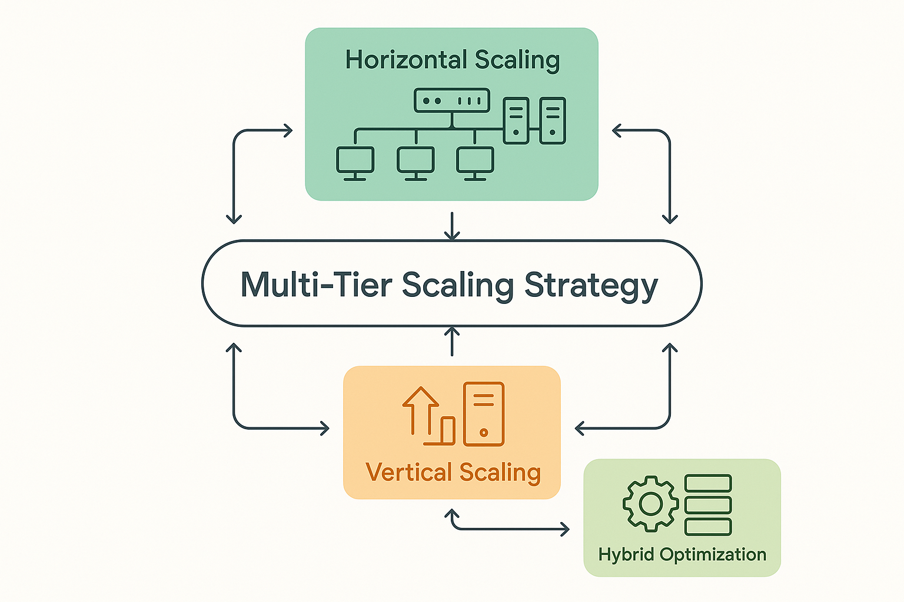

# Scaling Strategies for Cost-Effective Evaluation



*Figure 5: Scaling Architecture Framework - Multi-tier scaling strategy with horizontal scaling, vertical scaling, and hybrid optimization for cost-effective evaluation growth.*

## Introduction

Scaling AI evaluation capabilities while maintaining cost-effectiveness represents one of the most challenging aspects of evaluation program management. As organizations grow their AI initiatives from experimental projects to enterprise-scale deployments, evaluation systems must scale to handle increased volume, complexity, and quality requirements without proportional cost increases. This section provides comprehensive frameworks for building scalable evaluation architectures that achieve economies of scale while maintaining quality standards and operational efficiency.

The challenge of cost-effective scaling extends beyond simple capacity expansion to encompass architectural optimization, process automation, resource pooling, and strategic capability development. Organizations that master scalable evaluation achieve 40-60% better unit economics at scale and maintain 25-35% lower operational costs per evaluation compared to those using linear scaling approaches.

Modern scaling strategies must account for both horizontal scaling (handling more evaluation volume) and vertical scaling (handling more complex evaluation requirements) while maintaining cost discipline and quality standards. The most successful organizations implement adaptive scaling frameworks that optimize resource utilization, leverage automation opportunities, and build reusable capabilities that support sustainable growth.

## Understanding Scaling Economics in AI Evaluation

### Cost Behavior Analysis

**Fixed vs. Variable Cost Dynamics**
Understanding the fixed and variable components of evaluation costs is critical for developing effective scaling strategies. Fixed costs include infrastructure platforms, core team salaries, and base tooling licenses that remain constant regardless of evaluation volume. Variable costs scale with evaluation activity and include computational resources, human review time, and usage-based service fees.

The ratio of fixed to variable costs significantly impacts scaling economics. Organizations with higher fixed cost ratios achieve better unit economics at scale but face greater financial risk during low-utilization periods. Conversely, variable-heavy cost structures provide more flexibility but may limit profitability at high volumes.

Effective scaling strategies optimize this ratio by investing in fixed infrastructure and capabilities that reduce variable costs per evaluation while maintaining flexibility for demand fluctuations.

**Economies of Scale Opportunities**
AI evaluation systems offer multiple opportunities for economies of scale including shared infrastructure utilization, bulk purchasing power, specialized team development, and process standardization. These opportunities enable organizations to achieve decreasing unit costs as evaluation volume increases.

Key economies of scale include:
- **Infrastructure Sharing**: Amortizing platform and infrastructure costs across multiple evaluation initiatives
- **Expertise Leverage**: Developing specialized evaluation expertise that can be applied across multiple projects
- **Process Standardization**: Creating reusable evaluation frameworks and methodologies
- **Vendor Negotiation**: Achieving volume discounts through consolidated purchasing
- **Automation Investment**: Justifying automation investments through higher utilization

**Diseconomies of Scale Risks**
While scaling offers significant cost advantages, organizations must also manage diseconomies of scale that can increase unit costs at higher volumes. Common diseconomies include coordination overhead, quality degradation, complexity management, and resource contention.

Diseconomies of scale risks include:
- **Coordination Complexity**: Increased management overhead as evaluation teams grow
- **Quality Dilution**: Difficulty maintaining quality standards across larger operations
- **Resource Contention**: Competition for specialized resources creating bottlenecks
- **Process Rigidity**: Standardization reducing flexibility and innovation
- **Technology Debt**: Legacy systems and processes limiting efficiency improvements

### Scaling Architecture Patterns

**Horizontal Scaling Strategies**
Horizontal scaling increases evaluation capacity by adding more resources of the same type, such as additional evaluation servers, human reviewers, or parallel processing capabilities. This approach provides linear capacity increases but requires careful architecture design to avoid bottlenecks and maintain efficiency.

```python
import asyncio
import concurrent.futures
from typing import Dict, List, Optional, Callable, Any
from dataclasses import dataclass
from enum import Enum
import time
import numpy as np
from datetime import datetime, timedelta

class ScalingStrategy(Enum):
    HORIZONTAL = "horizontal"
    VERTICAL = "vertical"
    HYBRID = "hybrid"

class ResourceType(Enum):
    COMPUTE = "compute"
    HUMAN_REVIEWER = "human_reviewer"
    STORAGE = "storage"
    NETWORK = "network"

@dataclass
class ScalingMetrics:
    """Metrics for tracking scaling performance."""
    throughput: float
    latency: float
    cost_per_unit: float
    resource_utilization: float
    quality_score: float
    error_rate: float

@dataclass
class ScalingConfiguration:
    """Configuration for scaling operations."""
    min_resources: int
    max_resources: int
    target_utilization: float
    scale_up_threshold: float
    scale_down_threshold: float
    cooldown_period: int  # seconds

class CostEffectiveScalingEngine:
    """
    Advanced scaling engine for AI evaluation systems.
    Implements multiple scaling strategies with cost optimization.
    """
    
    def __init__(self):
        self.resources = {}
        self.scaling_configs = {}
        self.performance_history = []
        self.cost_models = {}
        self.scaling_decisions = []
        
    def register_resource_pool(self, resource_type: ResourceType, 
                             initial_capacity: int, cost_per_unit: float):
        """Register a resource pool for scaling management."""
        self.resources[resource_type] = {
            'current_capacity': initial_capacity,
            'active_capacity': initial_capacity,
            'cost_per_unit': cost_per_unit,
            'utilization_history': [],
            'performance_metrics': []
        }
        
    def set_scaling_configuration(self, resource_type: ResourceType, 
                                config: ScalingConfiguration):
        """Set scaling configuration for a resource type."""
        self.scaling_configs[resource_type] = config
        
    def monitor_resource_utilization(self, resource_type: ResourceType, 
                                   utilization: float, performance_metrics: ScalingMetrics):
        """Monitor resource utilization and performance."""
        if resource_type not in self.resources:
            return False
            
        resource = self.resources[resource_type]
        
        # Record utilization
        utilization_record = {
            'timestamp': datetime.now(),
            'utilization': utilization,
            'capacity': resource['current_capacity']
        }
        resource['utilization_history'].append(utilization_record)
        
        # Record performance metrics
        performance_record = {
            'timestamp': datetime.now(),
            'metrics': performance_metrics
        }
        resource['performance_metrics'].append(performance_record)
        
        # Trigger scaling decision if needed
        self._evaluate_scaling_decision(resource_type, utilization, performance_metrics)
        
        return True
        
    def _evaluate_scaling_decision(self, resource_type: ResourceType, 
                                 current_utilization: float, 
                                 performance_metrics: ScalingMetrics):
        """Evaluate whether scaling action is needed."""
        if resource_type not in self.scaling_configs:
            return
            
        config = self.scaling_configs[resource_type]
        resource = self.resources[resource_type]
        
        # Check if we're in cooldown period
        if self._in_cooldown_period(resource_type, config.cooldown_period):
            return
            
        scaling_decision = None
        
        # Scale up conditions
        if (current_utilization > config.scale_up_threshold and 
            resource['current_capacity'] < config.max_resources):
            
            # Calculate optimal scale-up amount
            scale_up_amount = self._calculate_scale_up_amount(
                resource_type, current_utilization, performance_metrics
            )
            
            scaling_decision = {
                'action': 'scale_up',
                'amount': scale_up_amount,
                'reason': f'Utilization {current_utilization:.2%} > threshold {config.scale_up_threshold:.2%}'
            }
            
        # Scale down conditions
        elif (current_utilization < config.scale_down_threshold and 
              resource['current_capacity'] > config.min_resources):
            
            # Calculate optimal scale-down amount
            scale_down_amount = self._calculate_scale_down_amount(
                resource_type, current_utilization, performance_metrics
            )
            
            scaling_decision = {
                'action': 'scale_down',
                'amount': scale_down_amount,
                'reason': f'Utilization {current_utilization:.2%} < threshold {config.scale_down_threshold:.2%}'
            }
        
        if scaling_decision:
            self._execute_scaling_decision(resource_type, scaling_decision)
            
    def _calculate_scale_up_amount(self, resource_type: ResourceType, 
                                 utilization: float, metrics: ScalingMetrics) -> int:
        """Calculate optimal scale-up amount based on current conditions."""
        resource = self.resources[resource_type]
        config = self.scaling_configs[resource_type]
        
        # Base calculation: scale to achieve target utilization
        current_capacity = resource['current_capacity']
        target_capacity = int(current_capacity * utilization / config.target_utilization)
        base_scale_amount = max(1, target_capacity - current_capacity)
        
        # Adjust based on performance metrics
        if metrics.latency > 5.0:  # High latency threshold
            base_scale_amount = int(base_scale_amount * 1.5)
        elif metrics.error_rate > 0.05:  # High error rate threshold
            base_scale_amount = int(base_scale_amount * 1.3)
        
        # Ensure we don't exceed maximum capacity
        max_scale_amount = config.max_resources - current_capacity
        return min(base_scale_amount, max_scale_amount)
        
    def _calculate_scale_down_amount(self, resource_type: ResourceType, 
                                   utilization: float, metrics: ScalingMetrics) -> int:
        """Calculate optimal scale-down amount based on current conditions."""
        resource = self.resources[resource_type]
        config = self.scaling_configs[resource_type]
        
        # Base calculation: scale to achieve target utilization
        current_capacity = resource['current_capacity']
        target_capacity = max(config.min_resources, 
                            int(current_capacity * utilization / config.target_utilization))
        base_scale_amount = max(1, current_capacity - target_capacity)
        
        # Conservative scaling down if quality is at risk
        if metrics.quality_score < 0.9:  # Quality threshold
            base_scale_amount = max(1, int(base_scale_amount * 0.5))
        
        # Ensure we don't go below minimum capacity
        max_scale_amount = current_capacity - config.min_resources
        return min(base_scale_amount, max_scale_amount)
        
    def _execute_scaling_decision(self, resource_type: ResourceType, decision: Dict):
        """Execute a scaling decision."""
        resource = self.resources[resource_type]
        
        if decision['action'] == 'scale_up':
            new_capacity = resource['current_capacity'] + decision['amount']
        else:  # scale_down
            new_capacity = resource['current_capacity'] - decision['amount']
        
        # Update resource capacity
        old_capacity = resource['current_capacity']
        resource['current_capacity'] = new_capacity
        
        # Record scaling decision
        scaling_record = {
            'timestamp': datetime.now(),
            'resource_type': resource_type,
            'action': decision['action'],
            'old_capacity': old_capacity,
            'new_capacity': new_capacity,
            'amount': decision['amount'],
            'reason': decision['reason'],
            'cost_impact': self._calculate_cost_impact(resource_type, old_capacity, new_capacity)
        }
        
        self.scaling_decisions.append(scaling_record)
        
        print(f"Scaling {resource_type.value}: {decision['action']} by {decision['amount']} "
              f"({old_capacity} -> {new_capacity})")
        
    def _calculate_cost_impact(self, resource_type: ResourceType, 
                             old_capacity: int, new_capacity: int) -> float:
        """Calculate cost impact of scaling decision."""
        resource = self.resources[resource_type]
        cost_per_unit = resource['cost_per_unit']
        
        capacity_change = new_capacity - old_capacity
        return capacity_change * cost_per_unit
        
    def _in_cooldown_period(self, resource_type: ResourceType, cooldown_seconds: int) -> bool:
        """Check if resource is in cooldown period."""
        recent_decisions = [
            decision for decision in self.scaling_decisions
            if (decision['resource_type'] == resource_type and 
                (datetime.now() - decision['timestamp']).total_seconds() < cooldown_seconds)
        ]
        return len(recent_decisions) > 0
        
    def calculate_scaling_efficiency(self, time_window_hours: int = 24) -> Dict:
        """Calculate scaling efficiency metrics over a time window."""
        cutoff_time = datetime.now() - timedelta(hours=time_window_hours)
        
        efficiency_metrics = {
            'resource_efficiency': {},
            'cost_efficiency': {},
            'performance_impact': {},
            'scaling_frequency': {}
        }
        
        for resource_type, resource in self.resources.items():
            # Calculate resource efficiency
            recent_utilization = [
                record['utilization'] for record in resource['utilization_history']
                if record['timestamp'] >= cutoff_time
            ]
            
            if recent_utilization:
                avg_utilization = np.mean(recent_utilization)
                utilization_variance = np.var(recent_utilization)
                
                efficiency_metrics['resource_efficiency'][resource_type.value] = {
                    'average_utilization': avg_utilization,
                    'utilization_variance': utilization_variance,
                    'efficiency_score': avg_utilization * (1 - utilization_variance)
                }
            
            # Calculate cost efficiency
            recent_decisions = [
                decision for decision in self.scaling_decisions
                if (decision['resource_type'] == resource_type and 
                    decision['timestamp'] >= cutoff_time)
            ]
            
            total_cost_impact = sum(decision['cost_impact'] for decision in recent_decisions)
            scaling_frequency = len(recent_decisions)
            
            efficiency_metrics['cost_efficiency'][resource_type.value] = {
                'total_cost_impact': total_cost_impact,
                'cost_per_scaling_action': total_cost_impact / scaling_frequency if scaling_frequency > 0 else 0
            }
            
            efficiency_metrics['scaling_frequency'][resource_type.value] = scaling_frequency
            
            # Calculate performance impact
            recent_performance = [
                record['metrics'] for record in resource['performance_metrics']
                if record['timestamp'] >= cutoff_time
            ]
            
            if recent_performance:
                avg_throughput = np.mean([p.throughput for p in recent_performance])
                avg_latency = np.mean([p.latency for p in recent_performance])
                avg_quality = np.mean([p.quality_score for p in recent_performance])
                
                efficiency_metrics['performance_impact'][resource_type.value] = {
                    'average_throughput': avg_throughput,
                    'average_latency': avg_latency,
                    'average_quality': avg_quality,
                    'performance_score': (avg_throughput * avg_quality) / avg_latency if avg_latency > 0 else 0
                }
        
        return efficiency_metrics
        
    def optimize_scaling_parameters(self, historical_data_days: int = 30) -> Dict:
        """Optimize scaling parameters based on historical performance."""
        optimization_results = {}
        
        for resource_type in self.resources.keys():
            if resource_type not in self.scaling_configs:
                continue
                
            # Analyze historical performance
            historical_analysis = self._analyze_historical_performance(
                resource_type, historical_data_days
            )
            
            # Generate optimization recommendations
            recommendations = self._generate_scaling_recommendations(
                resource_type, historical_analysis
            )
            
            optimization_results[resource_type.value] = {
                'current_config': self.scaling_configs[resource_type],
                'historical_analysis': historical_analysis,
                'recommendations': recommendations
            }
        
        return optimization_results
        
    def _analyze_historical_performance(self, resource_type: ResourceType, 
                                      days: int) -> Dict:
        """Analyze historical performance for a resource type."""
        cutoff_time = datetime.now() - timedelta(days=days)
        resource = self.resources[resource_type]
        
        # Analyze utilization patterns
        utilization_data = [
            record for record in resource['utilization_history']
            if record['timestamp'] >= cutoff_time
        ]
        
        performance_data = [
            record for record in resource['performance_metrics']
            if record['timestamp'] >= cutoff_time
        ]
        
        scaling_data = [
            decision for decision in self.scaling_decisions
            if (decision['resource_type'] == resource_type and 
                decision['timestamp'] >= cutoff_time)
        ]
        
        analysis = {
            'utilization_stats': {},
            'performance_stats': {},
            'scaling_stats': {},
            'efficiency_indicators': {}
        }
        
        if utilization_data:
            utilizations = [record['utilization'] for record in utilization_data]
            analysis['utilization_stats'] = {
                'mean': np.mean(utilizations),
                'std': np.std(utilizations),
                'min': np.min(utilizations),
                'max': np.max(utilizations),
                'p95': np.percentile(utilizations, 95),
                'p5': np.percentile(utilizations, 5)
            }
        
        if performance_data:
            throughputs = [record['metrics'].throughput for record in performance_data]
            latencies = [record['metrics'].latency for record in performance_data]
            quality_scores = [record['metrics'].quality_score for record in performance_data]
            
            analysis['performance_stats'] = {
                'throughput': {'mean': np.mean(throughputs), 'std': np.std(throughputs)},
                'latency': {'mean': np.mean(latencies), 'std': np.std(latencies)},
                'quality': {'mean': np.mean(quality_scores), 'std': np.std(quality_scores)}
            }
        
        if scaling_data:
            scale_ups = len([d for d in scaling_data if d['action'] == 'scale_up'])
            scale_downs = len([d for d in scaling_data if d['action'] == 'scale_down'])
            total_cost_impact = sum(d['cost_impact'] for d in scaling_data)
            
            analysis['scaling_stats'] = {
                'total_scaling_actions': len(scaling_data),
                'scale_ups': scale_ups,
                'scale_downs': scale_downs,
                'total_cost_impact': total_cost_impact,
                'average_cost_per_action': total_cost_impact / len(scaling_data) if scaling_data else 0
            }
        
        return analysis
        
    def _generate_scaling_recommendations(self, resource_type: ResourceType, 
                                        analysis: Dict) -> List[Dict]:
        """Generate scaling optimization recommendations."""
        recommendations = []
        current_config = self.scaling_configs[resource_type]
        
        # Analyze utilization patterns
        if 'utilization_stats' in analysis and analysis['utilization_stats']:
            util_stats = analysis['utilization_stats']
            
            # Recommend threshold adjustments
            if util_stats['p95'] > current_config.scale_up_threshold:
                recommendations.append({
                    'type': 'threshold_adjustment',
                    'parameter': 'scale_up_threshold',
                    'current_value': current_config.scale_up_threshold,
                    'recommended_value': util_stats['p95'] * 0.9,
                    'reason': f"95th percentile utilization ({util_stats['p95']:.2%}) exceeds current threshold"
                })
            
            if util_stats['p5'] < current_config.scale_down_threshold:
                recommendations.append({
                    'type': 'threshold_adjustment',
                    'parameter': 'scale_down_threshold',
                    'current_value': current_config.scale_down_threshold,
                    'recommended_value': util_stats['p5'] * 1.1,
                    'reason': f"5th percentile utilization ({util_stats['p5']:.2%}) below current threshold"
                })
        
        # Analyze scaling frequency
        if 'scaling_stats' in analysis and analysis['scaling_stats']:
            scaling_stats = analysis['scaling_stats']
            
            if scaling_stats['total_scaling_actions'] > 50:  # High frequency threshold
                recommendations.append({
                    'type': 'cooldown_adjustment',
                    'parameter': 'cooldown_period',
                    'current_value': current_config.cooldown_period,
                    'recommended_value': current_config.cooldown_period * 1.5,
                    'reason': f"High scaling frequency ({scaling_stats['total_scaling_actions']} actions) suggests need for longer cooldown"
                })
        
        return recommendations

# Example scaling implementation
def demonstrate_cost_effective_scaling():
    """Demonstrate cost-effective scaling capabilities."""
    
    scaling_engine = CostEffectiveScalingEngine()
    
    # Register resource pools
    scaling_engine.register_resource_pool(ResourceType.COMPUTE, 10, 2.5)  # 10 units at $2.5/hour
    scaling_engine.register_resource_pool(ResourceType.HUMAN_REVIEWER, 5, 50.0)  # 5 reviewers at $50/hour
    
    # Set scaling configurations
    compute_config = ScalingConfiguration(
        min_resources=5,
        max_resources=50,
        target_utilization=0.75,
        scale_up_threshold=0.85,
        scale_down_threshold=0.60,
        cooldown_period=300  # 5 minutes
    )
    
    reviewer_config = ScalingConfiguration(
        min_resources=2,
        max_resources=20,
        target_utilization=0.80,
        scale_up_threshold=0.90,
        scale_down_threshold=0.65,
        cooldown_period=600  # 10 minutes
    )
    
    scaling_engine.set_scaling_configuration(ResourceType.COMPUTE, compute_config)
    scaling_engine.set_scaling_configuration(ResourceType.HUMAN_REVIEWER, reviewer_config)
    
    # Simulate workload patterns and scaling decisions
    for hour in range(24):
        # Simulate varying workload throughout the day
        base_utilization = 0.6 + 0.3 * np.sin(hour * np.pi / 12)  # Peak at noon
        noise = np.random.normal(0, 0.1)
        utilization = max(0.1, min(0.95, base_utilization + noise))
        
        # Create performance metrics
        metrics = ScalingMetrics(
            throughput=100 * utilization,
            latency=2.0 + (utilization - 0.7) * 5 if utilization > 0.7 else 2.0,
            cost_per_unit=25.0,
            resource_utilization=utilization,
            quality_score=0.95 - max(0, utilization - 0.8) * 0.2,
            error_rate=max(0, utilization - 0.8) * 0.1
        )
        
        # Monitor both resource types
        scaling_engine.monitor_resource_utilization(ResourceType.COMPUTE, utilization, metrics)
        scaling_engine.monitor_resource_utilization(ResourceType.HUMAN_REVIEWER, utilization * 0.8, metrics)
        
        # Simulate time passage
        time.sleep(0.1)  # Small delay for demonstration
    
    # Calculate efficiency metrics
    efficiency_metrics = scaling_engine.calculate_scaling_efficiency(24)
    
    # Optimize scaling parameters
    optimization_results = scaling_engine.optimize_scaling_parameters(1)
    
    return scaling_engine, efficiency_metrics, optimization_results

if __name__ == "__main__":
    engine, efficiency, optimization = demonstrate_cost_effective_scaling()
    print(f"Scaling demonstration completed with {len(engine.scaling_decisions)} scaling decisions.")
```

**Vertical Scaling Strategies**
Vertical scaling increases evaluation capability by enhancing the power or sophistication of existing resources, such as upgrading to more powerful hardware, implementing advanced algorithms, or developing specialized expertise. This approach can provide significant capability improvements without linear resource increases.

Vertical scaling opportunities include:
- **Technology Upgrades**: Implementing more efficient algorithms and platforms
- **Expertise Development**: Building specialized evaluation capabilities
- **Process Optimization**: Improving evaluation methodologies and workflows
- **Integration Enhancement**: Creating more sophisticated evaluation pipelines
- **Quality Improvement**: Implementing advanced quality assurance techniques

**Hybrid Scaling Approaches**
Hybrid scaling combines horizontal and vertical strategies to optimize both capacity and capability while managing costs. This approach requires sophisticated orchestration to balance different scaling dimensions and optimize overall system performance.

Effective hybrid scaling considers workload characteristics, resource constraints, and cost objectives to determine optimal scaling strategies for different scenarios and requirements.

## Automation and Process Optimization

### Intelligent Automation Implementation

**Evaluation Pipeline Automation**
Automated evaluation pipelines reduce manual effort and enable consistent, scalable evaluation processes. These pipelines should incorporate intelligent routing, quality checks, and exception handling to maintain quality while maximizing efficiency.

Key automation opportunities include:
- **Data Preprocessing**: Automated data cleaning, validation, and preparation
- **Model Evaluation**: Automated testing and performance assessment
- **Quality Assurance**: Automated quality checks and validation
- **Reporting**: Automated report generation and distribution
- **Workflow Orchestration**: Automated task routing and coordination

**Adaptive Resource Management**
Adaptive resource management systems automatically optimize resource allocation based on workload patterns, performance requirements, and cost objectives. These systems learn from historical data to improve allocation decisions over time.

Adaptive management includes:
- **Predictive Scaling**: Anticipating resource needs based on patterns
- **Dynamic Load Balancing**: Optimizing resource utilization across workloads
- **Intelligent Queuing**: Prioritizing tasks based on business value and urgency
- **Performance Optimization**: Automatically tuning system parameters
- **Cost Optimization**: Balancing performance and cost objectives

### Process Standardization and Reuse

**Reusable Evaluation Frameworks**
Developing reusable evaluation frameworks enables organizations to leverage previous investments across multiple projects and initiatives. These frameworks should be modular, configurable, and extensible to support diverse evaluation requirements.

Framework components include:
- **Evaluation Methodologies**: Standardized approaches for different evaluation types
- **Quality Metrics**: Consistent measurement frameworks across projects
- **Data Management**: Standardized data handling and storage procedures
- **Integration Patterns**: Reusable integration approaches and templates
- **Reporting Templates**: Standardized reporting formats and visualizations

**Knowledge Management Systems**
Knowledge management systems capture and share evaluation expertise, best practices, and lessons learned across the organization. These systems enable scaling of human expertise and reduce duplication of effort.

Knowledge management includes:
- **Best Practice Documentation**: Capturing and sharing successful approaches
- **Expertise Networks**: Connecting evaluation experts across the organization
- **Training Programs**: Scaling evaluation expertise through systematic training
- **Decision Support**: Providing guidance for evaluation decisions
- **Continuous Learning**: Capturing and applying lessons learned

## Technology Architecture for Scale

### Distributed Evaluation Systems

**Microservices Architecture**
Microservices architecture enables scalable evaluation systems by decomposing evaluation capabilities into independent, loosely coupled services. This approach provides flexibility, scalability, and resilience while enabling independent optimization of different system components.

Microservices benefits include:
- **Independent Scaling**: Scaling individual services based on demand
- **Technology Diversity**: Using optimal technologies for different services
- **Fault Isolation**: Limiting the impact of failures to individual services
- **Development Agility**: Enabling independent development and deployment
- **Resource Optimization**: Optimizing resources for specific service requirements

**Event-Driven Architecture**
Event-driven architecture enables asynchronous, scalable evaluation processing by decoupling evaluation components through event streams. This approach provides better resource utilization and enables more flexible evaluation workflows.

Event-driven benefits include:
- **Asynchronous Processing**: Enabling non-blocking evaluation workflows
- **Scalable Communication**: Supporting high-volume inter-service communication
- **Flexible Workflows**: Enabling dynamic evaluation process composition
- **Real-time Processing**: Supporting real-time evaluation and monitoring
- **System Resilience**: Providing better fault tolerance and recovery

### Cloud-Native Scaling Strategies

**Container Orchestration**
Container orchestration platforms enable automated scaling, deployment, and management of evaluation services. These platforms provide sophisticated scaling capabilities while reducing operational overhead.

Orchestration benefits include:
- **Automated Scaling**: Dynamic resource allocation based on demand
- **Service Discovery**: Automatic service registration and discovery
- **Load Balancing**: Intelligent traffic distribution across service instances
- **Health Monitoring**: Automated health checks and recovery
- **Resource Management**: Efficient resource allocation and utilization

**Serverless Computing Integration**
Serverless computing enables cost-effective scaling for specific evaluation workloads by providing automatic scaling and pay-per-use pricing. This approach is particularly effective for variable or unpredictable workloads.

Serverless benefits include:
- **Automatic Scaling**: Zero-configuration scaling based on demand
- **Cost Efficiency**: Pay-per-use pricing with no idle costs
- **Operational Simplicity**: Reduced infrastructure management overhead
- **Rapid Development**: Faster development and deployment cycles
- **Event Integration**: Native integration with event-driven architectures

## Economic Models for Sustainable Scaling

### Unit Economics Optimization

**Cost Per Evaluation Analysis**
Understanding and optimizing cost per evaluation is critical for sustainable scaling. This analysis should include all cost components and identify optimization opportunities at different scale levels.

Cost per evaluation components include:
- **Direct Costs**: Computational resources, human time, and service fees
- **Indirect Costs**: Infrastructure, management, and support overhead
- **Quality Costs**: Quality assurance, error correction, and rework
- **Opportunity Costs**: Alternative uses of resources and capabilities
- **Scaling Costs**: Costs associated with scaling infrastructure and processes

**Value-Based Pricing Models**
Value-based pricing models align evaluation costs with business value delivered, enabling sustainable scaling while maintaining cost discipline. These models should consider both direct value creation and strategic benefits.

Value-based pricing includes:
- **Outcome-Based Pricing**: Pricing based on evaluation outcomes and impact
- **Tiered Service Models**: Different service levels with corresponding pricing
- **Volume Discounts**: Pricing incentives for higher evaluation volumes
- **Strategic Partnerships**: Collaborative pricing for strategic initiatives
- **Performance Incentives**: Pricing adjustments based on performance metrics

### Investment and Growth Planning

**Scaling Investment Framework**
Scaling investment frameworks provide structured approaches for evaluating and prioritizing scaling investments. These frameworks should balance growth objectives with financial constraints and risk management.

Investment framework components include:
- **ROI Analysis**: Quantifying returns on scaling investments
- **Risk Assessment**: Evaluating risks associated with scaling decisions
- **Scenario Planning**: Analyzing different growth scenarios and outcomes
- **Portfolio Optimization**: Balancing investments across different scaling initiatives
- **Performance Tracking**: Monitoring investment performance and outcomes

**Sustainable Growth Models**
Sustainable growth models ensure that scaling strategies support long-term organizational success while maintaining financial health. These models should consider both growth opportunities and sustainability constraints.

Sustainable growth considerations include:
- **Financial Sustainability**: Ensuring scaling investments generate positive returns
- **Operational Sustainability**: Maintaining quality and efficiency at scale
- **Organizational Sustainability**: Building capabilities that support continued growth
- **Technology Sustainability**: Investing in scalable and maintainable technologies
- **Market Sustainability**: Ensuring scaling strategies align with market opportunities

## Performance Monitoring and Optimization

### Scaling Performance Metrics

**Comprehensive Metric Frameworks**
Comprehensive metric frameworks provide visibility into scaling performance across multiple dimensions including cost efficiency, quality maintenance, operational effectiveness, and strategic alignment.

Key scaling metrics include:
- **Efficiency Metrics**: Cost per evaluation, resource utilization, and throughput
- **Quality Metrics**: Evaluation accuracy, consistency, and completeness
- **Performance Metrics**: Response time, availability, and reliability
- **Business Metrics**: Value delivered, customer satisfaction, and strategic impact
- **Operational Metrics**: Process efficiency, error rates, and cycle times

**Real-Time Monitoring Systems**
Real-time monitoring systems provide immediate visibility into scaling performance and enable rapid response to issues or optimization opportunities. These systems should include automated alerting and response capabilities.

Monitoring system capabilities include:
- **Performance Dashboards**: Real-time visibility into key metrics
- **Automated Alerting**: Proactive notification of performance issues
- **Trend Analysis**: Identification of performance trends and patterns
- **Capacity Planning**: Predictive analysis of future resource needs
- **Optimization Recommendations**: Automated suggestions for performance improvements

### Continuous Optimization Processes

**Performance Review Cycles**
Regular performance review cycles enable systematic optimization of scaling strategies and continuous improvement of scaling effectiveness. These cycles should include both quantitative analysis and qualitative assessment.

Review cycle components include:
- **Metric Analysis**: Quantitative assessment of scaling performance
- **Stakeholder Feedback**: Qualitative input from users and stakeholders
- **Benchmark Comparison**: Comparison with industry standards and best practices
- **Optimization Planning**: Development of improvement initiatives
- **Implementation Tracking**: Monitoring of optimization implementation

**Adaptive Optimization Strategies**
Adaptive optimization strategies enable continuous improvement of scaling approaches based on performance data and changing requirements. These strategies should be responsive to both internal performance and external market conditions.

Adaptive optimization includes:
- **Machine Learning Integration**: Using ML to optimize scaling decisions
- **Feedback Loop Implementation**: Incorporating performance feedback into scaling strategies
- **Experimentation Frameworks**: Testing new scaling approaches and technologies
- **Continuous Learning**: Capturing and applying lessons learned from scaling experiences
- **Strategic Adaptation**: Adjusting scaling strategies based on changing business objectives

## Conclusion

Scaling strategies for cost-effective evaluation represent critical capabilities for organizations seeking to expand their AI evaluation capabilities while maintaining economic efficiency. Organizations that master scalable evaluation achieve superior unit economics, better resource utilization, and more sustainable growth compared to those using linear scaling approaches.

The key to success lies in implementing comprehensive scaling frameworks that balance capacity expansion with capability development, automation with human expertise, and cost efficiency with quality maintenance. Organizations should develop scaling strategies that are adaptive, sustainable, and aligned with their strategic objectives.

Effective scaling enables organizations to handle increasing evaluation demands while maintaining cost discipline and quality standards. This creates a virtuous cycle where better scaling strategies lead to more efficient evaluation capabilities, which support continued business growth and competitive advantage.

The next section will explore economic sustainability frameworks that build upon these scaling foundations to ensure the long-term viability and success of AI evaluation programs.

