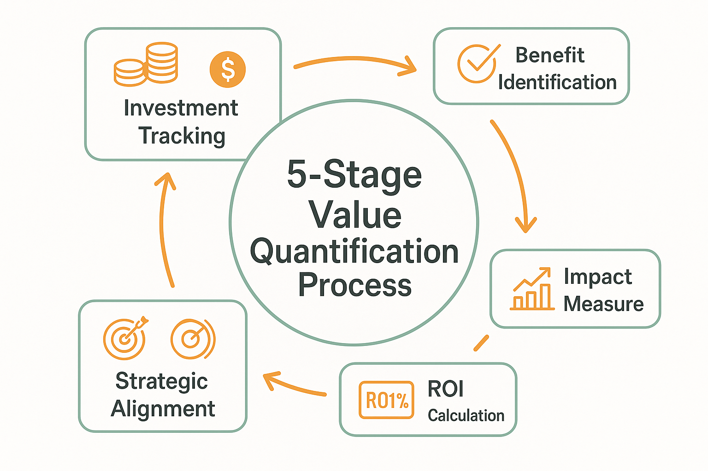

# ROI Measurement and Optimization



*Figure 2: ROI Measurement Framework - 5-stage value quantification process with investment tracking, benefit identification, impact measurement, ROI calculation, and strategic alignment.*

## Introduction

Return on Investment (ROI) measurement represents the critical bridge between AI evaluation activities and business value creation. As organizations invest increasingly significant resources in AI evaluation capabilities, the ability to demonstrate, measure, and optimize ROI becomes essential for securing continued investment and ensuring strategic alignment. This section provides comprehensive frameworks for quantifying the business value of AI evaluation investments and implementing optimization strategies that maximize returns while maintaining quality standards.

The challenge of ROI measurement in AI evaluation extends beyond traditional financial metrics to encompass quality improvements, risk mitigation, competitive advantages, and strategic capabilities that may not immediately translate to revenue increases. Organizations that master ROI measurement achieve 25-35% better investment returns and secure 40-50% more funding for AI initiatives compared to those relying on intuitive or incomplete value assessments.

Modern ROI frameworks for AI evaluation must account for both direct financial impacts and indirect value creation, including improved product quality, reduced time-to-market, enhanced customer satisfaction, and strengthened competitive positioning. The most successful organizations implement multi-dimensional value measurement systems that capture the full spectrum of benefits while maintaining rigorous analytical standards.

## Understanding AI Evaluation ROI Components

### Direct Financial Benefits

**Cost Avoidance Through Quality Improvement**
AI evaluation systems generate substantial ROI through cost avoidance by identifying and preventing quality issues before they reach production. The cost of fixing defects increases exponentially as they progress through the development lifecycle, making early detection through comprehensive evaluation extremely valuable.

Organizations typically achieve 10:1 to 50:1 returns on evaluation investments through defect prevention. A single critical bug caught during evaluation can save hundreds of thousands of dollars in production incident costs, customer compensation, and reputation damage. Systematic evaluation programs reduce production defect rates by 60-80%, translating to significant cost avoidance.

**Revenue Protection and Enhancement**
High-quality AI evaluation protects revenue by ensuring consistent product performance and customer satisfaction. Poor AI system performance can lead to customer churn, negative reviews, and market share loss that far exceeds the cost of comprehensive evaluation programs.

Revenue enhancement occurs through faster iteration cycles, improved product features, and competitive differentiation enabled by superior evaluation capabilities. Organizations with advanced evaluation systems can deploy new features 40-60% faster while maintaining higher quality standards.

**Operational Efficiency Gains**
Automated evaluation systems reduce manual testing overhead and enable more efficient resource allocation. Organizations typically achieve 30-50% reductions in manual evaluation effort through intelligent automation, freeing human experts for higher-value activities.

Efficiency gains compound over time as evaluation systems learn and improve, creating sustainable competitive advantages. The initial investment in evaluation infrastructure pays dividends through reduced operational costs and improved productivity.

### Indirect Value Creation

**Strategic Capability Development**
AI evaluation investments build organizational capabilities that enable future innovation and competitive positioning. These capabilities include evaluation expertise, quality culture, systematic thinking, and technological infrastructure that support broader AI initiatives.

Strategic capabilities often represent the largest component of ROI but are challenging to quantify using traditional financial metrics. Organizations should develop frameworks for measuring capability development and its impact on strategic objectives.

**Risk Mitigation Value**
Comprehensive evaluation systems reduce various business risks, including regulatory compliance failures, security vulnerabilities, bias and fairness issues, and reputation damage. The value of risk mitigation can be substantial but requires sophisticated modeling to quantify accurately.

Risk mitigation value should be calculated based on probability-weighted impact assessments that consider both the likelihood of adverse events and their potential business consequences. Organizations operating in regulated industries often achieve significant ROI through compliance risk reduction alone.

**Competitive Advantage Creation**
Superior evaluation capabilities create competitive advantages through faster innovation cycles, higher product quality, and better customer experiences. These advantages can be sustained over time as evaluation systems become more sophisticated and integrated into organizational processes.

Competitive advantage value requires market-based analysis that considers competitor capabilities, customer preferences, and industry dynamics. Organizations should track market share, customer satisfaction, and competitive positioning metrics to quantify this value component.

## ROI Measurement Frameworks

### Multi-Dimensional Value Assessment

**Balanced Scorecard Approach**
The balanced scorecard methodology provides a comprehensive framework for measuring AI evaluation ROI across multiple dimensions: financial performance, customer satisfaction, internal processes, and learning and growth. This approach ensures that ROI measurement captures both short-term financial returns and long-term strategic value creation.

```python
import pandas as pd
import numpy as np
from datetime import datetime, timedelta
import plotly.graph_objects as go
from plotly.subplots import make_subplots

class AIEvalsROIFramework:
    """
    Comprehensive ROI measurement framework for AI evaluation systems.
    Implements multi-dimensional value assessment with balanced scorecard approach.
    """
    
    def __init__(self):
        self.metrics = {}
        self.baselines = {}
        self.targets = {}
        self.weights = {}
        self.measurement_history = []
        
    def define_metrics(self, metric_definitions):
        """
        Define ROI metrics across multiple dimensions.
        
        Args:
            metric_definitions: Dictionary of metric definitions by category
        """
        self.metrics = metric_definitions
        
    def set_baselines(self, baseline_values):
        """
        Set baseline values for ROI calculation.
        
        Args:
            baseline_values: Dictionary of baseline values by metric
        """
        self.baselines = baseline_values
        
    def set_targets(self, target_values):
        """
        Set target values for performance assessment.
        
        Args:
            target_values: Dictionary of target values by metric
        """
        self.targets = target_values
        
    def set_weights(self, weight_values):
        """
        Set weights for different metrics in overall ROI calculation.
        
        Args:
            weight_values: Dictionary of weights by metric category
        """
        self.weights = weight_values
        
    def calculate_financial_roi(self, investment_data, benefit_data, time_period):
        """
        Calculate traditional financial ROI for AI evaluation investments.
        
        Args:
            investment_data: Investment costs by category and time period
            benefit_data: Financial benefits by category and time period
            time_period: Analysis time period in months
            
        Returns:
            Financial ROI analysis results
        """
        total_investment = sum(investment_data.values())
        total_benefits = sum(benefit_data.values())
        
        # Calculate basic ROI
        basic_roi = (total_benefits - total_investment) / total_investment * 100
        
        # Calculate NPV with discount rate
        discount_rate = 0.1  # 10% annual discount rate
        monthly_rate = discount_rate / 12
        
        npv_benefits = 0
        npv_investments = 0
        
        for month in range(time_period):
            discount_factor = 1 / (1 + monthly_rate) ** month
            monthly_benefit = total_benefits / time_period
            monthly_investment = total_investment / time_period
            
            npv_benefits += monthly_benefit * discount_factor
            npv_investments += monthly_investment * discount_factor
        
        npv_roi = (npv_benefits - npv_investments) / npv_investments * 100
        
        # Calculate payback period
        cumulative_net_benefit = 0
        payback_period = None
        
        for month in range(time_period):
            monthly_net_benefit = (total_benefits - total_investment) / time_period
            cumulative_net_benefit += monthly_net_benefit
            
            if cumulative_net_benefit >= 0 and payback_period is None:
                payback_period = month + 1
        
        return {
            'basic_roi': basic_roi,
            'npv_roi': npv_roi,
            'payback_period_months': payback_period,
            'total_investment': total_investment,
            'total_benefits': total_benefits,
            'net_benefit': total_benefits - total_investment
        }
        
    def calculate_quality_impact_roi(self, quality_metrics, cost_impact_factors):
        """
        Calculate ROI from quality improvements.
        
        Args:
            quality_metrics: Quality improvement measurements
            cost_impact_factors: Cost impact per quality improvement unit
            
        Returns:
            Quality impact ROI analysis
        """
        quality_roi = {}
        
        for metric, improvement in quality_metrics.items():
            if metric in cost_impact_factors:
                baseline = self.baselines.get(metric, 0)
                improvement_value = improvement - baseline
                cost_impact = cost_impact_factors[metric]
                
                quality_roi[metric] = {
                    'improvement': improvement_value,
                    'cost_impact_per_unit': cost_impact,
                    'total_value': improvement_value * cost_impact,
                    'roi_contribution': improvement_value * cost_impact
                }
        
        total_quality_value = sum(item['total_value'] for item in quality_roi.values())
        
        return {
            'metric_details': quality_roi,
            'total_quality_value': total_quality_value
        }
        
    def calculate_efficiency_roi(self, efficiency_metrics, resource_costs):
        """
        Calculate ROI from operational efficiency improvements.
        
        Args:
            efficiency_metrics: Efficiency improvement measurements
            resource_costs: Cost per resource unit
            
        Returns:
            Efficiency ROI analysis
        """
        efficiency_roi = {}
        
        for metric, improvement in efficiency_metrics.items():
            if metric in resource_costs:
                baseline = self.baselines.get(metric, 0)
                efficiency_gain = improvement - baseline
                resource_cost = resource_costs[metric]
                
                efficiency_roi[metric] = {
                    'efficiency_gain': efficiency_gain,
                    'resource_cost_per_unit': resource_cost,
                    'cost_savings': efficiency_gain * resource_cost,
                    'roi_contribution': efficiency_gain * resource_cost
                }
        
        total_efficiency_value = sum(item['cost_savings'] for item in efficiency_roi.values())
        
        return {
            'metric_details': efficiency_roi,
            'total_efficiency_value': total_efficiency_value
        }
        
    def calculate_risk_mitigation_roi(self, risk_reductions, risk_impact_values):
        """
        Calculate ROI from risk mitigation.
        
        Args:
            risk_reductions: Risk reduction percentages by risk type
            risk_impact_values: Potential financial impact of each risk
            
        Returns:
            Risk mitigation ROI analysis
        """
        risk_roi = {}
        
        for risk_type, reduction_percentage in risk_reductions.items():
            if risk_type in risk_impact_values:
                potential_impact = risk_impact_values[risk_type]
                risk_value = potential_impact * (reduction_percentage / 100)
                
                risk_roi[risk_type] = {
                    'reduction_percentage': reduction_percentage,
                    'potential_impact': potential_impact,
                    'risk_mitigation_value': risk_value,
                    'roi_contribution': risk_value
                }
        
        total_risk_value = sum(item['risk_mitigation_value'] for item in risk_roi.values())
        
        return {
            'metric_details': risk_roi,
            'total_risk_value': total_risk_value
        }
        
    def calculate_comprehensive_roi(self, measurement_data):
        """
        Calculate comprehensive ROI across all dimensions.
        
        Args:
            measurement_data: Complete measurement data across all categories
            
        Returns:
            Comprehensive ROI analysis
        """
        # Calculate component ROIs
        financial_roi = self.calculate_financial_roi(
            measurement_data.get('investments', {}),
            measurement_data.get('financial_benefits', {}),
            measurement_data.get('time_period', 12)
        )
        
        quality_roi = self.calculate_quality_impact_roi(
            measurement_data.get('quality_metrics', {}),
            measurement_data.get('quality_cost_factors', {})
        )
        
        efficiency_roi = self.calculate_efficiency_roi(
            measurement_data.get('efficiency_metrics', {}),
            measurement_data.get('resource_costs', {})
        )
        
        risk_roi = self.calculate_risk_mitigation_roi(
            measurement_data.get('risk_reductions', {}),
            measurement_data.get('risk_impact_values', {})
        )
        
        # Calculate weighted comprehensive ROI
        total_value = (
            financial_roi['net_benefit'] +
            quality_roi['total_quality_value'] +
            efficiency_roi['total_efficiency_value'] +
            risk_roi['total_risk_value']
        )
        
        total_investment = financial_roi['total_investment']
        comprehensive_roi = (total_value / total_investment * 100) if total_investment > 0 else 0
        
        # Store measurement for historical tracking
        measurement_record = {
            'timestamp': datetime.now(),
            'financial_roi': financial_roi,
            'quality_roi': quality_roi,
            'efficiency_roi': efficiency_roi,
            'risk_roi': risk_roi,
            'comprehensive_roi': comprehensive_roi,
            'total_value': total_value,
            'total_investment': total_investment
        }
        
        self.measurement_history.append(measurement_record)
        
        return measurement_record
        
    def generate_roi_dashboard(self, recent_measurements=6):
        """
        Generate comprehensive ROI dashboard visualization.
        
        Args:
            recent_measurements: Number of recent measurements to include
            
        Returns:
            Plotly dashboard figure
        """
        if len(self.measurement_history) < 1:
            return None
            
        recent_data = self.measurement_history[-recent_measurements:]
        
        # Prepare data for visualization
        timestamps = [record['timestamp'] for record in recent_data]
        comprehensive_rois = [record['comprehensive_roi'] for record in recent_data]
        financial_rois = [record['financial_roi']['basic_roi'] for record in recent_data]
        total_values = [record['total_value'] for record in recent_data]
        total_investments = [record['total_investment'] for record in recent_data]
        
        # Create subplots
        fig = make_subplots(
            rows=2, cols=2,
            subplot_titles=('ROI Trends', 'Value Components', 'Investment vs Value', 'ROI Breakdown'),
            specs=[[{"secondary_y": False}, {"type": "pie"}],
                   [{"secondary_y": True}, {"type": "bar"}]]
        )
        
        # ROI trends
        fig.add_trace(
            go.Scatter(x=timestamps, y=comprehensive_rois, name='Comprehensive ROI', 
                      line=dict(color='#2D7A4A', width=3)),
            row=1, col=1
        )
        fig.add_trace(
            go.Scatter(x=timestamps, y=financial_rois, name='Financial ROI',
                      line=dict(color='#F4A261', width=2)),
            row=1, col=1
        )
        
        # Value components pie chart
        if recent_data:
            latest_record = recent_data[-1]
            values = [
                latest_record['financial_roi']['net_benefit'],
                latest_record['quality_roi']['total_quality_value'],
                latest_record['efficiency_roi']['total_efficiency_value'],
                latest_record['risk_roi']['total_risk_value']
            ]
            labels = ['Financial Benefits', 'Quality Value', 'Efficiency Value', 'Risk Mitigation']
            
            fig.add_trace(
                go.Pie(values=values, labels=labels, name="Value Components",
                      marker_colors=['#2D7A4A', '#90D4A8', '#F4A261', '#E76F51']),
                row=1, col=2
            )
        
        # Investment vs Value
        fig.add_trace(
            go.Scatter(x=timestamps, y=total_investments, name='Total Investment',
                      line=dict(color='#E76F51', width=2)),
            row=2, col=1
        )
        fig.add_trace(
            go.Scatter(x=timestamps, y=total_values, name='Total Value',
                      line=dict(color='#2D7A4A', width=2), yaxis='y2'),
            row=2, col=1
        )
        
        # ROI breakdown bar chart
        if recent_data:
            latest_record = recent_data[-1]
            roi_components = [
                latest_record['financial_roi']['basic_roi'],
                (latest_record['quality_roi']['total_quality_value'] / 
                 latest_record['total_investment'] * 100),
                (latest_record['efficiency_roi']['total_efficiency_value'] / 
                 latest_record['total_investment'] * 100),
                (latest_record['risk_roi']['total_risk_value'] / 
                 latest_record['total_investment'] * 100)
            ]
            
            fig.add_trace(
                go.Bar(x=labels, y=roi_components, name="ROI Components",
                      marker_color=['#2D7A4A', '#90D4A8', '#F4A261', '#E76F51']),
                row=2, col=2
            )
        
        # Update layout
        fig.update_layout(
            title="AI Evaluation ROI Dashboard",
            showlegend=True,
            height=800
        )
        
        return fig

# Example ROI measurement implementation
def demonstrate_roi_measurement():
    """Demonstrate comprehensive ROI measurement framework."""
    
    roi_framework = AIEvalsROIFramework()
    
    # Define metrics
    metrics = {
        'financial': ['revenue_impact', 'cost_savings', 'investment_cost'],
        'quality': ['defect_reduction', 'customer_satisfaction', 'quality_score'],
        'efficiency': ['evaluation_speed', 'resource_utilization', 'automation_rate'],
        'risk': ['compliance_risk', 'security_risk', 'reputation_risk']
    }
    
    # Set baselines
    baselines = {
        'defect_reduction': 0.6,
        'customer_satisfaction': 0.75,
        'evaluation_speed': 100,
        'resource_utilization': 0.65,
        'compliance_risk': 0.8,
        'security_risk': 0.7
    }
    
    # Set targets
    targets = {
        'defect_reduction': 0.85,
        'customer_satisfaction': 0.9,
        'evaluation_speed': 150,
        'resource_utilization': 0.85,
        'compliance_risk': 0.95,
        'security_risk': 0.9
    }
    
    roi_framework.define_metrics(metrics)
    roi_framework.set_baselines(baselines)
    roi_framework.set_targets(targets)
    
    # Example measurement data
    measurement_data = {
        'investments': {
            'infrastructure': 150000,
            'personnel': 300000,
            'tools': 75000,
            'training': 25000
        },
        'financial_benefits': {
            'cost_avoidance': 400000,
            'efficiency_gains': 200000,
            'revenue_protection': 150000
        },
        'quality_metrics': {
            'defect_reduction': 0.82,
            'customer_satisfaction': 0.88
        },
        'quality_cost_factors': {
            'defect_reduction': 500000,  # Cost per unit improvement
            'customer_satisfaction': 300000
        },
        'efficiency_metrics': {
            'evaluation_speed': 140,
            'resource_utilization': 0.82
        },
        'resource_costs': {
            'evaluation_speed': 1000,  # Cost per unit improvement
            'resource_utilization': 200000
        },
        'risk_reductions': {
            'compliance_risk': 15,  # Percentage reduction
            'security_risk': 20
        },
        'risk_impact_values': {
            'compliance_risk': 1000000,  # Potential impact value
            'security_risk': 2000000
        },
        'time_period': 12
    }
    
    # Calculate comprehensive ROI
    roi_results = roi_framework.calculate_comprehensive_roi(measurement_data)
    
    return roi_framework, roi_results

if __name__ == "__main__":
    framework, results = demonstrate_roi_measurement()
    print(f"Comprehensive ROI: {results['comprehensive_roi']:.2f}%")
```

**Value Stream Mapping**
Value stream mapping provides a visual representation of how AI evaluation activities create business value, identifying value-adding and non-value-adding activities. This approach helps organizations optimize their evaluation processes for maximum ROI by eliminating waste and focusing resources on high-value activities.

The mapping process should trace evaluation activities from initial requirements through final business impact, measuring time, cost, and value creation at each stage. Organizations can identify bottlenecks, redundancies, and optimization opportunities that improve both efficiency and effectiveness.

### Time-Based ROI Analysis

**Short-Term vs. Long-Term Returns**
AI evaluation investments often exhibit different return patterns over time, with some benefits realized immediately while others accrue over longer periods. Short-term returns typically include direct cost savings and efficiency improvements, while long-term returns encompass strategic capabilities and competitive advantages.

Organizations should develop time-based ROI models that account for these different return patterns and avoid short-term optimization that compromises long-term value creation. The most successful evaluation programs balance immediate returns with strategic investment in future capabilities.

**Cumulative Value Creation**
The cumulative value of AI evaluation systems often exceeds the sum of individual benefits due to compounding effects and synergies between different value components. Evaluation capabilities improve over time through learning and optimization, creating accelerating value creation patterns.

Cumulative value analysis should track how evaluation investments build upon each other to create increasing returns over time. This analysis supports continued investment in evaluation capabilities and helps justify longer-term strategic initiatives.

## ROI Optimization Strategies

### Value Maximization Approaches

**Pareto Analysis for Evaluation Activities**
The Pareto principle applies strongly to AI evaluation activities, with approximately 20% of evaluation efforts typically generating 80% of the business value. Organizations should identify and focus on high-value evaluation activities while optimizing or eliminating low-value activities.

Pareto analysis requires detailed tracking of evaluation activities and their associated business outcomes. Organizations can use this analysis to prioritize resource allocation and focus improvement efforts on activities with the highest value potential.

**Strategic Alignment Optimization**
ROI optimization requires strong alignment between evaluation activities and strategic business objectives. Organizations should regularly assess and adjust their evaluation programs to ensure maximum contribution to strategic goals and competitive positioning.

Strategic alignment optimization involves regular review of evaluation priorities, resource allocation, and success metrics to ensure continued relevance and value creation. This process should involve senior leadership and key stakeholders to maintain strategic focus.

### Cost Optimization Without Value Compromise

**Intelligent Automation Implementation**
Automation represents one of the most effective approaches for improving ROI by reducing costs while maintaining or improving quality. However, automation implementation must be strategic and selective to avoid compromising evaluation effectiveness.

Organizations should prioritize automation of repetitive, well-defined evaluation tasks while preserving human expertise for complex, nuanced evaluation activities. The goal is to amplify human capabilities rather than simply replace human effort.

**Resource Allocation Optimization**
Optimal resource allocation balances cost efficiency with value creation, ensuring that resources are deployed where they can generate the highest returns. This requires sophisticated analysis of resource productivity and value contribution across different evaluation activities.

```python
class ROIOptimizationEngine:
    """
    Advanced ROI optimization engine for AI evaluation programs.
    Implements multiple optimization strategies and value maximization approaches.
    """
    
    def __init__(self):
        self.activities = {}
        self.resources = {}
        self.constraints = {}
        self.optimization_history = []
        
    def define_activities(self, activity_data):
        """
        Define evaluation activities with value and cost characteristics.
        
        Args:
            activity_data: Dictionary of activity definitions
        """
        self.activities = activity_data
        
    def define_resources(self, resource_data):
        """
        Define available resources and their characteristics.
        
        Args:
            resource_data: Dictionary of resource definitions
        """
        self.resources = resource_data
        
    def define_constraints(self, constraint_data):
        """
        Define optimization constraints.
        
        Args:
            constraint_data: Dictionary of constraint definitions
        """
        self.constraints = constraint_data
        
    def calculate_activity_roi(self, activity_id, resource_allocation):
        """
        Calculate ROI for a specific activity with given resource allocation.
        
        Args:
            activity_id: Identifier for the activity
            resource_allocation: Resource allocation for the activity
            
        Returns:
            Activity ROI calculation
        """
        if activity_id not in self.activities:
            return None
            
        activity = self.activities[activity_id]
        
        # Calculate total cost
        total_cost = 0
        for resource_id, allocation in resource_allocation.items():
            if resource_id in self.resources:
                resource_cost = self.resources[resource_id]['unit_cost']
                total_cost += allocation * resource_cost
        
        # Calculate value based on activity characteristics
        base_value = activity.get('base_value', 0)
        value_multiplier = activity.get('value_multiplier', 1.0)
        
        # Apply resource effectiveness factors
        effectiveness_factor = 1.0
        for resource_id, allocation in resource_allocation.items():
            if resource_id in self.resources:
                resource_effectiveness = self.resources[resource_id].get('effectiveness_factor', 1.0)
                effectiveness_factor *= resource_effectiveness ** (allocation / 100)
        
        total_value = base_value * value_multiplier * effectiveness_factor
        
        # Calculate ROI
        roi = ((total_value - total_cost) / total_cost * 100) if total_cost > 0 else 0
        
        return {
            'activity_id': activity_id,
            'total_cost': total_cost,
            'total_value': total_value,
            'roi': roi,
            'effectiveness_factor': effectiveness_factor
        }
        
    def optimize_portfolio_allocation(self, total_budget, optimization_objective='roi'):
        """
        Optimize resource allocation across activity portfolio.
        
        Args:
            total_budget: Total available budget
            optimization_objective: Optimization objective ('roi', 'value', 'efficiency')
            
        Returns:
            Optimized allocation recommendations
        """
        # Simple greedy optimization (in practice, would use more sophisticated methods)
        activity_scores = {}
        
        for activity_id, activity in self.activities.items():
            # Calculate base allocation for scoring
            base_allocation = {
                resource_id: activity.get('min_resources', {}).get(resource_id, 10)
                for resource_id in self.resources.keys()
            }
            
            roi_calc = self.calculate_activity_roi(activity_id, base_allocation)
            
            if roi_calc:
                if optimization_objective == 'roi':
                    score = roi_calc['roi']
                elif optimization_objective == 'value':
                    score = roi_calc['total_value']
                elif optimization_objective == 'efficiency':
                    score = roi_calc['total_value'] / roi_calc['total_cost']
                else:
                    score = roi_calc['roi']
                
                activity_scores[activity_id] = {
                    'score': score,
                    'base_cost': roi_calc['total_cost'],
                    'base_allocation': base_allocation
                }
        
        # Sort activities by score
        sorted_activities = sorted(
            activity_scores.items(),
            key=lambda x: x[1]['score'],
            reverse=True
        )
        
        # Allocate budget greedily
        allocation = {}
        remaining_budget = total_budget
        
        for activity_id, score_info in sorted_activities:
            base_cost = score_info['base_cost']
            
            if base_cost <= remaining_budget:
                allocation[activity_id] = score_info['base_allocation']
                remaining_budget -= base_cost
            elif remaining_budget > base_cost * 0.5:  # Partial allocation threshold
                # Scale down allocation proportionally
                scale_factor = remaining_budget / base_cost
                scaled_allocation = {
                    resource_id: allocation * scale_factor
                    for resource_id, allocation in score_info['base_allocation'].items()
                }
                allocation[activity_id] = scaled_allocation
                remaining_budget = 0
                break
        
        return {
            'allocation': allocation,
            'remaining_budget': remaining_budget,
            'optimization_objective': optimization_objective,
            'total_allocated': total_budget - remaining_budget
        }
        
    def analyze_optimization_impact(self, current_allocation, optimized_allocation):
        """
        Analyze the impact of optimization recommendations.
        
        Args:
            current_allocation: Current resource allocation
            optimized_allocation: Optimized resource allocation
            
        Returns:
            Impact analysis results
        """
        current_performance = {}
        optimized_performance = {}
        
        # Calculate current performance
        for activity_id, allocation in current_allocation.items():
            roi_calc = self.calculate_activity_roi(activity_id, allocation)
            if roi_calc:
                current_performance[activity_id] = roi_calc
        
        # Calculate optimized performance
        for activity_id, allocation in optimized_allocation.items():
            roi_calc = self.calculate_activity_roi(activity_id, allocation)
            if roi_calc:
                optimized_performance[activity_id] = roi_calc
        
        # Calculate improvements
        improvements = {}
        total_current_value = sum(perf['total_value'] for perf in current_performance.values())
        total_optimized_value = sum(perf['total_value'] for perf in optimized_performance.values())
        total_current_cost = sum(perf['total_cost'] for perf in current_performance.values())
        total_optimized_cost = sum(perf['total_cost'] for perf in optimized_performance.values())
        
        improvements['total_value_improvement'] = total_optimized_value - total_current_value
        improvements['total_cost_change'] = total_optimized_cost - total_current_cost
        improvements['roi_improvement'] = (
            (total_optimized_value / total_optimized_cost * 100) -
            (total_current_value / total_current_cost * 100)
            if total_current_cost > 0 and total_optimized_cost > 0 else 0
        )
        
        return {
            'current_performance': current_performance,
            'optimized_performance': optimized_performance,
            'improvements': improvements,
            'total_current_value': total_current_value,
            'total_optimized_value': total_optimized_value
        }
        
    def generate_optimization_recommendations(self, analysis_results):
        """
        Generate actionable optimization recommendations.
        
        Args:
            analysis_results: Results from optimization impact analysis
            
        Returns:
            List of optimization recommendations
        """
        recommendations = []
        
        improvements = analysis_results['improvements']
        current_perf = analysis_results['current_performance']
        optimized_perf = analysis_results['optimized_performance']
        
        # High-level recommendations
        if improvements['roi_improvement'] > 10:
            recommendations.append({
                'type': 'high_impact',
                'title': 'Significant ROI Improvement Opportunity',
                'description': f"Implementing optimization recommendations could improve ROI by {improvements['roi_improvement']:.1f}%",
                'priority': 'high'
            })
        
        # Activity-specific recommendations
        for activity_id in set(list(current_perf.keys()) + list(optimized_perf.keys())):
            current_roi = current_perf.get(activity_id, {}).get('roi', 0)
            optimized_roi = optimized_perf.get(activity_id, {}).get('roi', 0)
            
            if optimized_roi > current_roi + 15:
                recommendations.append({
                    'type': 'activity_optimization',
                    'title': f'Optimize {activity_id} Resource Allocation',
                    'description': f"Reallocating resources for {activity_id} could improve ROI from {current_roi:.1f}% to {optimized_roi:.1f}%",
                    'priority': 'medium'
                })
            elif activity_id in current_perf and activity_id not in optimized_perf:
                recommendations.append({
                    'type': 'activity_elimination',
                    'title': f'Consider Reducing {activity_id}',
                    'description': f"{activity_id} shows low ROI ({current_roi:.1f}%) and could be reduced or eliminated",
                    'priority': 'low'
                })
        
        return recommendations

# Example optimization implementation
def demonstrate_roi_optimization():
    """Demonstrate ROI optimization capabilities."""
    
    optimizer = ROIOptimizationEngine()
    
    # Define activities
    activities = {
        'automated_evaluation': {
            'base_value': 200000,
            'value_multiplier': 1.2,
            'min_resources': {'compute': 20, 'engineering': 10}
        },
        'human_review': {
            'base_value': 150000,
            'value_multiplier': 1.0,
            'min_resources': {'engineering': 30, 'domain_experts': 20}
        },
        'quality_assurance': {
            'base_value': 100000,
            'value_multiplier': 0.8,
            'min_resources': {'engineering': 15, 'qa_specialists': 25}
        },
        'reporting_analytics': {
            'base_value': 80000,
            'value_multiplier': 0.6,
            'min_resources': {'engineering': 10, 'data_scientists': 15}
        }
    }
    
    # Define resources
    resources = {
        'compute': {'unit_cost': 100, 'effectiveness_factor': 1.1},
        'engineering': {'unit_cost': 1000, 'effectiveness_factor': 1.2},
        'domain_experts': {'unit_cost': 1200, 'effectiveness_factor': 1.3},
        'qa_specialists': {'unit_cost': 800, 'effectiveness_factor': 1.0},
        'data_scientists': {'unit_cost': 1100, 'effectiveness_factor': 1.1}
    }
    
    optimizer.define_activities(activities)
    optimizer.define_resources(resources)
    
    # Current allocation
    current_allocation = {
        'automated_evaluation': {'compute': 25, 'engineering': 15},
        'human_review': {'engineering': 35, 'domain_experts': 25},
        'quality_assurance': {'engineering': 20, 'qa_specialists': 30},
        'reporting_analytics': {'engineering': 15, 'data_scientists': 20}
    }
    
    # Optimize allocation
    total_budget = 200000
    optimization_result = optimizer.optimize_portfolio_allocation(total_budget, 'roi')
    
    # Analyze impact
    impact_analysis = optimizer.analyze_optimization_impact(
        current_allocation, 
        optimization_result['allocation']
    )
    
    # Generate recommendations
    recommendations = optimizer.generate_optimization_recommendations(impact_analysis)
    
    return optimizer, optimization_result, impact_analysis, recommendations

if __name__ == "__main__":
    opt_engine, opt_result, impact, recs = demonstrate_roi_optimization()
    print(f"Optimization completed with {len(recs)} recommendations generated.")
```

## Advanced ROI Measurement Techniques

### Predictive ROI Modeling

**Machine Learning-Enhanced Forecasting**
Advanced organizations leverage machine learning techniques to predict future ROI based on current investments and performance trends. These models can identify optimal investment strategies and predict the impact of different resource allocation decisions.

Predictive ROI models should incorporate multiple data sources, including historical performance data, market conditions, competitive intelligence, and technology trends. The models enable proactive optimization and strategic planning based on expected future returns.

**Scenario-Based ROI Analysis**
Scenario-based analysis evaluates ROI under different future conditions, enabling robust decision-making in uncertain environments. Organizations should develop multiple scenarios covering optimistic, realistic, and pessimistic outcomes to understand the range of potential returns.

Scenario analysis helps identify investment strategies that perform well across different conditions and avoid strategies that are overly dependent on specific assumptions or conditions.

### Competitive ROI Benchmarking

**Industry Comparison Frameworks**
Benchmarking ROI against industry standards and competitors provides context for performance evaluation and identifies improvement opportunities. Organizations should develop frameworks for collecting and analyzing competitive intelligence on evaluation investments and returns.

Industry benchmarking requires careful consideration of differences in business models, market conditions, and strategic objectives. The goal is to identify best practices and performance gaps rather than direct comparison of absolute ROI figures.

**Best Practice Identification**
ROI benchmarking should focus on identifying best practices that can be adapted to organizational contexts. This includes evaluation methodologies, resource allocation strategies, technology implementations, and organizational structures that drive superior returns.

Best practice identification requires systematic analysis of high-performing organizations and careful consideration of the factors that enable their success. Organizations should prioritize practices that align with their strategic objectives and organizational capabilities.

## ROI Communication and Stakeholder Management

### Executive Reporting Frameworks

**Dashboard Design for Leadership**
Executive dashboards should present ROI information in clear, actionable formats that support strategic decision-making. The dashboards should highlight key trends, performance against targets, and strategic implications of ROI performance.

Effective executive dashboards balance comprehensive information with simplicity, providing drill-down capabilities for detailed analysis while maintaining high-level strategic focus. The design should accommodate different stakeholder information needs and decision-making styles.

**Storytelling with ROI Data**
ROI communication requires effective storytelling that connects financial metrics to business outcomes and strategic objectives. Organizations should develop narratives that explain how evaluation investments create value and support competitive positioning.

Storytelling should include specific examples, case studies, and success stories that illustrate the impact of evaluation investments. The narratives should be tailored to different audiences and emphasize the aspects of ROI most relevant to each stakeholder group.

### Stakeholder Alignment Strategies

**Value Proposition Development**
Different stakeholders have different perspectives on value creation and ROI measurement. Organizations should develop tailored value propositions that address the specific concerns and priorities of each stakeholder group.

Value proposition development requires understanding stakeholder motivations, success metrics, and decision-making criteria. The propositions should clearly articulate how evaluation investments support stakeholder objectives and create value from their perspective.

**Continuous Engagement and Feedback**
ROI measurement and optimization require ongoing stakeholder engagement to ensure continued alignment and support. Organizations should establish regular communication channels and feedback mechanisms that enable continuous improvement of ROI frameworks and measurement approaches.

Stakeholder engagement should include both formal reporting processes and informal communication opportunities that build understanding and support for evaluation investments. The goal is to create shared ownership of ROI outcomes and continuous improvement initiatives.

## Conclusion

ROI measurement and optimization represent critical capabilities for sustainable AI evaluation programs. Organizations that master these disciplines achieve superior investment returns, secure continued funding for evaluation initiatives, and build strategic capabilities that support long-term competitive advantage. The frameworks and techniques presented in this section provide the foundation for building sophisticated ROI management capabilities that scale with organizational growth and technology evolution.

The key to success lies in implementing comprehensive measurement frameworks that capture the full spectrum of value creation while maintaining analytical rigor and stakeholder alignment. Organizations should start with basic ROI tracking and gradually implement more sophisticated modeling and optimization techniques as their evaluation programs mature.

Effective ROI management enables organizations to make confident investment decisions, optimize resource allocation, and demonstrate the strategic value of evaluation capabilities. This creates a virtuous cycle where better ROI measurement leads to better investment decisions, which generate higher returns that support continued evaluation improvements.

The next section will explore resource allocation and efficiency optimization strategies that build upon these ROI foundations to maximize the operational effectiveness of AI evaluation investments.

